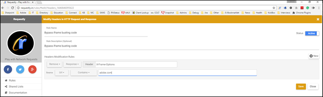

# Solução de problemas relacionados ao [!UICONTROL Visual Experience Composer]

Problemas de exibição às vezes ocorrem no [!DNL Adobe Target] [!UICONTROL Visual Experience Composer] (VEC) sob determinadas condições.

## Quando abro meu site no [!UICONTROL Visual Experience Composer], as bibliotecas do [!DNL Target] não são carregadas. (Somente VEC)  {#section_8A7D3F4AD2CC4C3B823EE9432B97E06F}

[!DNL Target] adiciona dois parâmetros (`mboxEdit=1` e `mboxDisable=1`) ao abrir o site no [!UICONTROL Visual Experience Composer].

Se o site (principalmente, Aplicativos de Página Única) corta parâmetros ou os remove ao navegar de uma página a outra (sem um recarregamento de página), a funcionalidade do [!DNL Target] é interrompida e as bibliotecas do [!DNL Target] não são carregadas.

Para evitar esse problema, assegure-se de não cortar ou remover esses dois parâmetros.

## Minha página não abre no EEC ou carrega lentamente. As atividades ou experiências são carregadas de forma lenta no VEC. (Somente VEC)  {#section_71E7601BE9894E3DA3A7FBBB72B6B0C1}

Vários problemas podem afetar o desempenho da página nos Experience Composers [!UICONTROL Target]. Alguns erros comuns incluem:

* Você não tem uma mbox na página.
* Seu site usa o bloqueio de proxy, que não permite que a página seja aberta em nenhum compositor de experiência.
* Seu site não pode ser aberto em um iFrame.

Se ocorrerem problemas no [!UICONTROL Enhanced Experience Composer], tente desativar o [!UICONTROL Enhanced Experience Composer] e use o [!UICONTROL Visual Experience Composer].

Para desabilitar o [!UICONTROL Enhanced Experience Composer], vá para **[!UICONTROL Administration]** > **[!UICONTROL Visual Experience Composer]** e desative a opção **[!UICONTROL Enable Enhanced Experience Composer]**.

Alguns usuários veem a seguinte mensagem de erro no console:

Se nem o [!UICONTROL Visual Experience Composer] nem o [!UICONTROL Enhanced Experience Composer] funcionarem, use uma extensão de navegador como o [!DNL Requestly] ([!DNL Chrome] ou [!DNL Firefox]) ou o Modify Response Headers (Firefox) que possa substituir as opções do cabeçalho X-Frames para o site e permitir que elas sejam carregadas em iFrames, habilitando o VEC. Se você não conseguir usar extensões de navegador, use o [Experience Composer baseado em formulário](/help/main/c-experiences/form-experience-composer.md).

>[!NOTE]
>
>Além das seguintes informações, você pode usar a [[!DNL Adobe Target] [!UICONTROL Visual Editing Helper] extensão](/help/main/c-experiences/c-visual-experience-composer/r-troubleshoot-composer/visual-editing-helper-extension.md) para [!DNL Google Chrome].

>[!NOTE]
>
>Estes plugins devem ser usados somente no contexto da edição VEC.
>
>Para a extensão [!DNL Requestly], sempre que houver necessidade de remover cabeçalhos, você deve seguir um destes procedimentos:
>
>* Adicione regras de URL ao URL que você deseja abrir no VEC, para que os cabeçalhos sejam removidos apenas para esses URLs.
>
>* Habilite a regra quando estiver editando no VEC e desabilite a regra quando não estiver usando o VEC.
>
>Para a extensão [!UICONTROL Modify Response Header] ([!DNL Firefox]), como não é possível adicionar uma regra de URL, você deve fazer o seguinte:
>
>* Habilite a regra quando estiver editando no VEC e desabilite a regra quando não estiver usando o VEC.

**Para usar a extensão [!DNL Requestly] em [!DNL Chrome] ou [!DNL Firefox]:**

1. Desligue o [!UICONTROL Enhanced Experienced Composer].
1. Instale a extensão de navegador [!DNL Requestly] em [!DNL Chrome] ou [!DNL Firefox].
1. Abra a extensão e configure-a usando o seguinte:
1. Selecione **[!UICONTROL Modify headers]**.
1. Digite o seguinte:

   * Nome da regra
   * Regras de modificação

      * Alternar **[!UICONTROL Add]** para **[!UICONTROL Remove]**.
      * Alternar **[!UICONTROL Request]** para **[!UICONTROL Response]**.
      * Digite &quot;X-Frame-Options&quot; como o nome do cabeçalho.
      * Repita as etapas anteriores e digite &quot;x-frame-options&quot; como nome do cabeçalho.

        >[!NOTE]
        >
        >Os cabeçalhos manipulados via [!DNL Requestly] diferenciam maiúsculas de minúsculas.

      * Altere **[!UICONTROL Equals]** para **[!UICONTROL Contains]** como a condição para a URL de origem e insira a URL da atividade que você está tentando carregar no VEC.

     

1. Clique em **[!UICONTROL Save]**.

   

   Agora é possível carregar a página rapidamente com o [!UICONTROL Visual Experience Composer].

**Para usar a extensão [!DNL Modify Response Headers] em [!UICONTROL Firefox]:**

1. Instale o [!UICONTROL Modify Response Headers] em [!DNL Firefox] e reinicie o navegador.
1. Em suas extensões do [!DNL Firefox], selecione a extensão Modificar Cabeçalhos de Resposta.
1. Clique em **[!UICONTROL Preferences]**.
1. Selecione **[!UICONTROL Filter]** no menu suspenso [!UICONTROL Action].
1. No campo [!UICONTROL Header Name], digite: **[!UICONTROL X-Frame-Options]**.
1. Repita as etapas 4 e 5 para adicionar um filtro com **[!UICONTROL x-frame-options]**.
1. Clique em **[!UICONTROL Add]**.
1. Clique em **[!UICONTROL Start]**.

Após configurar uma extensão, abra o [!DNL Target]. Suas páginas agora devem ser carregadas no [!UICONTROL Visual Experience Composer], mesmo que o [!UICONTROL Enhanced Experience Composer] esteja desativado.

## Minha página não é exibida no VEC (somente VEC)  {#does-not-load}

* A melhor compatibilidade com o VEC é garantida pela versão mais recente da extensão: [[!DNL Adobe Experience Cloud] [!UICONTROL Visual Editing Helper extension]](/help/main/c-experiences/c-visual-experience-composer/r-troubleshoot-composer/visual-editing-helper-extension.md).

  Para verificar se você está usando a versão mais recente, vá para [!UICONTROL Extensions] > [!UICONTROL Manage Extensions] e clique em [!UICONTROL Details].

* O [!UICONTROL Visual Experience Composer] requer a criação de bibliotecas para realizar modificações na página da Web. Essas bibliotecas são incorporadas à biblioteca at.js e são baixadas pela extensão dos servidores do [!DNL Adobe] sempre que o VEC é usado.

  A extensão baixa a biblioteca at.js independentemente de a at.js ou o [!DNL Adobe Experience Platform Web SDK] já estarem incluídos na página.

  Verifique se não há alterações inválidas adicionadas aos cabeçalhos do at.js configurados na seção [!UICONTROL Administration] > [!UICONTROL Implementation].

* Certifique-se de que a página da Web não esteja bloqueando solicitações obrigatórias para carregamento quando incorporada a um iFrame. Isso inclui o uso de diretivas CSP frame-ancestors ou o código JS personalizado incorporado no site do cliente, tags meta HTML ou o cabeçalho x-frame-options.

* Certifique-se de que o JavaScript da página da Web não interfira nas bibliotecas de criação. Não use ou inclua arquivos usando os seguintes nomes reservados:

   * `target-vec-helper.js`
   * `target-vec.js`
   * `target.js`
   * `admin.css`
   * `sizzle.js`
   * `mixContentCheck.html`

     Além disso, a substituição acidental de variáveis ou eventos definidos nesses arquivos pode levar a problemas com o VEC.

* O navegador está bloqueando uma página não segura em um site seguro.

  Clique no ícone à esquerda da URL na barra de endereços do navegador e clique em **[!UICONTROL Disable protection on this page]**

* Você inseriu um URL inválido.
* Se o site não carregar no VEC ou se comportar inesperadamente, uma possível correção é aceitar cookies no site no navegador antes de tentar carregá-lo no [!DNL Target].

## O VEC aparece interrompido quando uso o modo de navegação. (Somente VEC)  {#section_FA2A18E8FD6A4274B2E395DBAA2FB407}

Ao usar o modo de navegação, se você acessar uma URL que não tem bibliotecas do [!DNL Target] implementadas ([at.js](https://experienceleague.adobe.com/docs/target-dev/developer/client-side/at-js-implementation/overview.html?lang=pt-BR){target=_blank} ou [Adobe Experience Platform Web SDK](https://experienceleague.adobe.com/docs/target-dev/developer/client-side/aep-web-sdk.html?lang=pt-BR){target=_blank}) ou que contém um cabeçalho frame-buster, o VEC parece interrompido. Devido a preocupações de segurança do navegador, o [!DNL Target] não pode acessar corretamente a URL para a qual você navegou ou a URL do VEC não é atualizada de forma consistente se a página for carregada.

Esse problema ocorre porque o VEC carrega a página da Web em um `<iframe>`. Os mecanismos de segurança atuais dos navegadores impedem que a interface do usuário [!DNL Target] acesse os elementos do quadro fornecido devido à política de mesma origem. Os navegadores bloqueiam scripts que tentam acessar um quadro com uma origem diferente e que inclui informações como `location.href`.

Você deve usar a nova [extensão do Auxiliar de Edição Visual](/help/main/c-experiences/c-visual-experience-composer/r-troubleshoot-composer/visual-editing-helper-extension.md) (recomendável) ou a [extensão antiga](/help/main/c-experiences/c-visual-experience-composer/r-troubleshoot-composer/vec-helper-browser-extension.md) para inserir a biblioteca [!DNL Target] nas páginas para navegá-las de forma ideal.

## Problemas causados por conflitos CSS no [!UICONTROL Visual Experience Composer]

Verifique se há algum arquivo CSS que possa afetar a visibilidade ao carregar a página da Web no editor. Por exemplo, usar a propriedade `overflow: hidden` no corpo da página pode levar a problemas de rolagem ou acionar eventos de clique que podem interferir no menu de criação.
