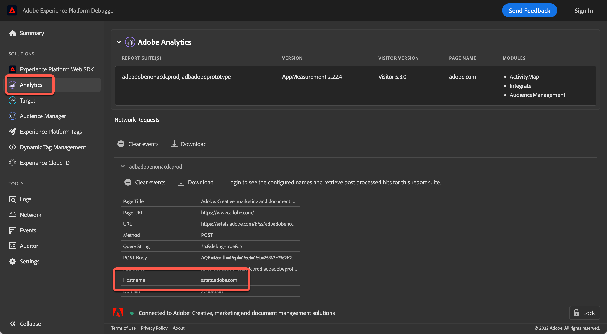

# Use um [!DNL Analytics] servidor de rastreamento

Se você estiver usando uma versão mais antiga da at.js, deverá especificar um [!DNL Analytics] servidor de rastreamento para atividades que usam [!DNL Adobe Analytics] para [!DNL Adobe Target] (A4T).

>[!NOTE]
>
>Você não precisa especificar um servidor de rastreamento durante a criação da atividade se estiver usando a at.js versão 0.9.1 (ou posterior). A biblioteca at.js envia automaticamente os valores do servidor de rastreamento ao [!DNL Target]. Durante a criação da atividade, é possível deixar o campo [!UICONTROL Servidor de rastreamento] em branco na página [!UICONTROL Metas e configurações].
>
>A variável [!DNL Target] A equipe do oferece suporte à at.js 1.*x* e at.js 2.*x*. Atualize para a atualização mais recente de qualquer versão principal do at.js para garantir que você esteja executando uma versão compatível. Para obter mais informações, consulte [detalhes da versão do at.js](https://experienceleague.adobe.com/docs/target-dev/developer/client-side/at-js-implementation/target-atjs-versions.html){target=_blank}.

Para garantir que os dados de [!DNL Target] vai para o local correto no [!DNL Analytics], O A4T requer um [!DNL Analytics] servidor de rastreamento a ser enviado em todas as chamadas para Modstats de [!DNL Target]. Para implementações que usam vários servidores de rastreamento, use o [!DNL Adobe Experience Platform Debugger] ou nas Ferramentas do desenvolvedor do seu navegador para determinar o servidor de rastreamento correto para sua atividade.

## Obtenha o [!DNL Analytics] servidor de rastreamento usando o [!DNL Adobe Experience Platform Debugger]

O depurador deve ser exibido em uma página onde a atividade é entregue para garantir que você selecione o servidor de rastreamento correto. Também é possível pode especificar um servidor de rastreamento padrão para cada conta. Entre em contato com o Atendimento ao cliente para especificar ou modificar o padrão.

1. Na página em que você está criando sua atividade, abra o [!DNL Adobe Experience Platform Debugger].

   Se você não tiver instalado o depurador, consulte [Visão geral do Adobe Experience Platform Debugger](https://experienceleague.adobe.com/docs/platform-learn/data-collection/debugger/overview.html).

1. Clique em **[!UICONTROL Analytics]** no menu de navegação esquerdo.

   

   A variável [!DNL Analytics] o servidor de rastreamento do é encontrado no [!UICONTROL Nome do host] seção do depurador.

   * **Servidor de rastreamento próprio**: se o nome de host da solicitação corresponder ao domínio em que você está, ele será um servidor de rastreamento primário. Por exemplo, se você estiver em `adobe.com`, `adobe.com` é o servidor de rastreamento primário.
   * **Servidor de rastreamento de terceiros**: normalmente, um servidor de rastreamento de terceiros é `[company].sc.omtrdc.net` onde a empresa é o nome da sua empresa, mas sempre termina em `sc.omtrdc.net`.
   * **Implementações CNAME**: `sstats.adobe.com` O é um exemplo de um servidor de rastreamento próprio CNAME para uma solicitação https (segura). `stats.adobe.com` O é um exemplo de uma solicitação primária CNAME para uma página http (não segura).

1. Copie todo o conteúdo do campo.

1. Na seção **[!UICONTROL Configurações de relatório]** da tela **[!UICONTROL Meta e configurações]****[!UICONTROL da atividade, cole as informações do servidor de rastreamento no campo Servidor de rastreamento.]**

   >[!NOTE]
   >
   >Selecionar [!UICONTROL Analytics como Fonte de relatórios] para sua atividade no [!UICONTROL Servidor de rastreamento] disponível.

## Obtenha o [!DNL Analytics] usando as Ferramentas do desenvolvedor do seu navegador

As Ferramentas do desenvolvedor devem ser visualizadas em uma página onde a atividade é entregue para garantir que você selecione o servidor de rastreamento correto. Também é possível pode especificar um servidor de rastreamento padrão para cada conta. Entre em contato com o Atendimento ao cliente para especificar ou modificar o padrão.

1. Na página em que você está criando sua atividade, abra as Ferramentas do desenvolvedor do navegador (no Google Chrome, clique nos três elipses verticais no canto superior direito > Mais ferramentas > Ferramentas do desenvolvedor).

   

1. Clique em **[!UICONTROL Rede]** guia.

1. Filtrar por `/ss,` para exibir o [!DNL Analytics] solicitações.

   

   O servidor de rastreamento é o nome de host da solicitação.

   * **Servidor de rastreamento próprio**: se o nome de host da solicitação corresponder ao domínio em que você está, ele será um servidor de rastreamento primário. Por exemplo, se você estiver em `adobe.com`, `adobe.com` é o servidor de rastreamento primário.
   * **Servidor de rastreamento de terceiros**: normalmente, um servidor de rastreamento de terceiros é `[company].sc.omtrdc.net` onde a empresa é o nome da sua empresa, mas sempre termina em `sc.omtrdc.net`.
   * **Implementações CNAME**: `sstats.adobe.com` O é um exemplo de um servidor de rastreamento próprio CNAME para uma solicitação https (segura). `stats.adobe.com` O é um exemplo de uma solicitação primária CNAME para uma página http (não segura).

1. Copie todo o conteúdo do campo.

1. Na seção **[!UICONTROL Configurações de relatório]** da tela **[!UICONTROL Meta e configurações]****[!UICONTROL da atividade, cole as informações do servidor de rastreamento no campo Servidor de rastreamento.]**

   >[!NOTE]
   >
   >Selecionar [!UICONTROL Analytics como Fonte de relatórios] para sua atividade no [!UICONTROL Servidor de rastreamento] disponível.
