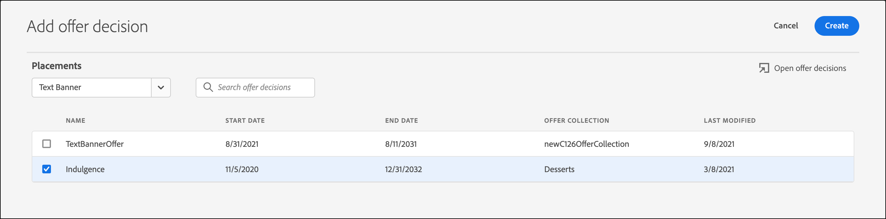

# Usar decisões de oferta

Uso [!DNL Adobe Target] com [!DNL Adobe Journey Optimizer] decisões de oferta para determinar e entregar a próxima melhor oferta para seus visitantes na web e em dispositivos móveis.

Adicionar decisões de oferta criadas em [!DNL Adobe Journey Optimizer] para [!DNL Target] atividades (manual) [!UICONTROL Teste A/B] ou [!UICONTROL Direcionamento de experiência]) utilizando a variável [!UICONTROL Visual Experience Composer] (VEC) [!UICONTROL Compositor baseado em formulário] para testar e entregar ofertas personalizadas aos seus visitantes em seus canais de entrada viabilizados pelo [!DNL Target].

Para obter mais informações sobre [!DNL Adobe Journey Optimizer] e decisões de oferta, consulte os seguintes tópicos no *[!DNL Journey Optimizer]* documentação:

* [Introdução ao Journey Optimizer](https://experienceleague.adobe.com/docs/journey-optimizer/using/get-started/get-started.html)

* [Sobre o Gerenciamento de decisão](https://experienceleague.adobe.com/docs/journey-optimizer/using/offer-decisioniong/get-started/starting-offer-decisioning.html)

## Pré-requisitos

Para usar decisões de oferta no [!DNL Target], você precisa do seguinte:

* [!DNL Adobe Target Standard] ou [!DNL Adobe Target Premium] implementado usando o [Adobe Experience Platform Web SDK](https://developer.adobe.com/target/implement/client-side/aep-web-sdk/){target=_blank}.

   O recurso não está disponível ao implementar [!DNL Target] com at.js ou outro [!DNL Target] SDKs.

* [!DNL Adobe Journey Optimizer Ultimate] (AJO + Offer Decisioning) ou [!DNL Adobe Experience Platform] e a variável [!UICONTROL Offer decisioning] complemento de serviços de aplicativos.

## Casos de uso de exemplo

Os exemplos a seguir são casos de uso de como você pode usar o [!DNL Target]/[!DNL Adobe Journey Optimizer] integração para usar decisões de oferta no [!DNL Target] atividades:

### Merchandising esportivo

Como profissional de marketing de uma liga esportiva, você deseja personalizar o conteúdo em sua página inicial (no desktop e no site para dispositivos móveis). Você deseja personalizar o conteúdo com base em várias dimensões e apresentar uma oferta para comprar produtos de franquia relacionados. Você está interessado em:

* A equipe favorita do visitante
* Atividade recente de atleta/jogador (por exemplo, movimento da equipe, atualizações de contrato ou lesões)

Por exemplo, você deseja fornecer uma experiência personalizada para cada uma das seguintes regiões: Dortmund, Frankfurt e Bochum, e para usuários que são fãs implícitos e explícitos dessas equipes. Como métricas, você deseja observar as visitas e cliques no site de mercadorias.

Você deseja criar um [!UICONTROL Teste A/B] atividade (divisão 50/50) entre a experiência padrão e a experiência personalizada (que inclui uma decisão de oferta com ofertas para cada região e equipe). Você deseja usar essa atividade para determinar a conversão e o aumento da experiência personalizada em relação ao controle.

### Plataformas de streaming de jogos

Como profissional de marketing para uma organização de jogos, você deseja fornecer uma oferta personalizada para uma plataforma de streaming de jogos para usuários de desktop e dispositivos móveis de diferentes regiões: Alemanha, França, México e Brasil. Quando um visitante acessa o site do desktop ou móvel de uma dessas regiões geográficas, você deseja fornecer uma oferta para streaming de jogo no idioma local e com um preço correspondente para a moeda local.

Entrada [!DNL Adobe Journey Optimizer], você pode criar uma oferta principal de página inicial personalizada para cada uma das regiões geográficas direcionadas, além de uma oferta substituta com uma página principal principal padrão. Em seguida, você poderá criar uma decisão de oferta que incorpore essas ofertas e suas regras de qualificação. Em seguida, em [!DNL Target], você pode criar um [!DNL Experience Targeting] (XT) e insira essa decisão de oferta no seu desktop ou site para dispositivos móveis para fornecer a experiência personalizada aos visitantes.

## Crie uma experiência que use uma decisão de oferta:

1. Ao editar ou criar um manual [!UICONTROL Teste A/B] ou [!UICONTROL Direcionamento de experiência] (XT) Atividade no [!UICONTROL Visual Experience Composer] (VEC), clique em um elemento de página para exibir a variável [menu opções](/help/main/c-experiences/c-visual-experience-composer/viztarget-options.md).

   

   >[!NOTE]
   >
   >Você também pode criar uma experiência que use [!UICONTROL Decisões de oferta] no [[!UICONTROL Experience Composer baseado em formulário]](/help/main/c-experiences/form-experience-composer.md).

1. Clique em **[!UICONTROL Inserir antes]**, **[!UICONTROL Inserir depois de]** ou **[!UICONTROL Substituir conteúdo]** e, em seguida, clique em **[!UICONTROL Decisão de oferta]**.

   A variável [!UICONTROL Decisão de oferta] opção está disponível ao editar ou criar [manual [!UICONTROL Teste A/B]](/help/main/c-activities/t-test-ab/test-ab.md#types) ou [[!UICONTROL Direcionamento de experiência]](/help/main/c-activities/t-experience-target/experience-target.md) (XT) somente atividades do. Essa opção não está disponível para outros tipos de atividade. As opções disponíveis no menu variam de acordo com o elemento selecionado.

   

1. No **[!UICONTROL Adicionar decisão de oferta]** , selecione a sandbox e a disposição desejadas.

   A [sandbox](https://experienceleague.adobe.com/docs/experience-platform/sandbox/ui/overview.html){target=_blank} in the [!DNL Adobe Experience Platform] lets you partition your instance into virtual environments. For example, you might have a production environment and a staging environment. A [placement](https://experienceleague.adobe.com/docs/journey-optimizer/using/offer-decisioniong/create-components/creating-placements.html){target=_blank} in [!DNL Adobe Journey Optimizer] O ajuda a garantir que o conteúdo de oferta correto seja exibido no local correto.

   

1. Selecione a decisão de oferta desejada e clique em **[!UICONTROL Criar]**.

   

   Seu site é exibido no VEC, onde você pode ver a decisão de oferta recém-criada no [!UICONTROL Modificações] no lado direito. Você pode passar o mouse sobre a modificação e clicar no botão [!UICONTROL Visualizar] ícone para examinar a decisão de oferta.

   

   É possível examinar as várias ofertas contidas na oferta clicando no ícone apropriado na parte inferior do [!UICONTROL Visualização da oferta] incluindo a oferta substituta. Uma oferta substituta é a oferta padrão exibida quando um visitante não está qualificado para nenhuma oferta personalizada na coleção.

   

1. Conclua a criação da atividade concluindo o [!UICONTROL Direcionamento] e [!UICONTROL Metas e configurações] etapas do fluxo de trabalho guiado de três partes.

   >[!IMPORTANT]
   >
   >Para assegurar que as [!DNL Target] for personalizada, verifique se as datas de início/término da atividade atual estão sincronizadas com as datas de início/término da decisão de oferta em [!DNL Adobe Journey Optimizer]. Se a variável [!DNL Target] as datas de início/término estão fora do intervalo de datas de início/término da decisão de oferta, o padrão [!DNL Target] o conteúdo é exibido para os visitantes.

   

## Observações e limitações

Considere as seguintes informações ao trabalhar com as decisões de oferta:

* A integração do offer decisioning funciona para [!DNL Target] implementações baseadas no [Adobe Experience Platform Web SDK](https://developer.adobe.com/target/implement/client-side/aep-web-sdk/){target=_blank}. Este recurso não está disponível ao implementar [!DNL Target] com at.js ou outro [!DNL Target] SDKs.

* A integração Target/Adobe Journey Optimizer é compatível [manual [!UICONTROL Teste A/B]](/help/main/c-activities/t-test-ab/test-ab.md#types) e [[!UICONTROL Direcionamento de experiência]](/help/main/c-activities/t-experience-target/experience-target.md) (XT) somente atividades do. Este recurso não está disponível para outros tipos de atividades.

* Ofertas com o tipo de conteúdo text/html não são compatíveis com a entrega de conteúdo deliveryURL. O deliveryURL é compatível com o Experience Composer baseado em formulário somente onde o cliente é responsável por buscar e compor explicitamente o conteúdo.

* [!DNL Target] Os relatórios do não fornecem relatórios no nível da decisão de oferta.

* Visualização [Links de controle de qualidade](/help/main/c-activities/c-activity-qa/activity-qa.md) para [!DNL Target] experiências que contêm decisões de oferta afetam o limite de frequência definido no [!DNL Adobe Journey Optimizer] para essas decisões de oferta.
