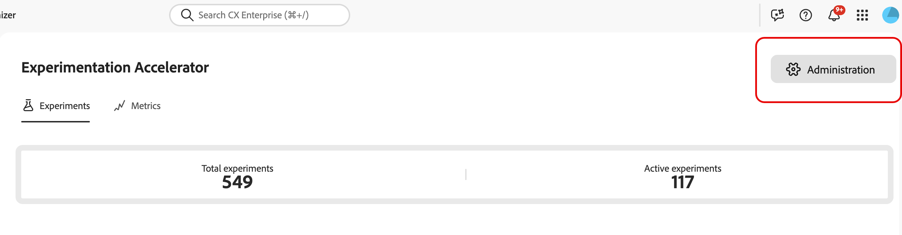
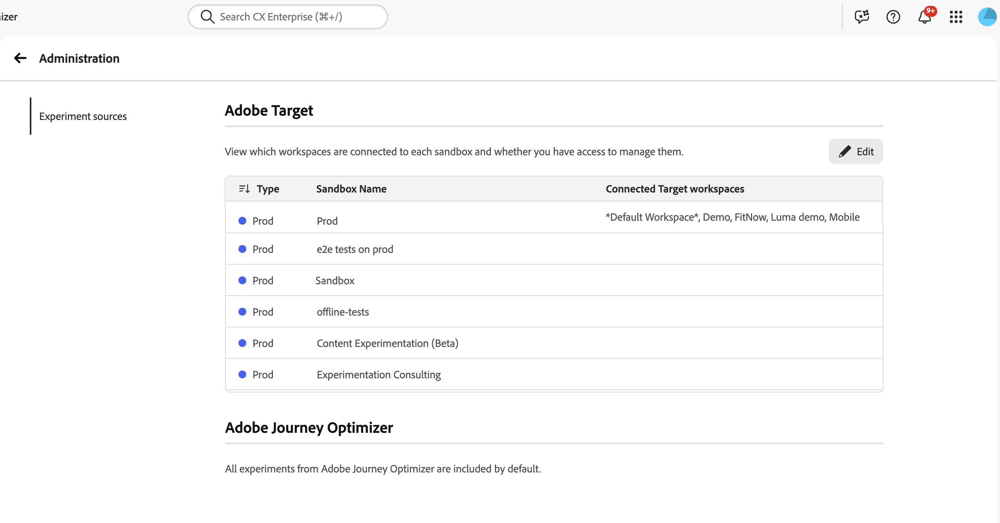

# Integrar o [!DNL Target] ao Experimentation Accelerator

O Experimentation Accelerator ajuda os administradores a gerenciar como as atividades do espaço de trabalho do [!DNL Adobe Target] são organizadas e exibidas no aplicativo. Mapeando cada espaço de trabalho do [!DNL Target] para a sandbox apropriada do Experimentation Accelerator, as equipes podem exibir experimentos de [!DNL Adobe Target] e [!DNL Adobe Journey Optimizer] em um único local.

➡️ [Saiba mais sobre o Adobe Experimentation Accelerator](https://experienceleague.adobe.com/en/docs/experimentation-accelerator/using/overview)

## Antes de começar

Antes de configurar atribuições de sandbox, confirme se você tem as permissões necessárias. Para acessar **[!UICONTROL Administration]** no Experimentation Accelerator, você deve ter a permissão **[!UICONTROL Manage configuration]**.

Os usuários podem atribuir espaços de trabalho [!DNL Target] a sandboxes somente quando ambas as condições são atendidas:

* O usuário tem a permissão **[!UICONTROL Manage configuration]** no Experimentation Accelerator.
* O usuário é um administrador de produto [!DNL Target].

## Configurar atribuição de sandbox para [!DNL Target] espaços de trabalho

Antes de atribuir espaços de trabalho, observe que o espaço de trabalho [!DNL Target] pode ser atribuído a apenas uma sandbox para evitar entradas duplicadas para o mesmo teste.

Para escolher qual sandbox cada espaço de trabalho [!DNL Target] aparece em:

1. No Experimentation Accelerator, abra **[!UICONTROL Administration]**.

   

1. Revise a tabela de [!DNL Target] atribuições atuais de espaço de trabalho para sandbox.

   

1. Clique em **[!UICONTROL Edit]**.

   

1. Para cada sandbox, atribua os espaços de trabalho [!DNL Target] apropriados.

   

1. Clique em **[!UICONTROL Save]** para aplicar as alterações.

Depois que a conexão inicial for criada para um espaço de trabalho [!DNL Target], aguarde até 30 minutos para que as atualizações se propaguem pelo sistema.
