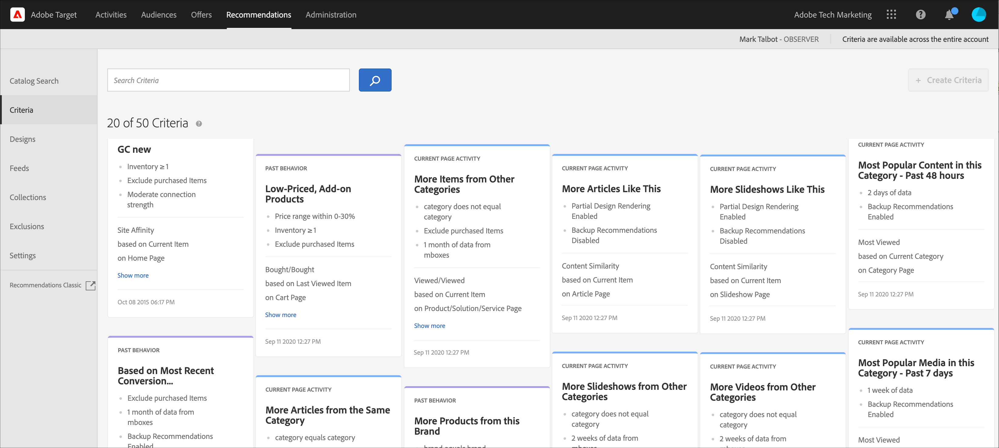

# Critérios

Critérios no [!DNL Adobe Target] [!DNL Recommendations] são regras que determinam quais produtos ou conteúdo recomendar com base em um conjunto predeterminado de comportamentos do visitante. Os critérios podem ser baseados em tendências populares, nos comportamentos atuais e passados de um visitante ou em produtos e conteúdo semelhantes. Você pode comparar vários tipos de recomendação por meio da adição de vários critérios.

As seções a seguir explicam mais sobre as chaves de critérios e a lógica de recomendação que pode ser usada para cada chave. Clique nos links para obter informações mais detalhadas.

## Vertical do setor {#section_936BCFCF234C49A2BEC1C38AAC2D71AF}

Ao criar um critério, você seleciona um negócio vertical com base nas metas de sua atividade de recomendações.

| Vertical do setor | Meta |
|--- |--- |
| Varejo/Comércio eletrônico | Conversão resultando em compra |
| Geração de lead/B2B/Serviços financeiros | Conversão sem compra |
| Mídia/Publicação | Envolvimento |

Outras opções de critério mudam de acordo com o negócio vertical que você selecionar. Você pode definir seu negócio vertical padrão no **[!UICONTROL Recommendations > Configurações]** ou você pode especificar o negócio vertical para cada critério.

## Tipo de algoritmo {#section_885B3BB1B43048A88A8926F6B76FC482}

O tipo de algoritmo selecionado determina os algoritmos disponíveis. Há vários tipos de algoritmo, que são representados como cartões de critérios quando você configura um [!DNL Recommendations] atividade.

A tabela a seguir explica os vários tipos de algoritmos e os algoritmos que os acompanham.

| Tipo de algoritmo | Quando usar | Algoritmos disponíveis |
| --- | --- | --- |
| [!UICONTROL Baseado em carrinho] | Faça recomendações com base no conteúdo do carrinho do usuário. | <ul><li>Pessoas que visualizaram isto, visualizaram aquilo</li><li>Pessoas que visualizaram e compraram essas</li><li>Pessoas que compraram isto, compraram aquilo</li></ul>Para obter mais informações, consulte [Baseado em carrinho](/help/main/c-recommendations/c-algorithms/base-the-recommendation-on-a-recommendation-key.md#cart-based) in *Basear a recomendação em uma chave de recomendação*. |
| [!UICONTROL Baseado em popularidade] | Faça recomendações com base na popularidade geral de um item em todo o site ou na popularidade de itens na categoria, marca, gênero e assim por diante favoritas ou mais visualizadas de um usuário. | <ul><li>Mais visualizados no site</li><li>Mais visualizados por categoria</li><li>Mais visualizados pelo atributo de item</li><li>Mais vendidos em todo o site</li><li>Mais vendidos por categoria</li><li>Mais Vendidos por Atributo de Item</li><li>Comece pela métrica do Analytics</li></ul> |
| [!UICONTROL Baseado em Item] | Fazer recomendações com base na localização de itens semelhantes a um item que o usuário está visualizando atualmente ou que visualizou recentemente. | <ul><li>Pessoas que visualizaram isto, visualizaram aquilo</li><li>Pessoas que visualizaram isto, compraram aquilo</li><li>Pessoas que compraram isto, compraram aquilo</li><li>Itens com atributos similares</li></ul> |
| [!UICONTROL Baseado em usuário] | Faça recomendações com base no comportamento do usuário. | <ul><li>Itens visualizados recentemente </li><li>Recomendado para você</li></ul> |
| [!UICONTROL Critérios personalizados] | Faça recomendações com base em um arquivo personalizado que você fez upload. | <ul><li>Algoritmo personalizado</li></ul> |

Para obter mais informações sobre cada algoritmo, consulte [Basear a recomendação em uma chave de recomendação](/help/main/c-recommendations/c-algorithms/base-the-recommendation-on-a-recommendation-key.md).

## Uso de uma chave de recomendação personalizada {#custom-key}

Você também pode basear as recomendações no valor de um atributo de perfil personalizado.

>[!NOTE]
>
>Parâmetros de perfil personalizados podem ser passados para [!DNL Target] por meio de JavaScript, API ou integrações. Para obter mais informações sobre atributos de perfil personalizados, consulte [Perfis do visitante](/help/main/c-target/c-visitor-profile/visitor-profile.md).

Por exemplo, suponha que você deseja exibir filmes recomendados com base no filme adicionado recentemente por um usuário à fila.

1. Clique em **[!UICONTROL Recommendations]** > **[!UICONTROL Critérios]**.

1. Clique em **[!UICONTROL Criar critérios]** > **[!UICONTROL Criar critérios]**.

1. Preencha as informações em [seção Informações básicas](/help/main/c-recommendations/c-algorithms/create-new-algorithm.md#info).

1. No [Algoritmo recomendado](/help/main/c-recommendations/c-algorithms/create-new-algorithm.md#rec-algo) , selecione **[!UICONTROL Baseado em Item]** do **[!UICONTROL Tipo de algoritmo]** lista.

1. Selecionar **[!UICONTROL Pessoas que visualizaram isto, visualizaram aquilo]** do **[!UICONTROL Algoritmo]** lista.

1. Selecione o atributo de perfil personalizado na **[!UICONTROL Chave de recomendação]** (por exemplo, [!UICONTROL Último programa adicionado à lista de favoritos]).

   

## Exibição de informações de critérios {#section_7162DE58E4594FD688A4D7FDB829FD8B}

Você pode exibir os detalhes dos critérios em um cartão pop-up, passando o mouse sobre ele e clicando no ícone Informações, sem precisar abrir os critérios.

Clique na guia **[!UICONTROL Informações do algoritmo]** para exibir as informações gerais sobre os critérios selecionados, incluindo Nome, Descrições, Vertical do setor, Tipos de página, Chave de recomendação, Lógica de recomendação e ID do algoritmo.

Clique na guia **[!UICONTROL Uso do algoritmo]** para exibir uma lista de atividades que fazem referência aos critérios selecionados. O cartão lista atividades ativas, inativas e de rascunho. Clique nas listas suspensas Atividades ativas/Atividades inativas/Atividades de rascunho para exibir toda a lista de atividades que fazem referência a esse critério. Você pode clicar no link da atividade para abri-la para edição.

>[!NOTE]
>
>A variável [!UICONTROL Uso do algoritmo] No momento, o recurso é compatível apenas com atividades do Recommendations. No momento, esse recurso não é compatível com atividades de Teste A/B, Alocação automática, Direcionamento automático e Direcionamento de experiência (XT) que incluem [recommendations como uma oferta](/help/main/c-recommendations/recommendations-as-an-offer.md).
