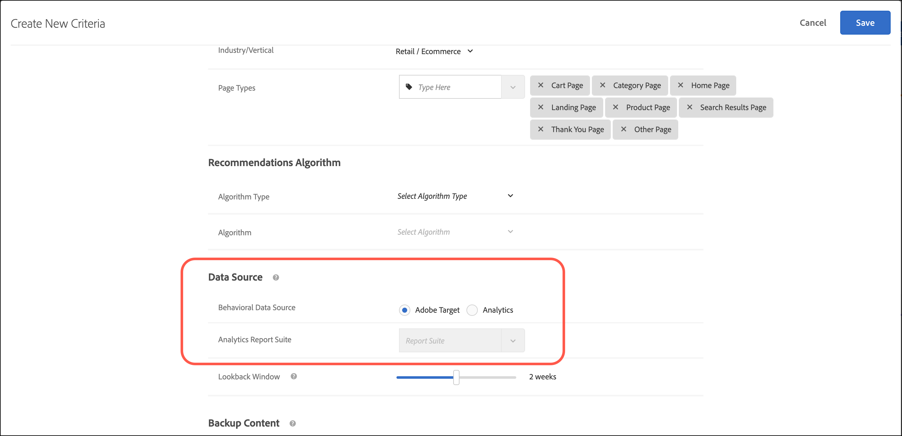

# Uso [!DNL Adobe Analytics] com [!DNL Recommendations]

Usar [!DNL Adobe Analytics] como a fonte de dados comportamentais permite que os clientes usem os dados comportamentais baseados em visualização e/ou compra de [!DNL Analytics] in [!DNL Adobe Target] [!DNL Recommendations] atividades. Esse recurso é especialmente útil em situações em que a variável [!DNL Target Recommendations] a configuração é nova e [!DNL Analytics] O tem muitos dados históricos para usar.

Usar [!DNL Analytics] como a fonte de dados comportamentais pode agir como uma fonte avançada de informações sobre o comportamento do usuário. Essas informações podem incluir dados de uma fonte de terceiros ou feed que são compartilhados somente com o [!DNL Analytics].

Enquanto [criação de critérios](/help/main/c-recommendations/c-algorithms/create-new-algorithm.md) in [!DNL Recommendations], há dois botões de opção que permitem escolher qual fonte de dados deve ser usada: [!UICONTROL mboxes] ou [!UICONTROL Analytics]. Para criar um critério, clique em [!UICONTROL Recommendations] > [!UICONTROL Critérios] > [!UICONTROL Criar critérios] > [!UICONTROL Criar critérios]. Para obter mais informações, consulte [Criar critérios](/help/main/c-recommendations/c-algorithms/create-new-algorithm.md).

>[!NOTE]
>
>Se esses dois botões não forem exibidos em sua conta, entre em contato com [Atendimento ao cliente](/help/main/cmp-resources-and-contact-information.md#reference_ACA3391A00EF467B87930A450050077C).

## Casos de uso para dados do Analytics no Target

Usar [!DNL Analytics] como a fonte de dados comportamentais para recomendações também permite implantar casos de uso específicos sem o requisito de marcar páginas de entidade com todas as [!DNL Target] parâmetros de entidade. Embora isso exija que determinados pré-requisitos estejam em vigor, a disponibilidade de &quot;Variáveis de produto&quot; é a coisa mais importante para que essa funcionalidade funcione perfeitamente. eVars e Props regulares não são suficientes para que esse handshake ocorra automaticamente entre [!DNL Analytics] e [!DNL Target].

Você pode usar [!DNL Analytics] como a fonte de dados comportamentais para:

* Exibir recomendações em um site de varejo para usuários em uma página de detalhes do produto, com base no que outros usuários compraram da mesma categoria no mês passado, usando [!DNL Analytics] dados.
* Exiba conteúdo na tela inicial de um site de mídia para o conteúdo mais popular em uma categoria específica que está em tendência no momento, com base nas [!DNL Analytics] dados.

## Implementação em [!DNL Analytics]

As seções a seguir ajudam a implementar esse recurso na [!DNL Analytics] lado.

### Pré-requisitos: configurar variáveis de produto no [!DNL Analytics]

Implementar variáveis de produto no [!DNL Analytics] com os atributos necessários exigidos para [!DNL Target Recommendations].

A [!DNL Target Recommendations] o formato de feed de amostra atua como guia no qual todos os atributos devem ser definidos nas variáveis de produto. Posteriormente, esses valores devem ser &quot;mapeados&quot; dentro do [!DNL Target] Interface para a respectiva [!DNL Target] valores de entidade.

>[!NOTE]
>
>Se for um site de conteúdo, as respectivas partes de conteúdo deverão ser tratadas como &quot;produtos&quot; e os atributos associados sobre esse conteúdo deverão ser passados como atributos. Esses atributos podem incluir nome do autor, data de publicação, título do conteúdo, mês de lançamento e assim por diante. A granularidade do nível de categoria ou dos tipos de categoria deve ser decidida pela empresa com base nos requisitos do caso de uso.

Para obter mais detalhes sobre como configurar variáveis de produto, consulte [products](https://experienceleague.adobe.com/docs/analytics/implementation/vars/page-vars/products.html) no *Implementar o Adobe Analytics* guia. Algumas das notas nessa documentação exigem a discrição da equipe que está implantando (exemplo : Categoria). É sempre aconselhável consultar [!DNL Adobe] antes de realizar esta atividade.

### Considerações

[!DNL Analytics] os dados do são enviados por meio de um feed diário. Os resultados comportamentais podem levar até 24 horas para serem refletidos nos resultados das recomendações do site. Como em todos [!DNL Recommendations] configurações de critérios, essa fonte de dados pode e deve ser testada.

Para tomada de decisão rápida sobre qual fonte de dados deve ser usada, se houver muitos dados orgânicos gerados todos os dias pelos usuários e não for necessária muita dependência dos dados históricos, use um [!DNL Target] mbox como a fonte de dados comportamentais pode ser uma boa opção. Em casos de menor disponibilidade de dados orgânicos gerados recentemente, se você quiser se basear em [!DNL Analytics] os dados, depois a variável using [!DNL Analytics] como a fonte de dados comportamentais é um bom ajuste.

Agora é hora de mapear essas variáveis em [!DNL Target] lado, para o fornecimento contínuo de dados comportamentais.

## Implementar no [!DNL Target]

1. Entrada [!DNL Target], clique em **[!UICONTROL Recommendations]** e, em seguida, clique na guia **[!UICONTROL Feeds]** guia.

   

1. Clique em **[!UICONTROL Criar feed]**.

1. Selecionar **[!UICONTROL Classificações do Analytics]** e, em seguida, especifique o conjunto de relatórios.

   

1. Clique em **[!UICONTROL Próxima]** para avançar para o **[!UICONTROL Agendar]** , selecione um período de frequência para o feed:

   * [!UICONTROL Diariamente]
   * [!UICONTROL Semanalmente]
   * [!UICONTROL A cada 2 semanas]
   * [!UICONTROL Nunca]

   Você também pode selecionar a hora do dia em que o feed será processado.

1. Clique em **[!UICONTROL Próxima]** para avançar para o  **[!UICONTROL Mapeamento]** e mapeie os cabeçalhos de coluna de campo para o [!UICONTROL Recommendations] nomes de campo.

   

1. Clique em **[!UICONTROL Salvar]**.

## Perguntas frequentes

Considere as seguintes perguntas frequentes ao usar [!DNL Analytics] com [!DNL Target]:

### São as `entity.id` e `entity.categoryId` valores que devem ser transmitidos dentro de [!DNL Target] chamada mbox?

Sim, esses dois valores ainda são obrigatórios. O restante dos atributos pode ser transmitido por meio de um [!DNL Analytics] feed, conforme discutido neste documento.

### Posso usar regras de inclusão dinâmica, como correspondências de parâmetros de entidade e atributos de perfil usando o [!DNL Analytics] abordagem de feed?

Sim, você pode. O método é semelhante ao usar [!DNL Target] autônoma. Nesse caso, no entanto, você deve estar atento ao fator tempo. As variáveis de entidade que devem corresponder às variáveis de perfil dependem da camada de dados que pode aparecer muito mais tarde na página.
