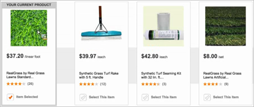

# Personalizar um design usando o [!DNL Velocity]

Use a linguagem de design de código aberto [!DNL Velocity] para personalizar designs de recomendação no [!DNL Adobe Target Recommendations].

## Visão geral das [!DNL Velocity] {#section_C431ACA940BC4210954C7AEFF6D03EA5}

Informações sobre [!DNL Velocity] podem ser encontradas em [https://velocity.apache.org](https://velocity.apache.org).

Toda a lógica, sintaxe etc. do [!DNL Velocity] podem ser usados para um design de recomendação. Isso significa que você pode criar loops *for*, instruções *if* e outros códigos usando [!DNL Velocity] em vez do JavaScript.

Os atributos de entidade enviados a [!DNL Recommendations] na mbox `productPage` ou no carregamento de CSV podem ser exibidos em um design, com exceção dos atributos de &quot;valores múltiplos&quot;. Qualquer tipo de atributo pode ser enviado; no entanto, [!DNL Target] não passa atributos do tipo &quot;multi-value&quot; como uma matriz sobre a qual um modelo pode iterar (por exemplo, `entityN.categoriesList`).

Esses valores são referenciados com a seguinte sintaxe:

```
$entityN.variable
```

Os nomes de atributos de entidade devem seguir a notação abreviada [!DNL Velocity], que consiste em um caractere *$* à esquerda, seguido por um Identificador de VTL (Linguagem de Modelo) [!DNL Velocity]. O identificador VTL deve começar com um caractere alfanumérico (a-z ou A-Z).

Os nomes dos atributos de entidade do Velocity estão restritos aos seguintes tipos de caracteres:

* Alfabético (a-z, A-Z)
* Numérico (0-9)
* Hífen ( - )
* Sublinhado ( _ )

Os atributos a seguir estão disponíveis como [!DNL Velocity] matrizes. Como tal, eles podem ser iterados ou referenciados por meio do índice.

* `entities`
* `entityN.categoriesList`

Por exemplo:

```
#foreach ($category in $entity1.categoriesList) 
<br/>$category 
#end
```

Ou

```
#if ($entities[0].categoriesList.size() >= 3 ) 
$entities[0].categoriesList[2] 
#end
```

Para obter mais informações sobre [!DNL Velocity] variáveis (atributos), consulte [https://velocity.apache.org/engine/releases/velocity-1.7/user-guide.html#variables](https://velocity.apache.org/engine/releases/velocity-1.7/user-guide.html#variables).

Se você usar um script de perfil em seu design, o $ precedente ao nome do script deve ser evitado com um `\` (barra invertida). Por exemplo:

`\${user.script_name}`

>[!NOTE]
>
>A quantidade máxima de entidades que podem ser referenciadas em um design, seja em código rígido ou em loops, é de 99. O comprimento do script do modelo pode conter até 65.000 caracteres.

Por exemplo, se você deseja um design que exibe algo semelhante a isto:


é possível usar o seguinte código:

```
<table style="border:1px solid #CCCCCC;"> 
<tr> 
<td colspan="3" style="font-size: 130%; border-bottom:1px solid  
#CCCCCC;"> You May Also Like... </td> 
</tr> 
<tr> 
<td style="border-right:1px solid #CCCCCC;"> 
<div class="search_content_inner" style="border-bottom:0px;"> 
<div class="search_title"><a href="$entity1.pageUrl"  
style="color: rgb(112, 161, 0); font-weight: bold;"> 
$entity1.id</a></div> 
By $entity1.message <a href="?x14=brand;q14=$entity1.message"> 
(More)</a><br/> 
sku: $entity1.prodId<br/> Price: $$entity1.value 
<br/><br/> 
</div> 
</td> 
<td style="border-right:1px solid #CCCCCC; padding-left:10px;"> 
<div class="search_content_inner" style="border-bottom:0px;">  
<div class="search_title"><a href="$entity2.pageUrl"  
style="color: rgb(112, 161, 0); font-weight: bold;"> 
$entity2.id</a></div> 
By $entity2.message <a href="?x14=brand;q14=$entity2.message"> 
(More)</a><br/> 
sku: $entity2.prodId<br/> 
Price: $$entity2.value 
<br/><br/> 
</div> 
</td> 
<td style="padding-left:10px;"> 
<div class="search_content_inner" style="border-bottom:0px;"> 
<div class="search_title"><a href="$entity3.pageUrl"  
style="color: rgb(112, 161, 0); font-weight: bold;"> 
$entity3.id</a></div> 
By $entity3.message <a href="?x14=brand;q14=$entity3.message"> 
(More)</a><br/> 
sku: $entity3.prodId<br/> Price: $$entity3.value 
<br/><br/> 
</div> 
</td> 
</tr>  
</table>
```

>[!NOTE]
>
>Se quiser adicionar texto após o valor de um atributo antes de uma tag que indica o término do nome do atributo, você poderá usar uma notação formal para delimitar o nome do atributo. Por exemplo: `${entity1.thumbnailUrl}.gif`.

Você também pode usar `algorithm.name` e `algorithm.dayCount` como atributos de entidade em designs, assim, um design pode ser usado para testar vários critérios e o nome do critério pode ser exibido de forma dinâmica no design. Isso mostra ao visitante que ele ou ela está olhando para os &quot;mais vendidos&quot; ou &quot;pessoas que viram isso compraram aquilo.&quot; Você ainda pode usar esses atributos para exibir o `dayCount` (número de dias dos dados usados nos critérios, como &quot;mais vendidos nos últimos dois dias&quot; etc.

## Trabalhando com números em modelos [!DNL Velocity]

Por padrão, os modelos [!DNL Velocity] tratam todos os atributos de entidade como valores de cadeia de caracteres. Talvez você queira tratar um atributo de entidade como um valor numérico para executar uma operação matemática ou compará-lo a outro valor numérico. Para tratar um atributo de entidade como um valor numérico, siga estas etapas:

1. Declare uma variável fictícia e inicialize-a em um número inteiro arbitrário ou em um valor duplo.
1. Certifique-se de que o atributo de entidade que deseja usar não esteja em branco (necessário para o analisador de modelo [!DNL Target Recommendations] validar e salvar o modelo).
1. Passe o atributo de entidade para o método `parseInt` ou `parseDouble` na variável fictícia que você criou na etapa 1 para transformar a cadeia de caracteres em um número inteiro ou valor duplo.
1. Execute a operação matemática ou a comparação no novo valor numérico.

### Exemplo: Calcular um preço com desconto

Suponha que você queira reduzir o preço exibido de um item em US$ 0,99 para aplicar um desconto. Você poderia usar a seguinte abordagem para obter esse resultado:

```
#set( $double = 0.1 )

#if( $entity1.get('priceBeforeDiscount') != '' )
    #set( $discountedPrice = $double.parseDouble($entity1.get('priceBeforeDiscount')) - 0.99 )
    Item price: $$discountedPrice
#else
    Item price unavailable
#end
```

### Exemplo: Escolher o número de estrelas para exibir com base na classificação de um item

Suponha que você deseja exibir um número apropriado de estrelas com base na média numérica das classificações atribuídas por clientes para um item. Você poderia usar a seguinte abordagem para obter esse resultado:

```
#set( $double = 0.1 )

#if( $entity1.get('rating') != '' )
    #set( $rating = $double.parseDouble($entity1.get('rating')) )
    #if( $rating >= 4.5 )
        
    #elseif( $rating >= 3.5 )
        
    #elseif( $rating >= 2.5 )
        
    #elseif( $rating >= 1.5 )
        
    #else
        
    #end
#else
    
#end
```

### Exemplo: Calcular o tempo em horas e minutos com base na duração em minutos de um item

Suponha que você armazene a duração de um filme em minutos, mas deseja exibi-la em horas e minutos. Você poderia usar a seguinte abordagem para obter esse resultado:

```
#if( $entity1.get('length_minutes') )
#set( $Integer = 1 )
#set( $nbr = $Integer.parseInt($entity1.get('length_minutes')) )
#set( $hrs = $nbr / 60)
#set( $mins = $nbr % 60)
#end
```

## Exibir um item principal com produtos recomendados {#section_7F8D8C0CCCB0403FB9904B32D9E5EDDE}

Você pode modificar seu design para mostrar seu item principal ao lado de outros produtos recomendados. Por exemplo, você pode querer mostrar o item atual para referência ao lado das recomendações.

Para fazer isso, crie uma coluna em seu design que use o atributo `$key` no qual você está baseando sua recomendação, em vez do atributo `$entity`. Por exemplo, o código da sua coluna chave pode ter esta aparência:

```
<div class="at-table-column"> 
   <a href="$key.pageURL"> 
       
      <br/><h3>$key.name</h3> 
      <br/><p class="at-light">$key.message</p> 
      <br/><p class="at-light">$key.value</p> 
   </a> 
</div>
```

O resultado é um design como o seguinte, em que uma coluna mostra o item chave.



Quando você está criando sua atividade do [!DNL Recommendations], se o item chave é obtido do perfil do visitante, como &quot;último item comprado&quot;, o [!DNL Target] exibe um produto aleatório no [!UICONTROL Visual Experience Composer] (VEC). Isso ocorre porque um perfil não está disponível enquanto você projeta a atividade. Quando os visitantes visualizam a página, eles verão o item chave esperado.

## Executar substituições em um valor de sequência. {#section_01F8C993C79F42978ED00E39956FA8CA}

Você pode modificar o design para substituir valores em uma sequência de caracteres. Por exemplo, a substituição do ponto decimal usado nos Estados Unidos pela vírgula usada na Europa e em outros países.

O código a seguir mostra uma única linha em um exemplo condicional do preço de venda:

```
<span class="price">$entity1.value.replace(".", ",") &euro;</span><br>
```

O código a seguir é um exemplo condicional completo de um preço de venda:

```
<div class="price"> 
    #if($entity1.hasSalesprice==true) 
    <span class="old">Statt <s>$entity1.salesprice.replace(".", ",") &euro;</s></span><br> 
    <span style="font-size: 10px; float: left;">jetzt nur</span> $entity1.value.replace(".", ",") &euro;<br> #else 
    <span class="price">$entity1.value.replace(".", ",") &euro;</span><br> #end 
    <span style="font-weight:normal; font-size:10px;"> 
                                        $entity1.vatclassDisplay 
                                        <br/> 
                                        $entity1.delivery 
                                        <br> 
                                    </span>
```

## Personalizar o tamanho do modelo e procurar valores em branco {#default}

Usando um script [!DNL Velocity] para controlar o dimensionamento dinâmico da exibição da entidade, o modelo a seguir acomoda um resultado de 1 para muitos para evitar a criação de elementos HTML vazios quando não forem retornadas entidades correspondentes suficientes de [!DNL Recommendations]. Este script é mais adequado para cenários nos quais as recomendações reserva não fazem sentido e nos quais a [!UICONTROL Renderização parcial do modelo] está habilitada.

O trecho HTML a seguir substitui a porção HTML existente no design 4 x 2 padrão (o CSS não está incluído aqui por motivos de brevidade):

* Se uma quinta entidade existir, o script insere um div de fechamento e abre uma nova linha com `<div class="at-table-row">`.
* Com 4 x 2, serão mostrados no máximo oito resultados, mas isso pode ser personalizado para listas menores ou maiores, modificando `$count <=8`.
* Esteja ciente de que a lógica não equilibra as entidades em várias linhas. Por exemplo, se houver cinco ou seis entidades a serem exibidas, elas não se tornarão dinamicamente três na parte superior e duas na parte inferior (ou três na parte superior e três na parte inferior). A linha superior exibirá quatro itens antes de iniciar uma segunda linha.

```
<div class="at-table">
  <div class="at-table-row">
    #set($count=1) 
    #foreach($e in $entities)  
        #if($e.id != "" && $count < $entities.size() && $count <=8) 
            #if($count==5) 
                </div>
                <div class="at-table-row">
            #end
            <div class="at-table-column">
                <a href="$e.pageUrl">
                    <br/>
                    <h3>$e.name</h3>
                    <br/>
                    <p class="at-light">$e.message</p>
                    <br/>
                    <p class="at-light">$$e.value</p>
                </a>
            </div>
            #set($count = $count + 1) 
        #end 
    #end
  </div>
</div>
```
