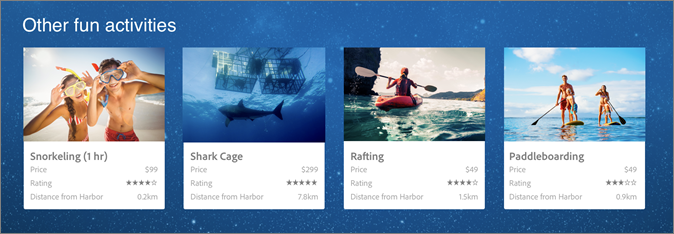

# Visão geral do design

Os designs no [!DNL Adobe Target Recommendations] definem como as recomendações são exibidas em uma página. Os designs definem o layout e o formato de suas recomendações para melhorar o envolvimento, a conversão e a receita do visitante.

O [!DNL Recommendations] vem com vários designs padrão (pré-compilação) ou você pode criar os seus próprios designs.

O [!DNL Target] pode fornecer a aparência completa de suas recomendações, conforme mostrado na ilustração a seguir. O design pode incluir HTML, JavaScript e CSS. Esse design é chamado de design 4 x 1: quatro espaços em uma linha.

O Target também pode enviar suas recomendações como objetos JSON que podem ser usados em mensagens de email, dispositivos IoT (Internet das Coisas), console ou casos de uso de voz (Amazon Alexa ou Google Home).

Os designs ajudam a determinar:

* Quantos itens você deseja mostrar em uma recomendação
* Como você deseja exibir seus itens (em uma linha, coluna, grade ou tabela)
* Se você deseja limitar os visitantes a ver apenas o número especificado de itens ou se deseja que os visitantes possam rolar por vários itens?
