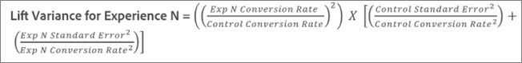

# Média de aumento, Limites de aumento e Intervalo de confiança

Os relatórios incluem vários pontos de dados e representações de visualização que ajudam a entender os limites de aumento e o nível de confiança associados à sua [!DNL Adobe Target] para ajudar você a determinar com mais precisão um vencedor.

>[!NOTE]
>
>Esse recurso está disponível somente ao visualizar relatórios em [!UICONTROL Tabela] Exibir. Este recurso não está disponível para atividades que usam o [Analytics como fonte de relatórios (A4T)](/help/main/c-integrating-target-with-mac/a4t/a4t.md#concept_7540C8C04259434AB6EE33B09F47A1DE).

## Interpretar os dados {#section_62C0D7E76F3D49A7B3C371C82AEF27D5}

A ilustração a seguir mostra [!UICONTROL Limites de aumento e Nível de confiança] Informações:

As informações de incentivo e confiança na [!DNL Target] a interface do usuário de relatórios inclui:

### Aumento

O número grande e a seta refletem o valor esperado do aumento. Esse número é o ponto médio do intervalo dos limites de aumento. A seta de aumento esperado é exibida em cinza até que a confiança passe 95%. Após esse limite, a seta é exibida em vermelho ou verde com base no aumento negativo ou positivo, respectivamente.

### Limites de aumento

Este é o intervalo de confiança de 95% do aumento. Ele é exibido como um intervalo abaixo da média de aumento. Consulte [Exemplo de cálculo](#example) abaixo para obter um exemplo de como esses limites de aumento são calculados.

### Gráfico de caixa

O boxplot no [!DNL Target] representa o valor esperado e o intervalo de confiança de 95% da métrica de sucesso em questão. Pense nisso como uma maneira gráfica de exibir as informações de aumento e os limites de aumento.

Há algumas maneiras principais [!DNL Target] ajuda a interpretar as informações de confiança, uma das quais é a cor. O gráfico exibe qualquer sobreposição no intervalo de confiança de uma experiência específica com o intervalo de confiança do controle em cinza e qualquer faixa do intervalo de confiança de uma experiência específica acima ou abaixo do intervalo de confiança de controle como verde ou vermelho, respectivamente.

O comprimento da barra do boxplot representa o tamanho do intervalo de confiança de uma maneira fácil de entender. À medida que você coleta mais dados em sua atividade, a barra é alterada. O intervalo de confiança é derivado da variação e do tamanho da amostra (número de visitantes). Quanto menor a variação e quanto maior o tamanho da amostra, mais estreito o seu intervalo de confiança.

### Confiança

A confiança de uma experiência ou oferta exibida é uma probabilidade (expressa como uma porcentagem) de obter um resultado _menos extremo_ do que aquele que é realmente observado, _se a hipótese nula for verdadeira_, ou seja, se não houver diferença nas taxas de conversão entre essa experiência ou oferta e a experiência/oferta de controle. Em termos de valores p, essa confiança é exibida `1 - p-value`. Em termos mais simples, a confiança mais alta indica que os dados são menos consistentes com a suposição de que a oferta/experiência de controle e não controle têm taxas de conversão iguais.

## Entender como o intervalo de confiança para aumento é determinado {#pdf}

Baixe o [Intervalo de confiança para arquivo pdf do Lift](/help/main/assets/confidence_interval_lift.pdf) para obter mais informações.

## Como são calculados os limites de aumento? {#section_1D360781D972483693680BE0F07AEAD1}

Os limites de aumento representam os intervalos de confiança de 95% do aumento que a experiência ou oferta específica tem sobre a experiência de controle ou oferta. Falando vagamente, isso significa que o aumento real tem cerca de 95% de chance de estar entre esses limites.

Os limites de aumento são calculados usando a seguinte fórmula:

Existe um cálculo adicional para chegar à entrada dos nossos limites de aumento:

* **valor t:** a estatística crítica para o nosso nível de confiança de 95% é de 1,96. Saiba mais sobre [os valores t aqui](https://en.wikipedia.org/wiki/T-statistic).
* **Variação do aumento:** A métrica de sucesso do Erro Padrão de Experiência N e a métrica de sucesso Erro Padrão da Experiência de Controle são necessárias para determinar a variação de aumento, que é calculada usando a seguinte fórmula (ilustrada caso a métrica de sucesso seja conversão).

   

* **Índice de conversão / Erro padrão da métrica de sucesso:** O erro padrão é calculado da mesma forma para a Experiência N e o Controle, usando a seguinte fórmula (ilustrada caso a métrica de sucesso seja conversão). Saiba mais sobre [erro padrão aqui](https://en.wikipedia.org/wiki/Standard_error).

   

   >[!NOTE]
   >
   >O erro padrão para atividades de métricas de sucesso de receita é baseado na variação da amostra da receita.

## Exemplo de cálculo {#example}

Vamos considerar um exemplo de atividade com duas experiências e os seguintes resultados:

| Experiência | Visitantes | Conversões | Índice de conversão |
|--- |--- |--- |--- |
| Experiência A (Controle) | 219, 328 | 2,466 | 1.12% |
| Experiência B | 218, 362 | 3,040 | 1.39% |

Com base em nossas fórmulas, podemos calcular as entradas necessárias para os limites de aumento.

**Erro padrão para Experiência A (Controle)**

**Erro padrão para Experiência B**

**Variação de aumento para Experiência B**

**Variação de aumento para Experiência B**

Aumento esperado para Experiência B:

Portanto, os limites de aumento para a Experiência B podem ser:

>[!NOTE]
>
>Espere pequena variações entre os cálculos manuais usando as fórmulas acima e os números exibidos no relatório. A diferença pode ser atribuída ao fato de que os números de exibições de página usados nos cálculos manuais são arredondados. O aumento mostrado no [!DNL Target] O relatório é baseado nos números exatos obtidos do engajamento total e da contagem de engajamento. Os números de engajamento podem ser obtidos por meio da API de relatórios de desempenho.

## Quando os limites de aumento não são exibidos? {#section_C5622E1E94684DAD937249B51A9E42CC}

Em certos casos, [!DNL Target] não exibe limites de aumento:

* Para qualquer atividade, quando o número total de visitas ou visitantes for menor que 30.
* Para [!UICONTROL Alocação automática] , nenhum limite de aumento é exibido até que uma experiência tenha atingido 60% de confiança.
