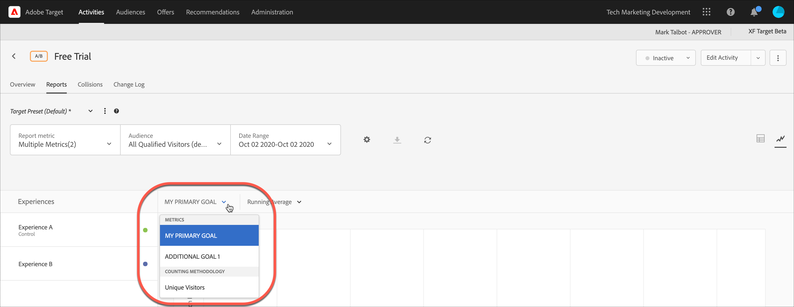

# Exibir várias métricas em um relatório

Você pode selecionar várias métricas para exibir em um relatório [!DNL Adobe Target].

Esteja ciente das seguintes informações ao trabalhar com várias métricas nos relatórios:

* A capacidade de exibir várias métricas está disponível somente para atividades de [Teste A/B](/help/main/c-activities/t-test-ab/test-ab.md), [Alocação automática](/help/main/c-activities/automated-traffic-allocation/automated-traffic-allocation.md), [Direcionamento automático](/help/main/c-activities/auto-target/auto-target-to-optimize.md) e [Direcionamento de experiência](/help/main/c-activities/t-experience-target/experience-target.md) (XT).
* Você não pode adicionar mais de 20 métricas a um relatório para uma atividade que usa o [Analytics for Target](/help/main/c-integrating-target-with-mac/a4t/a4t.md) (A4T). Você pode adicionar quantas métricas tiver em sua atividade aos relatórios para atividades que *não* usam o A4T.
* Você não pode usar a [opção de Download](/help/main/c-reports/c-report-settings/downloading-data-in-csv-file.md) para baixar relatórios em CSV se tiver selecionado várias métricas. Você deve selecionar apenas uma métrica para habilitar a opção [!UICONTROL Download].
* Não é possível exibir várias métricas para atividades criadas antes da versão [!DNL Target] de julho de 2015 (30 de julho de 2015).

**Para selecionar várias métricas para exibir no relatório:**

1. Para exibir um relatório, clique em **[!UICONTROL Activities]**, clique na atividade desejada da lista e na guia **[!UICONTROL Reports]**.
1. Clique na lista suspensa **[!UICONTROL Report Metric]** para exibir as listas [!UICONTROL Shown Metrics] e [!UICONTROL Hidden Metrics].

   

   Você pode usar a caixa [!UICONTROL Search] para localizar rapidamente as métricas disponíveis para adicionar à lista [!UICONTROL Shown Metrics].

   Observe que você pode selecionar várias métricas dos modos [!UICONTROL Table View] e [!UICONTROL Graph View] do relatório.

1. Passe o mouse sobre as métricas desejadas na lista [!UICONTROL Hidden Metrics] e clique em **[!UICONTROL Select]** para movê-las para a lista [!UICONTROL Shown Metrics].

   Ou

   Arraste e solte as métricas desejadas da lista [!UICONTROL Hidden Metrics] para a lista [!UICONTROL Shown Metrics].

   Deve haver pelo menos uma métrica na lista [!UICONTROL Shown Metrics].

   Você pode reorganizar as métricas arrastando-as e soltando-as na ordem desejada na lista [!UICONTROL Shown Metrics]. A ordem selecionada será refletida em [!UICONTROL Table View] e [!UICONTROL Graph View]. Para remover uma métrica da lista [!UICONTROL Shown Metrics], passe o mouse sobre a métrica e clique no ícone **X**.

1. Clique em **[!UICONTROL Save]** quando terminar.
1. (Condicional) Ao visualizar o relatório no [!UICONTROL Table View], passe o mouse sobre o cabeçalho da coluna de qualquer métrica para exibir uma seta azul. Clique na seta para expandir a tabela e exibir a [!UICONTROL Lift] e [!UICONTROL Confidence] para essa métrica.

   

   Você pode expandir apenas uma métrica/coluna por vez. Clique na seta novamente para recolher as colunas.

1. (Condicional) Ao visualizar o relatório na Exibição em gráfico, você pode selecionar métricas individuais para exibição na lista suspensa:

   
