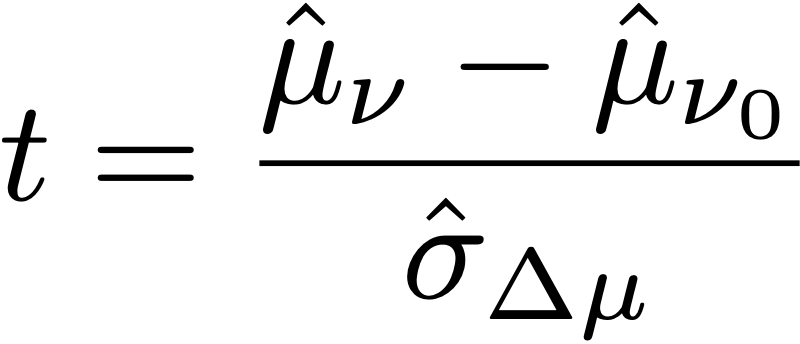

# Cálculos estatísticos em testes A/Bn

Este artigo documenta os cálculos estatísticos detalhados usados em testes A/Bn manuais no [!DNL Adobe Target]. As definições são fornecidas para [!UICONTROL Conversion Rate], [!UICONTROL Confidence Interval of Conversion Rate], [!UICONTROL Lift], [!UICONTROL Confidence Interval for Lift] e [!UICONTROL Confidence].

>[!NOTE]
>
>As informações deste artigo substituem o arquivo PDF *Cálculos do Adobe Target para Teste A/B*, que estava disponível anteriormente para download neste site.

![Relatório de direcionamento mostrando o [!UICONTROL Conversion Rate], [!UICONTROL Average Lift and Confidence Interval], e [!UICONTROL Confidence] de uma atividade de Teste A/B.](/help/main/c-reports/statistical-methodology/img/target_report.png)

## Desempenho médio

A seção a seguir explica os cálculos usados na ilustração anterior.

### Taxa de conversão e Campanhas de receita por visitante (RPV)

A ilustração a seguir mostra [!UICONTROL Conversion Rate], [!UICONTROL Confidence Interval of Conversion Rate] e o número de [!UICONTROL Conversions] em um relatório [!DNL Target]. Por exemplo, a primeira linha mostra que para a Experiência A: o [!UICONTROL Conversion Rate] é 25,81% com um [!UICONTROL Confidence Interval] de ±7,7% e 32 conversões foram registradas. Considerando que 124 visitantes visualizaram a experiência, isso equivale a 32/124 = 25,81%.

<p style="text-align:center;"></p>

A taxa de conversão ou a **média**, *μ<sub>ν</sub>*, para cada experiência *ν* em um experimento é definida como uma proporção da soma da métrica em relação ao número de unidades atribuídas a essa métrica, *N<sub>ν</sub>*:

<p style="text-align:center;"></p>

Aqui,

* *Y<sub>iewer</sub>* é o valor da métrica para cada unidade *i* atribuída a uma determinada experiência *ν*.

* A soma sobre as unidades *i* depende da escolha da metodologia de contagem.

   * Se *[!UICONTROL Visitors]* for usada como a metodologia de contagem, cada unidade será um visitante único definido como um participante único na atividade durante toda a vida útil da atividade.
   * Se *[!UICONTROL Visits]* for usada como metodologia de contagem, cada unidade será uma visita única definida como um participante único em uma experiência durante uma sessão [!DNL Target] (com um único `sessionId`). Quando o `sessionId` é alterado ou o visitante atinge a etapa de conversão, uma nova visita é contada.
   * Se *[!UICONTROL Activity Impressions]* for usada como a metodologia de contagem, cada unidade será uma impressão exclusiva definida sempre que um visitante carregar qualquer página da atividade.

## [!UICONTROL Confidence Interval of Mean]/[!UICONTROL Conversion Rate]

O intervalo de confiança da taxa de conversão é intuitivamente definido como um intervalo de taxas de conversão possíveis consistente com os dados subjacentes.

Ao executar experimentos, o índice de conversão para uma determinada experiência é uma *estimativa* do índice de conversão &quot;verdadeiro&quot;. Para quantificar a incerteza nesta estimativa, [!DNL Target] usa um intervalo de confiança. [!DNL Target] sempre relata um intervalo de confiança de 95%, o que significa que, no final, 95% dos intervalos de confiança calculados incluem o verdadeiro índice de conversão da experiência.

Um intervalo de confiança de 95% da taxa de conversão *μ<sub>ν</sub>* é definido como o intervalo de valores:

<p style="text-align:center;"></p>

Quando o erro-padrão da média é definido como

<p style="text-align:center;"></p>

Se for utilizada uma estimativa imparcial do desvio-padrão da amostra:

<p style="text-align:center;"></p>

Quando a campanha é uma campanha de taxa de conversão (ou seja, a métrica de conversão é binária), o erro padrão se reduz a:

<p style="text-align:center;"></p>

## Aumento

A ilustração a seguir mostra [!UICONTROL Lift] e [!UICONTROL Confidence Interval of Lift] em um Relatório [!DNL Target]. O número representa a média do intervalo dos limites de aumento, e a seta reflete se o aumento é positivo ou negativo. A seta é exibida em cinza até que a confiança passe de 95%. Depois que a confiança ultrapassa o limite, a seta é verde ou vermelha com base em um aumento positivo ou negativo.

<p style="text-align:center;"></p>

O aumento entre uma experiência *ν* e a experiência de controle *ν<sub>0</sub>* é o &quot;delta&quot; relativo em taxas de conversão, definido como

<p style="text-align:center;"></p>

Em que as taxas de conversão individuais são as definidas acima. De maneira mais simples,

```
Lift(Experience N) = (Performance_Experience_N - Performance_Control)/ Performance_Control
```

Se o índice de conversão da experiência de controle *ν<sub>0</sub>* for 0, não haverá aumento.

## [!DNL Confidence Interval of Lift]

O gráfico boxplot na coluna [!UICONTROL Average Lift and Confidence Interval] representa o valor médio e 95% [!UICONTROL Confidence Interval of Lift]. O boxplot é cinza quando há qualquer sobreposição no intervalo de confiança de uma determinada experiência de não controle com o intervalo de confiança da experiência de controle. O boxplot é verde ou vermelho quando o intervalo de confiança da experiência é acima ou abaixo do intervalo de confiança da experiência de controle.

O erro padrão do aumento entre uma experiência *ν* e a experiência de controle *ν<sub>0</sub>* é definido como:

<p style="text-align:center;"></p>

Em seguida, o Intervalo de confiança de 95% do aumento é:

<p style="text-align:center;"></p>

Este cálculo usa o método &quot;Delta&quot; e é descrito [com mais detalhes neste documento](/help/main/assets/confidence_interval_lift.pdf)

## [!UICONTROL Confidence]

A última coluna mostra a confiança em um relatório [!DNL Target]. A confiança de uma experiência é uma probabilidade (denotada como uma porcentagem) de obter um resultado tão extremo quanto o observado, dada a hipótese nula ser verdadeira. Em termos de valores p, a confiança exibida é de *1 - valor p*. Intuitivamente, maior confiança significa que é menos provável que a experiência de controle e não controle tenha taxas de conversão iguais.

Em [!DNL Target], um teste t de **Welch** de duas caudas é executado entre a experiência de teste e a experiência de controle para testar se os meios de experiências de teste e controle são os mesmos. Como geralmente não sabemos se os tamanhos e as variações de amostra de dois grupos são os mesmos antes de executar o experimento, e o [!DNL Target] também permite que porcentagens desiguais de tráfego sejam enviadas para cada experiência, não pressupomos que a variação de cada experiência seja igual. Assim, o teste t de Welch é escolhido em vez do teste t de Student.

Para executar o teste t de Welch, primeiro começamos a calcular a estatística t e os graus de liberdade, em seguida, executamos um teste t de duas caudas para gerar o valor p. Por fim, calculamos a confiança com base no valor p.

A estatística *t* é definida como a diferença entre as médias de quaisquer duas variáveis aleatórias independentes, *ν* e *ν<sub>0</sub>*, dividida pelo erro padrão da diferença:

<p style="text-align:center;"></p>

Onde *μ<sub>v</sub>* e *μ<sub>v0</sub>* são os meios de *ν* e *ν<sub>0{10 μ{12 μ<sub>, respectivamente, e o erro padrão da diferença entre*&#x200B;µ}v </sub>*e*&#x200B;µ}v0 </sub>*é dado por:</sub>*<sub>

<p style="text-align:center;"></p>

Onde *σ<sup>2</sup><sub>v</sub>* e *σ<sup>2</sup><sub>v<sub>0</sub></sub>* são as variações de duas experiências *ν* e *ν<sub>0{13 ν{22 ν<sub>0</sub>*, respectivamente, e *N<sub>v</sub>* e *N<sub>v<sub>0</sub></sub>* são tamanhos de amostra para *µ} e*&#x200B;µ}, respectivamente.</sub>**

Para o teste t de Welch, o grau de liberdade é calculado do seguinte modo:

<p style="text-align:center;"></p>

O grau de liberdade para *ν* e *ν<sub>0</sub>* é definido como:

<p style="text-align:center;"></p>

<p style="text-align:center;"></p>

Em seguida, o valor p pode ser calculado a partir da área na parte traseira da distribuição *t*:

<p style="text-align:center;"></p>

Finalmente, a confiança relatada em [!DNL Target] é definida como:

<p style="text-align:center;"></p>

## Execução de cálculos offline

O [download do relatório de CSV](/help/main/c-reports/c-report-settings/downloading-data-in-csv-file.md) inclui apenas dados brutos e não inclui métricas calculadas, como receita por visitante, aumento ou confiança usada para testes A/B.

Para calcular essas quantidades estatísticas, baixe o arquivo do Excel [!DNL Target] [Calculadora de Confiança Completa](/help/main/assets/complete_confidence_calculator.xlsx) para inserir o valor da atividade.
