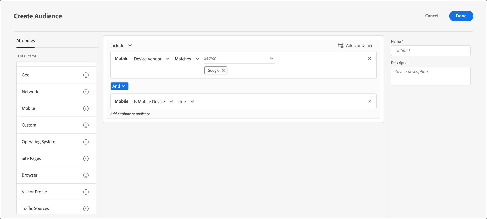

# Dispositivo móvel

Criar públicos-alvo no [!DNL Adobe Target] para direcionar dispositivos móveis com base em parâmetros como dispositivo móvel, tipo de dispositivo, fornecedor de dispositivo, dimensões de tela e muito mais.

Por exemplo, talvez você queira mostrar conteúdos diferentes para usuários que visitam sua página usando um telefone e que visitam usando um computador. Nesse caso, você pode selecionar a variável [!UICONTROL Dispositivo móvel] público-alvo e selecione o **[!UICONTROL É telefone celular]** opção. Em seguida, você pode adicionar detalhes específicos que são importantes para você, como tipo de telefone, tamanho da tela (em pixels) etc.

A definição de metas móvel é fornecida pelo [DeviceAtlas,](https://deviceatlas.com/device-data/user-agent-tester) um serviço de dotmobi. O DeviceAtlas é um amplo banco de dados de dispositivos móveis construídos em dados compilados a partir de diversas fontes, incluindo fabricantes e operadores de rede. Estes dados são então verificados, referenciados e validados para construir um banco de dados de dispositivos móveis grande e preciso.

A detecção do dispositivo é realizada pela análise das cadeias de caracteres Usuário-agente. Alguns fabricantes de dispositivo, como a Apple, desativam essa funcionalidade ao não fornecer informações suficientes no UA.

Por exemplo, os dispositivos da Apple não compartilham tokens específicos do modelo de dispositivo no UA. O resultado é que não é possível detectar modelos do iPhone (como iPhone 12 Pro, iPhone 12, iPhone 11 Pro Max e assim por diante) usando um método simples baseado em palavras-chave.

Para resolver esse problema, [!DNL Target] O coleta dados adicionais para detectar com precisão iPhones e outros dispositivos Apple usando os seguintes parâmetros:

| Parâmetro | Tipo | Descrição |
|--- |--- |--- |
| devicePixelRatio | String | Proporção entre pixels físicos e pixels independentes de dispositivo (dips) no navegador. Por exemplo, &quot;1,5&quot; ou &quot;2&quot; |
| screenOrientation | String | O dispositivo e o mecanismo JavaScript do navegador são compatíveis com a Orientação do dispositivo. Ela pode ser Paisagem ou Retrato. |
| webGLRenderer | String | Renderizador do navegador do driver gráfico. |

>[!NOTE]
>
>Os clientes que usam o SDK móvel não precisam fazer nada para aplicar essa funcionalidade. Clientes usando at.js devem [atualização para a at.js versão 1.5.0](https://experienceleague.corp.adobe.com/docs/target-dev/developer/client-side/at-js-implementation/target-atjs-versions.html?lang=pt-BR){target=_blank} (ou posteriormente).

Você pode escolher mais de uma propriedade de dispositivo móvel. Várias seleções são unidas com um operador OR.

Os clientes que usam uma integração personalizada (que não usa at.js ou o Mobile SDK) podem coletar esses parâmetros e passá-los como parâmetros da mbox.

1. Na interface do [!DNL Target], clique em **[!UICONTROL Públicos-alvo]** > **[!UICONTROL Criar público-alvo]**.
1. Nomeie o público-alvo e adicione uma descrição opcional.
1. Arrastar e soltar **[!UICONTROL Dispositivo móvel]** no painel do audience builder.
1. Clique em **[!UICONTROL Selecionar]** e selecione uma destas opções:

   * Nome de marketing do dispositivo
   * Modelo do dispositivo
   * Fornecedor do dispositivo
   * É dispositivo móvel
   * É celular
   * É tablet
   * SO
   * Altura de tela (px)
   * Largura de tela (px)

   >[!NOTE]
   >
   >Você pode direcionar por operadora de dispositivo móvel usando as [configurações geográficas](/help/main/c-target/c-audiences/c-target-rules/geo.md#concept_5B4D99DE685348FB877929EE0F942670).

1. (Opcional) Configure regras adicionais para o público-alvo.
1. Clique em **[!UICONTROL Concluído]**.

 ilustração a seguir mostra um público-alvo direcionando visitantes que usam dispositivos móveis fabricados pelo Google.

## Considerações

Considere as seguintes informações ao direcionar dispositivos móveis:

### Dispositivos de direcionamento que executam o iOS 12.2 ou posterior

Devido às novas alterações introduzidas no iOS 12.2, a criação de um público-alvo com regras definidas pelo [!UICONTROL Nome de comercialização do dispositivo] e [!UICONTROL Modelo do dispositivo] que especificam os Modelos do iPhone será afetada. [!DNL Target] O não pode mais direcionar usuários que têm iPhones com iOS 12.2 (ou posterior) instalado. No entanto, se esses usuários não tiverem o iOS 12.2 (ou posterior), o direcionamento por Modelo do iPhone continuará a funcionar corretamente.

A atualização do iOS 12.2 (ou posterior) não afeta a identificação dos seguintes modelos, pois eles não oferecem suporte à atualização para o iOS 12.2: iPhone, iPhone 3G, iPhone 3GS, iPhone 4, iPhone 4s, iPhone 5, iPhone 5c, iPad, iPad 2, exibição iPad / Retina, iPad Retina (4ª geração), iPod Touch 4 e iPod Touch 5.

### Dispositivos de direcionamento que executam o Safari 14.0.2 (ou posterior)

Ao usar regras móveis para direcionar dispositivos que executam o Safari versão 14.0.2 (ou posterior) no macOS, devido a um problema conhecido envolvendo os agentes de usuário e o DeviceAtlas da Apple, [!DNL Target] O identifica incorretamente o Safari em dispositivos Mac e iPad. Esse problema será resolvido no futuro.

## Vídeo de treinamento: Criação de públicos-alvo

Este vídeo inclui as informações sobre o uso das categorias de público-alvo.

* Criar públicos-alvo
* Definir categorias de públicos-alvo

>[!VIDEO](https://video.tv.adobe.com/v/17392)
