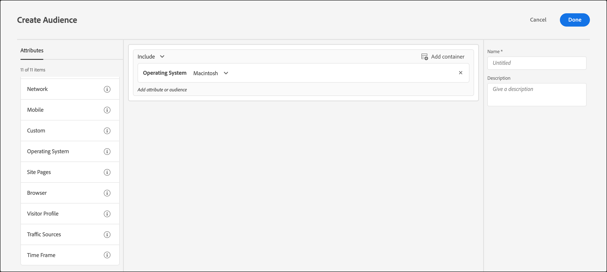

# Sistema operacional

Você pode direcionar visitantes usando [!DNL Adobe Target] que usam um determinado sistema operacional.

1. Na interface [!DNL Target], clique em **[!UICONTROL Audiences]** > **[!UICONTROL Create Audience]**.
1. Nomeie o público-alvo e adicione uma descrição opcional.
1. Arraste e solte **[!UICONTROL Operating System]** no painel do audience builder.
1. Clique em **[!UICONTROL Select]** e selecione uma das seguintes opções:

   * Linux
   * Macintosh
   * Windows

1. (Opcional) Configure regras adicionais para o público-alvo.
1. Clique em **[!UICONTROL Done]**.

A ilustração a seguir mostra um público-alvo direcionado a visitantes que usam Macintosh OS.

## Vídeo de treinamento: Criação de públicos-alvo

Este vídeo inclui as informações sobre o uso das categorias de público-alvo.

* Criar públicos-alvo
* Definir categorias de públicos-alvo

>[!VIDEO](https://video.tv.adobe.com/v/17392)
