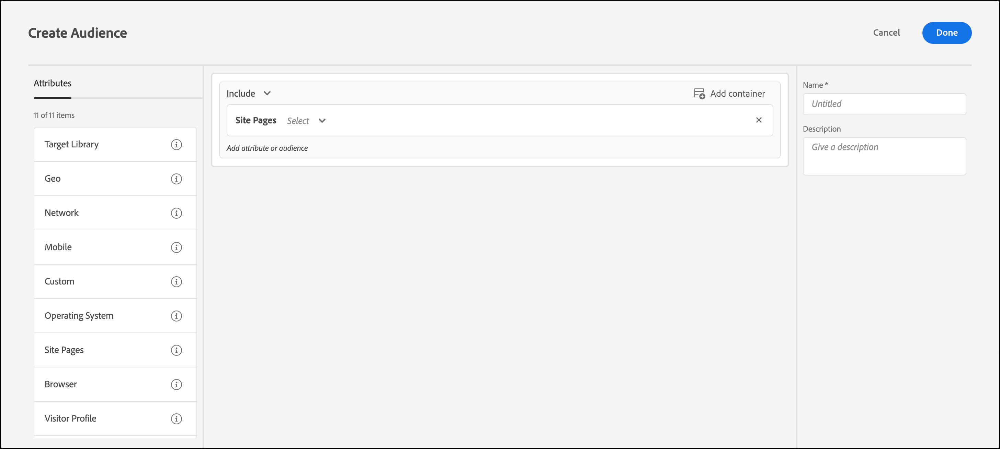

# Páginas do site

Você pode direcionar os visitantes usando o [!DNL Adobe Target] que acessam uma página específica no seu site.

1. Na interface [!DNL Target], clique em **[!UICONTROL Audiences]** > **[!UICONTROL Create Audience]**.
1. Nomeie o público-alvo e adicione uma descrição opcional.
1. Arraste e solte **[!UICONTROL Site Pages]** no painel do audience builder.

   

1. Clique na lista suspensa **[!UICONTROL Select]**, selecione uma das opções a seguir e configure a regra conforme desejado.

   As opções e os avaliadores disponíveis nas listas suspensas subsequentes na regra variam de acordo com a opção escolhida. A ilustração a seguir mostra as opções disponíveis se você escolher [!UICONTROL Current Page]:

   

   As opções a seguir estão disponíveis na lista suspensa inicial quando você escolhe [!UICONTROL Select].

   * **[!UICONTROL Current Page]:** A página que o usuário está visualizando.

     As seguintes opções estarão disponíveis na segunda lista suspensa se você escolher essa opção:

      * [!UICONTROL URL] (Para obter mais informações sobre como [!DNL Target] avalia URLs, consulte [Perguntas frequentes sobre direcionamentos e público-alvo](/help/main/c-target/c-troubleshooting-targets-and-audiences/troubleshooting-targets-and-audiences.md).)
      * [!UICONTROL Domain]
      * [!UICONTROL Query]
      * [!UICONTROL Subdomain]
      * [!UICONTROL Top-Level Domain]
      * [!UICONTROL Path]
      * [!UICONTROL Hash (#) fragment]

   * **[!UICONTROL Previous Page]:** A página que o usuário visualizou antes de clicar na página atual. O usuário deve clicar em da página anterior para a página atual para que a página seja rastreada. A página anterior não é rastreada se o usuário digitar um novo URL no navegador. O conteúdo atual dessa página depende do design do seu site. Por exemplo, se a página atual exibir informações sobre um produto específico, a página anterior pode ser uma página de categoria em que o visitante seleciona o item específico. Por exemplo, uma página que exibe várias câmeras de um determinado tipo ou pode ser a página inicial que leva à página final.

     As seguintes opções estarão disponíveis na segunda lista suspensa se você escolher essa opção:

      * [!UICONTROL URL] (Para obter mais informações sobre como o Target avalia as URLs, consulte [Perguntas frequentes sobre direcionamentos e público-alvo](/help/main/c-target/c-troubleshooting-targets-and-audiences/troubleshooting-targets-and-audiences.md).)
      * [!UICONTROL Domain]
      * [!UICONTROL Query]
      * [!UICONTROL Subdomain]
      * [!UICONTROL Top-Level Domain]
      * [!UICONTROL Path]

   * **[!UICONTROL Landing Page]:** A página de aterrissagem é a primeira página que o visitante vê ao acessar seu site. Por exemplo, se o visitante clica em um link no Google, que leva a uma página da categoria, a página da categoria é a página de aterrissagem. Se o link leva para sua home page, a home page é a página de aterrissagem. A página de aterrissagem é lembrada para a sessão do visitante. É possível direcionar mais profundo no site baseado em que a página de aterrissagem do visitante estava nessa sessão.

     As seguintes opções estarão disponíveis na segunda lista suspensa se você escolher essa opção:

      * [!UICONTROL URL] (Para obter mais informações sobre como o Target avalia as URLs, consulte [Perguntas frequentes sobre direcionamentos e público-alvo](/help/main/c-target/c-troubleshooting-targets-and-audiences/troubleshooting-targets-and-audiences.md).)
      * [!UICONTROL Domain]
      * [!UICONTROL Query]
      * [!UICONTROL Subdomain]
      * [!UICONTROL Top-Level Domain]
      * [!UICONTROL Path]
      * [!UICONTROL Hash (#) fragment]

     >[!NOTE]
     >
     >O objeto `landing.url` é redefinido em uma alteração de subdomínio ou em uma substituição do URL direto.

   * **[!UICONTROL HTTP Header]:** Essa opção avalia as informações no cabeçalho HTTP da solicitação [!DNL Target]. Por exemplo, se o cabeçalho HTTP contiver informações de idioma, você poderá criar uma regra que contenha a condição `Accept-Language: es` para direcionar visitantes que acessam a página em espanhol.

     As seguintes opções estarão disponíveis na segunda lista suspensa se você escolher essa opção:

      * [!UICONTROL Accept]
      * [!UICONTROL Accept-Charset]
      * [!UICONTROL Accept-Encoding]
      * [!UICONTROL Accept-Language]
      * [!UICONTROL Authorization]
      * [!UICONTROL Cache-Control]
      * [!UICONTROL Connection]
      * [!UICONTROL Content-Length]
      * [!UICONTROL Content-MDS]
      * [!UICONTROL Content-Type]
      * [!UICONTROL Date]
      * [!UICONTROL Expect]
      * [!UICONTROL From]
      * [!UICONTROL Host]
      * [!UICONTROL If-Match]
      * [!UICONTROL If-Modified-Since]
      * [!UICONTROL If-None-Match]
      * [!UICONTROL If-Range]
      * [!UICONTROL If-Unmodified-Since]
      * [!UICONTROL Max-Forwards]
      * [!UICONTROL Pragma]
      * [!UICONTROL Proxy-Authorization]
      * [!UICONTROL Range]
      * [!UICONTROL Referrer]
      * [!UICONTROL TE]
      * [!UICONTROL Upgrade]
      * [!UICONTROL User-Agent]
      * [!UICONTROL Via]
      * [!UICONTROL Warning]

   Se você escolheu [!UICONTROL Current Page], [!UICONTROL Previous Page] ou [!UICONTROL Landing Page], as opções [!UICONTROL Domain] e [!UICONTROL Query] estão disponíveis. Considere o seguinte ao escolher essas opções:

   * **Domínio:** o domínio completo da página. Ao especificar um domínio, a prática recomendada é usar &quot;contém&quot;. Por exemplo, &quot;Domínio igual a facebook.com&quot; não aceita `m.facebook.com` ou `www.facebook.com`. &quot;Domínio contém facebook.com&quot; aceita qualquer variante de facebook.com.
   * **Consulta:** o conteúdo da URL após o primeiro ponto de interrogação (?).

     `foo.html?e0a72cb2a2c7`

1. (Opcional) Configure regras adicionais para o público-alvo.
1. Clique em **[!UICONTROL Done]**.

É possível criar públicos-alvo de páginas do site usando seu próprio &quot;parâmetro de consulta definido pelo usuário&quot; ou &quot;cabeçalho definido pelo usuário&quot;.

Use um:

* Consultar parâmetro se a regra selecionada pelo usuário for [!UICONTROL Current Page], [!UICONTROL Landing Page] ou [!UICONTROL Previous Page]
* Cabeçalho se a regra selecionada pelo usuário for um cabeçalho HTTP

## Solução de problemas {#ts}

* Para que os públicos-alvo da página de aterrissagem funcionem corretamente, as solicitações devem ter o parâmetro `mboxReferrer` definido (para a API de entrega, o parâmetro `context.address.referringUrl`) que a biblioteca at.js de JavaScript coleta da página usando o atributo `document.referrer`. Este atributo `HTMLDocument` retorna o URI da página pela qual o usuário navegou. O valor desse atributo é uma string vazia quando o usuário navega diretamente para a página (não por meio de um link, mas, por exemplo, por meio de um marcador).

  Se esse comportamento não corresponder aos seus requisitos, considere executar uma das seguintes ações:

   * Passe [parâmetros de mbox](https://experienceleague.adobe.com/docs/target-dev/developer/client-side/global-mbox/pass-parameters-to-global-mbox.html?lang=pt-BR){target=_blank} para [!DNL Target] para serem usados para fins de direcionamento.
   * Use uma [atividade de Teste A/B](/help/main/c-activities/t-test-ab/test-ab.md) em vez de uma atividade de página de aterrissagem. As atividades de Teste A/B não alternam experiências para o mesmo visitante.
   * Em vez disso, use um [perfil de visitante](/help/main/c-target/c-audiences/c-target-rules/visitor-profile.md).

* Ao usar avaliadores &quot;inicia/termina com&quot; em cadeias de caracteres que contêm vírgulas, essas cadeias de caracteres são avaliadas como uma matriz de valores, na qual cada valor separado por vírgula é avaliado. Por exemplo, se você tiver o valor de um cabeçalho: `Accept-Language: en,zh;q=0.9,en-IN;q=0.8,zh-CN;q=0.7` ele se qualifica para condições como:
   * começa com zh,
   * começa com en,
   * termina com 0,7,
   * termina com 0,8.

## Vídeo de treinamento: Criação de públicos-alvo

Este vídeo inclui as informações sobre o uso das categorias de público-alvo.

* Criar públicos-alvo
* Definir categorias de públicos-alvo

>[!VIDEO](https://video.tv.adobe.com/v/17392)
