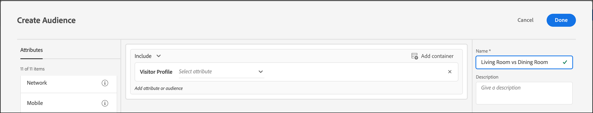
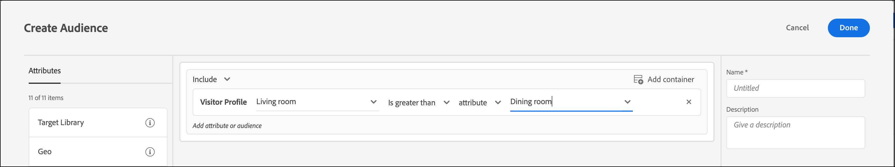

# Criar um público-alvo de comparação do atributo de perfil

Defina um público-alvo em [!DNL Adobe Target] para comparar dois atributos de perfil da sua [Biblioteca de público-alvo](/help/main/c-target/c-audiences/audiences.md) ou em um [público-alvo somente de atividade](/help/main/c-target/creating-activity-only-audience.md). O uso de operadores, como maior que, menor que ou igual a, define um público-alvo para comparar dinamicamente os valores de dois atributos de perfil diferentes.

>[!NOTE]
>
>Esta funcionalidade está disponível somente para a categoria [[!UICONTROL Perfil do Visitante]](/help/main/c-target/c-audiences/c-target-rules/visitor-profile.md#concept_E972690B9A4C4372A34229FA37EDA38E).

## Visão geral {#section_303CBC78194D49A2A004945D425441E1}

Os públicos-alvo são definidos por regras que determinam quem está incluso ou foi excluído de uma atividade no [!DNL Target]. Uma definição de público-alvo pode incluir diversas regras, e cada uma delas pode incluir vários parâmetros. Se uma das regras incluídas usar a categoria [!UICONTROL Perfil do visitante], você poderá definir uma regra com base no valor específico de um atributo de perfil de visitante ou comparar o valor desse atributo com outro atributo de perfil de visitante.

Por exemplo, vamos supor que você trabalhe para uma empresa de mobília e tenha carregado duas pontuações de propensão do cliente em [!DNL Target]:

* Probabilidade de comprar móveis para a sala de jantar nos próximos 90 dias
* Probabilidade de comprar móveis para a sala de estar nos próximos 90 dias

Você poderia criar um público-alvo definido como a propensão para comprar móveis para a sala de jantar maior do que para comprar móveis para a sala de estar. [!DNL Target] compararia dinamicamente as pontuações de propensão da sala de jantar e da sala de estar de um visitante específico para determinar se ele se qualifica para esse público-alvo.

Para obter mais informações, consulte [Métodos para obter dados no Target](https://experienceleague.adobe.com/docs/target-dev/developer/implementation/methods/methods-to-get-data-into-target.html?lang=pt-BR){target=_blank}.

## Criar um público-alvo de comparação do atributo de perfil {#section_7A62FD47D5C74C3EBC3417ACDBB85013}

1. Clique em **[!UICONTROL Públicos-alvo]** > **[!UICONTROL Criar público-alvo]**.
1. Nomeie o público-alvo e adicione uma descrição opcional.
1. Arraste e solte **[!UICONTROL Perfil do visitante]** no painel do construtor de público-alvo.
1. Na lista suspensa **[!UICONTROL Perfil do visitante]**, escolha um atributo:

   

1. Escolha o avaliador:

   

1. Na lista suspensa **[!UICONTROL Escolher o tipo de comparação]**, escolha **[!UICONTROL Atributo]**.

   O tipo de comparação de &quot;valor estático&quot; permite comparar o atributo de perfil do visitante com valores específicos.

   

   >[!NOTE]
   >
   >Se estiver usando uma das categorias de perfil do visitante padrão (por exemplo, Novo visitante ou Visitante recorrente), você poderá escolher somente a opção de valor estático. As opções de comparação dinâmica não estão disponíveis para as categorias padrão. Outros exemplos em que as opções de comparação dinâmica não estão disponíveis incluem &quot;Primeira página da sessão&quot;, &quot;Não em outros testes&quot;, &quot;Não é primeira página da sessão&quot; e &quot;Afinidade de categorias&quot;.

1. Escolha o atributo adicional que deseja comparar com o atributo inicial.

   

1. Clique em **[!UICONTROL Concluído]**.

## Vídeo de treinamento  {#section_3BB8DBF3418F4520B3E274B6F40AF8F3}

Assista ao vídeo a seguir para obter mais informações e um cenário no qual seja possível usar esse recurso:

>[!VIDEO](https://video.tv.adobe.com/v/23218/)
