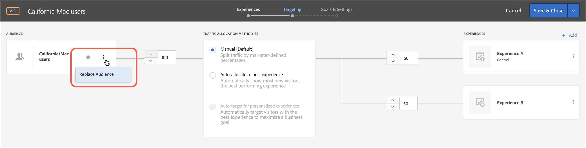

# Criar um público-alvo com apenas uma atividade

Crie públicos somente de atividades dentro do fluxo de trabalho guiado de três etapas do [!DNL Adobe Target] ao criar uma atividade. Esses públicos podem ser usados em outros locais na mesma atividade, mas não são armazenados no [!UICONTROL Audiences Library] para uso em outras atividades.

Públicos-alvo somente atividade proporcionam os seguintes benefícios:

* Públicos somente atividade são úteis para criar um público-alvo que você deseje usar somente uma vez e não deseje armazenar no [!UICONTROL Audiences Library]. Públicos somente atividade ajudam a evitar que o [!UICONTROL Audiences Library] seja desordenado com públicos que você nunca desejará utilizar novamente.
* Públicos somente atividade não estão visíveis no [!UICONTROL Audiences Library]. Como esses públicos-alvo não estão visíveis na biblioteca, eles são protegidos contra alterações indesejadas por outros em sua organização.

1. Ao criar uma [atividade](/help/main/c-activities/activities.md#concept_D317A95A1AB54674BA7AB65C7985BA03), na página **[!UICONTROL Targeting]**, clique nos sinal de três pontos verticais e clique em **[!UICONTROL Replace Audience]**.

   

1. Clique em **[!UICONTROL Create Audience]**.

1. Clique em **[!UICONTROL This activity only]**.

   

1. Digite um nome de público-alvo descritivo.
1. Arraste e solte os atributos desejados no construtor de público-alvo.

   As regras permitem limitar o público-alvo a um subconjunto de visitantes do site. Cada tipo de regra tem seus próprios parâmetros. Consulte [Categorias para públicos-alvo](/help/main/c-target/c-audiences/c-target-rules/target-rules.md#concept_E3A77E42F1644503A829B5107B20880D) para obter mais informações sobre a configuração de cada tipo de regra de público-alvo.

1. Clique em **[!UICONTROL Done]**.

## Considerações

Tenha em mente as informações a seguir enquanto você trabalha com públicos somente-atividades:

* Você pode criar públicos somente atividade no [!UICONTROL Visual Experience Composer] (VEC) ou no [!UICONTROL Form-Based Experience Composer]. Esta funcionalidade substitui as regras de refinamento nas versões anteriores do [!DNL Target].
* Você pode criar uma atividade para armazenar no [!UICONTROL Audience Library] para reutilização em outras atividades ou criar um público somente atividade. Depois de salvar o público-alvo, não é possível mudar o tipo de público-alvo.
* Os refinamentos das atividades existentes são migrados para públicos-alvo somente atividade.
* Públicos somente atividade têm status de [!UICONTROL Used] ou [!UICONTROL Unused]. Públicos-alvo somente atividade não utilizados são exibidos até que a atividade seja salva. Se deixados não utilizados e você tentar salvar a atividade, uma mensagem de alerta é exibida informando que públicos-alvo somente atividade não utilizados serão excluídos.
* É possível ver os detalhes da definição de público-alvo em um cartão pop-up acessado do seletor de público-alvo sem abrir o público-alvo.
* Você pode [combinar vários públicos](/help/main/c-target/combining-multiple-audiences.md#concept_A7386F1EA4394BD2AB72399C225981E5) para criar públicos somente atividade.
* Públicos somente atividade não são compatíveis com regras de exclusão.

  Você pode usar as seguintes alternativas para usar as regras de exclusão:

   * [Crie e use um público-alvo de biblioteca](/help/main/c-target/c-audiences/create-audience.md) em vez de um público-alvo somente de atividade.
   * [Combine vários públicos-alvo de biblioteca](/help/main/c-target/combining-multiple-audiences.md#concept_A7386F1EA4394BD2AB72399C225981E5) (até 20) em um público-alvo somente de atividade. Ao combinar públicos-alvo, as regras de inclusão e exclusão em públicos-alvo de biblioteca individuais podem ser usadas mesmo quando o público-alvo combinado é salvo como um público-alvo somente de atividade.
