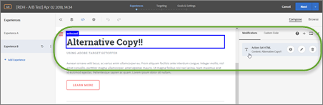
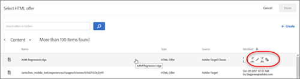

# Notas de versão para versões anteriores

Notas de versão referentes a versões anteriores do [!DNL Adobe Target], incluindo notas de versão para o [!DNL Target Standard/Premium], a plataforma do [!DNL Target] e a biblioteca JavaScript do [!DNL Target] (at.js).

As notas de versão são processadas em ordem decrescente por mês e ano da versão.

>[!NOTE]
>
>Consulte [Notas de versão do Target (atual)](/help/main/r-release-notes/release-notes.md#reference_8FE40B43A5A34DDF8F26A53D55EE036A) para obter informações sobre as versões do Target para o mês vigente (plataforma e Target Standard/Premium).

## Notas de versão - 2025

### [!DNL Target Standard/Premium] 25.5.4 (29 de maio de 2025)

Esta versão do inclui as seguintes correções e atualizações:

* Correção de um problema que impedia a adição ou edição de URLs no modo de QA. (TGT-51941)
* Adição de uma configuração de Tráfego do Modo de QA em [!UICONTROL Reports] > [!UICONTROL Report Settings] (  ) para alinhar-se à funcionalidade da interface herdada [!DNL Target]. (TGT-52228 e TGT-52329)
* Correção de um problema em que a atividade baseada em formulário gerava links de controle de qualidade incorretos. O URL/local da atividade incluía um &quot;1&quot; não intencional no final, que agora foi removido para garantir a vinculação precisa. (TGT-52355 e TGT-52358)
* Correção de um problema em que a atividade baseada em formulário gerava links de controle de qualidade incorretos. A URL da atividade incluía um `http://pid-ppc` não intencional no início da URL, que agora foi removido para garantir a vinculação precisa. (TGT-52557)
* Correção de um problema em que [!DNL Target] gerava links de controle de qualidade inválidos para atividades baseadas em formulário. (TGT-52528 e TGT-52603)
* Correção de um problema em que salvar uma atividade modificada parecia ser processado, mas nunca concluído, e nenhuma mensagem de erro era exibida em [!DNL Target]. (TGT-52461)
* Correção de um problema em que o VEC ([!UICONTROL Visual Experience Composer] atualizado) não detectava automaticamente o valor `at_property`. (TGT-52347)
* Correção de um problema que causava o registro de duas modificações quando apenas uma era esperada após alternar entre os modos [!UICONTROL Browse] e [!UICONTROL Design] no VEC ao interagir com um elemento de formulário. (TGT-52455)
* Correção de um problema que impedia a seleção da configuração [!UICONTROL Clicked an Element] no VEC atualizado devido a um erro informando que o seletor era inválido, já estava em uso ou não estava visível. (TGT-52467)
* Correção de um problema em que a adição de uma caixa [!UICONTROL Recommendation Offer] no VEC atualizado fazia com que caixas duplicadas (fantasmas) fossem exibidas. A alternância entre a Experiência A e B adicionou repetidamente mais caixas fantasmas. (TGT-52505 e TGT-52519)
* Correção de um problema na interface do usuário atualizada do [!DNL Target], em que as alterações em uma Oferta da HTML feitas por meio do menu [!UICONTROL Offer] não eram refletidas na atividade associada, e vice-versa. Esse comportamento agora corresponde à interface herdada, na qual as atualizações são sincronizadas corretamente entre o menu [!UICONTROL Offer] e a atividade. (TGT-52540 e TGT-52541)
* Correção de um problema em que atualizações recentes de [!UICONTROL Experience Fragments] no [!UICONTROL Offers Library] não eram refletidas ao tentar usá-las em uma atividade. (TGT-52659)
* Correção de um problema de localização na tradução para chinês simplificado de uma mensagem de confirmação. A versão anterior não tinha aspas ao redor do nome do local e usava linguagem informal, ao contrário do guia de estilo do cliente. A tradução atualizada agora usa pontuação adequada e um tom formal. (TGT-52364)

### [!DNL Target Standard/Premium] 25.5.3 (22 de maio de 2025)

Esta versão do inclui as seguintes correções e atualizações:

* Correção de um problema em que o recurso pesquisar por nome na lista [!UICONTROL Activities] não funcionava corretamente com consultas de várias palavras. (TGT-52529)
* Correção de um problema que impedia a exclusão de experiências de [!UICONTROL Automated Personalization] atividades (AP). (TGT-52383)
* Correção de um problema em que a opção &quot;[!UICONTROL Contains]&quot; estava ausente em [!UICONTROL Filter Rules] ao gerenciar conteúdo em atividades de AP. (TGT-52384)
* Correção de uma inconsistência de relatórios em atividades de [!UICONTROL Automated Personalization] (AP), especificamente relacionada ao modo como as ofertas padrão são rastreadas e relatadas usando valores `optionLocalId` do sistema interno de [!DNL Target].
* Correção de um problema em que os links de controle de qualidade falhavam em fornecer a experiência de atividade desejada. (TGT-52163)
* Correção de um problema em que usuários com permissões [!UICONTROL Approver] eram impedidos de editar atividades ao vivo incorretamente, recebendo uma mensagem de erro &quot;Acesso negado&quot;. (TGT-52416)
* Correção de um problema em que os refinamentos de público-alvo não eram exibidos para determinadas atividades na interface do usuário atualizada [!DNL Target]. (TGT-52057)
* Correção de um problema que fazia com que refinamentos de público-alvo e públicos-alvo de atividades fossem revertidos na interface do usuário atualizada. (TGT-52158)
* Correção de um problema em que a geração de ofertas ad-hoc resultava em ofertas duplicadas. (TGT-51938)
* Correção de um problema que bloqueava atualizações de ofertas e exibia incorretamente um erro &quot;Usuário inválido&quot;. (TGT-52361)
* Correção de um problema que impedia o salvamento de atividades existentes, acionando um erro &quot;Entrada de usuário inválida&quot;. (TGT-52422)
* Correção de um problema que bloqueava a edição de ofertas existentes do HTML, acionando um erro &quot;Entrada de usuário inválida&quot; ao salvar, mesmo quando nenhuma alteração de código era feita. (TGT-52351)
* Correção de um problema que impedia [!DNL Target] de reconhecer o caractere &quot;#&quot; na URL de um site. (TGT-52093)
* Correção de um problema que impedia a edição de atividades [!DNL Recommendations] para adicionar ou atualizar promoções, o que causava falhas no salvamento e promoções duplicadas. (TGT-52343)
* Correção de um problema que impedia alterações em critérios ou designs nas atividades [!DNL Recommendations], resultando em um erro &quot;JSON inválido: nome de propriedade não reconhecido&quot;. (TGT-52375)
* Correção de um problema em que os critérios de sequência não eram exibidos corretamente no [!UICONTROL Visual Experience Composer] (VEC) para [!DNL Recommendations] atividades. (TGT-52435)
* Correção de um problema em que os modos de exibição não eram identificados corretamente em páginas do SPA ao usar o [!DNL Adobe Experience Platform Web SDK]. (TGT-52106)
* Correção de um problema em que os detalhes da Decisão no dispositivo (ODS) não eram salvos corretamente, apesar de serem incluídos na carga da operação em lote. (TGT-52406)
* Adição de um campo `audienceMetadata` às atividades, permitindo que ele seja lido e atualizado durante a edição. (TGT-51004)
* Adição de uma mensagem de erro para alertar os usuários quando um período de público-alvo for inválido. (TGT52522)
* Atualização da estrutura da atividade para oferecer suporte a públicos-alvo duplicados de diferentes tipos. (TGT-51200)

### Versão do [!DNL Adobe Target] [!DNL AI Assistant] (16 de maio de 2025)

Temos o prazer de anunciar o lançamento do [!DNL AI Assistant] em [!DNL Adobe Target]! Este poderoso recurso de interface do usuário foi projetado para ajudá-lo a navegar e compreender conceitos do [!DNL Target] com facilidade. Disponível em vários produtos no [!DNL Adobe Experience Cloud], incluindo o [!DNL Target], o [!DNL AI Assistant] está aqui para revolucionar sua experiência.

O [!DNL AI Assistant] no [!UICONTROL Target] é uma ferramenta de conversação que você pode usar para acelerar seus fluxos de trabalho com aplicativos e serviços do [!DNL Experience Platform]. Use o [!DNL AI Assistant] para aumentar sua produtividade geral e ampliar sua compreensão do conhecimento sobre o produto

Em [!DNL Target], a primeira fase do [!DNL AI Assistant] fornece conhecimentos inestimáveis sobre o produto com base na documentação do [!DNL Experience League]. Esteja você configurando um script de perfil, solucionando erros ou pensando em atualizar para o AEP Web SDK, o [!DNL AI Assistant] é o que você precisa.

Para obter mais informações, consulte [Visão geral do Assistente do Adobe Experience Platform AI](/help/main/c-intro/ai-assistant.md).

### [!DNL Target Standard/Premium] 25.5.2 (8 de maio de 2025)

Esta versão do inclui as seguintes correções e atualizações:

* [!DNL Target] usuários com direitos de [!UICONTROL Product Administrator] e [!UICONTROL System Administrator] agora podem editar todas as configurações nas páginas [!UICONTROL Administration], independentemente de sua função no [!DNL Target]. Os usuários sem essas permissões têm acesso somente leitura a essas configurações. Esta atualização garante um controle de acesso mais rigoroso sobre [Configurações de administração](/help/main/administrating-target/administrating-target.md). (TGT-48179)
* Correção de um problema de cache que impedia salvar a atividade [Preferências do site](/help/main/c-experiences/c-visual-experience-composer/viztarget-options.md#settings). (TGT-52213)
* Correção de um problema em que os clientes não podiam habilitar a seleção por ID e classe na seção [!UICONTROL Site Preferences] após carregar o site no VEC. A configuração [!UICONTROL Site Preferences] foi automaticamente revertida para desabilitada mesmo depois de ser habilitada. (TGT-52207)
* Correção de um problema em que o [!UICONTROL Visual Experience Composer] (VEC) não exibia a página correta quando as URLs de [entrega de página](/help/main/c-experiences/c-visual-experience-composer/viztarget-options.md#settings) terminavam com uma barra (/). (TGT-52237)
* Correção de um problema que impedia a remoção de modificações de código personalizadas ao alterar experiências. (TGT-52240)
* Correção de um problema em que as modificações do HTML no VEC sobrepunham elementos de página existentes. (TGT-52265)
* Correção de um problema que impedia a edição do código personalizado no VEC atualizado porque o código personalizado existente não estava visível no editor. (TGT-52272)
* Correção de um problema que causava uma mensagem de erro &quot;Nomes duplicados não são permitidos&quot; ao salvar uma atividade do Recommendations. (TGT-52318)
* Correção de um problema no VEC atualizado que impedia os clientes de editar elementos de texto ou remover objetos de contêiner. (TGT-52348)
* Correção de um problema que impedia a exibição correta de [!DNL Customer Journey Analytics] em uma página de atividade [!UICONTROL Overview]. (TGT-52359)
* Correção de um problema que impedia que os grupos de relatórios persistissem nas atividades de [!UICONTROL Automated Personalization] (AP). (TGT-52368)
* Correção de um problema que impedia o salvamento de atividades que incluíam o Offer Decisioning. (TGT-52390)
* Correção de um problema em que a oferta padrão era selecionada, mas o outro conteúdo de oferta era exibido nas atividades [!UICONTROL Automated Personalization] (AP) e [!UICONTROL Multivariate Test] (MVT). (TGT-52372)
* Correção da lógica de permissões do GET para verificar com OU entre o acesso completo à organização e o acesso específico à organização + usuário. (TGT-52374)
* Correção de um problema em que os nomes de público-alvo não eram exibidos após a seleção de um público-alvo para [!UICONTROL Managed Content] e [!UICONTROL Reporting Audiences], mesmo que [!UICONTROL Show Only Selected] estivesse habilitado. (TGT-52393)

### [!DNL Target Standard/Premium] 25.5.1 (5 de maio de 2025)

Esta versão do inclui as seguintes correções e atualizações:

* Correção de um problema que impedia que refinamentos de público-alvo fossem exibidos para determinadas atividades na interface atualizada. (TGT-52057)
* Correção de um problema que impedia o uso de públicos-alvo combinados em atividades do. (TGT-52346)
* Correção de um problema que impedia a criação de uma nova atividade em um espaço de trabalho não padrão usando um público somente atividade do mesmo espaço de trabalho. (TGE-52349)
* Correção de um problema que fazia com que os públicos-alvo somente de atividades desaparecessem da interface atualizada após criar e selecionar um novo público-alvo. (TGT=52091)
* Correção de um problema que impedia o uso de públicos-alvo duplicados em atividades do. (TGT-51200 e TGT-52057)
* Correção de um problema que fazia com que refinamentos de público-alvo e públicos-alvo de atividades fossem revertidos na interface do usuário atualizada. (TGT-52158)
* Correção de um problema que impedia a criação de uma nova atividade devido ao erro de entrada do usuário: &quot;espaço de trabalho não padrão não permitido para este usuário&quot;. (TGT-52267)
* Correção de um problema que impedia a exibição de ofertas na interface atualizada para espaços de trabalho padrão e não padrão. [!DNL Target] agora exibe ofertas de ambos os espaços de trabalho. (TGT-52339)
* Correção de um problema em que [!DNL Target] não avisava os clientes ao editar uma atividade e alterar um elemento de site modificado. (TGT-52100)
* Correção de um problema em que a edição de uma oferta com ofertas ad-hoc criava uma nova oferta em vez de atualizar a existente. (TGT-52135)
* Correção de um problema que causava um erro de carga inválida ao mover ofertas para pastas. (TGT-52325)
* Correção de um problema que causava um erro de entrada do usuário ao mover ofertas para pastas. (TGT-52296)
* Adicionado um campo `audienceMetadata` para cada atividade, e verificado se ele é lido e atualizado ao editar a atividade. (TGT-51004)

### [!DNL Target Standard/Premium] 25.4.5 (25 de abril de 2025)

Esta versão do inclui as seguintes correções e atualizações:

* Correção de um problema que gerava discrepâncias nas listagens de público entre a página de configurações [!UICONTROL Activity] e a página de visão geral [!UICONTROL Reporting]. (TGT-52203)
* Correção de um problema que impedia a adição de uma nova página a uma atividade devido a um erro de entrada de usuário inválido. (TGT-52263)
* Correção de um problema que fazia com que `OptionLocalIDs` fosse incrementado incorretamente quando a opção permanecesse inalterada. (TGT-52187)
* Correção de um problema que fazia com que `location` e `OptionLocalIDs` fossem incrementados incorretamente quando a opção permanecesse inalterada. (TGT-52188)
* Correção de um problema que fazia com que o local na página [!UICONTROL Overview] da atividade estivesse incorreto. (TGT-52182)
* Correção de um problema em que um aviso de seletor inválido não era exibido para um local inválido. (TGT-52110)
* Correção de um problema para que os arquivos de relatórios baixados mostrassem corretamente os dados presentes na interface do usuário dos relatórios. (TGT-52068)
* Correção de um problema para que as operações em lote não falhassem após a adição das regras de entrega de página. (TGT-52097)
* Correção de um problema que fazia com que [!DNL Target] cortasse todos os parâmetros de consulta da URL do site. (TGT-52100)
* Correção de um erro de console que impedia os clientes de criar atividades na interface herdada e atualizada do [!DNL Target]. (TGT-52181)
* Correção de um problema que impedia os clientes de adicionar novas páginas, causando um erro de entrada de usuário inválido. (TGT-52258)
* Correção de um problema que fazia com que as modificações desaparecessem após adicionar outras páginas e navegar de volta para a guia [!UICONTROL Experiences]. (TGT-52264)
* Correção de um problema que impedia os clientes de alterar o público-alvo em uma atividade [!UICONTROL Experience Targeting] (XT). (TGT-52191)
* Correção de um erro que impedia a edição de uma atividade de XT devido a uma regra de interface do usuário não compatível. (TGT-52273)
* Correção de um problema no [!UICONTROL Visual Experience Composer] (VEC) atualizado em que as navegações estruturais nem sempre eram exibidas na parte inferior do editor, causando dificuldades na seleção precisa de elementos. (TGT-52169)
* Correção de um problema em que a lista suspensa [!UICONTROL Audience] não exibia todos os públicos-alvo devido à paginação. (TGT-52204)
* Correção de um problema que causava uma mensagem de entrada de usuário inválida ao adicionar novas ofertas em [!UICONTROL Automated Personalization] atividades (AP). (TGT-52210)
* Correção de um problema em que [!UICONTROL Analytics for Target] (A4T) era selecionado incorretamente como fonte de relatórios, mesmo que o cliente não tivesse acesso ao A4T. (TGT-52226)
* Correção de um problema que impedia salvar uma atividade com a métrica de URL [!UICONTROL View a Page]. (TGT-52260)
* Correção de um problema que impedia os clientes de selecionar espaços de trabalho ao criar ofertas em uma atividade. (TGT-52289)
* Correção de um problema que impedia os clientes de criar atividades em todos os espaços de trabalho. (Tgt-52218)
* Correção de um problema em que as modificações de uma experiência eram exibidas incorretamente ao alternar para outra experiência. (TGT-52184)
* Correção de um problema em que a oferta padrão era exibida incorretamente na interface do usuário do [!DNL Target] ao abrir a atividade. (TGT-52198)

### Atualização de permissões do Target (22 de abril de 2025)

Essa atualização futura melhora o controle organizacional sobre as configurações da instância [!DNL Target], evitando atualizações acidentais que podem afetar a entrega da atividade em várias equipes de teste e personalização.

A partir de 22 de abril de 2025, somente [!UICONTROL Product] e [!UICONTROL Solutions] administradores poderão atualizar as configurações nas seções [!UICONTROL Administration], independentemente de suas funções nos espaços de trabalho [!DNL Target]. Os usuários sem esta permissão terão acesso somente leitura às seções [!UICONTROL Administration].

Para obter mais informações, consulte [Administrar Target](/help/main/administrating-target/start-target.md).

### [!DNL Target Standard/Premium] 25.4.4 (17 de abril de 2025)

Esta versão do inclui as seguintes correções e atualizações:

* Adição de uma mensagem de erro para orientar os usuários sobre a resolução de opções de duplicação em uma atividade. (TGT-51927)
* Correção de um problema em que `ClickTrack` seletores não eram removidos ao excluir páginas ou experiências com ofertas de redirecionamento. (TGT-51952)
* Correção de um problema causado pela permissão de seletores `ClickTrack` vazios. [!DNL Target] agora exige que o campo seletor não esteja em branco. (TGT-52107)
* Correção de um problema que permitia incorretamente métricas com nomes duplicados. Métricas agora exigem nomes exclusivos. (TGT-52201)
* Correção de um problema em que as definições de público-alvo não estavam visíveis ao editar o direcionamento no nível de oferta nas atividades de [!UICONTROL Automated Personalization] (AP). (TGT-52148)
* Correção de um problema que impedia clientes com direitos de [!UICONTROL Editor] de salvar atividades. (TGT-52227)
* `OptionLocalIDs` não incrementa mais incorretamente quando a opção permanece inalterada. (TGT-52139)
* Correção de um problema que causava uma mensagem &quot;Inválido `optionLocalIds`&quot; ao tentar criar uma atividade. (TGT-52154)
* Foram corrigidas discrepâncias entre `OptionLocalIDs` definidas para uma atividade e aquelas usadas para definir experiências. (TGT-52215)
* Correção de um problema que causava uma falha de validação que ocorria ao tentar criar uma atividade A/B. (TGT-51923)

### [!DNL Target Standard/Premium] 25.4.3 (11 de abril de 2025)

Esta versão do inclui as seguintes correções e atualizações:

* Correção de um erro que impedia os clientes de abrirem o pop-up de informações de público-alvo para determinadas atividades do [!UICONTROL Experience Targeting] (XT). (TGT-52049)
* Correção de um problema em que a configuração de público-alvo era revertida para &quot;[!UICONTROL All Visitors]&quot; após as alterações feitas no [!UICONTROL Visual Experience Composer] (VEC). (TGT-52132)
* Correção de um problema em que os refinamentos de público-alvo não eram exibidos para atividades específicas (TGT-52057)
* Correção de um problema que impedia os clientes de inserir um [!UICONTROL Experience Fragment] no espaço de trabalho padrão. (TGT-52073)
* Correção de um problema em que uma oferta era exibida como &quot;Conteúdo não encontrado&quot; e não era exibida na página [!UICONTROL Offers] para uma atividade [!UICONTROL Automated Personalization] (AP). (TGT-52150)
* Adição da capacidade de permitir públicos-alvo duplicados em uma atividade. (TGT-51200)
* Correção de um problema em que o nome incorreto da mbox era exibido na página [!UICONTROL Goals & Settings] para uma atividade XT após a edição. (TGT-52026)
* Correção de um problema em que `defaultContent` era exibido nas opções, apesar de não estar em `experiences/optionLocations`. (TGT-52036)
* Correção de um problema para garantir que cadeias de caracteres vazias não fossem convertidas em valores nulos. (TGT-52037)
* Correção de um problema que exigia que os clientes reconfigurassem o [!UICONTROL Optimization Goal] em [!UICONTROL Reporting Settings] na página [!UICONTROL Goals & Settings] após as edições. (TGT-52071)
* Correção de um problema em que uma atividade sem regras de entrega de página exibia várias regras na página [!UICONTROL Overview]. (TGT-52084)
* Adição de uma mensagem de erro para usuários que tentam salvar uma oferta com caracteres fora do plano multilíngue básico, como emojis. (TGT-52105)
* Correção de um problema em que a abertura de uma atividade acionava a mensagem de erro: &quot;Esta atividade está usando um ou mais públicos-alvo excluídos na origem&quot;. (TGT-52120)
* Correção de um problema em que as métricas ClickTrack não eram exibidas no [!UICONTROL Visual Experience Composer] (VEC) atualizado durante a edição. (TGT-52152)
* Correção de um problema em que um URL com um parâmetro de consulta como o local da atividade não exibia o parâmetro de consulta na página [!UICONTROL Overview] da atividade. (TGT-51635)
* Correção de um problema que impedia que a URL de toda a experiência fosse exibida no [!UICONTROL Browse mode] no [!UICONTROL Visual Experience Composer] (VEC). (TGT-52101)
* Correção de um problema em que a edição de uma atividade fazia com que a entrega da página adicionasse &quot;/&quot; ao final do URL, tornando-a inválida. (TGT-52114)
* Correção de um problema em que o link [!UICONTROL Activity QA] em [!UICONTROL Form-Based Experience Composer] era redirecionado incorretamente para a página inicial [!DNL Adobe Experience Cloud]. (TGT-52055)
* Correção de um problema em que páginas adicionais adicionadas à atividade [!UICONTROL A/B Test] não eram mantidas após salvar e reabrir. (TGT-51994)
* Correção de um problema que impedia os clientes de excluir estilos na seção de estilo em linha. (TGT-52070)
* Restaurado o acesso a [cartões de definição de público-alvo](/help/main/c-target/c-audiences/audiences.md#section_11B9C4A777E14D36BA1E925021945780) na caixa de diálogo [!UICONTROL Activity QA], semelhante à interface herdada. (TGT-52056)
* A interface atualizada não salva páginas ou públicos-alvo sem modificações. Se os clientes adicionaram novas páginas ou públicos-alvo a uma atividade, mas não fizeram alterações, [!DNL Target] descartou os públicos-alvo não modificados ao salvar. Foram adicionadas notificações em locais relevantes para informar os usuários sobre esse comportamento. (TGT-52104)

### [!DNL Target Standard/Premium] 25.4.1 (2 de abril de 2025)

Esta versão do inclui as seguintes correções e atualizações:

* Correção de um problema que fazia com que os públicos-alvo da experiência desaparecessem das atividades. (TGT-52003)
* Correção de um problema que causava elementos inesperados durante a entrega. (TGT-52011)
* Correção de um problema que impedia os clientes de visualizar o público-alvo no gráfico de direcionamento na página Mover[!UICONTROL r]exibir e durante a edição da atividade. (TGT-52050)
* Correção de um problema que impedia os clientes de reordenar as experiências em ordem de prioridade nas atividades [!UICONTROL Experience Targeting] (XT). (TGT-52054)
* Correção de um problema que causava renderização incorreta ao desfazer alterações no estilo do texto. (TGT-51876)
* Correção de um problema que, ao modificar uma oferta de redirecionamento, [!DNL Target] também removia todos os seletores [!UICONTROL ClickTrack] associados a essa oferta. (TGT-51936)
* Correção de um problema que fazia com que [!DNL Target] salvasse incorretamente o seletor ao cancelar [!UICONTROL ClickTrack]. (TGT-51937)
* Correção de um problema que acionava um erro de nome inválido após abrir e fechar o seletor de mbox na página [!UICONTROL Goals & Settings] sem fazer alterações. (TGT-51983)
* Correção de um problema que bloqueava a edição de ofertas ad hoc criadas na interface herdada do usuário [!DNL Target]. (TGT-51984)
* Correção de um problema que bloqueava atividades de edição com ofertas ad hoc que continham código personalizado. (TGT-51995)
* Correção de um problema que fazia com que as regras de exclusão fossem exibidas como regras de inclusão ao editar definições combinadas de público-alvo. (TGT-51999)
* Correção de um problema que impedia a exibição correta do código personalizado durante a edição da experiência. (TGT-52005)
* Correção de um problema que tornava a opção [!UICONTROL Insert Before] indisponível para inserir conteúdo antes da barra de navegação. (TGT-52031)
* Correção de um problema que impedia o realce correto da experiência padrão nos relatórios. (TGT-51716)
* Correção de um problema que acionava uma mensagem `default message [Invalid optionLocalIds: xx]]` ao criar uma atividade. (TGT-52038)

### Versão 2.11.8 da at.js (31 de março de 2025)

* Solução da vulnerabilidade identificada pelo CodeQL na validação do sufixo da cadeia de caracteres para evitar casos de borda durante operações de redimensionamento e movimentação. (TNT-51516)

### [!DNL Target Standard/Premium] 25.3.8 (28 de março de 2025)

Esta versão do inclui as seguintes correções e atualizações:

* Solução de um problema que fazia com que a página [!UICONTROL Activities] carregasse lentamente. (TGT-51151)

### [!DNL Target Standard/Premium] 25.3.7 (26 de março de 2025)

Esta versão do inclui as seguintes correções e atualizações:

* Correção de um problema que bloqueava o salvamento de atividades de várias páginas se uma página fosse excluída após as modificações. (TGT-51988)
* Correção de um erro que ocorria ao editar uma atividade: `default message [Invalid optionLocalIds: xx]]`. (TGT-51985)
* Solução de um problema em que a adição de novas modificações a uma atividade removia as modificações existentes. (TGT-51981)
* Solução de um problema em que a substituição de um público-alvo por &quot;[!UICONTROL All visitors]&quot; durante a criação ou edição da atividade causava um erro &quot;Públicos-alvo duplicados não são permitidos&quot;. (TGT-51978)
* Solução de um problema que causava um erro de &quot;Entrada de usuário inválida&quot; ao salvar uma atividade [!UICONTROL A/B Test]. (TGT-51976)
* Solução de um problema que impedia a exibição correta das métricas calculadas na página [!UICONTROL Goals & Settings]. (TGT-51975)
* Solução de um problema que impedia a correspondência de `companyName` e `reportSuite` na configuração [!DNL Analytics] para a métrica `pageviews`. (TGT-51965)
* Solução de um problema em que a troca de experiências em uma atividade removia as modificações. (TGT-51945)
* Solução de um problema em que a remoção de um público-alvo de página também removia [!UICONTROL ClickTrack] seletores. (TGT-51935)
* Solução de um problema que tornava uma atividade não editável após abrir sua página [!UICONTROL Overview]. (TGT-51931)
* Solução de um problema que causava um erro `[Unused optionLocalIds: 0]]` durante a criação da atividade. (TGT-51920)
* Solução de um problema em que algumas alterações não eram traduzidas corretamente após a remoção das alterações de estilo do texto. (TGT-51876)
* Correção de um problema que impedia a atualização correta de públicos-alvo direcionados no [!UICONTROL Form-Based Experience Composer]. (TGT-51845)
* Solução de um problema em que a URL no [!UICONTROL Visual Experience Composer] não era atualizada corretamente durante a navegação da atividade. (TGT-51832)
* Solução de um problema que impedia a exibição de ofertas na interface do usuário do [!UICONTROL Offers], apesar de serem exibidas corretamente ao criar uma atividade e adicionar ofertas. (TGT-51805)
* Solução de um problema em que algumas atividades não tinham uma tela de fallback para exibir o conteúdo padrão quando o conteúdo personalizado ou direcionado não podia ser entregue. (TGT-51638)
* Solução de um problema que impedia que ofertas ativas e determinadas pastas fossem exibidas corretamente na interface do usuário do [!UICONTROL Offers]. (TGT-51628)
* Solução de um problema que impedia que algumas cadeias de caracteres de URL e goURLs fossem localizadas corretamente. (TGT-35741)
* Correção de um problema que impedia que as funções ([!UICONTROL Approver], [!UICONTROL Editor] e [!UICONTROL Observer]) fossem localizadas corretamente na interface do usuário [!DNL Target]. (TGT-29925)

### [!DNL Target Standard/Premium] 25.3.6 (14 de março de 2025)

Esta versão do inclui as seguintes correções e atualizações:

* Foi resolvido o erro &quot;Entrada de usuário inválida&quot; em [!UICONTROL Visual Experience Composer] atividades do (VEC) com [!UICONTROL Click Tracking] habilitadas quando o mesmo seletor [!UICONTROL ClickTrack] é usado várias vezes. (TGT-51921)
* Correção do erro &quot;Entrada de usuário inválida&quot; em atividades do VEC com locais compartilhados (por exemplo, seletor do HEAD) e ofertas idênticas. (TGT-51879)
* Correção de um problema que fazia com que as modificações na experiência fossem compartilhadas entre os públicos-alvo. (TGT-51815)
* Correção de erros de validação ao criar atividades devido a conflitos de ID de segmento. Os erros ocorreram quando [!DNL Target] detectou atividades existentes usando segmentos anônimos. (TGT-51784)
* Solução de um problema que impedia [!DNL Target] de salvar atividades com regras de exclusão em um público-alvo. (TGT-51581)
* Solução de um problema que impedia os clientes de criar, excluir ou mover pastas sem acesso ao espaço de trabalho padrão. (TGT-51499)
* Solução do problema que fazia com que as solicitações do GET falhassem ao recuperar a lista de métricas [!DNL Analytics]. (TGT-51106)

### [!DNL Target Standard/Premium] 25.3.5 (11 de março de 2025)

Esta versão do inclui as seguintes correções e atualizações:

* Solução de um problema que impedia os usuários de alterar ofertas no painel [!UICONTROL Modifications]. (TGT-51800)
* Solução de um problema em que as ações eram exibidas incorretamente no painel esquerdo para experiências e públicos, incluindo no modo [!UICONTROL ClickTrack]. (TGT-51895)
* Solução de um problema em que [!UICONTROL ClickTrack] seletores não eram aplicados à página de público-alvo correta. (TGT-51871)

### [!DNL Target Standard/Premium] 25.3.4 (7 de março de 2025)

Esta versão do inclui as seguintes correções e atualizações:

* Solução de um problema em que públicos somente atividade não estavam visíveis no painel [!UICONTROL Audiences], impedindo sua edição ou reutilização. (TGT-51860)
* Correção de um problema que impedia [!DNL Target Standard] clientes de criar atividades usando os relatórios do [!UICONTROL Analytics for Target] (A4T). (TGT-51854)
* Correção de um problema que excluía os contadores de ID local da carga durante as operações de criação e edição de lote. (TGT-51867)

### [!DNL Target Standard/Premium] 25.3.2 (6 de março de 2025)

Esta versão do inclui as seguintes correções e atualizações:

* Correção de um problema em que a cópia de uma atividade com um público-alvo somente de atividade não criava uma nova atividade, usando erroneamente o público-alvo da atividade original. (TGT-51855)
* Correção de um problema que impedia a edição de [!UICONTROL Experience Targeting] atividades (XT) com públicos somente atividade. (TGT-51846)
* Correção de um problema em que o [!UICONTROL Visual Experience Composer] (VEC) não aplicava modificações em uma experiência corretamente na primeira edição. (TGT-51843)
* Correção de um problema que acionava um erro de &quot;ID&quot; ao clicar em determinados elementos no VEC. (TGT-51814)
* Atualização do tratamento de erros no VEC durante a criação da atividade. (TGT-51759)
* Correção de um problema em que a ausência de um modo de exibição no painel [!UICONTROL Modifications] causava um erro de &quot;entrada de usuário inválida&quot; ao salvar a atividade. (TGT-51827)
* Correção de um problema que impedia a criação de critérios de recomendações. (TGT-51834)
* Adição de uma mensagem de confirmação antes de redirecionar para um URL diferente. (TGT-51703)
* Correção de problemas com testes de integração do GraphQL em ofertas e pastas. (TGT-51839)

### [!DNL Target Standard/Premium] 25.3.1 (3 de março de 2025)

Esta versão do inclui as seguintes correções e atualizações:

* Um público-alvo combinado pode incluir subgrupos, cada um contendo vários públicos-alvo. Esta versão corrigiu um problema que impedia que públicos-alvo de subgrupos fossem exibidos na caixa de diálogo [!UICONTROL Rules]. (TGT-51813)
* Solução de um problema em que alguns públicos-alvo de experiência eram substituídos por [!UICONTROL All Visitors] ao abrir atividades mais antigas. (TGT-51812)
* Solução de um problema que impedia a edição de atividades com públicos somente atividade. (TGT-51807)
* Solução de um problema que impedia a edição de modificações no cabeçalho da página na interface atualizada do usuário do [!DNL Target]. (TGT-51797)
* Correção de um erro nulo que ocorria ao duplicar uma experiência, excluir outra experiência e tentar salvar a atividade. (TGT-51796)
* Correção de um problema que impedia a exibição de regras de exclusão de público-alvo no painel de informações do público-alvo durante a etapa [!UICONTROL Targeting] da criação de atividades. (TGT-51579)
* Mensagens de erro atualizadas localizadas em coreano. (TGT-51701 e TGT-51699)

### [!DNL Target Standard/Premium] 25.2.3 (26 de fevereiro de 2025)

Esta versão do inclui as seguintes atualizações:

* Solução de um problema que impedia as atualizações de atividade após a versão [!DNL Target] 25.2.1 para algumas atividades. (TGT-51781)
* Solução de um problema em que todas as alterações de público-alvo no estado eram removidas ao cancelar o processo de criação de atividade (selecionando [!UICONTROL Cancel] em vez de [!UICONTROL Add Audience]). (TGT-51769 e TGT-51770)
* Solução de um problema em que o [!UICONTROL Visual Experience Composer] (VEC) não era carregado para algumas atividades, principalmente quando um código personalizado era usado.  O problema fez com que o VEC exibisse uma tela em branco ou a interface do usuário do [!DNL Target] revertesse para sua versão mais antiga. (TGT-51758)
* Correção de um problema em que as modificações eram descartadas após a edição da entrega de página para públicos-alvo. (TGT-51756)
* Solução de um problema em que todos os públicos-alvo não métricos (públicos-alvo de página e experiência) eram removidos das atividades ao alterar um tipo de métrica na página [!UICONTROL Goals & Settings]. (TGT-51753)
* Solução de um problema em que clicar em [!UICONTROL Cancel] ao editar uma atividade navegava pela interface do usuário de Destino para [!UICONTROL Activities List] em vez da página [!UICONTROL Activity Details]. (TGT-51731)
* Solução de um problema que impedia os clientes de baixar relatórios por meio da opção [!UICONTROL Export Reports to CSV]. (TGT-51708)
* Solução de um problema no Experience Composer baseado em formulário, no qual [!DNL Target Standard] clientes eram exibidos incorretamente como usando [!UICONTROL Properties], um recurso [!DNL Target Premium]. (TGT-51678)
* Correção de um problema que impedia a exibição de atributos do [!DNL Adobe Experience Platform] ao criar novas ofertas. (TGT-51665)
* Todos os filtros ativos do inventário [!DNL Recommendations] foram movidos para a pesquisa rápida, alinhando a interface com [!UICONTROL Catalog Search] em vez do painel [!UICONTROL Filter]. (TGT-50723)

### at.js versão 2.11.7 (26 de fevereiro de 2025)

Esta versão inclui a seguinte atualização:

* Log de Telemetria Corrigida quando `localStorage` não está disponível. A telemetria estava causando um problema para alguns clientes que tinham o `localStorage` desativado nos navegadores.

Para obter informações sobre esta versão e versões anteriores da at.js, consulte [detalhes de versão da at.js](https://experienceleague.adobe.com/pt-br/docs/target-dev/developer/client-side/at-js-implementation/target-atjs-versions){target=_blank}.

### Target Standard/Premium 25.2.1 (terça-feira, 17 de fevereiro de 2025) {#ui-update-2}

Esta versão do inclui as seguintes atualizações:

* [!UICONTROL Activities] atualização da interface do usuário
* [!DNL Recommendations] atualização da interface do usuário

#### [!UICONTROL Activities] atualização da interface do usuário

Conforme o esforço de modernização da interface do usuário do [!DNL Adobe Target] continua, temos o prazer de anunciar a disponibilidade geral da interface do usuário do [!UICONTROL Activities] atualizada.

>[!NOTE]
>
>A partir de 17 de fevereiro, os clientes terão acesso gradual à nova interface do usuário do [!UICONTROL Activities]. Para garantir uma implantação perfeita para todos os clientes, esta versão será implantada em estágios controlados. O primeiro estágio atualizará o grupo inicial de clientes [!DNL Target] para a nova interface do usuário [!UICONTROL Activities]. Os estágios subsequentes atualizarão os clientes restantes.

>[!IMPORTANT]
>
>Para obter informações importantes sobre o plano para alternar o fim da vida útil da versão da interface do [!DNL Target], consulte [[!DNL Target] desativação da alternância de versão da interface do usuário](/help/main/r-release-notes/release-notes.md#toggle).

Com base no sistema de design [!DNL Adobe Spectrum] mais recente, a atualização padroniza padrões de design anteriormente inconsistentes, além de adicionar novas melhorias, como:

* [Relatórios reprojetados](/help/main/administrating-target/reporting.md) para obter melhores insights sobre os resultados da atividade.
* Página [[!UICONTROL Updated Change Log]](/help/main/c-activities/change-log.md), obtendo agora as informações de [[!DNL Audit Query API]](https://experienceleague.adobe.com/pt-br/docs/experience-platform/landing/governance-privacy-security/audit-logs/audit-api/overview){target=_blank} para insights em tempo real.
* [Exibições de lista personalizáveis](/help/main/c-activities/activities.md) para maior flexibilidade entre diferentes necessidades de equipe.
* [Triagens de detalhes e informações rápidas](/help/main/c-activities/activities.md) aprimoradas para facilitar o acesso às informações.
* [Opções de filtro e pesquisa persistentes em sessão](/help/main/c-activities/activities.md).
* O [recriou completamente o [!UICONTROL Visual Editing Composer]](/help/main/c-experiences/c-visual-experience-composer/visual-experience-composer.md) com suporte para as últimas atualizações de segurança de provedores de navegador e uma interface de usuário moderna.

  Para obter informações sobre como o VEC atualizado difere da versão anterior, consulte:

   * [Alterações no Visual Experience Composer](/help/main/c-experiences/c-visual-experience-composer/vec-changes.md)
   * [Opções do Visual Experience Composer](/help/main/c-experiences/c-visual-experience-composer/viztarget-options.md)

* [Atualização [!DNL Chrome] extensão](/help/main/c-experiences/c-visual-experience-composer/r-troubleshoot-composer/visual-editing-helper-extension.md) com suporte para Manifest V3 para maior segurança e suporte aprimorado para cookies próprios.


#### [!DNL Recommendations] atualização da interface do usuário

Conforme o esforço de modernização da interface do usuário do [!DNL Adobe Target] continua, temos o prazer de anunciar a disponibilidade geral da interface do usuário do [!DNL Recommendations] atualizada.

>[!NOTE]
>
>A partir de 17 de fevereiro, os clientes terão acesso gradual à nova interface do usuário do [!UICONTROL Recommendations]. Para garantir uma implantação perfeita para todos os clientes, esta versão será implantada em estágios controlados. O primeiro estágio atualizará o grupo inicial de clientes [!DNL Target] para a nova interface do usuário [!UICONTROL Activities]. Os estágios subsequentes atualizarão os clientes restantes.

Com base no sistema de design [!DNL Adobe Spectrum] mais recente, a atualização padroniza padrões de design anteriormente inconsistentes, além de adicionar novas melhorias, como:

* A [pesquisa no catálogo de produtos](/help/main/c-recommendations/c-products/catalog-search.md) agora apresenta um banco de dados atualizado que permite a sincronização de produtos em tempo real.
* [!UICONTROL Recommendations] objetos ([!UICONTROL Criteria], [!UICONTROL Designs], [!UICONTROL Collections] e [!UICONTROL Exclusions]) [criados através da API agora estão disponíveis na interface](/help/main/c-recommendations/c-recommendations-faq/recommendations-faq.md).
* [As configurações do Recommendations](/help/main/administrating-target/recommendations-settings.md) foram consolidadas na seção [!UICONTROL Administration].
* Exibições de lista personalizáveis para maior flexibilidade entre diferentes necessidades da equipe.
* Editores de código HTML e JSON atualizados com [realce de sintaxe e numeração de linha](/help/main/c-experiences/c-manage-content/create-json-offer.md).
* Melhorias nas telas de detalhes e informações rápidas para facilitar o acesso às informações.
* Opções de filtro e pesquisa persistentes na sessão.


### Target Standard/Premium 25.1.1 (sexta-feira, 9 de janeiro de 2025) {#ui-update-1}

Esta versão do inclui as seguintes atualizações:

#### [!UICONTROL Offers Library] atualização da interface do usuário

Para aprimorar a experiência do usuário para [!DNL Adobe Target] usuários, esta versão atualiza a interface do usuário [!UICONTROL Offers Library].

>[!NOTE]
>
>Para garantir uma implantação perfeita para todos os clientes, esta versão será implantada em estágios controlados. O primeiro estágio atualizou o grupo inicial de clientes do Target para a nova interface do usuário de ofertas. Os estágios subsequentes atualizarão os clientes restantes.

>[!IMPORTANT]
>
>Para obter informações importantes sobre o plano para alternar o fim da vida útil da versão da interface do [!DNL Target], consulte [[!DNL Target] desativação da alternância de versão da interface do usuário](/help/main/r-release-notes/release-notes.md#toggle).

Usando o sistema de design [!DNL Adobe Spectrum] mais recente, esta atualização padroniza padrões de design inconsistentes e introduz novas melhorias, incluindo as seguintes:

* **Gerenciamento de ofertas em massa**: selecione e exclua ou mova várias ofertas simultaneamente.

* **[!UICONTROL Code Editor]atualizações**: editores HTML e JSON atualizados com realce de sintaxe e numeração de linha.

* **Cartões de oferta aprimorados**: cartões de informações e detalhes rápidos aprimorados para facilitar o acesso às informações.

* **Pesquisa e filtros persistentes**: adiciona opções de pesquisa e filtro persistentes na sessão.

Para obter mais informações, consulte [Ofertas](/help/main/c-experiences/c-manage-content/manage-content.md) e os subartigos desta seção. Todos os artigos de Ofertas nesta seção foram atualizados para refletir essas alterações na interface.

Este é um vídeo curto que destaca as alterações nesta versão:


## Notas de versão - 2024

### [!DNL Adobe Experience Platform Web SDK] Otimização de escopo do `__view__` (22 de outubro de 2024)

Entre 22 de julho de 2024 e 15 de agosto de 2024, a equipe do [!DNL Target] otimizou o escopo do `__view__`, melhorando a precisão da impressão da atividade, da visita e dos relatórios de visitantes. Essa otimização tem como objetivo capturar automaticamente dados de relatórios para apresentações renderizadas automaticamente e deve ser transparente para a maioria das contas.

Todos os novos clientes do [!DNL Adobe Experience Platform Web SDK] terão essa otimização habilitada. No entanto, os clientes que migraram da at.js e não seguiram as etapas de implementação abaixo têm a otimização desativada. Recomendamos que esses clientes analisem suas implementações até 3 de fevereiro de 2025. Após essa data, habilitaremos a otimização para todos os clientes. Falhas ao revisar e ajustar as implementações até lá podem afetar os relatórios, conforme mencionado abaixo. Entre em contato com [!DNL Adobe Customer Care] se precisar confirmar se a implementação foi afetada ou se precisar de mais tempo para ajustar a implementação.

>[!IMPORTANT]
>
>Se não conseguir concluir sua análise de implementação e resolver qualquer problema até 3 de fevereiro de 2025, você poderá solicitar uma extensão única de seis meses. Verifique se sua solicitação foi enviada até 31 de janeiro de 2025. O Adobe analisará e decidirá sua solicitação.

Para se beneficiar dessa otimização em caso de renderização manual de propostas, revise seu [[!DNL Platform Web SDK implementation]](https://experienceleague.adobe.com/pt-br/docs/target-dev/developer/client-side/aep-web-sdk){target=_blank} para garantir que você esteja enviando notificações após renderizar experiências manualmente ou ao usar o método `applyPropositions` (ou a ação [!DNL Launch] correspondente como auxiliar) para renderizar experiências.

Os cenários mais comuns quando as experiências são renderizadas manualmente incluem:

* Uso de ofertas JSON
* Usando um escopo de decisão personalizado em uma atividade criada no [[!UICONTROL Form-Based Experience Composer]](/help/main/c-experiences/form-experience-composer.md)
* Não está usando `renderDecisions: true` ao buscar uma atividade criada com o [!UICONTROL Form-Based Experience Composer] que usa o escopo global `__view__`

Se as notificações não forem implementadas conforme documentado em [Renderizar conteúdo personalizado](https://experienceleague.adobe.com/pt-br/docs/experience-platform/web-sdk/personalization/rendering-personalization-content){target=_blank} no guia *Coleta de dados*, os dados de relatório poderão estar ausentes em [!DNL Target] e em [Relatórios do Analytics for Target](/help/main/c-integrating-target-with-mac/a4t/a4t.md) (A4T). Em determinados cenários, você pode notar uma divisão de tráfego incorreta, pois os dados de relatório não são capturados. Ou, em outros cenários, relatar o mesmo evento repetidamente.

Dependendo da sua implementação, verifique se há [!DNL Analytics] e impactos dos relatórios do A4T.

O [!DNL Platform Web SDK] oferece suporte a dois tipos de implementação para renderização de experiências e personalizações:

* **Chamada única para personalização e medição.**

  Inicialmente recomendada, a abordagem de chamada única para [!DNL Platform Web SDK] está agendada para ser descontinuada em favor da abordagem de chamada dividida. A Adobe aconselha todas as novas implementações a usarem a nova abordagem de chamada dividida e recomenda que os clientes existentes também façam a transição para o método de chamada dividida.

  Se você continuar usando a abordagem de chamada única, poderá observar as seguintes alterações inesperadas em seus relatórios do [!DNL Analytics]:

   * Um declínio nas rejeições.
   * As ocorrências do A4T e do [!UICONTROL Page View] não são compiladas, tornando desafiador executar determinados detalhamentos e correlações dos relatórios do A4T usando eVars e eventos do [!DNL Analytics].

* **Dividir chamadas (também conhecido como eventos da parte superior e inferior da página).**

  Este tipo de implementação é a nova [abordagem de implementação split-call](https://experienceleague.adobe.com/pt-br/docs/experience-platform/web-sdk/use-cases/top-bottom-page-events){target=_blank} recomendada por [!DNL Adobe]. Com esta abordagem, a nova otimização não afeta os relatórios do [!DNL Analytics] ou do A4T.

Em caso de dúvidas, entre em contato com o [Atendimento ao cliente da Adobe](/help/main/cmp-resources-and-contact-information.md##reference_ACA3391A00EF467B87930A450050077C). (KB-2179)

### at.js versão 2.11.6 (segunda-feira, 29 de setembro de 2024)

* Correção de um problema que impedia o [!DNL Target] de operar corretamente com ofertas de redirecionamento no [!UICONTROL Visual Experience Composer] (VEC) ou [!UICONTROL Form-Based Experience Composer].

Para obter mais informações sobre as versões da at.js, consulte [detalhes da versão da at.js](https://experienceleague.adobe.com/pt-br/docs/target-dev/developer/client-side/at-js-implementation/target-atjs-versions){target=_blank} no *Guia do Desenvolvedor do Adobe Target*.

### [!DNL Target] relatórios em [!DNL Adobe Customer Journey Analytics] (8 de maio de 2024)

A integração entre o [Adobe Customer Journey Analytics](https://experienceleague.adobe.com/pt-br/docs/customer-journey-analytics){target=_blank} e o [!DNL Target] fornece ferramentas poderosas de análise e economia de tempo para o seu programa de otimização.

Os principais benefícios de usar o [!DNL Customer Journey Analytics] como fonte de relatórios para o [!DNL Target] são:

* Profissionais de marketing podem aplicar dinamicamente as métricas de sucesso do [!DNL Customer Journey Analytics] nos relatórios de atividades do [!DNL Target] a qualquer momento. Não há necessidade de especificar tudo antes de executar a atividade.
* Os profissionais de marketing podem aproveitar os recursos do [!DNL Customer Journey Analytics], como o [Painel de experimentação](https://experienceleague.adobe.com/pt-br/docs/analytics-platform/using/cja-workspace/panels/experimentation){target=_blank}, para analisar ainda mais a personalização do site.

Para obter mais informações, consulte [Relatórios do Target no Adobe Customer Journey Analytics](/help/main/c-integrating-target-with-mac/cja/target-reporting-in-cja.md).

### Extensão auxiliar do [!UICONTROL Visual Experience Composer] (23 de abril de 2024)

A extensão auxiliar herdada [!DNL Target] do Visual Experience Composer foi criada usando Manifest V2. [!DNL Google] anunciou que não permitirá mais extensões criadas usando o Manifest V2 a partir de junho de 2024. Para obter mais informações, consulte [[!UICONTROL Visual Experience Composer] extensão auxiliar](/help/main/c-experiences/c-visual-experience-composer/r-troubleshoot-composer/vec-helper-browser-extension.md).

A [!DNL Adobe] recomenda que os clientes mudem para a [extensão Auxiliar de edição visual](/help/main/c-experiences/c-visual-experience-composer/r-troubleshoot-composer/visual-editing-helper-extension.md) mais recente assim que possível.

### Atualizações para `Browser:iPad` e `Browser:iPhone` em [!UICONTROL Browser] atributos de público (30 de abril de 2024)

| Atualizações | Detalhes |
|--- |--- |
| [!UICONTROL Browser:iPad] e [!UICONTROL Browser:iPhone] atualizados em [Atributos do navegador](/help/main/c-target/c-audiences/c-target-rules/browser.md) usados ao criar públicos. | O [!DNL Adobe Target] permite [segmentar qualquer um dos vários atributos de categoria](/help/main/c-target/c-audiences/c-target-rules/target-rules.md), incluindo visitantes que usam [opções específicas de navegador ou navegador](/help/main/c-target/c-audiences/c-target-rules/browser.md) quando visitam sua página.<P>A partir do [!DNL Target] Standard/Premium 24.3.1 (4-6 de março de 2024), os públicos-alvo internos criados usando a interface do usuário do Target, como `Browser:iPad` e `Browser:iPhone`, serão atualizados para executar o direcionamento adequado para [!DNL iPad] e [!DNL iPhone] usando `profile.mobile.deviceVendor`, `profile.mobile.isMobilePhone` e `profile.mobile.isTablet`.<P>Esta atualização não requer nenhuma ação por parte dos clientes.<p><B>Importante</b>: para que os clientes executem o direcionamento adequado para [!DNL iPad] e [!DNL iPhone] em scripts de perfil (e segmentos do JavaScript), as alterações manuais devem ser feitas pelo cliente até **30 de abril de 2024**. Para obter exemplos de configurações alternativas que devem ser alteradas manualmente, consulte [Atualizações para [!DNL iPad] e [!DNL iPhone] em [!UICONTROL Browser] atributos de público-alvo](/help/main/c-target/c-audiences/c-target-rules/browser.md#updates). |

### Extensão do [!UICONTROL Visual Editing Helper] (14 de março de 2024)

Esta versão contém os seguintes aprimoramentos e correções para a extensão do [[!DNL Adobe Experience Cloud Editing Helper]](/help/main/c-experiences/c-visual-experience-composer/r-troubleshoot-composer/visual-editing-helper-extension.md) para o [!DNL Google Chrome]:

* O mecanismo de carregamento do iFrame foi aprimorado ao executar a criação nos sites dos clientes.
* Correção de um problema que fazia com que a extensão duplicasse cookies ao executar a criação no [!UICONTROL Visual Experience Composer] (VEC).

### [!DNL Target] Standard/Premium 24.3.1 (4-6 de março de 2024)

Essa versão conta com os seguintes aprimoramentos e correções:

* Correção da lógica que calcula o número de seletores únicos em uma atividade. (TGT-47878)
* Correção de um problema que fazia com que as atividades do [!UICONTROL Multivariate] (MVT) configuradas com os relatórios do [!UICONTROL Analytics for Target] (A4T) não fossem exibidas corretamente. (TGT-47490)
* Mensagem de aviso exibida nos relatórios quando uma experiência sem tráfego é usada como a experiência de controle. (TGT-47537)
* Adição de muitas correções de back-end e localização.

### [!DNL Target] Standard/Premium 24.1.1 (22, 23 e 25 de janeiro de 2024)

Essa versão conta com os seguintes aprimoramentos e correções:

* [!UICONTROL Analytics for Target] atividades (A4T) com métricas de meta de receita não exibiram &quot;Receita&quot;, pois o nome da coluna e a métrica de receita não eram exibidas no formato ($) no relatório. Era um problema superficial que foi corrigido. (TGT-46995)
* Correção de um problema que fazia com que os intervalos de datas do relatório não funcionassem corretamente. (TGT-47396)
* Correção de um problema que fazia com que o status incorreto fosse exibido na página [!UICONTROL All Activities] depois que os clientes ativavam ou desativavam uma atividade usando o ícone [!UICONTROL More Actions]. (TGT-47367)
* Correção de um problema que resultava na não exibição do relatório [!UICONTROL Important Attributes] para um único cliente. (TGT-47272)
* Correção de um problema que fazia com que uma mensagem “Conteúdo inválido” fosse exibida quando um único cliente tentava habilitar a opção “Exigir autenticação”. (TGT-47195)
* Atualização de várias strings localizadas na interface do [!DNL Target].

## Notas de versão - 2023

### [!DNL Target] Standard/Premium 23.11.1 (13 e 14 de novembro de 2023)

Este lançamento está previsto para os seguintes dias:

* **13 de novembro**: região Ásia-Pacífico (APAC)
* **14 de novembro**: região das Américas
* **14 de novembro**: região da Europa, Oriente Médio e África (EMEA)

Essa versão conta com os seguintes aprimoramentos e correções:

* O recurso [Controle de qualidade de atividade](/help/main/c-activities/c-activity-qa/activity-qa.md) foi aprimorado para dar suporte a [não permitindo ofertas duplicadas](/help/main/c-activities/t-automated-personalization/managing-exclusions.md) para experiências em [!UICONTROL Automated Personalization] atividades. (TGT-46627)
* Adição de uma dica de ferramenta na interface do [!DNL Target] para ajudar clientes a entender por que pode não haver dados disponíveis nos relatórios de atividade se nenhum tráfego estiver alocado para a experiência de controle. Um link para obter mais informações está incluído na dica de ferramenta: [Por que não há dados disponíveis para o meu relatório de atividade?](/help/main/c-reports/reporting-frequently-asked-questions.md#section_E4722F6445884130951DF79981C8289B). (TGT-46610)
* Correção de um problema que impedia que as atividades fossem exibidas corretamente na página [!UICONTROL Activities] para alguns clientes. (TGT-46830)
* Correção dos seguintes problemas que afetavam as atividades que usam [[!UICONTROL Analytics for Target]](/help/main/c-integrating-target-with-mac/a4t/a4t.md) (A4T) como fonte de relatórios:
   * Correção de um problema que impedia que alguns clientes visualizassem dados de relatórios. (TGT-46557)
   * Correção de um problema que às vezes fazia com que o link [!UICONTROL View in Analytics] nas páginas dos relatórios de atividades não funcionasse corretamente. (TGT-46731)
   * Correção de um problema que impedia que os dados de [!UICONTROL Lift] e [!UICONTROL Confidence] fossem exibidos corretamente na interface do usuário do [!DNL Target]. (TGT-46592, TGT-46554, e TGT-46586)

### Atualização da interface do usuário da página [!UICONTROL Activities] (25 de outubro de 2023)

Como parte do esforço contínuo da equipe do [!DNL Adobe Target] em melhorar a experiência para [!DNL Target] usuários, esta versão atualiza a página [!UICONTROL Activities] na interface do usuário do [!DNL Target]. Essa atualização une e uniformiza padrões de design que eram inconsistentes, além de adicionar novas melhorias.

A partir de quarta-feira, 25 de outubro, um percentual de clientes terá acesso à nova interface com mais clientes obtendo acesso nos próximos dias.

Para obter mais informações, consulte [Atividades](/help/main/c-activities/activities.md).

### [!DNL Target] Standard/Premium 23.10.2 (24 de outubro de 2023)

Essa versão conta com os seguintes aprimoramentos e correções:

* Aprimorada a nova interface do usuário [!UICONTROL Activities] para que o [!UICONTROL Visual Experience Composer] (VEC) seja aberto com as configurações padrão para `selectorCriteria` ao criar uma nova atividade. (TGT-46586)
* Correção de um problema que impedia alguns clientes de editar elementos no modo [!UICONTROL Composer] ao usar o VEC. (TGT-46470)
* Adição da capacidade de especificar um seletor preferencial genérico ao usar atributos personalizados. (TGT-46545)
* Correção de um problema que, ocasionalmente, impedia que um relatório do [!UICONTROL Auto-Target] que usa o [!UICONTROL Analytics for Target] (A4T) fosse exibido na interface do usuário do [!DNL Target], mesmo que o relatório fosse exibido corretamente no [!DNL Adobe Analysis Workspace]. (TGT-46494)
* Atualização de várias strings localizadas na interface do Target. (TGT-18899)

### [!DNL Target] Standard/Premium 23.9.4 (4 a 6 de outubro de 2023)

Essa versão conta com os seguintes aprimoramentos e correções:

| Recurso | Detalhes |
| --- | --- |
| Padrão de implementação do [!DNL Recommendations] | Os artigos da seção *Padrão de implementação do Recommendations com o uso da at.js* ajudam você a entender e criar uma implementação do [!DNL Adobe Target Recommendations] usando a biblioteca JavaScript da at.js.<P>Para obter mais informações, consulte o [Padrão de implementação do Recommendations usando a visão geral da at.js](https://experienceleague.adobe.com/docs/target-dev/developer/implementation-patterns/atjs/recs-implementation-pattern-atjs.html?lang=pt-BR){target=_blank} no *Guia do Desenvolvedor do Adobe Target*. |

* Adição de [!UICONTROL Visual Experience Composer] aprimoramentos (VEC) para estruturas dinâmicas. (TGT-44064)
* Correção de um problema que atualizava incorretamente a data selecionada na solicitação `getViewInAnalyticsId`. Essa correção ajuda a recalcular o link do [!DNL Analytics] nos relatórios quando as configurações de intervalo de datas e métricas do relatório são alteradas. (TGT-46246)

### [!DNL Target] Standard/Premium 23.9.3 (18 de setembro de 2023)

Essa versão conta com os seguintes aprimoramentos e correções:

* O [!UICONTROL Visual Experience Composer] (VEC) foi aprimorado para oferecer suporte ao Lightning Web Components (Light DOM). (TGT-45422)
* Correção de um problema que fazia com que as ações do VEC fossem aplicadas na ordem incorreta. Em alguns casos, o VEC aplicou algumas modificações de forma assíncrona e adicionar modificações extras a um elemento causou erros se esse elemento for exibido após uma ação [!UICONTROL Insert]. Também corrige o URL do VEC que agora é atualizado ao clicar em links de âncora. (TGT-45983)
* Correção de um problema com o recurso [!UICONTROL Overlay] do VEC, que agora oferece suporte a elementos em DOMs Sombra. (TGT-45202 e TGT-45262)
* Correção de um problema ao abrir uma página de Aplicativo de página única (SPA) no VEC e, em seguida, ir para o modo [!UICONTROL Browse], fazia com que as setas Voltar e Encaminhar não funcionassem corretamente. (TGT-45956)
* Correção de um problema que impedia o carregamento de algumas páginas da Web no VEC. (TGT-45983)

### [!DNL Target] Standard/Premium 23.9.2 (12 a 14 de setembro de 2023)

Essa versão conta com os seguintes aprimoramentos e correções:

* Alteração da API do [!DNL Analytics] para a nova API versão 2.0 do [!DNL Analytics]. (TGT-45345)
* Correção de problemas que afetavam as atividades de [!UICONTROL Automated Personalization] (AP) de alguns clientes, incluindo a sincronização oportuna da atividade no back-end do [!DNL Target] e o fornecimento da experiência esperada nos links de visualização. (TGT-46202)

### [!DNL Target] Standard/Premium 23.9.1 (6 a 11 de setembro de 2023)

Essa versão conta com os seguintes aprimoramentos e correções:

* Correção de um problema que causava dados de relatórios inconsistentes na interface do usuário do [!DNL Target] e na interface do usuário do [!DNL Adobe Analytics] para atividades do [!UICONTROL Auto-Allocate] que usam o [!UICONTROL Analytics for Target] (A4T) como fonte de relatórios. (TGT-46112)
* O tempo limite das chamadas de PUT para a API de entrega do Target foi aumentado para 15 segundos para evitar erros de tempo limite. (TGT-46091)
* Correção de um problema que impedia a atualização consistente do URL ao navegar por um site de aplicativo de página única (SPA). (TGT-45417)

### Atualização planejada da infraestrutura de borda do [!DNL Adobe Target] {#edge}

A atualização planejada da infraestrutura de borda requer que IP ou domínios adicionais sejam incluídos na lista de permissões. Revise e inclua na lista de permissões o NAT e IP/domínios para implantações de borda 41-48. As atualizações da infraestrutura começam em 9 de agosto de 2023.

Para obter mais informações, consulte [Incluir na lista de permissões nós de borda do Target](https://experienceleague.adobe.com/docs/target-dev/developer/implementation/privacy/allowlist-edges.html?lang=pt-BR){target=_blank} no *Guia do Desenvolvedor do Adobe Target*.

### [!DNL Target] Standard/Premium 23.8.1 (9 de agosto de 2023)

Essa versão conta com os seguintes aprimoramentos e correções:

* Correção de um problema que, às vezes, impedia que as atividades fossem sincronizadas corretamente, como mostrado na coluna &quot;[!UICONTROL Status]&quot; na página da lista [!UICONTROL Activity]. (TGT-46010 e TGT-44831)
* Correção de um problema que, ocasionalmente, impedia que o link &quot;[!UICONTROL View in Analytics]&quot; fosse exibido na página [!UICONTROL Reports] das atividades que usam o [!UICONTROL Analytics for Target] (A4T) como fonte de relatórios. (TGT-45808)
* Ajuste da apresentação de valores em tabelas para exibir como porcentagens, em vez de números com decimais. Por exemplo, 8% em vez de 0,08. (TGT-45548)
* Correção de um problema que impedia os clientes de usar o foco do teclado para mover para o próximo elemento na página [!UICONTROL Goals & Settings] para atividades do [!UICONTROL Experience Targeting] (XT). (TGT-44526)
* Correção de um problema que causava perda de foco do teclado após abrir a caixa de diálogo &quot;[!UICONTROL Add audiences]&quot; ao criar uma atividade. (TGT-44525)

### [!DNL Target] Standard/Premium 23.7.1 (24-26 de julho)

Essa versão conta com os seguintes aprimoramentos e correções:

* Pesquisa aprimorada ao [navegar pelos elementos usando o caminho DOM](/help/main/c-experiences/c-visual-experience-composer/viztarget-options.md#dom-path) no [!UICONTROL Visual Experience Composer] (VEC) para incluir elementos DOM de sombra. (TGT-45262)
* Correção de um problema que impedia a configuração [Alterar sobreposição](/help/main/c-experiences/c-visual-experience-composer/visual-experience-composer.md) de funcionar corretamente. (TGT-45202)
* Correção de um problema que impedia alguns clientes de baixar relatórios de atividades após receber a seguinte mensagem de erro: “O usuário não está autorizado a acessar o relatório.” (TGT-45724 e TGT-45747)

### [!DNL Target] Standard/Premium 23.6.1 (27-29 de junho)

Esta versão inclui as seguintes melhorias:

| Recurso | Detalhes |
|--- |--- |
| [!UICONTROL QA mode] para [!UICONTROL Automated Personalization] atividades | [!DNL Adobe Target] [!UICONTROL QA mode] agora está disponível para atividades de [!UICONTROL Automated Personalization], substituindo a funcionalidade [!UICONTROL Preview links].<P>Para obter mais informações, consulte [Controle de qualidade da atividade.](/help/main/c-activities/c-activity-qa/activity-qa.md) |

* Aprimoramentos de desempenho para proibir a funcionalidade de duplicatas (incluindo redução no tempo de carregamento) ao [gerenciar exclusões](/help/main/c-activities/t-automated-personalization/managing-exclusions.md#concept_4EF78013F80E48EFA024AE0274C9F037) em [!UICONTROL Automated Personalization] atividades.

### [!DNL Target] Standard/Premium 23.5.2 (31 de maio de 2023)

Essa versão conta com os seguintes aprimoramentos e correções:

* Correção de um problema que resultava na exibição de uma página em branco ao gerar um token de autorização de API de perfil. (TGT-45387 e TGT-45423)
* Correção de um problema que impedia a exibição de uma imagem no painel [!UICONTROL Create Design] se o nome da imagem contivesse 18.030 caracteres GB. (TGT-44614)
* Correção de um problema em que alguns caracteres de símbolo GB 18030 eram “escapados” incorretamente no texto/HTML das experiências. (TGT-44600)
* Correção de um problema que fazia com que os relatórios de [!UICONTROL Auto Personalization] atividades congelassem durante a análise. (TGT-44820)
* Correção de um problema que impedia a pesquisa de uma atividade na página [!UICONTROL Activity] se o nome da atividade contivesse um colchete ( [ou] ). (TGT-44777)
* Correção de um problema que impedia a sincronização de uma atividade se o objetivo dela tivesse caracteres especiais. (TGT-44982)
* Correção de um problema que impedia a exibição de atividades na interface do [!DNL Target] no Espaço de trabalho padrão para determinados clientes. (TGT-45286)
* Atualização do comportamento do sinalizador “Não permitir duplicações”. Os sinalizadores de exclusão de ofertas repetidas foram atualizados para permitir ofertas repetidas se elas forem ofertas de conteúdo padrão (para APIs v3, v4) e permitir opções de duplicação se estas referenciarem a oferta de conteúdo padrão e não tiverem nenhum modelo definido. (TNT-46617)
* Correção de um problema em que um parâmetro de consulta era adicionado a uma URL que impedia o carregamento da página no [!UICONTROL Visual Experience Composer] (VEC). (TGT-44873)
* Várias correções de localização foram feitas na interface do [!DNL Target].

### Atributos de Perfil do Real-Time CDP compartilhados com [!DNL Target] [!UICONTROL Real-Time CDP Profile Attributes] (13 de junho de 2023)

Esta versão inclui os seguintes aprimoramentos:

| Recurso | Detalhes |
|--- |--- |
| Atributos de perfil da Real-Time CDP compartilhados com o [!DNL Target] | [!UICONTROL Real-Time CDP Profile Attributes] pode ser compartilhado com [!DNL Target] para uso em ofertas HTML e JSON.<P>Para obter mais informações, consulte [Compartilhar atributos de perfil da Real-Time CDP com o [!DNL Target]](/help/main/c-integrating-target-with-mac/integrating-with-rtcdp.md#rtcdp-profile-attributes). |

### [!DNL Target] Standard/Premium 23.5.1 (23 a 25 de maio de 2023)

Esta versão contém os seguintes aprimoramentos e correções:

* Correção de um problema que impedia determinados clientes de criar públicos com perfis de visitante usando operadores “maior que” ou “menor que”. (TGT-45271)
* Várias correções de localização foram feitas na interface do [!DNL Target].
* Atualização de vários locais da interface do Target para uma futura reformulação da interface (as alterações serão marcadas por um sinalizador de recurso até que as atualizações sejam lançadas).

### [!DNL Target] Standard/Premium 23.4.1 (25 a 27 de abril de 2023)

Esta versão contém atualizações de segurança e os seguintes novos recursos:

| Recurso | Detalhes |
|--- |--- |
| AEM [!UICONTROL Content Fragments] para personalização e experimentação headless | Usar [!DNL Adobe Experience Manager] (AEM) [!UICONTROL Content Fragments] em [!DNL Target] atividades. Combine a facilidade de uso e o potencial do AEM com os eficientes recursos de inteligência artificial (IA) e aprendizado de máquina (ML) do [!DNL Target] para ajudar na experimentação e personalização headless.<P>Para obter mais informações, consulte [AEM [!UICONTROL Content Fragments]](/help/main/c-integrating-target-with-mac/aem/content-fragments-aem.md). |
| [*Guia do desenvolvedor do Adobe Target*](https://experienceleague.adobe.com/docs/target-dev/developer/overview.html?lang=pt-BR){target=_blank} | O *Guia do Desenvolvedor do Adobe Target* foi realocado para *[!UICONTROL Adobe Experience League]*. A mudança para *[!UICONTROL Experience League]* auxilia na localização do texto em idiomas adicionais, unifica a pesquisa no *Experience League* para expandir e oferecer resultados de pesquisa do *[!UICONTROL Adobe Target Business Practitioner Guide]* e do *[!UICONTROL Adobe Target Developer Guide]* e oferece benefícios adicionais.<P>Você será redirecionado do local anterior para *[!UICONTROL Experience League]* automaticamente. Atualize seus marcadores, conforme necessário. |

### [!DNL Target] Standard/Premium 23.3.1 (28 a 30 de março de 2023)

Essa versão contém os seguintes novos recursos, aprimoramentos e correções:

| Recurso | Detalhes |
|--- |--- |
| Métricas do A4T otimizadas para [!UICONTROL Auto-Allocate] e [!UICONTROL Auto-Target]<p>(Data de lançamento: 30 de março de 2023) | [!DNL Target] permite que você escolha métricas baseadas em eventos binomiais ou métricas baseadas em eventos contínuos ao usar [!UICONTROL A4T] para atividades [!UICONTROL Auto-Allocate] e [!UICONTROL Auto-Target].<P>Esteja ciente da seguinte alteração nas métricas compatíveis:<ul><li>O [!DNL Target] preservará o comportamento anterior para as atividades já existentes até 9 de setembro de 2023. Após essa data, as atividades usando métricas incompatíveis serão descontinuadas para forçar a migração de atividades existentes para o novo comportamento.</li></ul>Para obter mais informações, consulte &quot;Métricas de meta compatíveis&quot; no [Suporte do A4T para [!UICONTROL Auto-Allocate] e [!UICONTROL Auto-Target] atividades](/help/main/c-integrating-target-with-mac/a4t/a4t-at-aa.md#supported).<br>Com esse recurso, os seguintes tutoriais foram atualizados:<ul><li>[Configurando relatórios do A4T em [!DNL Analysis Workspace] para [!UICONTROL Auto-Allocate] atividades](https://experienceleague.adobe.com/docs/target-learn/tutorials/integrations/set-up-a4t-reports-in-analysis-workspace-for-auto-allocate-activities.html?lang=pt-BR){target=_blank}</li><li>[Configurando relatórios do A4T em [!DNL Analysis Workspace] para [!UICONTROL Auto-Target] atividades](https://experienceleague.adobe.com/docs/target-learn/tutorials/integrations/set-up-a4t-reports-in-analysis-workspace-for-auto-target-activities.html?lang=pt-BR){target=_blank}</li></ul> |

* Sincronização de público e atividade aprimorada para que os itens criados na [!DNL Adobe Experience Platform] e no [!DNL Adobe Audience Manager] estejam disponíveis na interface do [!DNL Target] mais rapidamente. (TGT-44568)
* Interface aprimorada para permitir que os usuários removam o [!UICONTROL Default URL] em [!UICONTROL Administration] > [!UICONTROL Visual Experience Composer] > [!UICONTROL Default URL]. Essa alteração permite que os clientes alterem o URL padrão de volta para uma string vazia, o que anteriormente não era possível após a configuração inicial. (TGT-44577)
* Remoção de restrições que impediam clientes de editar ou excluir públicos prontos para uso (públicos com nomes reservados). (TGT-44655)
* Desabilitada a opção &quot;[!UICONTROL Done]&quot; ao carregar os giradores que estavam visíveis na interface do usuário [!DNL Target] ao criar [públicos-alvo combinados](/help/main/c-target/combining-multiple-audiences.md). (TGT-44079)
* Corrigido o link [!UICONTROL Language] na parte inferior da página [!UICONTROL Audiences] para que ele se vinculasse corretamente à página &quot;[!UICONTROL Account communication preferences]&quot;. (TGT-43562)
* Solução de um problema que, ocasionalmente, impedia os clientes de criar atividades de [!UICONTROL A/B Test] após selecionar a opção [!UICONTROL Adobe Analytics] em [!UICONTROL Administration] > [!UICONTROL Reporting] > [!UICONTROL Reporting Experience Cloud Solution]. (TGT-44844)
* Correção de um problema que impedia os clientes de visualizar a última experiência em uma atividade do [!UICONTROL Multivariate Test] com muitas experiências no [!UICONTROL Visual Experience Composer] (VEC). O [caminho do DOM](/help/main/c-experiences/c-visual-experience-composer/viztarget-options.md#dom-path) na parte inferior do VEC, ocasionalmente, impedia que os clientes visualizassem a última experiência. (TGT-44578)
* Correção de um problema que fazia com que o URL de navegação no VEC não refletisse a página atual que está visível em uma sessão normal do navegador, caso a página precisasse de autorização ou chamasse redirecionamentos. (TGT-44350)
* Correção de um problema que impedia os clientes de alterar a configuração [!UICONTROL Filter Incompatible Criteria] em [!UICONTROL Recommendations] > [!UICONTROL Settings]. (TGT-44398)
* Correção de um problema que causava a falha de solicitações POST para criar feeds do [!DNL Recommendations] ao usar [!UICONTROL Analytics Classifications] com conjuntos de relatórios com pontos em seus nomes. (TGT-44598)
* Links atualizados na interface do [!DNL Target] para apontar para a nova [Extensão auxiliar de edição visual](/help/main/c-experiences/c-visual-experience-composer/r-troubleshoot-composer/visual-editing-helper-extension.md). (TGT-44459)
* Aprimoramento de segurança para impedir tentativas de falsificação de solicitação do lado do servidor (SSRF) nos feeds do [!DNL Recommendations]. (TGT-43769)
* Várias correções de localização foram feitas na interface do [!DNL Target].

### at.js versão 2.10.2 (7 de março de 2023)

* Correção de um problema que fazia com que a função `trackEvent` sempre retornasse um erro.

Para obter informações sobre todas as versões da at.js, consulte [detalhes da versão da at.js](https://experienceleague.adobe.com/docs/target-dev/developer/client-side/at-js-implementation/target-atjs-versions.html?lang=pt-BR){target=_blank} no [Guia do Desenvolvedor do Adobe Target](https://experienceleague.adobe.com/docs/target-dev/developer/overview.html?lang=pt-BR){target=_blank}.

### [!DNL Target] Standard/Premium 22.15.1 (8 e 9 de março de 2023)

Esta versão estará disponível de acordo com o seguinte agendamento:

* **8 de março**: região das Américas
* **9 de março**: regiões da Europa, Oriente Médio e África (EMEA)
* **9 de março**: região da Ásia-Pacífico (APAC)

Esta versão inclui as seguintes correções:

* Atualizações de componentes Web personalizados criados com o [!UICONTROL Visual Experience Composer] (VEC):

   * Correção da seleção de elementos de Shadow DOM no VEC, melhorando o processo de criação para que não haja dependência do tipo de implementação do [!DNL Target] ao criar a raiz de sombra. Agora, selecionar elementos de Shadow DOM no VEC deve funcionar para qualquer site.
   * Correção de um problema que impedia o carregamento de elementos HTML usando #Shadow DOM no VEC. (TGT-35801)
   * Correção de problemas do VEC com sites de SPA que usam ShadowDOM. (TGT-43169)
   * Correção de um problema com a meta de otimização “clicou em um elemento” que não identificava corretamente o seletor de CSS no ShadowDOM.

>[!NOTE]
>
>Para garantir a entrega das alterações criadas no VEC, verifique se você está usando um SDK [!DNL Target] ([at.js](https://experienceleague.adobe.com/docs/target-dev/developer/client-side/at-js-implementation/target-atjs-versions.html?lang=pt-BR){target=_blank} ou [Adobe Experience Platform Web SDK](https://experienceleague.adobe.com/docs/experience-platform/edge/release-notes.html?lang=pt-BR){target=_blank} (alloy.js)) com uma versão posterior a 2.8.

**Problema conhecido**: o rastreamento de cliques em elementos de raiz de sombra ao usar o [!DNL Adobe Experience Platform Web SDK] não está funcionando corretamente. (TNT-47012)

### at.js versão 2.10.2 (7 de março de 2023)

* Correção de um problema que fazia com que a função `trackEvent` sempre retornasse um erro.

Para obter informações sobre todas as versões da at.js, consulte [detalhes da versão da at.js](https://experienceleague.adobe.com/docs/target-dev/developer/client-side/at-js-implementation/target-atjs-versions.html?lang=pt-BR){target=_blank} no [Guia do Desenvolvedor do Adobe Target](https://experienceleague.adobe.com/docs/target-dev/developer/overview.html?lang=pt-BR){target=_blank}.

### [!DNL Target] Standard/Premium 22.14.5 (13 a 15 de fevereiro de 2023)

Esta versão estará disponível de acordo com o seguinte agendamento:

* **13 de fevereiro**: região das Américas
* **15 de fevereiro**: regiões da Europa, Oriente Médio e África (EMEA)
* **15 de fevereiro**: região Ásia-Pacífico (APAC)

Esta versão inclui as seguintes correções:

* Correção de um problema que exibia a seguinte mensagem de erro apesar de uma propriedade estar especificada nas atividades do Automated Personalization (AP): “Erros: pelo menos uma propriedade precisa pertencer a um espaço de trabalho não padrão” (TGT-44607)
* Correção de um possível problema de segurança que afetava os feeds do Recommendations no lado do servidor. (TGT-43769)

### at.js versão 2.10.1 (2 de fevereiro de 2023)

* Correção de um erro no qual as atividades que envolviam regras de público e continham parâmetros com pontos em seus nomes não retornavam a experiência esperada de decisão no dispositivo.
* Correção de um erro introduzido na at.js 2.6.0, no qual ela acionava uma chamada de entrega, mesmo quando `mboxDisable` estava ativado.

Para obter informações sobre todas as versões da at.js, consulte [detalhes da versão da at.js](https://experienceleague.adobe.com/docs/target-dev/developer/client-side/at-js-implementation/target-atjs-versions.html?lang=pt-BR){target=_blank} no [Guia do Desenvolvedor do Adobe Target](https://experienceleague.adobe.com/docs/target-dev/developer/overview.html?lang=pt-BR){target=_blank}.

### [!DNL Target] Standard/Premium 22.13.3 (25 e 26 de janeiro de 2023)

Esta versão estará disponível de acordo com o seguinte agendamento:

* **25 de janeiro**: regiões da Europa, Oriente Médio e África (EMEA)
* **25 de janeiro**: região da Ásia-Pacífico (APAC)
* **26 de janeiro**: região das Américas

Essa versão contém os seguintes novos recursos, aprimoramentos e correções:

| Recurso | Detalhes |
| --- | --- |
| Suporte à [oferta JSON](/help/main/c-experiences/c-manage-content/create-json-offer.md) no Automated Personalization (AP) | Adição de suporte para ofertas JSON em atividades do [!UICONTROL Automated Personalization] (AP) usando o Experience Composer baseado em formulário. (TGT-41460) |
| [Fragmentos de experiência do AEM](/help/main/c-experiences/c-manage-content/aem-experience-fragments.md) | Adição da capacidade de distinguir entre tipos de fragmento do [!DNL Adobe Experience Manager] (AEM XF) exportados para o [!DNL Target]. Em vez da opção “Fragmento de experiência”, o [!DNL Target] agora permite filtrar e pesquisar por “HTML XF” e “JSON XF”. (TGT-44132) |

* Correção de um problema que causava um &quot;erro 500&quot; em atividades do [!UICONTROL A/B Test] e do [!UICONTROL Experience Targeting] (XT) que continham recomendações. Esse problema era causado quando o [!DNL Target] falhava ao excluir corretamente os objetos de critérios da interface do [!DNL Target] e do back-end do [!DNL Recommendations] que não estão mais em uso. (TGT-44383)
* Removido o local do nome de oferta exibido no relatório [!UICONTROL Offer Level] para [!UICONTROL Automated Personalization] atividades. Essa alteração torna o relatório mais legível. (TGT-44294)
* As opções de calendário de 45 dias e 90 dias foram removidas do AP e dos relatórios [!UICONTROL Auto-Target] [!UICONTROL Personalization Insights] e [!UICONTROL Important Attributes] na interface do usuário do [!DNL Target]. Devido aos padrões de uso e para melhorar o desempenho, esses intervalos de datas foram removidos. A interface será atualizada para refletir os intervalos permitidos no momento: 15, 30 e 60 dias. (TGT-39357)
* Não é permitido alterar a configuração [!UICONTROL Same as Optimization Goal] na página [!UICONTROL Goals & Settings] após a atividade estar ativa. (TGT-43923)
* Correção de um problema que causava problemas com o local de trabalho padrão no back-end do [!DNL Target] ao atualizar do [!DNL Target Standard] para o [!DNL Target Premium]. (TGT-44081 e TGT-44306)
* Feita uma alteração para permitir conjuntos de relatórios do [!DNL Analytics] que contenham um caractere de ponto “.” em seus nomes a serem utilizados na interface do [!DNL Target] para criar feeds de classificação do [!DNL Analytics].
* Alteração do link na página [!UICONTROL Implementation] ([!UICONTROL Administration] > [!UICONTROL Implementation]) de &quot;Métodos de implementação com Decisão no Dispositivo&quot; para apontar para a página que explica como usar a decisão no dispositivo para todos os SDKs compatíveis: Node.js, Java, .NET e Python. Para obter mais informações, consulte [Introdução aos SDKs do Target](https://experienceleague.adobe.com/docs/target-dev/developer/server-side/getting-started.html?lang=pt-BR){target=_blank} no [Guia do Desenvolvedor do Adobe Target](https://experienceleague.adobe.com/docs/target-dev/developer/overview.html?lang=pt-BR){target=_blank}.
* Correção de um problema que causava problemas de upload de arquivo ao usar o [!DNL Scene7] e o [!DNL Target].
* Aprimoramento da acessibilidade da interface do [!DNL Target] para pessoas com deficiência usando resultados de uma auditoria interna de usabilidade. Essas melhorias de acessibilidade incluem recursos que antes não eram acessíveis por meio do teclado, melhorias no texto alternativo, a capacidade de ampliar partes da interface para serem mais utilizáveis, foco do teclado aprimorado e muito mais.   (TGT-42759)
* Várias correções de localização foram feitas na interface do [!DNL Target].

## Notas de versão - 2022

### Versão da API de modelos (23 de novembro de 2022)

A nova API de Modelos do [!DNL Adobe Target], também chamada de API de Inclui na lista de bloqueios do, permite que os usuários visualizem e gerenciem a lista de recursos usados em modelos de aprendizado de máquina de atividades do [!UICONTROL Automated Personalization] (AP) e do [!UICONTROL Auto-Target] (AT).

Para obter mais informações, consulte [Visão geral da API de modelos](https://experienceleague.adobe.com/docs/target-dev/developer/api/models-api/models-api.html?lang=pt-BR){target=_blank} no *Guia do Desenvolvedor do Adobe Target*.

### [!DNL Target] Standard/Premium 22.10.3 (lançamento escalonado de 25 a 27 de outubro de 2022)

Esta versão inclui as seguintes correções:

* Adição de dicas de ferramentas na interface do [!DNL Target] para ajudar os clientes a navegar pelo construtor de públicos com mais eficiência e aprender a usar recursos que eles possam não conhecer. (TGT-44139)
* Adição da funcionalidade de impedir que os clientes editem uma atividade que foi desativada pelo [!DNL Target] devido ao uso de métricas não compatíveis. Uma mensagem na interface orienta os clientes a duplicar a atividade e, em seguida, atualizar as métricas de conversão.

  Com esta versão, as métricas `averagetimespentonsite`, `bouncerate` e `entries` do [!DNL Target] serão descontinuadas em novas atividades. As atividades existentes podem continuar usando essas métricas até maio de 2023.

* Adição de uma dica de ferramenta na interface do usuário do [!DNL Target] para ajudar os clientes a selecionar um critério de otimização ao criar ou editar uma atividade do [!UICONTROL Auto-Target] que usa o A4T.

### [!DNL Target] Standard/Premium 22.10.1 (lançamento escalonado de 10 a 13 de outubro de 2022)

Essa versão contém os seguintes novos recursos, aprimoramentos e correções:

| Recurso | Detalhes |
| --- | --- |
| Fragmentos de experiência do [!DNL Adobe Experience Manager] (AEM) | As atualizações da funcionalidade de fragmentos de experiência do AEM incluem o seguinte:<ul><li>Adição da capacidade de filtrar fragmentos de experiência do AEM por tipo (HTML ou JSON) na lista [!UICONTROL Offers]. (TGT-43121)</li><li>Correção de um problema que permitia aos clientes inserir ofertas JSON [!UICONTROL Experience Fragment] ao usar o VEC, apesar de não serem compatíveis. As ofertas JSON podem ser inseridas somente ao usar o compositor [!UICONTROL Form-Based Experience]. (TGT-43846)</li></ul>Para obter mais informações, consulte os [fragmentos de experiência](/help/main/c-experiences/c-manage-content/aem-experience-fragments.md) do AEM. |
| Nova extensão [!UICONTROL Visual Experience Composer] para o Google Chrome | Uma nova extensão do [!DNL Adobe Target] [!UICONTROL Visual Experience Composer] (VEC) para o Chrome está disponível na Chrome Web Store.<br>A partir de janeiro de 2023, a extensão auxiliar do [!DNL Target] VEC atual deixará de funcionar no Google Chrome porque o Google não permitirá extensões que usam Manifest V2. Baixe a nova extensão para continuar a organizar visualmente seus sites no [!DNL Target] a partir do novo ano.<br>Os links a seguir mostram as duas extensões na loja da web do Chrome:<ul><li>[Nova extensão](https://chrome.google.com/webstore/detail/adobe-experience-cloud-vi/kgmjjkfjacffaebgpkpcllakjifppnca){target=_blank}</li><li>[Extensão Antiga](https://chrome.google.com/webstore/detail/adobe-target-vec-helper/ggjpideecfnbipkacplkhhaflkdjagak){target=_blank}</li></ul>Para obter mais informações, consulte [Extensão do Auxiliar de edição visual](/help/main/c-experiences/c-visual-experience-composer/r-troubleshoot-composer/visual-editing-helper-extension.md). |

* Correção de um problema que impedia a exibição correta das informações da regra de público-alvo na janela de informações [!UICONTROL Audiences Refinements]. (TGT-43917)
* Melhoria no desempenho da interface do [!DNL Target] ao carregar públicos-alvo que se aproximam do [limite recomendado de regras de direcionamento](/help/main/r-troubleshooting-target/target-limits.md#targeting-rules). (TGT-43675)
* Correção de um problema que fazia com que alguns componentes não fossem exibidos corretamente no painel [!UICONTROL Modifications] da página [!UICONTROL Experiences] ao criar ou editar atividades no VEC após alternar do modo [!UICONTROL Compose] para o modo [!UICONTROL Browse]. (TGT-43300)
* Correção de um problema que impedia que alguns clientes arquivassem [!UICONTROL A/B Test] atividades que usam [!UICONTROL Auto-Target]. (TGT-40978)
* Adição da capacidade de usar automaticamente uma única oferta em vários locais em um único grupo de relatórios. (TGT-40689)

### [!DNL Target] Standard/Premium 22.9.1 (lançamento escalonado de 13 a 15 de setembro de 2022)

Esta versão estará disponível de acordo com o seguinte agendamento:

* **13 de setembro**: regiões da Europa, Oriente Médio e África (EMEA)
* **14 de setembro**: região das Américas
* **15 de setembro**: região Ásia-Pacífico (APAC)

Essa versão conta com os seguintes aprimoramentos e correções:

* Adicionada uma opção [!UICONTROL Cross-Domain] ao baixar a at.js 2.10.0 (e posterior) para permitir ou desativar a configuração de cookies de terceiros. (TGT-43674)
* Notificações atualizadas na interface do [!DNL Target] para informar os clientes sobre falhas na importação dos feeds do [!DNL Recommendations]. (TGT-35811)
* Correção de um problema que fazia com que [!UICONTROL Decision Offers] não funcionasse corretamente no [!UICONTROL Visual Experience Composer] (VEC). (TGT-43866)
* Correção de um problema que exibia uma mensagem de erro ao selecionar a meta de conversão [!UICONTROL Clicked an Element] ao criar uma atividade [!UICONTROL Multivariate Testing] (MVT). (TGT-43842)
* Correção de um problema que impedia a exibição da coluna [!UICONTROL Impressions] no arquivo de relatório CSV baixado para atividades [!UICONTROL Automated Personalization] (AP). (TGT-43780)
* Correção de um problema que impedia os clientes de editar ofertas HTML/JSON após duplicar experiências ao usar o [!UICONTROL Form-Based Experience Composer]. (TGT-43633)
* Correção de um problema que impedia os clientes de copiarem uma atividade do [!UICONTROL A/B Test] de um espaço de trabalho não padrão para outro espaço de trabalho não padrão. (TGT-41910)
* Correção de um problema para garantir que os clientes possam exibir apropriadamente o uso de [!DNL Recommendations] objetos (designs, critérios, coleções e assim por diante) em [!UICONTROL A/B Test] e [!UICONTROL Experience Targeting] (XT) atividades que contêm recomendações, além de excluir objetos de critério que não estão mais sendo usados na interface do usuário do [!DNL Target] e no back-end do [!DNL Recommendations]. (TGT-42331)
* Correção de um problema que fazia com que um alerta de tempo limite de rede fosse exibido na interface do [!DNL Target] ao buscar parâmetros. (TGT-43737)
* Foram feitas atualizações na interface para garantir que determinadas ações de arrastar e soltar sejam acessíveis pelo teclado. (TGT-42969)
* Atualizações feitas na interface para garantir que as sequências de texto estejam corretamente localizadas.

### at.js versão 2.10.0 (13 de setembro de 2022)

* Adicionada uma opção [!UICONTROL Cross-Domain] ao baixar a at.js 2.10.0 (e posterior) para permitir ou desativar a configuração de cookies de terceiros. (TGT-43674)

### [!DNL Target Standard/Premium] 22.8.1 (lançamento escalonado: 17 a 18 de agosto de 2022)

Esta versão de manutenção inclui correções de back-end e localização.

### Versão da plataforma do [!DNL Target] (20 de julho de 2022)

Essa versão conta com os seguintes recursos, aprimoramentos e correções:

| Recurso | Descrição |
| --- | --- |
| Melhoria na precisão da avaliação de público-alvo e redução da latência do usuário final por meio da compatibilidade com IPv6 (TNT-43364, TNT-44692) | As localizações geográficas dos visitantes agora são determinadas por endereços IPv6, se disponíveis, em vez de somente endereços IPv4. As APIs de entrega também são compatíveis com parâmetros de entrada IPv6. A filtragem e a lista de permissões são compatíveis com endereços IPv4 e IPv6. A compatibilidade com IPv6 nesta versão significa que os visitantes serão incluídos com maior precisão nos públicos-alvo (qualificados para atividades com maior precisão ou incluídos nos critérios de filtragem). Ela também melhora a latência de dados, já que os clientes IPv6 rotearão diretamente, evitando a sobrecarga do gateway IPv6 para IPv4. |
| Correção de um problema de manipulação de conteúdo do lado do cliente no A4T (TNT-44926) | Com a integração no lado do servidor do A4T, ao identificar uma solicitação como proveniente de um bot, o Adobe Target não encaminhará o conteúdo para o Analytics e não haverá a gravação de um evento mod_stats nos logs do [!DNL Target]. Com esta versão, o registro no lado do cliente do A4T foi aprimorado para que o comportamento relacionado ao conteúdo do A4T seja o mesmo do lado do servidor: os visitantes identificados como bots são excluídos da contagem/relatório do [!DNL Target]. (Observe que o problema em questão se limitava a implementações que usavam o gerenciamento de conteúdo do lado do cliente; o lado do servidor não foi afetado. Com esta versão, o comportamento agora é consistente para o gerenciamento de conteúdo do lado do servidor e do lado do cliente.) |

### [!DNL Target Standard/Premium] 22.6.2 (30 de junho de 2022)

Essa versão conta com os seguintes recursos, aprimoramentos e correções:

| Recurso | Descrição |
| --- | ---  |
| Notificações no produto | Obtenha as seguintes notificações relevantes no produto:<ul><li>**Atividades**: notificações para todos os tipos de atividade quando uma atividade é aprovada ou desativada manualmente ou quando atinge sua data inicial ou final. A notificação inclui o nome da atividade com um link para a página de visão geral da atividade.</li><li>**Scripts de perfil**: notificações quando um script de perfil é ativado ou desativado manualmente ou pelo Target.</li><li>**Feeds do Recommendations**: notificações quando um feed do Recommendations é ativado ou desativado manualmente ou pelo Target. Notificações também são enviadas quando um feed do Recommendations falha.</li></ul> Por padrão, as notificações são recebidas por administradores de produtos, editores e aprovadores. As notificações podem ser configuradas nas preferências da Experience Cloud.<br>Para obter mais informações, consulte [Notificações e anúncios](/help/main/c-intro/understand-the-target-ui.md#notifications-announcements). |
| *Guia do desenvolvedor do Adobe Target* | O *Guia do desenvolvedor do Adobe Target* consolida todo o conteúdo para desenvolvedores do [!DNL Target] em um guia conveniente. O guia inclui informações sobre a implementação do [!DNL Target] e [!DNL Recommendations], SDKs do [!DNL Target] e APIs do [!DNL Target].<br>Para obter mais informações, consulte o [Guia do Desenvolvedor do Adobe Target](https://experienceleague.adobe.com/docs/target-dev/developer/overview.html?lang=pt-BR){target=_blank}. |

* Usuários com a função [!UICONTROL Editor] não podem mais editar públicos em atividades ativas. (TGT-43582)
* Uma mensagem de aviso é exibida se um cliente tentar salvar um público-alvo com um ponto de exclamação (! ) como o primeiro caractere do nome do público-alvo (por exemplo, !Londres). (TGT-43643)
* Correção de um problema que fazia com que os cartões de detalhes da definição de públicos-alvo de alguns clientes indicassem que uma atividade finalizada ainda estava ativa. (TGT-43527)

### [!DNL Target Standard/Premium] 22.6.1 (versão escalonada: 7 a 9 de junho de 2022)

Esta versão estará disponível de acordo com o seguinte agendamento:

* **7 de junho**: região Ásia-Pacífico (APAC)
* **8 de junho**: região das Américas
* **9 de junho**: região da Europa, Oriente Médio e África (EMEA)

Essa versão conta com os seguintes aprimoramentos e correções:

* Um aprimoramento foi fornecido para a nova página [!UICONTROL Audiences] para evitar uma inconsistência entre o banco de dados antigo, em que os públicos eram armazenados no passado, e a nova arquitetura, que busca as informações diretamente no back-end. (TGT-43552)
* Correção de um problema que impedia alguns clientes de salvar públicos combinados, causado pela criação de contêineres “vazios” pela interface do Target. (TGT-43588)

### Versão da plataforma do Target (25 de maio de 2022)

Essa versão conta com os seguintes aprimoramentos e correções:

* Foi adicionado suporte a [User Agent Client Hints](https://experienceleague.adobe.com/docs/target-dev/developer/client-side/user-agent-and-client-hints.html?lang=pt-BR){target=_blank}.
* Correção de um problema que causava esgotamento do tempo de maneira intermitente ao renderizar [!UICONTROL Offer Decisions] em [!UICONTROL Experience Targeting] (XT) atividades. (TNT-44611)

### at.js versão 2.9.0 (27 de maio de 2022)

* Foi adicionado suporte a [User Agent Client Hints](https://experienceleague.adobe.com/docs/target-dev/developer/client-side/user-agent-and-client-hints.html?lang=pt-BR){target=_blank}.
* Correção de um erro em que várias solicitações de mbox na mesma página tinham IDs de impressão diferentes.

### [!DNL Target Standard/Premium] 22.5.1 (lançamento em etapas; 11-13 de maio de 2022)

Esta versão estará disponível de acordo com o seguinte agendamento:

* **11 de maio**: Ásia-Pacífico (APAC)
* **12 de maio**: região das Américas
* **13 de maio**: Europa, Oriente Médio e África (EMEA)

Essa versão conta com os seguintes aprimoramentos e correções:

* Correção de um problema que causava um erro de JavaScript e impedia que alguns clientes acessassem os detalhes de determinadas atividades de [!UICONTROL Automated Personalization] (AP). (TGT-43526)
* Correção de um problema que impedia alguns clientes de adicionar (ou editar) uma oferta específica a uma atividade de AP. (TGT-43503)
* Correção de um problema na interface do usuário do [!DNL Target] que exibia a seguinte mensagem de erro: “A mbox global pode não estar sincronizada. Tente salvá-la novamente”. Era um problema na interface do usuário e não afetava as implementações dos clientes. (TGT-43475)
* Correção de um problema que impedia um cliente de editar refinamentos e públicos-alvo no nível da experiência para uma atividade se os refinamentos e públicos-alvo fossem criados antes da implantação da nova interface do usuário [!UICONTROL Audiences]. (TGT-43433)
* Correção de um problema que permitia aos clientes selecionar duplicatas de um público-alvo do [!DNL Adobe Audience Manager] (AAM) ao editar públicos-alvo de relatórios para uma atividade. (TGT-43430)
* Correção de um problema que impedia os clientes de criar públicos-alvo duplicados, mas em espaços de trabalho diferentes. (TGT-43423)
* Correção de um problema que impedia os clientes de excluir locais com ofertas ad hoc em atividades criadas no [!UICONTROL Form-Based Experience Composer]. (TGT-43315)
* Correção de um problema que impedia os clientes de acessar ofertas de código após clicar em ofertas de imagem e atualizar a interface do usuário. (TGT-43566)
* Correção de um problema que fazia com que as edições nos scripts de perfil fossem revertidas para o script original não editado após o script ser editado, ativado e depois desativado. O script de perfil agora permanece no estado editado. (TGT-43249)
* Correção de um problema que causava o seguinte erro ao tentar mover um público para outro espaço de trabalho: “Não podemos concluir sua solicitação. Entre em contato com o Atendimento ao cliente da Adobe se o problema persistir&quot;. (TGT-43212)
* Correção de um erro ao clonar modificações de código personalizadas para páginas de Aplicativo de página única (SPA). (TGT-43137)
* Correção de um problema que afetava a promoção original após a duplicação de uma experiência e a edição da promoção. (TGT-41775)

### [!DNL Target Standard/Premium] 22.4.1 (28 de abril de 2022)

Esta versão inclui as seguintes correções:

* Correção de um problema que fazia com que três algoritmos baseados no carrinho usassem a mesma condição Comprada/Comprada no backend do [!DNL Target]. (TGT-43456)
* Habilitou a atualização do token da interface do usuário [!DNL Target] para organizações habilitadas com [contas Business ID](https://helpx.adobe.com/br/enterprise/using/identity.html){target=_blank} e Autenticação Baseada em Política (PBA). (TGT-42590)

### Versão da plataforma do [!DNL Target] (quinta-feira, 27 de abril de 2022)

Esta versão contém a seguinte alteração:

* Com esta versão, você pode realizar uma busca prévia por conteúdos para atividades de [!UICONTROL Auto Personalization] (AP) e [!UICONTROL Auto-Target] (AT) (anteriormente não retornadas por [!DNL Target]). Isso pode alterar as experiências que os usuários finais veem no caso de uma chamada de pré-busca (sem alterações no fluxo &quot;executar&quot;) se uma atividade de AP/AT estiver no caminho de entrega e tiver maior prioridade do que outras atividades de AB/XT que usam o mesmo local para a entrega de conteúdo.

### Versão da plataforma do [!DNL Target] (30 de março)

Esta versão inclui os seguintes aprimoramentos:

* As métricas de rastreamento de cliques incluirão a carga de análise nas solicitações da API de entrega para atividades que usam o Analytics como fonte de relatórios (A4T) e eventos de processo no lado do cliente. (TNT-43073)

### Atualização de [!DNL Target Standard] públicos-alvo (28 de março)

Esta versão inclui a seguinte atualização:

* A nova interface do usuário [!UICONTROL Audiences] será habilitada para todos os clientes [!DNL Target Standard].

### Correções de engenharia do cliente do Target Standard/Premium (22 de março de 2022)

Esta versão de manutenção contém os seguintes aprimoramentos:

* Adicionada a funcionalidade para retornar dados de carga [!DNL Analytics] para `prefetch` exibições e `pageLoad` métricas de clique ao usar [!UICONTROL Delivery API] com atividades que usam [!UICONTROL Analytics as the reporting source] (A4T). (TNT-43198)
* Atualização da lista do agente do usuário de filtragem de bot para permitir um tipo de navegador usado normalmente no Japão. (TNT-43867)

### Target Standard/Premium 22.2.1 (1 de fevereiro de 2022)

Esta versão de manutenção contém as seguintes correções e aprimoramentos para a nova interface de usuário do [!UICONTROL Audiences] anunciada na versão 22.1.2 do Target Standard/Premium que estará sendo lançada para clientes em todas as regiões nas próximas seis semanas. Essas correções alinham a funcionalidade de públicos-alvo criados no [!DNL Adobe Target Standard/Premium].

* Correção de um problema que impedia públicos-alvo importados da [!DNL Adobe Experience Platform], [!DNL Adobe Experience Cloud] e do [!DNL Adobe Target Classic] de serem atribuídos como públicos-alvo de relatórios. (TGT-43140)
* Adicionada a opção [!UICONTROL Delete] na lista [!UICONTROL Audiences] para públicos importados de [!DNL Adobe Experience Platform], [!DNL Adobe Experience Cloud] e [!DNL Adobe Target Classic]. Também foi adicionada a funcionalidade de exclusão em massa. (TGT-42914)

### Versão 2.8.1 da at.js (28 de janeiro de 2022)

* Correção de `pageLoad` que não estava sendo mapeado para target-global-mbox no modo de execução híbrido [!UICONTROL On Device Decisioning] (ODD).
* Correção de um problema com detalhes de análise para a solicitação de mbox.
* As dependências de desenvolvimento foram atualizadas para corrigirem vulnerabilidades de segurança.

### [!DNL Target Standard/Premium] 22.1.2 (26 de janeiro de 2022)

| Recurso | Detalhes |
| --- | --- |
| Públicos-alvo da [!DNL Adobe Experience Platform] no [!DNL Target] | Agora você pode consumir e usar públicos-alvo da [!DNL Adobe Experience Platform] no [!DNL Target]. As equipes [!DNL Target], [!DNL Experience Platform] [!DNL Destinations] e [!DNL Unified Profile Service] têm o prazer de anunciar a disponibilidade geral dos casos de uso do &quot;Personalization de mesma página/próxima página&quot;.<br>O uso de públicos-alvo criados na [!DNL Adobe Experience Platform] fornece dados do cliente mais avançados, o que resulta em uma personalização mais impactante. A [Real-time Customer Data Platform](https://experienceleague.adobe.com/docs/experience-platform/rtcdp/overview.html?lang=pt-BR){target=_blank} (RTCP), criada no [!DNL Adobe Experience Platform], ajuda as empresas a unirem dados conhecidos e anônimos de várias fontes corporativas para criar perfis de clientes que possam ser usados para fornecer experiências personalizadas em todos os canais e dispositivos em tempo real.<br>Para obter mais informações, consulte [Usar públicos-alvo da Adobe Experience Platform](/help/main/c-target/c-audiences/audiences.md#aep), em *Criar públicos-alvo*.<br>Leia o blog da Adobe e assista ao vídeo: [[!DNL Adobe] anuncia a mesma página do Personalization aprimorado com [!DNL Adobe Target] e [!DNL Real-time Customer Data Platform]](https://blog.adobe.com/en/publish/2021/10/05/adobe-announces-same-page-enhanced-personalization-with-adobe-target-real-time-customer-data-platform){target=_blank}. |
| Atualização da interface do usuário [!UICONTROL Audiences] | Como parte do esforço contínuo da equipe do [!DNL Adobe Target] em melhorar a experiência para usuários do [!DNL Target], esta versão atualiza as páginas [!UICONTROL Audiences] e [!UICONTROL Profile Scripts] na interface do usuário do [!DNL Target]. Essa atualização unifica e uniformiza os padrões de design que eram inconsistentes anteriormente, além de adicionar novas melhorias, como:<ul><li>A capacidade de selecionar e excluir vários públicos-alvo simultaneamente</li><li>Um [design do criador de público-alvo](/help/main/c-target/c-audiences/create-audience.md) atualizado</li><li>Suporte a regras de exclusão no construtor de regras de biblioteca [!UICONTROL Audience]</li><li>Um novo filtro &quot;Audience Source&quot;, para permitir a descoberta mais rápida do público-alvo</li><li>Opções de filtro e pesquisa persistentes na sessão</li><li>A capacidade de mover públicos-alvo entre espaços de trabalho para clientes do [!DNL Target Premium].</li></ul>Para obter mais informações, consulte [Públicos-alvo](/help/main/c-target/target.md).<br>**OBSERVAÇÃO**: Esse recurso será lançado para clientes em diferentes regiões nas próximas oito semanas. |
| Atualização da interface do usuário [!UICONTROL Profile Scripts] | A biblioteca [!UICONTROL Profile Scripts] também foi atualizada e inclui uma interface renovada, além de várias atualizações de produtividade:<ul><li>A capacidade de selecionar e excluir vários scripts de perfil simultaneamente</li><li>Um novo editor de código para scripts de perfil</li><li>Realce da sintaxe e verificação de erros no editor de código</li><li>Parâmetros de tokens de preenchimento automático (mbox ou perfil) por meio de atalhos no teclado</li></ul>Para obter mais informações, consulte [Perfis do visitante](/help/main/c-target/c-visitor-profile/visitor-profile.md).<br>**OBSERVAÇÃO**: Esse recurso será lançado para clientes em diferentes regiões nas próximas oito semanas. |

### [!DNL Target Standard/Premium] 22.1.1 (12 de janeiro de 2022)

Esta versão inclui correções de erros e recursos necessários para integrações futuras.

### Versão do Target Platform (13 de abril de 2022)

Esta versão inclui a seguinte atualização:

* Correção de um problema para garantir que o último octeto de endereços IP fosse ofuscado corretamente quando capturado usando scripts de perfil. (TNT-44076)

### [!DNL Target Standard/Premium] 22.3.1 (5 de abril de 2022)

Esta versão contém as seguintes alterações e aprimoramentos:

* Correção de um problema que fazia com que as opções [!UICONTROL Include] e [!UICONTROL Exclude] fossem desativadas para públicos-alvo combinados ao editar uma atividade. (TGT-43422)
* Correção de um problema que impedia que alguns clientes visualizassem a lista de públicos-alvo disponíveis ao editar uma atividade. (TGT-43404)
* Correção de um problema que impedia alguns clientes de excluir um endereço IP da lista &quot;[!UICONTROL IPs to exclude from [!DNL Target] reporting data]&quot; em [!UICONTROL Administration] > [!UICONTROL Reporting]. (TGT-43384)
* Correção de um problema que impedia o uso de números negativos no critério de público que verifica se qualquer variável é “maior que”, “maior ou igual a”, “menor que” ou “menor que ou igual a”. (TGT-43367)
* Correção de um problema que impedia que os clientes visualizassem o cartão [!UICONTROL Audience Details] ao criar públicos-alvo combinados. (TGT-43303)

### Versão 2.8.0 da at.js (7 de janeiro de 2022)

A biblioteca JavaScript at.js do [!DNL Target] agora coleta dados de uso de recursos e de telemetria de desempenho. Os dados pessoais não são coletados. A opção de recusa para este recurso está disponível ao configurar `telemetryEnabled` para falso em `targetGlobalSettings`. Para mais informações, consulte [telemetryEnabled em targetGlobalSettings](https://experienceleague.adobe.com/docs/target-dev/developer/client-side/at-js-implementation/functions-overview/targetglobalsettings.html?lang=pt-BR){target=_blank}.

## Notas de versão - 2021

### at.js versão 2.7.0 (28 de outubro de 2021)

Esta versão inclui os seguintes aprimoramentos:

* Suporte adicionado para [Componentes da web](https://developer.mozilla.org/pt-BR/docs/Web/Web_Components). Esta versão da at.js é necessária para criar e testar experiências e ofertas personalizadas em elementos personalizados e em elementos dentro de elementos personalizados. Essa funcionalidade está incluída na versão 21.10.5 do [!DNL Target Standard/Premium].

### [!DNL Target Standard/Premium] 21.10.5 (28 de outubro de 2021)

Esta versão de manutenção contém o seguinte aprimoramento:

| Recurso | Detalhes |
| --- | --- |
| [!UICONTROL Visual Experience Composer] (VEC) | Suporte adicionado para [Componentes da web](https://developer.mozilla.org/pt-BR/docs/Web/Web_Components). Experiências e ofertas personalizadas podem ser criadas e testadas em elementos personalizados e em elementos dentro de elementos personalizados.<br>Para obter mais informações, consulte [opções do Visual Experience Composer](/help/main/c-experiences/c-visual-experience-composer/viztarget-options.md#custom). |

### [!DNL Target Standard/Premium] 21.10.4 (21 de outubro de 2021)

Esta versão de manutenção contém o seguinte aprimoramento:

| Recurso | Detalhes |
| --- | --- |
| Recomendações baseadas em carrinho | Uma nova família de algoritmos foi adicionada para fornecer recomendações com base no conteúdo do carrinho do visitante.<br>Para obter mais informações, consulte “Baseado em carrinho” em [Criar critérios](/help/main/c-recommendations/c-algorithms/create-new-algorithm.md), “Páginas de inclusão do carrinho/exibição do carrinho/finalização” e “Excluir itens já presentes no carrinho do visitante” em [Planejar e implementar o Recommendations](https://experienceleague.adobe.com/docs/target-dev/developer/recommendations.html?lang=pt-BR){target=_blank}, e “Baseado em carrinho” em [Basear a recomendação em uma chave de recomendação](/help/main/c-recommendations/c-algorithms/base-the-recommendation-on-a-recommendation-key.md). |

### [!DNL Target Standard/Premium] 21.10.3 (19 de outubro de 2021)

Esta versão do inclui os seguintes aprimoramentos, correções e alterações:

* Correção de problemas que impediam os clientes de abrir o painel [!UICONTROL A4T] em [!DNL Analysis Workspace] ao clicar no botão [!UICONTROL View in Analytics] no relatório de atividades [!DNL Target]. (TGT-42099, TGT-42100)
* Correção de um problema que impedia a exibição do botão [!UICONTROL Edit Design] durante a edição das atividades [!UICONTROL A/B Test] e [!UICONTROL Experience Targeting] (XT) usando o [!UICONTROL Form-Based Experience Composer]. (TGT-41980)
* Correção de um problema que impedia a exibição da caixa de seleção [!UICONTROL Compatible] na seleção de critérios ao criar uma nova atividade [!UICONTROL Recommendations]. (TGT-42053)
* Correção de uma mensagem de erro incorreta que era exibida quando não era possível selecionar o [!DNL Analytics] como fonte de relatórios (A4T), devido à falta de permissões do [!DNL Analytics]. (TGT-41954)
* Foram implementadas várias correções de acessibilidade para melhorar a navegação pelo teclado na interface do [!DNL Target].

### [!DNL Target Standard/Premium] 21.10.2 (13 de outubro de 2021)

Os seguintes aprimoramentos foram adicionados ao usar o [!DNL Target] [!UICONTROL Audiences] com o [!DNL Adobe Experience Platform Web SDK]:

* Foram adicionados ícones, janelas flutuantes e mensagens de aviso em vários locais na interface do [!DNL Target] para indicar que o público-alvo foi excluído na origem e não está mais disponível para uso em atividades do [!DNL Target].

  As ilustrações a seguir mostram alguns dos locais em que os ícones, janelas flutuantes e mensagens são exibidos:

   * Página da lista [!UICONTROL Activity]

     

   * Páginas da atividade [!UICONTROL Overview]:

     

   * [!UICONTROL Experiences] etapa do fluxo de trabalho de criação da atividade:

     ![Mensagem de exclusão de público-alvo na origem na [!UICONTROL Experiences] página](assets/deleted-at-source-experiences.png)

   * [!UICONTROL Targeting] etapa do fluxo de trabalho de criação da atividade:

     ![Mensagem de exclusão de público-alvo na origem na [!UICONTROL Targeting] página](assets/deleted-at-source-targeting.png)

   * [!UICONTROL Goals & Settings] etapa do fluxo de trabalho de criação da atividade:

     ![Mensagem de exclusão de público-alvo na origem na página [!UICONTROL Goals & Settings]](assets/deleted-at-source-goals-settings.png)

   * Refinamentos de público-alvo ([!UICONTROL Replace Audience] na etapa [!UICONTROL Targeting] do fluxo de trabalho de criação da atividade):

* Se você tentar usar o recurso Combinar Públicos-alvo e um dos públicos-alvo foi excluído na origem, [!UICONTROL Save] está desabilitado.

### [!DNL Target Standard/Premium] 21.10.1 (6 de outubro de 2021)

Este lançamento inclui os seguintes novos recursos:

| Recurso | Detalhes |
| --- | --- |
| Atualização da interface do usuário [!UICONTROL Audiences] | Como parte do esforço contínuo da equipe do [!DNL Adobe Target] em melhorar a experiência para usuários do [!DNL Target], esta versão atualiza as páginas [!UICONTROL Audiences] e [!UICONTROL Profile Scripts] na interface do usuário do [!DNL Target]. Essa atualização unifica e uniformiza os padrões de design que eram inconsistentes anteriormente, além de adicionar novas melhorias, como:<ul><li>A capacidade de selecionar e excluir vários públicos-alvo simultaneamente</li><li>Um [design do criador de público-alvo](/help/main/c-target/c-audiences/create-audience.md) atualizado</li><li>Suporte a regras de exclusão no construtor de regras de biblioteca [!UICONTROL Audience]</li><li>Um novo filtro &quot;Audience Source&quot;, para permitir a descoberta mais rápida do público-alvo</li><li>Opções de filtro e pesquisa persistentes na sessão</li></ul>Para obter mais informações, consulte [Públicos](/help/main/c-target/target.md). |
| Atualização da interface do usuário [!UICONTROL Profile Scripts] | A biblioteca [!UICONTROL Profile Scripts] também foi atualizada e inclui uma interface renovada, além de várias atualizações de produtividade:<ul><li>A capacidade de selecionar e excluir vários scripts de perfil simultaneamente</li><li>Um novo editor de código para scripts de perfil</li><li>Realce da sintaxe e verificação de erros no editor de código</li><li>Parâmetros de tokens de preenchimento automático (mbox ou perfil) por meio de atalhos no teclado</li></ul>Para obter mais informações, consulte [Perfis do visitante](/help/main/c-target/c-visitor-profile/visitor-profile.md). |
| [!BADGE Premium]{type=Positive url="/help/main/c-intro/intro.md#premium newtab=true" tooltip="Consulte o que está incluído no Target Premium."} Criação e edição em Critérios do Recommendations | O fluxo de trabalho de criação e edição do [!UICONTROL Recommendations Criteria] foi aperfeiçoado para simplificar as escolhas corretas do algoritmo de recomendações e das configurações para atingir suas metas.<br>Para obter mais informações, consulte [Criar critérios](/help/main/c-recommendations/c-algorithms/create-new-algorithm.md). |
|  Melhorias na janela de lookback e na taxa de atualização do algoritmo do Recommendations | Agora é possível executar os algoritmos “Mais visualizados” e “Mais vendidos” com uma janela de lookback de seis horas para capturar o conteúdo das tendências mais recentes. Quando a janela de lookback de seis horas é selecionada, os resultados das recomendações são atualizados a cada 3 a 6 horas ao longo do dia.<br>Para obter mais informações, consulte [Fonte de dados](/help/main/c-recommendations/c-algorithms/create-new-algorithm.md#data-source) em *Criar critérios*. |

### [!DNL Target Standard/Premium] 21.9.1 (14 de setembro de 2021)

Esta versão de manutenção inclui os seguintes aprimoramentos, correções e alterações.

* Correção de problemas que impediam os clientes de fazer logon no [!UICONTROL Visual Experience Composer] (VEC) devido a novas políticas de segurança para cookies de terceiros em alguns navegadores da Web. Esse problema foi discutido em “Páginas que não carregam no Visual Experience Composer (VEC) ou no Enhanced Experience Composer (EEC) ao usar o Google Chrome versão 80+”, na seção [Solução de problemas relacionados ao Visual Experience Composer e ao Enhanced Experience Composer](/help/main/c-experiences/c-visual-experience-composer/r-troubleshoot-composer/issues-related-to-the-visual-experience-composer-vec-and-enhanced-experience-composer-eec.md).
* Correção de um problema que fazia com que os nomes das ofertas no VEC exibissem o caminho da oferta em vez do seu nome amigável. (TGT-41300)
* Os nomes de experiência agora são refletidos no [!DNL Analysis Workspace] para atividades do A4T. (TGT-38674)
* Correção de um problema no [!DNL Recommendations] que aplicava incorretamente as alterações de ID da entidade em uma promoção de uma atividade duplicada da atividade original. (TGT-41482)
* Correção de um problema que impedia que o botão &quot;Editar critérios&quot; fosse exibido corretamente na página [!UICONTROL Experiences] para atividades [!DNL Recommendations] no VEC. (TGT-39512)
* Correção de um problema que impedia a sincronização de atividades quando duplicadas e copiadas para um espaço de trabalho de teste. (TGT-40686)
* Correção de um problema que impedia modificações em um seletor com [fragmentos de experiência](/help/main/c-experiences/c-manage-content/aem-experience-fragments.md) ao usar &quot;[!UICONTROL Insert After]&quot; no VEC. (TGT-41802)
* Correção de um problema que impedia o envio de conteúdo JSON vazio de uma oferta para o backend. O [!DNL Target] agora envia o objeto JSON, mesmo que esteja vazio. (TGT-41555)
* Correção de um problema que fazia com que os relatórios herdados do [!DNL Analytics] fossem abertos em vez de [!DNL Analysis Workspace] quando os clientes clicavam em &quot;[!UICONTROL View in Analytics]&quot; ao visualizar um relatório. (TGT-41867)
* Foi adicionado um esclarecimento adicional à mensagem de interface do usuário exibida quando um cliente tenta selecionar [!DNL Analytics] como fonte de relatórios (A4T) para uma atividade [!UICONTROL Automated Personalization]. A mensagem declara que &quot;[!DNL Target] é a única origem com suporte para [!UICONTROL Automated Personalization] atividades.&quot; (TGT-41954)
* Foi adicionado um esclarecimento adicional à mensagem de erro exibida quando os clientes tentam separar hosts com uma “nova linha” em vez de vírgulas. (TGT-40671)
* Correção de um problema que fazia com que as datas de &quot;[!UICONTROL Last Updated]&quot; de algumas atividades diferissem da interface do usuário em inglês para clientes espanhóis e japoneses (ao visualizar a interface do usuário em espanhol e japonês). (TGT-38980)

### at.js 2.6.1 (16 de agosto de 2021)

* Correção de erros para &quot;Nenhum artefato em cache disponível para modo híbrido&quot; ao usar a decisão no dispositivo.

### [!DNL Target] node.js SDK 2.2.0 (11 de agosto de 2021)

* Adição de coleção de dados de telemetria do SDK
* Codegen do openapi do cliente da API de entrega automatizada

Para obter mais informações sobre esta versão e versões anteriores, consulte o [Change log](https://github.com/adobe/target-nodejs-sdk/blob/main/CHANGELOG.md) na [documentação do SDK node.js do Target](https://github.com/adobe/target-nodejs-sdk) no Github.

### [!DNL Target Standard/Premium] 21.8.1 (10 de agosto de 2021)

Esta versão de manutenção contém vários aprimoramentos de backend, incluindo a seguinte alteração voltada para o cliente:

* Correção de um problema que fazia com que os relatórios de [!UICONTROL Auto Personalization] atividades criadas em [!UICONTROL Form-Based Experience Composer] referenciassem ofertas excluídas em relatórios. Esse erro gerava a seguinte mensagem de erro: &quot;Estamos tendo problemas para recuperar dados para esse relatório. Entre em contato com o Atendimento ao cliente da Adobe se o problema persistir.&quot; (TGT-41028)

### API de entrega do Target (3 de agosto de 2021)

Esta versão inclui as seguintes melhorias:

* O limite de parâmetros da mbox foi aumentado para 100. O limite anterior era de 50. (TNT-41717)
* O limite de `categoryId` foi aumentado para 256 caracteres. O limite anterior era de 128.
* Os seguintes detalhes do [!DNL Adobe Audience Manager] (AAM) foram adicionados à API de entrega:

   * UUID do AAM: a ID do AAM interna usada para identificar exclusivamente um usuário.
   * dataPartnerId: a ID de um parceiro de dados.
   * dataPartnerUserId: a ID de usuário fornecida por um parceiro de dados.

  Anteriormente, a API de entrega incluía somente `dcsLocationHint` e `blob`. (TNT-41644)

### [!DNL Target Standard/Premium] 21.6.1 (30 de junho de 2021)

Esta versão inclui os novos recursos e melhorias a seguir. Os números de edição entre parênteses são para uso interno da [!DNL Adobe].

| Recurso | Detalhes |
| --- | --- |
| [!UICONTROL Analytics for Target] (A4T) | Ao clicar no link &quot;[!UICONTROL View in Analytics]&quot; na página [!UICONTROL Reports] de uma atividade que usa [!DNL Analytics] como fonte de relatórios (A4T), [!DNL Analysis Workspace] agora é aberto. Anteriormente, o link abria os relatórios do [!DNL Analytics]. (TGT-36959) |

### Python SDK 1.0.0 (16 de junho de 2021)

Está disponível agora o novo [!DNL Adobe Target] Python SDK com recursos de decisão no dispositivo. Essa mais nova adição reforça o conjunto de SDKs do lado do servidor do [!DNL Target]. Esses SDKs ajudam na integração com o [!DNL Target] e agilizam a atribuição de valor, no idioma de sua escolha. As integrações do lado do servidor estão se tornando uma escolha popular, visto que o mercado está mudando para um mundo sem cookies, no qual os dados próprios são valiosos. Os SDKs do Target estão disponíveis nas linguagens de programação mais populares do mercado (Python, Java, JavaScript, C# e .Net).

Para obter mais informações, consulte a [documentação do Python SDK](https://experienceleague.adobe.com/docs/target-dev/developer/server-side/python/overview.html?lang=pt-BR){target=_blank} no [Guia do Desenvolvedor do Adobe Target](https://experienceleague.adobe.com/docs/target-dev/developer/overview.html?lang=pt-BR){target=_blank}.

### Target Standard/Premium 21.5.1 (7 de junho de 2021)

Essa versão inclui os seguintes aprimoramentos:

| Recurso | Detalhes |
| --- | --- |
|  [!DNL Recommendations] [!UICONTROL Catalog Search] API | Pesquise o catálogo de produtos e conteúdo do [!DNL Recommendations] de forma programada por meio da API para identificar itens que correspondam a um critério de pesquisa e simplificar a administração do catálogo.<br>**Limitações e observações**:<ul><li>A pesquisa no catálogo por meio da API não é compatível com ambientes com mais de 2.000.000 itens.</li><li>Os resultados da pesquisa de catálogo por meio da API são atualizados mais rapidamente do que os resultados da pesquisa de catálogo por meio da interface do [!DNL Target]. A pesquisa de catálogo na interface do [!DNL Target] pode demorar mais para refletir os resultados mais recentes.</li></ul>Para obter mais informações, consulte [Pesquisa de entidades](https://developers.adobetarget.com/api/recommendations/#tag/Searching-Entities) no manual de *[!DNL Adobe Target][!DNL Recommendations] API*. |

Este lançamento de versão de manutenção contém as correções a seguir.

* Correção de um problema que fazia com que o espaço de trabalho padrão mudasse para outro espaço ao atualizar a página [!UICONTROL Audiences]. (TGT-38871)
* Correção de um problema em [!UICONTROL Administration] > [!UICONTROL Implementation] que às vezes apresentava a seguinte mensagem de erro: &quot;Sua mbox global pode não estar sincronizada. Tente salvá-la novamente”.

###  [!DNL Adobe Experience Platform Web SDK] versão 2.5.0 (1º de junho de 2021)

Esta versão do [!DNL Platform Web SDK] inclui suporte para o seguinte:

| Recurso | Detalhes |
| --- | --- |
| Suporte de redirecionamento com [!UICONTROL Analytics for Target] (A4T) | O SDK da Web da Platform agora oferece suporte a [!DNL Target] redirecionamentos ao usar o [A4T](/help/main/c-integrating-target-with-mac/a4t/a4t.md).<br>Para obter mais informações, consulte [Analytics para  [!DNL Target]  implementação](/help/main/c-integrating-target-with-mac/a4t/a4timplementation.md). |

### at.js versão 2.5.0 (13 de maio de 2021)

Essa versão da at.js inclui os seguintes aprimoramentos e alterações:

* [Suporte à decisão no dispositivo](https://experienceleague.adobe.com/docs/target-dev/developer/server-side/on-device-decisioning/overview.html?lang=pt-BR){target=_blank} para at.js.
* [Suporte a links de pré-visualização](/help/main/c-activities/c-activity-qa/activity-qa.md) para atividade de Automated Personalization.

Essa versão também remove o suporte ao Microsoft Internet Explorer 10, ao Internet Explorer 11 e a todas as versões mais antigas. O Microsoft Edge continua sendo compatível com a at.js 2.5.0 e versões posteriores.

### Target Standard/Premium 21.4.1 (19 de abril de 2021)

Esta versão inclui os novos recursos e melhorias a seguir. Os números de edição entre parênteses são para uso interno da [!DNL Adobe].

| Recurso | Detalhes |
| --- | --- |
| Suporte para decisão no dispositivo para at.js<br>(Data a ser anunciada) | A decisão no dispositivo permite que profissionais de marketing e desenvolvedores forneçam experiência e personalização no navegador do usuário com latência próxima de zero.<br>Para obter mais informações, consulte [Decisão no dispositivo para at.js.](https://experienceleague.adobe.com/docs/target-dev/developer/server-side/on-device-decisioning/overview.html?lang=pt-BR){target=_blank} |
|  Operadores baseados em lista para regras de filtragem de entidade | O [!DNL Target Recommendations] oferece suporte a novos operadores baseados em lista para regras de filtragem de entidade. (TGT-39234)<br>Os operadores recém-adicionados incluem:<br><ul><li>Está contido na lista</li><li>Não está contido na lista</li><li>A lista contém um item em</li><li>A lista não contém um item em</li><li>A lista contém todos os itens em</li><li>A lista não contém todos os itens em</li></ul>Para obter mais informações, consulte &quot;Operadores disponíveis&quot; em [Usar regras de inclusão dinâmicas e estáticas](/help/main/c-recommendations/c-algorithms/use-dynamic-and-static-inclusion-rules.md#operators). |

Esta versão inclui as seguintes correções.

* Correção de um problema que impedia a sincronização de uma atividade após alterar a audiência para [!UICONTROL All Visitors]. (TGT-40259)
* Correção de um problema que impedia a duplicação de ofertas quando usadas em locais diferentes nas atividades [!UICONTROL Automated Personalization], mesmo que a opção [!UICONTROL Disallow Duplicates] estivesse habilitada. (TGT-39567)
* Correção de um problema que impedia o carregamento correto da página [!UICONTROL Administration] > [!UICONTROL Scene7 configuration]. (TGT-39918)
* Correção de um problema que fazia com que as propriedades fossem mapeadas para o espaço de trabalho incorreto. (TGT-39869)
* Correção de um problema que causava o carregamento infinito se a solicitação falhasse após alterar o ambiente ao criar uma exclusão de recomendações. (TGT-39948)

### at.js 2.4.1 (23 de março de 2021)

Essa versão do at.js é uma versão de manutenção e inclui os seguintes aprimoramentos e correções:

* Correção de um problema em que `targetPageParams` era incluído nas solicitações da mbox. `targetPageParams` deve ser incluído somente em solicitações `pageLoad`. (TNT-40247)
* Correção de um problema com objetos globais documento e janela na extensão [!DNL Adobe Experience Platform Launch] substituindo as dependências do objeto global do Platform Launch por referências diretas a eles. (TNT-37124)

### Alterações de endereço IP para servidores de processamento de feed do Recommendations (16 de março de 2021)

Os endereços IP do servidor de processamento de feed do [!DNL Target Recommendations] foram atualizados em 16 de março de 2021. Para obter mais informações, consulte [Endereços IP usados pelos servidores de processamento de feed do Recommendations](/help/main/c-recommendations/c-recommendations-faq/ip-addresses-marketing-cloud.md).

### Target Standard/Premium 21.2.1 (9 de março de 2021)

Esta versão de manutenção inclui os seguintes aprimoramentos, correções e alterações.

Os números de edição entre parênteses são para uso interno da [!DNL Adobe].

* Aumento do tamanho permitido da oferta (TGT-38304):

  | Tipo | Limite anterior | Novo limite |
  | --- | --- | --- |
  | HTML | 256 KB | 1024 KB |
  | Ofertas visuais da interface do usuário do Target | 64 KB | 1024 KB para cada experiência |
  | Pela API | 512 KB | 1024 KB |

* [!UICONTROL Personalization Insights] relatórios para atividades de [!UICONTROL Auto-Target] (AT) e [!UICONTROL Automated Personalization] (AP) agora são produzidos diariamente. Você pode escolher um relatório que forneça [!UICONTROL Automated Segments] ou [!UICONTROL Important Attributes] para os últimos 15, 30 e 60 dias. As opções de 45 dias e 90 dias foram removidas para permitir que as outras configurações da janela de retrospectiva sejam executadas diariamente. (TGT-39472)
* Correção de um problema que resultava em uma dependência atual não exibida quando os clientes clicavam em [!UICONTROL Edit Dependency] na página [!UICONTROL Goals & Settings] de uma atividade. (TGT-39340)
* Correção de um problema ao atualizar o [!UICONTROL Audience Library] de um espaço de trabalho. Antes da atualização, os públicos-alvo do espaço de trabalho selecionado no momento eram exibidos. Após a atualização, o [!UICONTROL Default Workspace] e seus públicos-alvo foram exibidos. O espaço de trabalho atual e seus públicos-alvo agora persistem após a atualização. (TGT-38871)
* Correção de um problema ao copiar uma atividade [!UICONTROL Recommendations] e editar posteriormente a atividade original alterando sua sequência de critérios. A alteração na sequência de critérios da atividade original também foi aplicada incorretamente à atividade copiada. (TGT-39155)
* Correção de um problema que fazia com que o número incorreto de produtos fosse exibido para [!UICONTROL Recommendations] exclusões. (TGT-39599)

### Target Standard/Premium 21.1.1 (19 de janeiro de 2021)

Esta versão de manutenção inclui os seguintes aprimoramentos, correções e alterações.

Os números de edição entre parênteses são para uso interno da [!DNL Adobe].

* Adição de um aviso ao selecionar uma métrica [!DNL Adobe Analytics] ao usar o [!UICONTROL Analytics as the reporting source] (A4T) em uma atividade [!UICONTROL Auto-Target]. [!UICONTROL Auto-Target] modelos são otimizados para funcionar com métricas binárias (baseadas em conversão). Selecionar uma métrica contínua, como receita, pode ter resultados aquém do ideal e os relatórios [!UICONTROL Personalization Insights] podem não ser precisos. (TGT-38926)
* Adição de um ícone de status no relatório [!UICONTROL Auto-Target Summary] para [!UICONTROL Auto-Target] atividades que usam o A4T. O ícone de verificação verde ao lado de cada experiência no relatório indica que um modelo personalizado de aprendizagem de máquina foi gerado para essa experiência. O ícone do relógio indica que não foi fornecido tráfego suficiente para construir o modelo. (TGT-38925)
* Os relatórios [!UICONTROL Automated Segments] e [!UICONTROL Important Attributes] para atividades [!UICONTROL Auto-Target] que usam as métricas de conversão A4T e [!DNL Analytics] são gerados e parecem iguais ao usar [!DNL Target] como fonte de relatórios. (TGT-38931)
* Adicionada uma opção de filtragem de ambiente à lista [!UICONTROL Recommendations] [!UICONTROL Collections]. (TGT-38353)
* Correção de um problema que resultava na exibição da contagem de produtos incorreta em [!UICONTROL Recommendations] coleções. (TGT-39162)
* Adição de um filtro [!UICONTROL Last Updated] a [!UICONTROL Recommendations] [!UICONTROL Catalog Search]. (TGT-38340)
* Correção de um problema em [!UICONTROL Recommendations] que fazia com que a página [!UICONTROL Create Sequence] travasse após alterar o vertical do setor. (TGT-38160)
* Correção de um problema que impedia os usuários de removerem um público-alvo de uma oferta em uma atividade de [!UICONTROL Automated Personalization] (AP). (TGT-39058)
* Correção de um problema que fazia com que o período incorreto (datas de início e término) fosse exibido em cartões [!UICONTROL Audience Info] para alguns clientes. (TGT-39150)
* Correção de um problema que impedia que alguns clientes visualizassem a lista de atividades no [!UICONTROL Default Workspace]. (TGT-38526)

### at.js 2.4.0 (14 de janeiro de 2021)

Essa versão do at.js é uma versão de manutenção e inclui os seguintes aprimoramentos e correções:

* Adiciona suporte para id de perfil/plataforma unificada para API de entrega de customerIds.
* Corrige a injeção de tag de estilo inválida.

## Notas de versão - 2020

### Target Standard/Premium 20.10.1 (27 de outubro de 2020)

Este lançamento inclui os seguintes novos recursos:

| Recurso | Detalhes |
| --- | --- |
| Decisão no dispositivo | A tomada de decisão no dispositivo permite que tanto profissionais de marketing quanto desenvolvedores de produtos forneçam experimentação e personalização orientada por aprendizado de máquina a partir do dispositivo de um usuário, em todos os canais, com latência próxima a zero.<br>Questões de velocidade e desempenho — em insights do cliente e satisfação do usuário.<br>A decisão no dispositivo permite compilar as principais instruções de personalização e experimentação em tipos de atividades de Teste A/B e Direcionamento de experiência (XT) em &quot;artefatos de otimização&quot;: objetos JSON que são carregados em dispositivos do cliente por meio da CDN. Como a decisão no dispositivo se conecta nativamente com produtos da [!DNL Adobe Experience Cloud], os usuários do [!DNL Target] obtêm análises rápidas e iterações de experiência mais rápidas.<br>Para obter mais informações, consulte *[Decisão no dispositivo para at.js](https://experienceleague.adobe.com/docs/target-dev/developer/client-side/at-js-implementation/on-device-decisioning/on-device-decisioning.html?lang=pt-BR){target=_blank} e [Introdução à decisão no dispositivo](https://experienceleague.adobe.com/docs/target-dev/developer/server-side/on-device-decisioning/overview.html?lang=pt-BR){target=_blank} para o lado do servidor. |

Esta versão inclui os seguintes aprimoramentos, correções e alterações:

* Correção de um problema que impedia a exibição de [!UICONTROL Average Lift Confidence Interval] e [!UICONTROL Confidence] nos relatórios de [!DNL Auto-Target] para a linha [!UICONTROL Total]. As medidas são exibidas corretamente para todas as experiências individuais. (TGT-37301)
* Correção de um problema que afetava os relatórios [!DNL Adobe Target Premium] de [!UICONTROL Auto-Target] usuários de 15 de setembro, 14h30. (PDT) para 6 de outubro, 9h25 (PDT). Ao visualizar relatórios para as métricas de conversão afetadas (configuradas utilizando a opção &quot;[!UICONTROL Viewed a page]&quot; ou &quot;[!UICONTROL Clicked on mbox]&quot;), as taxas de conversão são relatadas incorretamente. Não há problemas de entrega conhecidos no momento.
* Adicionada uma coluna [!UICONTROL Last Updated At] selecionável na tabela [!UICONTROL Catalog Search] e um filtro [!UICONTROL Last Updated At]. Esse aprimoramento economiza tempo e esforço, pois você não precisa abrir cada item individual para ver quando foi atualizado pela última vez e pode filtrar pela data em que os itens foram atualizados pela última vez.

  

* Foram feitas atualizações para ajudar a tornar a interface do usuário do Target compatível com [Diretrizes de acessibilidade de conteúdo da Web](https://www.w3.org/WAI/standards-guidelines/wcag/) 2.0 nível A e os critérios de sucesso AA (WCAG 2.0 AA). (TGT-34384 e TGT-24679)
* Aprimoramentos da Política de segurança de conteúdo (CSP). (TGT-37035)
* Introdução de uma maneira de especificar o código do cliente como um parâmetro para clientes que usam CNAME. (TNT-38571)
* A documentação do [!DNL Adobe Experience Cloud] está sendo transferida para [!DNL Experience League]. Durante o mês de outubro, todas as notas de versão, artigos, vídeos e tutoriais serão movidos do local atual em `docs.adobe.com` para [!DNL Experience League]. Essa mudança garante que todo o aprendizado, a autoajuda, a ativação e o conteúdo da comunidade sejam fornecidos de um único local. Quando essa alteração ocorrer, não há nada que você precise fazer, pois todos os links serão redirecionados para [!DNL Experience League]. Atualizaremos as notas de versão quando o cutover começar.

### Target Standard/Premium 20.9.1 (30 de setembro de 2020)

Esta versão do inclui os seguintes aprimoramentos, correções e alterações:

* Navegação e funcionalidade aprimoradas para usuários somente de teclado. (TGT-34487, TGT-34516, TGT-34517, TGT-34514)
* Foram adicionadas etiquetas na interface do usuário para ajudar os usuários que usam tecnologias assistivas. (TGT-34500, TGT-34501, TGT-34502, TGT-24504)
* Texto e contraste de cores aprimorados para imagens e texto na interface do usuário. (TGT-34513)

### Target Standard/Premium 20.8.3 (15 de setembro de 2020)

| Recurso | Detalhes |
| --- | --- |
|  Suporte do Analytics for Target (A4T) para atividades de Direcionamento automático | [!UICONTROL Auto-Target] atividades agora oferecem suporte para [Analytics for Target](/help/main/c-integrating-target-with-mac/a4t/a4t.md).<br>Essa integração permite usar o algoritmo de aprendizado de máquina do conjunto [!UICONTROL Auto-Target] para escolher uma melhor experiência para cada visitante com base em seu perfil, comportamento e contexto.<br>Se você já [implementou o A4T](/help/main/c-integrating-target-with-mac/a4t/a4timplementation.md) para uso com atividades de Teste A/B e Direcionamento de experiência, está pronto!<br>Para obter mais informações, consulte o [Suporte ao A4T para atividades de Alocação automática e Direcionamento automático](/help/main/c-integrating-target-with-mac/a4t/a4t-at-aa.md). |

### Target Standard/Premium 20.8.2 (10 de setembro de 2020)

| Recurso | Detalhes |
| --- | --- |
| Slots de recomendações de controle de  em sequências de critério | As sequências de critérios agora permitem controlar o número de espaços absorvidos por cada critério de recomendação, permitindo combinar diferentes tipos de itens ou diferentes lógicas de algoritmo.<br>Consulte [Criar sequências de critérios](/help/main/c-recommendations/c-algorithms/create-criteria-sequence.md#sequence) para saber mais. |

### Target Standard/Premium 20.8.1 (2 de setembro de 2020)

Esta versão inclui os seguintes aprimoramentos, correções e alterações:

* Correção de um problema que causava a exibição de erros ao carregar as novas páginas [!UICONTROL Administration] após trocar organizações. (TGT-37730)
* Correção de um problema de exibição que fazia com que o código de cliente incorreto fosse exibido na página [!UICONTROL Administration > Implementation]. (TGT-37849)
* Correção de um problema que, ocasionalmente, impedia os usuários de usar os recursos de edição no [!UICONTROL Visual Experience Composer] (VEC) após carregar o VEC com êxito. (TGT-37162)
* Correção de um problema que impedia o carregamento de páginas no VEC e no Enhanced Experience Composer (EEC), mesmo que a extensão VEC Helper estivesse instalada. Isso se deve às alterações no Google Chrome 80+. Baixe a [extensão do VEC Helper atualizada](/help/main/c-experiences/c-visual-experience-composer/r-troubleshoot-composer/issues-related-to-the-visual-experience-composer-vec-and-enhanced-experience-composer-eec.md). (TGT-37893)
* Correção de um problema que, ocasionalmente, impedia os usuários de baixar a at.js na página [!UICONTROL Administration > Implementation] após alternar entre as organizações. (TGT-37668)
* O botão de download da at.js agora está desativado ao carregar para impedir que o [!DNL Target] envie várias solicitações se os usuários clicarem no botão de download várias vezes. (TGT-37633)
* Correção de um problema nas atividades de [!UICONTROL Experience Targeting] (XT) que fazia com que as experiências exibissem &quot;resultados de busca&quot; por um período de tempo estendido. (TGT-37684)
* Navegação e funcionalidade aprimoradas para usuários somente de teclado. (TGT-34479 e TGT-34473)
* Foram adicionadas etiquetas na interface do usuário para ajudar os usuários que usam tecnologias assistivas. (TGT-34480)
* Mensagem de erro aprimorada ao excluir uma janela de visualização móvel que está sendo usada em uma atividade. A mensagem de erro agora diz: &quot;No momento, essa janela de visualização está associada a uma ou várias atividades. Você precisa remover o visor dessas atividades antes de poder exclui-lo.&quot; (TGT-37030)
* Adição de suporte no VEC para permitir o rastreamento de cliques em um seletor de css que corresponde a mais de um elemento na página. (TGT-37323)
* Correção de um problema que impedia determinados usuários de exibir a lista [!UICONTROL Activity]. A seguinte mensagem de erro foi exibida: &quot;Não é possível buscar URLsuggestions.&quot; O erro ocorria para usuários que utilizavam retornos de carro em FirstName (FirstName/r/n) no sistema Adobe Backend. (TGT-37330)
* Correção de um problema que impedia os usuários de exibir a página [!UICONTROL Activity] se o nome do espaço de trabalho (especificado em [!UICONTROL Adobe Admin Console for Enterprise]) tivesse um apóstrofo. (TGT-37709)
* Correção de um problema nas atividades [!UICONTROL Auto-Allocate] ao selecionar métricas de otimização e conversão, em que uma mensagem de erro informava incorretamente os usuários a selecionar um conjunto de relatórios, mesmo que um conjunto de relatórios já estivesse especificado. (TGT-37689)
* Correção de um problema que, às vezes, resultava em métricas na página [!UICONTROL Goals and Settings] em branco após ir para a página [!UICONTROL Targeting] e depois voltar. (TGT-37691)
* Correção de um problema que causava um valor incorreto de última modificação para os critérios do [!DNL Recommendations]. (TGT-37666)
* Correção de um problema que fazia com que as IDs da mbox fossem exibidas na lista suspensa Mboxes em vez de nomes de mbox. (TGT-37739)

### at.js 2.3.2 (24 de julho de 2020)

Essa versão do at.js é uma versão de manutenção e inclui os seguintes aprimoramentos e correções:

* Correção de um erro quando um script ou código adicionava uma propriedade padrão à janela ou ao documento.

### Target Standard/Premium 20.7.1 (27 de julho de 2020)

Essa versão inclui as seguintes alterações:

#### Atualização da interface do usuário da seção [!UICONTROL Administration]

Estamos reescrevendo gradualmente toda a interface do [!DNL Target] usando uma nova pilha de tecnologia para oferecer melhor desempenho, reduzir o tempo de manutenção necessário ao lançar novos recursos e melhorar a experiência do usuário no produto. A primeira seção atualizada é a seção [!UICONTROL Setup], que foi renomeada [!UICONTROL Administration].

Como parte dessa atualização, você poderá executar facilmente muitas ações usando as páginas na seção [!UICONTROL Administration], como:

* Baixe o arquivo at.js mais recente da guia [!UICONTROL Implementation] (**[!UICONTROL Administration]** > **[!UICONTROL Implementation]**).
* Personalize suas configurações do at.js e revise facilmente suas alterações (**[!UICONTROL Administration]** > **[!UICONTROL Implementation]**).
* Modifique as configurações aprimoradas de relatórios, como moeda e fuso horário padrão, IPs a serem excluídos dos relatórios etc. (**[!UICONTROL Administration]** > **[!UICONTROL Reporting]**)
* Ofuscar endereços IP de visitante por motivos de privacidade (**[!UICONTROL Administration]** > **[!UICONTROL Implementation]**)
* Exiba a lista existente de usuários por espaço de trabalho e suas funções, antes de gerenciá-los no Adobe Admin Console (**[!UICONTROL Administration]** > **[!UICONTROL Users]**).
* Pesquisar e filtrar todas as tabelas na seção [!UICONTROL Administration].

Para obter mais informações, consulte [Administrar visão geral do Target](/help/main/administrating-target/administrating-target.md).

#### Melhorias, correções e alterações

Esta versão inclui os seguintes aprimoramentos, correções e alterações:

* Correção de um problema que impedia a retenção das preferências do site após a atualização. (TGT-37239)
* Correção de um problema que impedia que [!UICONTROL Insert After] > [!UICONTROL Image] funcionasse corretamente com imagens SVG (Scalable Vetor Graphics). (TGT-37242)
* Correção de um problema para usuários com a função [!UICONTROL Publisher] que impedia a exclusão de atividades de rascunho. (TGT-37358)
* Correção de um problema que impedia os usuários de editar uma atividade quando [!UICONTROL All My Workspaces] era selecionado. (TGT-37276)

### Target Standard/Premium 20.5.1 (17 de junho de 2020)

| Recurso/Aprimoramento | Descrição |
| --- | --- |
| Suporte do Analytics for Target (A4T) para [!UICONTROL Auto-Allocate] atividades | [!UICONTROL Auto-Allocate] atividades agora oferecem suporte para [Analytics for Target](/help/main/c-integrating-target-with-mac/a4t/a4t.md).<br>Essa integração permite usar o recurso de bandit multi-armed do [!UICONTROL Auto-Allocate] para direcionar tráfego a experiências vencedoras, ao usar uma métrica de meta do [!UICONTROL Adobe Analytics] e/ou recursos de relatório e análise do [!UICONTROL Adobe Analytics].<br>Se você já [implementou o A4T](/help/main/c-integrating-target-with-mac/a4t/a4timplementation.md) para uso com atividades de Teste A/B e Direcionamento de experiência, está pronto!<br>Para obter mais informações, consulte [Suporte ao A4T para atividades de Alocação automática e Direcionamento automático](/help/main/c-integrating-target-with-mac/a4t/a4t-at-aa.md). |
| Tokens de resposta para o Método de alocação de tráfego para atividades de Direcionamento automático e Automated Personalization | Dois [tokens de resposta](/help/main/administrating-target/response-tokens.md) foram adicionados às atividades [!UICONTROL Auto-Target] e [!UICONTROL Automated Personalization] para determinar se um visitante recebeu uma experiência específica como resultado de ser atribuído ao tráfego &quot;controle&quot; ou &quot;direcionado&quot;.<ul><li>`experience.trafficAllocationId` retornará 0 se um visitante recebeu uma experiência por estar no tráfego de &quot;controle&quot; e 1 se um visitante recebeu uma experiência pela distribuição de tráfego &quot;direcionada&quot;.</li><li>`experience.trafficAllocationType` retornará &quot;controle&quot; ou &quot;direcionado&quot;.</li></ul>Para obter mais informações sobre controle e tráfego direcionado, consulte [Selecionar o controle da sua atividade de Automated Personalization ou Direcionamento automático](/help/main/c-activities/t-automated-personalization/experience-as-control.md). |
| Função de [!UICONTROL Publisher] | Esta nova função é semelhante à função atual [!UICONTROL Observer] (pode exibir atividades, mas não pode criá-las ou editá-las). No entanto, a função [!UICONTROL Publisher] tem a permissão adicional para ativar atividades.<br>Para obter mais informações, consulte: <ul><li>**Usuários do Target Standard**: [Especificar funções e permissões](/help/main/administrating-target/c-user-management/c-user-management/user-management.md#roles-permissions) em *Usuários*.</li><li>**Usuários do Target Premium**: [Etapa 6: especificar funções e permissões](/help/main/administrating-target/c-user-management/property-channel/properties-overview.md#section_8C425E43E5DD4111BBFC734A2B7ABC80) em *Configurar permissões empresariais*.</li></ul> |
| Suporte ao A4T no [!DNL Analysis Workspace]<br>25 de junho de 2020 | [!UICONTROL Anaytics for Target] (A4T) agora tem suporte em [!DNL Analysis Workspace]. O [!UICONTROL Analytics for Target (A4T) panel] permite que você analise suas atividades e experiências do [!DNL Adobe Target] no [!DNL Analysis Workspace].<br>Para obter mais informações, consulte [Relatórios no Analytics](/help/main/c-integrating-target-with-mac/a4t/reporting.md) em *relatório do A4T* e no [painel do Analytics for Target (A4T)](https://experienceleague.adobe.com/docs/analytics/analyze/analysis-workspace/panels/a4t-panel.html?lang=pt-BR) no *Guia de ferramentas do Analytics*. |

**Melhorias, correções e alterações**

* Correção de um problema que fazia com que a métrica &quot;visitantes&quot; fosse armazenada na definição da atividade em vez de &quot;Visitantes únicos&quot;. (TGT-37098)
* Correção de um problema na interface do usuário do [!DNL Target] que fazia com que a barra de rolagem vertical não funcionasse corretamente na página [!UICONTROL Audiences]. (TGT-36968)

### Versões da at.js 1.8.2 e da at.js 2.3.1 (15 de junho de 2020)

Os seguintes aprimoramentos e correções foram feitos nas bibliotecas at.js do [!DNL Target]:

| Recurso/Aprimoramento | Descrição |
| --- | --- |
| at.js 1.8.2 | Essa versão do at.js é uma versão de manutenção e inclui os seguintes aprimoramentos e correções:<ul><li>Correção de um problema ao usar a substituição de CNAME e borda, at.js 1.O *x* pode criar o domínio do servidor incorretamente, o que resultou na falha da solicitação do [!DNL Target]. (TNT-35064)</li></ul>Para obter mais informações, consulte [detalhes da versão do at.js](https://experienceleague.adobe.com/docs/target-dev/developer/client-side/at-js-implementation/target-atjs-versions.html?lang=pt-BR){target=_blank}. |
| at.js 2.3.1 | Essa versão do at.js é uma versão de manutenção e inclui os seguintes aprimoramentos e correções:<ul><li>A configuração `deviceIdLifetime` foi substituída por [targetGlobalSettings](https://experienceleague.adobe.com/docs/target-dev/developer/client-side/at-js-implementation/functions-overview/targetglobalsettings.html?lang=pt-BR){target=_blank}. (TNT-36349)</li><li>Correção de um problema ao usar a substituição de CNAME e borda, at.js 2.O *x* pode criar o domínio do servidor incorretamente, o que resultou na falha da solicitação do [!DNL Target]. (TNT-35065)</li><li>Correção de um problema ao usar a extensão [!DNL Target] [!DNL Launch] v2 e a extensão [!DNL Adobe Analytics] [!DNL Launch], [!DNL Target] atrasava a chamada [!DNL Analytics] `sendBeacon`. (TNT-36407, TNT-35990, TNT-36000)</li></ul>Para obter mais informações, consulte [detalhes da versão do at.js](https://experienceleague.adobe.com/docs/target-dev/developer/client-side/at-js-implementation/target-atjs-versions.html?lang=pt-BR){target=_blank}. |

### Alterações na Profile Batch Status API v2 (14 de maio de 2020)

Com a versão de 20 de maio, o status do Lote de perfis retornará somente os dados de falha no nível da linha a partir de agora (os dados de sucesso não serão retornados). As IDs de perfil com falha serão retornadas pela API a partir de agora.

As respostas anteriores e novas da API são as seguintes:

`ProfileBatchStatus Api`
`http://<<edge>>/m2/<<client>>/profile/batchStatus?batchId=<batchid>`

**Atualmente, vemos a resposta como:**

```
<response>
 
    <batchId>samplebatch-1585929692655-59449976</batchId>
 
    <status>complete</status>
 
    <batchSize>164</batchSize>
 
    <profile>
 
        <id>1514187733806-729395</id>
 
        <status>success</status>
 
    </profile>
 
    <profile>
 
        <id>1573612762055-214017</id>
 
        <status>success</status>
 
    </profile>
 
    <profile>
 
        <id>some profile id</id>
 
        <status>failed</status>
 
    </profile>
 
</response>
```

**Após 4 de maio, a resposta será:**

```
<response>
 
    <batchId>samplebatch-1585929692655-59449976</batchId>
 
    <status>complete</status>
 
    <batchSize>164</batchSize>
 
    <profile>
 
        <id>some profile id</id>
 
        <status>failed</status>
 
    </profile>
 
</response>
```

### Target Standard/Premium 20.4.1 (6 de maio de 2020)

Esta versão inclui os seguintes aprimoramentos, correções e alterações:

* Correção de um problema que qualificava incorretamente um dispositivo e um tipo de navegador para um público-alvo. (TGT-36266)
* Correção de um problema que impedia a exibição de dados de relatório quando visualizados em telas com menos de 963 pixels de largura. (TGT-36549)
* Correção de um problema que fazia com que os relatórios de Personalização automática não fossem renderizados corretamente. (TGT-36619)
* Correção de um problema que permitia a seleção de métricas incompatíveis em atividades de Alocação automática e Direcionamento automático que usavam o Analytics for Target (A4T). (TGT-36646)
* Correção de um problema que fazia com que determinadas opções no Visual Experience Composer (VEC) não fossem exibidas corretamente. (TGT-36571)
* Correção de um problema na interface do usuário do Target que fazia com que outras visualizações de oferta do Recommendations exibissem o conteúdo editado depois que um usuário substituísse o conteúdo em uma única experiência. (TGT-36053 e TGT-36894)
* Correção de um problema que impedia alguns usuários de excluir itens de um catálogo do Recommendations. (TGT-36455)
* Correção de um problema que impedia os usuários de salvar os critérios do Recommendations em uma atividade multipáginas. (TGT-36249)
* Correção de um problema que fazia com que os botões de opção da fonte de dados comportamentais desaparecessem ao editar o critério por uma segunda vez consecutiva. (TGT-36796)
* Correção de um problema de exibição que fazia com que um algoritmo do Recommendations exibisse &quot;resultados de busca&quot; por um período estendido. (TGT-36550 e TGT-36551)
* Atualização de várias sequências de caracteres da interface do usuário localizadas em vários idiomas.

### Target at.js (25 de março de 2020)

As novas versões das bibliotecas de JavaScript at.js do Target estão disponíveis:

* at.js versão 2.3.0
* at.js versão 1.8.1

Para obter mais informações, consulte [detalhes da versão do at.js](https://experienceleague.adobe.com/docs/target-dev/developer/client-side/at-js-implementation/target-atjs-versions.html?lang=pt-BR){target=_blank}.

### Target Standard/Premium 20.2.1 (23 de março de 2020)

Esta versão inclui os seguintes aprimoramentos, correções e alterações:

* Correção de um problema que impedia os clientes de selecionar uma coleção ao realizar uma pesquisa de catálogo. (TGT-36230)
* Correção de um problema em que os critérios criados por meio da API, mas não referenciados por uma atividade criada na interface do usuário do Target, podiam ser excluídos incorretamente da interface do usuário. (TGT-35917)
* Melhorias de segurança implementadas na Política de segurança de conteúdo (CSP). (TGT-36190)
* Correção de um problema que fazia com que &quot;NaN%&quot; fosse exibido ao deslizar a barra de porcentagem da Ponderação do atributo para a extremidade esquerda. (TGT-36211)
* Solução de problemas de localização para que o texto da interface do usuário em vários idiomas fosse exibido corretamente.
* Nós padronizamos a lista de métricas disponíveis do Adobe Analytics for Target (A4T) ao descontinuar as métricas do Adobe Analytics não compatíveis com a versão atual das APIs do Adobe Analytics. Isso nos permitirá estender o suporte ao A4T em versões futuras do Adobe Target.

  As seguintes alterações foram feitas:

   * &quot;Tempo médio na página&quot; foi substituído por &quot;Tempo médio no site&quot;. Qualquer atividade que use essa métrica como a métrica da meta principal terá &quot;Tempo médio no site&quot; (observação: medido em minutos em vez de segundos) selecionado como a Métrica de meta primária na próxima vez que a atividade for editada.
   * &quot;Visitantes&quot; foi substituído por &quot;Visitantes únicos&quot;. Qualquer atividade que use essa métrica como a Métrica de meta principal terá &quot;Visitantes únicos&quot; selecionado como a Métrica de meta principal na próxima vez que a atividade for editada.

* As métricas a seguir foram substituídas e não podem mais ser selecionadas como a Métrica de meta primária ao criar uma nova atividade do A4T.

  | Métricas obsoletas | Métricas de substituição sugeridas |
  |--- |--- |
  | Visitantes diários, Visitantes por hora, Visitantes mensais, Visitantes trimestrais, Visitantes semanais, Visitantes anuais | Visitantes únicos |
  | Profundidade média da visita | n/d. Não sugerido como uma métrica de meta principal |
  | Bots | n/d. Não sugerido como uma métrica de meta principal |
  | Taxa de falha de dispositivo móvel, duração média da sessão anterior do dispositivo móvel, classificação média da loja de aplicativos móvel, taxa de falha de desempenho do aplicativo móvel, classificação média da loja de aplicativo móvel | n/d. Não sugerido como uma métrica de meta principal |

### Navegação no Adobe Experience Cloud (22 de fevereiro de 2019)

* Ao fazer logon no [!DNL Adobe Experience Cloud], você será direcionado para a nova navegação do cabeçalho. É muito semelhante à navegação anterior com a barra preta na parte superior, mas fornece as seguintes melhorias:

   * É mais fácil alternar entre organizações do [!DNL Identity Management System] (IMS) ou para uma solução diferente.
   * Ajuda do usuário aprimorada: os resultados da pesquisa incluem resultados da documentação de produto do [!DNL Target], bem como fóruns da comunidade e mais conteúdo em vídeo, facilitando o acesso a mais conteúdo para ajudar a aproveitar ao máximo o [!DNL Target]. Também adicionamos um mecanismo de feedback diretamente no menu [!UICONTROL Help], facilitando relatar problemas ou compartilhar suas ideias.

   * Melhoria na funcionalidade de feedback da NPS (Net Promoter Score), de modo que o modal da pesquisa não perturba o fluxo de trabalho.

   * As notificações para [!DNL Target] não estão disponíveis atualmente no menu suspenso [!UICONTROL Notifications] no cabeçalho.

  >[!NOTE]
  >
  >Como parte da implantação da nova barra de navegação, você também notará algumas alterações no URL. Todos os links marcados anteriormente continuam a funcionar, mas recomendamos que você marque novos links para uma abertura mais rápida.

### Target Standard/Premium 20.1.1 (4 de fevereiro de 2020)

O Target Standard/Premium versão 20.1.1 é uma versão de manutenção e inclui aprimoramentos e melhorias de back-end. Além disso, as seguintes correções foram incluídas:

* Correção de um problema que fazia com que o campo de servidor de rastreamento do Adobe Analytics ficasse em branco na página Metas e configurações para atividades existentes do Adobe for Target (A4T). (TGT-35960)
* Correção de um problema na interface do usuário que resultava na não exibição de sua seleção na segunda lista suspensa ao criar um público-alvo para afinidade de categorias. (TGT-36098)

## Notas de versão - 2019 {#releases-2019}

### SDK do Java do Target versão 1.1.0 (16 de dezembro de 2019)

* Suporte para configuração de proxy adicionado devido a uma contribuição de código aberto feita por @hisham-hassan.

### SDK do Java do Target versão 1.0.1 (11 de novembro de 2019)

O seguinte problema foi corrigido na versão 1.0.1:

* Envie uma ID de dados complementar em uma solicitação do Target, mesmo quando não houver um cookie da API de visitante presente.

### Plataforma do Target (31 de outubro de 2019)

| Recurso/Aprimoramento | Descrição |
| --- | --- |
| SDK do Java | O [!DNL Target] SDK do Java permite implantar o [!DNL Target] no lado do servidor. Esse SDK do Java ajuda a integrar facilmente [!DNL Target] com outras soluções da [!DNL Adobe Experience Cloud], como [!DNL Adobe Experience Cloud Identity Service], [!DNL Adobe Analytics] e [!DNL Adobe Audience Manager].<br>O SDK do Java apresenta práticas recomendadas e remove complexidades ao integrar-se ao [!DNL Target] por meio de nossa API de entrega, para que suas equipes de engenharia possam se concentrar na lógica de negócios. Os recursos a seguir são notáveis e estamos introduzindo na versão mais recente:<ul><li>Suporte para busca prévia e notificações que permitem otimizar o desempenho por meio do armazenamento em cache.</li><li>Suporte para otimização de desempenho quando você tem uma integração híbrida de [!DNL Target] em suas páginas da Web e no lado do servidor. Estamos introduzindo uma configuração chamada `serverState`, que é preenchida por experiências recuperadas pelo lado do servidor para que a at.js 2.2 não faça mais uma chamada de servidor adicional para recuperar as experiências. Essa abordagem otimiza o desempenho do carregamento da página.</li><li>Suporte para recuperar atividades criadas pelo VEC por meio do SDK do Java, que é possibilitado pela nova API de entrega.</li><li>De código aberto para que seus desenvolvedores possam contribuir com o [SDK do Java do Target](https://github.com/adobe/target-java-sdk).</li></ul>Saiba mais sobre o SDK do Java do Target no Blog técnico da Adobe - [Otimização no lado do servidor com o novo SDK do Java do Target](https://medium.com/adobetech/server-side-optimization-with-the-new-target-java-sdk-421dc418a3f2). |

### Target Standard/Premium 19.10.2 (31 de outubro de 2019)

| Recurso/Aprimoramento | Descrição |
| --- | --- |
|  Atributos de vários valores | Às vezes, você deseja trabalhar com um campo de vários valores. Considere os exemplos a seguir:<ul><li>Você oferece filmes aos usuários. Determinado filme tem vários atores.</li><li>Você vende ingressos para shows. Um determinado usuário tem várias bandas favoritas.</li><li>Você vende roupas. Uma camisa está disponível em vários tamanhos.</li></ul>Para lidar com recomendações nesses cenários, você pode passar dados de vários valores para o Target Recommendations e usar operadores especiais de vários valores.<br>Para obter mais informações, consulte [Trabalhar com atributos de vários valores](/help/main/c-recommendations/c-algorithms/work-with-multi-value-attributes.md). |

### Target Standard/Premium 19.10.1 (22 de outubro de 2019)

| Recurso/Aprimoramento | Descrição |
| --- | --- |
|  Recomendações com base no usuário<br> (24 de outubro de 2019) | Recomenda itens com base no histórico de navegação, na visualização e na compra de cada visitante. Geralmente, esses itens são chamados de &quot;Recomendado para você&quot;.<br>Esse critério permite fornecer conteúdo e experiências personalizadas para visitantes novos e recorrentes. A lista de recomendações é ponderada em relação à atividade mais recente do visitante, é atualizada na sessão e se torna mais personalizada conforme o visitante navega em seu site.<br>Para obter mais informações, consulte &quot;Recomendações com base em usuário&quot; em [Critérios/algoritmos](/help/main/c-recommendations/c-algorithms/algorithms.md#criteria-algorithms). |

**Navegação da Adobe Experience Cloud**

* Ao fazer logon no [!DNL Adobe Experience Cloud], você será direcionado para a nova navegação do cabeçalho. É muito semelhante à navegação anterior com a barra preta na parte superior, mas fornece as seguintes melhorias:

   * É mais fácil alternar entre organizações do [!DNL Identity Management System] (IMS) ou para uma solução diferente.
   * Ajuda do usuário aprimorada: os resultados da pesquisa incluem resultados da documentação de produto do [!DNL Target], bem como fóruns da comunidade e mais conteúdo em vídeo, facilitando o acesso a mais conteúdo para ajudar a aproveitar ao máximo o [!DNL Target]. Também adicionamos um mecanismo de feedback diretamente no menu [!UICONTROL Help], facilitando relatar problemas ou compartilhar suas ideias.

   * Melhoria na funcionalidade de feedback da NPS (Net Promoter Score), de modo que o modal da pesquisa não perturba o fluxo de trabalho.

   * As notificações para [!DNL Target] não estão disponíveis atualmente no menu suspenso [!UICONTROL Notifications] no cabeçalho.

  >[!NOTE]
  >
  >Esses recursos não serão lançados de uma só vez, nem serão lançados para todos os clientes. Estaremos lançando esses recursos nas próximas semanas, a partir do [!DNL Target Standard/Premium] versão 19.10.1 (22 de outubro de 2019).
  >
  >Como parte da implantação da nova barra de navegação, você também notará algumas alterações no URL. Todos os links marcados anteriormente continuam a funcionar, mas recomendamos que você marque novos links para uma abertura mais rápida.

### at.js versões 2.2 e 1.8 (10 de outubro de 2019)

| Recurso/Aprimoramento | Descrição |
| --- | --- |
| at.js versão 2.2<br>e<br>at.js versão 1.8 | Essas versões da at.js fornecem:<ul><li>Desempenho aprimorado ao usar o Serviço da Experience Cloud ID (ECID) v4.4 e a at.js 2.2 ou at.js 1.8 nas páginas da Web.</li><li>Anteriormente, a ECID fazia duas chamadas de bloqueio antes que a at.js pudesse buscar experiências. Isso foi reduzido a uma única chamada, o que melhora significativamente o desempenho.</li></ul> Para aproveitar esses aprimoramentos de desempenho, atualize para at.js 2.2 ou at.js 1.8 juntamente com a biblioteca ECID v4.4.<br>at.js 2.2 fornece:<ul><li>**serverState**: uma configuração disponível no at.js v2.2+ que pode ser usada para otimizar o desempenho da página quando uma integração híbrida do Target é implementada. A integração híbrida significa que você está usando a at.js v2.2+ no lado do cliente e a API de entrega ou um SDK do Target no lado do servidor para fornecer experiências. O `serverState` fornece ao at.js v2.2+ a capacidade de aplicar experiências diretamente de conteúdo buscado no lado do servidor e retornado ao cliente como parte da página que está sendo veiculada.<br>Para obter mais informações, consulte &quot;serverState&quot; em [targetGlobalSettings](https://experienceleague.adobe.com/docs/target-dev/developer/client-side/at-js-implementation/functions-overview/targetglobalsettings.html?lang=pt-BR){target=_blank}.</li></ul> |

### Plataforma do Target (9 de outubro de 2019)

| Recurso/Aprimoramento | Descrição |
| --- | --- |
| SDK do Node.js versão 1.0 | O SDK do Node.js do Target permite implantar o Target no lado do servidor.<br>Este SDK do Node.js ajuda a integrar facilmente o Target a outras soluções da Experience Cloud, como o Adobe Experience Cloud Identity Service, o Adobe Analytics e o Adobe Audience Manager.<br>O SDK do Node.js apresenta práticas recomendadas e remove complexidades ao integrar com o Adobe Target por meio de nossa API de entrega para que suas equipes de engenharia possam se concentrar na lógica de negócios. Os recursos a seguir são notáveis e estamos introduzindo na versão mais recente:<ul><li>Suporte para busca prévia e notificações que permitem otimizar o desempenho por meio do armazenamento em cache.</li><li>Suporte para otimização de desempenho quando você tem uma integração híbrida do Target em suas páginas da Web e do lado do servidor. Estamos introduzindo uma configuração chamada `serverState` que será preenchida por experiências recuperadas pelo lado do servidor para que a at.js 2.2 não faça mais uma chamada de servidor adicional a fim de recuperar as experiências. Essa abordagem otimiza o desempenho do carregamento da página.</li><li> Suporte para recuperar atividades criadas pelo VEC por meio do SDK do Node.js, que é possibilitado pela nova API de entrega.</li><li>De código aberto para que seus desenvolvedores possam contribuir com o SDK do Node.js.</li></ul> |
| API de entrega | Um endpoint da API de entrega totalmente novo (/v1/delivery) está disponível na produção. Os recursos importantes são:<ul><li>Um terminal para recuperar experiências para uma ou mais mboxes.</li><li>Recupere atividades criadas pelo VEC por meio da API.</li><li>Suporte para um objeto totalmente novo chamado Exibições, usado para Aplicativos de página única (SPA) e aplicativos móveis.</li></ul> |

### Target Standard/Premium 19.9.2 (30 de setembro de 2019)

Esta versão de manutenção inclui o seguinte aprimoramento:

* Várias correções de segurança, incluindo uma atualização de segurança para o Rich Text Editor (RTE) no Visual Experience Composer (VEC). (TGT-35383)
* As ofertas do Recommendations agora podem ser adicionadas a elementos diferentes de DIV (por exemplo, P, UL e H1), além de DIV em atividades de Teste A/B e Direcionamento de experiência. (TGT-34333)
* Notificações de evento (o ícone de sino na interface do usuário do Target) não está mais disponível. Uma nova busca por notificações será lançada em breve.

### Target Standard/Premium 19.9.1 (10 de setembro de 2019)

| Recurso/Aprimoramento | Descrição |
| --- | --- |
|  Permissões empresariais | Com a próxima versão do Target de setembro de 2019, as Permissões empresariais fornecerão aos clientes os seguintes controles de acesso:<UL><li>É possível escolher os espaços de trabalho aos quais a integração pode ser aplicada.</li><li>Você pode aplicar uma função à integração do Adobe I/O: Aprovador, Editor ou Observador.</li></ul>Para obter instruções passo a passo e mais informações, consulte [Conceder acesso às integrações do Adobe I/O para espaços de trabalho e atribuir funções](/help/main/administrating-target/c-user-management/property-channel/configure-adobe-io-integration.md). |

### Target Standard/Premium 19.7.1 (24 de julho de 2019) {#tgt-19-7-1}

Esta versão inclui os seguintes novos recursos e melhorias:

(Os números de edição entre parênteses são para uso interno da Adobe.)

| Recurso/Aprimoramento | Descrição |
| --- | --- |
| <br>Recommendations em atividades Teste A/B e Direcionamento de experiência (XT) | O status da oferta do Recommendations (algoritmo) é exibido na página Visão geral das atividades Teste A/B e XT que contêm ofertas do Recommendations. Os status incluem: Resultados prontos, Resultados não prontos e Falha do feed. (TGT-33649)<br>Consulte [Recommendations como uma oferta](/help/main/c-recommendations/recommendations-as-an-offer.md#status). |
| Suporte de rastreamento entre domínios para at.js 2.0 + por meio da biblioteca Experience Cloud ID (ECID) | Anteriormente, o rastreamento entre domínios não era compatível com a at. js 2.*x*. Com esta versão, os clientes que usam a at.js 2.0 ou superior agora podem utilizar rastreamento entre domínios por meio da biblioteca ECID. A biblioteca ECID deve ser instalada na página juntamente com a at. js 2.0 ou superior para que o rastreamento entre domínios funcione. [A biblioteca da Experience Cloud ID 4.3.0+](https://experienceleague.adobe.com/docs/id-service/using/release-notes/release-notes.html?lang=pt-BR) deve ser usada.<br>Consulte [Suporte de rastreamento entre domínios no at.js 2.x](https://experienceleague.adobe.com/docs/target-dev/developer/client-side/at-js-implementation/target-atjs-versions.html?lang=pt-BR){target=_blank}. |
| Suporte do Target para ITP 2.1 e ITP 2.2 da Apple por meio da biblioteca Experience Cloud ID (ECID) 4.3 | Atualmente, os clientes do Target podem reduzir o ITP 2.1 e o ITP 2.2 da Apple aproveitando o programa de certificação CNAME da Adobe.<br>Com esta versão, o Target apresenta uma integração perfeita com a biblioteca ECID 4.3, que aproveita um cookie do lado do servidor para reduzir ITP 2.1 e ITP 2.2. É altamente recomendável que os clientes do Target implantem a [biblioteca da ECID 4.3+](https://experienceleague.adobe.com/docs/id-service/using/release-notes/release-notes.html?lang=pt-BR) juntamente com a biblioteca JavaScript do Target para minimizar quaisquer versões futuras do ITP. A biblioteca ECID continuará a implantar melhorias que fornecem uma solução robusta para as políticas de cookies que mudam constantemente, introduzidas pelos navegadores.<br>Consulte [Apple Intelligent Tracking Prevention (ITP) 2.x](https://experienceleague.adobe.com/docs/target-dev/developer/implementation/privacy/apple-itp-2x.html?lang=pt-BR){target=_blank} |

**Melhorias, correções e alterações**

* Correção de um problema que impedia que valores de exclusão nas atividades do Recommendations fossem apagados ao adicionar valores duplicados. (TGT-34996)
* Agora você pode remover um design em uma atividade do Recommendations na página de Direcionamento (Etapa 2 do fluxo de trabalho guiado de três partes). Observe que para remover um design, deve haver mais de um design selecionado. (TGT-35118)
* Correção de um problema que impedia que os cartões de critérios personalizados fossem carregados corretamente na interface do usuário do Target ou que fossem editados. (TGT-35170)

### at.js versão 2.1.1 (24 de julho de 2019)

Essa versão do at.js é uma versão de manutenção e inclui os seguintes aprimoramentos e correções:

(Os números de edição entre parênteses são para uso interno da Adobe.)

* Correção de um problema que fazia com que vários beacons fossem acionados ao usar a métrica de Rastreamento de cliques na página Metas e configurações no Visual Experience Composer (VEC). (TNT-32812)
* Correção de um problema que fazia com que o `triggerView()` não renderizasse ofertas mais de uma vez. (TNT-32780)
* Correção de um problema no `triggerView()` para garantir que a solicitação contivesse informações da Experience Cloud ID (ECID). (TNT-32776)
* Correção de um problema que impedia o acionamento da notificação do `triggerView()`, mesmo se não houvesse exibições salvas. (TNT-32614)
* Correção de um problema que causava um erro devido ao uso de decodeURIcomponent, que causava problemas quando o URL continha um parâmetro da sequência de consulta malformado. (TNT-32710)
* Agora o sinalizador de beacon é definido como “true” no contexto de solicitações de entrega enviadas por meio da API do `Navigator.sendBeacon()`. (TNT-32683)
* Correção de um problema que impedia que as ofertas do Recommendations fossem exibidas nos sites de alguns clientes. Os clientes podem ver o conteúdo da oferta na chamada da API de entrega, mas a oferta não foi aplicada no site. (TNT-32680)
* Correção de um problema que fazia com que o rastreamento de cliques em várias experiências não funcionasse como esperado. (TNT-32644)
* Correção de um problema que impedia o at.js de aplicar a segunda métrica após a falha da renderização da primeira métrica. (TNT-32628)
* Correção de um problema ao passar o `mboxThirdPartyId` usando a função do `targetPageParams` que fazia com que a carga da solicitação não estivesse presente nos parâmetros de consulta ou na carga da solicitação. (TNT-32613)
* Correção de um problema que fazia com que as respostas da notificação de cliques fossem bloqueadas nos navegadores Chromium (incluindo Google Chrome). (TNT-32290)

Para obter informações sobre esta versão e versões anteriores do at.js, consulte [Detalhes de versão do at.js](https://experienceleague.adobe.com/docs/target-dev/developer/client-side/at-js-implementation/target-atjs-versions.html?lang=pt-BR){target=_blank}.

### Target Standard/Premium 19.6.1 (26 de junho de 2019) {#tgt-19-6-1-historical}

Esta versão inclui os seguintes novos recursos e melhorias:

(Os números de edição entre parênteses são para uso interno da Adobe.)

| Recurso/Aprimoramento | Descrição |
| --- | --- |
| Visual Experience Composer (VEC) | **Novas opções de menu do VEC**: Ao clicar em um elemento de página no VEC, um menu mostrará as opções disponíveis para esse tipo de elemento.<ul><li>Agora você pode usar a opção [!UICONTROL Styles > Background] para alterar a imagem do plano de fundo e a cor do elemento selecionado. (TGT-15001)</li></ul>Consulte *Estilos* nas [Opções do Visual Experience](/help/main/c-experiences/c-visual-experience-composer/viztarget-options.md#styles).<br>**Melhorias no rastreamento de cliques**: Melhoramos o processo para configurar o rastreamento de cliques no VEC e no VEC de aplicativos de página única (SPA).<ul><li>Ao selecionar elementos a serem usados no rastreamento de cliques, os nomes de todos os elementos disponíveis são exibidos no painel Modificações do lado direito, facilitando a seleção dos elementos desejados.</li><li>A página [!UICONTROL Goals & Settings] do fluxo de trabalho guiado de três partes exibe um número que representa o número de elementos selecionados para o rastreamento de cliques. Você pode passar o mouse sobre esse número para ver os nomes de todos os elementos selecionados. (TGT-33878)</li></ul>Consulte [Rastreamento de cliques](/help/main/c-activities/r-success-metrics/click-tracking.md). |
| Compositor de experiência visual de aplicativo de página única (SPA VEC) | **Fluxo de trabalho guiado**: Um novo fluxo de trabalho guiado o ajuda a entender como as configurações da regra de entrega de página devem ser configuradas para executar e executar uma atividade com sucesso para seu Aplicativo de página única. (TGT -33718)<br> Consulte [Aplicativo de página única (SPA) Visual Experience Composer](/help/main/c-experiences/spa-visual-experience-composer.md#page-delivery-settings).<br>**Clonar modificações**: Agora é possível definir uma modificação usando o SPA VEC e clonar a modificação para uso em outras exibições no aplicativo de página única. (TGT -33882)<br>Consulte [Aplicativo de página única (SPA) Visual Experience Composer](/help/main/c-experiences/spa-visual-experience-composer.md). |
|  Automated Personalization (AP) e direcionamento automático | **Experiência específica como controle**: É possível selecionar uma experiência para ser usada como controle ao criar uma atividade AP ou de Direcionamento automático. Esse recurso permite rotear todo o tráfego de controle para uma experiência específica, com base na porcentagem de alocação de tráfego configurada na atividade. Em seguida, você pode avaliar os relatórios de desempenho do tráfego personalizado com relação ao tráfego de controle para essa experiência única. A opção de controle atual (experiências aleatoriamente enviadas) continuará disponível. (TGT-32801, TGT-26572, &amp; TGT-26571)<br>Consulte [Selecionar o controle da atividade de Automated Personalization ou Direcionamento automático](/help/main/c-activities/t-automated-personalization/experience-as-control.md).<br>**Relatórios de insights de personalização**: A nomenclatura compatível com o profissional de marketing ara atributos quando um visitante vê um conteúdo específico em um local específico fornece informações mais relevantes. (TGT -33421 &amp; TGT -34957)<br>Consulte [Coleta de dados para os algoritmos de personalização do Target](/help/main/c-activities/t-automated-personalization/ap-data.md). |
|  Recommendations | Você pode usar a opção Recomendar itens comprados anteriormente ao criar a lógica de Itens visualizados recentemente. (TGT-34030)<br>Para obter mais informações, consulte [Itens Exibidos Recentemente](/help/main/c-recommendations/c-algorithms/create-new-algorithm.md#previously-purchased) em &quot;Criar critérios&quot;. |
| Políticas de cookies do Google Chrome para SameSite | O Google anunciou recentemente que a partir do Chrome 76, com uma versão programada para 30 de julho de 2019, os desenvolvedores devem especificar explicitamente quais cookies podem funcionar entre os sites e quais cookies podem rastrear usuários.<br>Conforme o setor se esforça para criar uma Web mais segura para os consumidores, o Target mantém o absoluto compromisso de fornecer experiências personalizadas, cumprindo e excedendo as expectativas de privacidade dos visitantes.<br>Consulte [Políticas de cookies do Google Chrome para SameSite](https://experienceleague.adobe.com/docs/target-dev/developer/implementation/privacy/google-chrome-samesite-cookie-policies.html?lang=pt-BR){target=_blank}. |

### at.js versão 2.1.0 (3 de junho de 2019) {#atjs-210}

Estamos empenhados em anunciar os seguintes excelentes recursos na at.js 2.1.0:

| Recurso/Aprimoramento | Descrição |
| --- | --- |
| Suporte ao Adobe Opt-in | O Adobe Opt-In é uma maneira de simplificar as integrações das soluções da Adobe com as plataformas de gerenciamento de consentimento.<br>Para obter mais informações sobre o Adobe Opt-in, consulte [Privacidade e Regulamento Geral sobre a Proteção de Dados (RGPD)](https://experienceleague.adobe.com/docs/target-dev/developer/implementation/privacy/cmp-privacy-and-general-data-protection-regulation.html?lang=pt-BR){target=_blank}. |
| Conformidade com o CSP padrão do setor | A at.js não usa mais eval() para executar JavaScript. |
| Registro de análise no lado do cliente | Fornece aos clientes total controle sobre como enviar dados de análise para o Adobe Analytics,no lado do cliente ou no lado do servidor.<br>Para obter mais informações, consulte [Registro do Analytics no lado do cliente](/help/main/c-integrating-target-with-mac/a4t/before-implement.md#client-side) em *Antes de implementar*. |
| Enviar notificações | Permite aos desenvolvedores enviar notificações quando uma experiência é renderizada pelo seu código, em vez de usar `applyOffer()` ou `applyOffers()`.<br>Para obter mais informações, consulte [adobe.target.sendNotifications(options)](https://experienceleague.adobe.com/docs/target-dev/developer/client-side/at-js-implementation/functions-overview/adobe-target-sendnotifications-atjs-21.html?lang=pt-BR){target=_blank}. |
| Tamanho de arquivo reduzido | O tamanho da at.js é reduzido em aproximadamente 24%. O tamanho de arquivo menor melhora o desempenho do carregamento da página e reduz o tempo para baixar a at.js na página. |
| Atualizações na documentação da at.js | Para obter uma lista completa de todos os artigos atualizados devido à versão da at.js 2.1.0, consulte as entradas de 3 de junho de 2019 em [Alterações de documentação](/help/main/r-release-notes/doc-change.md). |

### [!DNL Target] Standard/Premium 19.5.1 (21 de maio de 2019) {#tgt-19-5-1-historical}

(Os números de edição entre parênteses são para uso interno da [!DNL Adobe].)

#### Atualizações de recursos

| Recurso/Aprimoramento | Descrição |
| --- | --- |
| Compositor de experiência visual de aplicativo de página única (SPA VEC) | O SPA VEC inclui os seguintes aprimoramentos para agilizar seu trabalho e deixá-lo mais eficiente:<ul><li>Clique em uma ação na SPA para destacar o elemento no site onde esta ação será aplicada. Cada ação do VEC criada em uma Exibição tem quatro ícones correspondentes: Informações, Editar, Mover e Excluir. A nova funcionalidade &quot;Mover&quot; nesta versão permite mover a ação para um Evento de carregamento de página ou qualquer outra Exibição existente no painel Modificações. (TGT-33746)</li><li>É possível executar muitas ações antes que a página seja carregada no VEC ou até mesmo se a página não carregar completamente (por exemplo, o código personalizado não é mais operacional). Ações que não podem ser editadas antes que o site seja carregado estão desabilitadas na interface do Target. (TGT-33851 e TGT-34149)</li></ul>Para obter mais informações, consulte [Aplicativo de página única (SPA) Visual Experience Composer](/help/main/c-experiences/spa-visual-experience-composer.md). |

#### Melhorias, correções e alterações

* Os ícones da barra de ferramentas são exibidos corretamente após cancelar o carregamento de uma página dentro do VEC. Se ações específicas não puderem ser executadas após a página estar completamente carregada, os ícones da barra de ferramentas associados são desabilitados. (TGT-33811)

### [!DNL Target] Standard/Premium 19.4.2 (30 de abril de 2019) {#release-19-4-2}

Essa versão inclui os seguintes recursos, alterações e aprimoramentos:

(Os números de edição entre parênteses são para uso interno da [!DNL Adobe].)

#### Atualizações de recursos

| Recurso/Aprimoramento | Descrição |
| --- | --- |
| [!UICONTROL Visual Experience Composer] | O [!UICONTROL Visual Experience Composer] (VEC) inclui as seguintes melhorias para agilizar seu trabalho e torná-lo mais eficiente:<ul><li>O recurso de caminho DOM agora está disponível ao configurar o rastreamento de cliques.<br>Para obter mais informações, consulte [Rastreamento de cliques](/help/main/c-activities/r-success-metrics/click-tracking.md#considerations).</li><li>Use o painel Estilos para exibir ou editar o valor dos estilos existentes para o elemento selecionado. Também é possível adicionar novos estilos.<br>Para acessar o painel Estilos, clique em um elemento de página no VEC e em [!UICONTROL Edit] > [!UICONTROL Styles].<br>O painel Estilos é exibido no lado direito do VEC. O painel contém uma lista de estilos que permite editar ou adicionar ao elemento selecionado. Um Editor de CSS em tempo real permite exibir alterações e adicionar estilos se você estiver familiarizado com o uso de Folhas de estilo em cascata (CSS) ou se receber um código do desenvolvedor.<br>Para obter mais informações, consulte [Estilos](/help/main/c-experiences/c-visual-experience-composer/viztarget-options.md#styles) nas *Opções do Visual Experience Composer*.</li><li>O Editor de Rich Text agora suporta elementos HTML 5 aninhados.<br>As especificações de HTML 5 permitem novas combinações de tags para aninhamento. A versão anterior do editor de rich text não suportava o novo aninhamento de tags conforme permitido pela especificação de HTML 5. Como resultado, quaisquer elementos aninhados selecionados no VEC não eram tratados corretamente, o que resultava em alterações de HTML indesejadas. (TGT -33618)<br>Para obter mais informações, consulte [Editar Texto/HTML](/help/main/c-experiences/c-visual-experience-composer/viztarget-options.md#edit-text-html) nas *Opções do Visual Experience Composer*.</li> |

#### Melhorias, correções e alterações

* Aprimoramos o fluxo de trabalho ao excluir ativos usando o VEC. Os ativos excluídos agora são removidos de [!UICONTROL Offers library] e de [!DNL Scene7] (se aplicável). Os ativos excluídos não são mais exibidos nos resultados de pesquisa. (TGT-31981)
* Agora, é possível excluir pastas de ativos mesmo que elas contenham imagens (pastas não vazias). (TGT-33265)

  Anteriormente, não era possível excluir uma pasta que não estava vazia da biblioteca de ofertas de imagem do Target ([!UICONTROL Offers] > [!UICONTROL Image Offers]). Você receberia uma notificação &quot;A pasta não está vazia!&quot; ao tentar excluir a pasta da interface do usuário. Com esse recurso, foi adicionada a capacidade excluir a pasta para remover uma pasta inteira que contenha qualquer quantidade de ativos e subpastas. Esse recurso está disponível na interface do usuário do Target, assim como na interface do usuário dos ativos da Adobe Experience Cloud.

   * As pastas que não estão vazias na biblioteca de Oferta de imagens podem ser excluídas. Se todas as imagens da pasta não forem referenciadas em nenhuma atividade, a pasta inteira e seu conteúdo serão excluídos. Se algumas imagens da pasta forem referenciadas em qualquer atividade, todas as imagens não referenciadas serão excluídas, mas as imagens e pastas referenciadas que contêm essas imagens serão mantidas.
   * A renderização das ofertas de imagens no seletor de Ativos de imagem é mais rápida e eficiente.

  Para obter mais informações, consulte [Trabalhar com conteúdo na biblioteca](/help/main/c-experiences/c-manage-content/assets-working.md). (TGT-32897)

* Melhoramos a renderização de ofertas de imagem no seletor de ativos. Exibir e selecionar ofertas de imagem agora é mais fácil e eficiente. (TGT-32897)
* Melhoramos o direcionamento para URLs ao cancelar o carregamento de uma página dentro do VEC. (TGT-33815)
* Depois de selecionar uma coleção [!UICONTROL Recommendations] no seletor de Coleções, clique no botão [!UICONTROL Save]. Este fluxo de trabalho está consistente aos outros fluxos de trabalho no [!DNL Target]. (TGT-33205)
* Correção de um problema que fazia com que um pequeno conjunto de relatórios de Insights retornasse 0% de taxas de conversão, em vez das taxas de conversão reais. (TNT-32125)

### [!DNL Target] Standard/Premium 19.4.1 (15 de abril de 2019) {#release-19-4-1}

Esta versão é uma versão de manutenção e inclui a seguinte alteração:

(Os números de edição entre parênteses são para uso interno da [!DNL Adobe].)

* Atualização da interface do usuário do [!DNL Adobe Experience Cloud] para refletir as alterações de marca e produto. (TGT-33546, TGT-33272 e TGT-33331)

#### [!DNL Target] Standard/Premium 19.3.1 (29 de março de 2019) {#release-19-3-1}

Essa versão inclui os seguintes recursos, alterações e aprimoramentos:

(Os números de edição entre parênteses são para uso interno da [!DNL Adobe].)

| Recurso/Aprimoramento | Descrição |
| --- | --- |
| Visual Experience Composer | O Visual Experience Composer (VEC) inclui as seguintes melhorias para agilizar o seu trabalho e torná-lo mais eficiente:<ul><li>É possível cancelar o carregamento de um site da web no VEC para desbloquear a edição de uma atividade. Esse aprimoramento é útil, por exemplo, caso você deseje fazer uma pequena edição na atividade, revisar os ajustes ou adicionar código personalizado, mas não quer esperar até que o site termine de carregar. (TGT -31288)<br>Consulte [Cancelar o carregamento de uma página no VEC](/help/main/c-experiences/c-visual-experience-composer/visual-experience-composer.md#cancel-loading).</li><li>É possível executar muitas ações antes que a página seja carregada no VEC ou até mesmo se a página não carregar completamente (por exemplo, o código personalizado não é mais operacional). Ações que não podem ser editadas antes que o site seja carregado estão desabilitadas na interface do Target. (TGT-31288, TGT-31611 e TGT-32602)<br>Consulte [Editar uma página enquanto ela está carregando ou após uma falha de carregamento](/help/main/c-experiences/c-visual-experience-composer/visual-experience-composer.md#loading).</li><li>O VEC mostra a caminho DOM para que você possa selecionar facilmente o elemento correto ao criar ou editar experiências. (TGT -13422)<br>Consulte [Navegar pelos elementos usando o caminho DOM](/help/main/c-experiences/c-visual-experience-composer/viztarget-options.md#dom-path).</li></ul> |

### at.js versão 2.0.1 (19 de março de 2019) {#atjs201}

Essa é uma versão de manutenção e inclui os seguintes aprimoramentos e correções:

(Os números de edição entre parênteses são para uso interno da [!DNL Adobe].)

* Correção de uma condição de corrida no código de pesquisa DOM que causava exceções de JavaScript para determinados clientes. (TNT-31869)
* As notificações que renderizaram as exibições foram desassociadas dos manipuladores de eventos do rastreamento de cliques. Inicialmente, o Target não enviava notificações se os manipuladores de eventos de clique que pertenciam a uma exibição renderizada não pudessem ser anexados. O Target agora envia uma notificação de exibição mesmo se os elementos de clique não forem encontrados. (TNT-31969)
* Correção de um problema que fazia com que o sinalizador de redirecionamento do evento de solicitação sucedida fosse sempre definido como verdadeiro. (TNT-31907)
* Correção de um problema que fazia com que a ação de reorganizar do VEC fosse registrada como êxito, mesmo quando os elementos estavam ausentes. (TNT-31924)
* Correção de um problema que fazia com que as notificações de determinados clientes não contivessem o token de propriedade das Permissões empresariais. (TNT-31999)

>[!NOTE]
>
>Se você precisar de suporte do [!DNL Adobe] Opt-in para o Regulamento Geral sobre a Proteção de Dados (RGPD), é necessário implementar a at.js 1.7.1. No momento, a at.js 2 não oferece suporte ao Opt-in.*x*.

### at.js versão 1.7.1 (19 de março de 2019) {#atjs171}

Essa é uma versão de manutenção e inclui a seguinte correção:

(Os números de edição entre parênteses são para uso interno da [!DNL Adobe].)

* Correção de uma condição de corrida no código de pesquisa DOM que causava exceções de JavaScript para determinados clientes. (TNT-31869)

### Alterações na plataforma (19 de fevereiro de 2019) {#atjs2}

| Recurso/Aprimoramento | Descrição |
| --- | --- |
| at.js versão 2.0.0<br>19 de fevereiro de 2019 | A at.js 2.x já está disponível.<br>A versão mais recente da at.js fornece conjuntos de recursos avançados que possibilitam à sua empresa executar personalização em tecnologias do lado do cliente de próxima geração. Essa nova versão tem como foco a atualização da at.js para ter interações harmoniosas com aplicativos de página única (SPAs).<br>Estes são alguns benefícios do uso da at.js 2.x que não estão disponíveis nas versões anteriores:<ul><li>A capacidade de armazenar todas as ofertas em cache quando a página é carregada para reduzir o número de chamadas de servidor a apenas uma chamada.</li><li>Melhore bastante as experiências dos usuários finais em seu site, uma vez que as ofertas são exibidas imediatamente por meio do cache, sem o atraso imposto pelas chamadas tradicionais do servidor.</li><li>Uma linha de código simples e uma configuração de desenvolvedor única para permitir que seus profissionais de marketing criem e executem atividades A/B e Experience (XT) por meio do Visual Experience Composer (VEC) em seus aplicativos de página única.</li></ul>A at.js 2.x apresenta as seguintes novas funções:<ul><li>getOffers()</li><li>applyOffers()</li><li>triggerView()</li></ul>As seguintes funções foram descontinuadas com a introdução da at.js 2.x:<ul><li>mboxCreate()</li><li>mboxDefine</li><li>registerExtension()</li></ul>Para obter mais informações, consulte [Atualização da at.js 1.x para at.js 2.x](https://experienceleague.adobe.com/docs/target-dev/developer/client-side/at-js-implementation/target-atjs-versions.html?lang=pt-BR){target=_blank} e [funções da at.js](https://experienceleague.adobe.com/docs/target-dev/developer/client-side/at-js-implementation/target-atjs-versions.html?lang=pt-BR){target=_blank}.<br>**Observação**: se você precisar de suporte do Adobe Opt-in para o [Regulamento Geral sobre a Proteção de Dados](https://experienceleague.adobe.com/docs/target-dev/developer/implementation/privacy/cmp-privacy-and-general-data-protection-regulation.html?lang=pt-BR){target=_blank} (GDPR){target=_blank}, use a at.js 1.7.0. A at.js 2 não oferece suporte ao Opt-in. |
| at.js versão 1.7.0<br>14 de fevereiro de 2019 | A at.js 1.7.0 está disponível.<br>Essa versão inclui o suporte ao Adobe Opt-In. O Adobe Opt-In é uma maneira de simplificar as integrações das soluções da Adobe com as plataformas de gerenciamento de consentimento.<br>Para obter mais informações sobre a aceitação em produtos Adobe, consulte o [Regulamento Geral sobre a Proteção de Dados](https://experienceleague.adobe.com/docs/target-dev/developer/implementation/privacy/cmp-privacy-and-general-data-protection-regulation.html?lang=pt-BR){target=_blank} (GDPR){target=_blank}.<br>Esta versão também corrige um problema em que o Target pode substituir parâmetros de URL de redirecionamento por parâmetros provenientes do URL de redirecionamento.<br>**Observação**: se você precisar de suporte do Adobe Opt-in para o RGPD, use a at.js 1.7.0. No momento, a at.js 2 não oferece suporte ao Opt-in.<br>Para obter uma lista de todas as versões, consulte [Detalhes de versão da at.js](https://experienceleague.adobe.com/docs/target-dev/developer/client-side/at-js-implementation/target-atjs-versions.html?lang=pt-BR){target=_blank}. |

### [!DNL Target] Standard/Premium 19.2.1 (19 de fevereiro de 2019) {#target-19-2-1}

Essa versão inclui os seguintes recursos, alterações e aprimoramentos:

(Os números de edição entre parênteses são para uso interno da [!DNL Adobe].)

| Recurso/Aprimoramento | Descrição |
| --- | --- |
| Aplicativo de página única no Visual Experience Composer | O Visual Experience Composer (VEC) para aplicativos de página única (SPAs) permite aos profissionais de marketing criar testes e personalizar conteúdo nos SPAs de uma maneira faça você mesmo sem dependências contínuas de desenvolvimento. É possível usar o VEC para criar atividades nos frameworks mais populares, como o React e o Angular. (TGT-27916)<br>Para obter mais informações, consulte o [Visual Experience Composer de Aplicativo de página única (SPA)](/help/main/c-experiences/spa-visual-experience-composer.md) e a [integração de aplicativo de página única](https://experienceleague.adobe.com/docs/target-dev/developer/client-side/at-js-implementation/deploy-at-js/target-atjs-single-page-application.html?lang=pt-BR){target=_blank}.<br>Além do artigo acima, há muitos tópicos relacionados aos SPAs e à at.js que aborda esse recurso e como implementá-la. Para obter mais informações, consulte [Alterações de documentação](/help/main/r-release-notes/doc-change.md). |
| Visual Experience Composer | O Visual Experience Composer (VEC) inclui as seguintes melhorias para agilizar o seu trabalho e torná-lo mais eficiente:<ul><li>Agora, você pode usar as opções Inserir antes e Inserir após no VEC ao inserir [fragmentos de experiência do AEM](/help/main/c-experiences/c-manage-content/aem-experience-fragments.md). Consulte as [opções do Visual Experience Composer](/help/main/c-experiences/c-visual-experience-composer/viztarget-options.md). (TGT-32385)</li><li>A extensão para navegador do assistente do VEC do [!DNL Adobe Target] para o Google Chrome permite carregar os sites com confiança no VEC para criar e controlar a qualidade das experiências da web com rapidez. Consulte [Extensão de assistente do Visual Experience Composer](/help/main/c-experiences/c-visual-experience-composer/r-troubleshoot-composer/vec-helper-browser-extension.md). (TGT-32746)</li></ul> |
| <br>Recomendações nas atividades [!UICONTROL A/B Test] e [!UICONTROL Experience Targeting] | Agora você pode incluir recomendações nas atividades de [!UICONTROL A/B Test] (incluindo [!UICONTROL Auto-Allocate] e [!UICONTROL Auto-Target]) e [!UICONTROL Experience Targeting] (XT). Isso permite capacidades nunca antes vistas, como:<ul><li>Teste e direcione conteúdo de recomendações e não recomendações em uma mesma atividade.</li><li>Experimente com facilidade a colocação de recomendações na página, incluindo a ordem de várias recomendações.</li><li>Impulsione automaticamente o tráfego para a experiência do recommendations com melhor desempenho usando o [!UICONTROL Auto-Allocate].</li><li>Atribua de maneira dinâmica os visitantes a experiências de recomendação personalizadas com base em seus perfis individuais usando o [!UICONTROL Auto-Target].</li></ul>Para começar, crie uma atividade [!UICONTROL A/B Test] ou [!UICONTROL Experience Targeting] usando o VEC e use a ação [!UICONTROL Insert Before], [!UICONTROL Insert After] ou [!UICONTROL Replace With] para adicionar recomendações a uma experiência. (RECS-6166)<br>Para obter mais informações, consulte [Recommendations como uma oferta](/help/main/c-recommendations/recommendations-as-an-offer.md). |
| <br> Suporte a permissões empresariais nas APIs do Target | As [APIs de administrador do Adobe Target](https://developers.adobetarget.com/api/#admin-apis) aproveitarão os mesmos recursos de Permissões empresariais encontrados na interface do usuário do Target. A partir de **21 de fevereiro do 2019**, os administradores do sistema poderão acessar programaticamente os dados dos relatórios, bem como criar e gerenciar atividades, ofertas e públicos em qualquer espaço de trabalho. Essas ações estavam limitadas ao espaço de trabalho padrão somente. A compatibilidade com as atividades de Personalização automatizada (AP) será adicionada em uma próxima versão. |

**Melhorias, correções e alterações**

* Para melhorar a segurança, o [!DNL Target] agora impede o acesso a endpoints de metadados do Amazon Web Services (AWS) ao carregar o VEC. (TGT-33129)

### Alterações na plataforma (janeiro de 2019) {#platform-19-1-previous}

| Recurso/Aprimoramento | Descrição |
| --- | --- |
| Direcionamento<br>25 de janeiro de 2019 | Alterações feitas no funcionamento das correspondências de direcionamento para comparações de &quot;iguais&quot; com valores decimais e não decimais retornados por scripts de perfil ou por qualquer outra fonte de entrada, como parâmetros de mbox, parâmetros de perfil, etc.<br>Para obter mais informações, consulte as perguntas frequentes sobre [direcionamentos e público-alvo](/help/main/c-target/c-troubleshooting-targets-and-audiences/troubleshooting-targets-and-audiences.md). |
| Scripts de perfil<br>17 de janeiro de 2019 | Por motivos de desempenho, recomendamos retornar um valor que não ultrapasse 256 caracteres.<br>Para um valor de retorno de Cadeia de caracteres, se o tamanho do valor de retorno exceder 2048 caracteres, o script será desativado pelo sistema.<br>Para um valor de retorno de matriz, se o tamanho dos valores concatenados da matriz exceder 2048 caracteres, o script será desativado pelo sistema.<br>Para obter mais informações sobre limites de caracteres e outros limites (tamanho da oferta, públicos, perfis, valores, parâmetros, etc.) que afetam as atividades e outros elementos no Target, consulte [Limites](/help/main/r-troubleshooting-target/target-limits.md). |
| at.js<br>16 de janeiro de 2019 | A at.js 1.6.4 é uma versão de manutenção e aborda os seguintes problemas:<ul><li>Correção de uma condição de corrida que se manifestava no Microsoft Internet Explorer 11 e que causava a aplicação de ofertas duplicadas. (TNT-31374)</li><li>Correção de um problema que afetava o rastreamento de cliques quando havia uma oferta padrão com um token de clique e ofertas em html. (TNT-31493)</li><li>Estendeu o cookie mboxEdgeCluster com cada solicitação do Target. Isso somente é usado quando mboxEdgeOverride está ativado. (TNT-31485)</li></ul> |

### [!DNL Target] Standard/Premium 19.1.1 (22 de janeiro de 2019) {#release-19-1-1-previous}

Essa versão inclui os seguintes recursos, alterações e aprimoramentos:

(Os números de edição entre parênteses são para uso interno da Adobe.)

| Recurso/Aprimoramento | Descrição |
| --- | --- |
| Suporte para <br/>[!UICONTROL Enterprise Permissions] nas APIs [!DNL Target] | As [APIs de administrador do Adobe Target](https://developers.adobetarget.com/api/#admin-apis) aproveitarão os mesmos recursos de Permissões empresariais encontrados na interface do usuário do Target. A partir de **21 de fevereiro do 2019**, os administradores do sistema poderão acessar programaticamente os dados dos relatórios, bem como criar e gerenciar atividades, ofertas e públicos em qualquer espaço de trabalho. Essas ações estavam limitadas ao espaço de trabalho padrão somente. A compatibilidade com as atividades de Automated Personalization (AP) será adicionada em uma próxima versão. |
| <br/>[!UICONTROL Recommendations]: filtre coleções e exclusões por ambiente (grupo de hosts) | Agora você pode visualizar o conteúdo de [!UICONTROL Recommendations] coleções e exclusões de um ambiente selecionado (grupo de hosts).<br/>Anteriormente, ao visualizar uma coleção ou exclusão, os itens exibidos eram resultado do grupo de hosts padrão (especificado em [!UICONTROL Recommendations > Settings > Default Host Group]).<br/>Agora, ao criar ou atualizar uma coleção ou exclusão, você pode usar o seletor [!UICONTROL Environment] para escolher o ambiente para o qual visualizar os resultados. O novo filtro [!UICONTROL Environment] poupa tempo e esforço porque você não precisa mais navegar até a página [!UICONTROL Settings] para selecionar o grupo de hosts padrão apropriado antes de criar ou editar coleções e exclusões.<br/>**Observação:** depois de alterar o ambiente selecionado, clique em [!UICONTROL Search] para atualizar os resultados retornados.<br/>O novo filtro [!UICONTROL Environment] está disponível nos seguintes locais na interface do usuário do [!DNL Target]:<ul><li>[!UICONTROL Catalog Search] ([!UICONTROL Recommendations > Catalog Search])</li><li>Caixa de diálogo [!UICONTROL Create Collection] ([!UICONTROL Recommendations > Collections > Create New])</li><li>Caixa de diálogo [!UICONTROL Update Collection] ([!UICONTROL Recommendations > Collections > Edit])</li><li>Caixa de diálogo [!UICONTROL Create Exclusion] ([!UICONTROL Recommendations > Exclusions > Create New])</li><li>Caixa de diálogo [!UICONTROL Update Exclusion] ([!UICONTROL Recommendations > Exclusions > Edit])</li></ul><br>Para obter mais informações, consulte os seguintes tópicos:<uL><li>[Coleções](/help/main/c-recommendations/c-products/collections.md)</li><li>[Exclusões](/help/main/c-recommendations/c-products/exclusions.md)</li><li>[Pesquisa no catálogo](/help/main/c-recommendations/c-products/catalog-search.md)</li><li>[Configurações](https://experienceleague.adobe.com/docs/target-dev/developer/recommendations.html?lang=pt-BR){target=_blank}</li><li>[Recommendations: filtre coleções e exclusões por ambiente (grupo de hosts)](/help/main/administrating-target/hosts.md)</li></ul>(TGT-20622)</ul> |

**Melhorias, correções e alterações**

* Correção de um problema que fazia com que o botão Salvar ficasse desativado quando o usuário fazia logon por meio da caixa de diálogo pop-up de logon após a expiração da sessão ao editar um público-alvo. (TGT-32722)

## Notas de versão - 2018 {#reference_36ACC83E135A41F28104C44755C26D5B}

### Plataforma (15 de novembro de 2018) {#section_484A56774E004282B98FFFF851E4E670}

<table id="table_7320E43397D2471FA313A9D6FC21E55F"> 
 <thead> 
  <tr> 
   <th colname="col1" class="entry"> Recurso/Aprimoramento </th> 
   <th colname="col2" class="entry"> Descrição </th> 
  </tr>
 </thead>
 <tbody> 
  <tr> 
   <td colname="col1"> <p>at.js 1.6.3 </p> </td> 
   <td colname="col2"> <p>A at.js versão 1.6.3 já está disponível. </p> <p> 
     <ul id="ul_2C7CB74B1AAF4B52B6EB382977F7DC28"> 
      <li id="li_07CF8EDB25E24A7AB9B7A0F3402BAEB1"> <p>Os seletores agora têm o CSS ignorado se contiverem IDs ou classes CSS que comecem com um dígito, dois hifens ou um hífen seguido de um dígito (por exemplo #-123). (TNT-31061) </p> </li> 
      <li id="li_6504E90D7C534A1BB9A2DE8510CE3B90"> <p>Correção de um problema introduzido na at.js 1.6.2 em que as ofertas do Visual Experience Composer (VEC) com diferentes atividades aplicáveis a um mesmo seletor CSS não respeitavam a prioridade das atividades. (TNT-31052) </p> </li> 
      <li id="li_D347CA513F1240E4BF79D757287AB30C"> <p>Correção de um problema de limite de tempo para promessas em ambientes em que não havia suporte nativo a promessas. (TNT-30974) </p> </li> 
      <li id="li_17F41A84CCFF41D7993E35DE10F87066"> <p>Os problemas agora são capturados e relatados corretamente pelo evento de falha de renderização de conteúdo. Anteriormente, o JavaScript podia relatar uma execução bem-sucedida, mesmo que não fosse o caso. (TNT-30599) </p> </li> 
     </ul> </p> <p>Para obter mais informações, consulte <a href="https://experienceleague.adobe.com/docs/target-dev/developer/client-side/at-js-implementation/target-atjs-versions.html?lang=pt-BR" format="dita" scope="local">Detalhes da versão da at.js</a>. </p> </td> 
  </tr> 
 </tbody> 
</table>

### Target Standard/Premium 18.11.1 (12 de novembro de 2018) {#section_6BBA8B1EE9D241C28E12856A375E97F6}

A versão Standard/Premium do [!DNL Target] de 12 de novembro inclui aprimoramentos, correções e alterações de back-end. Os relatórios de [!UICONTROL Personalization Insights] estarão disponíveis em 14 de novembro.

<table id="table_EF529199D1C741F7BDBC9C41A37B7D26"> 
 <thead> 
  <tr> 
   <th colname="col1" class="entry"> Recurso/Aprimoramento </th> 
   <th colname="col2" class="entry"> Descrição </th> 
  </tr>
 </thead>
 <tbody> 
  <tr> 
   <td colname="col1" class="premium"> <p>Relatórios de insights de personalização </p> <p> <p>Observação: disponível em 14 de novembro de 2018. </p> </p> </td> 
   <td colname="col2"> <p>Dois relatórios especializados estão disponíveis para usuários de atividades de <span class="wintitle">Automated Personalization (AP)</span> e <span class="wintitle">Direcionamento automático (AT):</span> </p> <p> 
     <ul id="ul_C338AC34C57C49E1A8DFA471167EC40A"> 
      <li id="li_2329BFC8CC524EBBA99C2F8EDC745B90"> <p><b><span class="wintitle">Segmentos automatizados</span>:</b> visitantes diferentes respondem de forma distinta às ofertas/experiências na atividade de AP/AT. Este relatório mostra como diferentes segmentos automatizados, definidos pelos modelos de personalização do Target, responderam às ofertas/experiências na atividade. </p> </li> 
      <li id="li_48556C9BAD48476DA00DD666F5265E2B"> <p><b><span class="wintitle">Atributos importantes</span>:</b> em atividades diferentes, atributos distintos são mais ou menos importantes para a forma como o modelo decide personalizar. Este relatório mostra os principais atributos que influenciaram o modelo e sua importância relativa. </p> </li> 
     </ul> </p> <p>Consulte <a href="/help/main/c-reports/c-personalization-insights-reports/personalization-insights-reports.md#concept_A897070E1EDC403EB84CFB7A6ECAD767" format="dita" scope="local"> relatórios do Personalization Insights</a>. </p> </td> 
  </tr> 
 </tbody> 
</table>

### Target Standard/Premium 18.10.1 (24 de outubro de 2018) {#section_FA37BF4E840B424E8BC4791D7234FE2A}

Esta versão inclui os seguintes recursos e melhorias:

(Os números de edição entre parênteses são para uso interno da Adobe.)

<table id="table_B1911F55CCE1428881D258380A8254A9"> 
 <thead> 
  <tr> 
   <th colname="col1" class="entry"> Recurso/Aprimoramento </th> 
   <th colname="col2" class="entry"> Descrição </th> 
  </tr> 
 </thead>
 <tbody> 
  <tr> 
   <td colname="col1"> <p>Experiências </p> </td> 
   <td colname="col2"> <p>Você pode copiar uma experiência em uma atividade de segmentação por experiência (XT) para fazer pequenas alterações nela sem ter que recriar a experiência do zero. Esse recurso já estava disponível para testes A/B. (TGT-31504) </p> <p>Consulte <a href="https://experienceleague.adobe.com/docs/target/using/activities/experience-targeting/create-targeting/xt-add-experience.html?lang=pt-BR" format="html" scope="external">Criar experiência.</a> </p> </td> 
  </tr> 
  <tr> 
   <td colname="col1" class="premium"> <p>Ofertas nas atividades de Automated Personalization (AP) </p> </td> 
   <td colname="col2"> <p>Na versão de setembro de 2018, adicionamos um aprimoramento que permite filtrar ofertas por grupos de relatórios. Você agora pode filtrar Ofertas não atribuídas, de modo que possa atribuir um grupo de relatórios a uma oferta que não está atualmente atribuída a qualquer grupo de relatórios. (TGT-31882) </p> <p>Consulte <a href="https://experienceleague.adobe.com/docs/target/using/activities/automated-personalization/create-ap-activity.html?lang=pt-BR" format="html" scope="external">Criar uma atividade de Automated Personalization</a>. </p> </td> 
  </tr> 
  <tr> 
   <td colname="col1"> <p>Origem de relatório para atividades </p> </td> 
   <td colname="col2"> <p>Em <span class="wintitle"> Administração </span> &gt; <span class="wintitle"> Visual Experience Composer</span>, você pode selecionar a origem dos relatórios para suas atividades no <span class="keyword"> Target </span> ou no <span class="keyword"> Adobe Analytics </span>. Também é possível optar por selecionar sua origem de relatórios por atividade. </p> <p>A partir desta versão, há algumas considerações importantes sobre o fluxo de trabalho que você deve conhecer ao escolher a origem de relatório em <span class="wintitle">Preferências</span> ou por atividade.</p></td> 
  </tr> 
 </tbody> 
</table>

**Melhorias, correções e alterações**

Esta versão do [!DNL Target] inclui os seguintes aprimoramentos, correções e alterações:

* Melhoria de informações sobre tratamento de públicos referenciados em atividades do Target que foram excluídas no Adobe Audience Manager (AAM). (TGT-23338)

   * Se um público-alvo foi excluído no AAM, é exibido um ícone de aviso na lista [!UICONTROL Audience] e no seletor de público. Uma dica de ferramenta na interface do usuário também indica que o público-alvo foi excluído do AAM.
   * Se você tentar combinar vários públicos com um público-alvo excluído, ou se tentar salvar uma atividade que faça referência a um público-alvo excluído, será exibida uma mensagem de aviso.

  Consulte [Sobre públicos](https://experienceleague.adobe.com/docs/target/using/audiences/create-audiences/audiences.html?lang=pt-BR).

* Correção de um problema que em determinadas situações impedia os usuários de criar uma atividade quando o Adobe Analytics era selecionado como origem de relatório na página [!UICONTROL Administration]. Os usuários recebiam a mensagem &quot;Selecione um conjunto de relatórios&quot; mesmo que não tivessem a opção de selecionar o conjunto de relatórios. (TGT-31968)

### Plataforma (19 de outubro de 2018)

<table id="table_7320E43397D2471FA313A9D6FC21E55F"> 
 <thead> 
  <tr> 
   <th colname="col1" class="entry"> Recurso/Aprimoramento </th> 
   <th colname="col2" class="entry"> Descrição </th> 
  </tr> 
 </thead>
 <tbody> 
  <tr> 
   <td colname="col1"> <p>at.js 1.6.2 </p> </td> 
   <td colname="col2"> <p>Esta é uma versão de manutenção e aborda o seguinte problema: </p> <p> 
     <ul id="ul_2C7CB74B1AAF4B52B6EB382977F7DC28"> 
      <li id="li_07CF8EDB25E24A7AB9B7A0F3402BAEB1"> <p>Corrigido um problema que, em alguns sites de clientes, resultava em um loop "async" infinito. </p> </li> 
     </ul> </p> <p> <p>Importante: além disso, a versão 1.6.2 da at.js também contém todas as melhorias e correções incluídas nas versões 1.6.1 e 1.6.0 da at.js. Essas versões não estão mais disponíveis para download. Recomendamos que você atualize para a versão 1.6.2, se estiver usando a 1.6.1 ou 1.6.0. </p> </p> <p>Para obter mais informações, consulte <a href="https://experienceleague.adobe.com/docs/target-dev/developer/client-side/at-js-implementation/target-atjs-versions.html?lang=pt-BR" format="html" scope="external">Detalhes da versão da at.js.</a> </p> </td> 
  </tr> 
 </tbody> 
</table>

### Target Standard/Premium 18.9.1 (26 de setembro de 2018) {#section_95CF405C95E44DBEA3CB308FDD5071CD}

<!-- 

target/r_release-notes-2018.xml

 -->

Esta versão inclui os seguintes recursos e melhorias:

>[!NOTE]
>
>Os números de edição entre parênteses são para uso interno da Adobe.

<table id="table_7ABC8E7477194D4C8C9E82ECE60E3498"> 
 <thead> 
  <tr> 
   <th colname="col1" class="entry"> Recurso/Aprimoramento </th> 
   <th colname="col2" class="entry"> Descrição </th> 
  </tr> 
 </thead>
 <tbody> 
  <tr> 
   <td colname="col1" class="premium"> <p>Ofertas nas atividades de Automated Personalization (AP) </p> </td> 
   <td colname="col2"> <p> 
     <ul id="ul_9C39ACD865CE4167BDBAA093EDFD3B68"> 
      <li id="li_19710BA5965E4F858B128E1E9FF89471"> <p>Agora, você pode usar várias ofertas do mesmo local em um grupo de exclusão. Para um grande número de exclusões (na casa dos milhares), você também observará o carregamento mais rápido da caixa de diálogo Gerenciar conteúdo e da página de visualização enquanto cria uma atividade de Automated Personalization (AP). (TGT -31329) Consulte <a href="/help/main/c-activities/t-automated-personalization/managing-exclusions.md#topic_30B4E4F89C914EB2B20B038C0299ED2E" format="dita" scope="local"> Gerenciar exclusões </a>. </p> </li> 
      <li id="li_542C66E2998541BC87D0A96F4672C665"> <p>Agora, você pode filtrar ofertas por grupos de relatórios. (TGT -31643) Consulte <a href="/help/main/c-activities/t-automated-personalization/create-ap-activity.md#task_8AAF837796D74CF893CA2F88BA1491C9" format="dita" scope="local">Criação de uma atividade de Automated Personalization</a>. </p> </li> 
     </ul> </p> </td> 
  </tr> 
  <tr> 
   <td colname="col1"> <p>Visual Experience Composer (VEC) </p> </td> 
   <td colname="col2"> <p>Adicionamos a ação <span class="wintitle">Inserir antes</span> ao (VEC). Isso é similar à opção anteriormente existente <span class="wintitle">Inserir depois de</span>. Quando você selecionar um elemento na página, pode clicar <span class="wintitle">Inserir antes</span> e escolher se quer inserir uma imagem, HTML ou texto. O elemento inserido aparece antes do elemento selecionado. (TGT-30473) Consulte <a href="/help/main/c-experiences/c-visual-experience-composer/viztarget-options.md#reference_3BD1BEEAFA584A749ED2D08F14732E81" format="dita" scope="local">Opções do Visual Experience Composer.</a> </p> </td> 
  </tr> 
 </tbody> 
</table>

**Melhorias, correções e alterações**

Esta versão do [!DNL Target] inclui os seguintes aprimoramentos, correções e alterações:

* Atualizamos a aparência dos cartões de Critérios para serem mais intuitivos e fáceis de usar. (TGT-30469)
* Melhorias de desempenho na interface do usuário para o carregamento mais rápido de páginas.

### Target Standard/Premium 18.8.1 (21 de agosto de 2018) {#section_66A0030993D54565BE30E56AC9CAC1DA}

Esta versão inclui os seguintes recursos e melhorias:

>[!NOTE]
>
>Os números de edição entre parênteses são para uso interno da Adobe.

<table id="table_4785030753B24AA1A973E1DF790B83DD"> 
 <thead> 
  <tr> 
   <th colname="col1" class="entry"> Recurso/Aprimoramento </th> 
   <th colname="col2" class="entry"> Descrição </th> 
  </tr> 
 </thead>
 <tbody> 
  <tr> 
   <td colname="col1" class="premium"> <p>Relatórios de insights de personalização </p> </td> 
   <td colname="col2"> <p>Acesse relatórios especializados para suas atividades de Automated Personalization (AP) e Auto-Target (AT): </p> <p> 
     <ul id="ul_54652C5AE0984657BB9A0E46673CB2F1"> 
      <li id="li_0807959BA7D94114BE47A43D3454CAB4"> <p><b>Segmentos automatizados:</b> veja como diferentes segmentos automatizados definidos por modelos de personalização do Target respondem a ofertas ou experiências em sua atividade. </p> </li> 
      <li id="li_48210B1E4EB24288B96CDECAF1CEE34A"> <p><b>Classificação de atributo de modelo: </b>veja os atributos principais que influenciam modelos de personalização do Target e a importância relativa a cada atributo. </p> </li> 
     </ul> </p> <p> <p>Observação: esse recurso ficará disponível em breve. Esteja atento ao anúncio da data exata em que você poderá usar esse recurso. </p> </p> <p>Consulte <a href="/help/main/c-reports/c-personalization-insights-reports/personalization-insights-reports.md#concept_A897070E1EDC403EB84CFB7A6ECAD767" format="dita" scope="local"> Relatórios do Personalization Insights </a>. </p> </td> 
  </tr> 
  <tr> 
   <td colname="col1"> <p>Visual Experience Composer (VEC) </p> </td> 
   <td colname="col2"> <p> 
     <ul id="ul_406B95728467496CA6CC5892F88B69FE"> 
      <li id="li_6D717868FB204A3A95832E709773B424"> <p>É possível fixar o painel Modificações verticalmente na interface do Target ou horizontalmente na parte inferior. </p> <p>Consulte <a href="/help/main/c-experiences/c-visual-experience-composer/c-vec-code-editor/vec-code-editor.md#concept_B3A6E9EE3A60406DB640E205EA1745B5" format="dita" scope="local">Modificações.</a> </p> </li> 
      <li id="li_27750AFBCB3E4CB8B0B53592B2447E59"> <p>Agrupamos várias ações de VEC para agilizar seu trabalho. (TGT-30472) </p> <p>Consulte <a href="/help/main/c-experiences/c-visual-experience-composer/viztarget-options.md#reference_3BD1BEEAFA584A749ED2D08F14732E81" format="dita" scope="local">Opções do Visual Experience Composer</a>. </p> </li> 
      <li id="li_27FEBEE245E64ADF9ADF561C6CBBDE8F"> <p>Você pode editar ofertas com mais eficácia, com a ajuda de uma janela de edição mais ampla. (TGT-31052) </p> </li> 
     </ul> </p> </td> 
  </tr> 
  <tr> 
   <td colname="col1"> <p>Dicas e truques </p> </td> 
   <td colname="col2"> <p>Aproveite o máximo do Adobe Target, aprenda sobre os vários recursos e veja por que você deveria experimentá-los. A funcionalidade Dicas e truques é exibida na página de lista de Atividades e fornece links para vídeos, casos de uso, blogs, documentação e muito mais. Torne-se um Usuário avançado do Target! </p> <p>Consulte <a href="/help/main/c-activities/activities.md#section_F77F30A246A14B538D9363B7F3639F97" format="dita" scope="local">Dicas e truques.</a> </p> </td> 
  </tr> 
  <tr> 
   <td colname="col1"> <p>Série de webinars de Noções básicas do Target </p> </td> 
   <td colname="col2"> <p>Participe da nova Série de webinários de Noções básicas do Target, uma Série de webinários de sucesso do cliente disponibilizada pela Comunidade. </p> <p> O próximo webinário, Práticas recomendadas em relatórios e socialização de valores, está agendado para o dia 22 de agosto de 2018, das 8h às 9h (Horário do Pacífico). </p> <p>Consulte <a href="/help/main/cmp-resources-and-contact-information.md#concept_11902FAC95C64479AABE020557A7EEE4" format="dita" scope="local">Série de webinários de Noções básicas do Target.</a> </p> </td> 
  </tr> 
 </tbody> 
</table>

**Melhorias, correções e alterações**

Esta versão do [!DNL Target] inclui os seguintes aprimoramentos, correções e alterações:

* Adicionamos vários aprimoramentos para deixar o Target ainda mais seguro. (TGT-31090, TGT-31089, TGT-31143)

### Target Standard/Premium 18.7.1 (25 de julho de 2018) {#section_A4A9C20EB677455F84FF0BA389F645E5}

Esta versão inclui os seguintes recursos e melhorias:

>[!NOTE]
>
>Os números de edição entre parênteses são para uso interno da Adobe.

<table id="table_7E3513EABA4948DC92EADCCE0234A9FF"> 
 <thead> 
  <tr> 
   <th colname="col1" class="entry"> Recurso/Aprimoramento </th> 
   <th colname="col2" class="entry"> Descrição </th> 
  </tr> 
 </thead>
 <tbody> 
  <tr> 
   <td colname="col1"> <p>Atividades A/B e de Direcionamento de experiência (XT) </p> </td> 
   <td colname="col2"> <p>Edite e exclua experiências diretamente do diagrama de atividade. Agora é possível ir para o Visual Experience Composer (VEC) de uma experiência específica ou excluir uma experiência diretamente do diagrama. </p> <p>  </p> <p>Consulte: </p> <p> 
     <ul id="ul_CB0C1146716F4C09BF924CF3DFA7DC1A"> 
      <li id="li_3767DD36F597481FB312CC577CD668F0"> <p>Atividade de A/B: <a href="/help/main/c-activities/t-test-ab/t-test-create-ab/ab-add-experience.md#task_454646F2895242D3B92DC395A0CE1A00" format="dita" scope="local">Adicionar experiência</a> </p> </li> 
      <li id="li_E2990CA178C6446BA7206643A3164FEF"> <p>Atividade de XT: <a href="/help/main/c-activities/t-experience-target/t-xt-create/xt-add-experience.md#task_454646F2895242D3B92DC395A0CE1A00" format="dita" scope="local">Criar experiência </a> </p> </li> 
     </ul> </p> <p>(TGT-30229) </p> </td> 
  </tr> 
  <tr> 
   <td colname="col1"> <p>Públicos-alvo </p> </td> 
   <td colname="col2"> <p>Compare um atributo de perfil a outro em vez de um número estático. </p> <p>Consulte <a href="/help/main/c-target/c-audiences/creating-a-profile-attribute-comparison-audience.md#concept_4C2124B79A5B4556A6C1D10C0F5E40A0" format="dita" scope="local"> Criando um público-alvo de comparação do atributo de perfil </a>. </p> <p> (TGT-28406) </p> </td> 
  </tr> 
  <tr> 
   <td colname="col1"> <p>Código personalizado </p> </td> 
   <td colname="col2"> <p>O "Código personalizado" agora está disponível no painel "Adicionar modificações" em vez de ter sua própria guia. Além disso, é possível adicionar mais de um código personalizado e nomear cada um deles. (TGT-28504) </p> <p>Consulte <a href="/help/main/c-experiences/c-visual-experience-composer/c-vec-code-editor/vec-code-editor.md#concept_B3A6E9EE3A60406DB640E205EA1745B5" format="dita" scope="local">Modificações.</a> </p> </td> 
  </tr> 
  <tr> 
   <td colname="col1" class="premium"> <p>Recommendations </p> </td> 
   <td colname="col2"> <p> 
     <ul id="ul_371C18DFC6D24E94B3D4FFFD83FC8D3A"> 
      <li id="li_9D11939014E7479AB7FD8910852A5386"> <p>Visualize uma lista de atividades que fazem referência a um critério selecionado no cartão de critérios. O cartão lista atividades ativas e inativas. (TGT-27672) </p> </li> 
      <li id="li_B97BF9305EB04F6D8B1F6178B2E0CB34"> <p>No diagrama de atividade, os cartões de critérios agora mostram quando os resultados estão prontos para exibição. (TGT-27673) </p> <p>Consulte <a href="/help/main/c-recommendations/c-algorithms/algorithms.md" format="dita" scope="local">Critérios.</a> </p> </li> 
     </ul> </p> </td> 
  </tr> 
  <tr> 
   <td colname="col1"> <p>Modelos de experiência </p> </td> 
   <td colname="col2"> <p>Os Modelos de experiência do Adobe Target são amostras de ofertas pré-codificadas com entradas configuráveis a serem usadas no Target para executar alguns casos de uso de profissionais de marketing comuns. Estes modelos de experiência são fornecidos gratuitamente para desenvolvedores e profissionais de marketing como ponto de partida para executar alguns casos de uso externo comuns no Adobe Target, seja pelo Visual Experience ou pelo Experience Composer baseado em formulário. A personalização pode ser necessária para integrar com êxito a sua arquitetura ou plataforma da Web. </p> <p>Consulte <a href="/help/main/c-experiences/c-visual-experience-composer/c-vec-code-editor/experience-templates.md#concept_109BBD7EABC04DD39E6B7B1687786652" format="dita" scope="local"> Modelos de experiência </a>. </p> </td> 
  </tr> 
  <tr> 
   <td colname="col1"> <p>Série de webinars de Noções básicas do Target </p> </td> 
   <td colname="col2"> <p>Participe da nova <a href="/help/main/cmp-resources-and-contact-information.md#concept_11902FAC95C64479AABE020557A7EEE4" format="dita" scope="local"> Série de webinários de Noções básicas do Target </a>, uma Série de webinários de Sucesso do cliente disponibilizada pela Comunidade. </p> </td> 
  </tr> 
 </tbody> 
</table>

**Melhorias, correções e alterações**

Esta versão do [!DNL Target] inclui os seguintes aprimoramentos, correções e alterações:

* Aumento do tamanho modal do Editor de Rich Text para melhorar o uso. (TGT-24775)
* Os diagramas na etapa Target (etapa 2 do fluxo de trabalho orientado de três etapas) para atividades de Automated Personalization (AP) e Testes multivariados (MVT) foram reprojetadas para serem mais consistentes com os designs utilizados para atividades A/B, de Direcionamento de experiência (XT) e do Recommendations. (TGT-30712)
* O valor da métrica do relatório de Contribuição de localização dos testes multivariados (MVT) agora está mais consistente com os valores de outras métricas, que é arredondado para duas casas decimais. (TGT-30921)

### at.js versão 1.5.0 (22 de junho de 2018) {#section_53C622F4978F4BC9ACD932D4B7194C12}

<table id="table_B332A93D4A6E4568BA3F7FA8EC0787F4"> 
 <thead> 
  <tr> 
   <th colname="col1" class="entry"> Recurso/Aprimoramento </th> 
   <th colname="col2" class="entry"> Descrição </th> 
  </tr> 
 </thead>
 <tbody> 
  <tr> 
   <td colname="col1"> <p>at.js </p> </td> 
   <td colname="col2"> <p>A at.js versão 1.5.0 já está disponível. </p> <p> <p>Observação: os números de edição entre parênteses são para o uso interno da Adobe. </p> </p> <p> 
     <ul id="ul_41FE0EED2D8B4ADE84FC4CA0FA0CE8A0"> 
      <li id="li_2DC17381CB7949AFA35B054B9CA723FA"> <p>Os detalhes do evento <span class="codeph">at-request-succeeded</span> contêm sinalizador de redirecionamento. Esse sinalizador pode ser usado para determinar se a página será redirecionada a um URL diferente. Caso queira saber o URL, cadastre-se em <span class="codeph">at-content-rendering-redirect</span>. (TNT-29834) </p> </li> 
      <li id="li_2852878862724BB2BD475C8FC7BF20DA"> <p>Correção de um problema que fazia com que <span class="codeph">window.targetGlobalSettings.enabled</span> falhasse com uma exceção de tempo de execução se fosse definido como false. (TNT-29829) </p> </li> 
      <li id="li_96E5E409B36444F1B0E3E2606DC03996"> <p>Correção de um problema que fazia com que a página falhasse ao carregar o Visual Experience Composer (VEC) se estivesse usando o código personalizado para acionar uma solicitação de mbox global o usando ocultação do evento body. (TNT-29795) </p> </li> 
      <li id="li_818AA4EDDAC04D8B9BB4BA708D6BEF99"> <p>Adição de suporte para <span class="codeph">screenOrientation</span>, <span class="codeph">devicePixelRatio</span> e <span class="codeph">webGLRenderer</span>. Esses novos parâmetros de solicitação do Target são usados para detecção de iPhone X e outra detecção de dispositivo moderna. Para obter mais informações, consulte <a href="/help/main/c-target/c-audiences/c-target-rules/mobile.md#concept_2A794199DC1A4D349FFFBC7DCF1FEB89" format="dita" scope="local">Dispositivo móvel</a>. (TNT-29781) </p> </li> 
      <li id="li_87E3FB8B423C472AB1EE0DF2D7C64885"> <p>Correção de um problema em que a dica de localização do Adobe Audience Manager (AAM) não é sempre enviada. (TNT-29695) </p> </li> 
      <li id="li_E9E5A5035AC24F54ADEF5447E3F15D3B"> <p>Em navegadores com suporte para isso, o at.js 1.5.0 é alternado para MutationObserver para polling de seletor. Versões anteriores ao at.js 1.0.0 usavam um polyfill MutationObserver, que se mostrou problemático. Para evitar problemas de polyfill, a versão 1.5.0 usa o seguinte pseudocódigo para decidir qual mecanismo de agendamento utilizar: </p> <p> 
        <code>
          if MutationObserver is supported scheduler = MutationObserver else if document is visible scheduler = requestAnimationFrame else scheduler = setTimeout 
        </code> </p> </li> 
     </ul> </p> </td> 
  </tr> 
 </tbody> 
</table>

### Target Standard/Premium 18.6.1 (20 de junho de 2018) {#section_B63C660815B245DA9922BE33E03734A1}

Esta versão inclui os seguintes recursos e melhorias:

>[!NOTE]
>
>Os números de edição entre parênteses são para uso interno da Adobe.

<table id="table_5A60FFE5E86148F4BDC6A7031D03D6BA"> 
 <thead> 
  <tr> 
   <th colname="col1" class="entry"> Recurso/Aprimoramento </th> 
   <th colname="col2" class="entry"> Descrição </th> 
  </tr> 
 </thead>
 <tbody> 
  <tr> 
   <td colname="col1"> <p>Visual Experience Composer (VEC) </p> </td> 
   <td colname="col2"> <p>Ao clicar em uma ação no painel Modificações, o VEC rola a página da Web automaticamente e o elemento correspondente é realçado. Não é mais preciso rolar manualmente para encontrar o elemento HTML afetado pela modificação. </p> <p>  </p> <p>(TGT-30441) </p> </td> 
  </tr> 
  <tr> 
   <td colname="col1"> <p>Navegadores compatíveis </p> </td> 
   <td colname="col2"> <p>Adição do suporte do Microsoft Edge para a interface do usuário do Target e para a entrega de conteúdo. </p> <p>Para obter mais informações, consulte. <a href="https://experienceleague.adobe.com/docs/target-dev/developer/implementation/supported-browsers.html?lang=pt-BR" format="dita" scope="local"> Navegadores compatíveis</a> (TGT-14102) </p> </td> 
  </tr> 
  <tr> 
   <td colname="col1" class="premium"> <p>Recommendations </p> </td> 
   <td colname="col2"> <p>O critério Itens visualizados recentemente agora retorna resultados específicos a um certo <a href="/help/main/administrating-target/hosts.md#concept_516BB01EBFBD4449AB03940D31AEB66E" format="dita" scope="local">ambiente </a>. Se dois sites pertencerem a ambientes diferentes e um visitante alternar entre os dois sites, cada site exibirá somente itens visualizados recentemente do site em questão. Caso dois sites estejam no mesmo ambiente e um visitante alternar entre eles, ele verá os mesmos itens visualizados recentemente em ambos os sites. </p></td> 
  </tr> 
 </tbody> 
</table>

**Melhorias, correções e alterações**

Esta versão do [!DNL Target] inclui os seguintes aprimoramentos, correções e alterações:

* A linha Backup do download de CSV do Recommendations agora tem um &quot;&#42;&quot; (asterisco entre aspas) no início em vez de &#42; (um único asterisco).
* A linha Mais vendidos / Mais visualizados no download CSV do Recommendations não mais apresenta uma vírgula no início.

### Alterações na plataforma do Target (19 de junho de 2018) {#section_0638BD69F3C640479A2A258AD78C0884}

Esta versão inclui o seguinte aprimoramento:

>[!NOTE]
>
>Os números de edição entre parênteses são para uso interno da Adobe.

* Atualização da lista de dispositivos para incluir os modelos de telefone mais recentes. Adição da capacidade de entregar conteúdo direcionado a modelos específicos de iPhone usando o Nome de marketing do dispositivo ou o Modelo do dispositivo.

  Clientes que usam o SDK móvel não precisam fazer nada para aproveitar desta funcionalidade. Clientes que usam o at.js devem atualiza para o at.js versão 1.5.0.

  Para obter mais informações, consulte [Dispositivo móvel](/help/main/c-target/c-audiences/c-target-rules/mobile.md#concept_2A794199DC1A4D349FFFBC7DCF1FEB89). (TNT-26714 &amp; TNT-28288)

### API de download do Target (5 de junho de 2018) {#section_B8729DA10F18433C8D8E01B04F308ED2}

É possível usar a API de download de recomendações para baixar suas recomendações em um arquivo .CSV que pode ser visualizado em uma planilha ou editor de texto. Para segurança melhorada, a partir de **5 de junho de 2018**, o Target bloqueará solicitações HTTP e permitirá apenas solicitações HTTPS.

### Target Standard/Premium 18.5.1 (22 de maio de 2018) {#section_7C1427793C2A48DBAC39F8290717DC5B}

Esta versão inclui os seguintes recursos e melhorias:

>[!NOTE]
>
>Os números de edição entre parênteses são para uso interno da Adobe.

<table id="table_1C51F61184684072BC69AD15BA68BEBB"> 
 <thead> 
  <tr> 
   <th colname="col1" class="entry"> Recurso </th> 
   <th colname="col2" class="entry"> Descrição </th> 
  </tr> 
 </thead>
 <tbody> 
  <tr> 
   <td colname="col1"> <p>Relatórios </p> </td> 
   <td colname="col2"> <p> 
     <ul id="ul_8D08FE4AC7D748EFB2BBFF87DBDC5CE5"> 
      <li id="li_B8929C19276D42168A28A3775CDEDFB3"> <p>É possível salvar até dez predefinições diferentes de um relatório de atividade individual depois de configurá-lo como desejar (métricas, públicos-alvo, configurações avançadas, entre outros). Todos os usuários do Target podem exibir, editar e excluir as diversas predefinições, independentemente de quem as criou. (TGT-21268) </p> </li> 
      <li id="li_7ADA62F2ACA049C9B4A8986B09A9F4AA"> <p>É possível configurar um relatório de atividade individual como desejar e salvar essa configuração como sua predefinição padrão/favorita. A partir de agora, esta será a exibição apresentada sempre que você visualizar o relatório dessa atividade. (TGT-10082) </p> </li> 
      <li id="li_DC63C04F3A884BDDA55B5515E4643B7B"> <p>Os alertas e mensagens dentro de relatórios o informa se um (ou mais) público-alvo, métrica, grupo de hosts ou experiência foi excluído de um relatório de predefinição anterior. O alerta ou mensagem o instrui a escolher outro público-alvo, métrica, grupo de hosts ou experiência para fazer uma predefinição novamente. (TGT-29424) </p> </li> 
     </ul> </p> <p>Para obter mais informações, consulte a seção Predefinição do Target em <a href="/help/main/c-reports/c-report-settings/report-settings.md#concept_3A80D5A394EC4B639DC715E06085BDB0" format="dita" scope="local"> Configurações de relatório </a>. </p> </td> 
  </tr> 
  <tr> 
   <td colname="col1"> <p>Scripts de perfil </p> </td> 
   <td colname="col2"> <p> 
     <ul id="ul_F382C8E7708846A08676E1534BC92878"> 
      <li id="li_70E89504525C4119B588C230DCE772E8"> <p>Você pode exibir os cartões pop-up com as informações do script de perfil de forma semelhante aos cartões com as informações da oferta. Esses cartões com as informações do script de perfil permitem exibir a lista de atividades que fazem referência ao script de perfil selecionado, juntamente com outros metadados úteis. (TGT-28253) </p> <p>Para obter mais informações, consulte a seção Exibindo Cartões de Informações do Script de Perfil em <a href="/help/main/c-target/c-visitor-profile/profile-parameters.md#concept_8C07AEAB0A144FECA8B4FEB091AED4D2" format="dita" scope="local"> Atributos de Script de Perfil </a>. </p> </li> 
     </ul> </p> </td> 
  </tr> 
  <tr> 
   <td colname="col1"> <p>Públicos-alvo </p> </td> 
   <td colname="col2"> <p> 
     <ul id="ul_DFEB778393024E3EBBC482F31A5B39BC"> 
      <li id="li_4049E334A38F4F94842FF1E35F177FE9"> <p>A criação de público-alvo personalizado agora permite o uso do parâmetro da mbox diretamente, sem precisar especificar o nome da mbox. O nome da mbox agora é opcional. Essa alteração permite usar parâmetros de várias mboxes ou referenciar um parâmetro que ainda não foi gravado na borda. Como alternativa, também é possível filtrar no parâmetro da mbox com o filtro de nome da mbox. </p> <p>Este mesmo aprimoramento também pode ser estendido para o Critério do Recommendations, as Promoções do Recommendations e para as regras de Teste de modelo. </p> </li> 
     </ul> </p> <p>Para obter mais informações, consulte <a href="/help/main/c-target/c-audiences/c-target-rules/custom-parameters.md#concept_C4C6E00D7C5A4BE9B72D471DB2E3027B" format="dita" scope="local"> Parâmetros Personalizados </a>. </p> </td> 
  </tr> 
  <tr> 
   <td colname="col1" class="premium"> <p>Recommendations </p> </td> 
   <td colname="col2"> <p> 
     <ul id="ul_7765B69E679D4C94B1E863E340DFDE15"> 
      <li id="li_F2AF7E1AFBD6461990EF1D83D1989582"> <p>Ao selecionar o critério do Recommendations no Experience Composer baseado em formulário, agora há um link para o cartão Critérios selecionado, para que possa editar fácil e rapidamente os critérios. (TGT-28483) </p> <p>Para obter mais informações, consulte <a href="/help/main/c-experiences/form-experience-composer.md#task_FAC842A6535045B68B4C1AD3E657E56E" format="dita" scope="local">Experience Composer baseado em formulário</a>. </p> </li> 
      <li id="li_517F0A174587416B8621D6F710C1AC48"> <p>Critérios do Recommendations, Promoções do Recommendations e criação de regras de Teste de amostra agora permitem usar o parâmetro da mbox diretamente, sem precisar especificar o nome da mbox. O nome da mbox agora é opcional. Essa alteração permite usar parâmetros de várias mboxes ou referenciar um parâmetro que ainda não foi gravado na borda. Como alternativa, também é possível filtrar no parâmetro da mbox com o filtro de nome da mbox. </p> <p>Esse mesmo aprimoramento também foi estendido à criação de Público-alvo personalizado. </p> <p>Para obter mais informações, consulte <a href="/help/main/c-recommendations/c-recommendations-faq/recommendations-faq.md#concept_EF272DE4AC6C47B19026BFBE816F5DB8" format="dita" scope="local"> Perguntas frequentes do Recommendations </a>. </p> </li> 
      <li id="li_AAB242830D1E47B78E58A980B717C736"> <p>Atualização da interface do usuário de cartões de design do Recommendations. </p> </li> 
     </ul> </p> </td> 
  </tr> 
 </tbody> 
</table>

**Melhorias, correções e alterações**

Esta versão do [!DNL Target] inclui os seguintes aprimoramentos, correções e alterações:

* Atualização da interface do usuário para a Etapa 2 do fluxo de trabalho guiado de três etapas do Target usado para criar ou editar uma atividade de Teste A/B, Direcionamento de experiência (XT) ou Recommendations. (TGT-18911)

### Target Standard/Premium 18.4.1 (25 de abril de 2018) {#section_445DBC5402BA456BAF2D24AEA33A91C9}

Esta versão inclui os seguintes recursos e melhorias:

>[!NOTE]
>
>Os números de edição entre parênteses são para uso interno da Adobe.

<table id="table_6D99C48B72D24728BF623608053931D3"> 
 <thead> 
  <tr> 
   <th colname="col1" class="entry"> Recurso </th> 
   <th colname="col2" class="entry"> Descrição </th> 
  </tr> 
 </thead>
 <tbody> 
  <tr> 
   <td colname="col1"> <p>Fragmentos de experiência do Adobe Experience Manager (AEM) </p> </td> 
   <td colname="col2"> <p>A utilização de fragmentos de experiência criados no AEM nas atividades do Target permite combinar a facilidade de uso e o poder do AEM com os poderosos recursos de Inteligência automatizada (AI) e Aprendizagem de Máquina (ML) no Target para testar e personalizar experiências em escala.  </p> <p>O AEM reúne todo o seu conteúdo e ativos em um local central para alimentar sua estratégia de personalização. O AEM permite que você crie conteúdo facilmente para desktops, tablets e dispositivos móveis em um único local sem escrever código. Não há necessidade de criar páginas para cada dispositivo. O AEM ajusta automaticamente cada experiência usando seu conteúdo. </p> <p> O Target permite entregar experiências personalizadas em escala com base em uma combinação de abordagens de aprendizagem de máquina baseadas em regras e AI que incorporam variáveis comportamentais, contextuais e offline.Com o Target, você pode facilmente configurar e executar atividades A/B e multivariadas para determinar as melhores ofertas, conteúdos e experiências. </p> <p>Os fragmentos de experiência representam um enorme passo à frente para vincular os criadores e gerentes de conteúdo/experiência aos profissionais de otimização e personalização que impulsionam os resultados de negócios usando o Target. </p> <p>Para obter mais informações, consulte <a href="/help/main/c-experiences/c-manage-content/aem-experience-fragments.md#topic_1E1E4EA01F074349B2CF8785387B5FE8" format="dita" scope="local">Fragmentos de experiência do AEM.</a> </p> </td> 
  </tr> 
  <tr> 
   <td colname="col1"> <p>Relatórios </p> </td> 
   <td colname="col2"> 
    <ul id="ul_EAB90C510EA04D6A8AEFF23A77DB2337"> 
     <li id="li_47DA6EB92CC84FFDBFDC9CC9386AF654"> <p>Agora é possível atualizar um relatório para atualizar a tabela e a visualização de gráfico do relatório sem atualizar a página inteira, sua configuração ou seu intervalo de datas. (TGT-28125) </p> <p>Para obter mais informações, consulte <a href="/help/main/c-reports/c-report-settings/report-settings.md#concept_3A80D5A394EC4B639DC715E06085BDB0" format="dita" scope="local">Configurações do relatório</a>. </p> </li> 
     <li id="li_AB2DE7A45D914FD7AEB0832187AF3844"> <p>O calendário nos relatórios agora tem intervalos de datas predefinidos, como Últimos 7 dias, Últimos 15 dias e assim por diante. (TGT-29171) </p> <p>Para obter mais informações, consulte <a href="/help/main/c-reports/c-report-settings/report-settings.md#concept_3A80D5A394EC4B639DC715E06085BDB0" format="dita" scope="local">Configurações do relatório</a>. </p> </li> 
     <li id="li_46DF9037E0ED4935B3BCDB35E8BED065"> <p>A largura da coluna da visualização da tabela foi modificada para reduzir a rolagem horizontal quando várias métricas são aplicadas. (TGT-26575) </p> </li> 
    </ul> </td> 
  </tr> 
  <tr> 
   <td colname="col1"> <p>Localização da interface do usuário </p> </td> 
   <td colname="col2"> <p>A interface do usuário do Target já está disponível nos seguintes idiomas: </p> <p> 
     <ul id="ul_DB6C771FCFDF43F498F8754920A70BCD"> 
      <li id="li_A65D07DF66844AC8BEEC1D413F214191"> <p>Chinês Simplificado </p> </li> 
      <li id="li_5986DD06AF5B4F76B3A02CFBF2DC3644"> <p>Chinês Tradicional </p> </li> 
      <li id="li_341FDC1CEC2B4C4BBD45CB2A0A54F2A3"> <p>Coreano </p> </li> 
      <li id="li_A4C31539B98E42348D5F1A18C63EAB6C"> <p>Italiano </p> </li> 
      <li id="li_97E3E0A916B64601BBF601AAED581174"> <p>Português </p> </li> 
     </ul> </p></td> 
  </tr> 
  <tr> 
   <td colname="col1"> <p>Públicos-alvo </p> </td> 
   <td colname="col2"> <p>Ao criar um público-alvo personalizado com base em um parâmetro de mbox, <span class="codeph">mboxParameter</span> não solicita mais <span class="codeph">mboxName</span>. O nome da mbox agora é opcional. Essa alteração permite usar parâmetros de várias mboxes ou referenciar um parâmetro que ainda não foi gravado na borda. (TGT-25807) </p> <p> <p>Observação: esse recurso está visível na interface do usuário do Target, mas está atualmente desabilitado. Este recurso será habilitado em breve (em data a ser comunicada). </p> </p> 
  </td> 
  </tr> 
 </tbody> 
</table>

**Melhorias, correções e alterações**

Esta versão do [!DNL Target] inclui os seguintes aprimoramentos, correções e alterações:

* A Segurança da camada de transporte (TLS) é o protocolo de segurança mais amplamente implantado usado atualmente em navegadores Web e outros aplicativos que exigem dados trocados de maneira segura por meio de uma rede. A Adobe tem padrões de conformidade em segurança que exigem o fim da vida útil de protocolos mais antigos e que estão demandando o uso do TLS 1.2 para que se tenha a versão mais atualizada e segura em uso. A partir da versão do Target 18.4.1 (25 de abril de 2018), o Adobe Target tomará medidas para progredir para a criptografia TLS 1.2 e eliminar completamente a compatibilidade com a criptografia TLS 1.0 até 12 de setembro de 2018. É importante que você verifique as especificidades e planeje as alterações para uma transição sem complicações. Para obter mais informações, consulte [Alterações na criptografia do TLS (Transport Layer Security)](https://experienceleague.adobe.com/docs/target-dev/developer/implementation/tls-transport-layer-security-encryption.html?lang=pt-BR){target=_blank}.
* A interface do usuário para os Cartões de critérios do Recommendations foram melhorados para melhor usabilidade. (TGT-27829)

### at.js (3 de abril de 2018) {#section_932DF1004F4648668FE4984BFAF2EC49}

Esta versão inclui os seguintes recursos e melhorias:

<table id="table_76576D9D931B4DA99900F2C03175938E"> 
 <thead> 
  <tr> 
   <th colname="col1" class="entry"> Recurso </th> 
   <th colname="col2" class="entry"> Descrição </th> 
  </tr> 
 </thead>
 <tbody> 
  <tr> 
   <td colname="col1"> <p>at.js </p> </td> 
   <td colname="col2"> <p>A at.js versão 1.3.0 já está disponível. Para obter mais informações, consulte <a href="https://experienceleague.adobe.com/docs/target-dev/developer/client-side/at-js-implementation/deploy-at-js/implement-target-without-a-tag-manager.html?lang=pt-BR" format="dita" scope="local">Baixar a at.js</a> e <a href="https://experienceleague.adobe.com/docs/target-dev/developer/client-side/at-js-implementation/target-atjs-versions.html?lang=pt-BR" format="dita" scope="local">Detalhes da versão da at.js</a>. </p> <p> 
     <ul id="ul_349BEB37B6C94FF0801F121042037803"> 
      <li id="li_4C2F82F4DD394ED5A0BFF978B15FEDDF"> <p>Os seguintes novos eventos estão disponíveis para ajudar no rastreamento, depuração e personalização das interações com a at.js: </p> <p> 
        <ul id="ul_EFF7E2FCEA0D42298779DDE13B54503F"> 
         <li id="li_6A2B06A522004EDE96D9A552571A7C30"> <p>LIBRARY_LOADED </p> </li> 
         <li id="li_61AA203A21DF4B7EAE075374A09C8FF0"> <p>REQUEST_START </p> </li> 
         <li id="li_DAF9CC1E86834C62B93419429B43A2CB"> <p>CONTENT_RENDERING_START </p> </li> 
         <li id="li_A52DC337115248A1BE5AF5B358BE5A9A"> <p>CONTENT_RENDERING_NO_OFFERS </p> </li> 
         <li id="li_7D71E48016B1446995493EBBF7D32447"> <p>CONTENT_RENDERING_REDIRECT </p> </li> 
        </ul> </p> <p>Para obter mais informações, consulte <a href="https://experienceleague.adobe.com/docs/target-dev/developer/client-side/at-js-implementation/functions-overview/atjs-functions.html?lang=pt-BR" format="dita" scope="local">Evento personalizados da at.js</a>. </p> </li> 
      <li id="li_E2704294F8BA47FFAABE7572F67FB5C0"> <p>É possível aumentar uma solicitação de at.js com parâmetros adicionais provenientes de provedores de dados. Os provedores de dados devem ser adicionados a <span class="codeph">window.targetGlobalSettings</span> na chave <span class="codeph">dataProviders </span>. </p> <p>Para obter mais informações, consulte “Provedores de dados” em <a href="https://experienceleague.adobe.com/docs/target-dev/developer/client-side/at-js-implementation/functions-overview/atjs-functions.html?lang=pt-BR" format="dita" scope="local">targetGlobalSettings().</a> </p> </li> 
      <li id="li_02EAFE6DA0D44CF88980184FD14226A5"> <p>As solicitações de at.js agora usam GET, mas mudam para POST quando o tamanho do URL excede 2048 caracteres. Existe uma nova propriedade chamada <span class="codeph">urlSizeLimit</span>, na qual você pode aumentar o limite de tamanho, se necessário. Essa alteração permite que o Target alinhe a at.js ao AppMeasurement, que usa a mesma técnica. </p> </li> 
      <li id="li_43363A4F3A764394AA88D2595F93D8C0"> <p>O Target agora reforça que a chave da <span class="codeph">mbox</span> é usada na função <span class="codeph">adobe.target.applyOffer(options)</span>. Essa chave era exigida anteriormente, mas o Target agora a aplica para garantir que tenha a validação adequada e que os clientes estejam usando a função corretamente. </p> <p>Para obter mais informações, consulte <a href="https://experienceleague.adobe.com/docs/target-dev/developer/client-side/at-js-implementation/functions-overview/atjs-functions.html?lang=pt-BR" format="dita" scope="local">adobe.target.applyOffer(options).</a> </p> </li> 
      <li id="li_7336D8D48A894291A378E0BB212B7F9B"> <p>A at.js melhorou a funcionalidade de rastreamento de eventos e cliques. A at.js usa <span class="codeph">navigator.sendBeacon()</span> para enviar dados de rastreamento de eventos e sofrerá fallback para XHR síncrono quando <span class="codeph">navigator.sendBeacon()</span> não for suportado. Esse fallback afeta, principalmente, o Internet Explorer 10 e 11 e algumas versões do Safari. O Safari adicionará suporte a <span class="codeph">navigator.sendBeacon()</span> no iOS versão 11.3. </p> </li> 
      <li id="li_28D7324137B14C75BF6F1EA0B2487C9B"> <p>A at.js agora pode renderizar ofertas mesmo quando uma página é aberta em guias em segundo plano. Alguns clientes do Target encontraram um problema quando <span class="codeph">requestAnimationFrame ()</span> foi desativado devido ao comportamento de controle do navegador para guias em segundo plano. </p> </li> 
      <li id="li_3278979E1C6C41DEA7E8025AEB337985"> <p>Esta versão adiciona muitas melhorias de desempenho, incluindo callstacks mais curtos ao inspecionar um perfil de CPU do Chrome. </p> </li> 
      <li id="li_AAA9C0DCC3354DFA8907968C8E6427F6"> <p>A at.js 1.3.0 não oferece mais suporte à entrega de conteúdo no Microsoft Internet Explorer 9. Para obter uma lista de navegadores compatíveis, consulte <a href="https://experienceleague.adobe.com/docs/target-dev/developer/implementation/supported-browsers.html?lang=pt-BR" format="dita" scope="local">Navegadores suportados</a>. A partir de agora, todas as solicitações serão executadas por <span class="codeph">XMLHttpRequest</span> com suporte ao CORS sem solicitações JSONP. Essa alteração melhora muito a segurança. </p> </li> 
     </ul> </p> </td> 
  </tr> 
 </tbody> 
</table>

### Target Standard/Premium 18.3.1 (20 de março de 2018) {#section_880706BE15544A03A2C951F267F4AEC5}

Esta versão inclui os seguintes recursos e melhorias:

>[!NOTE]
>
>Os números de edição entre parênteses são para uso interno da Adobe.

<table id="table_AE38682151A948AEA21E35A353F18D76"> 
 <thead> 
  <tr> 
   <th colname="col1" class="entry"> Recurso </th> 
   <th colname="col2" class="entry"> Descrição </th> 
  </tr> 
 </thead>
 <tbody> 
  <tr> 
   <td colname="col1" class="premium"> <p>Popularidade do atributo de entidade </p> </td> 
   <td colname="col2"> <p><b>Novo: 22 de março de 2018</b> </p> <p>Agora é possível escolher o atributo Popularidade por entidade no fluxo existente quando um atributo Personalizado é selecionado como chave. </p> <p>Depois de selecionar a chave desejada (nesse caso, um atributo de perfil personalizado), para a "Lógica de recomendação", é possível escolher duas novas opções: </p> <p> 
     <ul id="ul_7A6F2398ADE846EF8A7A3110C2736BF7"> 
      <li id="li_66BFF016564749B298B88F6B9638B64E"> <p>Mais visualizados </p> </li> 
      <li id="li_937FE5C40ED8471391B282D1ACE8C133"> <p>Mais vendidos </p> </li> 
     </ul> </p></td> 
  </tr> 
  <tr> 
   <td colname="col1"> <p>Públicos-alvo </p> </td> 
   <td colname="col2"> <p>Ao visualizar um cartão pop-up de definições de público-alvo (por exemplo, da Biblioteca de público-alvo), agora é possível ver outras atividades que fazem referência a esse público-alvo, se aplicável. Dessa forma, é possível evitar um impacto acidental nas atividades ao editar públicos-alvo. </p> <p>Anteriormente, quando você tentava excluir um público-alvo referenciado por atividades, um aviso era exibido, informando-o que o público-alvo não poderia ser excluído se tivesse, no máximo, 10 atividades referenciando-o. </p> <p>Para obter mais informações, consulte <a href="/help/main/c-target/c-audiences/audiences.md#concept_65BE870D290E412D8BBF557EEA67C271" format="dita" scope="local"> Sobre o Audiences </a>. </p> </td> 
  </tr> 
  <tr> 
   <td colname="col1"> <p>Relatórios </p> </td> 
   <td colname="col2"> <p>As informações de incentivo e limites nos relatórios foram melhoradas para serem mais abrangentes e úteis, incluindo uma dica de ferramenta que explica como os limites são calculados. (TGT-28729) </p> <p>Para obter mais informações, consulte <a href="/help/main/c-reports/statistical-methodology/statistical-calculations.md" format="dita" scope="local">Incentivo médio, Limites de incentivo e Intervalo de confiança.</a> </p> </td> 
  </tr> 
  <tr> 
   <td colname="col1" class="premium"> <p>Atividades de Automated Personalization (AP) e Direcionamento automático </p> </td> 
   <td colname="col2"> <p>Orientações adicionais estão disponíveis na interface do usuário e na Ajuda para ajudá-lo a alocar porcentagens do tráfego com mais eficiência nas atividades de Automated Personalization (AP) e de Direcionamento automático. </p> <p>Para obter mais informações, consulte <a href="/help/main/c-activities/auto-target/auto-target-to-optimize.md" format="dita" scope="local">Determinação da alocação de tráfego</a> e <a href="/help/main/c-activities/t-automated-personalization/create-ap-activity.md#task_8AAF837796D74CF893CA2F88BA1491C9" format="dita" scope="local">Criação de uma atividade de Automated Personalization</a>. </p> </td> 
  </tr> 
  <tr> 
   <td colname="col1" class="premium"> <p>Recommendations: regras de inclusão, coleções e exclusões para Critérios personalizados </p> </td> 
   <td colname="col2"> <p>Agora é possível realizar uma filtragem em tempo real sobre os próprios resultados de critérios personalizados. Por exemplo, você pode limitar os itens recomendados somente àqueles da categoria ou marca favorita de um visitante. Isso permite combinar os cálculos offline com filtragens em tempo real. </p> <p>Com a adição das regras de inclusão aos critérios personalizados, as recomendações foram transformadas de estáticas para dinâmicas com base nos interesses de um visitante. </p> <p> 
     <ul id="ul_BDD55AB34F4A43C691D2399C16AA3D6C"> 
      <li id="li_133C33E0D02E4861A4C855BD8A492E69"> <p>Os critérios personalizados agora podem ser configurados, assim como outros critérios nas recomendações. </p> </li> 
      <li id="li_AC201F0917BF465C985E8947635F762E"> <p>É possível usar coleções, exclusões e inclusões (incluindo as regras especiais para Preço e Inventário) da mesma forma que os outros critérios. O suporte a coleções e exclusões já foi oferecido. Esta versão adiciona inclusões. </p> </li> 
     </ul> </p> <p>Para obter mais informações, consulte <a href="/help/main/c-recommendations/c-algorithms/algorithms.md" format="dita" scope="local">Critérios.</a> </p> <p>(TGT-28488) </p> </td> 
  </tr> 
  <tr> 
   <td colname="col1" class="premium"> <p>Recommendations: regras de inclusão, coleções e exclusões para Critérios visualizados recentemente </p> </td> 
   <td colname="col2"> <p>Os itens visualizados recentemente agora podem ser filtrados para que somente os itens com um determinado atributo sejam exibidos. Por exemplo, uma empresa multinacional com diversas empresas pode ter itens de exibição de visitantes em várias propriedades digitais. Nesse caso, é possível limitar os itens exibidos recentemente somente àqueles da respectiva propriedade em que foram visualizados. Isso impede que os itens visualizados recentemente sejam exibidos no site de outra propriedade digital. </p> <p> 
     <ul id="ul_A2D260F01CA047EEA72EF56BD0EE88FA"> 
      <li id="li_DB107DD357B741CCB2B7A4FDAD16F9D6"> <p>Os critérios visualizados recentemente agora podem ser configurados, exatamente como os outros critérios nas recomendações. </p> </li> 
      <li id="li_85452C03F0924D4C8D854509F1293021"> <p>É possível usar coleções, exclusões e inclusões (incluindo as regras especiais para Preço e Inventário) da mesma forma que os outros critérios. O suporte a coleções e exclusões já foi oferecido. Esta versão adiciona inclusões. </p> </li> 
     </ul> </p> <p>Para obter mais informações, consulte <a href="/help/main/c-recommendations/c-algorithms/algorithms.md" format="dita" scope="local">Critérios.</a> </p> <p>(TGT-22843) </p> </td> 
  </tr> 
  <tr> 
   <td colname="col1"> <p>Extensão do Target para o Adobe Launch </p> </td> 
   <td colname="col2"> <p>O Launch reúne os recursos de gerenciamento de tags de última geração da Adobe. Launch oferece aos clientes uma forma simples de implantar e gerenciar todas as tags de análise, de marketing e de anúncios necessárias para potencializar experiências de cliente relevantes. </p> <p>A extensão Target permite implementar de forma rápida e fácil o Target no seu ambiente. </p> <p>Para obter mais informações, consulte <a href="https://experienceleague.adobe.com/docs/target-dev/developer/client-side/at-js-implementation/deploy-at-js/implement-target-using-adobe-launch.html?lang=pt-BR" format="dita" scope="local"> Implementação do Target usando o Adobe Launch </a>. </p> </td> 
  </tr> 
 </tbody> 
</table>

**Melhorias, correções e alterações**

Esta versão do [!DNL Target] inclui os seguintes aprimoramentos, correções e alterações:

* Ao criar ou editar atividades A/B e de Direcionamento de experiência (XT), o Target retém informações sobre a última experiência, página ou versão da experiência (por meio do recurso de vários públicos-alvo) aberta e abre a página apropriada na próxima vez que a interface do usuário for aberta. (TGT-28225)
* Correções de segurança foram feitas para fins de conformidade.

### Target Standard/Premium 18.2.1 (15 de fevereiro de 2018) {#section_837CBBB7A89D45D99855A8C5F5E7BFFB}

Esta versão inclui os seguintes recursos e melhorias:

<table id="table_1C7A462AE8D4492FA5555F060031F665"> 
 <thead> 
  <tr> 
   <th colname="col1" class="entry"> Recurso </th> 
   <th colname="col2" class="entry"> Descrição </th> 
  </tr> 
 </thead>
 <tbody> 
  <tr> 
   <td colname="col1"> <p>A Adobe Marketing Cloud foi renomeada e agora é chamado de Adobe Experience Cloud. </p> </td> 
   <td colname="col2"> <p>A Experience Cloud é a família integrada de soluções e serviços de marketing digital. Também é uma interface intuitiva que permite o acesso rápido às soluções de nuvem e aos serviços principais. </p> <p>Nova marca e as alterações na interface do usuário: a Adobe Marketing Cloud foi renomeada e agora é chamada de Adobe Experience Cloud. Além disso, você verá alterações na interface do usuário e no Alternador de soluções. </p></td> 
  </tr> 
 </tbody> 
</table>

**Melhorias, correções e alterações**

Esta versão do [!DNL Target] inclui alguns aprimoramentos, correções e alterações de back-end.

### Plataforma do Target (18 de janeiro de 2018) {#section_F6A0DC31636D403F92BDB9DCE7A3F6ED}

Esta versão inclui os seguintes recursos e melhorias:

<table id="table_0F5BF9370E214302BDFE0AC2D66EC773"> 
 <thead> 
  <tr> 
   <th colname="col1" class="entry"> Recurso </th> 
   <th colname="col2" class="entry"> Descrição </th> 
  </tr> 
 </thead>
 <tbody> 
  <tr> 
   <td colname="col1"> <p>at.js </p> </td> 
   <td colname="col2"> <p>A at.js 1.2.3 adiciona suporte para ofertas JSON. As ofertas JSON são suportadas apenas em atividades criadas usando o Experience Composer baseado em formulário. Atualmente, a única maneira de usar as ofertas do JSON é por meio de chamadas diretas à API. Consulte <a href="/help/main/c-experiences/c-manage-content/create-json-offer.md#concept_63C7BEE1F0DB4A7596D997219B7C136D" format="dita" scope="local">Criar oferta JSON.</a> </p> </td> 
  </tr> 
  <tr> 
   <td colname="col1"> <p>Outras alterações </p> </td> 
   <td colname="col2"> <p>As regras de exclusão, catálogos, regras de inclusão de algoritmo e filtragem de tempo de execução agora diferenciam maiúsculas e minúsculas. </p> </td> 
  </tr> 
 </tbody> 
</table>

### Target Standard/Premium 18.1.1 (23 de janeiro de 2018) {#section_3A2216543B064D6F82EC03E1F8AEC74D}

Esta versão inclui os seguintes recursos e melhorias:

>[!NOTE]
>
>Os números de edição entre parênteses são para uso interno da Adobe.

<table id="table_872FE2BE61CC4A5CA369D9A6C730686E"> 
 <thead> 
  <tr> 
   <th colname="col1" class="entry"> Recurso </th> 
   <th colname="col2" class="entry"> Descrição </th> 
  </tr> 
 </thead>
 <tbody> 
  <tr> 
   <td colname="col1"> <p>Públicos-alvo </p> </td> 
   <td colname="col2"> <p> 
     <ul id="ul_42D7C86043C94A7BBA5ED405B2902E3A"> 
      <li id="li_50F2A7D05AB244E18D263A476BD906B3"> <p>Agora é possível criar públicos-alvo de Intervalo de tempo sem datas de início ou término. Isso permite usar o mesmo público-alvo em várias atividades (sem fazer uma cópia do público-alvo), enquanto controla as datas inicial e final no nível da atividade. Consulte <a href="/help/main/c-target/c-audiences/c-target-rules/time-frame.md#concept_0FE1E8DACD104F8B870B0BADE3197F0A" format="dita" scope="local">Intervalo de tempo</a>. (TGT-25975) </p> </li> 
      <li id="li_6F08D63BC4F040859D51C47C3521C5E1"> <p>A funcionalidade Copiar e editar está disponível para públicos-alvo somente de atividade quando você passa o cursor do mouse sobre um público-alvo na página Escolher público-alvo &gt; Público-alvo somente de atividade. Anteriormente, essa funcionalidade existia apenas para públicos-alvo da biblioteca. Consulte <a href="/help/main/c-target/creating-activity-only-audience.md#concept_A6BADCF530ED4AE1852E677FEBE68483" format="dita" scope="local"> Criando um Público-alvo somente atividade </a>. (TGT-27410) </p> </li> 
      <li id="li_A8CF45E6DC37401AA273F7D6CF617524"> <p>Os públicos-alvo somente de atividade podem ter o mesmo nome entre as atividades. Anteriormente, nomes duplicados resultavam na adição de carimbos de data e hora. Um público duplicado chamado "Target on Weekday" seria salvo como "Target on Weekday-1456732099201". </p> <p>Os públicos-alvo da biblioteca continuam a exigir nomes exclusivos. (TGT-17967) </p> </li> 
     </ul> </p> </td> 
  </tr> 
  <tr> 
   <td colname="col1"> <p>Relatórios </p> </td> 
   <td colname="col2"> <p> 
     <ul id="ul_C595EEF916494342AD99FF0FDF999927"> 
      <li id="li_8C74478D3480406591DC876F69C19329"> <p>Agora é possível visualizar os intervalos de confiança para variáveis contínuas. (TGT-22085) </p> </li> 
      <li id="li_21B31F91685C46CAA47688FDE5735312"> <p>O Target agora exibe limites de incentivo quando forem estatisticamente significativos nos relatórios.(TGT-27301, TGT-27794 e TGT-26387) </p> </li> 
     </ul> </p> <p>Consulte <a href="/help/main/c-reports/c-report-settings/report-settings.md#concept_4BB6A7FDAB6F4806A632F9CD989B8BFA" format="dita" scope="local">Configurações do relatório.</a> </p> </td> 
  </tr> 
  <tr> 
   <td colname="col1"> <p>Ofertas </p> </td> 
   <td colname="col2"> <p> 
     <ul id="ul_BD0C5B260E7E4F139FBC1FBA286C0B81"> 
      <li id="li_FCDBABE6C5034A3596F5BBF024245FB9"> <p>O Target agora suporta a criação de ofertas JSON na Biblioteca de ofertas para uso no Experience Composer baseado em formulário. Consulte <a href="/help/main/c-experiences/c-manage-content/create-json-offer.md#concept_63C7BEE1F0DB4A7596D997219B7C136D" format="dita" scope="local">Criar oferta JSON </a>. (TGT-27064) </p> </li> 
      <li id="li_5500AE7DCF4146E88E4619382CE8E836"> <p>Agora é possível visualizar as atividades que fazem referência a uma oferta de código no cartão pop-up de definição de cada oferta. Esta funcionalidade não se aplica às ofertas de imagem. Consulte <a href="/help/main/c-experiences/c-manage-content/manage-content.md#concept_17874A6FCBB743AA84C5988E8571CCF3" format="dita" scope="local">Ofertas</a>. (TGT-26277) </p> </li> 
     </ul> </p> </td> 
  </tr> 
  <tr> 
   <td colname="col1" class="premium"> <p>Recommendations </p> </td> 
   <td colname="col2"> <p> 
     <ul id="ul_63613AD2D744442AA12CD23F4DAC75B4"> 
      <li id="li_4DD5CF06D93A4083BCB34A4FFA293C89"> <p>A interface do usuário agora exibe o status do upload de dados do algoritmo personalizado para as recomendações. Consulte <a href="/help/main/c-recommendations/c-algorithms/recommendations-csv.md#task_1BBA49883E794670A09F0ABE1B3F4288" format="dita" scope="local"> Carregando Critérios Personalizados </a>. (TGT-23891) </p> </li> 
      <li id="li_14FCFDD0A0E84B47AF1488DB4DDF197B">Os operadores Valor está presente e Valor não está presente agora estão disponíveis ao criar regras de inclusão de algoritmo. Consulte <a href="/help/main/c-recommendations/c-algorithms/use-dynamic-and-static-inclusion-rules.md#concept_4CB5C0FA705D4E449BD0B37B3D987F9F" format="dita" scope="local"> Uso das regras de inclusão estática e dinâmica </a>. (TGT-24110) </li> 
     </ul> </p> </td> 
  </tr> 
  <tr> 
   <td colname="col1"> <p>informativo Adobe Target Insider </p> </td> 
   <td colname="col2"> <p>O Adobe Target Insider é um informativo mensal para os membros da comunidade do Adobe Target. Saiba mais sobre atualizações de produto e planos futuros, dicas e truques de personalização e otimização, sucesso do cliente, próximos eventos, informes técnicos repletos de informações, publicações de blog populares e muito mais. Leia a <a href="https://theblog.adobe.com/stay-optimized-adobe-target-insider-newsletter/" format="https" scope="external">carta de comunicado</a> para saber mais. </p> <p> <a href="https://www.adobe.com/subscription/adobe_target_newsletter.html" format="html" scope="external"> Assine o informativo</a> para ajudá-lo a oferecer experiências excepcionais para os clientes e que impulsionam o sucesso dos negócios. </p> </td> 
  </tr> 
 </tbody> 
</table>

**Melhorias, correções e alterações**

Esta versão do [!DNL Target] inclui os seguintes aprimoramentos, correções e alterações voltados para o cliente:

* Agora é possível navegar pela página enquanto reorganiza as experiências na Etapa 2 do fluxo de trabalho guiado de três etapas ao criar atividades. (TGT-27652)
* É possível clicar com o botão direito do mouse em uma atividade na Lista de atividades para abri-la em uma nova guia. Por exemplo, no Firefox, clique com o botão direito na atividade desejada > Abrir link em uma nova aba. (TGT-27409)
* Melhorias de desempenho feitas na página Designs (Recommendations > Designs). A velocidade para exibir e pesquisar designs foi aprimorada. (TGT-21792)
* A at.js agora é a opção de implementação padrão para baixar. (TGT-24676)
* A validação de URL agora permite o uso de hifens duplos no URL. Anteriormente, um URL com hifens duplos não podia ser carregado no Visual Experience Composer (VEC). (TGT-28176)
* Várias correções de localização da interface do usuário para os idiomas suportados.

## Versões de 2017 {#reference_59C7622A111C4147804A8AAC6D27BB8D}

### Plataforma do Target (8 de novembro de 2017) {#section_536B3C0F32ED441C8D82704B94F6AF7E}

Esta versão inclui os seguintes recursos e melhorias:

<table id="table_793CDDF1BD9E48BDBABBF6CD979BE186"> 
 <thead> 
  <tr> 
   <th colname="col1" class="entry"> Recurso </th> 
   <th colname="col2" class="entry"> Descrição </th> 
  </tr> 
 </thead>
 <tbody> 
  <tr> 
   <td colname="col1"> <p>at.js </p> </td> 
   <td colname="col2"> <p>A at.js versão 1.2.2 já está disponível. Para obter mais informações, consulte <a href="https://experienceleague.adobe.com/docs/target-dev/developer/client-side/at-js-implementation/deploy-at-js/implement-target-without-a-tag-manager.html?lang=pt-BR" format="dita" scope="local">Baixar a at.js</a>. </p> <p> 
     <ul id="ul_3C4C9385A0F3489AA2137A2C88AE93CF"> 
      <li id="li_E658799D930547E6901ACFBF7C541F1F"> <p>Correção de um problema que retornava um erro de JavaScript quando a biblioteca do Target era carregada em uma página usando o modo QUIRKS. (TNT-28312) </p> </li> 
      <li id="li_050620115ED84CBDA736D94E9AAC6550"> <p>Correção de um problema que fazia com que o rastreamento de cliques no Target segmentasse as chamadas de coleta de dados do Analytics. (TNT-28261) </p> </li> 
      <li id="li_97BC1B7295364ACDAD3FB07005ED592F"> <p>Correção de um problema que causava a falha dos <span class="codeph">parâmetros getOffer()</span> quando <span class="codeph">targetPageParams()</span> retornava uma cadeia de caracteres em branco. (TNT-28359) </p> </li> 
      <li id="li_B542D4A4E37141BA8BE79D416E1B58DB"> <p>Correção de um problema com geração da ID de sessão ao usar somente x. (TNT-28361) </p> </li> 
     </ul> </p> <p>O tempo limite padrão da at.js foi alterado de 15 segundos para 5 segundos. </p> <p>Se a sua configuração atual for 15 segundos, ela será atualizada para o novo padrão de 5 segundos. Se tiver alterado anteriormente, sua configuração não será afetada. </p> </td> 
  </tr>  
 </tbody> 
</table>

### Target Standard/Premium 17.11.1 (8 de novembro de 2017) {#section_324A9B1DA0B14F5999FEE41F15B13A44}

Esta versão inclui os seguintes recursos e aprimoramentos (os números de edição entre parênteses são para o uso interno da Adobe):

<table id="table_6ADDF3552AD04666B76F2D3F457BB042"> 
 <thead> 
  <tr> 
   <th colname="col1" class="entry"> Recurso </th> 
   <th colname="col2" class="entry"> Descrição </th> 
  </tr> 
 </thead>
 <tbody> 
  <tr> 
   <td colname="col1"> <p>Ofertas </p> </td> 
   <td colname="col2"> <p> Se um usuário tiver permissão de "Editor", não poderá editar uma oferta com referência a uma atividade em tempo real ou programada. </p> <p> <p>Observação: para clientes do Target Premium que utilizam <a href="https://experienceleague.adobe.com/docs/target/using/administer/manage-users/enterprise/property-channel.html?lang=pt-BR" format="html" scope="external">Permissões de usuário empresarial</a>, se um usuário selecionar a opção Todos os espaços de trabalho, o Target usará a maior permissão do usuário nos espaços de trabalho. Se a permissão mais alta for "Editor", o Target restringirá a edição, conforme mencionado acima. </p>  </p> <p>Essas restrições se aplicam a todas as ofertas, e não apenas às ofertas criadas no Target. (TGT-27276) </p> </td> 
  </tr> 
  <tr> 
   <td colname="col1"> <p>Tokens de resposta </p> </td> 
   <td colname="col2"> <p>Adição dos seguintes parâmetros integrados: </p> <p> 
     <ul id="ul_17AD5B9788514E9DB14ED435A4224BFE"> 
      <li id="li_334F10A5B7934215B4D37278901BAF96"> <p>profile.tntId </p> </li> 
      <li id="li_AA9B4611035344549CC933FFC499289F"> <p>profile.marketingCloudVisitorId </p> </li> 
      <li id="li_DD751027371D4293BF9DB872278BD1B3"> <p>profile.thirdPartyId </p> </li> 
      <li id="li_B6D983A1B68D49AAA40CB401437676F1"> <p>profile.categoryAffinity </p> </li> 
      <li id="li_F5E86BFD14CA4C198F36F3F9987750F9"> <p>profile.categoryAffinities </p> </li> 
     </ul> </p> <p>Para obter mais informações, consulte <a href="/help/main/administrating-target/response-tokens.md#concept_2B21B222F6A344D68CA5929817E836C4" format="dita" scope="local">Tokens de resposta</a>. </p> </td> 
  </tr> 
 </tbody> 
</table>

### Target Standard/Premium 17.10.1 (25 de outubro de 2017) {#section_EF74751744024C209A02F45322642D37}

Esta versão inclui os seguintes recursos e aprimoramentos (os números de edição entre parênteses são para o uso interno da Adobe):

<table id="table_307DF0CD143048BC9E419444C556B8FB"> 
 <thead> 
  <tr> 
   <th colname="col1" class="entry"> Recurso </th> 
   <th colname="col2" class="entry"> Descrição </th> 
  </tr> 
 </thead>
 <tbody> 
  <tr> 
   <td colname="col1"> <p>Públicos-alvo </p> </td> 
   <td colname="col2"> <p> 
     <ul id="ul_6E91AEC68A6E45D8B2907C77E752FEC6"> 
      <li id="li_A5778B528358433DB31D700D8F9BCB79"> <p>É possível criar públicos-alvo somente de atividade dentro do fluxo de trabalho guiado de três etapas ao criar uma atividade. Esse público-alvo pode ser usado em outros locais na mesma atividade, mas não é armazenado na Biblioteca de público-alvo para uso em outras atividades. (TGT-25474) </p> <p>  </p> <p>Para obter mais informações, consulte <a href="/help/main/c-target/creating-activity-only-audience.md#concept_A6BADCF530ED4AE1852E677FEBE68483" format="dita" scope="local">Criar um público-alvo somente atividade</a>. </p> </li> 
      <li id="li_691812682A5B42C0941324F2BC7D5740"> <p>Para obter todas as atividades, você pode escolher uma métrica de sucesso que qualifique o usuário para o público-alvo. Antigamente, o Target qualificava os usuários para um público-alvo quando eram inseridos na atividade; agora, é possível escolher quando avaliar o público-alvo, escolhendo uma métrica de sucesso. (TGT-15805) </p> <p>  </p> </li> 
     </ul> </p> <p>Para obter mais informações, consulte <a href="/help/main/c-target/apply-reporting-audience-success-metric.md#concept_5F11149ACCA84FE79C7B9F766B6B0595" format="dita" scope="local">Aplicar um relatório de público-alvo a uma métrica de sucesso.</a> </p> </td> 
  </tr> 
  <tr> 
   <td colname="col1" class="premium"> <p>Direcionamento automático </p> </td> 
   <td colname="col2"> <p> 
     <ul id="ul_6F89BD36373E47C4B3A6F8584D431D82"> 
      <li id="li_5F7B590AF8F24066ADD270E9F75CB12F"> <p>As atividades de Direcionamento automático agora são compatíveis com os relatórios em nível de segmento. (TGT-22777) </p> <p>Para obter mais informações, consulte <a href="/help/main/c-activities/auto-target/auto-target-to-optimize.md" format="dita" scope="local">Direcionamento automático para experiências personalizadas</a>. </p> </li> 
      <li id="li_35042E7D6BB04265B42F08A23A774E92"> <p>É possível alterar a Porcentagem de controle para atividades de Direcionamento automático. (TGT-26467) </p> <p>  </p> <p>Para obter mais informações, consulte <a href="/help/main/c-activities/auto-target/auto-target-to-optimize.md" format="dita" scope="local">Direcionamento automático para experiências personalizadas</a>. </p> </li> 
     </ul> </p> </td> 
  </tr> 
  <tr> 
   <td colname="col1"> <p>Ofertas </p> </td> 
   <td colname="col2"> <p> 
     <ul id="ul_667DDEDDC5284C8393F8BCA5CD9EF12A"> 
      <li id="li_E00DB93297EC4100B46E42D867757DAA"> <p>Agora é possível ver os detalhes da definição da oferta em um cartão pop-up na Biblioteca de ofertas, sem precisar abrir a oferta. (TGT-26377) </p> <p>  </p> <p>Para obter mais informações, consulte <a href="/help/main/c-experiences/c-manage-content/manage-content.md#concept_17874A6FCBB743AA84C5988E8571CCF3" format="dita" scope="local">Ofertas</a>. </p> </li> 
      <li id="li_F71AC4FDAC0E4BEE81D39490E82686C0"> <p>É possível copiar e editar ofertas e pastas no seletor de Ofertas ao criar uma atividade. (TGT-26936) </p> <p>  </p> <p>Para obter mais informações, consulte <a href="/help/main/c-experiences/c-manage-content/manage-content.md#concept_17874A6FCBB743AA84C5988E8571CCF3" format="dita" scope="local">Ofertas</a>. </p> </li> 
     </ul> </p> </td> 
  </tr> 
  <tr> 
   <td colname="col1"> <p>Experience Composer baseado em formulário </p> </td> 
   <td colname="col2"> <p>No Experience Composer baseado em formulários, os refinamentos foram substituídos pela funcionalidade completa de público-alvo. Os refinamentos das atividades existentes foram migrados para públicos-alvo somente de atividade. (TGT-13646) </p> <p>Para obter mais informações, consulte <a href="/help/main/c-experiences/form-experience-composer.md#task_FAC842A6535045B68B4C1AD3E657E56E" format="dita" scope="local">Experience Composer baseado em formulário</a>. </p> </td> 
  </tr> 
  <tr> 
   <td colname="col1"> <p>Tokens de resposta </p> </td> 
   <td colname="col2"> <p>Agora é possível criar tokens de resposta do Target sem esperar que sejam criados ou importados para o Target. Anteriormente, na interface do usuário do Token de resposta, você podia ver apenas os tokens criados por meio da API. As alterações do recurso também ajudam a evitar tokens de resposta duplicados. (TGT-26534) </p> <p>Para obter mais informações, consulte <a href="/help/main/administrating-target/response-tokens.md#concept_2B21B222F6A344D68CA5929817E836C4" format="dita" scope="local">Tokens de resposta</a>. </p> </td> 
  </tr> 
 </tbody> 
</table>

**Melhorias, correções e alterações**

Esta versão do [!DNL Target] inclui os seguintes aprimoramentos, correções e alterações voltados para o cliente:

* Você pode excluir públicos-alvo importados (Target Classic, Experience Cloud etc.) da Biblioteca de público-alvo. O Target avisa se você tentar excluir um público-alvo usado em uma atividade ativa. (TGT-25171)
* Os públicos-alvo importados do Target Classic agora são rotulados como Adobe Target Classic na Biblioteca de público-alvo. Antigamente, a interface do usuário não diferenciava entre Target Standard/Premium e Target Classic. (TGT-27093)
* As coleções agora se aplicam a todos os critérios (incluindo itens visualizados recentemente). (TGT-26646)
* É possível filtrar por espaço de trabalho na Biblioteca de público-alvo e na Biblioteca de ofertas (aplica-se a usuários do Target Premium com permissões de usuário empresarial). (TGT-26813)
* Aprimoramentos feitos na interface do usuário de Relatórios para melhorar a rolagem nas tabelas e o posicionamento das listas suspensas de filtros. (TGT-23713 e TGT-26819)

### Alterações na plataforma do Target (13 de outubro de 2017) {#section_6C298C5C3D01415CB4B658EB2166096C}

<table id="table_8457FAE3508F454F9DFDEF093FBD7E40"> 
 <thead> 
  <tr> 
   <th colname="col1" class="entry"> Alteração </th> 
   <th colname="col2" class="entry"> Detalhes </th> 
  </tr> 
 </thead>
 <tbody> 
  <tr> 
   <td colname="col1"> <p> <span class="filepath"> at.js </span> </p> </td> 
   <td colname="col2"> <p><b>13 de outubro de 2017</b> </p> <p> A <span class="filepath">at.js</span> versão 1.2.1 já está disponível. Para obter mais informações, consulte <a href="https://experienceleague.adobe.com/docs/target-dev/developer/client-side/at-js-implementation/target-atjs-versions.html?lang=pt-BR" format="dita" scope="local">Detalhes da versão da at.js.</a> </p> <p> 
     <ul id="ul_14D6BB3B51974789BBFC036A45B7A56B"> 
      <li id="li_AE9826C8FC4A4DF4BE61BB72C2946C93"> <p>Correção de um problema no rastreamento de cliques em que um link com target="_blank" impedia o Target de abrir o link em uma nova guia. </p> </li> 
     </ul> </p> </td> 
  </tr> 
 </tbody> 
</table>

### Target Standard/Premium 17.9.1 (25 de setembro de 2017 e 12 de outubro de 2017) {#section_ECC5DD8B6ED443788B46F53E25FC896E}

Esta versão inclui os seguintes recursos e aprimoramentos (os números de edição entre parênteses são para o uso interno da Adobe):

<table id="table_0A8817F64F434875A485FD671C6988AB"> 
 <thead> 
  <tr> 
   <th colname="col1" class="entry"> Recurso </th> 
   <th colname="col2" class="entry"> Descrição </th> 
  </tr> 
 </thead>
 <tbody> 
  <tr> 
   <td colname="col1"> <p> Visualização do Mobile Experience </p> </td> 
   <td colname="col2"> <p><b>Atualizado: 12 de outubro de 2017</b> </p> <p> Agora é possível selecionar várias atividades de aplicativos móveis na interface do usuário e visualizá-las no seu dispositivo. Esse recurso permitirá se inscrever em várias experiências para visualizar e realizar o controle de qualidade sem depender de compilações de teste e simuladores especiais. </p> <p>Este recurso exige que você baixe e instale a versão 4.14 (ou posterior) apropriada do SDK do Adobe Mobile. </p> <p>Para obter mais informações, consulte <a href="https://experienceleague.adobe.com/docs/target-dev/developer/mobile-apps/target-mobile-preview.html?lang=pt-BR" format="dita" scope="local">Visualização móvel do Target.</a> </p> </td> 
  </tr> 
  <tr> 
   <td colname="col1"> <p>Entrega em lote e de obtenção prévia em dispositivos móveis </p> </td> 
   <td colname="col2"> <p><b>Atualizado: 12 de outubro de 2017</b> </p> <p> O conteúdo de várias mboxes pode ser obtido previamente em uma única chamada e armazenado em cache localmente no dispositivo, sem se preocupar com como, quando e se o usuário final verá o conteúdo. </p> <p>Este recurso exige que você baixe e instale a versão 4.14 (ou posterior) apropriada do SDK do Adobe Mobile. </p> <p>Para obter mais informações, consulte <a href="https://experienceleague.adobe.com/docs/target-dev/developer/mobile-apps/version-4/prefetch-offer-content.html?lang=pt-BR" format="dita" scope="local">Buscar previamente conteúdo da oferta.</a> </p> </td> 
  </tr> 
  <tr> 
   <td colname="col1"> <p>Atividades </p> </td> 
   <td colname="col2"> <p>Os seguintes aprimoramentos foram feitos no fluxo de trabalho de criação de atividades: </p> <p> 
     <ul id="ul_2D251AC11FC54E86AE84DEFFB6FDF43C"> 
      <li id="li_AB8F12B3CF654120BD16EAE570517741"> <p>Ao editar uma atividade, é possível fazer as alterações desejadas na etapa exibida no momento, clicar na lista suspensa no botão dividido e selecionar <span class="wintitle">Próximo</span> para avançar para a próxima etapa, clicar em <span class="wintitle">Salvar e fechar</span> para salvar as alterações e exibir a página <span class="wintitle">Visão geral</span> da atividade ou clicar em <span class="wintitle">Salvar</span> para salvar as alterações e permanecer na etapa. </p> <p>  </p> <p>Para obter mais informações, consulte <a href="/help/main/c-activities/edit-activity.md#concept_BB064C0D4A194BD1A1AE7CCA1E6BB8F0" format="dita" scope="local">Editar uma atividade ou Salvar como rascunho.</a> </p> </li> 
      <li id="li_4C71E2570ECF4BBAB08443D89230CE82"> <p>Ao editar uma atividade, é possível abrir a etapa do fluxo de trabalho desejada, fazer as alterações (por exemplo, porcentagens de experiência, públicos-alvo, etc.) e salvar ou fechar a atividade sem ter que seguir o fluxo de trabalho guiado de três etapas. </p> <p>  </p> <p>Para obter mais informações, consulte <a href="/help/main/c-activities/edit-activity.md#concept_BB064C0D4A194BD1A1AE7CCA1E6BB8F0" format="dita" scope="local">Editar uma atividade ou Salvar como rascunho.</a> </p> </li> 
      <li id="li_43C15B13E4F7475E9376A98222AA0253"> <p>Ao criar uma nova atividade que ainda não foi salva ou ao editar uma atividade que tinha sido salva no formato de rascunho, as opções <span class="wintitle">Salvar rascunho</span> são exibidas no botão dividido. </p> <p>  </p> <p>Para obter mais informações, consulte <a href="/help/main/c-activities/edit-activity.md#concept_BB064C0D4A194BD1A1AE7CCA1E6BB8F0" format="dita" scope="local">Editar uma atividade ou Salvar como rascunho.</a> </p> </li> 
      <li id="li_36EF9AD13B2D40ADB99343C9F758D5FD"> <p>Agora é possível editar ou copiar um público-alvo passando o mouse sobre o público-alvo desejado na caixa de diálogo <span class="wintitle">Escolher público-alvo</span> ao escolher o direcionamento na etapa 2 do fluxo de trabalho guiado de três etapas. </p> <p>  </p> </li> 
     </ul> </p> <p>Para obter mais informações, consulte <a href="/help/main/c-activities/t-test-ab/t-test-create-ab/ab-audience.md#concept_A268236C1224451DB7844BF67F41A087" format="dita" scope="local">Selecionar público-alvo.</a> </p> </td> 
  </tr> 
  <tr> 
   <td colname="col1"> <p>Relatório </p> </td> 
   <td colname="col2"> <p>Os seguintes novos recursos e aprimoramentos estão disponíveis para os relatórios: </p> <p> 
     <ul id="ul_2D1AF91D1B4E478FBFFA0B83EE30075E"> 
      <li id="li_98E67A4DA8BF4CFF90C279FAC12F4C54"> <p>É possível escolher a metodologia de contagem de gráficos nos relatórios. Observe que isso não é suportado nas atividades com Direcionamento automático e de Automated Personalization (AP). </p> <p>Para obter mais informações, consulte a linha "Metodologia de Contagem" nas <a href="/help/main/c-reports/c-report-settings/report-settings.md#concept_4BB6A7FDAB6F4806A632F9CD989B8BFA" format="dita" scope="local"> Configurações do relatório </a>. </p> </li> 
      <li id="li_5803CE90DB764C9E983702CB6C1AFEE3"> <p>É possível visualizar várias métricas em um único relatório para atividades A/B de direcionamento automático. (TGT-23464) </p> <p>Para obter mais informações, consulte <a href="/help/main/c-reports/c-report-settings/view-multiple-metrics.md#concept_9E3C3F6F3EC1412FAF252975AC0720B7" format="dita" scope="local">Exibir várias métricas em um relatório.</a> </p> </li> 
     </ul> </p> </td> 
  </tr> 
  <tr> 
   <td colname="col1"> <p>Públicos-alvo </p> </td> 
   <td colname="col2"> <p>Agora é possível visualizar as definições dos públicos-alvo importados do Target Classic ou criados por meio da API. (TGT-22630) </p> <p>  </p> <p>Para obter mais informações, consulte "Exibir definições de público-alvo" em <a href="/help/main/c-target/c-audiences/audiences.md#concept_65BE870D290E412D8BBF557EEA67C271" format="dita" scope="local">Sobre públicos-alvo.</a> </p> </td> 
  </tr> 
  <tr> 
   <td colname="col1"> <p>Editor de códigos </p> </td> 
   <td colname="col2"> <p>O Experience Composer baseado em formulário e o editor de ofertas HTML agora usam o mesmo editor de códigos que o Visual Experience Composer (VEC) usa no código personalizado. (TGT-25808) </p> <p>Esse aprimoramento oferece os seguintes recursos ao usar o editor de códigos no Experience Composer baseado em formulário e ao criar ofertas HTML: </p> <p> 
     <ul id="ul_CBB17806FBF34774A8160A61204ED014"> 
      <li id="li_22665F583F1742E280D5BC7EC4203007"> <p>Os números de linha agora são visíveis para melhorar a usabilidade. </p> </li> 
      <li id="li_B0D863CDAD2E46A4B133BB86886EB527"> <p>O realce da sintaxe ajuda a evitar o uso de uma sintaxe incorreta para as ofertas HTML. </p> </li> 
     </ul> </p> <p>Para obter mais informações, consulte <a href="/help/main/c-experiences/c-visual-experience-composer/c-vec-code-editor/vec-code-editor.md#concept_B3A6E9EE3A60406DB640E205EA1745B5" format="dita" scope="local"> Editor de código </a>. </p> </td> 
  </tr> 
  <tr> 
   <td colname="col1"> <p>Geolocalização </p> </td> 
   <td colname="col2"> <p>Agora é possível usar latitude e longitude no geolocalização. (TGT-12129) </p> <p>Para obter mais informações, consulte <a href="/help/main/c-target/c-audiences/c-target-rules/geo.md#concept_5B4D99DE685348FB877929EE0F942670" format="dita" scope="local">Geográfico</a>. </p> </td> 
  </tr> 
  <tr> 
   <td colname="col1"> <p>SDK da Node.JS </p> </td> 
   <td colname="col2"> <p>É possível instalar o SDK do node.js a partir de <a href="https://www.npmjs.com/package/@adobe/target-node-client" format="https" scope="external">npm @adobe/target-node-client</a> para implementar e executar facilmente testes no lado do servidor nos aplicativos que usam node.js. O serviço VisitorID é habilitado no SDK do nó para conectar todos os seus dados da Adobe e é possível usar o Adobe Analytics como sua fonte de relatórios (A4T). </p> </td> 
  </tr> 
 </tbody> 
</table>

**Melhorias, correções e alterações**

Esta versão do [!DNL Target] inclui os seguintes aprimoramentos, correções e alterações voltados para o cliente (os números de edição entre parênteses são para o uso interno da Adobe):

* Usuários com permissões de Aprovador agora podem gerar e ativar tokens de autenticação da API de perfil. (TGT-24074)

  Para obter mais informações, consulte [Configurações da API de perfil](https://experienceleague.adobe.com/docs/target-dev/developer/implementation/methods/profile-api-settings.html?lang=pt-BR){target=_blank}.

* Ao criar uma atividade no Visual Experience Composer e o usuário recarregar a página, o URL da atividade e as propriedades associadas serão retidos na interface do usuário. Poderá ser necessário recarregar se a atividade usar conteúdo misto (conteúdo seguro e inseguro) ou se houver problemas de permissão. (TGT-28230)
* Mensagens melhoradas quando uma atividade usa conteúdo misto (conteúdo seguro e inseguro). A mensagem fornece informações que ajudam os usuários a executar as etapas necessárias para abrir um site HTTP ou um site que tenha chamadas mistas (HTTPS e HTTP). (TGT-26271)

Para obter mais informações, consulte [Ativar conteúdo misto no navegador](/help/main/c-experiences/c-visual-experience-composer/r-troubleshoot-composer/mixed-content.md#concept_46D022D50280468C9EF6D5DF6EFC911C).

* Fluxo de trabalho melhorado quando a sessão do Target de um usuário atinge o tempo limite ao configurar as opções nas páginas Administração, Públicos-alvo e Recomendações. Quando o usuário clica em Salvar, a mensagem de sessão expirada é exibida; porém, depois de fazer logon novamente, uma caixa de diálogo informa ao usuário que o logon foi bem-sucedido e a interface do usuário permanece na mesma página no Target, sem perda de dados. (TGT-25557)

### Alterações na plataforma do Target (27 de setembro de 2017) {#section_AC32516DFBA64AD2AC9A74171D452778}

<table id="table_701D8D53D1DF4F28ADAC6EC221B0208A"> 
 <thead> 
  <tr> 
   <th colname="col1" class="entry"> Alteração </th> 
   <th colname="col2" class="entry"> Detalhes </th> 
  </tr> 
 </thead>
 <tbody> 
  <tr> 
   <td colname="col1"> <p> <span class="filepath"> at.js </span> </p> </td> 
   <td colname="col2"> <p><b>27 de setembro de 2017</b> </p> <p> A <span class="filepath">at.js</span> versão 1.2.0 já está disponível como uma versão de manutenção que contém a maioria das correções de problemas. Para obter mais informações, consulte <a href="https://experienceleague.adobe.com/docs/target-dev/developer/client-side/at-js-implementation/target-atjs-versions.html?lang=pt-BR" format="dita" scope="local">Detalhes da versão da at.js.</a> </p> <p> 
     <ul id="ul_D11024549C3643C7A756988087498D24"> 
      <li id="li_E1B3994125B64F6AB20B29FE8BCD8459"> <p>Correção de um problema que impedia ações padrão para casos especiais de rastreamento de cliques. (TNT-28089) </p> </li> 
      <li id="li_53806C902AA04B31B59AA87A1E707348"> <p>Correção de um problema no rastreamento de cliques em que um link com <span class="codeph">target="_blank"</span> impedia o Target de abrir o link em uma nova guia. (TNT-28072) </p> </li> 
      <li id="li_94F5794330D14C71BA07B3F17D0705FD"> <p> Endereços IP podem ser usados como domínios de cookies. (TNT-28002) </p> </li> 
      <li id="li_7D2A11B17672419583F9632CDA00D28F"> <p>Correção de um problema que causava cintilação nas ofertas de redirecionamento com uma mbox global ou outras mboxes regionais. (TNT-27978) </p> </li> 
      <li id="li_BA27A749A7A242478080F3D8E04148FC"> <p> Correção de um problema que fazia a configuração da atividade de Direcionamento de experiência falhar no VEC ao alternar entre Procurar e Compor. (TNT-27942) </p> </li> 
      <li id="li_FA11ABA5B9CD435080426805C5359A51"> <p> Correção de tratamento incorreto em classes de estilo de cintilação para elementos de rastreamento de cliques. (TNT-27896) </p> </li> 
      <li id="li_E2DFBAE52FCA4996BA083868CBFCCD10"> <p>Correção de um problema que fazia com que os parâmetros globais da mbox se misturassem com todos os parâmetros da mbox. (TNT-27846) </p> </li> 
      <li id="li_B3153BBD66AA4D51AE81EF6C903CF78D"> <p>Alterações feitas para garantir que o Handlebars, o Mustache e outras bibliotecas de modelos do lado do cliente sejam manipuladas adequadamente pela <span class="filepath">at.js</span>. (TNT-27831) </p> </li> 
      <li id="li_B859939C1B5A4DF78CF8ADF236B88306"> <p>Alterações feitas para garantir que <span class="codeph">sdidParamExpiry</span> seja inicializado e passado corretamente para a API do visitante. Esta é uma regressão que foi adicionada à <span class="codeph">at.js 1.1.0 </span>. As versões anteriores da <span class="filepath">at.js</span> não foram afetadas. Isso afeta apenas clientes que usam ofertas de redirecionamento e o A4T. (TNT-27791) </p> </li> 
      <li id="li_24A748DFB7824AE6AC7331B7EA940BFF"> <p>Alterações feitas para garantir que <span class="codeph">SCRIPT</span> seja executado, independentemente do atributo de tipo que está sendo usado. (TNT-27865) </p> </li> 
     </ul> </p> </td> 
  </tr> 
  <tr> 
   <td colname="col1"> <p>Direcionamento de experiência (XT) </p> </td> 
   <td colname="col2"> <p><b>21 de setembro de 2017</b> </p> <p>Com o lançamento em 21 de setembro, o Target mudará a maneira como os usuários são adicionados às experiências nas atividades de Direcionamento de experiência (XT) (campanhas de página de aterrissagem no Target Classic). Para todas as atividades novas e existentes no Target Standard/Premium e no Target Classic, os usuários devem atender às regras de direcionamento de experiência em todas as impressões para continuarem visualizando o conteúdo da experiência e serem contabilizados nos relatórios. Anteriormente, se o usuário não se qualificasse mais para alguma experiência, ele continuaria a ver o conteúdo e a ser contabilizado nos relatórios para a última experiência pela qual se qualificou. </p> <p>Essa alteração ocorrerá automaticamente como parte da versão para todas as atividades existentes e para quaisquer novas atividades criadas após a liberação. Se o método anterior (anterior a 21 de setembro) for desejado, você poderá criar públicos-alvo usando scripts de perfil; assim, um usuário só precisa atender a uma condição uma vez para continuar a se enquadrar nesse público-alvo no futuro. Em seguida, use esses públicos-alvo para cada experiência na atividade. </p> </td> 
  </tr> 
 </tbody> 
</table>

### Target Standard/Premium 17.8.1 (22 de agosto de 2017) {#section_71A554D072F04B18B359C1626529E5D8}

<table id="table_AAC16F89060D4CC09762A370B86C0885"> 
 <thead> 
  <tr> 
   <th colname="col1" class="entry"> Recurso </th> 
   <th colname="col2" class="entry"> Descrição </th> 
  </tr> 
 </thead>
 <tbody> 
  <tr> 
   <td colname="col1" class="premium"> <p>Permissões de usuário empresarial para o Target Premium </p> </td> 
   <td colname="col2"> <p>Crie espaços de trabalho separados no Target e atribua aos usuários diferentes funções e permissões para propriedades digitais individuais. </p> <p>Para obter mais informações, consulte <a href="/help/main/administrating-target/c-user-management/property-channel/property-channel.md#concept_E396B16FA2024ADBA27BC056138F9838" format="dita" scope="local"> Permissões de usuário corporativo </a>. </p></td> 
  </tr> 
  <tr> 
   <td colname="col1"> <p>Modo de controle de qualidade </p> </td> 
   <td colname="col2"> <p>Realize o controle de qualidade das atividades com facilidade utilizando links de visualização que nunca mudam, direcionamento opcional de público-alvo e relatórios de controle de qualidade que permanecem segmentados a partir dos dados de atividade em tempo real. </p> <p>Para obter mais informações, consulte <a href="/help/main/c-activities/c-activity-qa/activity-qa.md" format="dita" scope="local">Garantia de qualidade da atividade.</a> </p> </td> 
  </tr> 
 </tbody> 
</table>

**Melhorias, correções e alterações**

Esta versão do [!DNL Target] inclui os seguintes aprimoramentos, correções e alterações voltados para o cliente (os números de edição entre parênteses são para o uso interno da Adobe):

* Adicionamos mais lugares onde visualizar os detalhes da definição de público-alvo em um cartão pop-up na interface do usuário do Target, sem precisar abrir o público-alvo. Observe que esta funcionalidade aplica-se apenas a públicos-alvo criados no [!DNL Target Standard/Premium. (TGT-25772)]
* Agora é possível visualizar as definições de públicos-alvo ad hoc dentro da criação/visão geral da atividade. (TGT-25570)
* As seguintes variáveis agora estão disponíveis como matrizes [Velocity](/help/main/c-recommendations/c-design-overview/customizing-a-template.md#concept_94F1554C3F2E4CDB9A2C3D78F10EDA59): `entiites` e `entityN.categoriesList`.

### Alterações na plataforma do Target (3 de agosto de 2017) {#section_FA5BF6808EA74F3A9E8E941530879208}

<table id="table_1B43199F1AE64E69AE65313B23741444"> 
 <thead> 
  <tr> 
   <th colname="col1" class="entry"> Alteração </th> 
   <th colname="col2" class="entry"> Detalhes </th> 
  </tr> 
 </thead>
 <tbody> 
  <tr> 
   <td colname="col1"> <p> <span class="filepath"> at.js </span> </p> </td> 
   <td colname="col2"> <p><b>3 de agosto de 2017</b> </p> <p> A <span class="filepath">at.js</span> versão 1.1 já está disponível. Para obter mais informações, consulte <a href="https://experienceleague.adobe.com/docs/target-dev/developer/client-side/at-js-implementation/deploy-at-js/implement-target-without-a-tag-manager.html?lang=pt-BR" format="dita" scope="local">Baixar a at.js</a>. </p> <p>Os seguintes aprimoramentos e correções estão incluídos na <span class="filepath">at.js</span> versão 1.1: </p> <p> 
     <ul id="ul_B7408267413347888938E2E7D48ABDBD"> 
      <li id="li_4DDF6DCFE6014C6795B6A9C9DFB54C21"> <p>Adição do tratamento de token de resposta. Para obter mais informações, consulte <a href="/help/main/administrating-target/response-tokens.md#concept_2B21B222F6A344D68CA5929817E836C4" format="dita" scope="local">Tokens de resposta</a>. </p> </li> 
      <li id="li_741CD22B7D074FBA90180B2E36FACE0D"> <p>Solução de um problema para que <span class="codeph">document.currentScript polyfill</span> não interfira com o Angular 1.X. </p> </li> 
      <li id="li_EF1B3D3DCC7F4D2490D2BFE660EC661C"> <p>Alterações feitas para garantir que o rastreamento de cliques não interfira na propriedade de visibilidade. Os elementos de rastreamento de cliques são marcados com a classe CSS <span class="codeph">at-element-click-tracking</span>, em vez de <span class="codeph">at-element-marker </span>. </p> </li> 
     </ul> </p> </td> 
  </tr> 
 </tbody> 
</table>

### Target Standard/Premium 17.7.3 (3 de agosto de 2017) {#section_D90CB766679442C7A0642E5D79657674}

<table id="table_C81EA97B251547169BC9681E5DDB4B8F"> 
 <thead> 
  <tr> 
   <th colname="col1" class="entry"> Recurso </th> 
   <th colname="col2" class="entry"> Descrição </th> 
  </tr> 
 </thead>
 <tbody> 
  <tr> 
   <td colname="col1"> <p>Tokens de resposta </p> </td> 
   <td colname="col2"> <p>Os tokens de resposta permitem emitir automaticamente as variáveis qualificadas (por exemplo, atributos de perfil) nas respostas do Target que entregam atividades (ou seja, mboxes de exibição). Os tokens de resposta podem ser usados para fins de depuração ou para integração com provedores de terceiros (como o Clicktale). </p> <p>Os tokens de resposta são semelhantes aos plug-ins de servidor do <span class="keyword">Adobe Target Classic</span> e fornecem paridade de recursos entre as duas soluções. </p> <p> <p>Observação: os tokens de resposta estão disponíveis com a <span class="filepath">at.js</span> 1.1 ou posterior</span>. </p> </p> <p>Para obter mais informações, consulte <a href="/help/main/administrating-target/response-tokens.md#concept_2B21B222F6A344D68CA5929817E836C4" format="dita" scope="local">Tokens de resposta</a>. </p> </td> 
  </tr> 
 </tbody> 
</table>

### Target Standard/Premium 17.7.2 (27 de julho de 2017) {#section_6980EC04D3CF4A00919953B9B10BC472}

<table id="table_DB51BD66756F4EBD875ED008B2C7C5D0"> 
 <thead> 
  <tr> 
   <th colname="col1" class="entry"> Recurso </th> 
   <th colname="col2" class="entry"> Descrição </th> 
  </tr> 
 </thead>
 <tbody> 
  <tr> 
   <td colname="col1" class="premium"> <p>Direcionamento automático </p> </td> 
   <td colname="col2"> <p>O Direcionamento automático já está disponível para todos os clientes do Target Premium. </p> <p>O Direcionamento automático usa aprendizagem de máquina avançada para identificar várias experiências definidas pelo profissional de marketing com desempenho elevado e retorna a experiência mais personalizada para cada visitante com base no perfil individual do cliente e no comportamento de visitantes anteriores com perfis similares, a fim de personalizar o conteúdo e gerar conversões. </p> <p>Ao criar uma atividade A/B usando o fluxo de trabalho guiado de três etapas, é possível optar por alocar o tráfego usando a opção <span class="wintitle">Direcionamento automático para experiências personalizadas</span>: </p> <p>  </p> <p>Para obter mais informações, consulte <a href="/help/main/c-activities/auto-target/auto-target-to-optimize.md" format="dita" scope="local">Direcionamento automático para experiências personalizadas</a>. </p> </td> 
  </tr> 
 </tbody> 
</table>

### Target Standard/Premium 17.7.1 (20 de julho de 2017) {#section_BB75DE30174F4ADD963451909FB81D74}

<table id="table_BCE36E0D56804E7B8861858DCF2F380E"> 
 <thead> 
  <tr> 
   <th colname="col1" class="entry"> Recurso </th> 
   <th colname="col2" class="entry"> Descrição </th> 
  </tr> 
 </thead>
 <tbody> 
  <tr> 
   <td colname="col1"> <p>Públicos-alvo </p> </td> 
   <td colname="col2"> <p>Agora é possível visualizar os detalhes da definição de público-alvo em um cartão pop-up na interface do usuário do Target, sem precisar abrir o público-alvo. Observe que esta funcionalidade aplica-se apenas a públicos-alvo criados no <span class="keyword">Target Standard/Premium. </span> </p> <p>  </p> </td> 
  </tr> 
  <tr> 
   <td colname="col1"> <p>Métricas de sucesso </p> </td> 
   <td colname="col2"> <p>Anteriormente, o Target permitia a dependência em uma única métrica e essa métrica precisava ser alcançada antes de sua contagem ser incrementada. Agora é possível fornecer dependência em várias métricas, juntamente com a flexibilidade para escolher se a métrica deve ser alcançada ou não para que a contagem seja incrementada. </p> <p>A funcionalidade de dependência de várias métricas não é suportada para o seguinte: </p> <p> 
     <ul id="ul_EC856F910B704D648065EA7DA13EE5B0"> 
      <li id="li_1A82414FE50B414CAA1A0A88E80BCC1B"> <p>Atividades do Recommendations. Esta funcionalidade é compatível com todos os outros tipos de atividade. </p> </li> 
      <li id="li_2D6CF42264D445FCB6C400ED321DE952"> <p>Se você usa o Analytics como fonte de relatórios (A4T). </p> </li> 
      <li id="li_E3A983A70BB04AE8B25A7CEC1F5FE1D9"> <p>O tipo de métrica "Visualizou uma página". </p> </li> 
      <li id="li_9AAF6BB275F7489BA691676E308172D5"> <p>O tipo de métrica "Clicou em um elemento" para atividades do Visual Experience Composer (VEC). </p> </li> 
     </ul> </p> <p>Para obter mais informações, consulte os seguintes tópicos: </p> <p> 
     <ul id="ul_4B0EFFDD257C42579E19569DCBE15BE3"> 
      <li id="li_2402575F27F547968BD536C460BF81B5"> <p>A/B: <a href="/help/main/c-activities/t-test-ab/t-test-create-ab/ab-goals-and-settings.md#reference_B25389FD6F3A4989801E740364B089CC" format="dita" scope="local">metas e configurações </a> </p> </li> 
      <li id="li_FB5E7CBC0154406C989F5A5C6CAA0C8F"> <p>Automated Personalization (AP): <a href="/help/main/c-activities/t-automated-personalization/create-ap-activity.md#task_8AAF837796D74CF893CA2F88BA1491C9" format="dita" scope="local">Criação de uma atividade de Automated Personalization </a> </p> </li> 
      <li id="li_57C36A7945A24A52BCBD62CA0F15B668"> <p>Direcionamento de experiência (XT): <a href="/help/main/c-activities/t-experience-target/t-xt-create/xt-goals-and-settings.md#reference_B25389FD6F3A4989801E740364B089CC" format="dita" scope="local">metas e configurações </a> </p> </li> 
      <li id="li_06674A3152A547268A1AE5EE818EF1A5"> <p>Multivariado (MVT): <a href="/help/main/c-activities/c-multivariate-testing/t-create-multivariate-test/goals-and-settings.md#reference_B25389FD6F3A4989801E740364B089CC" format="dita" scope="local">Metas e configurações </a> </p> </li> 
     </ul> </p> </td> 
  </tr> 
  <tr> 
   <td colname="col1"> <p>Relatórios (Alocação automática de testes A/B) </p> </td> 
   <td colname="col2"> <p>A capacidade de visualizar várias métricas agora está disponível para as atividades A/B de alocação automática. </p> <p>Para obter mais informações, consulte <a href="/help/main/c-reports/c-report-settings/view-multiple-metrics.md#concept_9E3C3F6F3EC1412FAF252975AC0720B7" format="dita" scope="local">Exibir várias métricas em um relatório.</a> </p> </td> 
  </tr> 
  <tr> 
   <td colname="col1"> <p>Públicos-alvo </p> </td> 
   <td colname="col2"> <p>Os tipos de página de site de público-alvo e os operadores de comparação agora correspondem aos tipos e operadores de comparação do Target Classic. </p> <p>Agora é possível criar públicos-alvo de páginas do site usando seu próprio "parâmetro de consulta definido pelo usuário" ou "cabeçalho definido pelo usuário". </p> <p>Para obter mais informações, consulte <a href="/help/main/c-target/c-audiences/c-target-rules/site-pages.md#concept_6425D5304568490899E8340CC94798A9" format="dita" scope="local"> Páginas do Site </a>. </p> </td> 
  </tr> 
  <tr> 
   <td colname="col1"> <p>Atividades </p> </td> 
   <td colname="col2"> <p>A lista de Atividades agora permite filtrar os tipos de atividade de Alocação automática e Direcionamento automático. </p> <p>Para obter mais informações, consulte <a href="/help/main/c-activities/activities.md#concept_D317A95A1AB54674BA7AB65C7985BA03" format="dita" scope="local">Atividades.</a> </p> </td> 
  </tr> 
  <tr> 
   <td colname="col1" class="premium"> <p>Critérios e promoções do Recommendations </p> </td> 
   <td colname="col2"> <p>Agora é possível lidar com valores em branco ao filtrar por Correspondência de atributos de entidade, Correspondência de atributos de perfil e Correspondência de parâmetros. </p> <p>Para obter mais informações, consulte <a href="/help/main/c-recommendations/c-algorithms/use-dynamic-and-static-inclusion-rules.md#concept_4CB5C0FA705D4E449BD0B37B3D987F9F" format="dita" scope="local">Usar as regras de inclusão estática e dinâmica.</a> </p> </td> 
  </tr> 
 </tbody> 
</table>

Essa versão do [!DNL Target] inclui os seguintes aprimoramentos e correções voltados para o cliente (os números de edição entre parênteses são para o uso interno da Adobe):

* Fluxo de trabalho melhorado quando a sessão do [!DNL Target] de um usuário atinge o tempo limite ao criar ou editar uma atividade ou oferta. Quando o usuário clica em [!UICONTROL Save], a mensagem de sessão expirada é exibida; porém, depois de fazer logon novamente, uma caixa de diálogo informa ao usuário que o logon foi bem-sucedido e a interface do usuário permanece na mesma página em [!DNL Target], sem perda de dados.

  Se um usuário executar uma ação intermitente em uma página do [!DNL Target] e experimentar um tempo limite de sessão, ele será direcionado para fazer logon novamente e, em seguida, será direcionado para a última página trabalhada na interface do usuário do [!DNL Target].

* Correção de um problema que causava a perda de alterações no código personalizado se o usuário navegasse (altera experiências, alterna páginas, alterna público, clica em Próximo, etc.) e se esquecesse de salvar as alterações. O usuário agora é solicitado a salvar as alterações. (TGT-23766)
* Quando uma atividade é arquivada, &quot;Atividade arquivada&quot; é exibido em vez de &quot;Atualizando a atividade&quot;. (KB-1517)
* O seletor suspenso nos seguintes locais da interface do usuário do Target foi substituído pela funcionalidade de preenchimento automático para melhorar a velocidade e o desempenho: (TGT-22939)

   * Página da atividade > *atividade* > Etapa 3 > Seletor de conjunto de relatórios
   * Públicos-alvo > Criar público-alvo > Perfil do visitante
   * Recommendations> Criação de feed > Quando o tipo de origem > Analytics > Seletor do Conjunto de relatórios

* Mensagens de erro aprimoradas quando um site tem &quot;X-Frame-options&quot; definido como SAMEORIGIN e o site não pode ser carregado no Visual Experience Composer (VEC). A mensagem solicita que o usuário alterne para o Enhanced Experience Composer em Administração > Visual Experience Composer. (TGT-17356)
* Os relatórios do Target Standard/Premium agora são exibidos no fuso horário da sua conta, em vez do fuso horário do servidor do Target (EST dos EUA). (TGT-24868)
* Se atividades criadas no [!DNL Target] forem carregadas de fora do [!DNL Target] (por exemplo, através do Adobe I/O), os seguintes atributos de atividade serão importados novamente ao [!DNL Target]:

  `thirdpartyId`

  `startDate`

  `endDate`

  `status`

  `priority`

  `marketingCloudMetadata(remoteModifiedBy)`

  Esse trabalho de importação será executado quando a página de atividades for aberta, com um atraso máximo de dez minutos. (KB-1526)

### Target Standard/Premium 17.6.2 (22 de junho de 2017) {#section_F0372B07B56E454CB048CE79FF56E9CD}

<table id="table_8C4DB1B83B874E4C85CE9FF352E7B857"> 
 <thead> 
  <tr> 
   <th colname="col1" class="entry"> Recurso </th> 
   <th colname="col2" class="entry"> Descrição </th> 
  </tr> 
 </thead>
 <tbody> 
  <tr> 
   <td colname="col1" class="premium"> <p>Atividades de Automated Personalization (AP) </p> </td> 
   <td colname="col2"> <p> 
     <ul id="ul_F5BB1074DD4140C798CB55D68DEEF824"> 
      <li id="li_9596AABA14C64DEEB2E70E8ADED8AA74">As atividades de Automated Personalization podem ser criadas usando o compositor baseado em formulário. </li> 
      <li id="li_315F5FF590404670A677FEA6E4E0DF5D">Novos números de confiança para Automated Personalization </li> 
     </ul> </p> </td> 
  </tr> 
  <tr> 
   <td colname="col1" class="premium"> <p>Recommendations: critérios e promoções </p> </td> 
   <td colname="col2"> <p> Agora é possível criar critérios dinâmicos e promoções com base na correspondência de atributos de perfil e na correspondência de parâmetros. </p> <p>  </p> <p> <p>Observação: se você estiver familiarizado com a configuração das regras de inclusão antes do Target versão 17.6.1 (junho de 2017), perceberá que algumas opções e operadores foram alterados. Somente os operadores aplicáveis à opção selecionada são exibidos e alguns operadores foram renomeados ("matches" agora é "equals") para ficarem mais consistentes e intuitivos. Todas as regras de exclusão existentes criadas antes desta versão foram migradas automaticamente para a nova estrutura. Nenhuma reestruturação é necessária da sua parte. </p> </p> </td> 
  </tr> 
  <tr> 
   <td colname="col1"> <p>Melhorias no Editor de códigos do VEC </p> </td> 
   <td colname="col2"> <p> Se o formato da página for alterado e as ações não puderem ser aplicadas, um alerta será exibido ao lado de cada ação com falha. Anteriormente, um erro geral informava ao usuário que a estrutura da página havia sido alterada. Agora, o editor de códigos destaca cada ação que falhou. </p> </td> 
  </tr> 
 </tbody> 
</table>

Esta versão do [!DNL Target] inclui os seguintes aprimoramentos e correções voltados para o cliente:

* Desempenho melhorado nos grupos de hosts e nas páginas de pesquisa de entidade de recomendações.
* Mensagens de erro mais descritivas em todo o Target, especialmente quando relacionadas a falhas de sincronização.
* Correção de um problema que fazia com que a contagem no diagrama de atividades às vezes estivesse incorreta na interface do usuário quando a deduplicação automática era aplicada após a criação de grupos de exclusão.
* Correção de um problema em que as inclusões manuais podiam não ser refletidas corretamente na interface do usuário quando uma atividade existente com Grupo de exclusão era editada.

### Target Standard/Premium 17.6.1 (8 de junho de 2017) {#section_1D05FE23CE3744DDB5D28E933341F575}

<table id="table_47117524922A472AA977C652B581B356"> 
 <thead> 
  <tr> 
   <th colname="col1" class="entry"> Recurso </th> 
   <th colname="col2" class="entry"> Descrição </th> 
  </tr> 
 </thead>
 <tbody> 
  <tr> 
   <td colname="col1"> <p>Atividades do Direcionamento de experiência (XT) </p> </td> 
   <td colname="col2"> <p>A funcionalidade de arrastar e soltar permite organizar os públicos-alvo e as experiências na ordem desejada ao criar ou editar atividades de XT. Os visitantes serão avaliados quanto às experiências em ordem, de cima para baixo. </p> <p>  </p> <p>Para obter mais informações, consulte <a href="/help/main/c-activities/t-experience-target/t-xt-create/xt-add-experience.md#task_454646F2895242D3B92DC395A0CE1A00" format="dita" scope="local"> Criar experiência </a>. </p> </td> 
  </tr> 
  <tr> 
   <td colname="col1"> <p>Relatórios: A/B, XT e Recommendations </p> </td> 
   <td colname="col2"> <p>Os relatórios para atividades de A/B, XT e Recommendations incluem representações visuais que permitem visualizar o intervalo de confiança e o incentivo para que você possa determinar com mais precisão um vencedor. É possível passar o cursor do mouse sobre as representações para ver os números reais. Este recurso não está disponível para atividades que usam o Analytics como fonte de relatórios (A4T). </p> <p>  </p> <p>Para obter mais informações, consulte <a href="/help/main/c-reports/c-report-settings/report-settings.md#concept_4BB6A7FDAB6F4806A632F9CD989B8BFA" format="dita" scope="local">Configurações do relatório</a>. </p> </td> 
  </tr> 
  <tr> 
   <td colname="col1" class="premium"> <p>Atividades de Automated Personalization (AP) </p> </td> 
   <td colname="col2"> <p>É possível criar grupos de exclusão em atividades de AP para garantir que as experiências com as ofertas designadas sejam excluídas automaticamente. </p> </td> 
  </tr> 
  <tr> 
   <td colname="col1" class="premium"> <p>Recommendations: critérios e promoções </p> </td> 
   <td colname="col2"> <p><b>(Programado para lançamento em 22 de junho de 2017)</b> Agora é possível criar critérios dinâmicos e promoções com base na correspondência de atributos de perfil e na correspondência de parâmetros. </p> <p>  </p> <p>Para obter mais informações, consulte <a href="/help/main/c-recommendations/c-algorithms/use-dynamic-and-static-inclusion-rules.md#concept_4CB5C0FA705D4E449BD0B37B3D987F9F" format="dita" scope="local">Usar as regras de inclusão estática e dinâmica.</a> </p> <p> <p>Observação: se você estiver familiarizado com a configuração das regras de inclusão antes do Target versão 17.6.1 (junho de 2017), perceberá que algumas opções e operadores foram alterados. Somente os operadores aplicáveis à opção selecionada são exibidos e alguns operadores foram renomeados ("matches" agora é "equals") para ficarem mais consistentes e intuitivos. Todas as regras de exclusão existentes criadas antes desta versão foram migradas automaticamente para a nova estrutura. Nenhuma reestruturação é necessária da sua parte. </p> </p> </td> 
  </tr> 
  <tr> 
   <td colname="col1"> <p>Nomear atividades </p> </td> 
   <td colname="col2"> <p>Agora você é solicitado a nomear a atividade antes de salvar. Não é possível salvar uma atividade sem um nome. </p> </td> 
  </tr> 
  <tr> 
   <td colname="col1"> <p>Nova localização para o Target Forum </p> </td> 
   <td colname="col2"> <p> O Target Forum foi transferido para a nova <a href="https://experienceleaguecommunities.adobe.com/t5/adobe-target/ct-p/adobe-target-community?profile.language=pt" format="https" scope="external">Plataforma da comunidade da Adobe</a>. </p> </td> 
  </tr> 
 </tbody> 
</table>

### Target Standard/Premium 17.4.1 (27 de abril de 2017) {#section_24E6889AF1E0405497F6F77A407A9A46}

Esta versão inclui os seguintes recursos e melhorias:

<table id="table_9554D0094421417C88548BDC97B710F5"> 
 <thead> 
  <tr> 
   <th colname="col1" class="entry"> Recurso </th> 
   <th colname="col2" class="entry"> Detalhes </th> 
  </tr> 
 </thead>
 <tbody> 
  <tr> 
   <td colname="col1"> Relatório </td> 
   <td colname="col2"> <p><b>Exibir Várias Metas/Métricas:</b> Agora é possível exibir várias métricas em atividades A/B e de Direcionamento de experiência (XT), com a exceção de <a href="/help/main/c-activities/automated-traffic-allocation/automated-traffic-allocation.md#concept_A1407678796B4C569E94CBA8A9F7F5D4" format="dita" scope="local"> atividades A/B de Alocação automática </a> e <a href="/help/main/c-activities/auto-target/auto-target-to-optimize.md" format="dita" scope="local"> de Direcionamento automático </a>. </p> <p>Para obter mais informações, consulte <a href="/help/main/c-reports/c-report-settings/view-multiple-metrics.md#concept_9E3C3F6F3EC1412FAF252975AC0720B7" format="dita" scope="local">Exibir várias métricas em um relatório.</a> </p> </td> 
  </tr> 
 </tbody> 
</table>

Essa versão do [!DNL Target] está focada em correções de back-end e inclui os seguintes aprimoramentos e correções voltados para o cliente (os números de edição entre parênteses são para o uso interno da Adobe):

* Correção de um problema que fazia com que a configuração &quot;Incrementar contagem, liberar usuário e permitir reentrada&quot; nas Configurações avançadas das atividades não funcionasse corretamente. (TNT-26556)
* Correção de um problema que impedia que os dados de Atributos do cliente fossem removidos do Target depois de serem atualizados com valor NULO na interface do usuário da Experience Cloud. (TNT-26462)

### Alterações na plataforma do Target (13 de abril de 2017) {#section_B59C26405EB7482AA80820D6D39B9C44}

<table id="table_6167ECB7B44F40DCADF299F46F1F795C"> 
 <thead> 
  <tr> 
   <th colname="col1" class="entry"> Alteração </th> 
   <th colname="col2" class="entry"> Detalhes </th> 
  </tr> 
 </thead>
 <tbody> 
  <tr> 
   <td colname="col1"> <p> <span class="filepath"> at.js </span> </p> </td> 
   <td colname="col2"> <p> A <span class="filepath">at.js</span> versão 0.9.6 já está disponível. Para obter mais informações, consulte <a href="https://experienceleague.adobe.com/docs/target-dev/developer/client-side/at-js-implementation/deploy-at-js/implement-target-without-a-tag-manager.html?lang=pt-BR" format="dita" scope="local">Baixar a at.js</a>. </p> <p>Os seguintes aprimoramentos e correções estão incluídos na <span class="filepath">at.js</span> versão 0.9.6: </p> <p> 
     <ul id="ul_108DF85393614C69988E299485D338FD"> 
      <li id="li_4117C900982240B5AFFCFE1B2716A443"> <p>Suporte à oferta de redirecionamento para A4T. Depois de baixar e instalar a <span class="filepath">at.js</span> versão 0.9.6, poderá usar as ofertas de redirecionamento nas atividades que usam o <span class="keyword">Adobe Analytics</span> como Fonte dos relatórios para o <span class="keyword">Target</span> (A4T). Além da <span class="filepath">at.js</span> versão 0.9.6, há outros requisitos mínimos que sua implementação deve atender para usar as ofertas de redirecionamento e o A4T. Para obter mais informações e outras informações importantes que você deveria saber, consulte <a href="/help/main/c-integrating-target-with-mac/a4t/r-a4t-faq/a4t-faq-redirect-offers.md#concept_21BF213F10E1414A9DCD4A98AF207905" format="dita" scope="local">Perguntas frequentes das Ofertas de redirecionamento - A4T.</a> </p> </li> 
      <li id="li_DA5321D72E81496DB7C49D589E1A59C4"> <p>Antes da <span class="filepath">at.js</span> 0.9.6, quando a API de visitante estava presente na página e a configuração <span class="codeph">visitorApiTimeout</span> era muito agressiva, poderia ocorrer uma situação no Target em que nenhum dado ECID era enviado na solicitação do <span class="keyword">Target</span>. Isso pode levar a problemas como ocorrências não corrigidas no <span class="keyword">Analytics</span> ao usar o A4T. </p> <p>Este comportamento foi alterado na <span class="filepath">at.js</span> 0.9.6, mesmo que <span class="codeph">visitorApiTimeout</span> seja definido para 1 ms, o Target tentará coletar dados de SDID, servidores de rastreamento e IDs do cliente e enviá-los na solicitação. </p> </li> 
      <li id="li_B11CE11D9A594CB1ABB85BD0D93C4A15"> <p>Adição da configuração <span class="codeph">selectorsPollingTimeout</span>. Para obter mais informações, consulte <a href="https://experienceleague.adobe.com/docs/target-dev/developer/client-side/at-js-implementation/functions-overview/atjs-functions.html?lang=pt-BR" format="dita" scope="local">targetGlobalSettings()</a>. </p> </li> 
      <li id="li_D6F862099A374FE394F4DA3520A1BBF0"> <p>O formato do formulário de resposta de <span class="codeph">getOffer()</span> foi alterado. Para obter mais informações, consulte <a href="https://experienceleague.adobe.com/docs/target-dev/developer/client-side/at-js-implementation/functions-overview/atjs-functions.html?lang=pt-BR" format="dita" scope="local">adobe.target.getOffer(options).</a> </p> </li> 
      <li id="li_80166567ED8945ECB37FEEE2C5F06ACE"> <p>O registro do console foi adicionado para declarações <span class="codeph">&lt;!DOCTYPE&gt;</span> não suportadas. </p> </li> 
      <li id="li_02904EBAE8D3400092B762F0B28B0C86"> <p>Correção de um problema em que os plug-ins do <span class="keyword"> Target Classic </span> não eram aplicados corretamente quando várias ofertas padrão eram entregues a uma única mbox. (TGT-22664)</p> </li> 
      <li id="li_7016022D9DDE4529B77984F195825AB7"> <p>Configuração de cookie aprimorada para domínios de primeiro nível (TLDs) com duas letras para garantir que o cookie da mbox seja definido corretamente para esses domínios (por exemplo, <span class="filepath">test.no</span>, <span class="filepath">autodrives.ca</span> e assim por diante). </p> </li> 
      <li id="li_3B1F618DEC744056B5BB172C4DBB359A"> <p>O algoritmo para extrair o domínio de nível superior que deve ser usado ao salvar cookies foi alterado na <span class="codeph">at.js</span> versão 0.9.6. Por causa dessa alteração, os cookies não pode ser salvos em endereços que usam IP. Na maioria das vezes, os endereços IP são usados para fins de teste, mas, como solução alternativa, é possível usar entradas de DNS ou ajustar o arquivo de hosts em uma caixa local. </p> </li> 
      <li id="li_A52181499E63402DB4E16E33E36A9400"> <p>Correção das ações de mover e reorganizar quando as propriedades são valores de cadeia de caracteres em vez de números inteiros. </p> </li> 
     </ul> </p> <p>Para obter informações sobre esta versão e versões anteriores da <span class="filepath">at.js</span>, consulte <a href="https://experienceleague.adobe.com/docs/target-dev/developer/client-side/at-js-implementation/target-atjs-versions.html?lang=pt-BR" format="dita" scope="local">Detalhes de versão da at.js.</a> </p> </td> 
  </tr> 
 </tbody> 
</table>

### Target Standard/Premium 17.3.1 (30 de março de 2017 - Atualizado em 13 de abril de 2017) {#section_5C13660A8AA34F35A9CBEFEEC88738D0}

Esta versão inclui os seguintes recursos e melhorias:

<table id="table_4BA8DA701BC64427957355E144570EFE"> 
 <thead> 
  <tr> 
   <th colname="col1" class="entry"> Recurso </th> 
   <th colname="col2" class="entry"> Descrição </th> 
  </tr> 
 </thead>
 <tbody> 
  <tr> 
   <td colname="col1"> <p>Analytics for Target (A4T) </p> <p>Ofertas de redirecionamento </p> </td> 
   <td colname="col2"> <p><b>Atualizado em 13 de abril de 2017.</b> </p> <p>Agora é possível usar as ofertas de redirecionamento nas atividades que usam o <span class="keyword">Analytics</span> como fonte de relatórios. </p> <p>Essas bibliotecas devem ser incluídas na página com a oferta de redirecionamento e na página à qual o visitante é redirecionado. Como parte dessa alteração, os novos parâmetros de URL serão automaticamente adicionados aos seus URLs de redirecionamento se o serviço de ID do visitante for implementado no seu site, independentemente de usar ou não o Analytics como fonte de relatórios para a atividade. </p> <p>Para obter mais informações, consulte <a href="/help/main/c-integrating-target-with-mac/a4t/r-a4t-faq/a4t-faq-redirect-offers.md#concept_21BF213F10E1414A9DCD4A98AF207905" format="dita" scope="local"> Ofertas de redirecionamento - Perguntas frequentes sobre o A4T </a>. </p> </td> 
  </tr> 
  <tr> 
   <td colname="col1"> <p>Públicos-alvo </p> </td> 
   <td colname="col2"> <p>Os seguintes aprimoramentos foram feitos ao direcionamento de público-alvo: </p> <p> 
     <ul id="ul_C920198404654C97A33190A29ACA6990"> 
      <li id="li_DB52EF909C9640649981940460CDF2B5"> <p><b>Divisão de semana e dia:</b> é possível definir opções de <span class="wintitle">Divisão de semana e dia</span> para criar padrões recorrentes de direcionamento de público-alvo. </p> <p>Para obter mais informações, consulte <a href="/help/main/c-target/c-audiences/c-target-rules/time-frame.md#concept_0FE1E8DACD104F8B870B0BADE3197F0A" format="dita" scope="local">Intervalo de tempo.</a> </p> </li> 
      <li id="li_2541A6EF2D604CE098012A16909C237E"> <p><b>Exclusões em públicos combinados:</b> agora é possível adicionar regras de exclusão e excluir públicos ao combinar vários públicos. </p> <p>Para obter mais informações, consulte <a href="/help/main/c-target/combining-multiple-audiences.md#concept_A7386F1EA4394BD2AB72399C225981E5" format="dita" scope="local">Combinar vários públicos-alvo.</a> </p> </li> 
     </ul> </p> </td> 
  </tr> 
  <tr> 
   <td colname="col1" class="premium"> <p>Recommendations </p> </td> 
   <td colname="col2"> <p><b>Promoções dinâmicas:</b> o Recommendations do Target agora oferece suporte a correspondências dinâmicas para promoções. </p> <p>Para obter mais informações, consulte <a href="/help/main/c-recommendations/c-algorithms/use-dynamic-and-static-inclusion-rules.md#concept_4CB5C0FA705D4E449BD0B37B3D987F9F" format="dita" scope="local">Usar as regras de inclusão estática e dinâmica.</a> </p> </td> 
  </tr> 
 </tbody> 
</table>

>[!NOTE]
>
>A capacidade de exibir várias métricas em um relatório, incluída no Target versão 17.3.1 (30 de março de 2017), foi removida devido a um comportamento inesperado. Esse recurso estará disponível novamente em uma versão futura.

Esta versão do [!DNL Target] inclui os seguintes aprimoramentos e correções:

* A interface do usuário do [!DNL Target] foi atualizada para oferecer suporte a ofertas de redirecionamento em atividades que usam o [!UICONTROL Analytics for Target] (A4T) como fonte de relatórios. Esta funcionalidade exigirá a [!DNL at.js] 0.9.6, que estará disponível em breve.
* A interface do usuário do [!DNL Target] foi atualizada em alguns aspectos:

   * Nos relatórios e atividades, algumas opções ( [!UICONTROL Edit], [!UICONTROL Share to Feed], [!UICONTROL View Experience URLs], etc.) agora são acessadas clicando no ícone [!UICONTROL More Options] ( 

      
   * Na biblioteca [!UICONTROL Offers], as ofertas agora são exibidas em uma lista em vez de em cartões. Outras alterações menores na interface do usuário foram feitas na interface do usuário da biblioteca [!UICONTROL Offers].

* Desempenho significativamente melhorado nas listas [!UICONTROL Activity] e [!UICONTROL Audience]. Além disso, os tempos de carregamento dos resultados da pesquisa são significativamente mais rápidos.
* &quot;Exibições&quot; agora é &quot;Visitas&quot; em [!UICONTROL Offer Level Report] para [!UICONTROL Automated Personalization] relatórios.
* O [!DNL Target] agora oferece suporte à alternação de ambientes (grupos de hosts) para atividades do [!UICONTROL Automated Personalization].
* [!UICONTROL Automated Personalization] atividades agora oferecem suporte aos grupos de hosts.

### Target Standard/Premium 17.2.1 (21 de fevereiro de 2017) {#section_FC6412353DE64E848FFD5E8EFF72C7C7}

>[!NOTE]
>
>O [!DNL Adobe Experience Manager] 6.2 com FP-11577 (ou posterior) agora oferece suporte a implementações do [!DNL at.js] com sua integração do [!UICONTROL Adobe Target Cloud Services]. Para obter mais informações, consulte [Pacotes de recursos](https://experienceleague.adobe.com/docs/?lang=pt-BR) e [Integração com o Adobe Target](https://experienceleague.adobe.com/docs/?lang=pt-BR) na documentação do *Adobe Experience Manager 6.2*.

Essa versão do [!DNL Target] está focada em melhorias de usabilidade e desempenho e inclui os seguintes aprimoramentos e correções (os números de edição entre parênteses são para o uso interno da Adobe):

* Adição de mais itens ao menu Ajuda que podem ser acessados no canto superior direito da interface do usuário do [!DNL Target]. As novas opções incluem: &quot;Blogs&quot; e &quot;Vídeos&quot;. A opção &quot;Status da Adobe Experience Cloud&quot; agora é &quot;Status do Adobe Target Standard/Premium&quot;. (TGT-22629)
* Ao excluir um público-alvo, o [!DNL Target] exibe uma lista de atividades que fazem referência a esse público-alvo. Os usuários podem clicar em cada atividade na lista para exibir sua página [!UICONTROL Overview]. (TGT-17997)
* `user.activeCampaigns` melhorado para retornar a ID da campanha para todas as campanhas/atividades nas quais o usuário está, mesmo que ele não tenha interagido com a campanha/atividade na sessão atual. (TNT-26237)
* O botão [!UICONTROL Create Activity] na página [!UICONTROL Activities] agora está ativo antes que todos os nomes de atividades sejam carregados na lista. Essa melhoria permite que os usuários criem novas atividades com mais rapidez, especialmente quando a conta tem muitas atividades configuradas. (TGT-21470)
* Aperfeiçoamentos feitos no Enhanced Experience Composer (EEC) para melhorar o tempo de carregamento de sites que executam HTTPS acessados via proxy. O Target não obtém mais recursos estáticos através de proxy. (TGT-21793)
* Aprimoramentos de desempenho na página [!UICONTROL Goals & Settings], especialmente no tempo de carregamento quando muitas métricas são definidas para uma atividade. (TGT-21654)
* Adição de uma dica de ferramenta na página [!UICONTROL Goals & Settings] de todas as atividades usando o relatório [!UICONTROL Analytics for Target] (A4T), informando aos usuários que um servidor de rastreamento não é necessário caso as páginas da atividade tenham um at.js (versão 0.9.1 ou posterior) carregado. (TGT-22607)
* Os nomes das métricas agora são exibidos na página [!UICONTROL Goals & Settings] sem que os usuários precisem expandir cada métrica para visualizar o nome inteiro da métrica. Essa melhoria permite que os usuários editem métricas de maneira mais rápida e eficiente. (TGT-21276)
* Agora é possível aplicar regras de inclusão do [!DNL Recommendations] a critérios personalizados (carregados por meio de um CSV), exatamente como qualquer outro critério. (TGT-21896)
* Interface do usuário e usabilidade da página [!UICONTROL Offers] aprimoradas, especialmente ao criar ou gerenciar pastas e criar ofertas. (TGT-22509 e TGT-22187)
* Melhoria na experiência do usuário no [!UICONTROL Visual Experience Composer] (VEC) ao selecionar itens para ocultar.
(TGT-22224)
* Experiência do usuário aprimorada ao criar atividades usando o [!UICONTROL Form-Based Experience Composer]. Ao escolher um local de mbox, a borda de validação permanece destacada depois de clicar em [!UICONTROL Next]. (TGT-22221)
* Melhoria nos relatórios baixados para diferenciar entre ofertas ativas e excluídas. (TGT-22449)
* Correção de um problema que impedia a exibição de ativos mais antigos na lista de ativos com rolagem infinita na interface do usuário do serviço principal do Experience Cloud Assets. (TGT-19733)
* Correção de um problema em que a configuração do pedido extremo não era respeitada nos relatórios CSV baixados. (TGT-21871)
* Correção de um problema em que pedidos extremos não eram marcados corretamente no relatório [!UICONTROL Order Details]CSV baixado. (TGT-22500)
* Correção de um problema que fazia com que a hora do pedido incorreto fosse exibida no relatório CSV [!UICONTROL Campaign Audit] baixado, mesmo que o relatório exibisse a data do pedido correta. (TNT-26469)
* Correção de um problema que impedia o funcionamento correto da opção [!UICONTROL Disable JavaScript] em atividades de várias páginas. (TGT-15130)
* Se você usar o Experience Composer baseado em formulário com uma mbox diferente da mbox global criada automaticamente (`target-global-mbox`) e escolher uma métrica de envolvimento como métrica de sucesso, a métrica será incrementada apenas nas páginas em que a mbox é usada na atividade. Como exemplo, se sua mbox for `homepage_mbox`, a métrica [!UICONTROL Pages Per Visit] será o número de ocorrências para `homepage_mbox` durante a visita.

  Se isso não for o que você deseja, pode adicionar outro local à atividade, atribuir a mbox global a esse local e fornecer o conteúdo padrão. Essa solução alternativa conecta a mbox global à atividade e permite ao Target contabilizar a métrica para fins de relatório.

### Alterações na plataforma do Target (18 de janeiro de 2017) {#section_EA41802B2B24426FBA88D25E17DBE360}

<table id="table_3A2CD47252894F119B0E60BF6A9285B0"> 
 <thead> 
  <tr> 
   <th colname="col1" class="entry"> Alteração </th> 
   <th colname="col2" class="entry"> Detalhes </th> 
  </tr> 
 </thead>
 <tbody> 
  <tr> 
   <td colname="col1"> <p> <span class="codeph"> at.js</span> versão 0.9.4 </p> </td> 
   <td colname="col2"> <p>18 de janeiro de 2017 </p> <p> A <span class="codeph">at.js</span> versão 0.9.4 contém as seguintes alterações: </p> <p> 
     <ul id="ul_8F149C28E2D946B9888B4D2F45167C3C"> 
      <li id="li_93E866BBFE374E93BCDB65BCFAC33B62"> <p> Os nomes das mboxes agora podem conter caracteres especiais, incluindo "E" comercial (&amp;). (TNT-26144) </p> <p>Para obter mais informações, consulte <a href="https://experienceleague.adobe.com/docs/target-dev/developer/client-side/at-js-implementation/deploy-at-js/implement-target-without-a-tag-manager.html?lang=pt-BR" format="dita" scope="local">Configurações de at.js</a>. </p> </li> 
      <li id="li_99309046030B4D93B59113C01A8789DA"> <p>Adição da configuração <span class="codeph">secureOnly</span>, que indica se a <span class="codeph">at.js</span> deve usar somente HTTPS ou pode alternar entre HTTP e HTTPS com base no protocolo da página. Esta é uma configuração avançada cujo padrão é Falso e pode ser substituída por <span class="codeph">targetGlobalSettings </span>. (TNT-26183) </p> <p>Para obter mais informações, consulte <a href="https://experienceleague.adobe.com/docs/target-dev/developer/client-side/at-js-implementation/functions-overview/atjs-functions.html?lang=pt-BR" format="dita" scope="local">targetGlobalSettings()</a>. </p> </li> 
      <li id="li_D84D578C43A24D4896795999F841CEB8"> <p>A opção <span class="wintitle">Suporte a navegador herdado</span> está disponível na <span class="codeph">at.js</span> versão 0.9.3 e posteriores. Esta opção foi removida na <span class="codeph">at.js</span> versão 0.9.4. </p> <p>Para obter mais informações, consulte <a href="https://experienceleague.adobe.com/docs/target-dev/developer/client-side/at-js-implementation/deploy-at-js/implement-target-without-a-tag-manager.html?lang=pt-BR" format="dita" scope="local">Configurações de at.js</a>. </p> </li> 
     </ul> </p> <p>Para obter informações sobre as alterações de cada versão da <span class="codeph">at.js</span>, consulte <a href="https://experienceleague.adobe.com/docs/target-dev/developer/client-side/at-js-implementation/target-atjs-versions.html?lang=pt-BR" format="html" scope="external">Detalhes de versão da at.js.</a> </p> </td> 
  </tr> 
 </tbody> 
</table>

### Target Standard/Premium 17.1.1 (19 de janeiro de 2017) {#section_88AFA2F54CF24DF7822CFEBB07DFABE2}

Esta versão inclui os seguintes recursos e melhorias:

<table id="table_4F7D4A71F5DF4E8782C7DBEEEF24AD04"> 
 <thead> 
  <tr> 
   <th colname="col1" class="entry"> Recurso </th> 
   <th colname="col2" class="entry"> Descrição </th> 
  </tr> 
 </thead>
 <tbody> 
  <tr> 
   <td colname="col1"> <p>Conteúdo/Ofertas </p> </td> 
   <td colname="col2"> <p>Os seguintes aprimoramentos já estão disponíveis para as ofertas: </p> <p> 
     <ul id="ul_7D8E81443E0F48B6A0C1D1DF6F27D292"> 
      <li id="li_EA529EF4EBC2416E9D3B9E7251E7AAAB"> <p>A página Conteúdo foi renomeada para Ofertas. Além disso, agora existem duas guias no lado direito para separar as ofertas de código das ofertas de imagem. </p> <p>Se você tiver códigos e imagens na mesma pasta antes desta versão, o Target os dividirá em duas pastas duplicadas. </p> </li> 
      <li id="li_9574FA6BDCFB4BAB938273BF7F4B21C8"> <p>As ofertas criadas por meio do Target Classic, do Adobe Experience Manager (AEM), do Adobe Mobile Services (AMS) e das APIs agora estão visíveis na interface do usuário do Target Standard/Premium. As ofertas criadas no Target Classic podem ser editadas no Target Standard/Premium. (TGT-15738) </p> <p> As ofertas atualizadas nos últimos dois anos usando esses métodos estarão visíveis no Target Standard/Premium (ou seja, a partir de janeiro de 2015). </p> </li> 
      <li id="li_CAD67C9EBB564525ABD2269D918275F8"> <p>Agora é possível filtrar ofertas por fonte e tipo. </p> </li> 
     </ul> </p> <p>Para obter mais informações, consulte <a href="/help/main/c-experiences/c-manage-content/manage-content.md#concept_17874A6FCBB743AA84C5988E8571CCF3" format="dita" scope="local">Ofertas</a>. </p> <p>Os seguintes aprimoramentos foram feitos no direcionamento por localização geográfica: </p> <p> 
     <ul id="ul_DD8B50F980B8447A8C37EA96530D8949"> 
      <li id="li_348E04AB29B14E6F83E3A7E7BF7D75B8"> <p>Agora é possível usar os valores de <span class="codeph">profile.geolocation</span> diretamente como tokens em ofertas, plug-ins e assim por diante. (TNT-25967) </p> </li> 
     </ul> </p> <p>Para obter mais informações, consulte <a href="/help/main/c-target/c-audiences/c-target-rules/geo.md#concept_5B4D99DE685348FB877929EE0F942670" format="dita" scope="local">Geográfico</a>. </p> </td> 
  </tr> 
  <tr> 
   <td colname="col1"> <p>Relatório </p> <p> <p>Observação: esses aprimoramentos não se aplicam aos relatórios do Analytics for Target (A4T). </p> </p> </td> 
   <td colname="col2"> <p>Os seguintes aprimoramentos de relatórios já estão disponíveis para os relatórios do Target. </p> <p> 
     <ul id="ul_ACFCA821B120419EA252EF5031309D52"> 
      <li id="li_0B634602BB044AEDB26DAF78189AB833"> <p>A interface do usuário para os relatórios foi redesenhada. </p> </li> 
      <li id="li_309435D10AE84E8795C4CCC1F36747F7"> <p>Os relatórios do Target agora têm uma opção para redefinir os dados do relatório e remover dados antigos. (TGT-5933) </p> </li> 
      <li id="li_9D30BFCC4CD6461B9DDCD5797A5E2B3A"> <p>As opções da metodologia de contagem para os relatórios incluem Visitantes (padrão), Visitas e Impressões de atividades. (TGT-10002) </p> </li> 
     </ul> </p> <p>Para obter mais informações, consulte <a href="/help/main/c-reports/statistical-methodology/statistical-calculations.md" format="dita" scope="local">Configurações do relatório</a> e <a href="/help/main/c-reports/statistical-methodology/statistical-calculations.md" format="dita" scope="local">Metodologia de contagem.</a> </p> <p>Os seguintes aprimoramentos de relatórios já estão disponíveis para os relatórios CSV para download: </p> <p> 
     <ul id="ul_18B0636A41B94F9F903ABFE3E13285DA"> 
      <li id="li_2422075AA0A34F868809C5D580FC5D4B"> <p>O relatório CSV no nível da oferta agora tem detalhes adicionais sobre cada oferta. (TGT-18995) </p> </li> 
      <li id="li_659D126E846348D4BE4544962F41539F"> <p>Agora, os arquivos CSV em nível de oferta baixados sempre incluem dados de segmentos controlados e direcionados para os relatórios de <span class="wintitle">Automated Personalization</span>. (TGT-22000) </p> </li> 
     </ul> </p> <p>Os seguintes aprimoramentos de relatórios já estão disponíveis para os relatórios de Automated Personalization (AP). </p> <p> 
     <ul id="ul_5743684487CD4905BA998C298FD423D7"> 
      <li id="li_EB48BA21E00C4878B4408D24DD23BA9C"> <p>Tempo de carregamento de relatórios melhorado para atividades de Automated Personalization. </p> </li> 
      <li id="li_B8ECCE250A674B83A66705AD5C45B9C3"> <p>O intervalo de confiança de variáveis contínuas (tipos de métrica Receita e Envolvimento) agora é exibido nos relatórios resumidos da Automated Personalization (AP). </p> </li> 
     </ul> </p> </td> 
  </tr> 
  <tr> 
   <td colname="col1"> <p>Atividades </p> </td> 
   <td colname="col2"> <p>Os seguintes aprimoramentos já estão disponíveis para as atividades do Target: </p> <p> 
     <ul id="ul_436556860E6C4AEEB35411A02E78A199"> 
      <li id="li_5CC3B995D0AF4B658B3D6C3F6895AA41"> <p>As atividades criadas no <span class="keyword">Adobe Mobile Services</span> agora são exibidas na interface do usuário do <span class="keyword">Target Standard/Premium</span>. (TGT-10806) </p> <p>Para obter mais informações, consulte <a href="/help/main/c-activities/activities.md#concept_D317A95A1AB54674BA7AB65C7985BA03" format="dita" scope="local">Atividades.</a> </p> </li> 
      <li id="li_684F9FC5CF414F4A892E6495352B5939"> <p>Ao criar testes multivariados, é possível excluir mais de 10% das experiências do teste, desde que você reconheça o aviso de que deve usar relatórios offline para análise. (TGT-21719) </p> <p>Para obter mais informações, consulte <a href="/help/main/c-activities/c-multivariate-testing/t-create-multivariate-test/preview-experiences.md#task_21A700587E88453A9FC2210C0DE53A28" format="dita" scope="local">Visualizar experiências de um Teste multivariado.</a> </p> </li> 
      <li id="li_B2FC7414C76848B39AD6EA20EE483F06"> <p>O ID da campanha agora está visível na página Visão geral de cada atividade. Isso é útil para as operações da API e de solução de problemas. (TGT-20928) </p> </li> 
      <li id="li_5A9880AFE5FB46168D92255AA088B854"> <p>O design das páginas Colisões e Registro de alterações foi aprimorado. </p> </li> 
      <li id="li_1489EA6C30C94B2AB394189E5FAFF6F6"> <p>O tamanho máximo permitido para o nome das ofertas anônimas nas atividades de Automated Personalization (AP) aumentou de 30 para 250 caracteres. </p> </li> 
     </ul> </p> </td> 
  </tr> 
  <tr> 
   <td colname="col1"> <p>Públicos-alvo </p> </td> 
   <td colname="col2"> <p>Os seguintes aprimoramentos já estão disponíveis para os públicos-alvo: </p> <p> 
     <ul id="ul_F1D1F97266134D4ABE627CF2DCE2C6D4"> 
      <li id="li_99A611FCC1254D229D79B8FD075B952A"> <p> O <span class="wintitle">Nome de comercialização do dispositivo</span> agora está disponível como uma opção incorporada na lista suspensa ao criar públicos-alvo direcionados a dispositivos móveis. </p> <p>Essa alteração permite escolher facilmente um nome de modelo de dispositivo, em vez de procurar pelo número de modelo de dispositivo apropriado. Por exemplo, o nome de comercialização do dispositivo Galaxy S7 é "Samsung Galaxy S7 Edge", enquanto que o modelo do dispositivo é "SM-G9350". (TGT-18393) </p> <p>Para obter mais informações, consulte <a href="/help/main/c-target/c-audiences/c-target-rules/mobile.md#concept_2A794199DC1A4D349FFFBC7DCF1FEB89" format="dita" scope="local">Dispositivo móvel</a>. </p> </li> 
     </ul> </p> </td> 
  </tr> 
  <tr> 
   <td colname="col1" class="premium"> <p>Recommendations </p> </td> 
   <td colname="col2"> <p>Os seguintes aprimoramentos foram feitos no Recommendations: </p> <p> 
     <ul id="ul_9D3644890C0C472D8B485DE9A52898B3"> 
      <li id="li_1E5662348F6E4ABDB2B74FE3326F2FD3"> <p>A linha de resultados do Algoritmo de back-up agora é incluída nos downloads de CSV de Mais visualizados e Mais comprados. A recomendação de back-up começa com "*," </p> </li> 
      <li id="li_91DFD809378D4C20918F8F875747CE07"> <p>Status adicionais permitem que você saiba o progresso dos seus feeds de recomendação. </p> <p>Para obter mais informações, consulte <a href="/help/main/c-recommendations/c-products/feeds.md#concept_1228B31E3D0B483B9DD42C5E2AE436E3" format="dita" scope="local"> Feeds </a>. </p> </li> 
     </ul> </p> </td> 
  </tr> 
  <tr> 
   <td colname="col1"> <p>Enhanced Visual Experience Composer (VEC) </p> </td> 
   <td colname="col2"> <p>Atualização dos endereços IP do Enhanced Visual Experience Composer (VEC). </p> <p>Se você colocar na lista de permissões os endereços IP usados para o VEC, adicione os novos endereços IP. </p> <p>Para obter mais informações, consulte <a href="/help/main/c-experiences/c-visual-experience-composer/r-troubleshoot-composer/troubleshoot-composer.md#reference_77743144F10143A3A89D56E116D296E4" format="dita" scope="local">Solução de problemas do Visual Experience Composer.</a> </p> </td> 
  </tr> 
 </tbody> 
</table>

## Versões de 2016 {#reference_607661929B504CCFAB3791B13C0DCDBE}

### Target Standard/Premium 16.10.2 (8 de novembro de 2016) {#section_2FDEFB3D56CC4BD7BC04DBEECFF6E942}

**Correções**

Esta versão inclui as seguintes correções:

* Correção de um problema no [!DNL Recommendations] em que os feeds não podiam ser criados para nenhum ambiente fora do padrão (grupos de hosts).
* Várias melhorias foram feitas para reduzir os erros de sincronização de atividades.
* Não é possível mais criar ofertas de redirecionamento para atividades que usam o [!DNL Analytics for Target] (A4T).

### Target Standard/Premium 16.10.1 (25 de outubro de 2016) {#section_F76F7329FCAC452FB88F8BE0BA727044}

Esta versão inclui os seguintes recursos e melhorias:

<table id="table_F8C01B2A9F07443490DB3025AC3AAC2A"> 
 <thead> 
  <tr> 
   <th colname="col1" class="entry"> Recurso </th> 
   <th colname="col2" class="entry"> Descrição </th> 
  </tr> 
 </thead>
 <tbody> 
  <tr> 
   <td colname="col1"> Alocação automática: emblema de vencedor </td> 
   <td colname="col2"> <p>Facilitamos a determinação de um vencedor em uma atividade A/B de Alocação automática. </p> <p>Muitos profissionais de marketing cometem o erro de declarar prematuramente uma experiência vencedora antes dos resultados indicarem claramente o vencedor. </p> <p>Ao usar o recurso <span class="wintitle">Alocação automática de tráfego</span>, o <span class="keyword">Target</span> exibe um emblema na parte superior da página da atividade, indicando "Ainda não há vencedor" até que a atividade atinja o número mínimo de conversões com confiança suficiente. Quando um vencedor claro é declarado, o <span class="keyword">Target</span> exibe "Vencedor: Experiência X". </p> <p>Para obter mais informações, consulte <a href="/help/main/c-activities/automated-traffic-allocation/automated-traffic-allocation.md#concept_A1407678796B4C569E94CBA8A9F7F5D4" format="dita" scope="local">Alocação automática de tráfego</a> e <a href="/help/main/c-activities/automated-traffic-allocation/determine-winner.md#concept_5741A89ED7224E1285A3BC34B2CCD0F9" format="dita" scope="local">Determinar um vencedor</a>. </p> <p> <p>Observação: a alocação automática de atividades A/B não é mais suportada no Analytics for Target (A4T) a partir desta versão. Com esta versão, qualquer atividade A/B de Alocação automática com o A4T ativado será alternada para o modo <span class="wintitle">Manual</span> (alocação de tráfego igual). </p> </p> </td> 
  </tr> 
  <tr> 
   <td colname="col1"> Direcionar dispositivos móveis por operadora </td> 
   <td colname="col2"> <p>Crie um público-alvo para direcionar os dispositivos móveis com base na operadora de celular (Verizon, Sprint, AT&amp;T, T-Mobile, etc.). A opção <span class="wintitle">Operadora de celular</span> encontra-se nas configurações <span class="wintitle">Geográficas</span>. </p> <p>Para obter mais informações, consulte <a href="/help/main/c-target/c-audiences/c-target-rules/geo.md#concept_5B4D99DE685348FB877929EE0F942670" format="dita" scope="local">Geográfico</a>. </p> </td> 
  </tr> 
  <tr> 
   <td colname="col1"> Gerar o token de autenticação mboxTrace na interface do usuário do Target </td> 
   <td colname="col2"> <p>Habilite as ferramentas de depuração do <span class="keyword">Target</span>, criando um token de autenticação temporário. </p> <p>Clique em <span class="uicontrol">Gerar token de autenticação</span> na página <span class="wintitle">Detalhes da implementação</span> (<span class="uicontrol">Administração</span> &gt; <span class="uicontrol">Implementação</span>). É possível adicionar o parâmetro resultante aos URLs da sua página da Web para fins de solução de problemas. </p> <p>Para obter mais informações, consulte "Recuperar o Token de Autorização para Usar com Ferramentas de Depuração" em <a href="/help/main/c-activities/c-troubleshooting-activities/content-trouble.md#concept_D2548B486C984B1E97ED7A72075B8EEA" format="dita" scope="local"> Solução de Problemas de Entrega de Conteúdo </a>. </p> </td> 
  </tr> 
  <tr> 
   <td colname="col1" class="premium"> Recommendations: sequenciamento definido por critérios </td> 
   <td colname="col2"> <p>Use conjuntos de até cinco critérios pré-criados em uma única experiência para obter maior controle sobre as recomendações apresentadas aos visitantes. </p> <p>Para obter mais informações, consulte <a href="/help/main/c-recommendations/c-algorithms/create-criteria-sequence.md"> Criar sequências de critérios </a>. </p> </td> 
  </tr> 
  <tr> 
   <td colname="col1" class="premium"> Recommendations: inserir promoções externas </td> 
   <td colname="col2"> <p>Adicione itens promovidos e controle o posicionamento nos designs do Recommendations. </p> <p>Para obter mais informações, consulte <a href="/help/main/c-recommendations/t-create-recs-activity/adding-promotions.md#task_CC5BD28C364742218C1ACAF0D45E0E14" format="dita" scope="local"> Adicionando promoções </a>. </p> </td> 
  </tr> 
  <tr> 
   <td colname="col1" class="firstlook"> <p><b>Primeira impressão</b> </p> Direcionamento automático em atividades A/B </td> 
   <td colname="col2"> <p> <p>Observação: esta oferta de "Primeira impressão" está ativada para alguns clientes nesta versão para testes e feedback. </p> </p> <p>Direcione automaticamente as experiências nos testes A/B para veicular a experiência certa ao visitante certo. </p> <p>Para obter mais informações, consulte <a href="/help/main/c-activities/auto-target/auto-target-to-optimize.md" format="dita" scope="local">Direcionamento automático para experiências personalizadas</a>. </p> </td> 
  </tr> 
 </tbody> 
</table>

### Alterações na plataforma do Target (10 de outubro de 2016) {#section_0761AED70C3E44EA9D8546107B162CC1}

<table id="table_E3E52A4362724D05A8472DB5F51A2429"> 
 <thead> 
  <tr> 
   <th colname="col1" class="entry"> Alteração </th> 
   <th colname="col2" class="entry"> Detalhes </th> 
  </tr> 
 </thead>
 <tbody> 
  <tr> 
   <td colname="col1"> <p> <span class="codeph"> at.js</span> versão 0.9.3 </p> </td> 
   <td colname="col2"> <p>10 de outubro de 2016 </p> <p> A <span class="codeph">at.js</span> versão 0.9.3 está disponível. </p> <p> 
     <ul id="ul_E4D300700390433E9EF8D5C9D3AA7669"> 
      <li id="li_E916EB3A77ED4CFF90CF6B4D30F188B1"> <p>Garante que as chamadas da mbox sejam acionadas no Microsoft Internet Explorer 11 quando os navegadores herdados estiverem desativados nas configurações da <span class="codeph">at.js</span>. </p> </li> 
      <li id="li_1130509832CE429DB6DE636404CC54E1"> <p>Garante que o conteúdo padrão seja renderizado se uma oferta remota dinâmica falhar (por exemplo, se o URL estiver incorreto e retornar um erro 404). </p> </li> 
      <li id="li_21B5225D894B43CB863A775C937F66F4"> <p>Garante que os elementos sejam revelados rapidamente quando os seletores de rastreamento de cliques do VEC não puderem ser encontrados no DOM. </p> </li> 
     </ul> </p> <p>Para obter mais informações, consulte <a href="https://experienceleague.adobe.com/docs/target-dev/developer/client-side/at-js-implementation/target-atjs-versions.html?lang=pt-BR" format="dita" scope="local">Detalhes da versão da at.js.</a> </p> </td> 
  </tr> 
 </tbody> 
</table>

### Target Standard/Premium 16.9.1 (22 de setembro de 2016) {#section_3CD20678B6254DE1A9BD41FDD2255DDD}

Esta versão inclui os seguintes recursos e melhorias:

<table id="table_FED049F97C054CA895E0AEA3F2B180BF"> 
 <thead> 
  <tr> 
   <th colname="col1" class="entry"> Recurso </th> 
   <th colname="col2" class="entry"> Descrição </th> 
  </tr> 
 </thead>
 <tbody> 
  <tr> 
   <td colname="col1"> Combinar públicos-alvo </td> 
   <td colname="col2"> <p>Combine vários públicos-alvo (incluindo públicos-alvo da <span class="keyword">Adobe Experience Cloud</span> e do <span class="keyword">Target</span>) rapidamente durante o fluxo de trabalho de criação da atividade. </p> <p>Por exemplo, você pode direcionar todos os clientes de fidelidade incluindo um segmento específico do <span class="keyword">Audience Manager</span> para o status de fidelidade e combinando-o com um segmento do <span class="keyword">Target</span> composto por pessoas que se inscreveram no programa de fidelidade durante a sessão atual, em vez de criar um terceiro público-alvo permanente. </p> <p>Para obter mais informações, consulte <a href="/help/main/c-target/combining-multiple-audiences.md#concept_A7386F1EA4394BD2AB72399C225981E5" format="dita" scope="local">Combinar vários públicos-alvo.</a> </p> </td> 
  </tr> 
  <tr> 
   <td colname="col1"> Visitantes do Target durante um período de tempo específico </td> 
   <td colname="col2"> <p>Adicione datas de início e término para direcionar um público-alvo. </p> <p>Por exemplo, usando os novos públicos-alvo ad-hoc combinados mencionados anteriormente, você pode direcionar os usuários com conteúdo específico durante os três dias que antecedem a Black Friday e com outro conteúdo após a Black Friday. </p> <p>Para obter mais informações, consulte <a href="/help/main/c-target/c-audiences/c-target-rules/time-frame.md#concept_0FE1E8DACD104F8B870B0BADE3197F0A" format="dita" scope="local">Intervalo de tempo.</a> </p> </td> 
  </tr> 
  <tr> 
   <td colname="col1"> Salvar coleções inteligentes </td> 
   <td colname="col2"> <p>A funcionalidade de pesquisa na página <span class="wintitle">Conteúdo</span> agora inclui as pastas salvas, chamadas de coleções inteligentes, para economizar tempo ao realizar pesquisas semelhantes. </p> <p>Para obter mais informações, consulte <a href="/help/main/c-experiences/c-manage-content/filter-and-search-content.md#concept_3B59B8F025BF4CEA82ECC5199D365276" format="dita" scope="local">Pesquisar o conteúdo e criar coleções inteligentes.</a> </p> </td> 
  </tr> 
  <tr> 
   <td colname="col1"> Experience Composer baseado em formulário </td> 
   <td colname="col2"> <p>Adicione um link a uma imagem. O link pode ser um link de cliques, um link de destino ou um link inicial. </p> <p>Para obter mais informações, consulte <a href="/help/main/c-experiences/form-experience-composer.md#task_FAC842A6535045B68B4C1AD3E657E56E" format="dita" scope="local">Experience Composer baseado em formulário</a>. </p> </td> 
  </tr> 
 </tbody> 
</table>

**Aprimoramentos**

Essa versão inclui os seguintes aprimoramentos:

| Aprimoramento | Descrição |
|---|---|
| Visual Experience Composer (VEC) | Mensagens de erro aprimoradas. |

**Problemas conhecidos**

* A opção [!UICONTROL Render Using JavaScript] não tem suporte no momento se for usada em conjunto com um código personalizado no Visual Experience Composer.

### Alterações na plataforma do Target (setembro de 2016) {#section_1955146045A247D393DB824669A2A916}

<table id="table_8FDAEED5D84C4C718AB863BD6C383F20"> 
 <thead> 
  <tr> 
   <th colname="col1" class="entry"> Alteração </th> 
   <th colname="col2" class="entry"> Detalhes </th> 
  </tr> 
 </thead>
 <tbody> 
  <tr> 
   <td colname="col1"> <p> <span class="codeph"> at.js</span> versão 0.9.2 </p> </td> 
   <td colname="col2"> <p>21 de setembro de 2016 </p> <p> A <span class="codeph">at.js</span> versão 0.9.2 está disponível. </p> <p> 
     <ul id="ul_0778A9049C9D48A7B6CB4B79A95F0F4C"> 
      <li id="li_689FF306179F4EC3B391DEE3C53F4B1D"> <p>Adição de uma configuração <span class="codeph">optoutEnabled</span> para ativar ou desativar a não participação no Gráfico de dispositivos. Se essa configuração for definida como <span class="codeph">true</span> e o visitante tiver desativado o rastreamento, o navegador do visitante não fará chamadas de mbox. O Gráfico de dispositivos está atualmente na versão beta. Esta configuração é definida para <span class="codeph">falso</span> por padrão, mas deve ser definido para <span class="codeph">true</span> se você estiver usando o Gráfico de dispositivos.</p> </li> 
      <li id="li_663462C0680049F89CA8FE1853F31807"> <p>Adição do suporte a <span class="codeph">CustomEvent</span> ao mecanismo de notificação. Anteriormente, o mecanismo de notificação de eventos da <span class="codeph">at.js</span> não podia ser usado por meio das APIs DOM padrão, como <span class="codeph">document.addEventListener() </span>. Agora é possível usar <span class="codeph">document.addEventListener()</span> para assinar eventos de <span class="codeph">at.js</span>, como eventos de solicitação e de renderização de conteúdo. </p> </li> 
      <li id="li_3FB2914F8D2F4AFFAA9B4622E8CA1EFF"> <p>Correção de um problema relacionado às ofertas criadas no Visual Experience Composer (VEC). Antes desta versão, o Target ocultava os seletores e os exibia apenas quando todos os seletores eram correspondidos. Na <span class="codeph">at.js</span> 0.9.2, o Target exibe os seletores assim que correspondidos. </p> </li> 
     </ul> </p> <p>Para obter mais informações, consulte <a href="https://experienceleague.adobe.com/docs/target-dev/developer/client-side/at-js-implementation/target-atjs-versions.html?lang=pt-BR" format="dita" scope="local">Detalhes da versão da at.js.</a> </p> </td> 
  </tr> 
 </tbody> 
</table>

### Target Standard/Premium 16.9.1 (22 de setembro de 2016) {#section_60ADF842E4A0424E8D2A81FB8B813A7A}

Esta versão inclui os seguintes recursos e melhorias:

<table id="table_896218AECE4C4EC691B76E79CC7DC356"> 
 <thead> 
  <tr> 
   <th colname="col1" class="entry"> Recurso </th> 
   <th colname="col2" class="entry"> Descrição </th> 
  </tr> 
 </thead>
 <tbody> 
  <tr> 
   <td colname="col1"> Combinar públicos-alvo </td> 
   <td colname="col2"> <p>Combine vários públicos-alvo (incluindo públicos-alvo da <span class="keyword">Adobe Experience Cloud</span> e do <span class="keyword">Target</span>) rapidamente durante o fluxo de trabalho de criação da atividade. </p> <p>Por exemplo, você pode direcionar todos os clientes de fidelidade incluindo um segmento específico do <span class="keyword">Audience Manager</span> para o status de fidelidade e combinando-o com um segmento do <span class="keyword">Target</span> composto por pessoas que se inscreveram no programa de fidelidade durante a sessão atual, em vez de criar um terceiro público-alvo permanente. </p> <p>Para obter mais informações, consulte <a href="/help/main/c-target/combining-multiple-audiences.md#concept_A7386F1EA4394BD2AB72399C225981E5" format="dita" scope="local">Combinar vários públicos-alvo.</a> </p> </td> 
  </tr> 
  <tr> 
   <td colname="col1"> Visitantes do Target durante um período de tempo específico </td> 
   <td colname="col2"> <p>Adicione datas de início e término para direcionar um público-alvo. </p> <p>Por exemplo, usando os novos públicos-alvo ad-hoc combinados mencionados anteriormente, você pode direcionar os usuários com conteúdo específico durante os três dias que antecedem a Black Friday e com outro conteúdo após a Black Friday. </p> <p>Para obter mais informações, consulte <a href="/help/main/c-target/c-audiences/c-target-rules/time-frame.md#concept_0FE1E8DACD104F8B870B0BADE3197F0A" format="dita" scope="local">Intervalo de tempo.</a> </p> </td> 
  </tr> 
  <tr> 
   <td colname="col1"> Salvar coleções inteligentes </td> 
   <td colname="col2"> <p>A funcionalidade de pesquisa na página <span class="wintitle">Conteúdo</span> agora inclui as pastas salvas, chamadas de coleções inteligentes, para economizar tempo ao realizar pesquisas semelhantes. </p> <p>Para obter mais informações, consulte <a href="/help/main/c-experiences/c-manage-content/filter-and-search-content.md#concept_3B59B8F025BF4CEA82ECC5199D365276" format="dita" scope="local">Pesquisar o conteúdo e criar coleções inteligentes.</a> </p> </td> 
  </tr> 
  <tr> 
   <td colname="col1"> Experience Composer baseado em formulário </td> 
   <td colname="col2"> <p>Adicione um link a uma imagem. O link pode ser um link de cliques, um link de destino ou um link inicial. </p> <p>Para obter mais informações, consulte <a href="/help/main/c-experiences/form-experience-composer.md#task_FAC842A6535045B68B4C1AD3E657E56E" format="dita" scope="local">Experience Composer baseado em formulário</a>. </p> </td> 
  </tr> 
 </tbody> 
</table>

**Aprimoramentos**

Essa versão inclui os seguintes aprimoramentos:

| Aprimoramento | Descrição |
|---|---|
| Visual Experience Composer (VEC) | Mensagens de erro aprimoradas. |

**Problemas conhecidos**

* A opção [!UICONTROL Render Using JavaScript] não tem suporte no momento se for usada em conjunto com um código personalizado no Visual Experience Composer.

### Adobe [!DNL Target] Standard/Premium 16.8.1 (23 de agosto de 2016) {#section_A8854D4EDF014AEBB81F49EB104D4A20}

O Adobe Target Standard/Premium versão 16.8.1 (23 de agosto de 2016) inclui os seguintes recursos e aprimoramentos:

<table id="table_AE048CB9EA1C4C7BBC2E9D90D26F7395"> 
 <thead> 
  <tr> 
   <th colname="col1" class="entry"> Recurso </th> 
   <th colname="col2" class="entry"> Descrição </th> 
  </tr> 
 </thead>
 <tbody> 
  <tr> 
   <td colname="col1"> <p>Gerenciamento de hosts e ambientes (grupo de hosts) </p> </td> 
   <td colname="col2"> <p>Organize seus sites e ambientes de pré-produção para fácil gerenciamento e geração de relatórios separados. </p> <p>Os hosts são agrupados em ambientes para facilitar o gerenciamento. Os ambientes predefinidos incluem Produção, Armazenamento temporário e Desenvolvimento. Também é possível adicionar novos ambientes. </p> <p>Este recurso tem paridade de recursos com o <span class="keyword">Target Classic</span>. </p> <p>Para obter mais informações, consulte <a href="/help/main/administrating-target/hosts.md#concept_516BB01EBFBD4449AB03940D31AEB66E" format="dita" scope="local">Hosts</a>. </p> </td> 
  </tr> 
  <tr> 
   <td colname="col1"> <p>Afinidade de categorias </p> </td> 
   <td colname="col2"> <p>O recurso de afinidade de categorias captura automaticamente as categorias visitadas por um usuário para que possa ser feita a definição de metas e a segmentação. Isso ajuda a garantir que o conteúdo seja direcionado para visitantes que tenham mais probabilidade de adotar ações em relação àquelas informações. </p> <p>Este recurso tem paridade de recursos com o <span class="keyword">Target Classic</span>. </p> <p>Para obter mais informações, consulte <a href="/help/main/c-target/c-visitor-profile/category-affinity.md#concept_75EC1E1123014448B8B92AD16B2D72CC" format="dita" scope="local">Afinidade da categoria</a>. </p> </td> 
  </tr> 
  <tr> 
   <td colname="col1"> <p>Ativar/desativar o Enhanced Experience Composer no nível da atividade </p> </td> 
   <td colname="col2"> <p>Ative/desative o <span class="wintitle">Enhanced Experience Composer</span> no nível da conta (aplica-se a todas as atividades criadas na conta) ou no nível da atividade individual. </p> <p>Anteriormente, você podia ativar/desativar o Enhanced Experience Composer apenas no nível da conta. </p> <p>Para obter mais informações, consulte <a href="/help/main/c-experiences/experiences.md#concept_A2E10F6AFB3D4AEAB6951EE14688848D" format="dita" scope="local"> Experiências </a>. </p> </td> 
  </tr> 
  <tr> 
   <td colname="col1"> <p class="premium">Automated Personalization: relatório de permanência da oferta </p> </td> 
   <td colname="col2"> <p>Baixe um relatório de desempenho da oferta com todas as métricas de sucesso da atividade de Automated Personalization. </p> </td> 
  </tr> 
 </tbody> 
</table>

**Aprimoramentos**

Essa versão inclui os seguintes aprimoramentos:

<table id="table_E2E4BE72BD79413A821C6A6D1A3AB0F8"> 
 <thead> 
  <tr> 
   <th colname="col1" class="entry"> Aprimoramento </th> 
   <th colname="col2" class="entry"> Descrição </th> 
  </tr> 
 </thead>
 <tbody> 
  <tr> 
   <td colname="col1"> <p>Novo design da interface do usuário do Editor de códigos </p> </td> 
   <td colname="col2"> <p>A interface do usuário do editor de códigos foi atualizada para ser mais intuitiva e fácil de usar. </p> <p>Para obter mais informações, consulte <a href="/help/main/c-experiences/c-visual-experience-composer/c-vec-code-editor/vec-code-editor.md#concept_B3A6E9EE3A60406DB640E205EA1745B5" format="dita" scope="local"> Editor de código </a>. </p> </td> 
  </tr> 
 </tbody> 
</table>

Os seguintes problemas conhecidos foram relatados:

* Parte do texto da interface do usuário para o recurso [!UICONTROL Category Affinity] é exibida somente em inglês. O texto em outros idiomas estará disponível na versão de setembro do [!DNL Target].

### Alterações na plataforma do Target (julho 2016) {#section_09C18773707B4059852A41C764F817E4}

<table id="table_33B60910EAE24BAFA778F280F72FB683"> 
 <thead> 
  <tr> 
   <th colname="col1" class="entry"> Alteração </th> 
   <th colname="col2" class="entry"> Detalhes </th> 
  </tr> 
 </thead>
 <tbody> 
  <tr> 
   <td colname="col1"> <p> <span class="filepath"> at.js</span> versão 0.9.1 </p> </td> 
   <td colname="col2"> <p>14 de julho de 2016 </p> <p> A <span class="filepath">at.js</span> versão 0.9.1 já está disponível. </p> <p>Para obter mais informações, consulte <a href="https://experienceleague.adobe.com/docs/target-dev/developer/client-side/at-js-implementation/target-atjs-versions.html?lang=pt-BR" format="dita" scope="local">Detalhes da versão da at.js.</a> </p> </td> 
  </tr> 
 </tbody> 
</table>

### Adobe [!DNL Target] Standard/Premium 16.7.1 (21 de julho de 2016) {#section_DB583EF9A30247A488EE319583911F22}

O Adobe Target Standard/Premium versão 16.7.1 (21 de julho de 2016) inclui os seguintes recursos e aprimoramentos:

<table id="table_EBA34BD2F5C745DD9EC5231AD79F6C00"> 
 <thead> 
  <tr> 
   <th colname="col1" class="entry"> Recurso </th> 
   <th colname="col2" class="entry"> Descrição </th> 
  </tr> 
 </thead>
 <tbody> 
  <tr> 
   <td colname="col1"> Configurações de prioridade para atividades </td> 
   <td colname="col2"> <p>Agora é possível definir níveis de prioridade de atividade de 0 a 999 para permitir um controle mais preciso sobre qual atividade será exibida quando várias atividades forem atribuídas ao mesmo local com o mesmo público-alvo. </p> <p>Esta opção precisa ser ativada em <span class="wintitle">Administração</span> &gt; <span class="wintitle">Relatórios</span> . </p> <p>A opção de prioridades otimizadas se aplica às atividades de Teste A/B, Automated Personalization, Direcionamento de experiência e Teste multivariado. </p> <p>Para obter mais informações, consulte os seguintes tópicos: </p> <p> 
     <ul id="ul_FD92CD06CF25480887AC171274262E18"> 
      <li id="li_D321FAED82944D2685DA69EB310D80BE"><b>Teste A/B:</b> <a href="/help/main/c-activities/t-test-ab/t-test-create-ab/ab-goals-and-settings.md#reference_B25389FD6F3A4989801E740364B089CC" format="dita" scope="local">metas e configurações </a> </li> 
      <li id="li_12ECDFD71DB94E22A85AB13B487E8503"><b>Automated Personalization:</b> <a href="/help/main/c-activities/t-automated-personalization/automated-personalization.md#task_8AAF837796D74CF893CA2F88BA1491C9" format="dita" scope="local">Automated Personalization</a> </li> 
      <li id="li_84B893C214994246AB36E28E84C51460"><b>Direcionamento de experiência:</b> <a href="/help/main/c-activities/t-experience-target/t-xt-create/xt-goals-and-settings.md#reference_B25389FD6F3A4989801E740364B089CC" format="dita" scope="local">metas e configurações </a> </li> 
      <li id="li_26533B659C0E49D6A6D3B3FEBE9CA930"><b>Teste multivariado:</b> <a href="/help/main/c-activities/c-multivariate-testing/t-create-multivariate-test/goals-and-settings.md#reference_B25389FD6F3A4989801E740364B089CC" format="dita" scope="local">Metas e configurações </a> </li> 
      <li id="li_FBACF2B73B2E491BBB85618153AC4568"><b>Atividades: </b> <a href="/help/main/c-activities/activity-settings.md#task_C6B2FF8374724933BE79A83549B9CD02" format="dita" scope="local">Configurações da atividade</a> </li> 
     </ul> </p> </td> 
  </tr> 
  <tr> 
   <td colname="col1" class="premium"> Atributos do Recommendations com diversos valores </td> 
   <td colname="col2"> <p>Todos os atributos personalizados do <span class="keyword">Recommendations</span> agora podem conter vários valores de entidade. </p> <p>Para obter mais informações, consulte <a href="/help/main/c-recommendations/c-products/custom-entity-attributes.md#concept_E5CF39BCAC8140309A73828706288322" format="dita" scope="local">Atributos de entidade personalizados</a>. </p> </td> 
  </tr> 
  <tr> 
   <td colname="col1"> Suporte à oferta dinâmica/remota </td> 
   <td colname="col2"> <p>O conteúdo dinâmico pode ser parte de qualquer atividade baseada em formulário no <span class="keyword">Target Standard/Premium </span>. O conteúdo dinâmico é armazenado fora do <span class="keyword">Target </span>. </p> <p>Para obter mais informações, consulte <a href="/help/main/c-experiences/c-manage-content/about-remote-offers.md#concept_657016A0E6174C22B89036E9C8A0170F" format="dita" scope="local">Criar ofertas remotas</a>. </p> </td> 
  </tr> 
  <tr> 
   <td colname="col1"> Copiar públicos-alvo e scripts de perfil </td> 
   <td colname="col2"> <p>Agora você pode copiar um público-alvo existente que pode ser editado para criar um público-alvo semelhante. </p> <p>Para obter mais informações, consulte <a href="/help/main/c-target/c-audiences/create-audience.md#task_E18BD77A9A8F4ED0AC50569F94556558" format="dita" scope="local"> Criando um público-alvo </a>. </p> <p>Também é possível copiar os scripts de perfis existentes. </p> <p>Para obter mais informações, consulte <a href="/help/main/c-target/c-visitor-profile/profile-parameters.md#concept_8C07AEAB0A144FECA8B4FEB091AED4D2" format="dita" scope="local"> Atributos de Script de Perfil </a>. </p> </td> 
  </tr> 
  <tr> 
   <td colname="col1"> Use classes para determinar seletores de elementos </td> 
   <td colname="col2"> <p>Os seletores de elemento agora podem ser baseados em classes ou IDs nas atividades de Automated Personalization e Teste multivariado. Nas versões anteriores, essa opção só estava disponível para atividades de Teste A/B. </p> <p>Para obter mais informações, consulte <a href="/help/main/c-experiences/c-visual-experience-composer/vec-selectors.md#concept_4EB7663E255F439B8D24079D23479337" format="dita" scope="local"> Seletores de elementos usados no Visual Experience Composer </a>. </p> </td> 
  </tr> 
  <tr> 
   <td colname="col1" class="premium"> Recommendations: semelhança de conteúdo </td> 
   <td colname="col2"> <p> Use as regras de Similaridade de conteúdo para fazer recomendações baseadas em atributos de item ou mídia. </p> </td> 
  </tr> 
 </tbody> 
</table>

<table id="table_699755B33F8F48ECABB6FC7E78289A79"> 
 <thead> 
  <tr> 
   <th colname="col1" class="entry"> Aprimoramento </th> 
   <th colname="col2" class="entry"> Descrição </th> 
  </tr> 
 </thead>
 <tbody> 
  <tr> 
   <td colname="col1"> <p>Melhorias nos relatórios </p> </td> 
   <td colname="col2"> <p>Os downloads de relatórios de métricas de sucesso agora exibem os nomes das métricas e dos segmentos em vez das IDs. </p> </td> 
  </tr> 
  <tr> 
   <td colname="col1" class="premium"> Avaliar a condição de entrada da mbox em cada solicitação nas atividades de Automated Personalization </td> 
   <td colname="col2"> <p>Nas atividades de Automated Personalization, os critérios de entrada (direcionamento por URL, regras de modelo, público-alvo) são avaliados para cada solicitação para uma entrega de oferta mais precisa. </p> <p>Para obter mais informações, consulte <a href="/help/main/c-activities/t-automated-personalization/automated-personalization.md#task_8AAF837796D74CF893CA2F88BA1491C9" format="dita" scope="local">Automated Personalization.</a> </p> </td> 
  </tr> 
 </tbody> 
</table>

### Adobe [!DNL Target] Standard/Premium 16.6.1 (16 de junho de 2016) {#section_C1E9F43111BF4160AF31482CD53E00BD}

Não há previsão de lançamento para o cliente em junho.

**Correções**

Esta versão inclui as seguintes correções:

* Correção de um problema em que alguns clientes viam uma tela branca ao tentarem editar suas páginas dentro do Visual Experience Composer.

**Problemas conhecidos**

Os seguintes problemas conhecidos foram relatados:

* Quando &quot;Desativar JavaScript&quot; é selecionado para a página A em uma atividade multipáginas, o JavaScript é desativado em todos os locais, apesar de &quot;Desativar JavaScript&quot; não estar selecionado em outras páginas.
* Edição com URLs de visualização para experiências com redirecionamentos. Como solução, no Experience Composer, clique em **[!UICONTROL Configure]**, escolha **[!UICONTROL Multiple Audiences]** e adicione **[!UICONTROL All visitors]** como único público-alvo. Continue para salvar sua atividade. Isso não altera a entrega da sua atividade, mas permite visualizar o trabalho. Isso será corrigido na versão de julho do Adobe Target.

* A documentação mostra o comportamento esperado para a caixa de seleção URL de redirecionamento. No entanto, devido a um erro, a caixa de seleção não aparece como selecionada por padrão. Este defeito será corrigido em breve.

  Para marcar essa opção em uma atividade existente com uma oferta de redirecionamento, use a seguinte solução alternativa:

   1. Abra a pop-up Redirecionar para URL.
   1. Altere o URL para um URL fictício e salve.
   1. Altere o URL fictício novamente para o URL de redirecionamento esperado da sua campanha.
   1. Marque a opção &quot;Incluir parâmetros de consulta atuais&quot; e salve.

  Se você marcar a opção ao criar uma nova oferta de redirecionamento, poderá esperar que seus parâmetros de consulta sejam incluídos no redirecionamento.

  Para atividades mais antigas, se esta opção estiver marcada no Experience Composer da sua atividade, significará que seu redirecionamento incluirá os parâmetros de consulta. Se não for marcada, os parâmetros de consulta atuais não serão incluídos no redirecionamento.

### Adobe [!DNL Target] Standard/Premium 16.5.1 (19 de maio de 2016) {#section_406CE09317994F55A26C2FDB77C77FEA}

O Adobe Target Standard/Premium versão 16.5.1 (19 de maio de 2016) inclui os seguintes recursos e aprimoramentos:

<table id="table_DDC5356FD6B8443EAA6EB81C03ADF73A"> 
 <thead> 
  <tr> 
   <th colname="col1" class="entry"> Recurso </th> 
   <th colname="col2" class="entry"> Descrição </th> 
  </tr> 
 </thead>
 <tbody> 
  <tr> 
   <td colname="col1"> Versões de experiência </td> 
   <td colname="col2"> <p>Versões direcionadas a diferentes públicos-alvo agora podem ser configuradas dentro das experiências nas atividades A/B. </p> <p>Consulte <a href="/help/main/c-activities/t-test-ab/t-test-create-ab/target-experience-to-multiple-audiences.md#task_0138112E283A4A5B9F8AB9AAF2FBC2FF" format="dita" scope="local"> Direcionar uma experiência a vários públicos </a>. </p> </td> 
  </tr> 
  <tr> 
   <td colname="col1" class="premium"> Algoritmos personalizados do Recommendations </td> 
   <td colname="col2"> <p>Os mapeamentos de algoritmos personalizados podem ser carregados em um arquivo CSV. Não é mais necessário usar a API baseada em XML. </p> <p>Consulte <a href="/help/main/c-recommendations/c-algorithms/recommendations-csv.md#task_1BBA49883E794670A09F0ABE1B3F4288" format="dita" scope="local"> Carregando Critérios Personalizados </a>. </p> </td> 
  </tr> 
  <tr> 
   <td colname="col1"> Analytics for Target: servidor de rastreamento do Analytics </td> 
   <td colname="col2"> <p>Para garantir o rastreamento adequado dos relatórios, é necessário especificar um servidor de rastreamento ao criar ou editar atividades que usam o Analytics for Target (A4T). As atividades existentes continuarão sendo executadas usando as configurações atuais. </p> <p>Consulte <a href="/help/main/c-integrating-target-with-mac/a4t/analytics-tracking-server.md#task_72077BA7E93C4A65A715A18F32228823" format="dita" scope="local">Uso de um servidor de rastreamento do Analytics.</a> </p> </td> 
  </tr> 
  <tr> 
   <td colname="col1"> Novos vídeos instrucionais </td> 
   <td colname="col2"> <p>Os seguintes vídeos instrucionais foram adicionados à ajuda: </p> <p> 
     <ul id="ul_47BAE946E764404497B7D81EE4C5D076"> 
      <li id="li_E16E50F94D3748E2985FB78F75140626">Uso do DTM para enviar parâmetros para a mbox global </li> 
      <li id="li_A8CCDE3EFF25430580E6C372000CF964">Uso do DTM para implantar o Target </li> 
      <li id="li_8897F7B5930B448D87274CEDFCC75AE4">Configuração de um teste multivariado </li> 
      <li id="li_2573DF52CE974ED0AF9EA433C97BC4C0">Criação de uma atividade A/B </li> 
      <li id="li_52F28040D54D43E787B763E6AA998614">Compreender os tipos de atividades </li> 
      <li id="li_577C8DDEB4CE429CA3C14BE5655F6E11">Configuração das definições da atividade </li> 
      <li id="li_2F7FCA657FD04E02ADD6E6964A8EA1F0">Direcionamento de uma atividade </li> 
      <li id="li_A08B8AFF48764D1B9EA706977F72AA66">Criação de públicos-alvo </li> 
      <li id="li_493CDC3BEA5F4EA0821B971579177E03">Uso de públicos-alvo </li> 
      <li id="li_19045C86E1524649B56F82416934EF13">Uso da biblioteca de conteúdo </li> 
      <li id="li_8E89F3691A6F4400A2DFDFE5186DFA83">Uso de scripts de perfil </li> 
      <li id="li_2EBB2B61BFA24F5FB858C0551AB20F70">Definição das preferências da conta </li> 
      <li id="li_E1886818C7BF4F36B07EC293F1A45911">Compreender os modos do Visual Experience Composer </li>  
      <li id="li_A87B876298344B2987BDC5FFD5580EC0">Criação e gerenciamento de usuários do Target </li> 
      <li id="li_F90E1083444E4DBAA8C406AC293C0FD6">Configuração de métricas de sucesso </li> 
     </ul> </p> </td> 
  </tr> 
  <tr> 
   <td colname="col1"> Melhorias na interface do usuário </td> 
   <td colname="col2"> <p>Melhorias da interface do usuário feitas na pesquisa do Visual Experience Composer e do Recommendations. </p> </td> 
  </tr> 
  <tr> 
   <td colname="col1" class="premium"> Download do CSV do Recommendations </td> 
   <td colname="col2"> <p>Os downloads de CSV agora têm uma linha para todos os ambientes, incluindo aqueles que não possuem recomendações de entidade (for example: 
     <code>
       &#x200B;# environment: 1724 
     </code>). </p> </td> 
  </tr> 
 </tbody> 
</table>

**Aprimoramentos**

Aprimoramento feito para melhorar o processo de provisionamento do A4T.

**Problemas conhecidos**

Os seguintes problemas conhecidos foram relatados:

* Quando &quot;Desativar JavaScript&quot; é selecionado para a página A em uma atividade multipáginas, o JavaScript é desativado em todos os locais, apesar de &quot;Desativar JavaScript&quot; não estar selecionado em outras páginas.
* Edição com URLs de visualização para experiências com redirecionamentos. Como solução, no Experience Composer, clique em **[!UICONTROL Configure]**, escolha **[!UICONTROL Multiple Audiences]** e adicione **[!UICONTROL All visitors]** como único público-alvo. Continue para salvar sua atividade. Isso não altera a entrega da sua atividade, mas permite visualizar o trabalho. Isso será corrigido na versão de julho do Adobe Target.

### Nova biblioteca de implementação do [!DNL Target], at.js 0.8.0 (5 de maio de 2016) {#section_6A44C277E82D409AB6DCD0901F43794A}

A at.js é uma nova biblioteca de implementação do Target, projetada para implementações típicas da Web e aplicativos de página única.

Entre outros benefícios, a at.js melhora o tempo de carregamento de página para implementação da Web, melhora a segurança e fornece opções de implementações melhores para aplicativos de página única.

A at.js contém os componentes que foram incluídos em target.js; portanto, target.js não é mais chamada.

Ao implementar a at.js, esteja ciente do seguinte:

* Os redirecionamentos do Visual Experience Composer não funcionam.
* As versões do Internet Explorer anteriores à 8 não são suportadas.
* A implementação assíncrona significa que integrações legadas, como Test&amp;Target para o plug-in do SiteCatalyst, podem não funcionar.
* Todas as chamadas ao Target são feitas por XMLHTTPRequest e o conteúdo é retornado por JSON.

### Correção do Adobe [!DNL Target] Standard/Premium 16.4.1 (5 de maio de 2016) {#section_70552F61E83140C7B4D2A245198B630E}

* A at.js v 0.8.0 já está disponível para download na interface do Target.
* As APIs do Target foram alteradas. O `applyOffer` agora exige o `mbox param [0]`.

  ```
  adobe.target.applyOffer({ 
      "mbox": "target-global-mbox", 
   "params": {"test": "true"}, 
      "selector": ".banner-text", 
      "offer": offer 
  });
  ```

### Adobe [!DNL Target] Standard/Premium 16.4.1 (21 de abril de 2016) {#section_C968860FAB81485BA12BD588F4ECA401}

Esta versão inclui os seguintes recursos e melhorias:

<table id="table_162CC5A0DB324B38A8A4252A18976686"> 
 <thead> 
  <tr> 
   <th colname="col1" class="entry"> Recurso </th> 
   <th colname="col2" class="entry"> Descrição </th> 
  </tr> 
 </thead>
 <tbody> 
  <tr> 
   <td colname="col1"> Melhorias na interface do usuário </td> 
   <td colname="col2"> <p>A interface do usuário foi bastante alterada nesta versão. As alterações mais notáveis incluem: </p> <p> 
     <ul id="ul_28F382C60ADE43F5A3A4BD0CD5A5CE52"> 
      <li id="li_C47240826E5844D6843314F453F042FC">A navegação foi movida da esquerda para a parte superior </li> 
      <li id="li_3BB03504E98C40CC85583DCD9A4CEA06">Caixas de diálogo melhoradas </li> 
      <li id="li_AE71506DF1E748A788C40E1F09951732">O fluxo de criação de atividades foi melhorado </li> 
     </ul> </p> <p>A maneira como as soluções da Experience Cloud, incluindo o Target, são selecionadas também mudou. Para acessar as soluções e os serviços da Experience Cloud, clique no ícone de menu: </p> <p>  </p> <p>Para obter mais informações sobre como acessar o Target e torná-lo sua página padrão depois de fazer logon na Experience Cloud, consulte <a href="/help/main/c-intro/target-access-from-mac.md#task_5467C72DAFCB4BB583762CAAFC00A5CF" format="dita" scope="local"> Acessar o Target da Adobe Experience Cloud </a>. </p></td> 
  </tr> 
  <tr> 
   <td colname="col1" class="premium"> As regras de inclusão podem ser desativadas para recomendações de backup </td> 
   <td colname="col2"> <p>Quando as recomendações de backup estão ativadas, você pode optar por não aplicar regras de inclusão a elas. </p>  </td> 
  </tr> 
  <tr> 
   <td colname="col1" class="premium"> Recommendations: novos recursos de depuração na área de texto através de <span class="codeph">mboxTrace </span> </td> 
   <td colname="col2"> <p>Adicionar <span class="codeph">&amp;mboxTrace</span> a um URL substitui as recomendações da página pelos detalhes de depuração, incluindo informações sobre as recomendações em funcionamento, critérios, design, exclusões, inclusões, recomendações de backup em funcionamento e muito mais. </p> </td> 
  </tr> 
  <tr> 
   <td colname="col1" class="premium"> API do Recommendations: upload de um CSV para os critérios personalizados </td> 
   <td colname="col2"> <p>Você pode fazer upload de um CSV para os critérios personalizados através da API. </p> <p>Esta capacidade será adicionada à interface do usuário do Target Premium em uma versão futura. </p>  </td> 
  </tr> 
  <tr> 
   <td colname="col1" class="premium"> API do Recommendations: novas APIs de design </td> 
   <td colname="col2"> <p>Novas APIs de design permitem gerenciar os designs do Recommendations através da API. </p>  </td> 
  </tr> 
  <tr> 
   <td colname="col1" class="premium"> AP: métricas de sucesso dependentes </td> 
   <td colname="col2"> A Automated Personalization agora aceita o recurso de limitar uma métrica de sucesso para contar somente se uma métrica de sucesso anterior já tiver sido atingida. <p>Para obter mais informações, consulte <a href="/help/main/c-activities/r-success-metrics/success-metrics.md#reference_D011575C85DA48E989A244593D9B9924" format="dita" scope="local">Métricas de sucesso</a>. </p> </td> 
  </tr> 
  <tr> 
   <td colname="col1" class="premium"> AP: download da exibição do resumo dos relatórios </td> 
   <td colname="col2"> A opção de download agora permite que os usuários baixem a exibição do resumo (ou seja, comparação do tráfego de controle e automatizado) detalhado por todas as métricas de sucesso disponíveis. </td> 
  </tr> 
  <tr> 
   <td colname="col1"> Os atributos do cliente podem ser usados como tokens nas ofertas </td> 
   <td colname="col2"> <p>Anteriormente, os atributos de cliente podiam ser mencionados em scripts de perfil, formatados como <span class="codeph"> crs.get('&lt; <span class="varname">Nome da origem de dados </span>&gt;.&lt; <span class="varname"> Nome do atributo </span>&gt;') </span>. </p> <p>Agora, os atributos ficam disponíveis como tokens em scripts de perfil e diretamente em ofertas, sem exigir primeiramente um script de perfil. O token deve estar no formato: <span class="codeph">$crs. <span class="varname"> datasourceName </span>. <span class="varname"> attributeName </span> </span>. </p> <p>Consulte <a href="/help/main/c-target/c-visitor-profile/variables-profiles-parameters-methods.md#section_62B4821EB6564FF4A14159A837AD4EDB" format="dita" scope="local">Tokens de CRS.</a> </p> </td> 
  </tr> 
  <tr> 
   <td colname="col1"> Aprimoramento de código personalizado </td> 
   <td colname="col2"> O código personalizado agora pode executar código JavaScript na tag <span class="codeph">&lt;head&gt;</span>. A execução do código não espera mais que a tag <span class="codeph">&lt;body&gt;</span> esteja presente no DOM. Anteriormente, o seletor era somente o primeiro elemento na tag <span class="codeph">&lt;body&gt;</span>. </td> 
  </tr> 
  <tr> 
   <td colname="col1"> Novos vídeos instrucionais </td> 
   <td colname="col2"> Adicionamos vídeos de instruções à ajuda. Atualmente, você pode ver vídeos sobre o <a href="/help/main/c-experiences/experiences.md#concept_A2E10F6AFB3D4AEAB6951EE14688848D" format="dita" scope="local"> Visual Experience Composer e o Experience Composer baseado em formulário </a>. Mais vídeos serão adicionados nas próximas semanas. </td> 
  </tr> 
 </tbody> 
</table>

**Correções**

Esta versão inclui as seguintes correções:

* O problema introduzido pela versão 48 do Chrome que fazia com que o Visual Experience Composer não funcionasse corretamente foi corrigido. Para se beneficiar desta correção, atualize para a versão 50 do Chrome.

**Problemas conhecidos**

Os seguintes problemas conhecidos foram relatados:

* Quando &quot;Desativar JavaScript&quot; é selecionado para a página A em uma atividade multipáginas, o JavaScript é desativado em todos os locais, apesar de &quot;Desativar JavaScript&quot; não estar selecionado em outras páginas.

### Adobe [!DNL Target] Standard/Premium 16.3.1 (15 de março de 2016) {#section_A5A9B03A5CCD4213AD656BE722B5FF67}

Esta versão inclui os seguintes recursos e melhorias:

<table id="table_F2A89DF1EAB443B4B4C7E0BC6118384B"> 
 <thead> 
  <tr> 
   <th colname="col1" class="entry"> Recurso </th> 
   <th colname="col2" class="entry"> Descrição </th> 
  </tr> 
 </thead>
 <tbody> 
  <tr> 
   <td colname="col1"> <p>Primeira impressão: </p> <p>Nova biblioteca de implementação do Target, at.js </p> </td> 
   <td colname="col2"> <p> <p>Observação: esta oferta de "primeiras impressões" está disponível através do download da API. Estará disponível na interface do Target em uma versão futura. Enquanto isso, você pode baixar a biblioteca at.js, testá-la no seu ambiente e implantá-la na implementação de produção do Target. </p> </p> <p> A at.js é uma nova biblioteca de implementação do Target, projetada para implementações típicas da Web e aplicativos de página única. </p></p> <p>Entre outros benefícios, a at.js melhora o tempo de carregamento de página para implementação da Web, melhora a segurança e fornece opções de implementações melhores para aplicativos de página única. </p> <p>A at.js contém os componentes que foram incluídos em target.js; portanto, target.js não é mais chamada. </p> <p>Ao implementar a at.js, esteja ciente do seguinte: </p> <p> 
     <ul id="ul_8C50C669AA7B4464A5FDECFCFD8662ED"> 
      <li id="li_6065B208480D46178055B40A2654E0C6">Os redirecionamentos do Visual Experience Composer não funcionam. </li> 
      <li id="li_A2FABD3C21994511A45DED84283E526E">As versões do Internet Explorer anteriores à 8 não são suportadas. </li> 
      <li id="li_04499B391F784B89B09A1D6329B1C790">A implementação assíncrona significa que integrações legadas, como Test&amp;Target para o plug-in do SiteCatalyst, podem não funcionar. </li>  
     </ul> </p> </td> 
  </tr> 
  <tr> 
   <td colname="col1"> Métricas de sucesso dependentes </td> 
   <td colname="col2"> <p>Estes recursos fornecem a opção por métrica de sucesso para contar uma pessoa como atingindo a métrica de sucesso somente se tiver atingido uma métrica de sucesso diferente. </p> <p> Por exemplo, um teste pode alterar a imagem do herói na página inicial. O profissional de marketing pode querer contar somente as conversões das pessoas que clicaram na imagem do herói. Assim, ele pode definir uma métrica de sucesso para "clicou no herói da página inicial" e outra métrica para compra. Em seguida, ele pode adicionar uma regra na métrica "compra" para garantir que os visitantes primeiro atingiram a métrica de sucesso "clicou no herói da página inicial". </p> <p> <p>Observação: se for definido o direcionamento de público-alvo em um local em uma métrica de sucesso, este recurso não será suportado para a métrica. </p> </p> <p> Métricas de sucesso dependentes são suportadas somente nas atividades AB, XT e MVT. O suporte à Automated Personalization e ao Recommendations estará disponível posteriormente. </p> <p>Para obter mais informações, consulte <a href="/help/main/c-activities/r-success-metrics/success-metrics.md#reference_D011575C85DA48E989A244593D9B9924" format="dita" scope="local">Métricas de sucesso</a>. </p> </td> 
  </tr> 
  <tr> 
   <td colname="col1"> Melhorias na utilização da auto-alocação </td> 
   <td colname="col2"> <p>Quando o modelo de uma atividade de auto-alocação estiver pronta, as seguintes operações da interface do usuário não são permitidas: </p> <p> 
     <ul id="ul_52B790B2B0D746769A3471E09CE1A122"> 
      <li id="li_B9F0FFF019CE4CB697F5D0B60061DC27">Alternar o modo "Alocação de tráfego" para "Manual" </li> 
      <li id="li_C271B0BE4C5C4B06BB21703239E7B061">Alterar a fonte do relatório de "Adobe Target" para "Analytics" e vice-versa </li> 
      <li id="li_E023DDA7ED9142B58D54F42904ADC994">Alterar o tipo de métrica de meta </li> 
      <li id="li_619F4765CEEC48E0A45E1821C282A082">Alterar as opções no painel "Configurações avançadas" </li> 
     </ul> </p> <p>Consulte <a href="/help/main/c-activities/automated-traffic-allocation/automated-traffic-allocation.md#concept_A1407678796B4C569E94CBA8A9F7F5D4" format="dita" scope="local">Alocação automática de tráfego</a> para obter a documentação sobre a Alocação automática. </p> </td> 
  </tr> 
 </tbody> 
</table>

**Problemas conhecidos**

Os seguintes problemas conhecidos foram relatados:

* Quando &quot;Desativar JavaScript&quot; é selecionado para a página A em uma atividade multipáginas, o JavaScript é desativado em todos os locais, apesar de &quot;Desativar JavaScript&quot; não estar selecionado em outras páginas.
* Podem ocorrer alguns problemas de interface no Internet Explorer 10, como oscilação de tela e lentidão dos programas.
* A atualização da versão 48 do Chrome introduziu um problema que faz com que o Visual Experience Composer não funcione corretamente no Chrome. O Google está buscando uma solução. Para obter mais informações, consulte [https://code.google.com/p/chromium/issues/detail?id=582603](https://code.google.com/p/chromium/issues/detail?id=582603). Para resolver este problema:

   * Use o Firefox ou o Internet Explorer.
   * Habilite o Enhanced Experience Composer, que pode ser configurado na guia **[!UICONTROL Administration]** > **[!UICONTROL Visual Experience Composer]**.

### Adobe [!DNL Target] Standard/Premium 16.2.1 (18 de fevereiro de 2016) {#section_47E5CEE2EED24CB3B71D7457673F3200}

Esta versão inclui os seguintes recursos e melhorias:

| Recurso | Descrição |
|---|---|
| Direcionamento de entrada de atividade por percentual. | Agora é possível limitar as entradas em atividades de [A/B](/help/main/c-activities/t-test-ab/t-test-create-ab/test-create-ab.md) e [multivariadas](/help/main/c-activities/c-multivariate-testing/t-create-multivariate-test/create-multivariate-test.md#task_BF870FA60A8245AB8F0B775BE32EA710) a um percentual de visitantes ou membros do público-alvo. Por exemplo, você pode limitar as entradas a 50% de todos os visitantes ou 45% do público-alvo na Califórnia. |
| Suporte a Receita, Pedidos e Participação na Auto-alocação | Agora você pode escolher métricas de Receita (RPV), Pedidos e Envolvimento como objetivos para atividades A/B com Alocação automática selecionada. Anteriormente, somente métricas de conversão eram suportadas. Consulte [Alocação de tráfego automatizada](/help/main/c-activities/automated-traffic-allocation/automated-traffic-allocation.md#concept_A1407678796B4C569E94CBA8A9F7F5D4). |
| Filtrar por fonte | Agora você pode filtrar a lista de atividades pela fonte onde a atividade foi criada. As opções são o Adobe Target e o Adobe Experience Manager. Consulte [Atividades](/help/main/c-activities/activities.md#concept_D317A95A1AB54674BA7AB65C7985BA03). |
| Melhorias de desempenho na Automated Personalization | A Automated Personalization foi reprojetada para ter melhor desempenho com um grande número de combinações de ofertas/locais. |

**Problemas conhecidos**

Os seguintes problemas conhecidos foram relatados:

* Quando &quot;Desativar JavaScript&quot; é selecionado para a página A em uma atividade multipáginas, o JavaScript é desativado em todos os locais, apesar de &quot;Desativar JavaScript&quot; não estar selecionado em outras páginas.
* Podem ocorrer alguns problemas de interface no Internet Explorer 10, como oscilação de tela e lentidão dos programas.
* A atualização da versão 48 do Chrome introduziu um problema que faz com que o Visual Experience Composer não funcione corretamente no Chrome. O Google está buscando uma solução. Para obter mais informações, consulte [https://code.google.com/p/chromium/issues/detail?id=582603](https://code.google.com/p/chromium/issues/detail?id=582603). Para resolver este problema:

   * Use o Firefox ou o Internet Explorer.
   * Habilite o Enhanced Experience Composer, que pode ser configurado na guia **[!UICONTROL Administration]** > **[!UICONTROL Visual Experience Composer]**.

### Adobe [!DNL Target] Standard/Premium 16.1.1 (28 de janeiro de 2016) {#section_8BF7705B452C449F961AEFC568A0778C}

Esta versão inclui os seguintes recursos e melhorias:

<table id="table_8525ECC9B6D0435ABEF8C27F747B7A0C"> 
 <thead> 
  <tr> 
   <th colname="col1" class="entry"> Recurso </th> 
   <th colname="col2" class="entry"> Descrição </th> 
  </tr> 
 </thead>
 <tbody> 
  <tr> 
   <td colname="col1"> Melhorias na interface do usuário. </td> 
   <td colname="col2"> <p>As listas de Atividade e Público-alvo foram aperfeiçoadas, assim como o recurso de pesquisar/classificar. As alterações adicionais da interface do usuário serão incluídas em versões futuras. </p> <p>Consulte <a href="/help/main/c-activities/activities.md#concept_D317A95A1AB54674BA7AB65C7985BA03" format="dita" scope="local"> Atividades </a>. </p> </td> 
  </tr> 
  <tr> 
   <td colname="col1"> "Super" públicos-alvos </td> 
   <td colname="col2"> <p>Use a lógica aninhada AND/OR ao configurar os públicos-alvos. </p> <p>Veja <a href="/help/main/c-target/c-audiences/create-audience.md#task_E18BD77A9A8F4ED0AC50569F94556558" format="dita" scope="local">Criação de um público-alvo.</a> </p> </td> 
  </tr> 
  <tr> 
   <td colname="col1"> Selecionar grupos de hosts nos relatórios </td> 
   <td colname="col2"> <p>Os grupos de hosts estão disponíveis em relatórios. </p> <p> <p>Observação: esta opção não está disponível para a Automated Personalization. </p> </p> </td> 
  </tr> 
  <tr> 
   <td colname="col1"> Compatível com o Internet Explorer 11 </td> 
   <td colname="col2"> <p>A interface do Target agora é compatível com o Internet Explorer 11. </p> <p>Consulte <a href="https://experienceleague.adobe.com/docs/target-dev/developer/implementation/supported-browsers.html?lang=pt-BR" format="dita" scope="local"> Navegadores suportados </a>. </p> </td> 
  </tr> 
  <tr> 
   <td colname="col1"> Exibir Intervalo de confiança nos relatórios do Target para variáveis contínuas </td> 
   <td colname="col2"> <p>Exibe o Intervalo de confiança para o tipo de métrica de receita (RPV, AOV, Vendas, Pedidos) e para as métricas de envolvimento. </p> <p>Por exemplo, se RPV = 200.00 e o Intervalo CI = 50.00, isso deveria ser exibido como RPV: 200.00 +/- 50.00 </p> <p>Essa alteração se aplica aos testes A/B, de direcionamento de experiência e multivariados. </p> <p>Consulte <a href="/help/main/c-reports/statistical-methodology/statistical-calculations.md" format="dita" scope="local">Nível de confiança e intervalo de confiança.</a> </p> </td> 
  </tr> 
  <tr> 
   <td colname="col1"> Aprimoramento de regras do Visual Experience Composer URL </td> 
   <td colname="col2"> <p>Anteriormente, as regras de modelo de URL no Visual Experience Composer formavam uma condição OR com o URL da página. Agora você pode escolher AND ou OR ao especificar vários URLs. OR é o padrão. </p> </td> 
  </tr> 
  <tr> 
   <td colname="col1"> <p class="premium">Recommendations: </p> <p>Mudança no código de entrega de mbox global </p> </td> 
   <td colname="col2"> <p>Ao criar um design, agora é padrão colocar um design HTML em um elemento <span class="codeph">&lt;div&gt;</span>. </p> <p>Para obter informações sobre como criar um design, consulte <a href="/help/main/c-recommendations/c-design-overview/create-design.md#task_CC5BD28C364742218C1ACAF0D45E0E14" format="dita" scope="local">Criar um design</a>. </p> </td> 
  </tr> 
  <tr> 
   <td colname="col1"> <p>Técnica de reforço de aprendizagem de máquina Life Time Value (LTV) </p> </td> 
   <td colname="col2"> <p>Este novo algoritmo mantém o enfoque na conversão em longo prazo de várias sessões, em vez de concentrar-se em melhorar a conversão apenas nesta sessão. Essa técnica é adequada para sites que recebem muitos visitantes recorrentes, pois otimiza a receita geral da interação completa com o visitante. </p> <p>Consulte <a href="/help/main/c-activities/t-automated-personalization/automated-personalization.md#task_8AAF837796D74CF893CA2F88BA1491C9" format="dita" scope="local">Automated Personalization</a>. </p> </td> 
  </tr> 
  <tr> 
   <td colname="col1"> <p>Aprimoramento: permitir o direcionamento em fragmentos de hash (#) </p> </td> 
   <td colname="col2"> <p>Agora, é possível focar na parte de um URL que segue uma hash (#). </p> <p>Consulte <a href="/help/main/c-experiences/c-visual-experience-composer/temtest.md#task_2539D51A18044F82B0D9895636546781" format="dita" scope="local"> Incluir a mesma experiência em páginas semelhantes </a> e outros tópicos relevantes. </p> </td> 
  </tr> 
  <tr> 
   <td colname="col1"> <p> Download do relatório de métricas de sucesso </p> </td> 
   <td colname="col2"> <p> Baixe um único arquivo csv com todas as métricas de sucesso, em vez de um relatório contendo apenas o objetivo final da atividade. </p> <p>Consulte <a href="/help/main/c-reports/reports.md" format="dita" scope="local">Relatórios.</a> </p> </td> 
  </tr> 
 </tbody> 
</table>

**Correções**

Esta versão inclui as seguintes correções:

* Correção de um problema que classificava todas as atividades baseadas no AEM como atividades do Direcionamento de experiência (XT). Agora, o AEM usa os tipos corretos de atividades para atividades A/B e XT.
* A opção de usar métricas de não conversão como objetivo nas novas atividades de alocação automática foi removida. Essa restrição será eliminada em uma versão futura.
* Correção de um problema que impedia a exclusão de um script de perfil criado no Target Classic a partir do Target Standard.
* Correção de um problema que encapsulava um modelo de Recommendations não-HTML em um elemento, `<div>` quando usado em um fluxo de trabalho baseado em formulários.
* Correção de um problema que fazia com que os cálculos de colisão finalizassem a sessão mesmo com um grande número de atividades.
* Correção de um problema que exibia o relatório de Resumo de um download CSV em vez de exibir o relatório de Métricas de sucesso.
* Removida a mensagem pop-up &quot;ID única&quot; que, às vezes, aparecia ao editar elementos.

**Problemas conhecidos**

Os seguintes problemas conhecidos foram relatados:

* Quando a opção &quot;Desativar JavaScript&quot; é ativada para pageA em uma atividade multipáginas, o JavaScript continua ativado para todas as páginas, mas a funcionalidade é desativada.
* Podem ocorrer alguns problemas de interface no Internet Explorer 10, como oscilação de tela e lentidão dos programas.
* A atualização da versão 48 do Chrome introduziu um problema que faz com que o Visual Experience Composer não funcione corretamente no Chrome. O Google está buscando uma solução. Para obter mais informações, consulte [https://code.google.com/p/chromium/issues/detail?id=582603](https://code.google.com/p/chromium/issues/detail?id=582603). Para resolver este problema:

   * Use o Firefox ou o Internet Explorer.
   * Habilite o Enhanced Experience Composer, que pode ser configurado na guia **[!UICONTROL Administration]** > **[!UICONTROL Visual Experience Composer]**.

## Versões de 2015 {#reference_8E940F500A374F9FBCD68CDE9E7E1A00}

### Adobe [!DNL Target] Standard/Premium 15.10.1 (2 de novembro de 2015) {#section_B5135D75FA0D42A1A3C2711CA3A1B812}

<!-- 

target/r_release-notes-2015.xml

 -->

Esta versão inclui os seguintes recursos e melhorias:

<table id="table_EE13D9B959DA4FB0AD6BC03FBF78AEF6"> 
 <thead> 
  <tr> 
   <th colname="col1" class="entry"> Recurso </th> 
   <th colname="col2" class="entry"> Descrição </th> 
  </tr> 
 </thead>
 <tbody> 
  <tr> 
   <td colname="col1"> <p>Auto-alocação em testes A/B </p> </td> 
   <td colname="col2"> <p> Agora você tem a opção de alocar tráfego automaticamente para aumentar o incentivo geral da campanha e descobrir experiências vencedoras mais rapidamente. Este algoritmo aumenta o desempenho geral da campanha ao mesmo tempo em que mantém a integridade de um teste A/B. </p> <p>O algoritmo depende de desempenho medido (por exemplo, taxa de conversão) e de intervalos de confiança para produzir uma distribuição de tráfego que seja alterada até duas vezes por hora. </p> <p>Principais benefícios </p> <p> 
     <ul id="ul_A41C74C0C7C844F3A923CD6EA5D5D952"> 
      <li id="li_86D3C6A4993F4DC0907BF42986E6CCD1">Preserva a integridade de um teste A/B ao garantir que os visitantes permaneçam na mesma experiência, como fazem em um teste A/B manual </li> 
      <li id="li_B849EB2709F84831A1B7A4F312EAFA7E">Encontra um vencedor estatisticamente significativo mais rapidamente do que um teste A/B manual </li> 
      <li id="li_3F258C6DEB7245E2924115C5628BC3C6">Fornece um lift médio de campanha maior que de um teste A/B manual </li> 
      <li id="li_C9E82388B93E4A298000984B69CBAEDE">Permite alternar para um teste manual a qualquer momento </li> 
     </ul> </p> <p>Consulte <a href="/help/main/c-activities/automated-traffic-allocation/automated-traffic-allocation.md#concept_A1407678796B4C569E94CBA8A9F7F5D4" format="dita" scope="local">Alocação de tráfego automatizada.</a> </p> </td> 
  </tr> 
  <tr> 
   <td colname="col1"> <p>Atributos do cliente </p> </td> 
   <td colname="col2"> <p> Faça upload de dados de primeira parte, chamados de Atributos do cliente, usando o serviço central da Experience Cloud e escolha os atributos para compartilhar com o Target. Esta funcionalidade foi lançada em março para o Analytics e integra-se diretamente ao Target. </p> <p> Por exemplo, você pode usar dados do cliente, como status de associação (gold, silver, etc.), histórico de compras, destino favorito, armazenamento local e assim por diante no sistema CRM ou eCommerce/POS. Agora você pode fazer upload dos dados na Experience Cloud. Depois que o usuário é autenticado em seu site, o Target pode correlacionar esses dados com seu comportamento na Web. </p> <p>Consulte <a href="https://experienceleague.adobe.com/docs/core-services/interface/customer-attributes/attributes.html?lang=pt-BR" format="https" scope="external">Atributos do cliente.</a> </p> </td> 
  </tr> 
  <tr> 
   <td colname="col1"> <p>Várias empresas estão disponíveis na seleção do Analytics como a fonte de geração de relatórios para o Target. </p> </td> 
   <td colname="col2"> <p>Ao selecionar o Analytics como fonte de relatórios para o Target, você seleciona um conjunto de relatórios do Analytics para receber os dados de atividade do Target. Para fazer isso, primeiro escolha uma das empresas do Analytics vinculadas à sua conta e, em seguida, selecione o conjunto de relatórios apropriado para a atividade. Somente conjuntos de relatórios provisionados para se conectar ao Adobe Target estarão disponíveis para seleção. Se não vir os conjuntos de relatórios esperados, primeiro, experimente sair e entrar na Adobe Experience Cloud para tentar novamente. Se o conjunto de relatórios ainda estiver ausente na lista, entre em contato com o atendimento ao cliente. </p> </td> 
  </tr> 
  <tr> 
   <td colname="col1"> <p>Novas opções integradas para criação de público-alvo </p> </td> 
   <td colname="col2"> <p>Há novas opções de público-alvo integradas: </p> <p> 
     <ul id="ul_16E7B53E324B4FB79E1B1E97A1CE65AC"> 
      <li id="li_60B55A81119E48FE83639B9740A2FD21">Os visitantes do Target com base no idioma que usam em seu navegador. É mais preciso que o direcionamento com base no idioma da localização geográfica. </li> 
      <li id="li_84CAAE7E02CA48FA9C7C00C0415046B6">Visitantes do Target com base na versão do navegador, e não apenas no navegador usado. </li> 
      <li id="li_AAF8170CAF4C45BB965D1A9A4E9204D5">Agora você pode direcionar vários navegadores em vez de apenas um. </li> 
     </ul> </p> <p>Consulte <a href="/help/main/c-target/c-audiences/c-target-rules/browser.md#concept_221D8EEF53CC45AEACEB17CF336A3658" format="dita" scope="local"> Opções de Navegador </a>. </p> </td> 
  </tr> 
  <tr> 
   <td colname="col1" class="premium"> <p class="Premium">Recommendations </p> <p class="Premium">Excluir compras anteriores </p> </td> 
   <td colname="col2"> <p>O Target agora exclui automaticamente os itens comprados anteriormente das recomendações de um visitante. Esta opção pode ser desativada para qualquer critério. </p> <p>Todos os critérios integrados têm essa opção ativada, incluindo aqueles usados em atividades que estavam em execução antes deste lançamento. Se você não excluir as compras anteriores, é necessário editar essas atividades. </p> </td> 
  </tr> 
  <tr> 
   <td colname="col1" class="premium"> <p class="Premium">Recommendations </p> <p> Ponderando Atributos </p> </td> 
   <td colname="col2"> <p> As regras de classificação do Recommendations mudaram para os critérios. Essa alteração afeta as recomendações existentes. </p> <p> Use a ponderação de atributos para "ajustar" o algoritmo. Os profissionais de marketing podem influenciar o algoritmo com base em descrições importantes ou metadados sobre o catálogo de conteúdo. Aplique um peso maior a esses itens em liquidação, para que apareçam com mais frequência na recomendação. Itens que não estão em liquidação não são totalmente excluídos, mas são exibidos com menos frequência. Podem ser aplicados muitos pesos ao mesmo algoritmo, e os pesos podem ser testados no tráfego dividido na recomendação. </p> <p>Os novos pesos foram aplicados automaticamente a todas as atividades. </p></td> 
  </tr> 
  <tr> 
   <td colname="col1" class="premium"> <p class="Premium">Recommendations </p> <p>Definir a hora de processamento do feed </p> </td> 
   <td colname="col2"> <p>Especifique o horário no qual você deseja atualizar um feed. </p> <p>Consulte <a href="/help/main/c-recommendations/c-products/feeds.md#task_C6CD9EA905744C2CA0BB8259BB74C867" format="dita" scope="local">Criar feed.</a> </p> </td> 
  </tr> 
  <tr> 
   <td colname="col1" class="premium"> <p class="Premium">Recommendations </p> <p>Usar a Lista de feeds para definir um feed para nunca ser executado </p> </td> 
   <td colname="col2"> <p>Na lista de feeds, configure um feed para nunca ser executado caso não queira atualizá-lo. </p> <p>Consulte <a href="/help/main/c-recommendations/c-products/feeds.md#task_C6CD9EA905744C2CA0BB8259BB74C867" format="dita" scope="local">Criar feed.</a> </p> </td> 
  </tr> 
  <tr> 
   <td colname="col1" class="premium"> <p class="Premium">Recommendations </p> <p>Definir um novo tipo de critério com base na similaridade de conteúdo </p> </td> 
   <td colname="col2"> <p>Um critério com base em um item que pode ser usado para o seguinte: </p> <p> 
     <ul id="ul_86BDF2DE0FCE4665A2985D0C56E50A53"> 
      <li id="li_D83669F9019B431891E072C973B317D7">Itens atuais com atributos simulares </li> 
      <li id="li_4E45848423F2450999C699C64E0EE9E2">Último item comprado com atributos semelhantes </li> 
      <li id="li_901D4AAF7BE244FCB9277DC7EDD91E32">Atributos personalizados que não correspondem a um entity.id especificado e usam itens com atributos semelhantes </li> 
      <li id="li_49D52B0182F346E982C11A0C2DA50B4F">Último item exibido com atributos semelhantes </li> 
      <li id="li_2DBAF32476AC435EB57D08D96CB55683">Itens mais exibidos com atributos semelhantes </li> 
     </ul> </p> </td> 
  </tr> 
  <tr> 
   <td colname="col1"> Novos filtros de lista de atividades </td> 
   <td colname="col2"> <p>Vários filtros foram adicionados para ajudar a exibir as atividades que mais interessam a você na lista de atividades. </p> <p>Consulte <a href="/help/main/c-activities/activities.md#concept_D317A95A1AB54674BA7AB65C7985BA03" format="dita" scope="local"> Atividades </a>. </p> </td> 
  </tr> 
  <tr> 
   <td colname="col1" class="premium"> <p class="Premium">Recommendations </p> <p>Melhoria: configuração de critérios relevantes no setor </p> </td> 
   <td colname="col2"> <p>As opções irrelevantes durante a configuração foram eliminadas. Anteriormente, algumas opções de configuração para alguns ramos do setor, como Mídia, não eram sempre relevantes. </p> </td> 
  </tr> 
  <tr> 
   <td colname="col1" class="premium"> <p class="Premium">Recommendations </p> <p>Novo critério integrado </p> </td> 
   <td colname="col2"> <p> 
     <ul id="ul_47E67312A04E414EB797F9AE2A1F7599"> 
      <li id="li_5EDF9006145B4498B2EAD95D642057C5">Mais vídeos como este </li> 
      <li id="li_6A8DAACE7CD741D0BB766EBCB52BCD88">Mais artigos como este </li> 
      <li id="li_1B44AB35B045416B8D8B72C428750822">Mais conteúdo como este </li> 
      <li id="li_FEC84CCF3DF3444DAB39F4764DE897B0">Mais apresentações de slides como esta </li> 
      <li id="li_5E874ACB5B004CACBDB4F8FF217BC593">Mais produtos como este </li> 
     </ul> </p> <p>Consulte <a href="/help/main/c-recommendations/c-algorithms/algorithms.md" format="dita" scope="local">Critérios.</a> </p> </td> 
  </tr> 
  <tr> 
   <td colname="col1"> Melhoria: melhores detalhes da geração de relatórios exibidos no uso do Analytics como a fonte de geração de relatórios. </td> 
   <td colname="col2"> <p>Os detalhes exibidos por padrão em um relatório do Analytics no uso de A4T agora coincidem com os detalhes exibidos no relatório do Target. </p> </td> 
  </tr> 
 </tbody> 
</table>

**Correções**

Esta versão inclui as seguintes correções:

* Corrigimos um problema no Global Experience Composer que impedia arrastar um canto para redimensionar uma janela de visualização personalizada.

**Problemas conhecidos**

Os seguintes problemas conhecidos foram relatados:

* Quando a opção &quot;Desativar JavaScript&quot; é ativada para pageA em uma atividade multipáginas, o JavaScript continua ativado para todas as páginas, mas a funcionalidade é desativada.

### Adobe [!DNL Target] Standard/Premium 15.9.1 (30 de setembro de 2015) {#section_A54204291A99476688E8C0BD8255F93C}

Esta versão inclui os seguintes recursos e melhorias:

<table id="table_907A952F54084C2A9C61F10E2B7A7BFF"> 
 <thead> 
  <tr> 
   <th colname="col1" class="entry"> Recurso </th> 
   <th colname="col2" class="entry"> Descrição </th> 
  </tr> 
 </thead>
 <tbody> 
  <tr> 
   <td colname="col1"> Mobile Web Experience Composer </td> 
   <td colname="col2"> <p> Veja o seu site conforme é exibido em diferentes dispositivos móveis e tamanhos de tela. Defina pontos de interrupção de site responsivos uma vez e use-os em todas as suas atividades para garantir a apresentação perfeita de suas atividades de otimização em todos os dispositivos usados pelos visitantes. </p> <p>Consulte <a href="/help/main/c-experiences/c-visual-experience-composer/mobile-viewports.md#concept_8E45527C4ABC41D59AA3553BEDC76FA5" format="dita" scope="local"> janelas de visualização móvel para experiências responsivas </a>. </p> </td> 
  </tr> 
  <tr> 
   <td colname="col1"> Direcionamento de local na criação de atividades baseadas em formulário </td> 
   <td colname="col2"> <p> Aplique o direcionamento a seus locais da mbox para limitar os locais de exibição de sua atividade. </p> <p>Consulte <a href="/help/main/c-experiences/form-experience-composer.md#task_FAC842A6535045B68B4C1AD3E657E56E" format="dita" scope="local">Experience Composer baseado em formulário.</a> </p> </td> 
  </tr> 
  <tr> 
   <td colname="col1"> Seleção da cor do fundo no Visual Experience Composer para MVT e atividades de Automated Personalization </td> 
   <td colname="col2"> <p>Um seletor de cores permite definir as cores do plano de fundo ao editar as atividades de Automated Personalization e Teste multivariado. </p> <p>Anteriormente, esse recurso só estava disponível para atividades A/B e de direcionamento de experiência. </p> <p>Consulte <a href="/help/main/c-experiences/c-visual-experience-composer/viztarget-options.md#reference_3BD1BEEAFA584A749ED2D08F14732E81" format="dita" scope="local">Opções do Visual Experience Composer</a>. </p> </td> 
  </tr> 
  <tr> 
   <td colname="col1"> Edição de Rich Text e HTML no Visual Experience Composer para MVT e atividades de Automated Personalization </td> 
   <td colname="col2"> <p> Formatação de texto e HTML em uma janela similar a um processador de texto ao editar as atividades de Automated Personalization e Teste multivariado. </p> <p> Anteriormente, esse recurso só estava disponível para atividades A/B e de direcionamento de experiência. </p> <p>Essas ações proporcionam recursos de edição de rich text adicionando tags HTML ou aplicando estilos. Essas modificações pelo editor de rich text para qualquer ação podem ser vistas na exibição de fonte. Os usuários podem pressionar o botão HTML no editor de rich text para ver a exibição de fonte. Os estilos adicionados pelo editor de rich text podem interferir nos estilos dos sites dos clientes. Nesse caso, os usuários podem acessar a exibição de fonte e editar as modificações para alinhá-las com os estilos de seus sites. </p> <p>Consulte <a href="/help/main/c-experiences/c-visual-experience-composer/viztarget-options.md#reference_3BD1BEEAFA584A749ED2D08F14732E81" format="dita" scope="local">Opções do Visual Experience Composer</a>. </p> </td> 
  </tr> 
  <tr> 
   <td colname="col1" class="premium"> <p class="Premium">Recommendations </p> <p class="Premium">Recomendações baseadas em formulário </p> </td> 
   <td colname="col2"> <p> Crie atividades de recomendações para locais fora de sites, incluindo emails, consoles, quiosques etc. </p> <p>Consulte <a href="/help/main/c-experiences/form-experience-composer.md#task_FAC842A6535045B68B4C1AD3E657E56E" format="dita" scope="local">Experience Composer baseado em formulário.</a> </p> </td> 
  </tr> 
  <tr> 
   <td colname="col1" class="premium"> <p class="Premium">Recommendations </p> <p> Exibir as informações sobre a chave no design </p> </td> 
   <td colname="col2"> <p>Mostre o item de chave no seu design do Recommendations. </p></td> 
  </tr> 
  <tr> 
   <td colname="col1" class="premium"> <p class="Premium">Automated Personalization </p> <p>Relatório baseado em conversão </p> </td> 
   <td colname="col2"> <p> Se o objetivo da otimização é uma métrica de conversão, o relatório de detalhes da oferta agora mostra o impacto das variáveis mais previsíveis em conversões incrementais e de incentivo. Anteriormente, esse relatório se baseava apenas em receita, então esse recurso garante que as atividades sem dados de receita ainda produzam informações relevantes e úteis. </p> <p>Consulte <a href="/help/main/c-reports/personalization-reports/reports-ap.md" format="dita" scope="local"> Relatórios do Automated Personalization </a>. </p> </td> 
  </tr> 
  <tr> 
   <td colname="col1"> Integração de email do Adobe Campaign com o Target Standard </td> 
   <td colname="col2"> <p> Anteriormente, era necessário usar o Target Classic para configurar uma campanha de email direcionada com o Adobe Campaign. Com o lançamento de dois novos recursos no Target Standard (criação de atividades baseadas em formulário e ofertas de redirecionamento), agora é possível usar o Target Standard para configurar uma campanha de email direcionada com o Adobe Campaign.</p></td> 
  </tr> 
  <tr> 
   <td colname="col1"> Redirecionar ofertas na criação de atividades baseadas em formulário </td> 
   <td colname="col2"> <p> Suporte à funcionalidade de ofertas de redirecionamento do Target Classic adicionado ao fluxo de criação de atividades baseadas em formulário do Target Standard. </p> <p>Consulte <a href="/help/main/c-experiences/form-experience-composer.md#task_FAC842A6535045B68B4C1AD3E657E56E" format="dita" scope="local">Experience Composer baseado em formulário.</a> </p> </td> 
  </tr> 
  <tr> 
   <td colname="col1"> Melhoria: os URLs de experiências nas atividades não usam mais cookies no site </td> 
   <td colname="col2"> <p> Os URLs de experiência de visualização disponíveis por atividade agora são mais confiáveis. Copie facilmente os URLs e compartilhe-os com outros membros da equipe, mesmo que eles não utilizem o Adobe Target. </p> <p> <p>Observação: os URLs de experiência atualizados somente funcionam nas atividades criadas após 30 de julho de 2015. Atividades anteriores continuam a usar a funcionalidade de visualização baseada em cookies. </p> </p> </td> 
  </tr> 
  <tr> 
   <td colname="col1"> <p> Melhoria dos relatórios para o Analytics como fonte de relatório para o Target </p> </td> 
   <td colname="col2"> <p> Clique para exibir o relatório completo do Analytics diretamente da página de relatórios de atividade. </p></td> 
  </tr> 
  <tr> 
   <td colname="col1"> Melhorias de desempenho na lista de atividades </td> 
   <td colname="col2"> <p>Grande melhoria no tempo de carregamento de atividades na lista. As funções de pesquisa e filtragem estão muito mais rápidas, principalmente quando há muitas atividades na lista. </p> </td> 
  </tr> 
 </tbody> 
</table>

**Correções**

Esta versão inclui as seguintes correções:

* Correção de um problema que impedia a exibição do conjunto de relatórios do Target no seletor, após ser ativado para o Analytics for Target.
* Correção de um problema que impedia a pesquisa de atividades por URL.

**Problemas conhecidos**

Os seguintes problemas conhecidos foram relatados:

* Quando a opção &quot;Desativar JavaScript&quot; é ativada para pageA em uma atividade multipáginas, o JavaScript continua ativado para todas as páginas, mas a funcionalidade é desativada.

### Adobe [!DNL Target] Standard/Premium 15.8.1 (20 de agosto de 2015) {#section_1C26CB72316A404DB655EBE655F5B8C1}

O objetivo desta versão é fornecer paridade de recursos com o Target Classic. Os recursos mais usados do Target Classic agora estão disponíveis no Target Standard.

Esta versão inclui os seguintes recursos e melhorias:

<table id="table_DF5B434D639345B4ACE2467B8966A908"> 
 <thead> 
  <tr> 
   <th colname="col1" class="entry"> Recurso </th> 
   <th colname="col2" class="entry"> Descrição </th> 
  </tr> 
 </thead>
 <tbody> 
  <tr> 
   <td colname="col1"> Criar e editar scripts de perfil </td> 
   <td colname="col2"> <p>Scripts de perfil rodam "coletores" de atributo de perfil em cada solicitação de mbox. Quando uma solicitação de mbox é recebida, o Target executa qualquer script de perfil relevante, determina qual atividade deve ser executada e exibe o conteúdo apropriado para a atividade e para a experiência e, em seguida, rastreia o sucesso da atividade. Isto permite rastrear as informações sobre a visita, como o local do visitante, a hora do dia, o número de vezes que o visitante acessou o site, se ele já fez alguma compra anteriormente etc. Estas informações são então adicionadas ao perfil do visitante para que você possa melhor rastrear a atividade do visitante no seu site. </p> <p>Consulte <a href="/help/main/c-target/c-visitor-profile/profile-parameters.md#concept_01A30B4762D64CD5946B3AA38DC8A201" format="dita" scope="local"> Atributos do Perfil </a>. 
     <!--(Copy help from Classic)--> </p> </td> 
  </tr> 
  <tr> 
   <td colname="col1"> Intervalo de confiança para métricas binárias </td> 
   <td colname="col2"> <p>Relatórios atualizados com dados baseados no Target mostram o intervalo de confiança do incentivo, em comparação com o controle. </p> <p>Consulte <a href="/help/main/c-reports/statistical-methodology/statistical-calculations.md" format="dita" scope="local">Nível de confiança e intervalo de confiança.</a> </p> </td> 
  </tr> 
  <tr> 
   <td colname="col1"> Baixar dados do relatório de exportação da atividade </td> 
   <td colname="col2"> <p>Baixe dados no formato .csv para importar rapidamente no Excel ou em outros programas de análise de dados. Este recurso funciona para atividades A/B, Direcionamento de experiência e Multivariadas. </p> <p>Consulte <a href="/help/main/c-reports/reports.md#section_3099BC87DCAE46A2B075E1FF5B6552A6" format="dita" scope="local">Download de relatórios.</a> </p> </td> 
  </tr> 
  <tr> 
   <td colname="col1"> Edição de rich text e HTML no Visual Experience Composer </td> 
   <td colname="col2"> <p>Opções de formatação de texto estão disponíveis ao editar o texto e o HTML para as atividades A/B e Direcionamento de experiência no Visual Experience Composer. Você pode escolher uma fonte, selecionar um estilo de fonte, alterar o alinhamento do texto e outras opções de formatação de texto padrão. Ao modificar o HTML, você pode alternar entre a exibição de código e a exibição de rich-editing do HTML. </p> <p>Consulte <a href="/help/main/c-experiences/c-visual-experience-composer/viztarget-options.md#reference_3BD1BEEAFA584A749ED2D08F14732E81" format="dita" scope="local">Opções do Visual Experience Composer</a>. </p> </td> 
  </tr> 
  <tr> 
   <td colname="col1"> Seleção da cor do fundo no Visual Experience Composer </td> 
   <td colname="col2"> <p>Um seletor de cores permite definir as cores do fundo na edição de atividades de teste A/B e direcionamento de experiência no Visual Experience Composer. Esta opção não está disponível quando uma imagem do fundo é definida. </p> <p>Consulte <a href="/help/main/c-experiences/c-visual-experience-composer/viztarget-options.md#reference_3BD1BEEAFA584A749ED2D08F14732E81" format="dita" scope="local">Opções do Visual Experience Composer</a>. </p> </td> 
  </tr> 
  <tr> 
   <td colname="col1"> Arquivar atividade </td> 
   <td colname="col2"> <p>Envie uma atividade ao arquivo. Você pode aprovar uma atividade arquivada para ativá-la novamente. Por padrão, as atividades no arquivo não são exibidas na lista de atividades. </p> <p>Consulte <a href="/help/main/c-activities/activities.md#concept_D317A95A1AB54674BA7AB65C7985BA03" format="dita" scope="local"> Atividades </a>. </p> </td> 
  </tr> 
  <tr> 
   <td colname="col1" class="premium"> <p>Automated Personalization </p> <p>Direcionamento em nível de oferta </p> </td> 
   <td colname="col2"> <p>Permite aos profissionais de marketing aplicar regras de direcionamento para ofertas na Automated Personalization. Possibilita a exclusão de ofertas específicas da exibição a um grupo de pessoas específico. </p> <p>Consulte <a href="/help/main/c-activities/t-automated-personalization/ap-target-offers.md#task_F207ED7A41B84FD39BB6FCBFABF4B23E" format="dita" scope="local"> Ofertas do Target AP </a>. </p> </td> 
  </tr> 
  <tr> 
   <td colname="col1" class="premium"> <p>Recommendations Premium </p> <p>Mostre o número de atividades usando design </p> </td> 
   <td colname="col2"> <p>A biblioteca de design mostra quantas atividades ativas e inativas cada design está usando. </p></td> 
  </tr> 
  <tr> 
   <td colname="col1" class="premium"> <p>Recommendations Premium </p> <p>Exibições de título dinâmico personalizadas no design </p> </td> 
   <td colname="col2"> <p>Escolha um título para exibir ao usar um determinado design. Esse título não precisa corresponder ao título exibido aos visitantes na página. </p></td> 
  </tr> 
  <tr> 
   <td colname="col1" class="premium"> <p>Recommendations Premium </p> <p>Token de API </p> </td> 
   <td colname="col2"> <p>Você pode definir o token da API cliente do Recommendations Premium. </p></td> 
  </tr> 
  <tr> 
   <td colname="col1"> Melhoria: URLs usados frequentemente </td> 
   <td colname="col2"> Ao inserir um URL para uma atividade ou uma nova página em uma atividade, um menu mostra os URLs mais recentes e usados com maior frequência. </td> 
  </tr> 
  <tr> 
   <td colname="col1"> Novas opções de direcionamento de dispositivo móvel </td> 
   <td colname="col2"> <p>Agora você pode direcionar vários dispositivos móveis sem precisar de um script de perfil. </p> <p>Consulte <a href="/help/main/c-target/c-audiences/c-target-rules/mobile.md#concept_2A794199DC1A4D349FFFBC7DCF1FEB89" format="dita" scope="local">Móvel.</a> </p> </td> 
  </tr> 
 </tbody> 
</table>

### Adobe [!DNL Target] Standard/Premium 15.7.1 (30 de julho de 2015) {#section_9C888BFD04A94DD58616D3F67D209CCC}

Esta versão inclui os seguintes recursos e melhorias:

<table id="table_46FF5AF77D824ADC941B1E472234F05C"> 
 <thead> 
  <tr> 
   <th colname="col1" class="entry"> Recurso </th> 
   <th colname="col2" class="entry"> Descrição </th> 
  </tr> 
 </thead>
 <tbody> 
  <tr> 
   <td colname="col1"> Log de alterações da atividade </td> 
   <td colname="col2"> <p>O log de alterações relaciona as alterações feitas em uma atividade. A ação e o usuário são relacionados com um carimbo de data e hora para cada alteração. </p> <p>Consulte <a href="/help/main/c-activities/change-log.md#task_D6F224E8CE8346699187D21CD9A2B4AB" format="dita" scope="local"> Log de Alterações da Atividade </a>. </p> </td> 
  </tr> 
  <tr> 
   <td colname="col1"> Atividade multipáginas </td> 
   <td colname="col2"> <p>Uma atividade multipáginas permite criar uma história em várias páginas, com um design específico para cada página. </p> <p>Por exemplo, você pode testar uma oferta de entrega gratuita para compras acima de um determinado valor. Talvez você queira que a oferta apareça na página de aterrissagem, na página de uma categoria e em algumas páginas de produtos, mas você quer em um tamanho diferente e em um local diferente em cada tipo de página. Você pode exibir uma oferta de destaque na página inicial e reforçar essa oferta com ofertas menores em outras páginas relevantes. </p> <p>Você também pode usar uma atividade multipáginas para definir layouts diferentes para seus sites de desktop e de dispositivos móveis não responsivos. </p> <p>Consulte <a href="/help/main/c-experiences/c-visual-experience-composer/multipage-activity.md#concept_277E096063E14813AC5D8EDFA1D2ED48" format="dita" scope="local"> Atividade multipáginas </a>. </p> </td> 
  </tr> 
  <tr> 
   <td colname="col1"> Criação de atividades baseadas em formulário </td> 
   <td colname="col2"> <p>Crie uma atividade sem usar o Visual Experience Composer. Em vez disso, escolha locais e ofertas por meio de um formulário. Com isso, as atividades do Target Standard podem ser entregues em emails, aplicativos móveis, quiosques e outros locais que não aceitam um Visual Experience Composer. </p> <p>Consulte <a href="/help/main/c-experiences/form-experience-composer.md#task_FAC842A6535045B68B4C1AD3E657E56E" format="dita" scope="local">Experience Composer baseado em formulário.</a> </p> </td> 
  </tr> 
  <tr> 
   <td colname="col1"> Métricas de sucesso configuráveis </td> 
   <td colname="col2"> <p> Opções otimizadas permitem determinar como contar métricas de sucesso. As opções incluem a contagem da métrica por impressão ou uma vez a cada visitante e a escolha entre manter o usuário na atividade ou removê-lo. Isso equivale às "opções avançadas" das métricas de sucesso disponíveis no Target Classic. </p> <p>Consulte <a href="/help/main/c-activities/r-success-metrics/success-metrics.md#reference_D011575C85DA48E989A244593D9B9924" format="dita" scope="local"> Métricas de sucesso </a>. </p> </td> 
  </tr> 
  <tr> 
   <td colname="col1"> Melhoria: limite da experiência de direcionamento de experiência removido. </td> 
   <td colname="col2"> O limite anterior de dez experiências no direcionamento de experiência foi removido. </td> 
  </tr>  
  <tr> 
   <td colname="col1"> Sincronização de perfil em tempo real para dados de 3rdPartyId </td> 
   <td colname="col2"> Quando o visitante de um site faz logon no meio de uma sessão e obtém um 3rdpartyId, todos os atributos de perfil previamente carregados e vinculados ao 3rdPartyId agora ficam imediatamente disponíveis. Consulte <a href="/help/main/c-target/c-audiences/c-target-rules/visitor-profile.md#concept_E972690B9A4C4372A34229FA37EDA38E" format="dita" scope="local"> Perfil do visitante </a>. </td> 
  </tr> 
  <tr> 
   <td colname="col1" class="premium"> Recommendations Premium: pesquisa por nome de face </td> 
   <td colname="col2"> Agora você pode pesquisar um nome de face. </td> 
  </tr> 
  <tr> 
   <td colname="col1" class="premium"> Automated Personalization: rastreamento da métrica pós-meta </td> 
   <td colname="col2"> <p> Anteriormente, o Target reiniciava uma experiência quando um visitante atingia o objetivo de modelagem. Agora, os usuários podem ser mantidos na atividade para fins de rastreamento depois de atingir o objetivo de modelagem. </p> <p> Por exemplo, uma atividade de Automated Personalization é frequentemente usada para melhorar taxas de clique, e isso é definido como o objetivo de modelagem. No entanto, é importante ver como as maiores taxas de clique levam à conversão final, então o rastreamento pela conversão final é essencial. </p> Consulte <a href="/help/main/c-activities/t-automated-personalization/automated-personalization.md#task_8AAF837796D74CF893CA2F88BA1491C9" format="dita" scope="local">Automated Personalization</a>. </td> 
  </tr> 
 </tbody> 
</table>

**Correções**

Esta versão inclui as seguintes correções:

* O Analytics como fonte de geração de relatórios para o Target agora é aceito para atividades de XT.
* Corrigimos um problema que fazia com que a experiência de controle exibida no Analytics mudasse quando a atividade era ativada.
* Corrigimos um problema no qual os valores depois de # em um URL eram considerados parte do caminho durante a criação do público-alvo/segmento.

**Problemas conhecidos**

Os seguintes problemas conhecidos foram relatados:

* Quando a opção &quot;Desativar JavaScript&quot; é ativada para pageA em uma atividade multipáginas, o JavaScript continua ativado para todas as páginas, mas a funcionalidade é desativada.

### Adobe [!DNL Target] Standard/Premium 15.6.1 (25 de junho de 2015) {#section_43FEA310830E4E8E853FAB56B12B1301}

Esta versão inclui os seguintes recursos e melhorias:

<table id="table_C0B37E1730014ADA8C36310093F5C43A"> 
 <thead> 
  <tr> 
   <th colname="col1" class="entry"> Recurso </th> 
   <th colname="col2" class="entry"> Descrição </th> 
  </tr> 
 </thead>
 <tbody> 
  <tr> 
   <td colname="col1"> <p>Aprimoramentos na compatibilidade do Visual Experience Composer </p> </td> 
   <td colname="col2"> <p> Uma nova configuração para toda a conta para facilitar a geração dos seletores de CSS corretos pelo Target. Por exemplo, é possível especificar se o Target deve usar classes ou IDs. Isso melhora a compatibilidade com o AEM. Essa configuração pode ser substituída por atividade </p> </td> 
  </tr> 
  <tr> 
   <td colname="col1"> <p>Suporte ao direcionamento de experiência para o Analytics como fonte de geração de relatórios </p> </td> 
   <td colname="col2"> <p>Agora você pode usar o Analytics como fonte de geração de relatórios para atividades de direcionamento de experiência. </p></td> 
  </tr> 
  <tr> 
   <td colname="col1" class="premium"> <p>Automated Personalization: indicação visual do status do modelo </p> </td> 
   <td colname="col2"> <p> Depois que um modelo de previsão passa nos critérios de qualidade exigidos e é validado, ele é considerado pronto e usado para calcular uma pontuação personalizada para a tomada de decisão sobre a oferta. Um ícone de relógio muda para uma marca de seleção quando o modelo está pronto, e o Target pode começar a entregar conteúdo personalizado. Como o incentivo é esperado somente depois que os modelos estão prontos, a indicação visual permite definir a expectativa correta. Use o avaliador de tráfego no Visual Experience Composer para obter uma orientação sobre quando os modelos estarão prontos. </p></td> 
  </tr> 
  <tr> 
   <td colname="col1" class="premium"> <p>Recommendations Premium: faça buscas e navegue no Visual Experience Composer </p> </td> 
   <td colname="col2"> <p> Permite que você abra o Visual Experience Composer em uma página e siga os links e envios de formulário para acessar outras páginas no seu site, como um carrinho de compras. Uma vez na página que você deseja testar, coloque o Visual Experience Composer de volta no modo "Compor" e crie suas experiências. Por exemplo, você pode alterar uma mensagem na página de Envio e depois testá-la em relação ao padrão. </p> </td> 
  </tr> 
  <tr> 
   <td colname="col1" class="premium"> <p>Recommendations Premium: busca por face no catálogo </p> </td> 
   <td colname="col2"> <p> Oferece uma maneira mais robusta de pesquisar no catálogo. Também facilita a limitação dos resultados de pesquisa a um conjunto muito específico de produtos. </p> </td> 
  </tr> 
  <tr> 
   <td colname="col1"> <p> Mostrar campanhas externas na lista de atividades do Target Standard </p> </td> 
   <td colname="col2"> <p> Agora você verá as campanhas do Target Classic na lista de atividades do Target Standard. Se quiser deixar de fora as campanhas do Target Classic e exibir somente o Target Standard, use a opção de filtro de pesquisa "Origem". Por exemplo, para exibir somente as atividades do Adobe Target Standard, selecione o filtro de origem e digite "Adobe Target" como a origem. O recurso de exibir as atividades criadas no Recommendations Classic ou no Adobe Mobile Services será adicionado em uma versão futura. </p> <p>Você pode ativar e desativar atividades criadas em outras soluções usando a interface do usuário do Target. Para todas as outras alterações, é necessário editar as atividades na solução de origem. </p> <p> Para atividades criadas em outras soluções, as informações de público-alvo não estão visíveis na página Visão geral. Veja as informações de público-alvo na solução na qual a atividade foi criada. </p> <p>Consulte <a href="/help/main/c-activities/activities.md#concept_D317A95A1AB54674BA7AB65C7985BA03" format="dita" scope="local"> Atividades </a>. </p> </td> 
  </tr> 
 </tbody> 
</table>

**Correções**

Esta versão inclui as seguintes correções:

* Adicionamos uma mensagem para indicar que uma atividade que não pode ser exibida está disponível para exibição no Target Classic.
* Corrigimos um problema que causava o redirecionamento lento de URLs.
* Corrigimos um problema que rompia as métricas de sucesso de rastreamento de cliques caso outras métricas de sucesso na atividade fossem excluídas.
* Corrigimos um problema no qual a imagem carregada no design do Recommendations não era exibida corretamente no Visual Experience Composer.
* Corrigimos um problema no avaliador de tráfego em atividades de Automated Personalization nas quais era usado o número de combinações, em vez da soma das ofertas entre os locais.
* Corrigimos um problema no qual os parâmetros da mbox nem sempre eram exibidos nas telas de criação de público-alvo.
* Corrigimos um problema que bloqueava as atualizações na miniatura para designs do Recommendations.

### Adobe [!DNL Target] Standard/Premium 15.5.1_Hotfix (28 de maio de 2015) {#section_D751F55A3812417FAA72BD6872AE3C2A}

Esta versão de hotfix inclui as seguintes correções:

* Corrigimos um problema no qual o incentivo estimado na caixa de seleção de receita não estava visível.
* Corrigimos um problema que impedia a exibição correta do botão Criar atividade para alguns usuários.
* Corrigimos um problema que fazia com que a caixa de texto Nome da atividade desaparecesse no Visual Experience Composer durante a edição de atividades de teste A/B e direcionamento de experiência.

### Adobe [!DNL Target] Standard/Premium 15.5.1 (21 de maio de 2015) {#section_FF0F959908784AF0906EFB9E8324F207}

Esta versão inclui os seguintes recursos e melhorias:

<table id="table_3985F758176F4884A94AFDFB78B24209"> 
 <thead> 
  <tr> 
   <th colname="col1" class="entry"> Recurso </th> 
   <th colname="col2" class="entry"> Descrição </th> 
  </tr> 
 </thead>
 <tbody> 
  <tr> 
   <td colname="col1"> <p>Entrada de código personalizada e edição no Visual Experience Composer </p> </td> 
   <td colname="col2"> <p>Permite ver, editar e adicionar novas ações com um editor de códigos no Visual Experience Composer. </p> <p>Consulte <a href="/help/main/c-experiences/c-visual-experience-composer/c-vec-code-editor/vec-code-editor.md#concept_B3A6E9EE3A60406DB640E205EA1745B5" format="dita" scope="local">Editor de códigos</a> para obter mais informações. </p> </td> 
  </tr> 
  <tr> 
   <td colname="col1"> <p>Adicionar JavaScript e CSS à parte superior da página </p> </td> 
   <td colname="col2"> <p> Adicionar o código JavaScript a sua(s) página(s) logo abaixo da tag <span class="codeph">&lt;body&gt;</span>, sem precisar da seleção de um elemento na página. </p> <p>Consulte <a href="/help/main/c-experiences/c-visual-experience-composer/c-vec-code-editor/vec-code-editor.md#concept_B3A6E9EE3A60406DB640E205EA1745B5" format="dita" scope="local">Editor de códigos</a> para obter mais informações. </p> </td> 
  </tr> 
  <tr> 
   <td colname="col1"> <p>Novas opções de criação de público-alvo </p> </td> 
   <td colname="col2"> <p>Agora você pode fazer o direcionamento através do seguinte (localizado na seção Geo durante a criação de um público-alvo): </p> <p> 
     <ul id="ul_FE1E3605FB8042E9B5E80C0DB0C6C2AD"> 
      <li id="li_6D112A4DB2344B4E9F1B84E943A43DD8">ISP </li> 
      <li id="li_5C95F3F55D194D81905F8138FB546288">Domínio de rede </li> 
      <li id="li_63E3606516BC4FFC8C91E49297542464">Velocidade de conexão (as opções são: banda larga, dialup, móvel, t1, t3, satélite) </li> 
     </ul> </p> <p>Consulte <a href="/help/main/c-target/c-audiences/audiences.md#concept_65BE870D290E412D8BBF557EEA67C271" format="dita" scope="local">Públicos-alvo.</a> </p> </td> 
  </tr> 
  <tr> 
   <td colname="col1" class="premium"> <p>Novos recursos do Recommendations Premium </p> </td> 
   <td colname="col2"> <p> 
     <ul id="ul_6DC206CB52E34498BC762FCCF77807AA"> 
      <li id="li_B26568D642974F17B4B2D6E42CFDC5B9"> <p>Novo modo de visualização para exibir designs com JavaScript </p></li> 
      <li id="li_B8D1ADE874D244F198CBD3387ED3E310"> <p>A pesquisa no catálogo agora aceita pesquisa livre para o idioma inglês </p> </li> 
      <li id="li_EB8D595EA8A84B37A3262F76543E1B05"> <p>Suporte no nível da conta para inserção de um URL básico e estático no início de todos os valores <span class="codeph">entity.thumbnailUrl</span> relativos </p></td> 
  </tr> 
  <tr> 
   <td colname="col1" class="premium"> <p class="Premium"> Melhorias no Recommendations Premium </p> </td> 
   <td colname="col2"> <p> 
     <ul id="ul_1CF5F2D0CDE84DDC9C445B5CD878EEAA"> 
      <li id="li_EB225752776449C6B21C2B2514B508C5"> <p>Melhorias na visualização de design no VEC </p> </li> 
      <li id="li_2CD8267EF166421DBB6EFBF704625848"> <p>Melhorias de layout nos designs predefinidos </p> </li> 
      <li id="li_D737754C200844638B536A3BE02E9C5F"> Coleção exibida no diagrama de direcionamento</li> 
     </ul> </p> </td> 
  </tr> 
  <tr> 
   <td colname="col1" class="premium"> <p class="Premium"> Funcionalidade do Recommendations Classic agora aceita no Recommendations Premium </p> </td> 
   <td colname="col2"> <p> 
     <ul id="ul_E0D6A9C12B514DE3B3EA753BB4D56662"> 
      <li id="li_2A728C8938834162A0C0C1C926AC5DD9"> Renderização parcial de modelo <p>Consulte <a href="/help/main/c-recommendations/c-algorithms/create-new-algorithm.md#content" format="dita" scope="local"> Configurações de Conteúdo </a>. </p> </li> 
      <li id="li_B1DFC829D19B4570AB5A7F937C7EF2CC"> Especificar regras de backup por critérios </li> 
      <li id="li_F8C9690CEC974E37B72A85C2FACFAA6D"> FTPS de suporte para feeds de produtos</li> 
      <li id="li_3C0FA493C87345E4BE994936DF0D0162"> Os algoritmos personalizados agora aparecem automaticamente como critérios</li> 
      <li id="li_5B074C9FB3CB46EBA6EB4D8B1098480E"> Reindexação automática por hora de catálogos de produtos para clientes sem feeds </li> 
     </ul> </p> </td> 
  </tr> 
  <tr> 
   <td colname="col1" class="premium"> <p>Automated Personalization: adição de links de controle de qualidade </p> </td> 
   <td colname="col2"> <p> Agora você pode visualizar como suas experiências aparecem depois de entregues. Exiba e compartilhe links para suas experiências de AP em seu site para obter uma "visualização real" das experiências fora do Visual Experience Composer do Target. </p> <p>Consulte <a href="/help/main/c-activities/t-automated-personalization/automated-personalization.md#task_8AAF837796D74CF893CA2F88BA1491C9" format="dita" scope="local">Automated Personalization</a>. </p> </td> 
  </tr> 
  <tr> 
   <td colname="col1"> <p>MVT fornecido pelo Analytics: visualize a experiência do relatório de desempenho </p> </td> 
   <td colname="col2"> <p>Ao usar o Analytics como a fonte de geração de relatórios para testes multivariados, você pode visualizar suas atividades de MVT do relatório de desempenho. </p> </td> 
  </tr> 
  <tr> 
   <td colname="col1"> <p> Testes de A/B e direcionamento de experiência: fluxo de criação de atividade de três etapas </p> </td> 
   <td colname="col2"> <p> <a href="/help/main/c-activities/t-test-ab/t-test-create-ab/test-create-ab.md" format="dita" scope="local"> Crie atividades de A/B </a>e de <a href="/help/main/c-activities/t-experience-target/t-xt-create/xt-create.md#task_D6B3429AC31549E1A70EDF04B3DDC765" format="dita" scope="local">Direcionamento de experiência </a>em três etapas, em vez de quatro. Essa alteração torna o processo de criação dessas atividades mais parecido com o fluxo de trabalho de outros tipos de atividades, como Automated Personalization e testes multivariados. </p> </td> 
  </tr> 
  <tr> 
   <td colname="col1"> <p>O Analytics como fonte de geração de relatórios está disponível com a maioria dos tipos de atividades. </p> </td> 
   <td colname="col2"> <p> O tipo de atividade A/B com o Analytics não existe mais. A opção de usar o Analytics como fonte de geração de relatórios agora está disponível na página Metas e configurações para todos os tipos de atividades, exceto Automated Personalization e direcionamento de experiência. Como resultado, não há mais um tipo de atividade separada chamada Teste A/B com dados do Analytics. </p> </td> 
  </tr> 
  <tr> 
   <td colname="col1"> <p> Mostrar campanhas externas na lista de atividades do Target Standard </p> </td> 
   <td colname="col2"> <p> Agora você verá as campanhas do Target Classic na lista de atividades do Target Standard. Se quiser deixar de fora as campanhas do Target Classic e exibir somente o Target Standard, use a opção de filtro de pesquisa "Origem". Por exemplo, para exibir somente as atividades do Adobe Target Standard, selecione o filtro de origem e digite "Adobe Target" como a origem. O recurso de exibir as atividades criadas no Recommendations Classic ou no Adobe Mobile Services será adicionado em uma versão futura. </p> <p>Consulte <a href="/help/main/c-activities/activities.md#concept_D317A95A1AB54674BA7AB65C7985BA03" format="dita" scope="local"> Atividades </a>. </p> </td> 
  </tr> 
  <tr> 
   <td colname="col1"> <p> Exportar relatório de auditoria de pedidos </p> </td> 
   <td colname="col2"> <p> Capacidade de exportar/baixar o relatório de auditoria de pedidos adicionada aos relatórios do Target. </p> </td> 
  </tr> 
  <tr> 
   <td colname="col1"> <p>Beta: incentivo e confiança de A4T </p> </td> 
   <td colname="col2"> <p> Incentivo e confiança agora disponíveis para métricas padrão e eventos personalizados do Analytics. </p> </td> 
  </tr> 
 </tbody> 
</table>

**Correções**

Esta versão inclui as seguintes correções:

* Corrigimos um problema na criação de público-alvo no qual a alteração de operadores excluía os valores dos atributos.
* Fizemos melhorias para que as mboxes regionais de código personalizado possam ser selecionados no Visual Experience Composer.
* Corrigimos um problema no Recommendations no qual os atributos com caracteres de byte duplo (para casos multilíngues) ignoravam as regras de filtragem de inclusão.
* Todos os tipos de atividades agora aceitam nomes de atividades com até 200 caracteres.

### Adobe [!DNL Target] Standard/Premium 15.3.1 (26 de março de 2015) {#section_591371851693496C820175753F588E73}

Esta versão inclui os seguintes recursos e melhorias:

<table id="table_5A2F2058ACFB455E9F69484CA0C8D3DE"> 
 <thead> 
  <tr> 
   <th colname="col1" class="entry"> Recurso </th> 
   <th colname="col2" class="entry"> Descrição </th> 
  </tr> 
 </thead>
 <tbody> 
  <tr> 
   <td colname="col1"> <p>Aprimoramentos do Visual Experience Composer </p> </td> 
   <td colname="col2"> <p>Conteúdo que aparece apenas quando você passa o mouse sobre um item, como menus flyout e minicarrinhos, agora é selecionável para edição no Visual Experience Composer. </p> <p>Consulte <a href="/help/main/c-experiences/experiences.md#concept_A2E10F6AFB3D4AEAB6951EE14688848D" format="dita" scope="local">Experiências</a>. </p> </td> 
  </tr> 
  <tr> 
   <td colname="col1"> <p class="premium">Automated Personalization: Avaliador de tráfego </p> </td> 
   <td colname="col2"> <p>O Avaliador de tráfego, antes disponível apenas no tipo de atividade de Teste Multivariado, agora está disponível para atividades de Automated Personalization. </p> <p>Consulte <a href="/help/main/c-activities/t-automated-personalization/ap-traffic-estimator.md#task_71AA6922AFD447EA8C5E610A78ABA714" format="dita" scope="local">Estime o tráfego exigido para o sucesso</a>. </p> </td> 
  </tr> 
  <tr> 
   <td colname="col1"> <p class="premium">Automated Personalization: visualização </p> </td> 
   <td colname="col2"> <p>Visualize todas as combinações de conteúdo dentro do Visual Experience Composer. </p> <p>Consulte <a href="/help/main/c-activities/t-automated-personalization/ap-preview-experiences.md#task_21A700587E88453A9FC2210C0DE53A28" format="dita" scope="local"> Experiências de visualização para um teste de Automated Personalization </a>. </p> </td> 
  </tr> 
  <tr> 
   <td colname="col1"> <p class="premium">Recommendations: visualização aprimorada de conteúdo </p> </td> 
   <td colname="col2"> <p>Agora você pode ver todos os itens qualificados para uma coleta ou exclusão ao visualizar ou editar a coleção. </p></td> 
  </tr> 
  <tr> 
   <td colname="col1"> <p class="premium">Recommendations: resultados da pesquisa aprimorada </p> </td> 
   <td colname="col2"> <p>O número total de itens que atendem a cada cadeia de caracteres de pesquisa é exibido. </p>  </td> 
  </tr> 
  <tr> 
   <td colname="col1"> <p>Fazer upload dos atributos do cliente no Adobe Analytics </p> </td> 
   <td colname="col2"> <p>Os usuários do Analytics que capturam os dados de clientes de empresas em um banco de dados do gerenciamento de relacionamento com o cliente (CRM) podem fazer upload desses dados para a Experience Cloud. </p> <p>Depois que os dados forem inseridos na Experience Cloud, você pode criar um segmento de público-alvo que inclua os atributos do cliente dentro na definição do segmento no Analytics e compartilhar esse segmento de público-alvo com o Target. </p> <p> <p>Observação: o Target ainda não pode consumir atributos brutos do cliente diretamente. </p> </p></td> 
  </tr> 
 </tbody> 
</table>

**Correções**

Esta versão inclui as seguintes correções:

* Para atividades baseadas no Analytics for Target, as colunas Elevação e Confiança agora ficam ocultas para métricas do Analytics em que não é possível executar cálculos.
* Foi corrigido um problema em que o formato curto de metatag `charset` não foi reconhecido no Enhanced Experience Composer

**Problemas conhecidos**

* Os eventos de conversão baseados no Target para testes multivariados no Target Standard/Premium não estão sendo relatados quando o Analytics é usado como a fonte de relatórios do Target. Espera-se que esse problema seja corrigido em breve.

### Adobe [!DNL Target] 15.2.1 (19 de fevereiro de 2015) {#section_9AA19B060D814E08A673FB752E21D0C3}

Esta versão inclui os seguintes recursos e melhorias:

<table id="table_1558E5A5BAB64CC281C193F5A49E2ECE"> 
 <thead> 
  <tr> 
   <th colname="col1" class="entry"> Recurso </th> 
   <th colname="col2" class="entry"> Descrição </th> 
  </tr> 
 </thead>
 <tbody> 
  <tr> 
   <td colname="col1"> <p class="premium">Novo tipo de atividade: Recommendations </p> </td> 
   <td colname="col2"> <p>As atividades do Recommendations exibem automaticamente produtos ou conteúdo que podem ser do interesse dos clientes com base em atividades do usuário anteriores. O Recommendations ajuda a direcionar os clientes para itens relevantes que podem ser novidade para eles. </p> <p>O Recommendations está disponível como parte da solução do Target Premium. Ela não está incluída no Target Standard como uma licença do Target Premium. </p> </td> 
  </tr> 
 </tbody> 
</table>

**Correções**

Esta versão inclui as seguintes correções:

* Foi corrigido um erro que fez com que uma oferta de redirecionamento não funcionasse quando uma página era revisitada.

### Adobe [!DNL Target] 15.1.1 (22 de janeiro de 2015) {#section_059F9B41804B4FA58D05C4485EDF926D}

Esta versão inclui os seguintes recursos e melhorias:

<table id="table_5D4C3C5695BA4A88BC65E2721CFB073A"> 
 <thead> 
  <tr> 
   <th colname="col1" class="entry"> Recurso </th> 
   <th colname="col2" class="entry"> Descrição </th> 
  </tr> 
 </thead>
 <tbody> 
  <tr> 
   <td colname="col1"> Novo tipo de atividade: teste multivariado </td> 
   <td colname="col2"> <p> Um teste multivariado fatorial completo compara todas as combinações possíveis de ofertas em suas áreas de conteúdo para ajudar a determinar a melhor combinação possível de conteúdo. Os testes multivariados também mostram qual conteúdo em quais áreas contribui mais para o sucesso da atividade. Um uso comum dos testes multivariados é otimizar uma página toda depois do uso de um teste A/B para determinar o layout ótimo. Com o teste multivariado, é possível otimizar ativos individuais na página, (como a imagem principal, as manchetes ou o conteúdo promocional). </p> <p>Para ver um vídeo de apresentação, consulte <a href="https://my.adobeconnect.com/p2k6u8iiu6l/" format="https" scope="external">https://my.adobeconnect.com/p2k6u8iiu6l/</a>. </p> </td> 
  </tr> 
  <tr> 
   <td colname="col1"> Percorra as páginas e os elementos na página no Visual Experience Composer </td> 
   <td colname="col2"> <p> Permite que você abra o Visual Experience Composer em uma página e siga os links e envios de formulário para acessar outras páginas no seu site, como um carrinho de compras. Uma vez na página que você deseja testar, coloque o Visual Experience Composer de volta no modo "Compor" e crie suas experiências. Por exemplo, você pode alterar uma mensagem na página de Envio e depois testá-la em relação ao padrão. </p> <p> O modo Procurar permite que você interaja com uma página para obter o estado certo, como passando por um carrossel de imagens, abrir um minicarrinho ou fechar um pop-up. Quando a página estiver no estado necessário, volte para o modo "Compor" e crie seu teste. </p> <p> Funciona atualmente com testes A/B, direcionamento de experiência e testes A/B com o Analytics. </p> <p>Consulte <a href="/help/main/c-experiences/experiences.md#concept_A2E10F6AFB3D4AEAB6951EE14688848D" format="dita" scope="local"> Experiências </a> para obter mais informações. </p> </td> 
  </tr> 
  <tr> 
   <td colname="col1"> Direcionamento de dispositivo móvel </td> 
   <td colname="col2"> Você pode selecionar opções de dispositivo móvel ao criar um público-alvo. <p>Consulte <a href="/help/main/c-target/c-audiences/audiences.md#concept_65BE870D290E412D8BBF557EEA67C271" format="dita" scope="local"> Públicos-alvo </a> para obter mais informações. </p> </td> 
  </tr> 
  <tr> 
   <td colname="col1"> Rastreamento de cliques (Automated Personalization) </td> 
   <td colname="col2"> <p>Agora você pode rastrear os cliques na Automated Personalization. </p> </td> 
  </tr> 
  <tr> 
   <td colname="col1"> Utilitário de depuração mboxTrace </td> 
   <td colname="col2"> <p> Examine os detalhes sobre sua implementação de página do Target e status de entrega de atividade/experiência para solução de problemas aprimorada. </p> <p>Consulte <a href="/help/main/c-activities/c-troubleshooting-activities/content-trouble.md#concept_D2548B486C984B1E97ED7A72075B8EEA" format="dita" scope="local"> Solução de problemas de entrega de conteúdo </a> para obter mais informações. </p> </td> 
  </tr> 
 </tbody> 
</table>

**Correções**

Esta versão inclui as seguintes correções:

* Foi corrigido um problema em que a rolagem não funcionava corretamente no IE10.

## Versões de 2014 {#reference_A841709C803C4ECEB236F62E6513EB0F}

### Adobe [!DNL Target] 14.10.2 (6 de novembro de 2014) {#section_E7036B45DF974FB7B81E67261357A01B}

<!-- 

target/r_release-notes-2014.xml

 -->

Este pequeno lançamento se concentra mais na estabilidade do servidor. Não há novos recursos como parte deste patch.

### Adobe [!DNL Target] 14.10.1 (30 de outubro de 2014) {#section_D557CB331A004155B91CFE5B197076F3}

Esta versão inclui os seguintes recursos e melhorias:

| Recurso | Descrição |
|---|---|
| Ofertas de redirecionamento | Redirecione uma experiência para outro URL para poder testar uma página em relação a outra. Consulte [Criar uma oferta de redirecionamento](/help/main/c-experiences/c-visual-experience-composer/redirect-offer.md#task_9578678D42784F5EB9638F8AC8C911FA). |
| Aplique o direcionamento nas métricas de sucesso | Escolha um público-alvo salvo para aplicar em uma métrica de sucesso. Com esse recurso você pode limitar quais ações contar para um determinado evento de sucesso. Um exemplo pode ser limitar as conversas quando os pedidos forem superiores a $0, ou contar apenas sucessos quando um usuário vê uma determinada página na mesma sessão em que insere a atividade. |
| Automated Personalization: selecione e relate contra métricas de RPV/AOV | Agora você pode selecionar as métricas de RPV e AOV no fluxo de criação da experiência de Automated Personalization. Para obter mais informações sobre como criar uma atividade do Automated Personalization, consulte [Automated Personalization](/help/main/c-activities/t-automated-personalization/automated-personalization.md#task_8AAF837796D74CF893CA2F88BA1491C9). |
| Controles de permissão aprimorados | Somente usuários com permissões suficientes podem editar públicos-alvo. |

Essa versão inclui os seguintes aprimoramentos:

* A página de visão geral mostra a meta da atividade.
* Um aviso é exibido quando o JavaScript é inserido na caixa de edição de HTML.

### Adobe [!DNL Target] 14.9.1 (19 de setembro de 2014) {#section_681F27FBFDFF46FE8A1A8E24A50A26F4}

Esta versão inclui os seguintes recursos e melhorias:

| Recurso/Aprimoramento | Descrição |
|---|---|
| Permite inserção e edição de JavaScript | Adicionada a capacidade de editar e inserir JavaScript personalizado no editor de experiência ao escolher **[!UICONTROL Edit HTML]** no menu de ações. |
| Importação de público-alvo automática | Os públicos-alvo são importados automaticamente no plano de fundo quando um usuário abre a lista de públicos e os públicos importados foram criados há mais de 10 minutos. |
| Ampliado o tamanho das ofertas HTML que podem ser sincronizadas com o [!DNL Target Classic] | Ampliado o antigo limite de 64 KB para 256 KB. |

Esta versão inclui as seguintes correções:

* Solucionado o problema que fazia com que as ofertas de vídeo fossem enviadas corretamente no Firefox.
* Solucionado o problema que fazia com que, após a anulação de uma ação no Editar link, seu status não aparecesse como desfeita no Visual Experience Composer.
* Solucionado o problema no editor de experiência Automated Personalization que fazia com que uma oferta de vídeo alterada não fosse exibida com esse status.
* Solucionado o erro que fazia com que uma página de colisão de uma atividade fosse exibida no Google Chrome como uma página em branco.

### Adobe [!DNL Target] 14.8.1 (21 de agosto de 2014) {#section_02D0DFA7A8D145B2B3FEFF83591243E1}

Esta versão inclui os seguintes novos recursos e melhorias:

| Recurso/Aprimoramento | Descrição |
|---|---|
| A sincronização aprimorada de ofertas HTML com [!DNL Target Classic], o que aumenta o limite de caracteres | O limite de caracteres de uma oferta HTML criada em Conteúdo foi aumentada para alinhar-se ao limite de 256 KB das ofertas HTML sincronizadas no [!DNL Target Classic]. |
| A experiência do usuário é aprimorada sempre que um erro é criado no Experience Editor. | O Experience Editor exibe uma mensagem quando a estrutura DOM é alterada nas quebras de páginas. |

**Correções**

* Corrigido um problema no qual o gráfico de Relatórios não era gerado se o usuário navegasse entre duas ou mais atividades.
* Correção de um problema em que os links selecionados não eram marcados como selecionados quando os usuários clicavam em **[!UICONTROL Select Link]** na página [!UICONTROL Goals and Settings].

* Correção de um erro que impedia o aparecimento de uma nova atividade no [!UICONTROL Activity List] após a ativação na página [!UICONTROL Overview].

* Corrigido um problema que evitada que os usuários selecionasse um link para o rastreamento de cliques.
* Corrigido um problema que fazia com que ofertas duplicadas fossem exibidas em um relatório de nível de oferta.
* Corrigido um problema que fazia com que os elementos mbox não fossem inseridos.
* Corrigido um problema que fazia com que as conversões de cliques em links não funcionassem.
* Correção de um erro de conversão de rastreamento de cliques que negava `target="_blank" functions.`
* Corrigido um problema no qual o rastreamento de cliques navegava para fora da página.

### Adobe [!DNL Target] 14.6.1 (25 de junho de 2014) {#section_A520F01EEE0A4C2CBB3F2A37E6DD6F83}

Este lançamento inclui os seguintes novos recursos:

>[!NOTE]
>
>Alguns recursos nesta versão estão disponíveis somente como parte da solução do [!DNL Target Premium].

<table id="table_A2A978B157D54E17BD7366ADC04C8FC9"> 
 <thead> 
  <tr> 
   <th colname="col1" class="entry"> Recurso </th> 
   <th colname="col2" class="entry"> Descrição </th> 
  </tr> 
 </thead>
 <tbody> 
  <tr> 
   <td colname="col1"> <span class="keyword"> Automated Personalization (Target Premium) </span> </td> 
   <td colname="col2"> <p> A <span class="keyword">Automated Personalization</span> oferece algoritmos avançados de aprendizado automatizado, que impulsionam experiências personalizadas e taxas de conversão aprimoradas para experiências digitais. </p> <p> <p>Observação:<span class="keyword"> a Automated Personalization</span> está disponível como parte da solução <span class="keyword">Target Premium</span>. Ela não está incluída no <span class="keyword">Target Standard</span> como uma licença do <span class="keyword">Target Premium</span>. Se você tiver uma licença do <span class="keyword">Target Standard</span> ou do <span class="keyword">Target Premium</span>, use o cartão do <span class="keyword">Target</span> na Adobe Experience Cloud. </p> </p> <p>Implemente um arquivo em seu site e para ter a capacidade de apontar e clicar em qualquer conteúdo e criar e selecionar visualmente opções de conteúdo adicional para essa área. Em seguida, o sistema de modelagem determina automaticamente qual pedaço de conteúdo deve ser entregue para cada indivíduo, com base nos dados comportamentais que o sistema possui. Esta capacidade oferece uma experiência personalizada para todos os visitantes. O profissional de marketing não precisa executar um teste, analisar os resultados e encontrar um vencedor - e só depois perceber a comparação encontrada na otimização. </p> <p> A <span class="keyword">Automated Personalization</span> oferece: </p> 
    <ul id="ul_9EF654B10FFA46169EE2E033683BA82E"> 
     <li id="li_8D201BF8F37B4B2489D039A0340E065E">Dois algoritmos de aprendizado automatizado: 
      <ul id="ul_E1DF69071C9047EEA692B5EF01176E4B"> 
       <li id="li_1F4ED87AB6D044C1BE04D0360F42D56F"> <span class="keyword"> Floresta Aleatória </span> </li> 
       <li id="li_BE6388BA88684501B741713CECF5AE91"> <span class="keyword"> Modelo de variação residual </span> </li> 
      </ul> </li> 
     <li id="li_36E18493A95B4C96BFA3133CDFD8826A">Linha única da implementação do código com edição de conteúdo WYSIWYG </li> 
     <li id="li_79B1878FA64A40E88A973C57C39FC5FF">A meta principal para a atividade usa atualmente a métrica de conversão. A receita e o envolvimento estão disponíveis como métricas adicionais. </li> 
     <li id="li_FE94A79767EF4534BD02B2AFD7E27E1B">Conexão ao <span class="keyword">Perfil mestre de marketing</span> para uma coleta abrangente de dados comportamentais avançados de visitantes </li> 
    </ul> <p>Consulte <a href="/help/main/c-activities/t-automated-personalization/automated-personalization.md#task_8AAF837796D74CF893CA2F88BA1491C9" format="dita" scope="local">Automated Personalization</a>. </p> </td> 
  </tr> 
  <tr> 
   <td colname="col1"> Diversas atividades em uma página </td> 
   <td colname="col2"> <p>O conteúdo de várias atividades do Target Standard pode ser fornecido em uma página de uma chamada de servidor do <span class="keyword">Target</span>. </p> <p> <p>Observação: isso não afeta a avaliação das prioridades do Target Classic. </p> </p><p>Para obter informações sobre como o Target determina qual experiência mostrar quando várias atividades são direcionadas para o mesmo local em uma página, consulte <a href="/help/main/c-activities/priority.md#concept_1780C11FEA57440499F0047DD6900E0F" format="dita" scope="local">Prioridade</a>. </p> </td> 
  </tr> 
 </tbody> 
</table>

**Correções**

* Correção de um problema em que alguns públicos-alvo compartilhados excluídos ainda são exibidos na lista [!UICONTROL Audiences].
* Correção de um erro em que uma caixa de diálogo [!UICONTROL Save] inesperada aparecia no Internet Explorer 10.
* Corrigido um erro de sincronização ao salvar uma campanha.
* Corrigido um problema no qual o público-alvo de uma experiência não foi exibido nos relatórios.
* Corrigido um problema que impedia que as listas de métricas no [!DNL Target] e no [!DNL Analytics] correspondessem.

* Corrigido um problema que permitia que os usuários especificassem suas mboxes globais para que atuassem como a mbox usada para fornecer conteúdo HTML do [!DNL Target Standard]. Usar a mbox global de uma maneira que afete negativamente o conteúdo e a habilidade do [!DNL Target Classic] de oferecer várias campanhas a uma única página (e em um único conteúdo).

* Corrigido um erro que fazia com que itens já removidos continuassem a ser exibidos.

### Adobe [!DNL Target] Standard 14.5 (28 de maio de 2014) {#section_530EAB9376414D4989CA0740361DDCC2}

Esta versão inclui as seguintes correções de problemas:

* Correção de um problema no qual a visualização de uma experiência não funcionou como esperado.

### Adobe [!DNL Target] Standard 1.7 (28 de abril de 2014) {#section_2C2B9B6299ED4F48A3B983AB015F381A}

[Webinário da versão 1.7 do Target Standard](https://my.adobeconnect.com/p1oabaz3cxi/)

Este lançamento inclui os seguintes novos recursos:

<table id="table_11CD9EE0C9534FF19C9154784C4BFCF0"> 
 <thead> 
  <tr> 
   <th colname="col1" class="entry"> Recurso </th> 
   <th colname="col2" class="entry"> Descrição </th> 
  </tr> 
 </thead>
 <tbody> 
  <tr> 
   <td colname="col1"> Relatório aprimorado Adobe Analytics para Adobe Target </td> 
   <td colname="col2"> Os clientes do Adobe Analytics podem selecionar o Analytics como sua fonte de relatórios padrão durante o <a href="/help/main/c-activities/t-test-ab/t-test-create-ab/create-a4t.md#task_FE48F7B077C44A5BA015B087428412EF" format="dita" scope="local">processo de teste de instalação</a>. Não será mais necessário selecionar todas as métricas de sucesso ou públicos-alvo que você deseja usar para filtrar os resultados. Dentro do relatório, é possível selecionar qualquer segmento de métrica de sucesso ou de público-alvo definido no Analytics e aplicar retroativamente no seu relatório para filtrar de maneira extensa e analisar profundamente seus resultados de otimização. <p> <p>Observação: para solicitar o acesso a este recurso, visite <a href="https://survey.adobe.com/jfe/form/SV_ekBHTLSoP5Zki2y" format="http" scope="external"> https://survey.adobe.com/jfe/form/SV_ekBHTLSoP5Zki2y </a>. </p> </p> </td> 
  </tr> 
  <tr> 
   <td colname="col1"> Públicos-alvo em tempo real de perfil Master marketing </td> 
   <td colname="col2"> Aproveite o perfil mestre de marketing que unifica as IDs de visitantes e os dados em um perfil único e acionável para uso em soluções. Uma caixa de seleção que aparece durante o processo de criação no Adobe Analytics permite que o segmento fique disponível dentro da biblioteca de público-alvo padrão do Adobe Target. Um segmento criado no Analytics ou Audience Manager pode ser usado para conseguir visitas no Target. <p> <p>Observação: para solicitar o acesso a este recurso, visite <a href="https://survey.adobe.com/jfe/form/SV_ekBHTLSoP5Zki2y" format="http" scope="external"> https://survey.adobe.com/jfe/form/SV_ekBHTLSoP5Zki2y </a>. </p> </p> </td> 
  </tr> 
  <tr> 
   <td colname="col1"> Tipo de atividade de meta de experiência </td> 
   <td colname="col2"> <a href="/help/main/c-activities/t-experience-target/experience-target.md#task_A53DF336CB9F4D7BB87EF2106099EFC4" format="dita" scope="local"> Diferentes experiências com metas para diferentes públicos-alvo em uma atividade</a>. <p> <p>Observação: isso fornece funcionalidades similares para a campanha de página de aterrissagem no Target Advanced. </p> </p> </td> 
  </tr> 
  <tr> 
   <td colname="col1"> Teste de múltiplas páginas </td> 
   <td colname="col2"> <p> <a href="/help/main/c-experiences/c-visual-experience-composer/temtest.md#task_2539D51A18044F82B0D9895636546781" format="dita" scope="local"> Escolha executar um teste um uma atividade de meta para um número de páginas da Web </a>. Agora é possível entregar testes para todas as páginas de produtos, ou modificar sua navegação global em cada página do site. Use um criador de regras simples para especificar o que o grupo de páginas deve ser. </p> </td> 
  </tr> 
 </tbody> 
</table>

**Correções de erros**

Esta versão inclui as seguintes correções de problemas:

* Solucionado o problema que impedia `target.js` de ser comprimido pelo Edge.
* Solucionado o problema nos relatórios que impedia que a contagem de conversões na linha Atividade fosse exibida para atividades A/B.
* Solucionado o problema que fazia com que um relatório não fosse mais exibido caso uma experiência com dados fosse deletada.
* Uma alternativa foi criada para evitar que a versão do Chrome 34 falhasse e impedisse que páginas com conteúdo misto fossem exibidas. Agora todas as versões do Chrome podem ser usadas.

**Problemas conhecidos**

Essa versão inclui os seguintes problemas conhecidos. Esse problema será corrigido em uma atualização futura.

* O rastreamento de cliques não funciona em elementos que tenham sido reorganizados por meio do Visual Experience Composer. Evite configurar o rastreamento de cliques em elementos reorganizados até que o erro seja corrigido.
* Um erro de sincronização ocorrerá caso públicos-alvo geográficos sejam criados no Target Standard quando a geolocalização estiver desativada em Target Advanced.
* Não é possível trocar uma imagem quando esta é referenciada em CSS.
* Se passar uma imagem e depois redimensioná-la, as experiências no Experience Editor não são exibidas corretamente.

### Adobe [!DNL Target] Standard 1.6 (17 de março de 2014) {#section_DB1319CDD8944F6FB749E525EB551017}

Este lançamento inclui os seguintes novos recursos:

| Recurso | Descrição |
|---|---|
| Versões localizadas já estão disponíveis | Target Standard foi localizado para francês, alemão, japonês e espanhol |
| Implementação simplificada | O Target Standard foi aprimorado para facilitar a implementação para usuários existentes do Target Advanced. A nova implementação usa suas mboxes globais existentes para executar atividades do Adobe Standard. |

**Correções de erros**

Esta versão inclui as seguintes correções de problemas:

* Corrigido um problema que interrompia as funções Remover item e Editar HTML em alguns casos.

**Problemas conhecidos**

Essa versão inclui os seguintes problemas conhecidos. Esse problema será corrigido em uma atualização futura.

* Vencedor funciona apenas se baseado em Meta, e não pode ser alterado tomando por base as métricas selecionadas.
* O rastreamento de cliques não funciona em elementos que tenham sido reorganizados por meio do Visual Experience Composer. Evite configurar o rastreamento de cliques em elementos reorganizados até que o erro seja corrigido.
* Um erro de sincronização ocorrerá caso públicos-alvo geográficos sejam criados no Target Standard quando a geolocalização estiver desativada em Target Advanced.
* Não é possível trocar uma imagem quando esta é referenciada em CSS.
* O novo tipo de mbox viztarget não funciona com a integração do Target Advanced/Adobe Analytics v4, a versão atual.
* Nos relatórios, o formato de número e moeda mostrados no gráfico não correspondem à tabela se a localidade estiver definida para algo diferente de dólar.
* A caixa de pesquisa de públicos-alvo não aceita caracteres não ASCII.
* Para usuários das versões em espanhol e japonês, salvar uma atividade depois de configurar as datas de início e fim resulta em um erro. É recomendável salvar sem definir datas de início e fim, e depois ativar e parar sua atividade da página Activity Overview ou Activity List quando necessário.

### Adobe [!DNL Target] Standard 1.5 (25 de fevereiro de 2014) {#section_5E9E3DDBCB82494AA62A21AC9282063F}

Este lançamento inclui os seguintes novos recursos:

<table id="table_67115780726F48859DC8E46E34567DC3"> 
 <thead> 
  <tr> 
   <th colname="col1" class="entry"> Recurso </th> 
   <th colname="col2" class="entry"> Descrição </th> 
  </tr> 
 </thead>
 <tbody> 
  <tr> 
   <td colname="col1"> Conflitos de atividades </td> 
   <td colname="col2"> <p> O Target Standard agora oferece uma lista de conflitos de atividade. Um conflito de atividade ocorre quando várias atividades são configuradas para fornecer conteúdo para a mesma página. Se uma colisão de atividade ocorre, você pode não visualizar o conteúdo esperado na página, pois você inseriu uma atividade diferente. </p> <p> São listadas todas as atividades do mesmo URL, independentemente do direcionamento de público-alvo de cada atividade. </p> <p> Se a sua atividade tiver colisões, uma guia <span class="wintitle">Conflitos</span> aparecerá na página Visão geral da atividade. Abra esta guia para obter uma lista de atividade que colidem. Clique em uma atividade na lista para exibir a página de visão geral da atividade. </p> <p>Consulte <a href="/help/main/c-experiences/c-visual-experience-composer/activity-collisions.md#concept_0BC6B929592744DFA7DA01FF4F91052E" format="dita" scope="local"> Colisões de atividade </a>. </p> </td> 
  </tr> 
  <tr> 
   <td colname="col1"> Novas opções de direcionamento: Perfil, Usuário </td> 
   <td colname="col2"> Agora é possível direcionar parâmetros de perfil e usuário. Consulte <a href="/help/main/c-target/c-audiences/audiences.md#concept_65BE870D290E412D8BBF557EEA67C271" format="dita" scope="local">Públicos-alvo</a>. </td> 
  </tr> 
  <tr> 
   <td colname="col1"> Inserir elementos </td> 
   <td colname="col2"> <p>Agora você pode incluir qualquer tipo de elemento na sua página, além de modificar o conteúdo existente. Inclua texto, código, listas, entre outros, para criar experiências completamente diferentes para testar. </p> <p>Consulte <a href="/help/main/c-experiences/c-visual-experience-composer/viztarget-options.md#reference_3BD1BEEAFA584A749ED2D08F14732E81" format="dita" scope="local">Opções do Visual Experience Composer</a>. </p> </td> 
  </tr> 
 </tbody> 
</table>

Essa versão inclui os seguintes problemas conhecidos. Esse problema será corrigido em uma atualização futura.

* Vencedor funciona apenas se baseado em Meta, e não pode ser alterado tomando por base as métricas selecionadas.
* O rastreamento de cliques não funciona em elementos que tenham sido reorganizados por meio do Visual Experience Composer. Evite configurar o rastreamento de cliques em elementos reorganizados até que o erro seja corrigido.
* Um erro de sincronização ocorrerá caso públicos-alvo geográficos sejam criados no Target Standard quando a geolocalização estiver desativada em Target Advanced.
* Não é possível trocar uma imagem quando esta é referenciada em CSS.

### Adobe [!DNL Target] Standard 1.4 (20 de janeiro de 2014) {#section_CD27AEE32B4F40BDAB422711B96739A5}

Esta versão inclui os seguintes novos recursos e melhorias:

<table id="table_9E303FF0CD954795A29369A6D4166DB5"> 
 <thead> 
  <tr> 
   <th colname="col1" class="entry"> Recurso </th> 
   <th colname="col2" class="entry"> Descrição </th> 
  </tr> 
 </thead>
 <tbody> 
  <tr> 
   <td colname="col1"> Estimativa do aumento de receita </td> 
   <td colname="col2"> <p>O Target pode fazer uma estimativa do aumento de receita que você obterá se todos os usuários visualizarem a experiência vencedora. </p> <p>Esta estimativa calcula a quantidade de aumento alcançado pela experiência vencedora e o seu número total de visitantes durante o teste, e mostra o aumento que você pode alcançar se todos os visitantes visualizarem a experiência vencedora, se as tendências continuarem sendo como durante o teste. </p> <p> A exatidão da estimativa depende de uma série de fatores, incluindo números projetados se as tendências atuais continuarem. Esses valores são estimativas baseadas no último desempenho e não devem ser usadas para orientação financeira. Os resultados futuros podem variar. </p></td> 
  </tr> 
  <tr> 
   <td colname="col1"> Desfazer/Refazer </td> 
   <td colname="col2"> <p>É possível desfazer alterações feitas em suas atividades durante uma sessão de alteração. Também é possível refazer alterações desfeitas. </p> <p>Consulte <a href="/help/main/c-experiences/c-visual-experience-composer/viztarget-options.md#reference_3BD1BEEAFA584A749ED2D08F14732E81" format="dita" scope="local">Opções do Visual Experience Composer</a>. </p> </td> 
  </tr> 
  <tr> 
   <td colname="col1"> Mover o elemento </td> 
   <td colname="col2"> <p>É possível mover elementos em sua página. Diferentemente de elementos reorganizados, Mover não alterará a posição de outros elementos para abrir espaço para o elemento que está sendo movido. Use as teclas de direção para ajustar a mudança. </p> <p>Consulte <a href="/help/main/c-experiences/c-visual-experience-composer/viztarget-options.md#reference_3BD1BEEAFA584A749ED2D08F14732E81" format="dita" scope="local">Opções do Visual Experience Composer</a>. </p> </td> 
  </tr> 
  <tr> 
   <td colname="col1"> Redimensionar o elemento </td> 
   <td colname="col2"> <p>É possível redimensionar um elemento em sua página. Ao selecionar Redimensionar, uma alça surge no canto do elemento permitindo arrastar esse canto para redimensionar. </p> <p>Consulte <a href="/help/main/c-experiences/c-visual-experience-composer/viztarget-options.md#reference_3BD1BEEAFA584A749ED2D08F14732E81" format="dita" scope="local">Opções do Visual Experience Composer</a>. </p> </td> 
  </tr> 
  <tr> 
   <td colname="col1"> Defina um local ao configurar um público-alvo </td> 
   <td colname="col2"> <p>Ao criar um público-alvo, você pode selecionar um local (mbox) e especificar os parâmetros para esse local. </p> <p>Consulte <a href="/help/main/c-target/c-audiences/create-audience.md#task_1D507519D3AD4390B507F188BD294DC1" format="dita" scope="local">Criação de um novo público-alvo</a>. </p> </td> 
  </tr> 
  <tr> 
   <td colname="col1"> Links de visualização (aprimoramento) </td> 
   <td colname="col2"> <p>Os links de visualização funcionam como previsto. </p> </td> 
  </tr> 
 </tbody> 
</table>

Esta versão inclui as seguintes correções:

* Correção de problemas que impediam a boa exibição dos links de visualização.

Essa versão inclui os seguintes problemas conhecidos. Esses problemas serão corrigidos em uma atualização futura.

* Se o Aumento estimado estiver ativado no Target Standard, e o Target Advanced estiver definido com um fuso horário diferente daquele do navegador do usuário, o valor de receita previsto pode não aparecer na lista de atividades ou na barra de status de Relatório por até um dia inteiro. Como a Visualização de relatório usa data, mas não hora, os dados aparecem na Visualização de relatório, mas não para o aumento projetado.
* O rastreamento de cliques não funciona em elementos que tenham sido reorganizados por meio do Visual Experience Composer. Evite configurar o rastreamento de cliques em elementos reorganizados até que o erro seja corrigido.
* Um erro de sincronização ocorrerá caso públicos-alvo geográficos sejam criados no Target Standard quando a geolocalização estiver desativada em Target Advanced.
* Não é possível trocar uma imagem quando esta é referenciada em CSS.

## Versões de 2013

### Adobe [!DNL Target] Standard 1.3 (19 de novembro de 2013) {#section_D633ACA56FA941648219EB3748D814EC}

Esta versão inclui os seguintes novos recursos e melhorias:

| Recurso | Descrição |
|---|---|
| Geolocalização | Segmentação por País, Estado, Cidade, Código postal ou DMA. |
| Use o Visual Experience Composer para reorganizar elementos. | Você pode reorganizar elementos filho dentro de seu elemento pai usando o Visual Experience Composer. |
| Visualize as experiências diretamente no seu site. | Depois que salvar uma atividade, você poderá visualizá-la diretamente no seu site, mesmo que ela não seja dinâmica. Isso permite que você veja como ela será exibida, sem servi-la por meio de um iFrame. Você pode copiar links para cada experiência de teste para ver essas experiências no navegador ou enviá-las aos membros da sua equipe para visualização. As pessoas que visualizarem essas páginas não serão contadas nos relatórios. |

Esta versão inclui as seguintes correções:

* Correção de um problema no qual a métricas de rastreamento de cliques não foi excluídas de uma atividade se o URL de experiência foi redefinido.
* Correção de um problema no criador de experiências que fazia a experiência padrão piscar rapidamente antes da exibição de novo conteúdo ao navegar pelas experiências.

Essa versão inclui os seguintes problemas conhecidos. Esses problemas serão corrigidos em uma atualização futura.

* Um erro de sincronização ocorrerá caso públicos-alvo geográficos sejam criados no Target Standard quando a geolocalização estiver desativada em Target Advanced.
* Não é possível trocar uma imagem quando esta é referenciada em CSS.
* O rastreamento de cliques não funciona em elementos que tenham sido reorganizados por meio do Visual Experience Composer. Evite configurar o rastreamento de cliques em elementos reorganizados até que o erro seja corrigido.
* Os usuários não podem selecionar a ação **[!UICONTROL Remove]** para o conteúdo que é colocado em uma mbox.

### Adobe [!DNL Target] Standard 1.2 (31 de outubro de 2013) {#section_420B5E910D7341AA8DB059C8E1071D53}

Há quatro problemas conhecidos com esta versão. Esses problemas serão corrigidos em uma atualização futura.

* Em alguns clusters, a edição de uma oferta reutilizável talvez não se reflita no site do cliente para atividades que usam essa oferta fora de uma mbox.
* A troca de imagens em uma área de uma página não controlada por uma mbox pode resultar em um erro 404.
* Quando cria um novo público-alvo ou edita e salva um público-alvo existente, isso não aparece na lista de públicos até você atualizar a tela ou procurar o público-alvo.
* Quando você exclui uma oferta de HTML do Target Standard, ela não é excluída do Target Advanced.

Essa versão inclui as seguintes correções e aprimoramentos:

* Foram corrigidos vários problemas que causavam a falha de sincronização de algumas atividades e experiências com o Target Advanced.
* Foi corrigido um problema em que [!DNL target.js] move outros scripts para fora da seção `<head>` de uma página.

* Foi corrigido um problema que fazia com que alguns ativos referenciados fossem copiados quando uma atividade era copiada.
* Foi corrigido um problema que causava a falha de atualização de uma oferta de imagem atualizada no Scene7 e no Target Advanced.
* Foi corrigido um problema em que a aplicação de um filtro de pesquisa limpa os públicos-alvo selecionados em &quot;Públicos-alvo para relatório&quot;.
* Os gráficos aprimorados seguem o padrão de resultados por hora quando um teste está ao vivo há menos de dois dias.
* Foi corrigido um problema que causava a falha da cópia de uma atividade não sincronizada.
* Foi adicionada uma funcionalidade de entrada de teclado para menus suspensos de local.
* Foi aprimorada a mensagem de erro que é exibida durante a exclusão de uma oferta usada em uma atividade.

### Adobe [!DNL Target] Standard 1.1 (18 de outubro de 2013) {#section_79FA6A61D2284D41A34F00014A342F07}

Essa versão inclui as seguintes correções e aprimoramentos:

* Foi corrigido um erro em que a sincronização da atividade falhava na primeira tentativa de sincronização após adicionar experiências válidas em uma atividade parcial.
* Foi corrigido um erro que resultava em um erro 500 no relatório Resumo após a exclusão e adição de uma experiência.
* Foi corrigido um erro que causava dados de visitantes imprecisos quando um visitante visualizava várias experiências.
* Os tempos de início e término da atividade agora são sincronizados corretamente entre o Standard e o Advanced.
* A exibição de vários conteúdos foi aprimorada.
* Foi corrigido um erro que fazia com que o Visual Experience Composer não funcionasse corretamente se o JavaScript no código HTML anulasse a definição do navegador do objeto JSON.
* Foi corrigido um erro em que o número de atividades exibido estava incorreto ao classificar de acordo com o status.
* Foi corrigido um erro em que o espaço em branco do campo Meta não validava corretamente.
* Foi corrigido um erro que criava várias ofertas para uma só em Avançado quando a imagem era trocada.
* Foi corrigido um erro em que a busca não funcionava em imagens no selecionador de conteúdo.
* Foi corrigido um defeito que invertia a classificação da lista de atividades ao classificar por Nome ou Estado.
* Foi corrigido um erro em que ofertas anônimas não eram excluídas quando não mais usadas na atividade.
* Foi corrigido um defeito que exibia um nome de experiência incorreto em um cartão compartilhado ao editar uma atividade.
* Foi corrigido um defeito em que uma oferta de imagem atualizada não era atualizada corretamente no conteúdo no Scene7 e no Target Advanced.
* Foi corrigido um erro em que ao copiar um ativo de imagem, as propriedades relacionadas ao Scene7, que não deveriam ser copiadas, também eram copiadas.
