# Notas de versão para versões anteriores{#release-notes-for-previous-releases}

Notas de versão para versões anteriores de Públicos alvos, incluindo notas de versão do Target Standard/Premium, a plataforma do Público alvo e a biblioteca Javascript do Público alvo (at.js). As notas de versão são processadas em ordem decrescente por mês e ano da versão.

>[!NOTE]
>
>Consulte [Notas de versão do Target (atual)](../r-release-notes/release-notes.md#reference_8FE40B43A5A34DDF8F26A53D55EE036A) para obter informações sobre as versões do Target para o mês vigente (plataforma e Target Standard/Premium).

## Notas de versão - 2020

### at.js 2.3.2 (24 de julho de 2020)

Esta versão do at.js é uma versão de manutenção e inclui a seguinte correção:

* Correção de um bug quando um script ou código adiciona uma propriedade padrão à janela ou ao documento.

### Target Standard/Premium 20.7.1 (27 de julho de 2020)

Essa versão inclui as seguintes alterações:

#### [!UICONTROL Atualização da interface da seção de administração]

Estamos gradualmente reescrevendo a interface inteira usando uma nova pilha técnica para oferta de melhor desempenho, reduzir o tempo de manutenção necessário ao lançar novos recursos e melhorar a experiência do usuário em todo o produto. [!DNL Target] A primeira seção atualizada é a seção [!UICONTROL Configuração] , que foi renomeada para [!UICONTROL Administração].

Como parte dessa atualização, você poderá executar facilmente muitas ações usando as páginas na seção [!UICONTROL Administração] , como:

* Baixe o arquivo at.js mais recente na guia [!UICONTROL Implementação] (**[!UICONTROL Administração]** > **[!UICONTROL Implementação]**).
* Personalize suas configurações do at.js e possa revisar facilmente suas alterações (**[!UICONTROL Administração]** > **[!UICONTROL Implementação]**).
* Modifique as configurações de relatórios aprimoradas, como moeda e fuso horário padrão, IPs a serem excluídos do relatórios etc. (**[!UICONTROL Administração]** > **[!UICONTROL Relatórios]**)
* Ofuscar endereços IP de visitante por motivos de privacidade (**[!UICONTROL Administração]** > **[!UICONTROL Implementação]**)
* Visualização a lista existente de usuários por espaço de trabalho e suas funções, antes de gerenciá-los no Adobe Admin Console (**[!UICONTROL Administração]** > **[!UICONTROL Usuários]**).
* Pesquise e filtre todas as tabelas na seção [!UICONTROL Administração] .

Para obter mais informações, consulte Visão geral [do Público alvo](/help/administrating-target/administrating-target.md)de administração.

#### Melhorias, correções e alterações

Esta versão contém os seguintes aprimoramentos, correções e alterações:

* Correção de um problema que impedia a retenção das preferências do site após a atualização. (TGT-37239)
* Correção de um problema que impedia o funcionamento correto de [!UICONTROL Inserir após] > [!UICONTROL Imagem] com imagens SVG (Scalable Vetor Graphics). (TGT-37242)
* Correção de um problema para usuários com a função [!UICONTROL Publisher] que impedia a exclusão de atividades de rascunho. (TGT-37358)
* Correção de um problema que impedia os usuários de editar uma atividade quando [!UICONTROL Todos os Meus Espaços de Trabalho] estava selecionado. (TGT-37276)

### Target Standard/Premium 20.5.1 (17 de junho de 2020)

| Recurso  / Aprimoramento | Descrição |
| --- | --- |
| Analytics for Target (A4T) suporte para [!UICONTROL autoalocação] de atividades | [!UICONTROL A Autoalocação] de atividades agora é compatível com o [Analytics para Público alvo](/help/c-integrating-target-with-mac/a4t/a4t.md).<br>Essa integração permite que você use a capacidade de alocação [!UICONTROL automática de bandido com vários braços para direcionar o tráfego para experiências vencedoras, ao mesmo tempo em que usa uma métrica de objetivo da] Adobe Analytics [!UICONTROL e/ou recursos de relatórios e análise] Adobe Analytics  .<br>Se você já tiver [implementado a A4T](/help/c-integrating-target-with-mac/a4t/a4timplementation.md) para uso com atividades de teste A/B e direcionamento de experiência, todos estarão configurados!<br>Para obter mais informações, consulte Suporte [do Analytics para Públicos alvos (A4T) para Autoalocar atividades](/help/c-integrating-target-with-mac/a4t/campaign-creation.md#a4t-aa) na criação *de* Atividades. |
| Tokens de resposta para o Método de alocação de tráfego para o Público alvo automático e o Automated Personalization atividade | Dois tokens [de](/help/administrating-target/response-tokens.md) resposta foram adicionados ao [!UICONTROL Público alvo] automático e ao [!UICONTROL Automated Personalization] atividade para permitir determinar se um visitante recebeu uma experiência específica como resultado de ser atribuído ao tráfego &quot;controlado&quot; ou &quot;direcionado&quot;.<ul><li>`experience.trafficAllocationId` retornará 0 se um visitante tiver recebido uma experiência de estar no tráfego de &quot;controle&quot; e 1 se um visitante tiver recebido uma experiência da distribuição de tráfego &quot;direcionada&quot;.</li><li>`experience.trafficAllocationType` retornará &quot;controle&quot; ou &quot;direcionado&quot;.</li></ul>Para obter mais informações sobre o controle vs. tráfego direcionado, consulte [Selecionar o controle do Automated Personalization ou da atividade](/help/c-activities/t-automated-personalization/experience-as-control.md)de Público alvo automático. |
| [!UICONTROL Papel do editor] | Essa nova função é semelhante à função atual do [!UICONTROL Observador] (pode visualização atividades, mas não pode criá-las ou editá-las). No entanto, a função [!UICONTROL Editor] tem permissão adicional para ativar o atividade.<br>Para obter mais informações, consulte: <ul><li>**Usuários** do Target Standard: [Especifique funções e permissões](/help/administrating-target/c-user-management/c-user-management/user-management.md#roles-permissions) em *Usuários*.</li><li>**Usuários** do Público alvo Premium: [Etapa 6: Especifique funções e permissões](/help/administrating-target/c-user-management/property-channel/properties-overview.md#section_8C425E43E5DD4111BBFC734A2B7ABC80) em *Configurar permissões* corporativas.</li></ul> |
| Suporte a A4T em 25 [!DNL Analysis Workspace]<br>de junho de 2020 | [!UICONTROL O Analytics for Público alvo] (A4T) agora é compatível com [!DNL Analysis Workspace]. O painel  Analytics for Público alvo (A4T) permite analisar suas [!DNL Adobe Target] atividades e experiências no [!DNL Analysis Workspace].<br>Para obter mais informações, consulte [Relatórios no Analytics](/help/c-integrating-target-with-mac/a4t/reporting.md) no relatórios ** A4T e no painel [Análises para Públicos alvos (A4T) no Guia](https://docs.adobe.com/content/help/en/analytics/analyze/analysis-workspace/panels/a4t-panel.html) de ferramentas do ** Analytics. |

**Melhorias, correções e alterações**

* Correção de um problema que fazia com que a métrica &quot;visitantes&quot; fosse armazenada na definição de atividade em vez de &quot;Visitantes únicos&quot;. (TGT-37098)
* Corrigido um problema na interface do usuário que fazia com que a barra de rolagem vertical não funcionasse corretamente na página do [!DNL Target] Audiência  . (TGT-36968)

### Versões at.js 1.8.2 e at.js 2.3.1 (15 de junho de 2020)

As seguintes melhorias e correções foram feitas nas bibliotecas do [!DNL Target] at.js:

| Recurso  / Aprimoramento | Descrição |
| --- | --- |
| at.js 1.8.2 | Esta versão do at.js é uma versão de manutenção e inclui a seguinte correção:<ul><li>Correção de um problema ao usar o CNAME e a substituição de borda, at.js 1.*O x* pode criar incorretamente o domínio do servidor, o que resultou na falha da [!DNL Target] solicitação. (TNT-35064)</li></ul>For more information, see [at.js version details](/help/c-implementing-target/c-implementing-target-for-client-side-web/target-atjs-versions.md). |
| at.js 2.3.1 | Essa versão do at.js é uma versão de manutenção e inclui os seguintes aprimoramentos e correções:<ul><li>A `deviceIdLifetime` configuração foi substituída por [targetGlobalSettings](/help/c-implementing-target/c-implementing-target-for-client-side-web/targetgobalsettings.md). (TNT-36349)</li><li>Correção de um problema ao usar o CNAME e a substituição de borda, at.js 2.*O x* pode criar incorretamente o domínio do servidor, o que resultou na falha da [!DNL Target] solicitação. (TNT-35065)</li><li>Correção de um problema ao usar a [!DNL Target] extensão v2 e a [!DNL Launch][!DNL Adobe Analytics] extensão, [!DNL Launch] atrasou a [!DNL Target] [!DNL Analytics] `sendBeacon` chamada. (TNT-36407, TNT-35990, TNT-36000)</li></ul>For more information, see [at.js version details](/help/c-implementing-target/c-implementing-target-for-client-side-web/target-atjs-versions.md). |

### Alterações na API de status de lote de perfis v2 (14 de maio de 2020)

Com a versão de 20 de maio, o status do Lote de Perfis retornará somente os dados de falha em nível de linha que seguem em frente (os dados de sucesso não serão retornados). As IDs de perfil com falha serão retornadas pela API em andamento.

As respostas anteriores e novas da API são as seguintes:

`ProfileBatchStatus Api
http://<<edge>>/m2/<<client>>/profile/batchStatus?batchId=<batchid>`

**Atualmente, vemos a resposta como:**

```
<response>
 
    <batchId>samplebatch-1585929692655-59449976</batchId>
 
    <status>complete</status>
 
    <batchSize>164</batchSize>
 
    <profile>
 
        <id>1514187733806-729395</id>
 
        <status>success</status>
 
    </profile>
 
    <profile>
 
        <id>1573612762055-214017</id>
 
        <status>success</status>
 
    </profile>
 
    <profile>
 
        <id>some profile id</id>
 
        <status>failed</status>
 
    </profile>
 
</response>
```

**Após 4 de maio, a resposta será:**

```
<response>
 
    <batchId>samplebatch-1585929692655-59449976</batchId>
 
    <status>complete</status>
 
    <batchSize>164</batchSize>
 
    <profile>
 
        <id>some profile id</id>
 
        <status>failed</status>
 
    </profile>
 
</response>
```

### Target Standard/Premium 20.4.1 (6 de maio de 2020) 

Esta versão contém os seguintes aprimoramentos, correções e alterações:

* Correção de um problema que qualificava incorretamente um dispositivo e um tipo de navegador para uma audiência. (TGT-36266)
* Correção de um problema que impedia que os dados do relatório fossem exibidos em telas com menos de 963 pixels de largura. (TGT-36549)
* Correção de um problema que fazia com que os relatórios de Personalização automática não fossem renderizados corretamente. (TGT-36619)
* Correção de um problema que permitia a seleção de métricas incompatíveis em Autoalocação e atividades de Público alvo automático que usam o Analytics para Públicos alvos (A4t). (TGT-36646)
* Correção de um problema que fazia com que certas opções no Visual Experience Composer (VEC) não fossem exibidas corretamente. (TGT-36571)
* Corrigido um problema na interface do usuário do Público alvo que fazia com que outras pré-visualizações do Recommendations exibissem o conteúdo editado depois que um usuário substituísse o conteúdo em uma única experiência. (TGT-36053 e TGT-36894)
* Correção de um problema que impedia alguns usuários de excluir itens de um catálogo do Recommendations. (TGT-36455)
* Correção de um problema que impedia os usuários de salvar critérios do Recommendations em uma atividade de várias páginas. (TGT-36249)
* Correção de um problema que fazia com que os botões de opção da fonte de dados comportamental desaparecessem ao editar os critérios por uma segunda vez consecutiva. (TGT-36796)
* Correção de um problema de exibição que fazia com que um algoritmo Recommendations exibisse &quot;resultados de busca&quot; por um período de tempo estendido. (TGT-36550 e TGT-36551)
* Foram atualizadas várias sequências de interface localizadas em vários idiomas.

### Público alvo at.js (25 de março de 2020)

As novas versões do Público alvo at.js das bibliotecas JavaScript estão disponíveis:

* at.js versão 2.3.0
* at.js versão 1.8.1

For more information, see [at.js version details](/help/c-implementing-target/c-implementing-target-for-client-side-web/target-atjs-versions.md).

### Target Standard/Premium 20.2.1 (23 de março de 2020) 

Esta versão contém os seguintes aprimoramentos, correções e alterações:

* Correção de um problema que impedia os clientes de selecionar uma coleção ao executar uma pesquisa de catálogo. (TGT-36230)
* Correção de um problema em que um critério criado por meio de uma API, mas não referenciado por uma atividade criada na interface do usuário do Público alvo, podia ser excluído erroneamente da interface do usuário. (TGT-35917)
* Aprimoramentos de segurança implementados na Política de segurança de conteúdo (CSP). (TGT-36190)
* Correção de um problema que fazia com que &quot;NaN%&quot; fosse exibido ao deslizar a barra de porcentagem de Ponderação do atributo para a extremidade esquerda. (TGT-36211)
* Correção de problemas de localização para que o texto da interface do usuário em vários idiomas seja exibido corretamente.
* Nós padronizamos a lista de métricas disponíveis da Adobe Analytics para atividades Públicos alvos (A4T) ao descontinuar as métricas da Adobe Analytics não suportadas na versão atual das APIs da Adobe Analytics. Isso nos permitirá estender nosso suporte A4T em versões futuras do Adobe Target.

   Foram feitas as seguintes alterações:

   * &quot;Tempo médio gasto na página&quot; foi substituído por &quot;Tempo médio gasto no site&quot;. Qualquer atividade que usa essa métrica como métrica a Métrica de meta principal terá &quot;Tempo médio gasto no site&quot; (observação: medida em minutos em vez de segundos) selecionada como a Métrica de objetivo principal na próxima vez que a atividade for editada.
   * &quot;Visitantes&quot; foi substituído por &quot;Visitantes únicos&quot;. Todas as atividades que usarem essa métrica como a Métrica de meta principal terão &quot;Visitantes únicos&quot; selecionados como a Métrica de meta principal na próxima vez que a atividade for editada.

* As métricas a seguir foram substituídas e não podem mais ser selecionadas como a Métrica de meta principal ao criar uma nova atividade A4T.

   | Métricas obsoletas | Métricas de substituição sugeridas |
   |--- |--- |
   | Visitantes diários, Visitantes por hora, Visitantes mensais, Visitantes trimestrais, Visitantes semanais, Visitantes anuais | Visitantes únicos |
   | Profundidade média da visita | n/d. Não sugerido como uma métrica de objetivo principal |
   | Bots | n/d. Não sugerido como uma métrica de objetivo principal |
   | Taxa De Falha Móvel, Duração Média Da Sessão Anterior Móvel, Classificação Média Da Loja De Aplicativos Móveis, Taxa De Falha De Desempenho Do Aplicativo Móvel, Classificação Média Da Loja De Aplicativos Móveis | n/d. Não sugerido como uma métrica de objetivo principal |

### Navegação no Adobe Experience Cloud (22 de fevereiro de 2019)

* Ao efetuar logon no [!DNL Adobe Experience Cloud], você será direcionado para a nova navegação do cabeçalho. É muito semelhante à navegação anterior com a barra preta na parte superior, mas oferece as seguintes melhorias:

   * Comutação mais fácil entre organizações [!DNL Identity Management System] (IMS) ou para uma solução diferente.
   * Ajuda do usuário aprimorada: Os resultados da pesquisa incluem os resultados da documentação do [!DNL Target] produto, bem como fóruns da comunidade e mais conteúdo de vídeo, facilitando o acesso a mais conteúdo para ajudá-lo a obter o máximo proveito [!DNL Target]. Também adicionamos um mecanismo de feedback diretamente no menu [!UICONTROL Ajuda] , facilitando o relatório de problemas ou o compartilhamento de ideias.

   * Funcionalidade de feedback NPS (Net Promoter Score) aprimorada, de modo que o modal da pesquisa não atrapalha seu fluxo de trabalho.
   * Fluxo de logon aprimorado. Anteriormente, todos os [!DNL Target] clientes chegavam na landing page do Público alvo depois de clicar no [!DNL Target] ícone no cabeçalho. Essa página permitiu que os clientes continuassem com [!DNL Target Standard/Premium], [!DNL Search&Promote]ou [!DNL Recommendations Classic], conforme mostrado abaixo:

      

      Eliminamos esta landing page para todos os nossos clientes. Agora, você sempre é direcionado diretamente para a página de Lista [!UICONTROL do] Atividade clicando no [!DNL Target] ícone na nova barra de navegação do cabeçalho.

      Se você usar [!DNL Recommendations Classic], poderá ir diretamente para a solução ou partir do link curto criado na guia [!UICONTROL Recommendations] , como mostrado abaixo:

      

      Se você usar [!DNL Search&Promote], precisará ir diretamente para o URL [do](https://center.atomz.com/center/?ims=1) Search &amp; Promote (https://center.atomz.com/center/?ims=1). O caminho para alcançar [!DNL Search&Promote] de dentro de [!DNL Adobe Target] foi completamente removido.

   * No momento, as notificações para não [!DNL Target] estão disponíveis no menu suspenso [!UICONTROL Notificações] no cabeçalho.
   >[!NOTE]
   >
   >Como parte do lançamento da nova barra de navegação, você também notará algumas alterações no URL. Todos os links marcados anteriores continuam a funcionar, mas recomendamos que você marque novos links para uma abertura mais rápida.

### Target Standard/Premium 20.1.1 (4 de fevereiro de 2020)

A versão Target Standard/Premium 20.1.1 é uma versão de manutenção e inclui melhorias e aprimoramentos de backend. Além disso, as seguintes correções foram incluídas:

* Correção de um problema que fazia com que o campo do servidor de rastreamento do Adobe Analytics ficasse em branco na página Metas e Configurações para o Adobe existente para atividades Públicos alvos (A4T). (TGT-35960)
* Corrigido um problema na interface do usuário que fazia com que sua seleção na segunda lista suspensa não fosse exibida ao criar uma audiência para afinidade de categoria. (TGT-36098)

## Notas de versão - 2019 {#releases-2019}

### Público alvo Java SDK versão 1.1.0 (16 de dezembro de 2019)

* Suporte para configuração de proxy adicionado devido a uma contribuição de código aberto feita por @hisham-hassan.

Para obter mais informações, consulte Notas de [versão - SDK](/help/c-implementing-target/c-api-and-sdk-overview/releases-target-java-sdk.md)Java do Público alvo.

### Público alvo Java SDK versão 1.0.1 (11 de novembro de 2019)

O seguinte problema foi corrigido na versão 1.0.1:

* Envie uma ID de dados adicional em uma solicitação de Público alvo mesmo quando não houver cookie de API de Visitante presente.

Para obter mais informações, consulte Notas de [versão - SDK](/help/c-implementing-target/c-api-and-sdk-overview/releases-target-java-sdk.md)Java do Público alvo.

### Plataforma do público alvo (31 de outubro de 2019)

| Recurso  / Aprimoramento | Descrição |
| --- | --- |
| Java SDK | O [!DNL Target] Java SDK permite implantar o lado do [!DNL Target] servidor. Esse Java SDK ajuda você a se integrar facilmente [!DNL Target] com outras [!DNL Adobe Experience Cloud] soluções, como [!DNL Adobe Experience Cloud Identity Service], [!DNL Adobe Analytics]e [!DNL Adobe Audience Manager].<br>O Java SDK apresenta práticas recomendadas e remove complexidades ao integrar-se [!DNL Target] por meio de nossa API de delivery, para que suas equipes de engenharia possam se concentrar na lógica comercial. A seguir estão recursos notáveis que estamos introduzindo na versão mais recente:<ul><li>Suporte para busca prévia e notificações que permitem otimizar o desempenho por meio do cache.</li><li>Suporte para otimizar o desempenho quando você tem uma integração híbrida do [!DNL Target] em suas páginas da Web e do lado do servidor. Estamos introduzindo uma configuração chamada `serverState` que é preenchida por experiências recuperadas pelo lado do servidor para que o at.js 2.2 não faça mais uma chamada de servidor adicional para recuperar as experiências. Essa abordagem otimiza o desempenho de carregamento da página.</li><li>Suporte para recuperar atividades criadas por VEC por meio do Java SDK, possibilitado pela nova API do Delivery.</li><li>Criado de forma aberta para que seus desenvolvedores possam contribuir com o [Público alvo Java SDK](https://github.com/adobe/target-java-sdk).</li></ul>Para obter mais informações, consulte Notas de [versão - SDK](/help/c-implementing-target/c-api-and-sdk-overview/releases-target-java-sdk.md)Java do Público alvo.<br>Saiba mais sobre o SDK Java do Público alvo no Adobe Tech Blog - Otimização do lado do [servidor com o novo SDK](https://medium.com/adobetech/server-side-optimization-with-the-new-target-java-sdk-421dc418a3f2)Java do Público alvo. |

### Target Standard/Premium 19.10.2 (31 de outubro de 2019)

| Recurso  / Aprimoramento | Descrição |
| --- | --- |
|  Premium | Às vezes, você deseja trabalhar com um campo de vários valores. Considere os exemplos a seguir:<ul><li>Você oferta filmes aos usuários. Um determinado filme tem vários atores.</li><li>Você vende ingressos para concertos. Um determinado usuário tem várias bandas favoritas.</li><li>Você vende roupas. Uma camisa está disponível em vários tamanhos.</li></ul>Para lidar com recomendações nesses cenários, você pode passar dados de vários valores para o Público alvo Recommendations e usar operadores especiais de vários valores.<br>Para obter mais informações, consulte [Trabalhar com atributos](/help/c-recommendations/c-algorithms/work-with-multi-value-attributes.md)de vários valores. |

### Target Standard/Premium 19.10.1 (22 de outubro de 2019)

| Recurso  / Aprimoramento | Descrição |
| --- | --- |
| <br>Premium com base no usuário (24 de outubro de 2019) | Recomenda itens com base em cada histórico de navegação, exibição e compra de visitantes. Esses itens são geralmente chamados de &quot;Recomendado para você&quot;.<br>Esse critério permite que você forneça conteúdo e experiências personalizadas para visitantes novos e recorrentes. A lista de recomendações é ponderada em relação à atividade mais recente do visitante, é atualizada em sessão e se torna mais personalizada à medida que o visitante navega em seu site.<br>Para obter mais informações, consulte &quot;Recommendations baseado em usuário&quot; em [Critérios/Algoritmos](/help/c-recommendations/c-algorithms/algorithms.md#criteria-algorithms). |

**Navegação no Adobe Experience Cloud**

* Ao efetuar logon no [!DNL Adobe Experience Cloud], você será direcionado para a nova navegação do cabeçalho. É muito semelhante à navegação anterior com a barra preta na parte superior, mas oferece as seguintes melhorias:

   * Comutação mais fácil entre organizações [!DNL Identity Management System] (IMS) ou para uma solução diferente.
   * Ajuda do usuário aprimorada: Os resultados da pesquisa incluem os resultados da documentação do [!DNL Target] produto, bem como fóruns da comunidade e mais conteúdo de vídeo, facilitando o acesso a mais conteúdo para ajudá-lo a obter o máximo proveito [!DNL Target]. Também adicionamos um mecanismo de feedback diretamente no menu [!UICONTROL Ajuda] , facilitando o relatório de problemas ou o compartilhamento de ideias.

   * Funcionalidade de feedback NPS (Net Promoter Score) aprimorada, de modo que o modal da pesquisa não atrapalha seu fluxo de trabalho.
   * Fluxo de logon aprimorado. Anteriormente, todos os [!DNL Target] clientes chegavam na landing page do Público alvo depois de clicar no [!DNL Target] ícone no cabeçalho. Essa página permitiu que os clientes continuassem com [!DNL Target Standard/Premium], [!DNL Search&Promote]ou [!DNL Recommendations Classic], conforme mostrado abaixo:

      

      Eliminamos esta landing page para todos os nossos clientes. Agora, você sempre é direcionado diretamente para a página de Lista [!UICONTROL do] Atividade clicando no [!DNL Target] ícone na nova barra de navegação do cabeçalho.

      Se você usar [!DNL Recommendations Classic], poderá ir diretamente para a solução ou partir do link curto criado na guia [!UICONTROL Recommendations] , como mostrado abaixo:

      

      Se você usar [!DNL Search&Promote], precisará ir diretamente para o URL [do](https://center.atomz.com/center/?ims=1) Search &amp; Promote (https://center.atomz.com/center/?ims=1). O caminho para alcançar [!DNL Search&Promote] de dentro de [!DNL Adobe Target] foi completamente removido.

   * No momento, as notificações para não [!DNL Target] estão disponíveis no menu suspenso [!UICONTROL Notificações] no cabeçalho.
   >[!NOTE]
   >
   >Esses recursos não serão implementados de uma vez, nem serão lançados para todos os clientes juntos. Estaremos lançando esses recursos ao longo das próximas semanas, a partir da versão [!DNL Target Standard/Premium] 19.10.1 (22 de outubro de 2019).
   >
   >Como parte do lançamento da nova barra de navegação, você também notará algumas alterações no URL. Todos os links marcados anteriores continuam a funcionar, mas recomendamos que você marque novos links para uma abertura mais rápida.

### at.js versões 2.2 e 1.8 (10 de outubro de 2019)

| Recurso  / Aprimoramento | Descrição |
| --- | --- |
| at.js versão 2.2<br><br>andat.js versão 1.8 | Essas versões do at.js fornecem:<ul><li>Desempenho aprimorado ao usar o Serviço de ID de Experience Cloud (ECID) v4.4 e o at.js 2.2 ou o at.js 1.8 em suas páginas da Web.</li><li>Anteriormente, o ECID fazia duas chamadas de bloqueio antes que o at.js pudesse buscar experiências. Isso foi reduzido a uma única chamada, o que melhora significativamente o desempenho.</li></ul> Para aproveitar essas melhorias de desempenho, atualize para at.js 2.2 ou at.js 1.8 junto com a Biblioteca ECID v4.4.<br>at.js 2.2 fornece:<ul><li>**serverState**: Uma configuração disponível em at.js v2.2+ que pode ser usada para otimizar o desempenho da página quando uma integração híbrida do Público alvo é implementada. A integração híbrida significa que você está usando o at.js v2.2+ no lado do cliente e a API do delivery ou um SDK do Público alvo no lado do servidor para fornecer experiências. `serverState` oferece ao at.js v2.2+ a capacidade de aplicar experiências diretamente do conteúdo obtido no lado do servidor e retornado ao cliente como parte da página que está sendo fornecida.<br>Para obter mais informações, consulte &quot;serverState&quot; em [targetGlobalSettings](/help/c-implementing-target/c-implementing-target-for-client-side-web/targetgobalsettings.md#server-state).</li></ul> |

### Plataforma do público alvo (9 de outubro de 2019)

| Recurso  / Aprimoramento | Descrição |
| --- | --- |
| Node.js SDK versão 1.0 | O SDK do Público alvo Node.js permite que você implante o lado do servidor do Público alvo.<br>Este SDK do Node.js ajuda você a integrar facilmente o Público alvo a outras soluções de Experience Cloud, como o Adobe Experience Cloud Identity Service, o Adobe Analytics e o Adobe Audience Manager.<br>O SDK do Node.js apresenta práticas recomendadas e remove complexidades ao integrar-se com a Adobe Target por meio de nossa API de delivery, para que suas equipes de engenharia possam se concentrar na lógica comercial. A seguir estão recursos notáveis que estamos introduzindo na versão mais recente:<ul><li>Suporte para busca prévia e notificações que permitem otimizar o desempenho por meio do cache.</li><li>Suporte para otimizar o desempenho quando você tem uma integração híbrida de Público alvo em suas páginas da Web e no lado do servidor. Estamos introduzindo uma configuração chamada `serverState` que será preenchida por experiências recuperadas pelo lado do servidor para que o at.js 2.2 não faça mais uma chamada de servidor adicional para recuperar as experiências. Essa abordagem otimiza o desempenho de carregamento da página.</li><li> Suporte para recuperar atividades criadas por VEC por meio do SDK Node.js, que é possibilitado pela nova API de Delivery.</li><li>Criado de forma aberta para que seus desenvolvedores possam contribuir com o SDK Node.js.</li></ul><br>Para obter mais informações, consulte Notas de [versão - SDK](/help/c-implementing-target/c-api-and-sdk-overview/releases-nodejs.md)do Público alvo Node.js. |
| API do delivery | Um terminal de API de delivery totalmente novo (/v1/delivery) está disponível na produção. Os principais recursos são:<ul><li>Um terminal para recuperar experiências para uma ou mais mboxes.</li><li>Recupere atividades criadas por VEC por meio da API.</li><li>Suporte para um objeto totalmente novo, chamado Visualização, que é usado para aplicativos de página única (SPAs) e aplicativos móveis.</li></ul><br>Para obter mais informações, consulte Notas de [versão - APIs](/help/c-implementing-target/c-api-and-sdk-overview/releases-server-side.md)do servidor do Público alvo. |

### Target Standard/Premium 19.9.2 (30 de setembro de 2019)

Esta versão de manutenção inclui o seguinte aprimoramento:

* Várias correções de segurança, incluindo uma atualização de segurança para o Rich Text Editor (RTE) no Visual Experience Composer (VEC). (TGT-35383)
* Agora, as Ofertas Recommendations podem ser adicionadas a outros elementos que não sejam DIV (por exemplo, P, UL, H1), além de DIV, em atividades de teste A/B e direcionamento de experiência. (TGT-34333)
* Notificações de eventos (o ícone de sino na interface do usuário do Público alvo) não está mais disponível. Uma nova busca por notificações será lançada em breve.

### Target Standard/Premium 19.9.1 (10 de setembro de 2019)

| Recurso  / Aprimoramento | Descrição |
| --- | --- |
|  Premium | Com a versão de Público alvo de setembro de 2019, as Permissões corporativas fornecem aos clientes os seguintes controles de acesso:<UL><li>É possível escolher os espaços de trabalho aos quais a integração pode ser aplicada.</li><li>Você pode aplicar uma função à integração do Adobe I/O: Aprovador, Editor ou Observador.</li></ul>Para obter instruções passo a passo e mais informações, consulte [Conceder acesso às integrações do Adobe I/O para espaços de trabalho e atribuir funções](/help/administrating-target/c-user-management/property-channel/configure-adobe-io-integration.md). |

### Target Standard/Premium 19.7.1 (24 de julho de 2019) {#tgt-19-7-1}

Esta versão inclui os seguintes novos recursos e melhorias:

(Os números de edição entre parênteses são para uso interno da Adobe.)

| Recurso  / Aprimoramento | Descrição |
| --- | --- |
| <br>Recommendations em atividades Teste A/B e Direcionamento de experiência (XT) | O status da oferta do Recommendations (algoritmo) é exibido na página Visão geral das atividades Teste A/B e XT que contêm ofertas do Recommendations. Os status incluem: Resultados prontos, Resultados não prontos e Falha do feed. (TGT-33649)<br>Consulte [Recommendations como uma oferta](/help/c-recommendations/recommendations-as-an-offer.md#status). |
| Suporte de rastreamento entre domínios para at.js 2.0 + por meio da biblioteca Experience Cloud ID (ECID) | Anteriormente, o rastreamento entre domínios não era compatível com a at. js 2.*x*. Com esta versão, os clientes que usam a at.js 2.0 ou superior agora podem utilizar rastreamento entre domínios por meio da biblioteca ECID. A biblioteca ECID deve ser instalada na página juntamente com a at. js 2.0 ou superior para que o rastreamento entre domínios funcione. [A biblioteca de ID de Experience Cloud 4.3.0+](https://docs.adobe.com/content/help/en/id-service/using/release-notes/release-notes.html) deve ser usada.<br>Consulte [Suporte de rastreamento entre domínios no at.js 2.x](/help/c-implementing-target/c-implementing-target-for-client-side-web/upgrading-from-atjs-1x-to-atjs-20.md#cross-domain). |
| Suporte do Target para ITP 2.1 e ITP 2.2 da Apple por meio da biblioteca Experience Cloud ID (ECID) 4.3 | Hoje, os clientes do Target podem reduzir o ITP 2.1 e o ITP 2.2 da Apple aproveitando o programa de certificação CNAME da Adobe.<br>Com esta versão, o Público alvo apresenta uma integração perfeita com a biblioteca ECID 4.3, que aproveita um cookie do lado do servidor para atenuar o ITP 2.1 e o ITP 2.2. É altamente recomendável que os clientes do Público alvo implantem a biblioteca [ECID 4.3+](https://docs.adobe.com/content/help/en/id-service/using/release-notes/release-notes.html) em conjunto com a biblioteca JavaScript do Público alvo para atenuar quaisquer versões futuras do ITP. A biblioteca ECID continuará a implantar melhorias que fornecem uma solução robusta para as políticas de cookies que mudam constantemente, introduzidas pelos navegadores.<br>Consulte [Apple Intelligent Tracking Prevention (ITP) 2.x](/help/c-implementing-target/c-considerations-before-you-implement-target/c-privacy/apple-itp-2x.md) |

**Melhorias, correções e alterações**

* Correção de um problema que impedia que valores de exclusão nas atividades do Recommendations fossem apagados ao adicionar valores duplicados. (TGT-34996)
* Agora você pode remover um design em uma atividade do Recommendations na página de Direcionamento (Etapa 2 do fluxo de trabalho guiado de três partes). Observe que para remover um design, deve haver mais de um design selecionado. (TGT-35118)
* Correção de um problema que impedia que os cartões de critérios personalizados fossem carregados corretamente na interface do usuário do Target ou que fossem editados. (TGT-35170)

### at.js versão 2.1.1 (quarta-feira, 24 de julho de 2019)

Essa versão do at.js é uma versão de manutenção e inclui os seguintes aprimoramentos e correções:

(Os números de edição entre parênteses são para uso interno da Adobe.)

* Correção de um problema que fazia com que vários beacons fossem acionados ao usar a métrica de Rastreamento de cliques na página Metas e configurações no Visual Experience Composer (VEC). (TNT-32812)
* Correção de um problema que fazia com que o `triggerView()` não renderizasse ofertas mais de uma vez. (TNT-32780)
* Correção de um problema no `triggerView()` para garantir que a solicitação contivesse informações da Experience Cloud ID (ECID). (TNT-32776)
* Correção de um problema que impedia o acionamento da notificação do `triggerView()`, mesmo se não houvesse exibições salvas. (TNT-32614)
* Correção de um problema que causava um erro devido ao uso de decodeURIcomponent, que causava problemas quando o URL continha um parâmetro da sequência de consulta malformado. (TNT-32710)
* Agora o sinalizador de beacon é definido como “true” no contexto de solicitações de entrega enviadas por meio da API do `Navigator.sendBeacon()`. (TNT-32683)
* Correção de um problema que impedia que as ofertas do Recommendations fossem exibidas nos sites de alguns clientes. Os clientes podem ver o conteúdo da oferta na chamada da API de entrega, mas a oferta não foi aplicada no site. (TNT-32680)
* Correção de um problema que fazia com que o rastreamento de cliques em várias experiências não funcionasse como esperado. (TNT-32644)
* Correção de um problema que impedia o at.js de aplicar a segunda métrica após a falha da renderização da primeira métrica. (TNT-32628)
* Correção de um problema ao passar o `mboxThirdPartyId` usando a função do `targetPageParams` que fazia com que a carga da solicitação não estivesse presente nos parâmetros de consulta ou na carga da solicitação. (TNT-32613)
* Correção de um problema que fazia com que as respostas da notificação de cliques fossem bloqueadas nos navegadores Chromium (incluindo Google Chrome). (TNT-32290)

Para obter informações sobre esta versão e versões anteriores do at.js, consulte [Detalhes de versão do at.js](/help/c-implementing-target/c-implementing-target-for-client-side-web/target-atjs-versions.md).

### Target Standard/Premium 19.6.1 (26 de junho de 2019) {#tgt-19-6-1-historical}

Esta versão inclui os seguintes novos recursos e melhorias:

(Os números de edição entre parênteses são para uso interno da Adobe.)

| Recurso  / Aprimoramento | Descrição |
| --- | --- |
| Visual Experience Composer (VEC) | **Novas opções de menu do VEC**: Ao clicar em um elemento de página no VEC, um menu mostrará as opções disponíveis para esse tipo de elemento.<ul><li>Agora é possível usar a opção [!UICONTROL Estilos > Fundo] para alterar a imagem do fundo e a cor do elemento selecionado. (TGT-15001)</li></ul>Consulte *Estilos* nas [Opções do Visual Experience](/help/c-experiences/c-visual-experience-composer/viztarget-options.md#styles).<br>**Melhorias no rastreamento de cliques**: Melhoramos o processo para configurar o rastreamento de cliques no VEC e no VEC de aplicativos de página única (SPA).<ul><li>Ao selecionar elementos a serem usados no rastreamento de cliques, os nomes de todos os elementos disponíveis são exibidos no painel Modificações do lado direito, facilitando a seleção dos elementos desejados.</li><li>A página [!UICONTROL Metas e configurações] do fluxo de trabalho guiado de três partes exibe um número que representa o número de elementos selecionados para o rastreamento de cliques. Você pode passar o mouse sobre esse número para ver os nomes de todos os elementos selecionados. (TGT-33878)</li></ul>Consulte [Rastreamento de cliques](/help/c-activities/r-success-metrics/click-tracking.md). |
| Aplicativo de página única no Visual Experience Composer  (SPA VEC) | **Fluxo de trabalho guiado**: Um novo fluxo de trabalho guiado o ajuda a entender como as configurações da regra de entrega de página devem ser configuradas para executar e executar uma atividade com sucesso para seu Aplicativo de página única. (TGT -33718)<br> Consulte [Aplicativo de página única (SPA) Visual Experience Composer](/help/c-experiences/spa-visual-experience-composer.md#page-delivery-settings).<br>**Clonar modificações**: Agora é possível definir uma modificação usando o SPA VEC e clonar a modificação para uso em outras exibições no aplicativo de página única. (TGT -33882)<br>Consulte [Aplicativo de página única (SPA) Visual Experience Composer](/help/c-experiences/spa-visual-experience-composer.md). |
|  Personalização automatizada (AP) e direcionamento automático | **Experiência específica como controle**: É possível selecionar uma experiência para ser usada como controle ao criar uma atividade AP ou de Direcionamento automático. Esse recurso permite rotear todo o tráfego de controle para uma experiência específica, com base na porcentagem de alocação de tráfego configurada na atividade. Em seguida, você pode avaliar os relatórios de desempenho do tráfego personalizado com relação ao tráfego de controle para essa experiência única. A opção de controle atual (experiências aleatoriamente enviadas) continuará disponível. (TGT-32801, TGT-26572, &amp; TGT-26571)<br>Consulte [Selecionar o controle da atividade de personalização automatizada ou de direcionamento automático](/help/c-activities/t-automated-personalization/experience-as-control.md). Observe que há um [problema conhecido atual](/help/r-release-notes/known-issues-resolved-issues.md) com esse recurso.<br>**Relatórios de insights de personalização**: A nomenclatura compatível com o profissional de marketing ara atributos quando um visitante vê um conteúdo específico em um local específico fornece informações mais relevantes. (TGT -33421 &amp; TGT -34957)<br>Consulte [Coleta de dados para os algoritmos de personalização do Target](/help/c-activities/t-automated-personalization/ap-data.md). |
|  Recommendations | Você pode usar a opção Recomendar itens comprados anteriormente ao criar a lógica de Itens visualizados recentemente. (TGT-34030)<br>Para obter mais informações, consulte [Itens visualizados recentemente](/help/c-recommendations/c-algorithms/create-new-algorithm.md#previously-purchased) em &quot;Criar critérios&quot;. |
| Políticas de cookies do Google Chrome para SameSite | O Google anunciou recentemente que a partir do Chrome 76, com uma versão programada para 30 de julho de 2019, os desenvolvedores devem especificar explicitamente quais cookies podem funcionar entre os sites e quais cookies podem rastrear usuários.<br>Conforme o setor se esforça para criar uma Web mais segura para os consumidores, o Target mantém o absoluto compromisso de fornecer experiências personalizadas, cumprindo e excedendo as expectativas de privacidade dos visitantes.<br>Consulte [Políticas de cookies do Google Chrome para SameSite](/help/c-implementing-target/c-considerations-before-you-implement-target/c-privacy/google-chrome-samesite-cookie-policies.md). |

### at.js versão 2.1.0 (segunda-feira, 3 de junho de 2019)  {#atjs-210}

Estamos empenhados em anunciar os seguintes excelentes recursos na at.js 2.1.0:

| Recurso  / Aprimoramento | Descrição |
| --- | --- |
| Suporte ao Adobe Opt-in | O Adobe Opt-In é uma maneira de simplificar as integrações das soluções da Adobe com as plataformas de gerenciamento de consentimento.<br>Para obter mais informações sobre o Adobe Opt-in, consulte [Privacidade e Regulamento Geral sobre a Proteção de Dados (GDPR)](/help/c-implementing-target/c-considerations-before-you-implement-target/c-privacy/cmp-privacy-and-general-data-protection-regulation.md). |
| Conformidade com o CSP padrão do setor | A at.js não usa mais eval() para executar JavaScript. |
| Registro de análises do cliente | Fornece aos clientes total controle sobre como enviar dados de análise para o Adobe Analytics, no cliente ou no servidor.<br>Para obter mais informações, consulte [Registro de análises no cliente](/help/c-integrating-target-with-mac/a4t/before-implement.md#client-side) em *Antes de implementar*. |
| Enviar notificações | Permite aos desenvolvedores enviar notificações quando uma experiência é renderizada pelo seu código, em vez de usar `applyOffer()` ou `applyOffers()`.<br>Para obter mais informações, consulte [adobe.target.sendNotifications(options)](/help/c-implementing-target/c-implementing-target-for-client-side-web/adobe.target.sendnotifications-atjs-21.md). |
| Tamanho de arquivo reduzido | O tamanho da at.js é reduzido em aproximadamente 24%. O tamanho de arquivo menor melhora o desempenho do carregamento da página e reduz o tempo para baixar a at.js na página. |
| Atualizações na documentação da at.js | Para obter uma lista completa de todos os artigos atualizados devido à versão da at.js 2.1.0, consulte as entradas de 3 de junho de 2019 em [Alterações de documentação](/help/r-release-notes/doc-change.md). |

### [!DNL Target] Standard/Premium 19.5.1 (21 de maio de 2019) {#tgt-19-5-1-historical}

(Os números de edição entre parênteses são para uso interno da [!DNL Adobe].)

#### Atualizações de recursos

| Recurso  / Aprimoramento | Descrição |
| --- | --- |
| Aplicativo de página única no Visual Experience Composer  (SPA VEC) | O SPA VEC inclui os seguintes aprimoramentos para agilizar seu trabalho e deixá-lo mais eficiente:<ul><li>Clique em uma ação na SPA para destacar o elemento no site onde esta ação será aplicada. Cada ação do VEC criada em uma Exibição tem quatro ícones correspondentes: Informações, Editar, Mover e Excluir. A nova funcionalidade &quot;Mover&quot; nesta versão permite mover a ação para um Evento de carregamento de página ou qualquer outra Exibição existente no painel Modificações. (TGT-33746)</li><li>É possível executar muitas ações antes que a página seja carregada no VEC ou até mesmo se a página não carregar completamente (por exemplo, o código personalizado não é mais operacional). Ações que não podem ser editadas antes que o site seja carregado estão desabilitadas na interface do Target. (TGT-33851 e TGT-34149)</li></ul>Para obter mais informações, consulte [Aplicativo de página única (SPA) Visual Experience Composer](/help/c-experiences/spa-visual-experience-composer.md). |

#### Melhorias, correções e alterações

* Os ícones da barra de ferramentas são exibidos corretamente após cancelar o carregamento de uma página dentro do VEC. Se ações específicas não puderem ser executadas após a página estar completamente carregada, os ícones da barra de ferramentas associados são desabilitados. (TGT-33811)

### [!DNL Target] Standard/Premium 19.4.2 (30 de abril de 2019) {#release-19-4-2}

Essa versão inclui os seguintes recursos, alterações e aprimoramentos:

(Os números de edição entre parênteses são para uso interno da [!DNL Adobe].)

#### Atualizações de recursos

| Recurso  / Aprimoramento | Descrição |
| --- | --- |
| [!UICONTROL Visual Experience Composer] | O [!UICONTROL Visual Experience Composer] (VEC) inclui as seguintes melhorias para agilizar o seu trabalho e torná-lo mais eficiente:<ul><li>O recurso de caminho DOM agora está disponível ao configurar o rastreamento de cliques.<br>Para obter mais informações, consulte [Rastreamento de cliques](/help/c-activities/r-success-metrics/click-tracking.md#considerations).</li><li>Use o painel Estilos para exibir ou editar o valor dos estilos existentes para o elemento selecionado. Também é possível adicionar novos estilos.<br>Para acessar o painel Estilos, clique em um elemento de página no VEC e em [!UICONTROL Editar] > [!UICONTROL Estilos].<br>O painel Estilos é exibido no lado direito do VEC. O painel contém uma lista de estilos que permite editar ou adicionar ao elemento selecionado. Um Editor de CSS em tempo real permite exibir alterações e adicionar estilos se você estiver familiarizado com o uso de Folhas de estilo em cascata (CSS) ou se receber um código do desenvolvedor.<br>Para obter mais informações, consulte [Estilos](/help/c-experiences/c-visual-experience-composer/viztarget-options.md#styles) nas *Opções do Visual Experience Composer*.</li><li>O Editor de Rich Text agora suporta elementos HTML 5 aninhados.<br>As especificações de HTML 5 permitem novas combinações de tags para aninhamento. A versão anterior do editor de rich text não suportava o novo aninhamento de tags conforme permitido pela especificação de HTML 5. Como resultado, quaisquer elementos aninhados selecionados no VEC não eram tratados corretamente, o que resultava em alterações de HTML indesejadas. (TGT -33618)<br>Para obter mais informações, consulte [Editar Texto/HTML](/help/c-experiences/c-visual-experience-composer/viztarget-options.md#edit-text-html) nas *Opções do Visual Experience Composer*.</li> |

#### Melhorias, correções e alterações

* Aprimoramos o fluxo de trabalho ao excluir ativos usando o VEC. Os ativos excluídos agora são removidos da [!UICONTROL Biblioteca de ofertas] e do [!DNL Scene7] (se aplicável). Os ativos excluídos não são mais exibidos nos resultados de pesquisa. (TGT-31981)
* Agora, é possível excluir pastas de ativos mesmo que elas contenham imagens (pastas não vazias). (TGT-33265)

   Anteriormente, não era possível excluir uma pasta que não estava vazia da biblioteca de ofertas de imagem do Target ([!UICONTROL Ofertas] > [!UICONTROL Ofertas de imagem]). Você receberia uma notificação &quot;A pasta não está vazia!&quot; ao tentar excluir a pasta da interface do usuário. Com esse recurso, foi adicionada a capacidade excluir a pasta para remover uma pasta inteira que contenha qualquer quantidade de ativos e subpastas. Esse recurso está disponível na interface do usuário do Target, assim como na interface do usuário dos ativos da Adobe Experience Cloud.

   * As pastas que não estão vazias na biblioteca de Oferta de imagens podem ser excluídas. Se todas as imagens da pasta não forem referenciadas em nenhuma atividade, a pasta inteira e seu conteúdo serão excluídos. Se algumas imagens da pasta forem referenciadas em qualquer atividade, todas as imagens não referenciadas serão excluídas, mas as imagens e pastas referenciadas que contêm essas imagens serão mantidas.
   * A renderização das ofertas de imagens no seletor de Ativos de imagem é mais rápida e eficiente.

   Para obter mais informações, consulte [Trabalhar com conteúdo na biblioteca](/help/c-experiences/c-manage-content/assets-working.md). (TGT-32897)

* Melhoramos a renderização de ofertas de imagem no seletor de ativos. Exibir e selecionar ofertas de imagem agora é mais fácil e eficiente. (TGT-32897)
* Melhoramos o direcionamento para URLs ao cancelar o carregamento de uma página dentro do VEC. (TGT-33815)
* Após selecionar uma coleção de [!UICONTROL Recomendações] no seletor de Coleções, clique no botão [!UICONTROL Salvar]. Este fluxo de trabalho está consistente aos outros fluxos de trabalho no [!DNL Target]. (TGT-33205)
* Correção de um problema que fazia com que um pequeno conjunto de relatórios de Insights retornasse 0% de taxas de conversão, em vez das taxas de conversão reais. (TNT-32125)

### [!DNL Target] Standard/Premium 19.4.1 (15 de abril de 2019) {#release-19-4-1}

Esta versão é uma versão de manutenção e inclui a seguinte alteração:

(Os números de edição entre parênteses são para uso interno da [!DNL Adobe].)

* Atualização da interface do usuário do [!DNL Adobe Experience Cloud] para refletir as alterações de marca e produto. (TGT-33546, TGT-33272 e TGT-33331)

#### [!DNL Target] Standard/Premium 19.3.1 (29 de março de 2019) {#release-19-3-1}

Essa versão inclui os seguintes recursos, alterações e aprimoramentos:

(Os números de edição entre parênteses são para uso interno da [!DNL Adobe].)

| Recurso  / Aprimoramento | Descrição |
| --- | --- |
| Visual Experience Composer | O Visual Experience Composer (VEC) inclui as seguintes melhorias para agilizar o seu trabalho e torná-lo mais eficiente:<ul><li>É possível cancelar o carregamento de um site da web no VEC para desbloquear a edição de uma atividade. Esse aprimoramento é útil, por exemplo, caso você deseje fazer uma pequena edição na atividade, revisar os ajustes ou adicionar código personalizado, mas não quer esperar até que o site termine de carregar. (TGT -31288)<br>Consulte [Cancelar o carregamento de uma página no VEC](/help/c-experiences/c-visual-experience-composer/visual-experience-composer.md#cancel-loading).</li><li>É possível executar muitas ações antes que a página seja carregada no VEC ou até mesmo se a página não carregar completamente (por exemplo, o código personalizado não é mais operacional). Ações que não podem ser editadas antes que o site seja carregado estão desabilitadas na interface do Target. (TGT-31288, TGT-31611 e TGT-32602)<br>Consulte [Editar uma página enquanto ela está carregando ou após uma falha de carregamento](/help/c-experiences/c-visual-experience-composer/visual-experience-composer.md#loading).</li><li>O VEC mostra a caminho DOM para que você possa selecionar facilmente o elemento correto ao criar ou editar experiências. (TGT -13422)<br>Consulte [Navegar pelos elementos usando o caminho DOM ](/help/c-experiences/c-visual-experience-composer/viztarget-options.md#dom-path).</li></ul> |

### at.js versão 2.0.1 (19 de março de 2019) {#atjs201}

Essa é uma versão de manutenção e inclui os seguintes aprimoramentos e correções:

(Os números de edição entre parênteses são para uso interno da [!DNL Adobe].)

* Correção de uma condição de corrida no código de pesquisa DOM que causava exceções de JavaScript para determinados clientes. (TNT-31869)
* As notificações que renderizaram as exibições foram desassociadas dos manipuladores de eventos do rastreamento de cliques. Inicialmente, o Target não enviava notificações se os manipuladores de eventos de clique que pertenciam a uma exibição renderizada não pudessem ser anexados. O Target agora envia uma notificação de exibição mesmo se os elementos de clique não forem encontrados. (TNT-31969)
* Correção de um problema que fazia com que o sinalizador de redirecionamento do evento de solicitação sucedida fosse sempre definido como verdadeiro. (TNT-31907)
* Correção de um problema que fazia com que a ação de reorganizar do VEC fosse registrada como êxito, mesmo quando os elementos estavam ausentes. (TNT-31924)
* Correção de um problema que fazia com que as notificações de determinados clientes não contivessem o token de propriedade das Permissões empresariais. (TNT-31999)

>[!NOTE]
>
>Se você precisar de suporte do [!DNL Adobe] Opt-in para o Regulamento Geral sobre a Proteção de Dados (GDPR), é necessário implementar a at.js 1.7.1. No momento, a at.js 2 não oferece suporte ao Opt-in.*x*.

### at.js versão 1.7.1 (19 de março de 2019) {#atjs171}

Essa é uma versão de manutenção e inclui a seguinte correção:

(Os números de edição entre parênteses são para uso interno da [!DNL Adobe].)

* Correção de uma condição de corrida no código de pesquisa DOM que causava exceções de JavaScript para determinados clientes. (TNT-31869)

### Alterações na plataforma (19 de fevereiro de 2019) {#atjs2}

| Recurso/Aprimoramento | Descrição |
| --- | --- |
| at.js versão 2.0.0<br>19 de fevereiro de 2019 | A at.js 2.x já está disponível.<br>A versão mais recente da at.js fornece conjuntos de recursos avançados que possibilitam à sua empresa executar personalização em tecnologias do lado do cliente de próxima geração. Essa nova versão tem como foco a atualização da at.js para ter interações harmoniosas com aplicativos de página única (SPAs).<br>Estes são alguns benefícios do uso da at.js 2.x que não estão disponíveis nas versões anteriores:<ul><li>A capacidade de armazenar todas as ofertas em cache quando a página é carregada para reduzir o número de chamadas de servidor a apenas uma chamada.</li><li>Melhore bastante as experiências dos usuários finais em seu site, uma vez que as ofertas são exibidas imediatamente por meio do cache, sem o atraso imposto pelas chamadas tradicionais do servidor.</li><li>Uma linha de código simples e uma configuração de desenvolvedor única para permitir que seus profissionais de marketing criem e executem atividades A/B e Experience (XT) por meio do Visual Experience Composer (VEC) em seus aplicativos de página única.</li></ul>A at.js 2.x apresenta as seguintes novas funções:<ul><li>getOffers()</li><li>applyOffers()</li><li>triggerView()</li></ul>As seguintes funções foram descontinuadas com a introdução da at.js 2.x:<ul><li>mboxCreate()</li><li>mboxDefine</li><li>registerExtension()</li></ul>Para obter mais informações, consulte [Atualização da at.js 1.x para at.js 2.x](/help/c-implementing-target/c-implementing-target-for-client-side-web/upgrading-from-atjs-1x-to-atjs-20.md) e [funções da at.js](/help/c-implementing-target/c-implementing-target-for-client-side-web/cmp-atjs-functions.md).<br>**Observação**: se você precisar de suporte do Adobe Opt-in para o [Regulamento Geral sobre a Proteção de Dados](/help/c-implementing-target/c-considerations-before-you-implement-target/c-privacy/cmp-privacy-and-general-data-protection-regulation.md) (GDPR), use a at.js 1.7.0. A at.js 2 não oferece suporte ao Opt-in. |
| at.js versão 1.7.0<br>14 de fevereiro de 2019 | A at.js 1.7.0 está disponível.<br>Essa versão inclui o suporte ao Adobe Opt-In. O Adobe Opt-In é uma maneira de simplificar as integrações das soluções da Adobe com as plataformas de gerenciamento de consentimento.<br>Para obter mais informações sobre o Adobe Opt-in, consulte [Privacidade e Regulamento Geral sobre a Proteção de Dados](/help/c-implementing-target/c-considerations-before-you-implement-target/c-privacy/cmp-privacy-and-general-data-protection-regulation.md) (GDPR).<br>Esta versão também corrige um problema em que o Target pode substituir parâmetros de URL de redirecionamento por parâmetros provenientes do URL de redirecionamento.<br>**Observação**: se você precisar de suporte do Adobe Opt-in para o GDPR, use a at.js 1.7.0. No momento, a at.js 2 não oferece suporte ao Opt-in.<br>Para obter uma lista de todas as versões, consulte [Detalhes de versão da at.js](/help/c-implementing-target/c-implementing-target-for-client-side-web/target-atjs-versions.md). |

### [!DNL Target] Standard/Premium 19.2.1 (19 de fevereiro de 2019) {#target-19-2-1}

Essa versão inclui os seguintes recursos, alterações e aprimoramentos:

(Os números de edição entre parênteses são para uso interno da [!DNL Adobe].)

| Recurso  / Aprimoramento | Descrição |
| --- | --- |
| Aplicativo de página única no Visual Experience Composer | O Visual Experience Composer (VEC) para aplicativos de página única (SPAs) permite aos profissionais de marketing criar testes e personalizar conteúdo nos SPAs de uma maneira faça você mesmo sem dependências contínuas de desenvolvimento. É possível usar o VEC para criar atividades nos frameworks mais populares, como o React e o Angular. (TGT-27916)<br>Para obter mais informações, consulte o [Visual Experience Composer de Aplicativo de página única (SPA)](/help/c-experiences/spa-visual-experience-composer.md) e a [integração de aplicativo de página única](/help/c-implementing-target/c-implementing-target-for-client-side-web/how-to-deployatjs/target-atjs-single-page-application.md).<br>Além do artigo acima, há muitos tópicos relacionados aos SPAs e à at.js que aborda esse recurso e como implementá-la. Para obter mais informações, consulte [Alterações de documentação](/help/r-release-notes/doc-change.md). |
| Visual Experience Composer | O Visual Experience Composer (VEC) inclui as seguintes melhorias para agilizar o seu trabalho e torná-lo mais eficiente:<ul><li>Agora, você pode usar as opções Inserir antes e Inserir após no VEC ao inserir [fragmentos de experiência do AEM](/help/c-experiences/c-manage-content/aem-experience-fragments.md). Consulte as [opções do Visual Experience Composer](/help/c-experiences/c-visual-experience-composer/viztarget-options.md). (TGT-32385)</li><li>A extensão para navegador do assistente do VEC do [!DNL Adobe Target] para o Google Chrome permite carregar os sites com confiança no VEC para criar e controlar a qualidade das experiências da web com rapidez. Consulte [Extensão de assistente do Visual Experience Composer](/help/c-experiences/c-visual-experience-composer/r-troubleshoot-composer/vec-helper-browser-extension.md). (TGT-32746)</li></ul> |
| <br>Recommendations em atividades de [!UICONTROL Teste A/B] e [!UICONTROL Direcionamento de experiência] | Agora, você pode incluir recomendações nas atividades de [!UICONTROL Teste A/B] (incluindo [!UICONTROL Alocação automática] e [!UICONTROL Direcionamento automático]) e [!UICONTROL Direcionamento de experiência] (XT). Isso permite capacidades nunca antes vistas, como:<ul><li>Teste e direcione conteúdo de recomendações e não recomendações em uma mesma atividade.</li><li>Experimente com facilidade a colocação de recomendações na página, incluindo a ordem de várias recomendações.</li><li>Impulsione automaticamente o tráfego para a experiência do recommendations com melhor desempenho usando [!UICONTROL Alocação automática].</li><li>Atribua de maneira dinâmica os visitantes a experiências de recomendação personalizadas com base em seus perfis individuais usando o [!UICONTROL Direcionamento automático].</li></ul>Para começar, crie uma atividade de [!UICONTROL Teste A/B] ou [!UICONTROL Direcionamento de experiência] usando o VEC e use a ação [!UICONTROL Inserir antes], [!UICONTROL Inserir depois] ou [!UICONTROL Substituir por] para adicionar recomendações a uma experiência. (RECS-6166)<br>Para obter mais informações, consulte [Recommendations como uma oferta](/help/c-recommendations/recommendations-as-an-offer.md). |
| <br>Suporte a permissões empresariais nas APIs do Target | As [APIs de administrador do Adobe Target](http://developers.adobetarget.com/api/#admin-apis) aproveitarão os mesmos recursos de Permissões empresariais encontrados na interface do usuário do Target. A partir de **21 de fevereiro do 2019**, os administradores do sistema poderão acessar programaticamente os dados dos relatórios, bem como criar e gerenciar atividades, ofertas e públicos em qualquer espaço de trabalho. Essas ações estavam limitadas ao espaço de trabalho padrão somente. A compatibilidade com as atividades de Personalização automatizada (AP) será adicionada em uma próxima versão.<br>**Observação:** Há um [problema conhecido](/help/r-release-notes/known-issues-resolved-issues.md#api) em relação a essa funcionalidade. |

**Melhorias, correções e alterações**

* Para melhorar a segurança, o [!DNL Target] agora impede o acesso a endpoints de metadados do Amazon Web Services (AWS) ao carregar o VEC. (TGT-33129)

### Alterações na plataforma (janeiro de 2019) {#platform-19-1-previous}

| Recurso  / Aprimoramento | Descrição |
| --- | --- |
| Direcionamento<br>25 de janeiro de 2019 | Alterações feitas no funcionamento das correspondências de direcionamento para comparações de &quot;iguais&quot; com valores decimais e não decimais retornados por scripts de perfil ou por qualquer outra fonte de entrada, como parâmetros de mbox, parâmetros de perfil, etc.<br>Para obter mais informações, consulte as perguntas frequentes sobre [direcionamentos e público-alvo](/help/c-target/c-troubleshooting-targets-and-audiences/troubleshooting-targets-and-audiences.md). |
| Scripts de perfil<br>17 de janeiro de 2019 | Por motivos de desempenho, recomendamos retornar um valor que não ultrapasse 256 caracteres.<br>Para um valor de retorno de Cadeia de caracteres, se o tamanho do valor de retorno exceder 2048 caracteres, o script será desativado pelo sistema.<br>Para um valor de retorno de matriz, se o tamanho dos valores concatenados da matriz exceder 2048 caracteres, o script será desativado pelo sistema.<br>Para obter mais informações sobre limites de caracteres e outros limites (tamanho da oferta, públicos, perfis, valores, parâmetros, etc.) que afetam as atividades e outros elementos no Target, consulte [Limites](../r-troubleshooting-target/target-limits.md). |
| at.js<br>16 de janeiro de 2019 | A at.js 1.6.4 é uma versão de manutenção e aborda os seguintes problemas:<ul><li>Correção de uma condição de corrida que se manifestava no Microsoft Internet Explorer 11 e que causava a aplicação de ofertas duplicadas. (TNT-31374)</li><li>Correção de um problema que afetava o rastreamento de cliques quando havia uma oferta padrão com um token de clique e ofertas em html. (TNT-31493)</li><li>Estendeu o cookie mboxEdgeCluster com cada solicitação do Target. Isso somente é usado quando mboxEdgeOverride está ativado. (TNT-31485)</li></ul> |

### [!DNL Target] Standard/Premium 19.1.1 (22 de janeiro de 2019) {#release-19-1-1-previous}

Essa versão inclui os seguintes recursos, alterações e aprimoramentos:

(Os números de edição entre parênteses são para uso interno da Adobe.)

| Recurso  / Aprimoramento | Descrição |
| --- | --- |
| <br/>[!UICONTROL Suporte a Permissões empresariais] nas [!DNL Target] APIs | As [APIs de administrador do Adobe Target](http://developers.adobetarget.com/api/#admin-apis) aproveitarão os mesmos recursos de Permissões empresariais encontrados na interface do usuário do Target. A partir de **21 de fevereiro do 2019**, os administradores do sistema poderão acessar programaticamente os dados dos relatórios, bem como criar e gerenciar atividades, ofertas e públicos em qualquer espaço de trabalho. Essas ações estavam limitadas ao espaço de trabalho padrão somente. A compatibilidade com as atividades de Personalização automatizada (AP) será adicionada em uma próxima versão. |
| <br/>[!UICONTROL Recommendations]: filtre coleções e exclusões por ambiente (grupo de hosts) | Agora, você pode visualizar o conteúdo das coleções e exclusões do [!UICONTROL Recommendations] para um ambiente selecionado (grupo de hosts).<br/>Antes, ao visualizar uma coleção ou exclusão, os itens exibidos eram resultado do grupo de hosts padrão (especificado em [!UICONTROL Recommendations > Configurações > Grupo de hosts padrão]).<br/>Agora, ao criar ou atualizar uma coleção ou exclusão, você pode usar o seletor de [!UICONTROL Ambiente] para escolher o ambiente para o qual visualizar os resultados. O novo filtro de [!UICONTROL Ambiente] poupa tempo e esforço porque você não precisa mais navegar até a página [!UICONTROL Configurações] para selecionar o grupo de hosts padrão apropriado antes de criar ou editar coleções e exclusões.<br/>**Observação:** depois de alterar o ambiente selecionado, você deve clicar em Pesquisar para atualizar os resultados retornados.<br/>O novo filtro de [!UICONTROL Ambiente] está disponível nos seguintes locais na interface do usuário do [!DNL Target]:<ul><li>[!UICONTROL Pesquisa no catálogo] ([!UICONTROL Recommendations > Pesquisa no catálogo])</li><li>Caixa de diálogo [!UICONTROL Criar coleção] ([!UICONTROL Recommendations > Coleções > Criar novo])</li><li>Caixa de diálogo [!UICONTROL Atualizar coleção] ([!UICONTROL Recommendations > Coleções > Editar])</li><li>Caixa de diálogo [!UICONTROL Criar exclusão] ([!UICONTROL Recommendations > Exclusões > Criar novo])</li><li>Caixa de diálogo [!UICONTROL Atualizar exclusão] ([!UICONTROL Recommendations > Exclusões > Editar])</li></ul><br>Para obter mais informações, consulte os seguintes tópicos:<uL><li>[Coleções](/help/c-recommendations/c-products/collections.md)</li><li>[Exclusões](/help/c-recommendations/c-products/exclusions.md)</li><li>[Pesquisa no catálogo](/help/c-recommendations/c-products/catalog-search.md)</li><li>[Configurações](/help/c-recommendations/plan-implement.md#concept_C1E1E2351413468692D6C21145EF0B84)</li><li>[Recommendations: filtre coleções e exclusões por ambiente (grupo de hosts)](/help/administrating-target/hosts.md)</li></ul>(TGT-20622)</ul> |

**Melhorias, correções e alterações**

* Correção de um problema que fazia com que o botão Salvar ficasse desativado quando o usuário fazia logon por meio da caixa de diálogo pop-up de logon após a expiração da sessão ao editar um público. (TGT-32722)

## Notas de versão - 2018 {#reference_36ACC83E135A41F28104C44755C26D5B}

### Plataforma (15 de novembro de 2018) {#section_484A56774E004282B98FFFF851E4E670}

<table id="table_7320E43397D2471FA313A9D6FC21E55F"> 
 <thead> 
  <tr> 
   <th colname="col1" class="entry"> Recurso  / Aprimoramento </th> 
   <th colname="col2" class="entry"> Descrição </th> 
  </tr>
 </thead>
 <tbody> 
  <tr> 
   <td colname="col1"> <p>at.js 1.6.3 </p> </td> 
   <td colname="col2"> <p>A at.js versão 1.6.3 já está disponível. </p> <p> 
     <ul id="ul_2C7CB74B1AAF4B52B6EB382977F7DC28"> 
      <li id="li_07CF8EDB25E24A7AB9B7A0F3402BAEB1"> <p>Os seletores agora têm o CSS ignorado se contiverem IDs ou classes CSS que comecem com um dígito, dois hifens ou um hífen seguido de um dígito (por exemplo #-123). (TNT-31061) </p> </li> 
      <li id="li_6504E90D7C534A1BB9A2DE8510CE3B90"> <p>Correção de um problema introduzido na at.js 1.6.2 em que as ofertas do Visual Experience Composer (VEC) com diferentes atividades aplicáveis a um mesmo seletor CSS não respeitavam a prioridade das atividades. (TNT-31052) </p> </li> 
      <li id="li_D347CA513F1240E4BF79D757287AB30C"> <p>Correção de um problema de limite de tempo para promessas em ambientes em que não havia suporte nativo a promessas. (TNT-30974) </p> </li> 
      <li id="li_17F41A84CCFF41D7993E35DE10F87066"> <p>Os problemas agora são capturados e relatados corretamente pelo evento de falha de renderização de conteúdo. Anteriormente, o JavaScript podia relatar uma execução bem-sucedida, mesmo que não fosse o caso. (TNT-30599) </p> </li> 
     </ul> </p> <p>Para obter mais informações, consulte <a href="../c-implementing-target/c-implementing-target-for-client-side-web/target-atjs-versions.md#reference_DBB5EDB79EC44E558F9E08D4774A0F7A" format="dita" scope="local">Detalhes da versão da at.js</a>. </p> </td> 
  </tr> 
 </tbody> 
</table>

### Target Standard/Premium 18.11.1 (12 de novembro de 2018) {#section_6BBA8B1EE9D241C28E12856A375E97F6}

A versão Standard/Premium do [!DNL Target] de 12 de novembro inclui aprimoramentos, correções e alterações de back-end. Os relatórios de [!UICONTROL Insights de personalização] estarão disponíveis em 14 de novembro.

<table id="table_EF529199D1C741F7BDBC9C41A37B7D26"> 
 <thead> 
  <tr> 
   <th colname="col1" class="entry"> Recurso  / Aprimoramento </th> 
   <th colname="col2" class="entry"> Descrição </th> 
  </tr>
 </thead>
 <tbody> 
  <tr> 
   <td colname="col1" class="premium"> <p>Relatórios de insights de personalização </p> <p> <p>Observação: disponível em 14 de novembro de 2018. </p> </p> </td> 
   <td colname="col2"> <p>Dois relatórios especializados estão disponíveis para usuários de atividades de <span class="wintitle">Automated Personalization (AP)</span> e <span class="wintitle">Direcionamento automático (AT):</span> </p> <p> 
     <ul id="ul_C338AC34C57C49E1A8DFA471167EC40A"> 
      <li id="li_2329BFC8CC524EBBA99C2F8EDC745B90"> <p><b><span class="wintitle">Segmentos automatizados</span>:</b> visitantes diferentes respondem de forma distinta às ofertas/experiências na atividade de AP/AT. Este relatório mostra como diferentes segmentos automatizados, definidos pelos modelos de personalização do Target, responderam às ofertas/experiências na atividade. </p> </li> 
      <li id="li_48556C9BAD48476DA00DD666F5265E2B"> <p><b><span class="wintitle">Atributos importantes</span>:</b> em atividades diferentes, atributos distintos são mais ou menos importantes para a forma como o modelo decide personalizar. Este relatório mostra os principais atributos que influenciaram o modelo e sua importância relativa. </p> </li> 
     </ul> </p> <p>Consulte  <a href="../c-reports/c-personalization-insights-reports/personalization-insights-reports.md#concept_A897070E1EDC403EB84CFB7A6ECAD767" format="dita" scope="local"> Relatórios de insights de personalização</a>. </p> </td> 
  </tr> 
 </tbody> 
</table>

### Target Standard/Premium 18.10.1 (24 de outubro de 2018) {#section_FA37BF4E840B424E8BC4791D7234FE2A}

Esta versão inclui os seguintes recursos e melhorias:

(Os números de edição entre parênteses são para uso interno da Adobe.)

<table id="table_B1911F55CCE1428881D258380A8254A9"> 
 <thead> 
  <tr> 
   <th colname="col1" class="entry"> Recurso  / Aprimoramento </th> 
   <th colname="col2" class="entry"> Descrição </th> 
  </tr> 
 </thead>
 <tbody> 
  <tr> 
   <td colname="col1"> <p>Experiências </p> </td> 
   <td colname="col2"> <p>Você pode copiar uma experiência em uma atividade de segmentação por experiência (XT) para fazer pequenas alterações nela sem ter que recriar a experiência do zero. Esse recurso já estava disponível para testes A/B. (TGT-31504) </p> <p>Consulte <a href="https://docs.adobe.com/content/help/en/target/using/activities/experience-targeting/create-targeting/xt-add-experience.html" format="html" scope="external">Criar experiência </a>. </p> </td> 
  </tr> 
  <tr> 
   <td colname="col1" class="premium"> <p>Ofertas nas atividades de Automated Personalization (AP) </p> </td> 
   <td colname="col2"> <p>Na versão de setembro de 2018, adicionamos um aprimoramento que permite filtrar ofertas por grupos de relatórios. Você agora pode filtrar Ofertas não atribuídas, de modo que possa atribuir um grupo de relatórios a uma oferta que não está atualmente atribuída a qualquer grupo de relatórios. (TGT-31882) </p> <p>Consulte <a href="https://docs.adobe.com/content/help/en/target/using/activities/automated-personalization/create-ap-activity.html" format="html" scope="external">Criar uma atividade de Automated Personalization</a>. </p> </td> 
  </tr> 
  <tr> 
   <td colname="col1"> <p>Origem de relatório para atividades </p> </td> 
   <td colname="col2"> <p>In <span class="wintitle"> Administration </span> &gt; <span class="wintitle"> Visual Experience Composer </span>, you can select the reporting source for your activities, either <span class="keyword"> Target </span> or <span class="keyword"> Adobe Analytics </span>. Também é possível optar por selecionar sua origem de relatórios por atividade. </p> <p>A partir desta versão, há algumas considerações importantes sobre o fluxo de trabalho que você deve conhecer ao escolher a origem de relatório em <span class="wintitle">Preferências</span> ou por atividade.</p></td> 
  </tr> 
 </tbody> 
</table>

**Melhorias, correções e alterações**

Esta versão do [!DNL Target] inclui os seguintes aprimoramentos, correções e alterações:

* Melhoria de informações sobre tratamento de públicos referenciados em atividades do Target que foram excluídas no Adobe Audience Manager (AAM). (TGT-23338)

   * Se um público-alvo foi excluído no AAM, é exibido um ícone de aviso na lista [!UICONTROL Público-alvo] e no seletor de público. Uma dica de ferramenta na interface do usuário também indica que o público-alvo foi excluído do AAM.
   * Se você tentar combinar vários públicos com um público-alvo excluído, ou se tentar salvar uma atividade que faça referência a um público-alvo excluído, será exibida uma mensagem de aviso.

   Consulte [Sobre públicos](https://docs.adobe.com/content/help/en/target/using/audiences/create-audiences/audiences.html).

* Fixed an issue that prevented users in certain situations from being able to create an activity when Adobe Analytics was selected as the reporting source on the [!UICONTROL Administration] page. Os usuários recebiam a mensagem &quot;Selecione um conjunto de relatórios&quot; mesmo que não tivessem a opção de selecionar o conjunto de relatórios. (TGT-31968)

### Plataforma (19 de outubro de 2018)

<table id="table_7320E43397D2471FA313A9D6FC21E55F"> 
 <thead> 
  <tr> 
   <th colname="col1" class="entry"> Recurso  / Aprimoramento </th> 
   <th colname="col2" class="entry"> Descrição </th> 
  </tr> 
 </thead>
 <tbody> 
  <tr> 
   <td colname="col1"> <p>at.js 1.6.2 </p> </td> 
   <td colname="col2"> <p>Esta é uma versão de manutenção e aborda o seguinte problema: </p> <p> 
     <ul id="ul_2C7CB74B1AAF4B52B6EB382977F7DC28"> 
      <li id="li_07CF8EDB25E24A7AB9B7A0F3402BAEB1"> <p>Corrigido um problema que, em alguns sites de clientes, resultava em um loop "async" infinito. </p> </li> 
     </ul> </p> <p> <p>Importante: além disso, a versão 1.6.2 da at.js também contém todas as melhorias e correções incluídas nas versões 1.6.1 e 1.6.0 da at.js. Essas versões não estão mais disponíveis para download. Recomendamos que você atualize para a versão 1.6.2, se estiver usando a 1.6.1 ou 1.6.0. </p> </p> <p>Para obter mais informações, consulte <a href="https://docs.adobe.com/content/help/en/target/using/implement-target/client-side/target-atjs-versions.html" format="html" scope="external">Detalhes da versão da at.js </a>. </p> </td> 
  </tr> 
 </tbody> 
</table>

### Target Standard/Premium 18.9.1 (26 de setembro de 2018) {#section_95CF405C95E44DBEA3CB308FDD5071CD}

<!-- 

target/r_release-notes-2018.xml

 -->

Esta versão inclui os seguintes recursos e melhorias:

>[!NOTE]
>
>Os números de edição entre parênteses são para uso interno da Adobe.

<table id="table_7ABC8E7477194D4C8C9E82ECE60E3498"> 
 <thead> 
  <tr> 
   <th colname="col1" class="entry"> Recurso  / Aprimoramento </th> 
   <th colname="col2" class="entry"> Descrição </th> 
  </tr> 
 </thead>
 <tbody> 
  <tr> 
   <td colname="col1" class="premium"> <p>Ofertas nas atividades de Automated Personalization (AP) </p> </td> 
   <td colname="col2"> <p> 
     <ul id="ul_9C39ACD865CE4167BDBAA093EDFD3B68"> 
      <li id="li_19710BA5965E4F858B128E1E9FF89471"> <p>Agora, você pode usar várias ofertas do mesmo local em um grupo de exclusão. Para um grande número de exclusões (na casa dos milhares), você também observará o carregamento mais rápido da caixa de diálogo Gerenciar conteúdo e da página de visualização enquanto cria uma atividade de Automated Personalization (AP). (TGT-31329) Consulte  <a href="../c-activities/t-automated-personalization/managing-exclusions.md#topic_30B4E4F89C914EB2B20B038C0299ED2E" format="dita" scope="local"> Gerenciar exclusões </a>. </p> </li> 
      <li id="li_542C66E2998541BC87D0A96F4672C665"> <p>Agora, você pode filtrar ofertas por grupos de relatórios. (TGT -31643) Consulte <a href="../c-activities/t-automated-personalization/create-ap-activity.md#task_8AAF837796D74CF893CA2F88BA1491C9" format="dita" scope="local"> Criação de uma atividade de personalização automatizada </a>. </p> </li> 
     </ul> </p> </td> 
  </tr> 
  <tr> 
   <td colname="col1"> <p>Visual Experience Composer (VEC) </p> </td> 
   <td colname="col2"> <p>Adicionamos a ação <span class="wintitle">Inserir antes</span> ao (VEC). Isso é similar à opção anteriormente existente <span class="wintitle">Inserir depois de</span>. Quando você selecionar um elemento na página, pode clicar <span class="wintitle">Inserir antes</span> e escolher se quer inserir uma imagem, HTML ou texto. O elemento inserido aparece antes do elemento selecionado. (TGT-30473) Consulte <a href="../c-experiences/c-visual-experience-composer/viztarget-options.md#reference_3BD1BEEAFA584A749ED2D08F14732E81" format="dita" scope="local"> Opções do Visual Experience Composer </a>. </p> </td> 
  </tr> 
 </tbody> 
</table>

**Melhorias, correções e alterações**

Esta versão do [!DNL Target] inclui os seguintes aprimoramentos, correções e alterações:

* Atualizamos a aparência dos cartões de Critérios para serem mais intuitivos e fáceis de usar. (TGT-30469)
* Melhorias de desempenho na interface do usuário para o carregamento mais rápido de páginas.

### Target Standard/Premium 18.8.1 (21 de agosto de 2018) {#section_66A0030993D54565BE30E56AC9CAC1DA}

Esta versão inclui os seguintes recursos e melhorias:

>[!NOTE]
>
>Os números de edição entre parênteses são para uso interno da Adobe.

<table id="table_4785030753B24AA1A973E1DF790B83DD"> 
 <thead> 
  <tr> 
   <th colname="col1" class="entry"> Recurso  / Aprimoramento </th> 
   <th colname="col2" class="entry"> Descrição </th> 
  </tr> 
 </thead>
 <tbody> 
  <tr> 
   <td colname="col1" class="premium"> <p>Relatórios de insights de personalização </p> </td> 
   <td colname="col2"> <p>Acesse relatórios especializados para suas atividades de Personalização automatizada (AP) e Auto-Target (AT): </p> <p> 
     <ul id="ul_54652C5AE0984657BB9A0E46673CB2F1"> 
      <li id="li_0807959BA7D94114BE47A43D3454CAB4"> <p><b>Segmentos automatizados:</b> veja como diferentes segmentos automatizados definidos por modelos de personalização do Target respondem a ofertas ou experiências em sua atividade. </p> </li> 
      <li id="li_48210B1E4EB24288B96CDECAF1CEE34A"> <p><b>Classificação de atributo de modelo: </b>veja os atributos principais que influenciam modelos de personalização do Target e a importância relativa a cada atributo. </p> </li> 
     </ul> </p> <p> <p>Observação: esse recurso ficará disponível em breve. Esteja atento ao anúncio da data exata em que você poderá usar esse recurso. </p> </p> <p>Consulte  <a href="../c-reports/c-personalization-insights-reports/personalization-insights-reports.md#concept_A897070E1EDC403EB84CFB7A6ECAD767" format="dita" scope="local"> Relatórios de insights de personalização </a>. </p> </td> 
  </tr> 
  <tr> 
   <td colname="col1"> <p>Visual Experience Composer (VEC) </p> </td> 
   <td colname="col2"> <p> 
     <ul id="ul_406B95728467496CA6CC5892F88B69FE"> 
      <li id="li_6D717868FB204A3A95832E709773B424"> <p>É possível fixar o painel Modificações verticalmente na interface do Target ou horizontalmente na parte inferior. </p> <p>Consulte <a href="../c-experiences/c-visual-experience-composer/c-vec-code-editor/vec-code-editor.md#concept_B3A6E9EE3A60406DB640E205EA1745B5" format="dita" scope="local">Modificações </a>. </p> </li> 
      <li id="li_27750AFBCB3E4CB8B0B53592B2447E59"> <p>Agrupamos várias ações de VEC para agilizar seu trabalho. (TGT-30472) </p> <p>Consulte <a href="../c-experiences/c-visual-experience-composer/viztarget-options.md#reference_3BD1BEEAFA584A749ED2D08F14732E81" format="dita" scope="local">Opções do Visual Experience Composer</a>. </p> </li> 
      <li id="li_27FEBEE245E64ADF9ADF561C6CBBDE8F"> <p>Você pode editar ofertas com mais eficácia, com a ajuda de uma janela de edição mais ampla. (TGT-31052) </p> </li> 
     </ul> </p> </td> 
  </tr> 
  <tr> 
   <td colname="col1"> <p>Dicas e truques </p> </td> 
   <td colname="col2"> <p>Aproveite o máximo do Adobe Target, aprenda sobre os vários recursos e veja por que você deveria experimentá-los. A funcionalidade Dicas e truques é exibida na página de lista de Atividades e fornece links para vídeos, casos de uso, blogs, documentação e muito mais. Torne-se um Usuário avançado do Target! </p> <p>Consulte <a href="../c-activities/activities.md#section_F77F30A246A14B538D9363B7F3639F97" format="dita" scope="local">Dicas e truques </a>. </p> </td> 
  </tr> 
  <tr> 
   <td colname="col1"> <p>Série de webinars de Noções básicas do Target </p> </td> 
   <td colname="col2"> <p>Participe da nova  Série de webinários de Noções básicas do Target, uma série de webinários de sucesso do cliente disponibilizada pela Comunidade. </p> <p> O próximo webinário, Práticas recomendadas em relatórios e socialização de valores, está agendado para o dia 22 de agosto de 2018, das 8h às 9h (Horário do Pacífico). </p> <p>Consulte  <a href="../cmp-resources-and-contact-information.md#concept_11902FAC95C64479AABE020557A7EEE4" format="dita" scope="local"> Série de webinars de Noções básicas do Target </a>. </p> </td> 
  </tr> 
 </tbody> 
</table>

**Melhorias, correções e alterações**

Esta versão do [!DNL Target] inclui os seguintes aprimoramentos, correções e alterações:

* Adicionamos vários aprimoramentos para deixar o Target ainda mais seguro. (TGT-31090, TGT-31089, TGT-31143)

### Target Standard/Premium 18.7.1 (25 de julho de 2018) {#section_A4A9C20EB677455F84FF0BA389F645E5}

Esta versão inclui os seguintes recursos e melhorias:

>[!NOTE]
>
>Os números de edição entre parênteses são para uso interno da Adobe.

<table id="table_7E3513EABA4948DC92EADCCE0234A9FF"> 
 <thead> 
  <tr> 
   <th colname="col1" class="entry"> Recurso  / Aprimoramento </th> 
   <th colname="col2" class="entry"> Descrição </th> 
  </tr> 
 </thead>
 <tbody> 
  <tr> 
   <td colname="col1"> <p>Atividades A/B e de Direcionamento de experiência (XT) </p> </td> 
   <td colname="col2"> <p>Edite e exclua experiências diretamente do diagrama de atividade. Agora é possível ir para o Visual Experience Composer (VEC) de uma experiência específica ou excluir uma experiência diretamente do diagrama. </p> <p> 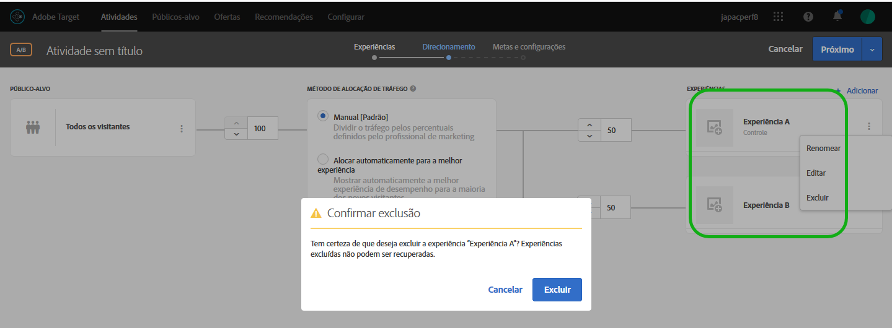 </p> <p>Consulte: </p> <p> 
     <ul id="ul_CB0C1146716F4C09BF924CF3DFA7DC1A"> 
      <li id="li_3767DD36F597481FB312CC577CD668F0"> <p>Atividade de A/B: <a href="../c-activities/t-test-ab/t-test-create-ab/ab-add-experience.md#task_454646F2895242D3B92DC395A0CE1A00" format="dita" scope="local">Adicionar experiência </a> </p> </li> 
      <li id="li_E2990CA178C6446BA7206643A3164FEF"> <p>Atividade de XT: <a href="../c-activities/t-experience-target/t-xt-create/xt-add-experience.md#task_454646F2895242D3B92DC395A0CE1A00" format="dita" scope="local">Criar experiência </a> </p> </li> 
     </ul> </p> <p>(TGT-30229) </p> </td> 
  </tr> 
  <tr> 
   <td colname="col1"> <p>Públicos-alvo </p> </td> 
   <td colname="col2"> <p>Compare um atributo de perfil a outro em vez de um número estático. </p> <p>Consulte  <a href="../c-target/c-audiences/creating-a-profile-attribute-comparison-audience.md#concept_4C2124B79A5B4556A6C1D10C0F5E40A0" format="dita" scope="local"> Criação de um público-alvo de comparação do atributo de perfil </a>. </p> <p> (TGT-28406) </p> </td> 
  </tr> 
  <tr> 
   <td colname="col1"> <p>Código personalizado </p> </td> 
   <td colname="col2"> <p>O "Código personalizado" agora está disponível no painel "Adicionar modificações" em vez de ter sua própria guia. Além disso, é possível adicionar mais de um código personalizado e nomear cada um deles. (TGT-28504) </p> <p>Consulte <a href="../c-experiences/c-visual-experience-composer/c-vec-code-editor/vec-code-editor.md#concept_B3A6E9EE3A60406DB640E205EA1745B5" format="dita" scope="local">Modificações </a>. </p> </td> 
  </tr> 
  <tr> 
   <td colname="col1" class="premium"> <p>Recommendations </p> </td> 
   <td colname="col2"> <p> 
     <ul id="ul_371C18DFC6D24E94B3D4FFFD83FC8D3A"> 
      <li id="li_9D11939014E7479AB7FD8910852A5386"> <p>Visualize uma lista de atividades que fazem referência a um critério selecionado no cartão de critérios. O cartão lista atividades ativas e inativas. (TGT-27672) </p> </li> 
      <li id="li_B97BF9305EB04F6D8B1F6178B2E0CB34"> <p>No diagrama de atividade, os cartões de critérios agora mostram quando os resultados estão prontos para exibição. (TGT-27673) </p> <p>Consulte <a href="../c-recommendations/c-algorithms/algorithms.md#concept_4BD01DC437F543C0A13621C93A302750" format="dita" scope="local">Critérios </a>. </p> </li> 
     </ul> </p> </td> 
  </tr> 
  <tr> 
   <td colname="col1"> <p>Modelos de experiência </p> </td> 
   <td colname="col2"> <p>Os Modelos de experiência do Adobe Target são amostras de ofertas pré-codificadas com entradas configuráveis a serem usadas no Target para executar alguns casos de uso de profissionais de marketing comuns. Estes modelos de experiência são fornecidos gratuitamente para desenvolvedores e profissionais de marketing como ponto de partida para executar alguns casos de uso externo comuns no Adobe Target, seja pelo Visual Experience ou pelo Experience Composer baseado em formulário. A personalização pode ser necessária para integrar com êxito a sua arquitetura ou plataforma da Web. </p> <p>Consulte  <a href="../c-experiences/c-visual-experience-composer/c-vec-code-editor/experience-templates.md#concept_109BBD7EABC04DD39E6B7B1687786652" format="dita" scope="local"> Modelos de experiência </a>. </p> </td> 
  </tr> 
  <tr> 
   <td colname="col1"> <p>Série de webinars de Noções básicas do Target </p> </td> 
   <td colname="col2"> <p>Participe da nova  <a href="../cmp-resources-and-contact-information.md#concept_11902FAC95C64479AABE020557A7EEE4" format="dita" scope="local"> Série de webinários de Noções básicas do Target</a>, uma série de webinários de sucesso do cliente disponibilizada pela Comunidade. </p> </td> 
  </tr> 
 </tbody> 
</table>

**Melhorias, correções e alterações**

Esta versão do [!DNL Target] inclui os seguintes aprimoramentos, correções e alterações:

* Aumento do tamanho modal do Editor de Rich Text para melhorar o uso. (TGT-24775)
* Os diagramas na etapa Target (etapa 2 do fluxo de trabalho orientado de três etapas) para atividades de Personalização automatizada (AP) e Testes multivariados (MVT) foram reprojetadas para serem mais consistentes com os designs utilizados para atividades A/B, de Direcionamento de experiência (XT) e do Recommendations. (TGT-30712)
* O valor da métrica do relatório de Contribuição de localização dos testes multivariados (MVT) agora está mais consistente com os valores de outras métricas, que é arredondado para duas casas decimais. (TGT-30921)

### at.js versão 1.5.0 (22 de junho de 2018) {#section_53C622F4978F4BC9ACD932D4B7194C12}

<table id="table_B332A93D4A6E4568BA3F7FA8EC0787F4"> 
 <thead> 
  <tr> 
   <th colname="col1" class="entry"> Recurso  / Aprimoramento </th> 
   <th colname="col2" class="entry"> Descrição </th> 
  </tr> 
 </thead>
 <tbody> 
  <tr> 
   <td colname="col1"> <p>at.js </p> </td> 
   <td colname="col2"> <p>A at.js versão 1.5.0 já está disponível. </p> <p> <p>Observação: os números de edição entre parênteses são para o uso interno da Adobe. </p> </p> <p> 
     <ul id="ul_41FE0EED2D8B4ADE84FC4CA0FA0CE8A0"> 
      <li id="li_2DC17381CB7949AFA35B054B9CA723FA"> <p>Os detalhes do evento <span class="codeph">at-request-succeeded</span> contêm sinalizador de redirecionamento. Esse sinalizador pode ser usado para determinar se a página será redirecionada a um URL diferente. Caso queira saber o URL, cadastre-se em <span class="codeph">at-content-rendering-redirect</span>. (TNT-29834) </p> </li> 
      <li id="li_2852878862724BB2BD475C8FC7BF20DA"> <p>Correção de um problema que fazia com que <span class="codeph">window.targetGlobalSettings.enabled</span> falhasse com uma exceção de tempo de execução se fosse definido como false. (TNT-29829) </p> </li> 
      <li id="li_96E5E409B36444F1B0E3E2606DC03996"> <p>Correção de um problema que fazia com que a página falhasse ao carregar o Visual Experience Composer (VEC) se estivesse usando o código personalizado para acionar uma solicitação de mbox global o usando ocultação do evento body. (TNT-29795) </p> </li> 
      <li id="li_818AA4EDDAC04D8B9BB4BA708D6BEF99"> <p>Adição de suporte para <span class="codeph">screenOrientation</span>, <span class="codeph">devicePixelRatio</span> e <span class="codeph">webGLRenderer</span>. Esses novos parâmetros de solicitação do Target são usados para detecção de iPhone X e outra detecção de dispositivo moderna. Para obter mais informações, consulte <a href="../c-target/c-audiences/c-target-rules/mobile.md#concept_2A794199DC1A4D349FFFBC7DCF1FEB89" format="dita" scope="local">Dispositivo móvel</a>. (TNT-29781) </p> </li> 
      <li id="li_87E3FB8B423C472AB1EE0DF2D7C64885"> <p>Correção de um problema em que a dica de localização do Adobe Audience Manager (AAM) não é sempre enviada. (TNT-29695) </p> </li> 
      <li id="li_E9E5A5035AC24F54ADEF5447E3F15D3B"> <p>Em navegadores com suporte para isso, o at.js 1.5.0 é alternado para MutationObserver para polling de seletor. Versões anteriores ao at.js 1.0.0 usavam um polyfill MutationObserver, que se mostrou problemático. Para evitar problemas de polyfill, a versão 1.5.0 usa o seguinte pseudocódigo para decidir qual mecanismo de agendamento utilizar: </p> <p> 
        <code>
          if MutationObserver is supported scheduler = MutationObserver else if document is visible scheduler = requestAnimationFrame else scheduler = setTimeout 
        </code> </p> </li> 
     </ul> </p> </td> 
  </tr> 
 </tbody> 
</table>

### Target Standard/Premium 18.6.1 (20 de junho de 2018) {#section_B63C660815B245DA9922BE33E03734A1}

Esta versão inclui os seguintes recursos e melhorias:

>[!NOTE]
>
>Os números de edição entre parênteses são para uso interno da Adobe.

<table id="table_5A60FFE5E86148F4BDC6A7031D03D6BA"> 
 <thead> 
  <tr> 
   <th colname="col1" class="entry"> Recurso  / Aprimoramento </th> 
   <th colname="col2" class="entry"> Descrição </th> 
  </tr> 
 </thead>
 <tbody> 
  <tr> 
   <td colname="col1"> <p>Visual Experience Composer (VEC) </p> </td> 
   <td colname="col2"> <p>Ao clicar em uma ação no painel Modificações, o VEC rola a página da Web automaticamente e o elemento correspondente é realçado. Não é mais preciso rolar manualmente para encontrar o elemento HTML afetado pela modificação. </p> <p> 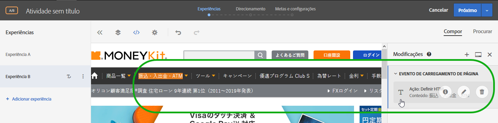 </p> <p>(TGT-30441) </p> </td> 
  </tr> 
  <tr> 
   <td colname="col1"> <p>Navegadores compatíveis </p> </td> 
   <td colname="col2"> <p>Adição do suporte do Microsoft Edge para a interface do usuário do Target e para a entrega de conteúdo. </p> <p>Para obter mais informações, consulte. <a href="../c-implementing-target/c-considerations-before-you-implement-target/supported-browsers.md#reference_01B4BF99E7D545A7998773202A2F6100" format="dita" scope="local"> Navegadores compatíveis</a> (TGT-14102) </p> </td> 
  </tr> 
  <tr> 
   <td colname="col1" class="premium"> <p>Recommendations </p> </td> 
   <td colname="col2"> <p>O critério Itens visualizados recentemente agora retorna resultados específicos a um certo <a href="../administrating-target/hosts.md#concept_516BB01EBFBD4449AB03940D31AEB66E" format="dita" scope="local">ambiente </a>. Se dois sites pertencerem a ambientes diferentes e um visitante alternar entre os dois sites, cada site exibirá somente itens visualizados recentemente do site em questão. Caso dois sites estejam no mesmo ambiente e um visitante alternar entre eles, ele verá os mesmos itens visualizados recentemente em ambos os sites. </p> <p>Para obter mais informações, consulte <a href="../c-recommendations/c-algorithms/create-new-algorithm.md#task_2B0ED54AFBF64C56916B6E1F4DC0DC3B" format="dita" scope="local">Basear a recomendação em uma Chave de recomendação</a>. (RECS-5865) </p> </td> 
  </tr> 
 </tbody> 
</table>

**Melhorias, correções e alterações**

Esta versão do [!DNL Target] inclui os seguintes aprimoramentos, correções e alterações:

* A linha Backup do download CSV do Recommendations agora apresenta um &quot;*&quot; (asterisco entre aspas) em vez de * (apenas um asterisco) no início.
* A linha Mais vendidos / Mais visualizados no download CSV do Recommendations não mais apresenta uma vírgula no início.

### Alterações na plataforma do Target (19 de junho de 2018)  {#section_0638BD69F3C640479A2A258AD78C0884}

Esta versão inclui o seguinte aprimoramento:

>[!NOTE]
>
>Os números de edição entre parênteses são para uso interno da Adobe.

* Atualização da lista de dispositivos para incluir os modelos de telefone mais recentes. Adição da capacidade de entregar conteúdo direcionado a modelos específicos de iPhone usando o Nome de marketing do dispositivo ou o Modelo do dispositivo.

   Clientes que usam o SDK móvel não precisam fazer nada para aproveitar desta funcionalidade. Clientes que usam o at.js devem atualiza para o at.js versão 1.5.0.

   Para obter mais informações, consulte [Dispositivo móvel](../c-target/c-audiences/c-target-rules/mobile.md#concept_2A794199DC1A4D349FFFBC7DCF1FEB89). (TNT-26714 &amp; TNT-28288)

### API de download do Target (5 de junho de 2018)  {#section_B8729DA10F18433C8D8E01B04F308ED2}

É possível usar a API de download de recomendações para baixar suas recomendações em um arquivo .CSV que pode ser visualizado em uma planilha ou editor de texto. Para segurança melhorada, a partir de **5 de junho de 2018**, o Target bloqueará solicitações HTTP e permitirá apenas solicitações HTTPS.

### Target Standard/Premium 18.5.1 (22 de maio de 2018)  {#section_7C1427793C2A48DBAC39F8290717DC5B}

Esta versão inclui os seguintes recursos e melhorias:

>[!NOTE]
>
>Os números de edição entre parênteses são para uso interno da Adobe.

<table id="table_1C51F61184684072BC69AD15BA68BEBB"> 
 <thead> 
  <tr> 
   <th colname="col1" class="entry"> Recurso </th> 
   <th colname="col2" class="entry"> Descrição </th> 
  </tr> 
 </thead>
 <tbody> 
  <tr> 
   <td colname="col1"> <p>Relatórios </p> </td> 
   <td colname="col2"> <p> 
     <ul id="ul_8D08FE4AC7D748EFB2BBFF87DBDC5CE5"> 
      <li id="li_B8929C19276D42168A28A3775CDEDFB3"> <p>É possível salvar até dez predefinições diferentes de um relatório de atividade individual depois de configurá-lo como desejar (métricas, públicos-alvo, configurações avançadas, entre outros). Todos os usuários do Target podem exibir, editar e excluir as diversas predefinições, independentemente de quem as criou. (TGT-21268) </p> </li> 
      <li id="li_7ADA62F2ACA049C9B4A8986B09A9F4AA"> <p>É possível configurar um relatório de atividade individual como desejar e salvar essa configuração como sua predefinição padrão/favorita. A partir de agora, esta será a exibição apresentada sempre que você visualizar o relatório dessa atividade. (TGT-10082) </p> </li> 
      <li id="li_DC63C04F3A884BDDA55B5515E4643B7B"> <p>Os alertas e mensagens dentro de relatórios o informa se um (ou mais) público-alvo, métrica, grupo de hosts ou experiência foi excluído de um relatório de predefinição anterior. O alerta ou mensagem o instrui a escolher outro público-alvo, métrica, grupo de hosts ou experiência para fazer uma predefinição novamente. (TGT-29424) </p> </li> 
     </ul> </p> <p>Para obter mais informações, consulte a seção Predefinição do Target em  <a href="../c-reports/c-report-settings/report-settings.md#concept_3A80D5A394EC4B639DC715E06085BDB0" format="dita" scope="local"> Configurações de relatório </a>. </p> </td> 
  </tr> 
  <tr> 
   <td colname="col1"> <p>Scripts de perfil </p> </td> 
   <td colname="col2"> <p> 
     <ul id="ul_F382C8E7708846A08676E1534BC92878"> 
      <li id="li_70E89504525C4119B588C230DCE772E8"> <p>Você pode exibir os cartões pop-up com as informações do script de perfil de forma semelhante aos cartões com as informações da oferta. Esses cartões com as informações do script de perfil permitem exibir a lista de atividades que fazem referência ao script de perfil selecionado, juntamente com outros metadados úteis. (TGT-28253) </p> <p>Para obter mais informações, consulte a seção Exibir Cartões de informações do script de perfil em  <a href="../c-target/c-visitor-profile/profile-parameters.md#concept_8C07AEAB0A144FECA8B4FEB091AED4D2" format="dita" scope="local"> Atributos de script de perfil </a>. </p> </li> 
     </ul> </p> </td> 
  </tr> 
  <tr> 
   <td colname="col1"> <p>Públicos-alvo </p> </td> 
   <td colname="col2"> <p> 
     <ul id="ul_DFEB778393024E3EBBC482F31A5B39BC"> 
      <li id="li_4049E334A38F4F94842FF1E35F177FE9"> <p>A criação de público-alvo personalizado agora permite o uso do parâmetro da mbox diretamente, sem precisar especificar o nome da mbox. O nome da mbox agora é opcional. Essa alteração permite usar parâmetros de várias mboxes ou referenciar um parâmetro que ainda não foi gravado na borda. Como alternativa, também é possível filtrar no parâmetro da mbox com o filtro de nome da mbox. </p> <p>Este mesmo aprimoramento também pode ser estendido para o Critério do Recommendations, as Promoções do Recommendations e para as regras de Teste de modelo. </p> </li> 
     </ul> </p> <p>Para obter mais informações, consulte  <a href="../c-target/c-audiences/c-target-rules/custom-parameters.md#concept_C4C6E00D7C5A4BE9B72D471DB2E3027B" format="dita" scope="local"> Parâmetros personalizados </a>. </p> </td> 
  </tr> 
  <tr> 
   <td colname="col1" class="premium"> <p>Recommendations </p> </td> 
   <td colname="col2"> <p> 
     <ul id="ul_7765B69E679D4C94B1E863E340DFDE15"> 
      <li id="li_F2AF7E1AFBD6461990EF1D83D1989582"> <p>Ao selecionar o critério do Recommendations no Experience Composer baseado em formulário, agora há um link para o cartão Critérios selecionado, para que possa editar fácil e rapidamente os critérios. (TGT-28483) </p> <p>Para obter mais informações, consulte <a href="../c-experiences/form-experience-composer.md#task_FAC842A6535045B68B4C1AD3E657E56E" format="dita" scope="local">Experience Composer baseado em formulário</a>. </p> </li> 
      <li id="li_517F0A174587416B8621D6F710C1AC48"> <p>Critérios do Recommendations, Promoções do Recommendations e criação de regras de Teste de amostra agora permitem usar o parâmetro da mbox diretamente, sem precisar especificar o nome da mbox. O nome da mbox agora é opcional. Essa alteração permite usar parâmetros de várias mboxes ou referenciar um parâmetro que ainda não foi gravado na borda. Como alternativa, também é possível filtrar no parâmetro da mbox com o filtro de nome da mbox. </p> <p>Esse mesmo aprimoramento também foi estendido à criação de Público-alvo personalizado. </p> <p>Para obter mais informações, consulte <a href="../c-recommendations/c-recommendations-faq/recommendations-faq.md#concept_EF272DE4AC6C47B19026BFBE816F5DB8" format="dita" scope="local"> Perguntas frequentes do Recommendations </a>. </p> </li> 
      <li id="li_AAB242830D1E47B78E58A980B717C736"> <p>Atualização da interface do usuário de cartões de design do Recommendations. </p> </li> 
      <li id="li_1BE3178663E54F4CA8714FE3ACDBB97B"> <p>A documentação da API do Recommendations do Target pode ser encontrada no <a href="https://www.adobe.io/apis/experiencecloud/target/docs/getting-started.html" format="html" scope="external">site do Adobe I/0 Adobe Target</a> (https://www.adobe.io/apis/experiencecloud/target/docs/getting-started.html). </p> </li> 
     </ul> </p> </td> 
  </tr> 
 </tbody> 
</table>

**Melhorias, correções e alterações**

Esta versão do [!DNL Target] inclui os seguintes aprimoramentos, correções e alterações:

* Atualização da interface do usuário para a Etapa 2 do fluxo de trabalho guiado de três etapas do Target usado para criar ou editar uma atividade de Teste A/B, Direcionamento de experiência (XT) ou Recommendations. (TGT-18911)

### Target Standard/Premium 18.4.1 (25 de abril de 2018) {#section_445DBC5402BA456BAF2D24AEA33A91C9}

Esta versão inclui os seguintes recursos e melhorias:

>[!NOTE]
>
>Os números de edição entre parênteses são para uso interno da Adobe.

<table id="table_6D99C48B72D24728BF623608053931D3"> 
 <thead> 
  <tr> 
   <th colname="col1" class="entry"> Recurso </th> 
   <th colname="col2" class="entry"> Descrição </th> 
  </tr> 
 </thead>
 <tbody> 
  <tr> 
   <td colname="col1"> <p>Fragmentos de experiência do Adobe Experience Manager (AEM) </p> </td> 
   <td colname="col2"> <p>A utilização de fragmentos de experiência criados no AEM nas atividades do Target permite combinar a facilidade de uso e o poder do AEM com os poderosos recursos de Inteligência automatizada (AI) e Aprendizagem de Máquina (ML) no Target para testar e personalizar experiências em escala.&amp;nbsp;&amp;nbsp; </p> <p>O AEM reúne todo o seu conteúdo e ativos em um local central para alimentar sua estratégia de personalização. O AEM permite que você crie conteúdo facilmente para desktops, tablets e dispositivos móveis em um único local sem escrever código. Não há necessidade de criar páginas para cada dispositivo. O AEM ajusta automaticamente cada experiência usando seu conteúdo. </p> <p> O Target permite entregar experiências personalizadas em escala com base em uma combinação de abordagens de aprendizagem de máquina baseadas em regras e AI que incorporam variáveis comportamentais, contextuais e offline.Com o Target, você pode facilmente configurar e executar atividades A/B e multivariadas para determinar as melhores ofertas, conteúdos e experiências. </p> <p>Os fragmentos de experiência representam um enorme passo à frente para vincular os criadores e gerentes de conteúdo/experiência aos profissionais de otimização e personalização que impulsionam os resultados de negócios usando o Target. </p> <p>Para obter mais informações, consulte <a href="../c-experiences/c-manage-content/aem-experience-fragments.md#topic_1E1E4EA01F074349B2CF8785387B5FE8" format="dita" scope="local">Fragmentos de experiência do AEM </a>. </p> </td> 
  </tr> 
  <tr> 
   <td colname="col1"> <p>Relatórios </p> </td> 
   <td colname="col2"> 
    <ul id="ul_EAB90C510EA04D6A8AEFF23A77DB2337"> 
     <li id="li_47DA6EB92CC84FFDBFDC9CC9386AF654"> <p>Agora é possível atualizar um relatório para atualizar a tabela e a visualização de gráfico do relatório sem atualizar a página inteira, sua configuração ou seu intervalo de datas. (TGT-28125) </p> <p>Para obter mais informações, consulte <a href="../c-reports/c-report-settings/report-settings.md#concept_3A80D5A394EC4B639DC715E06085BDB0" format="dita" scope="local">Configurações do relatório</a>. </p> </li> 
     <li id="li_AB2DE7A45D914FD7AEB0832187AF3844"> <p>O calendário nos relatórios agora tem intervalos de datas predefinidos, como Últimos 7 dias, Últimos 15 dias e assim por diante. (TGT-29171) </p> <p>Para obter mais informações, consulte <a href="../c-reports/c-report-settings/report-settings.md#concept_3A80D5A394EC4B639DC715E06085BDB0" format="dita" scope="local">Configurações do relatório</a>. </p> </li> 
     <li id="li_46DF9037E0ED4935B3BCDB35E8BED065"> <p>A largura da coluna da visualização da tabela foi modificada para reduzir a rolagem horizontal quando várias métricas são aplicadas. (TGT-26575) </p> </li> 
    </ul> </td> 
  </tr> 
  <tr> 
   <td colname="col1"> <p>Localização da interface do usuário </p> </td> 
   <td colname="col2"> <p>A interface do usuário do Target já está disponível nos seguintes idiomas: </p> <p> 
     <ul id="ul_DB6C771FCFDF43F498F8754920A70BCD"> 
      <li id="li_A65D07DF66844AC8BEEC1D413F214191"> <p>Chinês Simplificado </p> </li> 
      <li id="li_5986DD06AF5B4F76B3A02CFBF2DC3644"> <p>Chinês Tradicional </p> </li> 
      <li id="li_341FDC1CEC2B4C4BBD45CB2A0A54F2A3"> <p>Coreano </p> </li> 
      <li id="li_A4C31539B98E42348D5F1A18C63EAB6C"> <p>Italiano </p> </li> 
      <li id="li_97E3E0A916B64601BBF601AAED581174"> <p>Português </p> </li> 
     </ul> </p></td> 
  </tr> 
  <tr> 
   <td colname="col1"> <p>Públicos-alvo </p> </td> 
   <td colname="col2"> <p>Ao criar um público-alvo personalizado com base em um parâmetro de mbox, <span class="codeph">mboxParameter</span> não solicita mais <span class="codeph">mboxName</span>. O nome da mbox agora é opcional. Essa alteração permite usar parâmetros de várias mboxes ou referenciar um parâmetro que ainda não foi gravado na borda. (TGT-25807) </p> <p> <p>Observação: esse recurso está visível na interface do usuário do Target, mas está atualmente desabilitado. Este recurso será habilitado em breve (em data a ser comunicada). </p> </p> 
  </td> 
  </tr> 
 </tbody> 
</table>

**Melhorias, correções e alterações**

Esta versão do [!DNL Target] inclui os seguintes aprimoramentos, correções e alterações:

* A Segurança da camada de transporte (TLS) é o protocolo de segurança mais amplamente implantado usado atualmente em navegadores Web e outros aplicativos que exigem dados trocados de maneira segura por meio de uma rede. A Adobe tem padrões de conformidade em segurança que exigem o fim da vida útil de protocolos mais antigos e que estão demandando o uso do TLS 1.2 para que se tenha a versão mais atualizada e segura em uso. A partir da versão do Target 18.4.1 (25 de abril de 2018), o Adobe Target tomará medidas para progredir para a criptografia TLS 1.2 e eliminar completamente a compatibilidade com a criptografia TLS 1.0 até 12 de setembro de 2018. É importante que você verifique as especificidades e planeje as alterações para uma transição sem complicações. Para obter mais informações, consulte [Alterações na criptografia do TLS (Transport Layer Security)](../c-implementing-target/c-considerations-before-you-implement-target/tls-transport-layer-security-encryption.md#concept_CC1001E9D3AE4BABAF90B8311B0A6451).
* A interface do usuário para os Cartões de critérios do Recommendations foram melhorados para melhor usabilidade. (TGT-27829)

### at.js (3 de abril de 2018) {#section_932DF1004F4648668FE4984BFAF2EC49}

Esta versão inclui os seguintes recursos e melhorias:

<table id="table_76576D9D931B4DA99900F2C03175938E"> 
 <thead> 
  <tr> 
   <th colname="col1" class="entry"> Recurso </th> 
   <th colname="col2" class="entry"> Descrição </th> 
  </tr> 
 </thead>
 <tbody> 
  <tr> 
   <td colname="col1"> <p>at.js  </p> </td> 
   <td colname="col2"> <p>A at.js versão 1.3.0 já está disponível. Para obter mais informações, consulte <a href="../c-implementing-target/c-implementing-target-for-client-side-web/how-to-deployatjs/implementing-target-without-a-tag-manager.md#concept_1E1F958F9CCC4E35AD97581EFAF659E2" format="dita" scope="local">Baixar a at.js</a> e <a href="../c-implementing-target/c-implementing-target-for-client-side-web/target-atjs-versions.md#reference_DBB5EDB79EC44E558F9E08D4774A0F7A" format="dita" scope="local">Detalhes da versão da at.js</a>. </p> <p> 
     <ul id="ul_349BEB37B6C94FF0801F121042037803"> 
      <li id="li_4C2F82F4DD394ED5A0BFF978B15FEDDF"> <p>Os seguintes novos eventos estão disponíveis para ajudar no rastreamento, depuração e personalização das interações com a at.js: </p> <p> 
        <ul id="ul_EFF7E2FCEA0D42298779DDE13B54503F"> 
         <li id="li_6A2B06A522004EDE96D9A552571A7C30"> <p>LIBRARY_LOADED </p> </li> 
         <li id="li_61AA203A21DF4B7EAE075374A09C8FF0"> <p>REQUEST_START </p> </li> 
         <li id="li_DAF9CC1E86834C62B93419429B43A2CB"> <p>CONTENT_RENDERING_START </p> </li> 
         <li id="li_A52DC337115248A1BE5AF5B358BE5A9A"> <p>CONTENT_RENDERING_NO_OFFERS </p> </li> 
         <li id="li_7D71E48016B1446995493EBBF7D32447"> <p>CONTENT_RENDERING_REDIRECT </p> </li> 
        </ul> </p> <p>Para obter mais informações, consulte <a href="../c-implementing-target/c-implementing-target-for-client-side-web/cmp-atjs-functions.md#reference_A828E4BA535F4E7692A075F3D70CF6CD" format="dita" scope="local">Evento personalizados da at.js</a>. </p> </li> 
      <li id="li_E2704294F8BA47FFAABE7572F67FB5C0"> <p>É possível aumentar uma solicitação de at.js com parâmetros adicionais provenientes de provedores de dados. Os provedores de dados devem ser adicionados a <span class="codeph">window.targetGlobalSettings</span> na chave <span class="codeph">dataProviders </span>. </p> <p>Para obter mais informações, consulte “Provedores de dados” em <a href="../c-implementing-target/c-implementing-target-for-client-side-web/cmp-atjs-functions.md#concept_8DACBC47ABDE4279BB102B42609FE506" format="dita" scope="local">targetGlobalSettings() </a>. </p> </li> 
      <li id="li_02EAFE6DA0D44CF88980184FD14226A5"> <p>As solicitações de at.js agora usam GET, mas mudam para POST quando o tamanho do URL excede 2048 caracteres. Existe uma nova propriedade chamada <span class="codeph">urlSizeLimit</span>, na qual você pode aumentar o limite de tamanho, se necessário. Essa alteração permite que o Target alinhe a at.js ao AppMeasurement, que usa a mesma técnica. </p> </li> 
      <li id="li_43363A4F3A764394AA88D2595F93D8C0"> <p>O Target agora reforça que a chave da <span class="codeph">mbox</span> é usada na função <span class="codeph">adobe.target.applyOffer(options)</span>. Essa chave era exigida anteriormente, mas o Target agora a aplica para garantir que tenha a validação adequada e que os clientes estejam usando a função corretamente. </p> <p>Para obter mais informações, consulte <a href="../c-implementing-target/c-implementing-target-for-client-side-web/cmp-atjs-functions.md#reference_BBE83F513B5B4E03BBC3F50D90864245" format="dita" scope="local">adobe.target.applyOffer(options) </a>. </p> </li> 
      <li id="li_7336D8D48A894291A378E0BB212B7F9B"> <p>A at.js melhorou a funcionalidade de rastreamento de eventos e cliques. A at.js usa <span class="codeph">navigator.sendBeacon()</span> para enviar dados de rastreamento de eventos e sofrerá fallback para XHR síncrono quando <span class="codeph">navigator.sendBeacon()</span> não for suportado. Esse fallback afeta, principalmente, o Internet Explorer 10 e 11 e algumas versões do Safari. O Safari adicionará suporte a <span class="codeph">navigator.sendBeacon()</span> no iOS versão 11.3. </p> </li> 
      <li id="li_28D7324137B14C75BF6F1EA0B2487C9B"> <p>A at.js agora pode renderizar ofertas mesmo quando uma página é aberta em guias em segundo plano. Alguns clientes do Target encontraram um problema quando <span class="codeph">requestAnimationFrame ()</span> foi desativado devido ao comportamento de controle do navegador para guias em segundo plano. </p> </li> 
      <li id="li_3278979E1C6C41DEA7E8025AEB337985"> <p>Esta versão adiciona muitas melhorias de desempenho, incluindo callstacks mais curtos ao inspecionar um perfil de CPU do Chrome. </p> </li> 
      <li id="li_AAA9C0DCC3354DFA8907968C8E6427F6"> <p>A at.js 1.3.0 não oferece mais suporte à entrega de conteúdo no Microsoft Internet Explorer 9. Para obter uma lista de navegadores compatíveis, consulte <a href="../c-implementing-target/c-considerations-before-you-implement-target/supported-browsers.md#reference_01B4BF99E7D545A7998773202A2F6100" format="dita" scope="local">Navegadores suportados</a>. A partir de agora, todas as solicitações serão executadas por <span class="codeph">XMLHttpRequest</span> com suporte ao CORS sem solicitações JSONP. Essa alteração melhora muito a segurança. </p> </li> 
     </ul> </p> </td> 
  </tr> 
 </tbody> 
</table>

### Target Standard/Premium 18.3.1 (20 de março de 2018)  {#section_880706BE15544A03A2C951F267F4AEC5}

Esta versão inclui os seguintes recursos e melhorias:

>[!NOTE]
>
>Os números de edição entre parênteses são para uso interno da Adobe.

<table id="table_AE38682151A948AEA21E35A353F18D76"> 
 <thead> 
  <tr> 
   <th colname="col1" class="entry"> Recurso </th> 
   <th colname="col2" class="entry"> Descrição </th> 
  </tr> 
 </thead>
 <tbody> 
  <tr> 
   <td colname="col1" class="premium"> <p>Popularidade do atributo de entidade </p> </td> 
   <td colname="col2"> <p><b>Novo: 22 de março de 2018</b> </p> <p>Agora é possível escolher o atributo Popularidade por entidade no fluxo existente quando um atributo Personalizado é selecionado como chave. </p> <p>Depois de selecionar a chave desejada (nesse caso, um atributo de perfil personalizado), para a "Lógica de recomendação", é possível escolher duas novas opções: </p> <p> 
     <ul id="ul_7A6F2398ADE846EF8A7A3110C2736BF7"> 
      <li id="li_66BFF016564749B298B88F6B9638B64E"> <p>Mais visualizados </p> </li> 
      <li id="li_937FE5C40ED8471391B282D1ACE8C133"> <p>Mais vendidos </p> </li> 
     </ul> </p> <p>Para obter mais informações, consulte a linha "Atributo personalizado" em  <a href="../c-recommendations/c-algorithms/create-new-algorithm.md#task_2B0ED54AFBF64C56916B6E1F4DC0DC3B" format="dita" scope="local">Basear a recomendação em uma Chave de recomendação</a>. </p> </td> 
  </tr> 
  <tr> 
   <td colname="col1"> <p>Públicos-alvo </p> </td> 
   <td colname="col2"> <p>Ao visualizar o cartão pop-up de definições de um público-alvo (por exemplo, da Biblioteca de público-alvo), agora é possível ver outras atividades que fazem referência ao público-alvo, se aplicável. Dessa forma, é possível evitar um impacto acidental nas atividades ao editar públicos-alvo. </p> <p>Anteriormente, quando você tentava excluir um público-alvo referenciado por atividades, um aviso era exibido, informando-o que o público-alvo não poderia ser excluído se tivesse, no máximo, 10 atividades referenciando-o. </p> <p>Para obter mais informações, consulte <a href="../c-target/c-audiences/audiences.md#concept_65BE870D290E412D8BBF557EEA67C271" format="dita" scope="local"> Sobre públicos-alvo </a>. </p> </td> 
  </tr> 
  <tr> 
   <td colname="col1"> <p>Relatórios </p> </td> 
   <td colname="col2"> <p>As informações de incentivo e limites nos relatórios foram melhoradas para serem mais abrangentes e úteis, incluindo uma dica de ferramenta que explica como os limites são calculados. (TGT-28729) </p> <p>Para obter mais informações, consulte <a href="../c-reports/c-report-settings/average-lift-bounds-and-confidence-interval.md#topic_AFFDC672A8A34D028B100EF6BE5D8129" format="dita" scope="local">Incentivo médio, Limites de incentivo e Intervalo de confiança </a>. </p> </td> 
  </tr> 
  <tr> 
   <td colname="col1" class="premium"> <p>Atividades de Personalização automatizada (AP) e Direcionamento automático </p> </td> 
   <td colname="col2"> <p>Orientações adicionais estão disponíveis na interface do usuário e na Ajuda para ajudá-lo a alocar porcentagens do tráfego com mais eficiência nas atividades de Personalização automatizada (AP) e de Direcionamento automático. </p> <p>Para obter mais informações, consulte <a href="../c-activities/auto-target-to-optimize.md#section_AB3656F71D2D4C67A55A24B38092958F" format="dita" scope="local">Determinação da alocação de tráfego</a> e <a href="../c-activities/t-automated-personalization/create-ap-activity.md#task_8AAF837796D74CF893CA2F88BA1491C9" format="dita" scope="local">Criação de uma atividade de personalização automatizada</a>. </p> </td> 
  </tr> 
  <tr> 
   <td colname="col1" class="premium"> <p>Recommendations: regras de inclusão, coleções e exclusões para Critérios personalizados </p> </td> 
   <td colname="col2"> <p>Agora é possível realizar uma filtragem em tempo real sobre os próprios resultados de critérios personalizados. Por exemplo, você pode limitar os itens recomendados somente àqueles da categoria ou marca favorita de um visitante. Isso permite combinar os cálculos offline com filtragens em tempo real. </p> <p>Com a adição das regras de inclusão aos critérios personalizados, as recomendações foram transformadas de estáticas para dinâmicas com base nos interesses de um visitante. </p> <p> 
     <ul id="ul_BDD55AB34F4A43C691D2399C16AA3D6C"> 
      <li id="li_133C33E0D02E4861A4C855BD8A492E69"> <p>Os critérios personalizados agora podem ser configurados, assim como outros critérios nas recomendações. </p> </li> 
      <li id="li_AC201F0917BF465C985E8947635F762E"> <p>É possível usar coleções, exclusões e inclusões (incluindo as regras especiais para Preço e Inventário) da mesma forma que os outros critérios. O suporte a coleções e exclusões já foi oferecido. Esta versão adiciona inclusões. </p> </li> 
     </ul> </p> <p>Para obter mais informações, consulte  <a href="../c-recommendations/c-algorithms/algorithms.md#concept_4BD01DC437F543C0A13621C93A302750" format="dita" scope="local"> Critérios </a>. </p> <p>(TGT-28488) </p> </td> 
  </tr> 
  <tr> 
   <td colname="col1" class="premium"> <p>Recommendations: regras de inclusão, coleções e exclusões para Critérios visualizados recentemente </p> </td> 
   <td colname="col2"> <p>Os itens visualizados recentemente agora podem ser filtrados para que somente os itens com um determinado atributo sejam exibidos. Por exemplo, uma empresa multinacional com diversas empresas pode ter itens de exibição de visitantes em várias propriedades digitais. Nesse caso, é possível limitar os itens exibidos recentemente somente àqueles da respectiva propriedade em que foram visualizados. Isso impede que os itens visualizados recentemente sejam exibidos no site de outra propriedade digital. </p> <p> 
     <ul id="ul_A2D260F01CA047EEA72EF56BD0EE88FA"> 
      <li id="li_DB107DD357B741CCB2B7A4FDAD16F9D6"> <p>Os critérios visualizados recentemente agora podem ser configurados, exatamente como os outros critérios nas recomendações. </p> </li> 
      <li id="li_85452C03F0924D4C8D854509F1293021"> <p>É possível usar coleções, exclusões e inclusões (incluindo as regras especiais para Preço e Inventário) da mesma forma que os outros critérios. O suporte a coleções e exclusões já foi oferecido. Esta versão adiciona inclusões. </p> </li> 
     </ul> </p> <p>Para obter mais informações, consulte  <a href="../c-recommendations/c-algorithms/algorithms.md#concept_4BD01DC437F543C0A13621C93A302750" format="dita" scope="local"> Critérios </a>. </p> <p>(TGT-22843) </p> </td> 
  </tr> 
  <tr> 
   <td colname="col1"> <p>Extensão do Target para o Adobe Launch </p> </td> 
   <td colname="col2"> <p>O Launch reúne os recursos de gerenciamento de tags de última geração da Adobe. Ele oferece aos clientes uma forma simples de implantar e gerenciar todas as tags de análise, de marketing e de anúncios necessárias para potencializar experiências de cliente relevantes. </p> <p>A extensão Target permite implementar de forma rápida e fácil o Target no seu ambiente. </p> <p>Para obter mais informações, consulte  <a href="../c-implementing-target/c-implementing-target-for-client-side-web/how-to-deployatjs/cmp-implementing-target-using-adobe-launch.md#topic_5234DDAEB0834333BD6BA1B05892FC25" format="dita" scope="local"> Implementação do Target usando o Adobe Launch </a>. </p> </td> 
  </tr> 
 </tbody> 
</table>

**Melhorias, correções e alterações**

Esta versão do [!DNL Target] inclui os seguintes aprimoramentos, correções e alterações:

* Ao criar ou editar atividades A/B e de Direcionamento de experiência (XT), o Target retém informações sobre a última experiência, página ou versão da experiência (por meio do recurso de vários públicos-alvo) aberta e abre a página apropriada na próxima vez que a interface do usuário for aberta. (TGT-28225)
* Correções de segurança foram feitas para fins de conformidade.

### Target Standard/Premium 18.2.1 (15 de fevereiro de 2018) {#section_837CBBB7A89D45D99855A8C5F5E7BFFB}

Esta versão inclui os seguintes recursos e melhorias:

<table id="table_1C7A462AE8D4492FA5555F060031F665"> 
 <thead> 
  <tr> 
   <th colname="col1" class="entry"> Recurso </th> 
   <th colname="col2" class="entry"> Descrição </th> 
  </tr> 
 </thead>
 <tbody> 
  <tr> 
   <td colname="col1"> <p>A Adobe Marketing Cloud foi renomeada e agora é chamado de Adobe Experience Cloud. </p> </td> 
   <td colname="col2"> <p>A Experience Cloud é a família integrada de soluções e serviços de marketing digital. Também é uma interface intuitiva que permite o acesso rápido às soluções de nuvem e aos serviços principais. </p> <p>Nova marca e as alterações na interface do usuário: a Adobe Marketing Cloud foi renomeada e agora é chamada de Adobe Experience Cloud. Além disso, você verá alterações na interface do usuário e no Alternador de soluções. </p> <p>Para obter mais informações sobre esta alteração, consulte <a href="https://docs.adobe.com/content/help/en/core-services/interface/about-core-services/solutions-core-services.html" format="html" scope="external">Sobre os novos nomes de nuvem na Experience Cloud </a>. </p> </td> 
  </tr> 
 </tbody> 
</table>

**Melhorias, correções e alterações**

Esta versão do [!DNL Target] inclui alguns aprimoramentos, correções e alterações de back-end.

### Plataforma do Target (18 de janeiro de 2018) {#section_F6A0DC31636D403F92BDB9DCE7A3F6ED}

Esta versão inclui os seguintes recursos e melhorias:

<table id="table_0F5BF9370E214302BDFE0AC2D66EC773"> 
 <thead> 
  <tr> 
   <th colname="col1" class="entry"> Recurso </th> 
   <th colname="col2" class="entry"> Descrição </th> 
  </tr> 
 </thead>
 <tbody> 
  <tr> 
   <td colname="col1"> <p>at.js  </p> </td> 
   <td colname="col2"> <p>A at.js 1.2.3 adiciona suporte para ofertas JSON. As ofertas JSON são suportadas apenas em atividades criadas usando o Experience Composer baseado em formulário. Atualmente, a única maneira de usar as ofertas do JSON é por meio de chamadas diretas à API. Consulte <a href="../c-experiences/c-manage-content/create-json-offer.md#concept_63C7BEE1F0DB4A7596D997219B7C136D" format="dita" scope="local">Criar oferta JSON </a>. </p> </td> 
  </tr> 
  <tr> 
   <td colname="col1"> <p>Outras alterações </p> </td> 
   <td colname="col2"> <p>As regras de exclusão, catálogos, regras de inclusão de algoritmo e filtragem de tempo de execução agora diferenciam maiúsculas e minúsculas. </p> </td> 
  </tr> 
 </tbody> 
</table>

### Target Standard/Premium 18.1.1 (23 de janeiro de 2018) {#section_3A2216543B064D6F82EC03E1F8AEC74D}

Esta versão inclui os seguintes recursos e melhorias:

>[!NOTE]
>
>Os números de edição entre parênteses são para uso interno da Adobe.

<table id="table_872FE2BE61CC4A5CA369D9A6C730686E"> 
 <thead> 
  <tr> 
   <th colname="col1" class="entry"> Recurso </th> 
   <th colname="col2" class="entry"> Descrição </th> 
  </tr> 
 </thead>
 <tbody> 
  <tr> 
   <td colname="col1"> <p>Públicos-alvo </p> </td> 
   <td colname="col2"> <p> 
     <ul id="ul_42D7C86043C94A7BBA5ED405B2902E3A"> 
      <li id="li_50F2A7D05AB244E18D263A476BD906B3"> <p>Agora é possível criar públicos-alvo de Intervalo de tempo sem datas de início ou término. Isso permite usar o mesmo público-alvo em várias atividades (sem fazer uma cópia do público-alvo), enquanto controla as datas de início e término no nível da atividade. Consulte <a href="../c-target/c-audiences/c-target-rules/time-frame.md#concept_0FE1E8DACD104F8B870B0BADE3197F0A" format="dita" scope="local">Intervalo de tempo</a>. (TGT-25975) </p> </li> 
      <li id="li_6F08D63BC4F040859D51C47C3521C5E1"> <p>A funcionalidade Copiar e editar está disponível para públicos-alvo somente de atividade quando você passa o cursor do mouse sobre um público-alvo na página Escolher público-alvo &gt; Público-alvo somente de atividade. Anteriormente, essa funcionalidade existia apenas para públicos-alvo da biblioteca. Consulte <a href="../c-target/creating-activity-only-audience.md#concept_A6BADCF530ED4AE1852E677FEBE68483" format="dita" scope="local"> Criação de um público-alvo somente de atividade</a>. (TGT-27410) </p> </li> 
      <li id="li_A8CF45E6DC37401AA273F7D6CF617524"> <p>Os públicos-alvo somente de atividade podem ter o mesmo nome entre as atividades. Anteriormente, nomes duplicados resultavam na adição de carimbos de data/hora (um público-alvo duplicado chamado “Direcionar no dia da semana” seria salvo como “Direcionar no dia da semana-1456732099201”). </p> <p>Os públicos-alvo da biblioteca continuam a exigir nomes exclusivos. (TGT-17967) </p> </li> 
     </ul> </p> </td> 
  </tr> 
  <tr> 
   <td colname="col1"> <p>Relatórios </p> </td> 
   <td colname="col2"> <p> 
     <ul id="ul_C595EEF916494342AD99FF0FDF999927"> 
      <li id="li_8C74478D3480406591DC876F69C19329"> <p>Agora é possível visualizar os intervalos de confiança para variáveis contínuas. (TGT-22085) </p> </li> 
      <li id="li_21B31F91685C46CAA47688FDE5735312"> <p>O Target agora exibe limites de incentivo quando forem estatisticamente significativos nos relatórios.(TGT-27301, TGT-27794 e TGT-26387) </p> </li> 
     </ul> </p> <p>Consulte <a href="../c-reports/c-report-settings/report-settings.md#concept_4BB6A7FDAB6F4806A632F9CD989B8BFA" format="dita" scope="local">Configurações do relatório </a>. </p> </td> 
  </tr> 
  <tr> 
   <td colname="col1"> <p>Ofertas </p> </td> 
   <td colname="col2"> <p> 
     <ul id="ul_BD0C5B260E7E4F139FBC1FBA286C0B81"> 
      <li id="li_FCDBABE6C5034A3596F5BBF024245FB9"> <p>O Target agora suporta a criação de ofertas JSON na Biblioteca de ofertas para uso no Experience Composer baseado em formulário. Consulte <a href="../c-experiences/c-manage-content/create-json-offer.md#concept_63C7BEE1F0DB4A7596D997219B7C136D" format="dita" scope="local">Criar oferta JSON </a>. (TGT-27064) </p> </li> 
      <li id="li_5500AE7DCF4146E88E4619382CE8E836"> <p>Agora é possível visualizar as atividades que fazem referência a uma oferta de código no cartão pop-up de definição de cada oferta. Esta funcionalidade não se aplica às ofertas de imagem. Consulte <a href="../c-experiences/c-manage-content/manage-content.md#concept_17874A6FCBB743AA84C5988E8571CCF3" format="dita" scope="local">Ofertas</a>. (TGT-26277) </p> </li> 
     </ul> </p> </td> 
  </tr> 
  <tr> 
   <td colname="col1" class="premium"> <p>Recommendations </p> </td> 
   <td colname="col2"> <p> 
     <ul id="ul_63613AD2D744442AA12CD23F4DAC75B4"> 
      <li id="li_4DD5CF06D93A4083BCB34A4FFA293C89"> <p>A interface do usuário agora exibe o status do upload de dados do algoritmo personalizado para as recomendações. Consulte <a href="../c-recommendations/c-algorithms/recommendations-csv.md#task_1BBA49883E794670A09F0ABE1B3F4288" format="dita" scope="local"> Fazer upload de critérios personalizados </a>. (TGT-23891) </p> </li> 
      <li id="li_14FCFDD0A0E84B47AF1488DB4DDF197B">Os operadores Valor está presente e Valor não está presente agora estão disponíveis ao criar regras de inclusão de algoritmo. Consulte <a href="../c-recommendations/c-algorithms/use-dynamic-and-static-inclusion-rules.md#concept_4CB5C0FA705D4E449BD0B37B3D987F9F" format="dita" scope="local">Uso das regras de inclusão estática e dinâmica</a>. (TGT-24110) </li> 
     </ul> </p> </td> 
  </tr> 
  <tr> 
   <td colname="col1"> <p>informativo Adobe Target Insider </p> </td> 
   <td colname="col2"> <p>O Adobe Target Insider é um informativo mensal para os membros da comunidade do Adobe Target. Saiba mais sobre atualizações de produto e planos futuros, dicas e truques de personalização e otimização, sucesso do cliente, próximos eventos, informes técnicos repletos de informações, publicações de blog populares e muito mais. Leia a <a href="https://theblog.adobe.com/stay-optimized-adobe-target-insider-newsletter/" format="https" scope="external">carta de comunicado</a> para saber mais. </p> <p> <a href="https://www.adobe.com/subscription/adobe_target_newsletter.html" format="html" scope="external"> Assine o informativo</a> para ajudá-lo a oferecer experiências excepcionais para os clientes e que impulsionam o sucesso dos negócios. </p> </td> 
  </tr> 
 </tbody> 
</table>

**Melhorias, correções e alterações**

Esta versão do [!DNL Target] inclui os seguintes aprimoramentos, correções e alterações voltados para o cliente:

* Agora é possível navegar pela página enquanto reorganiza as experiências na Etapa 2 do fluxo de trabalho guiado de três etapas ao criar atividades. (TGT-27652)
* É possível clicar com o botão direito do mouse em uma atividade na Lista de atividades para abri-la em uma nova guia. Por exemplo, no Firefox, clique com o botão direito na atividade desejada > Abrir link em uma nova aba. (TGT-27409)
* Melhorias de desempenho feitas na página Designs (Recommendations > Designs). A velocidade para exibir e pesquisar designs foi aprimorada. (TGT-21792)
* A at.js agora é a opção de implementação padrão para baixar. (TGT-24676)
* A validação de URL agora permite o uso de hifens duplos no URL. Anteriormente, um URL com hifens duplos não podia ser carregado no Visual Experience Composer (VEC). (TGT-28176)
* Várias correções de localização da interface do usuário para os idiomas suportados.

## Versões de 2017 {#reference_59C7622A111C4147804A8AAC6D27BB8D}

### Plataforma do Target (8 de novembro de 2017) {#section_536B3C0F32ED441C8D82704B94F6AF7E}

Esta versão inclui os seguintes recursos e melhorias:

<table id="table_793CDDF1BD9E48BDBABBF6CD979BE186"> 
 <thead> 
  <tr> 
   <th colname="col1" class="entry"> Recurso </th> 
   <th colname="col2" class="entry"> Descrição </th> 
  </tr> 
 </thead>
 <tbody> 
  <tr> 
   <td colname="col1"> <p>at.js  </p> </td> 
   <td colname="col2"> <p>A at.js versão 1.2.2 já está disponível. Para obter mais informações, consulte <a href="../c-implementing-target/c-implementing-target-for-client-side-web/how-to-deployatjs/implementing-target-without-a-tag-manager.md#concept_1E1F958F9CCC4E35AD97581EFAF659E2" format="dita" scope="local">Baixar a at.js</a>. </p> <p> 
     <ul id="ul_3C4C9385A0F3489AA2137A2C88AE93CF"> 
      <li id="li_E658799D930547E6901ACFBF7C541F1F"> <p>Correção de um problema que retornava um erro de JavaScript quando a biblioteca do Target era carregada em uma página usando o modo QUIRKS. (TNT-28312) </p> </li> 
      <li id="li_050620115ED84CBDA736D94E9AAC6550"> <p>Correção de um problema que fazia com que o rastreamento de cliques no Target segmentasse as chamadas de coleta de dados do Analytics. (TNT-28261) </p> </li> 
      <li id="li_97BC1B7295364ACDAD3FB07005ED592F"> <p>Correção de um problema que causava a falha dos <span class="codeph">parâmetros getOffer()</span> quando <span class="codeph">targetPageParams()</span> retornava uma cadeia de caracteres em branco. (TNT-28359) </p> </li> 
      <li id="li_B542D4A4E37141BA8BE79D416E1B58DB"> <p>Correção de um problema com geração da ID de sessão ao usar somente x. (TNT-28361) </p> </li> 
     </ul> </p> <p>O tempo limite padrão da at.js foi alterado de 15 segundos para 5 segundos. </p> <p>Se a sua configuração atual for 15 segundos, ela será atualizada para o novo padrão de 5 segundos. Se tiver alterado anteriormente, sua configuração não será afetada. </p> </td> 
  </tr>  
 </tbody> 
</table>

### Target Standard/Premium 17.11.1 (8 de novembro de 2017) {#section_324A9B1DA0B14F5999FEE41F15B13A44}

Esta versão inclui os seguintes recursos e aprimoramentos (os números de edição entre parênteses são para o uso interno da Adobe):

<table id="table_6ADDF3552AD04666B76F2D3F457BB042"> 
 <thead> 
  <tr> 
   <th colname="col1" class="entry"> Recurso </th> 
   <th colname="col2" class="entry"> Descrição </th> 
  </tr> 
 </thead>
 <tbody> 
  <tr> 
   <td colname="col1"> <p>Ofertas </p> </td> 
   <td colname="col2"> <p> Se um usuário tiver permissão de "Editor", não poderá editar uma oferta com referência a uma atividade em tempo real ou programada. </p> <p> <p>Observação: para clientes do Target Premium que utilizam <a href="https://docs.adobe.com/content/help/en/target/using/administer/manage-users/enterprise/property-channel.html" format="html" scope="external">Permissões de usuário empresarial</a>, se um usuário selecionar a opção Todos os espaços de trabalho, o Target usará a maior permissão do usuário nos espaços de trabalho. Se a permissão mais alta for "Editor", o Target restringirá a edição, conforme mencionado acima </p>. </p> <p>Essas restrições se aplicam a todas as ofertas, e não apenas às ofertas criadas no Target. (TGT-27276) </p> </td> 
  </tr> 
  <tr> 
   <td colname="col1"> <p>Tokens de resposta </p> </td> 
   <td colname="col2"> <p>Adição dos seguintes parâmetros integrados: </p> <p> 
     <ul id="ul_17AD5B9788514E9DB14ED435A4224BFE"> 
      <li id="li_334F10A5B7934215B4D37278901BAF96"> <p>profile.tntId </p> </li> 
      <li id="li_AA9B4611035344549CC933FFC499289F"> <p>profile.marketingCloudVisitorId </p> </li> 
      <li id="li_DD751027371D4293BF9DB872278BD1B3"> <p>profile.thirdPartyId </p> </li> 
      <li id="li_B6D983A1B68D49AAA40CB401437676F1"> <p>profile.categoryAffinity </p> </li> 
      <li id="li_F5E86BFD14CA4C198F36F3F9987750F9"> <p>profile.categoryAffinities </p> </li> 
     </ul> </p> <p>Para obter mais informações, consulte <a href="../administrating-target/response-tokens.md#concept_2B21B222F6A344D68CA5929817E836C4" format="dita" scope="local">Tokens de resposta</a>. </p> </td> 
  </tr> 
 </tbody> 
</table>

### Target Standard/Premium 17.10.1 (25 de outubro de 2017) {#section_EF74751744024C209A02F45322642D37}

Esta versão inclui os seguintes recursos e aprimoramentos (os números de edição entre parênteses são para o uso interno da Adobe):

<table id="table_307DF0CD143048BC9E419444C556B8FB"> 
 <thead> 
  <tr> 
   <th colname="col1" class="entry"> Recurso </th> 
   <th colname="col2" class="entry"> Descrição </th> 
  </tr> 
 </thead>
 <tbody> 
  <tr> 
   <td colname="col1"> <p>Públicos-alvo </p> </td> 
   <td colname="col2"> <p> 
     <ul id="ul_6E91AEC68A6E45D8B2907C77E752FEC6"> 
      <li id="li_A5778B528358433DB31D700D8F9BCB79"> <p>É possível criar públicos-alvo somente de atividade dentro do fluxo de trabalho guiado de três etapas ao criar uma atividade. Esse público-alvo pode ser usado em outros locais na mesma atividade, mas não é armazenado na Biblioteca de público-alvo para uso em outras atividades. (TGT-25474) </p> <p> 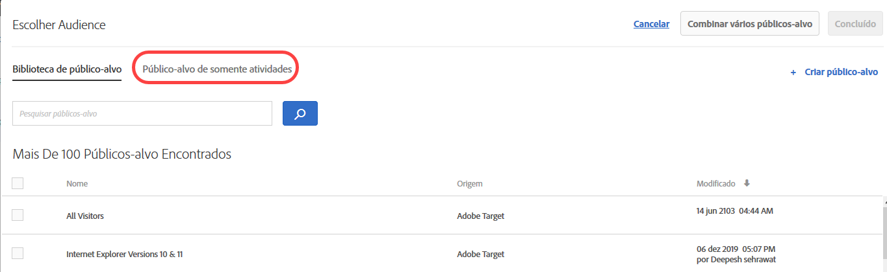 </p> <p>Para obter mais informações, consulte <a href="../c-target/creating-activity-only-audience.md#concept_A6BADCF530ED4AE1852E677FEBE68483" format="dita" scope="local"> Criar um público-alvo somente atividade</a>. </p> </li> 
      <li id="li_691812682A5B42C0941324F2BC7D5740"> <p>Para obter todas as atividades, você pode escolher uma métrica de sucesso que qualifique o usuário para o público-alvo. Antigamente, o Target qualificava os usuários para um público-alvo quando eram inseridos na atividade; agora, é possível escolher quando avaliar o público-alvo, escolhendo uma métrica de sucesso. (TGT-15805) </p> <p> 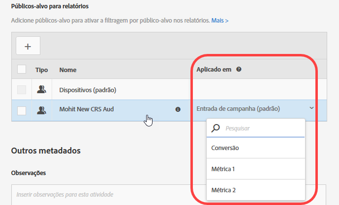 </p> </li> 
     </ul> </p> <p>Para obter mais informações, consulte <a href="../c-target/apply-reporting-audience-success-metric.md#concept_5F11149ACCA84FE79C7B9F766B6B0595" format="dita" scope="local">Aplicar um relatório de público-alvo a uma métrica de sucesso </a>. </p> </td> 
  </tr> 
  <tr> 
   <td colname="col1" class="premium"> <p>Direcionamento automático </p> </td> 
   <td colname="col2"> <p> 
     <ul id="ul_6F89BD36373E47C4B3A6F8584D431D82"> 
      <li id="li_5F7B590AF8F24066ADD270E9F75CB12F"> <p>As atividades de Direcionamento automático agora são compatíveis com os relatórios em nível de segmento. (TGT-22777) </p> <p>Para obter mais informações, consulte <a href="../c-activities/auto-target-to-optimize.md#concept_67779E5B7F67427A97D7EA2A6FB919B3" format="dita" scope="local">Direcionamento automático para experiências personalizadas</a>. </p> </li> 
      <li id="li_35042E7D6BB04265B42F08A23A774E92"> <p>É possível alterar a Porcentagem de controle para atividades de Direcionamento automático. (TGT-26467) </p> <p> 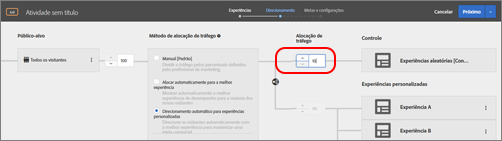 </p> <p>Para obter mais informações, consulte <a href="../c-activities/auto-target-to-optimize.md#concept_67779E5B7F67427A97D7EA2A6FB919B3" format="dita" scope="local">Direcionamento automático para experiências personalizadas</a>. </p> </li> 
     </ul> </p> </td> 
  </tr> 
  <tr> 
   <td colname="col1"> <p>Ofertas </p> </td> 
   <td colname="col2"> <p> 
     <ul id="ul_667DDEDDC5284C8393F8BCA5CD9EF12A"> 
      <li id="li_E00DB93297EC4100B46E42D867757DAA"> <p>Agora é possível ver os detalhes da definição da oferta em um cartão pop-up na Biblioteca de ofertas, sem precisar abrir a oferta. (TGT-26377) </p> <p>  </p> <p>Para obter mais informações, consulte <a href="../c-experiences/c-manage-content/manage-content.md#concept_17874A6FCBB743AA84C5988E8571CCF3" format="dita" scope="local">Ofertas </a>. </p> </li> 
      <li id="li_F71AC4FDAC0E4BEE81D39490E82686C0"> <p>É possível copiar e editar ofertas e pastas no seletor de Ofertas ao criar uma atividade. (TGT-26936) </p> <p> 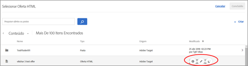 </p> <p>Para obter mais informações, consulte <a href="../c-experiences/c-manage-content/manage-content.md#concept_17874A6FCBB743AA84C5988E8571CCF3" format="dita" scope="local">Ofertas </a>. </p> </li> 
     </ul> </p> </td> 
  </tr> 
  <tr> 
   <td colname="col1"> <p>Experience Composer baseado em formulário </p> </td> 
   <td colname="col2"> <p>No Experience Composer baseado em formulários, os refinamentos foram substituídos pela funcionalidade completa de público-alvo. Os refinamentos das atividades existentes foram migrados para  públicos-alvo somente de atividades. (TGT-13646) </p> <p>Para obter mais informações, consulte <a href="../c-experiences/form-experience-composer.md#task_FAC842A6535045B68B4C1AD3E657E56E" format="dita" scope="local">Experience Composer baseado em formulário</a>. </p> </td> 
  </tr> 
  <tr> 
   <td colname="col1"> <p>Tokens de resposta </p> </td> 
   <td colname="col2"> <p>Agora é possível criar tokens de resposta do Target sem esperar que sejam criados ou importados para o Target. Anteriormente, na interface do usuário do Token de resposta, você podia ver apenas os tokens criados por meio da API. As alterações do recurso também ajudam a evitar tokens de resposta duplicados. (TGT-26534) </p> <p>Para obter mais informações, consulte <a href="../administrating-target/response-tokens.md#concept_2B21B222F6A344D68CA5929817E836C4" format="dita" scope="local">Tokens de resposta</a>. </p> </td> 
  </tr> 
 </tbody> 
</table>

**Melhorias, correções e alterações**

Esta versão do [!DNL Target] inclui os seguintes aprimoramentos, correções e alterações voltados para o cliente:

* É possível excluir públicos-alvo importados (Target Classic, Experience Cloud, etc.) da Biblioteca de público-alvo. O Target avisa se você tentar excluir um público-alvo usado em uma atividade ativa. (TGT-25171)
* Os públicos-alvo importados do Target Classic agora são rotulados como Adobe Target Classic na Biblioteca de público-alvo. Antigamente, a interface do usuário não diferenciava entre Target Standard/Premium e Target Classic. (TGT-27093)
* As coleções agora se aplicam a todos os critérios (incluindo itens visualizados recentemente). (TGT-26646)
* É possível filtrar por espaço de trabalho na Biblioteca de público-alvo e na Biblioteca de ofertas (aplica-se a usuários do Target Premium com permissões de usuário empresarial). (TGT-26813)
* Aprimoramentos feitos na interface do usuário de Relatórios para melhorar a rolagem nas tabelas e o posicionamento das listas suspensas de filtros. (TGT-23713 e TGT-26819)

### Alterações na plataforma do Target (13 de outubro de 2017) {#section_6C298C5C3D01415CB4B658EB2166096C}

<table id="table_8457FAE3508F454F9DFDEF093FBD7E40"> 
 <thead> 
  <tr> 
   <th colname="col1" class="entry"> Alteração </th> 
   <th colname="col2" class="entry"> Detalhes </th> 
  </tr> 
 </thead>
 <tbody> 
  <tr> 
   <td colname="col1"> <p> <span class="filepath"> at.js </span> </p> </td> 
   <td colname="col2"> <p><b>13 de outubro de 2017</b> </p> <p> A <span class="filepath">at.js</span> versão 1.2.1 já está disponível. Para obter mais informações, consulte <a href="../c-implementing-target/c-implementing-target-for-client-side-web/target-atjs-versions.md#reference_DBB5EDB79EC44E558F9E08D4774A0F7A" format="dita" scope="local">Detalhes da versão da at.js </a>. </p> <p> 
     <ul id="ul_14D6BB3B51974789BBFC036A45B7A56B"> 
      <li id="li_AE9826C8FC4A4DF4BE61BB72C2946C93"> <p>Correção de um problema no rastreamento de cliques em que um link com target="_blank" impedia o Target de abrir o link em uma nova guia. </p> </li> 
     </ul> </p> </td> 
  </tr> 
 </tbody> 
</table>

### Target Standard/Premium 17.9.1 (25 de setembro de 2017 e 12 de outubro de 2017)  {#section_ECC5DD8B6ED443788B46F53E25FC896E}

Esta versão inclui os seguintes recursos e aprimoramentos (os números de edição entre parênteses são para o uso interno da Adobe):

<table id="table_0A8817F64F434875A485FD671C6988AB"> 
 <thead> 
  <tr> 
   <th colname="col1" class="entry"> Recurso </th> 
   <th colname="col2" class="entry"> Descrição </th> 
  </tr> 
 </thead>
 <tbody> 
  <tr> 
   <td colname="col1"> <p> Visualização do Mobile Experience </p> </td> 
   <td colname="col2"> <p><b>Atualizado: 12 de outubro de 2017</b> </p> <p> Agora é possível selecionar várias atividades de aplicativos móveis na interface do usuário e visualizá-las no seu dispositivo. Esse recurso permitirá se inscrever em várias experiências para visualizar e realizar o controle de qualidade sem depender de compilações de teste e simuladores especiais. </p> <p>Este recurso exige que você baixe e instale a versão 4.14 (ou posterior) apropriada do SDK do Adobe Mobile. </p> <p>Para obter mais informações, consulte <a href="../c-target-mobile-app/target-mobile-preview.md#concept_5FBF12C2FDFC42429FE4F5CFBD78E19D" format="dita" scope="local">Visualização móvel do Target </a>. </p> </td> 
  </tr> 
  <tr> 
   <td colname="col1"> <p>Entrega em lote e de obtenção prévia em dispositivos móveis </p> </td> 
   <td colname="col2"> <p><b>Atualizado: 12 de outubro de 2017</b> </p> <p> O conteúdo de várias mboxes pode ser obtido previamente em uma única chamada e armazenado em cache localmente no dispositivo, sem se preocupar com como, quando e se o usuário final verá o conteúdo. </p> <p>Este recurso exige que você baixe e instale a versão 4.14 (ou posterior) apropriada do SDK do Adobe Mobile. </p> <p>Para obter mais informações, consulte <a href="../c-target-mobile-app/prefetch-offer-content.md#concept_A355D9D55E1C429AA31FA4055A1DDFAF" format="dita" scope="local">Buscar previamente conteúdo da oferta </a>. </p> </td> 
  </tr> 
  <tr> 
   <td colname="col1"> <p>Atividades </p> </td> 
   <td colname="col2"> <p>Os seguintes aprimoramentos foram feitos no fluxo de trabalho de criação de atividades: </p> <p> 
     <ul id="ul_2D251AC11FC54E86AE84DEFFB6FDF43C"> 
      <li id="li_AB8F12B3CF654120BD16EAE570517741"> <p>Ao editar uma atividade, é possível fazer as alterações desejadas na etapa exibida no momento, clicar na lista suspensa no botão dividido e selecionar <span class="wintitle">Próximo</span> para avançar para a próxima etapa, clicar em <span class="wintitle">Salvar e fechar</span> para salvar as alterações e exibir a página <span class="wintitle">Visão geral</span> da atividade ou clicar em <span class="wintitle">Salvar</span> para salvar as alterações e permanecer na etapa. </p> <p> 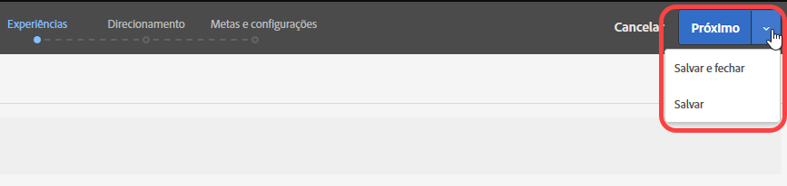 </p> <p>Para obter mais informações, consulte <a href="../c-activities/edit-activity.md#concept_BB064C0D4A194BD1A1AE7CCA1E6BB8F0" format="dita" scope="local">Editar uma atividade ou Salvar como rascunho </a>. </p> </li> 
      <li id="li_4C71E2570ECF4BBAB08443D89230CE82"> <p>Ao editar uma atividade, é possível abrir a etapa do fluxo de trabalho desejada, fazer as alterações (por exemplo, porcentagens de experiência, públicos-alvo, etc.) e salvar ou fechar a atividade sem ter que seguir o fluxo de trabalho guiado de três etapas. </p> <p> 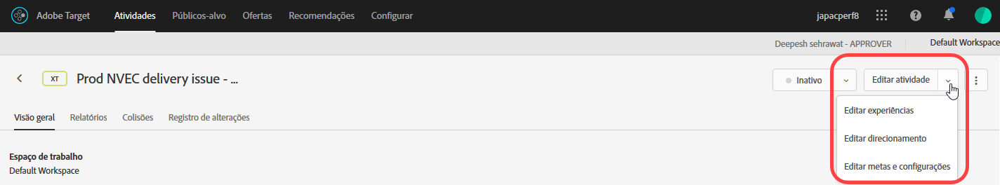 </p> <p>Para obter mais informações, consulte <a href="../c-activities/edit-activity.md#concept_BB064C0D4A194BD1A1AE7CCA1E6BB8F0" format="dita" scope="local">Editar uma atividade ou Salvar como rascunho </a>. </p> </li> 
      <li id="li_43C15B13E4F7475E9376A98222AA0253"> <p>Ao criar uma nova atividade que ainda não foi salva ou ao editar uma atividade que tinha sido salva no formato de rascunho, as opções <span class="wintitle">Salvar rascunho</span> são exibidas no botão dividido. </p> <p> 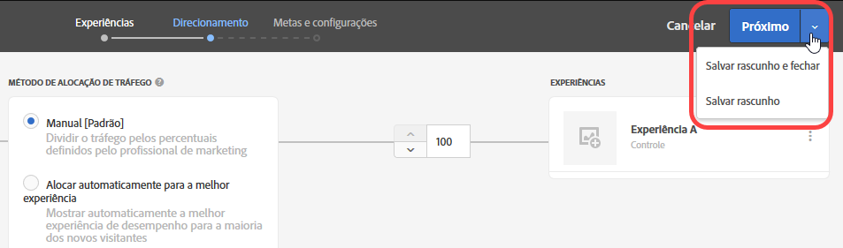 </p> <p>Para obter mais informações, consulte <a href="../c-activities/edit-activity.md#concept_BB064C0D4A194BD1A1AE7CCA1E6BB8F0" format="dita" scope="local">Editar uma atividade ou Salvar como rascunho </a>. </p> </li> 
      <li id="li_36EF9AD13B2D40ADB99343C9F758D5FD"> <p>Agora é possível editar ou copiar um público-alvo passando o cursor do mouse sobre o público-alvo desejado na caixa de diálogo <span class="wintitle">Escolher público-alvo</span> ao escolher o direcionamento na etapa 2 do fluxo de trabalho guiado de três etapas. </p> <p>  </p> </li> 
     </ul> </p> <p>Para obter mais informações, consulte <a href="../c-activities/t-test-ab/t-test-create-ab/ab-audience.md#concept_A268236C1224451DB7844BF67F41A087" format="dita" scope="local">Selecionar público-alvo </a>. </p> </td> 
  </tr> 
  <tr> 
   <td colname="col1"> <p>Relatório </p> </td> 
   <td colname="col2"> <p>Os seguintes novos recursos e aprimoramentos estão disponíveis para os relatórios: </p> <p> 
     <ul id="ul_2D1AF91D1B4E478FBFFA0B83EE30075E"> 
      <li id="li_98E67A4DA8BF4CFF90C279FAC12F4C54"> <p>É possível escolher a metodologia de contagem de gráficos nos relatórios. Observe que isso não é suportado nas atividades com Direcionamento automático e de Personalização automatizada (AP). </p> <p>Para obter mais informações, consulte a linha "Metodologia de contagem" nas  <a href="../c-reports/c-report-settings/report-settings.md#concept_4BB6A7FDAB6F4806A632F9CD989B8BFA" format="dita" scope="local"> Configurações de relatório </a>. </p> </li> 
      <li id="li_5803CE90DB764C9E983702CB6C1AFEE3"> <p>É possível visualizar várias métricas em um único relatório para atividades A/B de direcionamento automático. (TGT-23464) </p> <p>Para obter mais informações, consulte <a href="../c-reports/c-report-settings/view-multiple-metrics.md#concept_9E3C3F6F3EC1412FAF252975AC0720B7" format="dita" scope="local">Exibir várias métricas em um relatório </a>. </p> </li> 
     </ul> </p> </td> 
  </tr> 
  <tr> 
   <td colname="col1"> <p>Públicos-alvo </p> </td> 
   <td colname="col2"> <p>Agora é possível visualizar as definições dos públicos-alvo importados do Target Classic ou criados por meio da API. (TGT-22630) </p> <p>  </p> <p>Para obter mais informações, consulte "Exibir definições de público-alvo" em <a href="../c-target/c-audiences/audiences.md#concept_65BE870D290E412D8BBF557EEA67C271" format="dita" scope="local">Sobre públicos-alvo </a>. </p> </td> 
  </tr> 
  <tr> 
   <td colname="col1"> <p>Editor de códigos </p> </td> 
   <td colname="col2"> <p>O Experience Composer baseado em formulário e o editor de ofertas HTML agora usam o mesmo editor de códigos que o Visual Experience Composer (VEC) usa no código personalizado. (TGT-25808) </p> <p>Esse aprimoramento oferece os seguintes recursos ao usar o editor de códigos no Experience Composer baseado em formulário e ao criar ofertas HTML: </p> <p> 
     <ul id="ul_CBB17806FBF34774A8160A61204ED014"> 
      <li id="li_22665F583F1742E280D5BC7EC4203007"> <p>Os números de linha agora são visíveis para melhorar a usabilidade. </p> </li> 
      <li id="li_B0D863CDAD2E46A4B133BB86886EB527"> <p>O realce da sintaxe ajuda a evitar o uso de uma sintaxe incorreta para as ofertas HTML. </p> </li> 
     </ul> </p> <p>Para obter mais informações, consulte  <a href="../c-experiences/c-visual-experience-composer/c-vec-code-editor/vec-code-editor.md#concept_B3A6E9EE3A60406DB640E205EA1745B5" format="dita" scope="local"> Editor de códigos </a>. </p> </td> 
  </tr> 
  <tr> 
   <td colname="col1"> <p>Geolocalização </p> </td> 
   <td colname="col2"> <p>Agora é possível usar latitude e longitude no geolocalização. (TGT-12129) </p> <p>Para obter mais informações, consulte <a href="../c-target/c-audiences/c-target-rules/geo.md#concept_5B4D99DE685348FB877929EE0F942670" format="dita" scope="local">Geográfico</a>. </p> </td> 
  </tr> 
  <tr> 
   <td colname="col1"> <p>SDK da Node.JS </p> </td> 
   <td colname="col2"> <p>É possível instalar o SDK do node.js a partir de <a href="https://www.npmjs.com/package/@adobe/target-node-client" format="https" scope="external">npm @adobe/target-node-client</a> para implementar e executar facilmente testes no lado do servidor nos aplicativos que usam node.js. O serviço VisitorID é habilitado no SDK do nó para conectar todos os seus dados da Adobe e é possível usar o Adobe Analytics como sua fonte de relatórios (A4T). </p> </td> 
  </tr> 
 </tbody> 
</table>

**Melhorias, correções e alterações**

Esta versão do [!DNL Target] inclui os seguintes aprimoramentos, correções e alterações voltados para o cliente (os números de edição entre parênteses são para o uso interno da Adobe):

* Usuários com permissões de Aprovador agora podem gerar e ativar tokens de autenticação da API de perfil. (TGT-24074)

   Para obter mais informações, consulte [Configurações da API de perfil](../c-implementing-target/c-considerations-before-you-implement-target/c-methods-to-get-data-into-target/profile-api-settings.md#concept_5C4ABA5FA64E4D6CAE9C5902572F2794).

* Ao criar uma atividade no Visual Experience Composer e o usuário recarregar a página, o URL da atividade e as propriedades associadas serão retidos na interface do usuário. Poderá ser necessário recarregar se a atividade usar conteúdo misto (conteúdo seguro e inseguro) ou se houver problemas de permissão. (TGT-28230)
* Mensagens melhoradas quando uma atividade usa conteúdo misto (conteúdo seguro e inseguro). A mensagem fornece informações que ajudam os usuários a executar as etapas necessárias para abrir um site HTTP ou um site que tenha chamadas mistas (HTTPS e HTTP). (TGT-26271)

Para obter mais informações, consulte [Ativar conteúdo misto no navegador](../c-experiences/c-visual-experience-composer/r-troubleshoot-composer/mixed-content.md#concept_46D022D50280468C9EF6D5DF6EFC911C).

* O fluxo de trabalho foi aprimorado quando a sessão de Público alvo de um usuário expira ao configurar opções nas páginas Administração, Audiência e Recommendations. Quando o usuário clica em Salvar, a mensagem de sessão expirada é exibida; porém, depois de fazer logon novamente, uma caixa de diálogo informa ao usuário que o logon foi bem-sucedido e a interface do usuário permanece na mesma página no Target, sem perda de dados. (TGT-25557)

### Alterações na plataforma do Target (27 de setembro de 2017)  {#section_AC32516DFBA64AD2AC9A74171D452778}

<table id="table_701D8D53D1DF4F28ADAC6EC221B0208A"> 
 <thead> 
  <tr> 
   <th colname="col1" class="entry"> Alteração </th> 
   <th colname="col2" class="entry"> Detalhes </th> 
  </tr> 
 </thead>
 <tbody> 
  <tr> 
   <td colname="col1"> <p> <span class="filepath"> at.js </span> </p> </td> 
   <td colname="col2"> <p><b>27 de setembro de 2017</b> </p> <p> A <span class="filepath">at.js</span> versão 1.2.0 já está disponível como uma versão de manutenção que contém a maioria das correções de problemas. Para obter mais informações, consulte <a href="../c-implementing-target/c-implementing-target-for-client-side-web/target-atjs-versions.md#reference_DBB5EDB79EC44E558F9E08D4774A0F7A" format="dita" scope="local">Detalhes da versão da at.js </a>. </p> <p> 
     <ul id="ul_D11024549C3643C7A756988087498D24"> 
      <li id="li_E1B3994125B64F6AB20B29FE8BCD8459"> <p>Correção de um problema que impedia ações padrão para casos especiais de rastreamento de cliques. (TNT-28089) </p> </li> 
      <li id="li_53806C902AA04B31B59AA87A1E707348"> <p>Correção de um problema no rastreamento de cliques em que um link com <span class="codeph">target="_blank"</span> impedia o Target de abrir o link em uma nova guia. (TNT-28072) </p> </li> 
      <li id="li_94F5794330D14C71BA07B3F17D0705FD"> <p> Endereços IP podem ser usados como domínios de cookies. (TNT-28002) </p> </li> 
      <li id="li_7D2A11B17672419583F9632CDA00D28F"> <p>Correção de um problema que causava cintilação nas ofertas de redirecionamento com uma mbox global ou outras mboxes regionais. (TNT-27978) </p> </li> 
      <li id="li_BA27A749A7A242478080F3D8E04148FC"> <p> Correção de um problema que fazia a configuração da atividade de Direcionamento de experiência falhar no VEC ao alternar entre Procurar e Compor. (TNT-27942) </p> </li> 
      <li id="li_FA11ABA5B9CD435080426805C5359A51"> <p> Correção de tratamento incorreto em classes de estilo de cintilação para elementos de rastreamento de cliques. (TNT-27896) </p> </li> 
      <li id="li_E2DFBAE52FCA4996BA083868CBFCCD10"> <p>Correção de um problema que fazia com que os parâmetros globais da mbox se misturassem com todos os parâmetros da mbox. (TNT-27846) </p> </li> 
      <li id="li_B3153BBD66AA4D51AE81EF6C903CF78D"> <p>Alterações feitas para garantir que o Handlebars, o Mustache e outras bibliotecas de modelos do lado do cliente sejam manipuladas adequadamente pela <span class="filepath">at.js </span>. (TNT-27831) </p> </li> 
      <li id="li_B859939C1B5A4DF78CF8ADF236B88306"> <p>Alterações feitas para garantir que <span class="codeph">sdidParamExpiry</span> seja inicializado e passado corretamente para a API do visitante. Esta é uma regressão que foi adicionada à <span class="codeph">at.js 1.1.0 </span>. As versões anteriores da <span class="filepath">at.js</span> não foram afetadas. Isso afeta apenas clientes que usam ofertas de redirecionamento e o A4T. (TNT-27791) </p> </li> 
      <li id="li_24A748DFB7824AE6AC7331B7EA940BFF"> <p>Alterações feitas para garantir que <span class="codeph">SCRIPT</span> seja executado, independentemente do atributo de tipo que está sendo usado. (TNT-27865) </p> </li> 
     </ul> </p> </td> 
  </tr> 
  <tr> 
   <td colname="col1"> <p>Direcionamento de experiência (XT) </p> </td> 
   <td colname="col2"> <p><b>21 de setembro de 2017</b> </p> <p>Com o lançamento em 21 de setembro, o Target mudará a maneira como os usuários são adicionados às experiências nas atividades de Direcionamento de experiência (XT) (campanhas de página de aterrissagem no Target Classic). Para todas as atividades novas e existentes no Target Standard/Premium e no Target Classic, os usuários devem atender às regras de direcionamento de experiência em todas as impressões para continuarem visualizando o conteúdo da experiência e serem contabilizados nos relatórios. Anteriormente, se o usuário não se qualificasse mais para alguma experiência, ele continuaria a ver o conteúdo e a ser contabilizado nos relatórios para a última experiência pela qual se qualificou. </p> <p>Essa alteração ocorrerá automaticamente como parte da versão para todas as atividades existentes e para quaisquer novas atividades criadas após a liberação. Se o método anterior (anterior a 21 de setembro) for desejado, você poderá criar públicos-alvo usando scripts de perfil; assim, um usuário só precisa atender a uma condição uma vez para continuar a se enquadrar nesse público-alvo no futuro. Em seguida, use esses públicos-alvo para cada experiência na atividade. </p> </td> 
  </tr> 
 </tbody> 
</table>

### Target Standard/Premium 17.8.1 (22 de agosto de 2017) {#section_71A554D072F04B18B359C1626529E5D8}

<table id="table_AAC16F89060D4CC09762A370B86C0885"> 
 <thead> 
  <tr> 
   <th colname="col1" class="entry"> Recurso </th> 
   <th colname="col2" class="entry"> Descrição </th> 
  </tr> 
 </thead>
 <tbody> 
  <tr> 
   <td colname="col1" class="premium"> <p>Permissões de usuário empresarial para o Target Premium </p> </td> 
   <td colname="col2"> <p>Crie espaços de trabalho separados no Target e atribua aos usuários diferentes funções e permissões para propriedades digitais individuais. </p> <p>Para obter mais informações, consulte  <a href="../administrating-target/c-user-management/property-channel/property-channel.md#concept_E396B16FA2024ADBA27BC056138F9838" format="dita" scope="local"> Permissões de usuário empresarial </a>. </p> <p>Consulte <a href="../r-release-notes/known-issues-resolved-issues.md#concept_625C3A16B7F24D4B82EFF130F0945541" format="dita" scope="local">Problemas conhecidos e problemas resolvidos</a> para obter mais informações sobre o lançamento. </p> </td> 
  </tr> 
  <tr> 
   <td colname="col1"> <p>Modo de controle de qualidade </p> </td> 
   <td colname="col2"> <p>Realize o controle de qualidade das atividades com facilidade utilizando links de visualização que nunca mudam, direcionamento opcional de público-alvo e relatórios de controle de qualidade que permanecem segmentados a partir dos dados de atividade em tempo real. </p> <p>Para obter mais informações, consulte <a href="../c-activities/c-activity-qa/activity-qa.md#concept_9329EF33DE7D41CA9815C8115DBC4E40" format="dita" scope="local">Garantia de qualidade da atividade </a>. </p> </td> 
  </tr> 
 </tbody> 
</table>

**Melhorias, correções e alterações**

Esta versão do [!DNL Target] inclui os seguintes aprimoramentos, correções e alterações voltados para o cliente (os números de edição entre parênteses são para o uso interno da Adobe):

* Adicionamos mais lugares onde visualizar os detalhes da definição de público-alvo em um cartão pop-up na interface do usuário do Target, sem precisar abrir o público-alvo. Observe que esta funcionalidade aplica-se apenas a públicos-alvo criados no [!DNL Target Standard/Premium. (TGT-25772)]
* Agora é possível visualizar as definições de públicos-alvo ad hoc dentro da criação/visão geral da atividade. (TGT-25570)
* As seguintes variáveis agora estão disponíveis como  Matrizes do [Velocity](../c-recommendations/c-design-overview/customizing-a-template.md#concept_94F1554C3F2E4CDB9A2C3D78F10EDA59): `entiites` e `entityN.categoriesList`.

### Alterações na plataforma do Target (3 de agosto de 2017) {#section_FA5BF6808EA74F3A9E8E941530879208}

<table id="table_1B43199F1AE64E69AE65313B23741444"> 
 <thead> 
  <tr> 
   <th colname="col1" class="entry"> Alteração </th> 
   <th colname="col2" class="entry"> Detalhes </th> 
  </tr> 
 </thead>
 <tbody> 
  <tr> 
   <td colname="col1"> <p> <span class="filepath"> at.js </span> </p> </td> 
   <td colname="col2"> <p><b>3 de agosto de 2017</b> </p> <p> A <span class="filepath">at.js</span> versão 1.1 já está disponível. Para obter mais informações, consulte <a href="../c-implementing-target/c-implementing-target-for-client-side-web/how-to-deployatjs/implementing-target-without-a-tag-manager.md#concept_1E1F958F9CCC4E35AD97581EFAF659E2" format="dita" scope="local">Baixar a at.js</a>. </p> <p>Os seguintes aprimoramentos e correções estão incluídos na <span class="filepath">at.js</span> versão 1.1: </p> <p> 
     <ul id="ul_B7408267413347888938E2E7D48ABDBD"> 
      <li id="li_4DDF6DCFE6014C6795B6A9C9DFB54C21"> <p>Adição do tratamento de token de resposta. Para obter mais informações, consulte <a href="../administrating-target/response-tokens.md#concept_2B21B222F6A344D68CA5929817E836C4" format="dita" scope="local">Tokens de resposta</a>. </p> </li> 
      <li id="li_741CD22B7D074FBA90180B2E36FACE0D"> <p>Solução de um problema para que <span class="codeph">document.currentScript polyfill</span> não interfira com o Angular 1.X. </p> </li> 
      <li id="li_EF1B3D3DCC7F4D2490D2BFE660EC661C"> <p>Alterações feitas para garantir que o rastreamento de cliques não interfira na propriedade de visibilidade. Os elementos de rastreamento de cliques são marcados com a classe CSS <span class="codeph">at-element-click-tracking</span>, em vez de <span class="codeph">at-element-marker </span>. </p> </li> 
     </ul> </p> </td> 
  </tr> 
 </tbody> 
</table>

### Target Standard/Premium 17.7.3 (3 de agosto de 2017) {#section_D90CB766679442C7A0642E5D79657674}

<table id="table_C81EA97B251547169BC9681E5DDB4B8F"> 
 <thead> 
  <tr> 
   <th colname="col1" class="entry"> Recurso </th> 
   <th colname="col2" class="entry"> Descrição </th> 
  </tr> 
 </thead>
 <tbody> 
  <tr> 
   <td colname="col1"> <p>Tokens de resposta </p> </td> 
   <td colname="col2"> <p>Os tokens de resposta permitem emitir automaticamente as variáveis qualificadas (por exemplo, atributos de perfil) nas respostas do Target que entregam atividades (ou seja, mboxes de exibição). Os tokens de resposta podem ser usados para fins de depuração ou para integração com provedores de terceiros (como o Clicktale). </p> <p>Os tokens de resposta são semelhantes aos plug-ins de servidor do <span class="keyword">Adobe Target Classic</span> e fornecem paridade de recursos entre as duas soluções. </p> <p> <p>Observação: os tokens de resposta estão disponíveis com a <span class="filepath">at.js</span> 1.1 ou posterior.</span>. </p> </p> <p>Para obter mais informações, consulte <a href="../administrating-target/response-tokens.md#concept_2B21B222F6A344D68CA5929817E836C4" format="dita" scope="local">Tokens de resposta</a>. </p> </td> 
  </tr> 
 </tbody> 
</table>

### Target Standard/Premium 17.7.2 (27 de julho de 2017) {#section_6980EC04D3CF4A00919953B9B10BC472}

<table id="table_DB51BD66756F4EBD875ED008B2C7C5D0"> 
 <thead> 
  <tr> 
   <th colname="col1" class="entry"> Recurso </th> 
   <th colname="col2" class="entry"> Descrição </th> 
  </tr> 
 </thead>
 <tbody> 
  <tr> 
   <td colname="col1" class="premium"> <p>Direcionamento automático </p> </td> 
   <td colname="col2"> <p>O Direcionamento automático já está disponível para todos os clientes do Target Premium. </p> <p>O Direcionamento automático usa aprendizagem de máquina avançada para identificar várias experiências definidas pelo profissional de marketing com desempenho elevado e retorna a experiência mais personalizada para cada visitante com base no perfil individual do cliente e no comportamento de visitantes anteriores com perfis similares, a fim de personalizar o conteúdo e gerar conversões. </p> <p>Ao criar uma atividade A/B usando o fluxo de trabalho guiado de três etapas, é possível optar por alocar o tráfego usando a opção <span class="wintitle">Direcionamento automático para experiências personalizadas</span>: </p> <p> 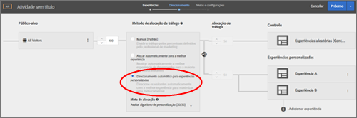 </p> <p>Para obter mais informações, consulte <a href="../c-activities/auto-target-to-optimize.md#concept_67779E5B7F67427A97D7EA2A6FB919B3" format="dita" scope="local">Direcionamento automático para experiências personalizadas</a>. </p> </td> 
  </tr> 
 </tbody> 
</table>

### Target Standard/Premium 17.7.1 (20 de julho de 2017) {#section_BB75DE30174F4ADD963451909FB81D74}

<table id="table_BCE36E0D56804E7B8861858DCF2F380E"> 
 <thead> 
  <tr> 
   <th colname="col1" class="entry"> Recurso </th> 
   <th colname="col2" class="entry"> Descrição </th> 
  </tr> 
 </thead>
 <tbody> 
  <tr> 
   <td colname="col1"> <p>Públicos-alvo </p> </td> 
   <td colname="col2"> <p>Agora é possível visualizar os detalhes da definição de público-alvo em um cartão pop-up na interface do usuário do Target, sem precisar abrir o público-alvo. Observe que esta funcionalidade aplica-se apenas a públicos-alvo criados no <span class="keyword">Target Standard/Premium. </span> </p> <p>  </p> </td> 
  </tr> 
  <tr> 
   <td colname="col1"> <p>Métricas de sucesso </p> </td> 
   <td colname="col2"> <p>Anteriormente, o Target permitia a dependência em uma única métrica e essa métrica precisava ser alcançada antes de sua contagem ser incrementada. Agora é possível fornecer dependência em várias métricas, juntamente com a flexibilidade para escolher se a métrica deve ser alcançada ou não para que a contagem seja incrementada. </p> <p>A funcionalidade de dependência de várias métricas não é suportada para o seguinte: </p> <p> 
     <ul id="ul_EC856F910B704D648065EA7DA13EE5B0"> 
      <li id="li_1A82414FE50B414CAA1A0A88E80BCC1B"> <p>Atividades do Recommendations. Esta funcionalidade é compatível com todos os outros tipos de atividade. </p> </li> 
      <li id="li_2D6CF42264D445FCB6C400ED321DE952"> <p>Se você usa o Analytics como fonte de relatórios (A4T). </p> </li> 
      <li id="li_E3A983A70BB04AE8B25A7CEC1F5FE1D9"> <p>O tipo de métrica “Visualizou uma página”. </p> </li> 
      <li id="li_9AAF6BB275F7489BA691676E308172D5"> <p>O tipo de métrica “Clicou em um elemento” para as atividades do Visual Experience Composer (VEC). </p> </li> 
     </ul> </p> <p>Para obter mais informações, consulte os seguintes tópicos: </p> <p> 
     <ul id="ul_4B0EFFDD257C42579E19569DCBE15BE3"> 
      <li id="li_2402575F27F547968BD536C460BF81B5"> <p>A/B: <a href="../c-activities/t-test-ab/t-test-create-ab/ab-goals-and-settings.md#reference_B25389FD6F3A4989801E740364B089CC" format="dita" scope="local">metas e configurações </a> </p> </li> 
      <li id="li_FB5E7CBC0154406C989F5A5C6CAA0C8F"> <p>Para obter mais informações, consulte <a href="../c-activities/t-automated-personalization/create-ap-activity.md#task_8AAF837796D74CF893CA2F88BA1491C9" format="dita" scope="local">Criação de uma atividade de Personalização automatizada </a> </p> </li> 
      <li id="li_57C36A7945A24A52BCBD62CA0F15B668"> <p>Direcionamento de experiência (XT): <a href="../c-activities/t-experience-target/t-xt-create/xt-goals-and-settings.md#reference_B25389FD6F3A4989801E740364B089CC" format="dita" scope="local">metas e configurações </a> </p> </li> 
      <li id="li_06674A3152A547268A1AE5EE818EF1A5"> <p>Multivariado (MVT): <a href="../c-activities/c-multivariate-testing/t-create-multivariate-test/goals-and-settings.md#reference_B25389FD6F3A4989801E740364B089CC" format="dita" scope="local">Metas e configurações </a> </p> </li> 
     </ul> </p> </td> 
  </tr> 
  <tr> 
   <td colname="col1"> <p>Relatórios (Alocação automática de testes A/B) </p> </td> 
   <td colname="col2"> <p>A capacidade de visualizar várias métricas agora está disponível para as atividades A/B de alocação automática. </p> <p>Para obter mais informações, consulte <a href="../c-reports/c-report-settings/view-multiple-metrics.md#concept_9E3C3F6F3EC1412FAF252975AC0720B7" format="dita" scope="local">Exibir várias métricas em um relatório </a>. </p> </td> 
  </tr> 
  <tr> 
   <td colname="col1"> <p>Públicos-alvo </p> </td> 
   <td colname="col2"> <p>Os tipos de página de site de público-alvo e os operadores de comparação agora correspondem aos tipos e operadores de comparação do Target Classic. </p> <p>Agora é possível criar públicos-alvo de páginas do site usando seu próprio "parâmetro de consulta definido pelo usuário" ou "cabeçalho definido pelo usuário". </p> <p>Para obter mais informações, consulte  <a href="../c-target/c-audiences/c-target-rules/site-pages.md#concept_6425D5304568490899E8340CC94798A9" format="dita" scope="local"> Páginas do site </a>. </p> </td> 
  </tr> 
  <tr> 
   <td colname="col1"> <p>Atividades </p> </td> 
   <td colname="col2"> <p>A lista de Atividades agora permite filtrar os tipos de atividade de Alocação automática e Direcionamento automático. </p> <p>Para obter mais informações, consulte <a href="../c-activities/activities.md#concept_D317A95A1AB54674BA7AB65C7985BA03" format="dita" scope="local">Atividades </a>. </p> </td> 
  </tr> 
  <tr> 
   <td colname="col1" class="premium"> <p>Critérios e promoções do Recommendations </p> </td> 
   <td colname="col2"> <p>Agora é possível lidar com valores em branco ao filtrar por Correspondência de atributos de entidade, Correspondência de atributos de perfil e Correspondência de parâmetros. </p> <p>Para obter mais informações, consulte <a href="../c-recommendations/c-algorithms/use-dynamic-and-static-inclusion-rules.md#concept_4CB5C0FA705D4E449BD0B37B3D987F9F" format="dita" scope="local">Usar as regras de inclusão estática e dinâmica </a>. </p> </td> 
  </tr> 
 </tbody> 
</table>

Essa versão do [!DNL Target] inclui os seguintes aprimoramentos e correções voltados para o cliente (os números de edição entre parênteses são para o uso interno da Adobe):

* Fluxo de trabalho melhorado quando a sessão do [!DNL Target] de um usuário atinge o tempo limite ao criar ou editar uma atividade ou oferta. Quando o usuário clica em [!UICONTROL Salvar], a mensagem de sessão expirada é exibida; porém, depois de fazer logon novamente, uma caixa de diálogo informa ao usuário que o logon foi bem-sucedido e a interface do usuário permanece na mesma página no [!DNL Target], sem perda de dados.

   Se um usuário executar uma ação intermitente em uma página do [!DNL Target] e experimentar um tempo limite de sessão, ele será direcionado para fazer logon novamente e, em seguida, será direcionado para a última página trabalhada na interface do usuário do [!DNL Target].

* Correção de um problema que fazia com que as alterações de código personalizadas fossem perdidas se o usuário saísse (altera as experiências, alterna a página, alterna o público-alvo, clica em Avançar etc.) e esquecesse de salvar as alterações. O usuário agora é solicitado a salvar as alterações. (TGT-23766)
* Quando uma atividade é arquivada, &quot;Atividade arquivada&quot; é exibido em vez de &quot;Atualizando a atividade&quot;. (KB-1517)
* O seletor suspenso nos seguintes locais da interface do usuário do Target foi substituído pela funcionalidade de preenchimento automático para melhorar a velocidade e o desempenho: (TGT-22939)

   * Página da atividade > *atividade* > Etapa 3 > Seletor de conjunto de relatórios
   * Públicos-alvo > Criar público-alvo > Perfil do visitante
   * Recommendations> Criação de feed > Quando o tipo de origem > Analytics > Seletor do Conjunto de relatórios

* Mensagens de erro aprimoradas quando um site tem &quot;X-Frame-options&quot; definido como SAMEORIGIN e o site não pode ser carregado no Visual Experience Composer (VEC). A mensagem solicita que o usuário alterne para o Enhanced Experience Composer em Administração > Visual Experience Composer. (TGT-17356)
* Os relatórios do Target Standard/Premium agora são exibidos no fuso horário da sua conta, em vez do fuso horário do servidor do Target (EST dos EUA). (TGT-24868)
* Se atividades criadas no [!DNL Target] forem carregadas de fora do [!DNL Target] (por exemplo, através do Adobe I/O), os seguintes atributos de atividade serão importados novamente ao [!DNL Target]:

   `thirdpartyId`

   `startDate`

   `endDate`

   `status`

   `priority`

   `marketingCloudMetadata(remoteModifiedBy)`

   Esse trabalho de importação será executado quando a página de atividades for aberta, com um atraso máximo de dez minutos. (KB-1526)

### Target Standard/Premium 17.6.2 (22 de junho de 2017) {#section_F0372B07B56E454CB048CE79FF56E9CD}

<table id="table_8C4DB1B83B874E4C85CE9FF352E7B857"> 
 <thead> 
  <tr> 
   <th colname="col1" class="entry"> Recurso </th> 
   <th colname="col2" class="entry"> Descrição </th> 
  </tr> 
 </thead>
 <tbody> 
  <tr> 
   <td colname="col1" class="premium"> <p>Atividades de Personalização automatizada (AP) </p> </td> 
   <td colname="col2"> <p> 
     <ul id="ul_F5BB1074DD4140C798CB55D68DEEF824"> 
      <li id="li_9596AABA14C64DEEB2E70E8ADED8AA74">As atividades de Personalização automatizada podem ser criadas usando o compositor baseado em formulário. </li> 
      <li id="li_315F5FF590404670A677FEA6E4E0DF5D">Novos números de confiança para Personalização automatizada </li> 
     </ul> </p> </td> 
  </tr> 
  <tr> 
   <td colname="col1" class="premium"> <p>Recommendations: critérios e promoções </p> </td> 
   <td colname="col2"> <p> Agora é possível criar critérios dinâmicos e promoções com base na correspondência de atributos de perfil e na correspondência de parâmetros. </p> <p> 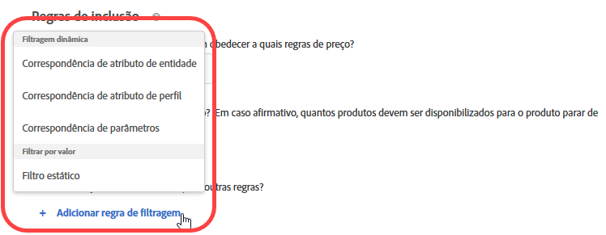 </p> <p> <p>Observação: se você estiver familiarizado com a configuração das regras de inclusão antes do Target versão 17.6.1 (junho de 2017), perceberá que algumas opções e operadores foram alterados. Somente os operadores aplicáveis à opção selecionada são exibidos e alguns operadores foram renomeados ("matches" agora é "equals") para ficarem mais consistentes e intuitivos. Todas as regras de exclusão existentes criadas antes desta versão foram migradas automaticamente para a nova estrutura. Nenhuma reestruturação é necessária da sua parte. </p> </p> </td> 
  </tr> 
  <tr> 
   <td colname="col1"> <p>Melhorias no Editor de códigos do VEC </p> </td> 
   <td colname="col2"> <p> Se o formato da página for alterado e as ações não puderem ser aplicadas, um alerta será exibido ao lado de cada ação com falha. Anteriormente, um erro geral informava ao usuário que a estrutura da página havia sido alterada. Agora, o editor de códigos destaca cada ação que falhou. </p> </td> 
  </tr> 
 </tbody> 
</table>

Esta versão do [!DNL Target] inclui os seguintes aprimoramentos e correções voltados para o cliente:

* Desempenho melhorado nos grupos de hosts e nas páginas de pesquisa de entidade do Recommendations.
* Mensagens de erro mais descritivas em todo o Target, especialmente quando relacionadas a falhas de sincronização.
* Correção de um problema que fazia com que a contagem no diagrama de atividades às vezes estivesse incorreta na interface do usuário quando a deduplicação automática era aplicada após a criação de grupos de exclusão.
* Correção de um problema em que as inclusões manuais podiam não ser refletidas corretamente na interface do usuário quando uma atividade existente com Grupo de exclusão era editada.

### Target Standard/Premium 17.6.1 (8 de junho de 2017) {#section_1D05FE23CE3744DDB5D28E933341F575}

<table id="table_47117524922A472AA977C652B581B356"> 
 <thead> 
  <tr> 
   <th colname="col1" class="entry"> Recurso </th> 
   <th colname="col2" class="entry"> Descrição </th> 
  </tr> 
 </thead>
 <tbody> 
  <tr> 
   <td colname="col1"> <p>Atividades do Direcionamento de experiência (XT) </p> </td> 
   <td colname="col2"> <p>A funcionalidade de arrastar e soltar permite organizar os públicos-alvo e as experiências na ordem desejada ao criar ou editar atividades de XT. Os visitantes serão avaliados quanto às experiências em ordem, de cima para baixo. </p> <p> 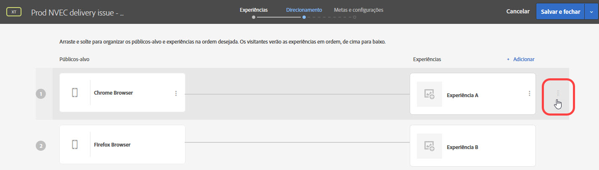 </p> <p>Para obter mais informações, consulte  <a href="../c-activities/t-experience-target/t-xt-create/xt-add-experience.md#task_454646F2895242D3B92DC395A0CE1A00" format="dita" scope="local"> Criar experiência </a>. </p> </td> 
  </tr> 
  <tr> 
   <td colname="col1"> <p>Relatórios: A/B, XT e Recommendations </p> </td> 
   <td colname="col2"> <p>Os relatórios para atividades de A/B, XT e Recommendations incluem representações visuais que permitem visualizar o intervalo de confiança e o incentivo para que você possa determinar com mais precisão um vencedor. É possível passar o cursor do mouse sobre as representações para ver os números reais. Este recurso não está disponível para atividades que usam o Analytics como fonte de relatórios (A4T). </p> <p> 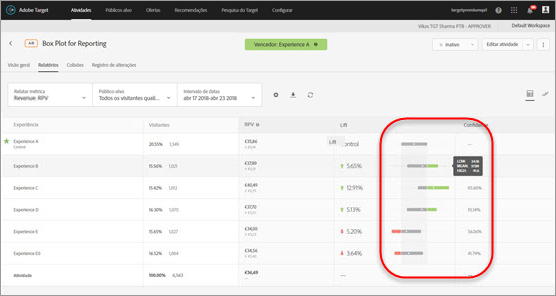 </p> <p>Para obter mais informações, consulte <a href="../c-reports/c-report-settings/report-settings.md#concept_4BB6A7FDAB6F4806A632F9CD989B8BFA" format="dita" scope="local">Configurações do relatório</a>. </p> </td> 
  </tr> 
  <tr> 
   <td colname="col1" class="premium"> <p>Atividades de Personalização automatizada (AP) </p> </td> 
   <td colname="col2"> <p>É possível criar grupos de exclusão em atividades de Personalização automatizada para garantir que as experiências com as ofertas designadas sejam excluídas automaticamente. </p> </td> 
  </tr> 
  <tr> 
   <td colname="col1" class="premium"> <p>Recommendations: critérios e promoções </p> </td> 
   <td colname="col2"> <p><b>(Programado para lançamento em 22 de junho de 2017)</b> Agora é possível criar critérios dinâmicos e promoções com base na correspondência de atributos de perfil e na correspondência de parâmetros. </p> <p>  </p> <p>Para obter mais informações, consulte <a href="../c-recommendations/c-algorithms/use-dynamic-and-static-inclusion-rules.md#concept_4CB5C0FA705D4E449BD0B37B3D987F9F" format="dita" scope="local">Usar as regras de inclusão estática e dinâmica </a>. </p> <p> <p>Observação: se você estiver familiarizado com a configuração das regras de inclusão antes do Target versão 17.6.1 (junho de 2017), perceberá que algumas opções e operadores foram alterados. Somente os operadores aplicáveis à opção selecionada são exibidos e alguns operadores foram renomeados ("matches" agora é "equals") para ficarem mais consistentes e intuitivos. Todas as regras de exclusão existentes criadas antes desta versão foram migradas automaticamente para a nova estrutura. Nenhuma reestruturação é necessária da sua parte. </p> </p> </td> 
  </tr> 
  <tr> 
   <td colname="col1"> <p>Nomear atividades </p> </td> 
   <td colname="col2"> <p>Agora você é solicitado a nomear a atividade antes de salvar. Não é possível salvar uma atividade sem um nome. </p> </td> 
  </tr> 
  <tr> 
   <td colname="col1"> <p>Nova localização para o Target Forum </p> </td> 
   <td colname="col2"> <p> O Target Forum foi transferido para a nova <a href="https://forums.adobe.com/community/experience-cloud/marketing-cloud/target" format="https" scope="external">Plataforma da comunidade da Adobe </a>. </p> </td> 
  </tr> 
 </tbody> 
</table>

### Target Standard/Premium 17.4.1 (27 de abril de 2017) {#section_24E6889AF1E0405497F6F77A407A9A46}

Esta versão inclui os seguintes recursos e melhorias:

<table id="table_9554D0094421417C88548BDC97B710F5"> 
 <thead> 
  <tr> 
   <th colname="col1" class="entry"> Recurso </th> 
   <th colname="col2" class="entry"> Detalhes </th> 
  </tr> 
 </thead>
 <tbody> 
  <tr> 
   <td colname="col1"> Relatório </td> 
   <td colname="col2"> <p><b>Exibir várias metas/métricas:</b> agora é possível visualizar várias métricas em atividades A/B e de Direcionamento de experiência (XT), com a exceção das  Atividades A/B de <a href="../c-activities/automated-traffic-allocation/automated-traffic-allocation.md#concept_A1407678796B4C569E94CBA8A9F7F5D4" format="dita" scope="local"> Alocação automática </a> e <a href="../c-activities/auto-target-to-optimize.md#concept_67779E5B7F67427A97D7EA2A6FB919B3" format="dita" scope="local"> Direcionamento automático </a>. </p> <p>Para obter mais informações, consulte <a href="../c-reports/c-report-settings/view-multiple-metrics.md#concept_9E3C3F6F3EC1412FAF252975AC0720B7" format="dita" scope="local">Exibir várias métricas em um relatório </a>. </p> </td> 
  </tr> 
 </tbody> 
</table>

Essa versão do [!DNL Target] está focada em correções de back-end e inclui os seguintes aprimoramentos e correções voltados para o cliente (os números de edição entre parênteses são para o uso interno da Adobe):

* Correção de um problema que fazia com que a configuração &quot;Incrementar contagem, liberar usuário e permitir reentrada&quot; nas Configurações avançadas das atividades não funcionasse corretamente. (TNT-26556)
* Correção de um problema que impedia que os dados de Atributos do cliente fossem removidos do Target depois de serem atualizados com valor NULO na interface do usuário da Experience Cloud. (TNT-26462)

### Alterações na plataforma do Target (13 de abril de 2017)  {#section_B59C26405EB7482AA80820D6D39B9C44}

<table id="table_6167ECB7B44F40DCADF299F46F1F795C"> 
 <thead> 
  <tr> 
   <th colname="col1" class="entry"> Alteração </th> 
   <th colname="col2" class="entry"> Detalhes </th> 
  </tr> 
 </thead>
 <tbody> 
  <tr> 
   <td colname="col1"> <p> <span class="filepath"> at.js </span> </p> </td> 
   <td colname="col2"> <p> A <span class="filepath">at.js</span> versão 0.9.6 já está disponível. Para obter mais informações, consulte <a href="../c-implementing-target/c-implementing-target-for-client-side-web/how-to-deployatjs/implementing-target-without-a-tag-manager.md#concept_1E1F958F9CCC4E35AD97581EFAF659E2" format="dita" scope="local">Baixar a at.js</a>. </p> <p>Os seguintes aprimoramentos e correções estão incluídos na <span class="filepath">at.js</span> versão 0.9.6: </p> <p> 
     <ul id="ul_108DF85393614C69988E299485D338FD"> 
      <li id="li_4117C900982240B5AFFCFE1B2716A443"> <p>Suporte à oferta de redirecionamento para A4T. Depois de baixar e instalar a <span class="filepath">at.js</span> versão 0.9.6, poderá usar as ofertas de redirecionamento nas atividades que usam o <span class="keyword">Adobe Analytics</span> como Fonte dos relatórios para o <span class="keyword">Target</span> (A4T). Além da <span class="filepath">at.js</span> versão 0.9.6, há outros requisitos mínimos que sua implementação deve atender para usar as ofertas de redirecionamento e o A4T. Para obter mais informações e outras informações importantes que você deveria saber, consulte <a href="../c-integrating-target-with-mac/a4t/r-a4t-faq/a4t-faq-redirect-offers.md#concept_21BF213F10E1414A9DCD4A98AF207905" format="dita" scope="local">Perguntas frequentes das Ofertas de redirecionamento - A4T </a>. </p> </li> 
      <li id="li_DA5321D72E81496DB7C49D589E1A59C4"> <p>Antes da <span class="filepath">at.js</span> 0.9.6, quando a API de visitante estava presente na página e a configuração <span class="codeph">visitorApiTimeout</span> era muito agressiva, poderia ocorrer uma situação no Target em que nenhum dado MCID era enviado na solicitação do <span class="keyword">Target</span>. Isso pode levar a problemas como ocorrências não corrigidas no <span class="keyword">Analytics</span> ao usar o A4T. </p> <p>Este comportamento foi alterado na <span class="filepath">at.js</span> 0.9.6, mesmo que <span class="codeph">visitorApiTimeout</span> seja definido para 1 ms, o Target tentará coletar dados de SDID, servidores de rastreamento e IDs do cliente e enviá-los na solicitação. </p> </li> 
      <li id="li_B11CE11D9A594CB1ABB85BD0D93C4A15"> <p>Adição da configuração <span class="codeph">selectorsPollingTimeout</span>. Para obter mais informações, consulte <a href="../c-implementing-target/c-implementing-target-for-client-side-web/cmp-atjs-functions.md#concept_8DACBC47ABDE4279BB102B42609FE506" format="dita" scope="local">targetGlobalSettings()</a>. </p> </li> 
      <li id="li_D6F862099A374FE394F4DA3520A1BBF0"> <p>O formato do formulário de resposta de <span class="codeph">getOffer()</span> foi alterado. Para obter mais informações, consulte <a href="../c-implementing-target/c-implementing-target-for-client-side-web/cmp-atjs-functions.md#reference_C81525D1598A4A1199740DCAB81A7FDF" format="dita" scope="local">adobe.target.getOffer(options) </a>. </p> </li> 
      <li id="li_80166567ED8945ECB37FEEE2C5F06ACE"> <p>O registro do console foi adicionado para declarações <span class="codeph">&lt;!DOCTYPE&gt;</span> não suportadas. </p> </li> 
      <li id="li_02904EBAE8D3400092B762F0B28B0C86"> <p>Correção de um problema em que os plug-ins do <span class="keyword">Target Classic</span> não eram aplicados corretamente quando várias ofertas padrão eram entregues a uma única mbox. (TGT-22664)</p> </li> 
      <li id="li_7016022D9DDE4529B77984F195825AB7"> <p>Configuração de cookie aprimorada para domínios de primeiro nível (TLDs) com duas letras para garantir que o cookie da mbox seja definido corretamente para esses domínios (por exemplo, <span class="filepath">test.no</span>, <span class="filepath">autodrives.ca</span> e assim por diante). </p> </li> 
      <li id="li_3B1F618DEC744056B5BB172C4DBB359A"> <p>O algoritmo para extrair o domínio de nível superior que deve ser usado ao salvar cookies foi alterado na <span class="codeph">at.js</span> versão 0.9.6. Por causa dessa alteração, os cookies não pode ser salvos em endereços que usam IP. Na maioria das vezes, os endereços IP são usados para fins de teste, mas, como solução alternativa, é possível usar entradas de DNS ou ajustar o arquivo de hosts em uma caixa local. </p> </li> 
      <li id="li_A52181499E63402DB4E16E33E36A9400"> <p>Correção das ações de mover e reorganizar quando as propriedades são valores de cadeia de caracteres em vez de números inteiros. </p> </li> 
     </ul> </p> <p>Para obter informações sobre esta versão e versões anteriores da <span class="filepath">at.js</span>, consulte <a href="../c-implementing-target/c-implementing-target-for-client-side-web/target-atjs-versions.md#reference_DBB5EDB79EC44E558F9E08D4774A0F7A" format="dita" scope="local">Detalhes de versão da at.js </a>. </p> </td> 
  </tr> 
 </tbody> 
</table>

### Target Standard/Premium 17.3.1 (30 de março de 2017 - Atualizado em 13 de abril de 2017) {#section_5C13660A8AA34F35A9CBEFEEC88738D0}

Esta versão inclui os seguintes recursos e melhorias:

<table id="table_4BA8DA701BC64427957355E144570EFE"> 
 <thead> 
  <tr> 
   <th colname="col1" class="entry"> Recurso </th> 
   <th colname="col2" class="entry"> Descrição </th> 
  </tr> 
 </thead>
 <tbody> 
  <tr> 
   <td colname="col1"> <p>Analytics for Target (A4T) </p> <p>Ofertas de redirecionamento </p> </td> 
   <td colname="col2"> <p><b>Atualizado em 13 de abril de 2017.</b> </p> <p>Agora é possível usar as ofertas de redirecionamento nas atividades que usam o <span class="keyword">Analytics</span> como fonte de relatórios. </p> <p>Essas bibliotecas devem ser incluídas na página com a oferta de redirecionamento e na página à qual o visitante é redirecionado. Como parte dessa alteração, os novos parâmetros de URL serão automaticamente adicionados aos seus URLs de redirecionamento se o serviço de ID do visitante for implementado no seu site, independentemente de usar ou não o Analytics como fonte de relatórios para a atividade. </p> <p>Para obter mais informações, consulte <a href="../c-integrating-target-with-mac/a4t/r-a4t-faq/a4t-faq-redirect-offers.md#concept_21BF213F10E1414A9DCD4A98AF207905" format="dita" scope="local">Ofertas de redirecionamento - Perguntas frequentes sobre o A4T</a>. </p> </td> 
  </tr> 
  <tr> 
   <td colname="col1"> <p>Públicos-alvo </p> </td> 
   <td colname="col2"> <p>Os seguintes aprimoramentos foram feitos ao direcionamento de público-alvo: </p> <p> 
     <ul id="ul_C920198404654C97A33190A29ACA6990"> 
      <li id="li_DB52EF909C9640649981940460CDF2B5"> <p><b>Divisão de semana e dia:</b> é possível definir opções de <span class="wintitle">Divisão de semana e dia</span> para criar padrões recorrentes de direcionamento de público-alvo. </p> <p>Para obter mais informações, consulte <a href="../c-target/c-audiences/c-target-rules/time-frame.md#concept_0FE1E8DACD104F8B870B0BADE3197F0A" format="dita" scope="local">Intervalo de tempo </a>. </p> </li> 
      <li id="li_2541A6EF2D604CE098012A16909C237E"> <p><b>Exclusões em públicos combinados:</b> agora é possível adicionar regras de exclusão e excluir públicos ao combinar vários públicos. </p> <p>Para obter mais informações, consulte <a href="../c-target/combining-multiple-audiences.md#concept_A7386F1EA4394BD2AB72399C225981E5" format="dita" scope="local">Combinar vários públicos-alvo </a>. </p> </li> 
     </ul> </p> </td> 
  </tr> 
  <tr> 
   <td colname="col1" class="premium"> <p>Recommendations </p> </td> 
   <td colname="col2"> <p><b>Promoções dinâmicas:</b> as recomendações do Target agora oferecem suporte a correspondências dinâmicas para promoções. </p> <p>Para obter mais informações, consulte <a href="../c-recommendations/c-algorithms/use-dynamic-and-static-inclusion-rules.md#concept_4CB5C0FA705D4E449BD0B37B3D987F9F" format="dita" scope="local">Usar as regras de inclusão estática e dinâmica </a>. </p> </td> 
  </tr> 
 </tbody> 
</table>

>[!NOTE]
>
>A capacidade de exibir várias métricas em um relatório, incluída no Target versão 17.3.1 (30 de março de 2017), foi removida devido a um comportamento inesperado. Esse recurso estará disponível novamente em uma versão futura.

Esta versão do [!DNL Target] inclui os seguintes aprimoramentos e correções:

* A interface do usuário do [!DNL Target] foi atualizada para oferecer suporte a ofertas de redirecionamento em atividades que usam o [!UICONTROL Analytics for Target] (A4T) como fonte de relatórios. Esta funcionalidade exigirá a [!DNL at.js] 0.9.6, que estará disponível em breve.
* A interface do usuário do [!DNL Target] foi atualizada em alguns aspectos:

   * Nos relatórios e atividades, algumas opções ([!UICONTROL Editar], [!UICONTROL Compartilhar no feed], [!UICONTROL Exibir URLs de experiência], etc.) agora são acessadas clicando no ícone [!UICONTROL Mais opções] (

      ).
   * Na biblioteca de [!UICONTROL Ofertas], as ofertas agora são exibidas em uma lista, e não como cartões. Outras alterações secundárias foram feitas em toda a interface do usuário da biblioteca de [!UICONTROL Ofertas].

* Desempenho significativamente melhorado nas listas de [!UICONTROL Atividades] e [!UICONTROL Públicos-alvo]. Além disso, os tempos de carregamento dos resultados da pesquisa são significativamente mais rápidos.
* &quot;Exibições&quot; agora é &quot;Visitas&quot; no [!UICONTROL Relatório em nível de oferta] para relatórios de [!UICONTROL Personalização automatizada].
* O [!DNL Target] agora oferece suporte à alternação de ambientes (grupos de hosts) para atividades de [!UICONTROL Personalização automatizada].
* As atividades de [!UICONTROL Personalização automatizada] agora oferecem suporte aos grupos de hosts.

### Target Standard/Premium 17.2.1 (21 de fevereiro de 2017) {#section_FC6412353DE64E848FFD5E8EFF72C7C7}

>[!NOTE]
>
>O [!DNL Adobe Experience Manager] 6.2 com FP-11577 (ou posterior) agora é compatível com implementações da [!DNL at.js] com a integração do [!UICONTROL Adobe Target Cloud Services]. Para obter mais informações, consulte [Pacotes de recursos](https://docs.adobe.com/docs/en/aem/6-2/release-notes/feature-packs.html) e [Integração com o Adobe Target](https://docs.adobe.com/docs/en/aem/6-2/administer/integration/marketing-cloud/target.html) na documentação do *Adobe Experience Manager 6.2*.

Essa versão do [!DNL Target] está focada em melhorias de usabilidade e desempenho e inclui os seguintes aprimoramentos e correções (os números de edição entre parênteses são para o uso interno da Adobe):

* Adição de mais itens ao menu Ajuda que podem ser acessados no canto superior direito da interface do usuário do [!DNL Target]. As novas opções incluem: &quot;Blogs&quot; e &quot;Vídeos&quot;. A opção &quot;Status da Adobe Experience Cloud&quot; agora é &quot;Status do Adobe Target Standard/Premium&quot;. (TGT-22629)
* Ao excluir um público-alvo, o [!DNL Target] exibe uma lista de atividades que fazem referência a esse público-alvo. Os usuários podem clicar em cada atividade na lista para exibir as respectivas páginas de [!UICONTROL Visão geral]. (TGT-17997)
* `user.activeCampaigns` melhorado para retornar a ID da campanha para todas as campanhas/atividades nas quais o usuário está, mesmo que ele não tenha interagido com a campanha/atividade na sessão atual. (TNT-26237)
* O botão [!UICONTROL Criar atividade] na página [!UICONTROL Atividades] agora fica ativo antes do carregamento de todos os nomes de atividades na lista. Essa melhoria permite que os usuários criem novas atividades com mais rapidez, especialmente quando a conta tem muitas atividades configuradas. (TGT-21470)
* Aperfeiçoamentos feitos no Enhanced Experience Composer (EEC) para melhorar o tempo de carregamento de sites que executam HTTPS acessados via proxy. O Target não obtém mais recursos estáticos através de proxy. (TGT-21793)
* Melhorias de desempenho feitas na página [!UICONTROL Metas e configurações], especialmente no tempo de carregamento quando há muitas métricas definidas para uma atividade. (TGT-21654)
* Added a tool tip on the [!UICONTROL Goals &amp; Settings] page of all activities using [!UICONTROL Analytics for Target] (A4T) reporting informing users that a tracking server is not required if the activity&#39;s pages have at.js (version 0.9.1 or later) loaded. (TGT-22607)
* Agora, os nomes das métricas são exibidos na página [!UICONTROL Metas e configurações], sem que os usuários precisem expandir cada métrica para visualizar todo o nome. Essa melhoria permite que os usuários editem métricas de maneira mais rápida e eficiente. (TGT-21276)
* Agora é possível aplicar regras de inclusão do [!DNL Recommendations] a critérios personalizados (carregados por meio de um CSV), exatamente como qualquer outro critério. (TGT-21896)
* Melhoria na interface do usuário e na usabilidade da página [!UICONTROL Ofertas], principalmente ao criar ou gerenciar pastas e criar ofertas. (TGT-22509 e TGT-22187)
* Melhoria na experiência do usuário no [!UICONTROL Visual Experience Composer] (VEC) ao selecionar itens para ocultar. 
(TGT-22224)
* Melhoria na experiência do usuário ao criar atividades usando o [!UICONTROL Experience Composer baseado em formulário]. Ao escolher uma localização de mbox, a borda de validação permanece realçada após clicar em [!UICONTROL Próximo]. (TGT-22221)
* Melhoria nos relatórios baixados para diferenciar entre ofertas ativas e excluídas. (TGT-22449)
* Correção de um problema que impedia a exibição de ativos mais antigos na lista de ativos com rolagem infinita na interface do usuário do serviço principal do Experience Cloud Assets. (TGT-19733)
* Correção de um problema em que a configuração do pedido extremo não era respeitada nos relatórios CSV baixados. (TGT-21871)
* Correção de um problema em que pedidos extremos não eram marcados corretamente no relatório CSV de [!UICONTROL Detalhes do pedido] baixado. (TGT-22500)
* Correção de um problema que causava a exibição incorreta da hora do pedido no relatório CSV de [!UICONTROL Auditoria da campanha] baixado, embora o relatório exibisse a data correta do pedido. (TNT-26469)
* Correção de um problema que impedia o correto funcionamento da opção [!UICONTROL Desativar JavaScript] em atividades com várias páginas. (TGT-15130)
* Se você usar o Experience Composer baseado em formulário com uma mbox diferente da mbox global criada automaticamente (`target-global-mbox`) e escolher uma métrica de envolvimento como métrica de sucesso, a métrica será incrementada apenas nas páginas em que a mbox é usada na atividade. Como exemplo, se sua mbox for `homepage_mbox`, a métrica [!UICONTROL Páginas por visita] será o número de ocorrências para `homepage_mbox` durante a visita.

   Se isso não for o que você deseja, pode adicionar outro local à atividade, atribuir a mbox global a esse local e fornecer o conteúdo padrão. Essa solução alternativa conecta a mbox global à atividade e permite ao Target contabilizar a métrica para fins de relatório.

### Alterações na plataforma do Target (18 de janeiro de 2017)  {#section_EA41802B2B24426FBA88D25E17DBE360}

<table id="table_3A2CD47252894F119B0E60BF6A9285B0"> 
 <thead> 
  <tr> 
   <th colname="col1" class="entry"> Alteração </th> 
   <th colname="col2" class="entry"> Detalhes </th> 
  </tr> 
 </thead>
 <tbody> 
  <tr> 
   <td colname="col1"> <p> <span class="codeph"> at.js</span> versão 0.9.4 </p> </td> 
   <td colname="col2"> <p>18 de janeiro de 2017 </p> <p> A <span class="codeph">at.js</span> versão 0.9.4 contém as seguintes alterações: </p> <p> 
     <ul id="ul_8F149C28E2D946B9888B4D2F45167C3C"> 
      <li id="li_93E866BBFE374E93BCDB65BCFAC33B62"> <p> os nomes da mbox agora podem conter caracteres especiais, incluindo os e-mails ( &amp; ). (TNT-26144) </p> <p>Para obter mais informações, consulte <a href="../c-implementing-target/c-implementing-target-for-client-side-web/how-to-deployatjs/implementing-target-without-a-tag-manager.md#concept_2FA0456607D04F82B0539C5BF5309812" format="dita" scope="local">Configurações de at.js</a>. </p> </li> 
      <li id="li_99309046030B4D93B59113C01A8789DA"> <p>Adição da configuração <span class="codeph">secureOnly</span>, que indica se a <span class="codeph">at.js</span> deve usar somente HTTPS ou pode alternar entre HTTP e HTTPS com base no protocolo da página. Esta é uma configuração avançada cujo padrão é Falso e pode ser substituída por <span class="codeph">targetGlobalSettings </span>. (TNT-26183) </p> <p>Para obter mais informações, consulte <a href="../c-implementing-target/c-implementing-target-for-client-side-web/cmp-atjs-functions.md#concept_8DACBC47ABDE4279BB102B42609FE506" format="dita" scope="local">targetGlobalSettings()</a>. </p> </li> 
      <li id="li_D84D578C43A24D4896795999F841CEB8"> <p>A opção <span class="wintitle">Suporte a navegador herdado</span> está disponível na <span class="codeph">at.js</span> versão 0.9.3 e posteriores. Esta opção foi removida na <span class="codeph">at.js</span> versão 0.9.4. </p> <p>Para obter mais informações, consulte <a href="../c-implementing-target/c-implementing-target-for-client-side-web/how-to-deployatjs/implementing-target-without-a-tag-manager.md#concept_2FA0456607D04F82B0539C5BF5309812" format="dita" scope="local">Configurações de at.js</a>. </p> </li> 
     </ul> </p> <p>Para obter informações sobre as alterações de cada versão da <span class="codeph">at.js</span>, consulte <a href="https://docs.adobe.com/content/help/en/target/using/implement-target/client-side/target-atjs-versions.html" format="html" scope="external">Detalhes de versão da at.js </a>. </p> </td> 
  </tr> 
 </tbody> 
</table>

### Target Standard/Premium 17.1.1 (19 de janeiro de 2017) {#section_88AFA2F54CF24DF7822CFEBB07DFABE2}

Esta versão inclui os seguintes recursos e melhorias:

<table id="table_4F7D4A71F5DF4E8782C7DBEEEF24AD04"> 
 <thead> 
  <tr> 
   <th colname="col1" class="entry"> Recurso </th> 
   <th colname="col2" class="entry"> Descrição </th> 
  </tr> 
 </thead>
 <tbody> 
  <tr> 
   <td colname="col1"> <p>Content/Offers </p> </td> 
   <td colname="col2"> <p>Os seguintes aprimoramentos já estão disponíveis para as ofertas: </p> <p> 
     <ul id="ul_7D8E81443E0F48B6A0C1D1DF6F27D292"> 
      <li id="li_EA529EF4EBC2416E9D3B9E7251E7AAAB"> <p>A página Conteúdo foi renomeada para Ofertas. Além disso, agora existem duas guias no lado direito para separar as ofertas de código das ofertas de imagem. </p> <p>Se você tiver códigos e imagens na mesma pasta antes desta versão, o Target os dividirá em duas pastas duplicadas. </p> </li> 
      <li id="li_9574FA6BDCFB4BAB938273BF7F4B21C8"> <p>As ofertas criadas por meio do Target Classic, do Adobe Experience Manager (AEM), do Adobe Mobile Services (AMS) e das APIs agora estão visíveis na interface do usuário do Target Standard/Premium. As ofertas criadas no Target Classic podem ser editadas no Target Standard/Premium. (TGT-15738) </p> <p> As ofertas atualizadas nos últimos dois anos usando esses métodos estarão visíveis no Target Standard/Premium (ou seja, a partir de janeiro de 2015). </p> </li> 
      <li id="li_CAD67C9EBB564525ABD2269D918275F8"> <p>Agora é possível filtrar ofertas por fonte e tipo. </p> </li> 
     </ul> </p> <p>Para obter mais informações, consulte <a href="../c-experiences/c-manage-content/manage-content.md#concept_17874A6FCBB743AA84C5988E8571CCF3" format="dita" scope="local">Ofertas </a>. </p> <p>Os seguintes aprimoramentos foram feitos no direcionamento por localização geográfica: </p> <p> 
     <ul id="ul_DD8B50F980B8447A8C37EA96530D8949"> 
      <li id="li_348E04AB29B14E6F83E3A7E7BF7D75B8"> <p>Agora é possível usar os valores de <span class="codeph">profile.geolocation</span> diretamente como tokens em ofertas, plug-ins e assim por diante. (TNT-25967) </p> </li> 
     </ul> </p> <p>Para obter mais informações, consulte <a href="../c-target/c-audiences/c-target-rules/geo.md#concept_5B4D99DE685348FB877929EE0F942670" format="dita" scope="local">Geográfico</a>. </p> </td> 
  </tr> 
  <tr> 
   <td colname="col1"> <p>Relatório </p> <p> <p>Observação: esses aprimoramentos não se aplicam aos relatórios do Analytics for Target (A4T). </p> </p> </td> 
   <td colname="col2"> <p>Os seguintes aprimoramentos de relatórios já estão disponíveis para os relatórios do Target. </p> <p> 
     <ul id="ul_ACFCA821B120419EA252EF5031309D52"> 
      <li id="li_0B634602BB044AEDB26DAF78189AB833"> <p>A interface do usuário para os relatórios foi redesenhada. </p> </li> 
      <li id="li_309435D10AE84E8795C4CCC1F36747F7"> <p>Os relatórios do Target agora têm uma opção para redefinir os dados do relatório e remover dados antigos. (TGT-5933) </p> </li> 
      <li id="li_9D30BFCC4CD6461B9DDCD5797A5E2B3A"> <p>As opções da metodologia de contagem para os relatórios incluem Visitantes (padrão), Visitas e Impressões de atividades. (TGT-10002) </p> </li> 
     </ul> </p> <p>Para obter mais informações, consulte <a href="../c-reports/c-report-settings/report-settings.md#concept_4BB6A7FDAB6F4806A632F9CD989B8BFA" format="dita" scope="local">Configurações do relatório</a> e <a href="../c-reports/conversion-rate.md#concept_EC19BC897D66411BABAF2FA27BCE89AA" format="dita" scope="local">Metodologia de contagem </a>. </p> <p>Os seguintes aprimoramentos de relatórios já estão disponíveis para os relatórios CSV para download: </p> <p> 
     <ul id="ul_18B0636A41B94F9F903ABFE3E13285DA"> 
      <li id="li_2422075AA0A34F868809C5D580FC5D4B"> <p>O relatório CSV no nível da oferta agora tem detalhes adicionais sobre cada oferta. (TGT-18995) </p> </li> 
      <li id="li_659D126E846348D4BE4544962F41539F"> <p>Agora, os arquivos CSV em nível de oferta baixados sempre incluem dados de segmentos controlados e direcionados para os relatórios de <span class="wintitle">Personalização automatizada</span>. (TGT-22000) </p> </li> 
     </ul> </p> <p>Os seguintes aprimoramentos de relatórios já estão disponíveis para os relatórios de Personalização automatizada (AP). </p> <p> 
     <ul id="ul_5743684487CD4905BA998C298FD423D7"> 
      <li id="li_EB48BA21E00C4878B4408D24DD23BA9C"> <p>Tempo de carregamento de relatórios melhorado para atividades de Personalização automatizada. </p> </li> 
      <li id="li_B8ECCE250A674B83A66705AD5C45B9C3"> <p>O intervalo de confiança de variáveis contínuas (tipos de métrica Receita e Envolvimento) agora é exibido nos relatórios resumidos da Personalização automatizada (AP). </p> </li> 
     </ul> </p> </td> 
  </tr> 
  <tr> 
   <td colname="col1"> <p>Atividades </p> </td> 
   <td colname="col2"> <p>Os seguintes aprimoramentos já estão disponíveis para as atividades do Target: </p> <p> 
     <ul id="ul_436556860E6C4AEEB35411A02E78A199"> 
      <li id="li_5CC3B995D0AF4B658B3D6C3F6895AA41"> <p>As atividades criadas no <span class="keyword">Adobe Mobile Services</span> agora são exibidas na interface do usuário do <span class="keyword">Target Standard/Premium</span>. (TGT-10806) </p> <p>Para obter mais informações, consulte <a href="../c-activities/activities.md#concept_D317A95A1AB54674BA7AB65C7985BA03" format="dita" scope="local">Atividades </a>. </p> </li> 
      <li id="li_684F9FC5CF414F4A892E6495352B5939"> <p>Ao criar testes multivariados, é possível excluir mais de 10% das experiências do teste, desde que você reconheça o aviso de que deve usar relatórios offline para análise. (TGT-21719) </p> <p>Para obter mais informações, consulte <a href="../c-activities/c-multivariate-testing/t-create-multivariate-test/preview-experiences.md#task_21A700587E88453A9FC2210C0DE53A28" format="dita" scope="local">Visualizar experiências de um Teste multivariado </a>. </p> </li> 
      <li id="li_B2FC7414C76848B39AD6EA20EE483F06"> <p>O ID da campanha agora está visível na página Visão geral de cada atividade. Isso é útil para as operações da API e de solução de problemas. (TGT-20928) </p> </li> 
      <li id="li_5A9880AFE5FB46168D92255AA088B854"> <p>O design das páginas Colisões e Registro de alterações foi aprimorado. </p> </li> 
      <li id="li_1489EA6C30C94B2AB394189E5FAFF6F6"> <p>O tamanho máximo permitido para o nome das ofertas anônimas nas atividades de Personalização automatizada (AP) aumentou de 30 para 250 caracteres. </p> </li> 
     </ul> </p> </td> 
  </tr> 
  <tr> 
   <td colname="col1"> <p>Públicos-alvo </p> </td> 
   <td colname="col2"> <p>Os seguintes aprimoramentos já estão disponíveis para os públicos-alvo: </p> <p> 
     <ul id="ul_F1D1F97266134D4ABE627CF2DCE2C6D4"> 
      <li id="li_99A611FCC1254D229D79B8FD075B952A"> <p> O <span class="wintitle">Nome de comercialização do dispositivo</span> agora está disponível como uma opção incorporada na lista suspensa ao criar públicos-alvo direcionados a dispositivos móveis. </p> <p>Essa alteração permite escolher facilmente um nome de modelo de dispositivo, em vez de procurar pelo número de modelo de dispositivo apropriado. Por exemplo, o nome de comercialização do dispositivo Galaxy S7 é "Samsung Galaxy S7 Edge", enquanto que o modelo do dispositivo é "SM-G9350". (TGT-18393) </p> <p>Para obter mais informações, consulte <a href="../c-target/c-audiences/c-target-rules/mobile.md#concept_2A794199DC1A4D349FFFBC7DCF1FEB89" format="dita" scope="local">Dispositivo móvel</a>. </p> </li> 
     </ul> </p> </td> 
  </tr> 
  <tr> 
   <td colname="col1" class="premium"> <p>Recommendations </p> </td> 
   <td colname="col2"> <p>Os seguintes aprimoramentos foram feitos no Recommendations: </p> <p> 
     <ul id="ul_9D3644890C0C472D8B485DE9A52898B3"> 
      <li id="li_1E5662348F6E4ABDB2B74FE3326F2FD3"> <p>A linha de resultados do Algoritmo de back-up agora é incluída nos downloads de CSV de Mais visualizados e Mais comprados. A recomendação de back-up começa com "*," </p> </li> 
      <li id="li_91DFD809378D4C20918F8F875747CE07"> <p>Status adicionais permitem que você saiba o progresso dos seus feeds de recomendação. </p> <p>Para obter mais informações, consulte  <a href="../c-recommendations/c-products/feeds.md#concept_1228B31E3D0B483B9DD42C5E2AE436E3" format="dita" scope="local"> Feeds </a>. </p> </li> 
     </ul> </p> </td> 
  </tr> 
  <tr> 
   <td colname="col1"> <p>Enhanced Visual Experience Composer (VEC) </p> </td> 
   <td colname="col2"> <p>Atualização dos endereços IP do Enhanced Visual Experience Composer (VEC). </p> <p>Se você lista de permissões os endereços IP usados para o VEC, adicione os novos endereços IP. </p> <p>Para obter mais informações, consulte <a href="../c-experiences/c-visual-experience-composer/r-troubleshoot-composer/troubleshoot-composer.md#reference_77743144F10143A3A89D56E116D296E4" format="dita" scope="local">Solução de problemas do Visual Experience Composer </a>. </p> </td> 
  </tr> 
 </tbody> 
</table>

## Versões de 2016 {#reference_607661929B504CCFAB3791B13C0DCDBE}

### Target Standard/Premium 16.10.2 (8 de novembro de 2016) {#section_2FDEFB3D56CC4BD7BC04DBEECFF6E942}

**Correções**

Esta versão inclui as seguintes correções:

* Correção de um problema no [!DNL Recommendations] em que os feeds não podiam ser criados para nenhum ambiente fora do padrão (grupos de hosts).
* Várias melhorias foram feitas para reduzir os erros de sincronização de atividades.
* Não é possível mais criar ofertas de redirecionamento para atividades que usam o [!DNL Analytics for Target] (A4T).

### Target Standard/Premium 16.10.1 (25 de outubro de 2016) {#section_F76F7329FCAC452FB88F8BE0BA727044}

Esta versão inclui os seguintes recursos e melhorias:

<table id="table_F8C01B2A9F07443490DB3025AC3AAC2A"> 
 <thead> 
  <tr> 
   <th colname="col1" class="entry"> Recurso </th> 
   <th colname="col2" class="entry"> Descrição </th> 
  </tr> 
 </thead>
 <tbody> 
  <tr> 
   <td colname="col1"> Alocação automática: emblema de vencedor </td> 
   <td colname="col2"> <p>Facilitamos a determinação de um vencedor em uma atividade A/B de Alocação automática. </p> <p>Muitos profissionais de marketing cometem o erro de declarar prematuramente uma experiência vencedora antes dos resultados indicarem claramente o vencedor. </p> <p>Ao usar o recurso <span class="wintitle">Alocação automática de tráfego</span>, o <span class="keyword">Target</span> exibe um emblema na parte superior da página da atividade, indicando "Ainda não há vencedor" até que a atividade atinja o número mínimo de conversões com confiança suficiente. Quando um vencedor claro é declarado, o <span class="keyword">Target</span> exibe "Vencedor: Experiência X". </p> <p>Para obter mais informações, consulte <a href="../c-activities/automated-traffic-allocation/automated-traffic-allocation.md#concept_A1407678796B4C569E94CBA8A9F7F5D4" format="dita" scope="local">Alocação automática de tráfego</a> e <a href="../c-activities/automated-traffic-allocation/determine-winner.md#concept_5741A89ED7224E1285A3BC34B2CCD0F9" format="dita" scope="local">Determinar um vencedor</a>. </p> <p> <p>Observação: a alocação automática de atividades A/B não é mais suportada no Analytics for Target (A4T) a partir desta versão. Com esta versão, qualquer atividade A/B de Alocação automática com o A4T ativado será alternada para o modo <span class="wintitle">Manual</span> (alocação de tráfego igual). </p> </p> </td> 
  </tr> 
  <tr> 
   <td colname="col1"> Direcionar dispositivos móveis por operadora </td> 
   <td colname="col2"> <p>Crie um público-alvo para direcionar os dispositivos móveis com base na operadora de celular (Verizon, Sprint, AT&amp;T, T-Mobile, etc.). A opção <span class="wintitle">Operadora de celular</span> encontra-se nas configurações <span class="wintitle">Geográficas</span>. </p> <p>Para obter mais informações, consulte <a href="../c-target/c-audiences/c-target-rules/geo.md#concept_5B4D99DE685348FB877929EE0F942670" format="dita" scope="local">Geográfico</a>. </p> </td> 
  </tr> 
  <tr> 
   <td colname="col1"> Gerar o token de autenticação mboxTrace na interface do usuário do Target </td> 
   <td colname="col2"> <p>Habilite as ferramentas de depuração do <span class="keyword">Target</span>, criando um token de autenticação temporário. </p> <p>Click <span class="uicontrol"> Generate Authentication Token </span> on the <span class="wintitle"> Implementation Details </span> page ( <span class="uicontrol"> Administration </span> &gt; <span class="uicontrol"> Implementation </span>). É possível adicionar o parâmetro resultante aos URLs da sua página da Web para fins de solução de problemas. </p> <p>Para obter mais informações, consulte "Recuperar o token de autorização para usar com as ferramentas de depuração" em  <a href="../c-activities/c-troubleshooting-activities/content-trouble.md#concept_D2548B486C984B1E97ED7A72075B8EEA" format="dita" scope="local"> Solução de problemas da entrega de conteúdo </a>. </p> </td> 
  </tr> 
  <tr> 
   <td colname="col1" class="premium"> Recommendations: sequenciamento definido por critérios </td> 
   <td colname="col2"> <p>Use conjuntos de até cinco critérios pré-criados em uma única experiência para obter maior controle sobre as recomendações apresentadas aos visitantes. </p> <p>Para obter mais informações, consulte  <a href="/help/c-recommendations/c-algorithms/create-criteria-sequence.md"> Create Criteria Sequences </a>. </p> </td> 
  </tr> 
  <tr> 
   <td colname="col1" class="premium"> Recommendations: inserir promoções externas </td> 
   <td colname="col2"> <p>Adicione itens promovidos e controle o posicionamento nos designs do Recommendations. </p> <p>Para obter mais informações, consulte  <a href="../c-recommendations/t-create-recs-activity/adding-promotions.md#task_CC5BD28C364742218C1ACAF0D45E0E14" format="dita" scope="local"> Adição de promoções </a>. </p> </td> 
  </tr> 
  <tr> 
   <td colname="col1" class="firstlook"> <p><b>Primeira impressão</b> </p> Direcionamento automático em atividades A/B </td> 
   <td colname="col2"> <p> <p>Observação: esta oferta de "Primeira impressão" está ativada para alguns clientes nesta versão para testes e feedback. </p> </p> <p>Direcione automaticamente as experiências nos testes A/B para veicular a experiência certa ao visitante certo. </p> <p>Para obter mais informações, consulte <a href="../c-activities/auto-target-to-optimize.md#concept_67779E5B7F67427A97D7EA2A6FB919B3" format="dita" scope="local">Direcionamento automático para experiências personalizadas</a>. </p> </td> 
  </tr> 
 </tbody> 
</table>

### Alterações na plataforma do Target (10 de outubro de 2016) {#section_0761AED70C3E44EA9D8546107B162CC1}

<table id="table_E3E52A4362724D05A8472DB5F51A2429"> 
 <thead> 
  <tr> 
   <th colname="col1" class="entry"> Alteração </th> 
   <th colname="col2" class="entry"> Detalhes </th> 
  </tr> 
 </thead>
 <tbody> 
  <tr> 
   <td colname="col1"> <p> <span class="codeph"> at.js</span> versão 0.9.3 </p> </td> 
   <td colname="col2"> <p>10 de outubro de 2016 </p> <p> A <span class="codeph">at.js</span> versão 0.9.3 está disponível. </p> <p> 
     <ul id="ul_E4D300700390433E9EF8D5C9D3AA7669"> 
      <li id="li_E916EB3A77ED4CFF90CF6B4D30F188B1"> <p>Garante que as chamadas da mbox sejam acionadas no Microsoft Internet Explorer 11 quando os navegadores herdados estiverem desativados nas configurações da <span class="codeph">at.js</span>. </p> </li> 
      <li id="li_1130509832CE429DB6DE636404CC54E1"> <p>Garante que o conteúdo padrão seja renderizado se uma oferta remota dinâmica falhar (por exemplo, se o URL estiver incorreto e retornar um erro 404). </p> </li> 
      <li id="li_21B5225D894B43CB863A775C937F66F4"> <p>Garante que os elementos sejam revelados rapidamente quando os seletores de rastreamento de cliques do VEC não puderem ser encontrados no DOM. </p> </li> 
     </ul> </p> <p>Para obter mais informações, consulte <a href="../c-implementing-target/c-implementing-target-for-client-side-web/target-atjs-versions.md#reference_DBB5EDB79EC44E558F9E08D4774A0F7A" format="dita" scope="local">Detalhes da versão da at.js </a>. </p> </td> 
  </tr> 
 </tbody> 
</table>

### Target Standard/Premium 16.9.1 (22 de setembro de 2016) {#section_3CD20678B6254DE1A9BD41FDD2255DDD}

Esta versão inclui os seguintes recursos e melhorias:

<table id="table_FED049F97C054CA895E0AEA3F2B180BF"> 
 <thead> 
  <tr> 
   <th colname="col1" class="entry"> Recurso </th> 
   <th colname="col2" class="entry"> Descrição </th> 
  </tr> 
 </thead>
 <tbody> 
  <tr> 
   <td colname="col1"> Combinar públicos-alvo </td> 
   <td colname="col2"> <p>Combine vários públicos-alvo (incluindo públicos-alvo da <span class="keyword">Adobe Experience Cloud</span> e do <span class="keyword">Target</span>) rapidamente durante o fluxo de trabalho de criação da atividade. </p> <p>Por exemplo, você pode direcionar todos os clientes de fidelidade incluindo um segmento específico do <span class="keyword">Audience Manager</span> para o status de fidelidade e combinando-o com um segmento do <span class="keyword">Target</span> composto por pessoas que se inscreveram no programa de fidelidade durante a sessão atual, em vez de criar um terceiro público-alvo permanente. </p> <p>Para obter mais informações, consulte <a href="../c-target/combining-multiple-audiences.md#concept_A7386F1EA4394BD2AB72399C225981E5" format="dita" scope="local">Combinar vários públicos-alvo </a>. </p> </td> 
  </tr> 
  <tr> 
   <td colname="col1"> Visitantes do Target durante um período de tempo específico </td> 
   <td colname="col2"> <p>Adicione datas de início e término para direcionar um público-alvo. </p> <p>Por exemplo, usando os novos públicos-alvo ad-hoc combinados mencionados anteriormente, você pode direcionar os usuários com conteúdo específico durante os três dias que antecedem a Black Friday e com outro conteúdo após a Black Friday. </p> <p>Para obter mais informações, consulte <a href="../c-target/c-audiences/c-target-rules/time-frame.md#concept_0FE1E8DACD104F8B870B0BADE3197F0A" format="dita" scope="local">Intervalo de tempo </a>. </p> </td> 
  </tr> 
  <tr> 
   <td colname="col1"> Salvar coleções inteligentes </td> 
   <td colname="col2"> <p>A funcionalidade de pesquisa na página <span class="wintitle">Conteúdo</span> agora inclui as pastas salvas, chamadas de coleções inteligentes, para economizar tempo ao realizar pesquisas semelhantes. </p> <p>Para obter mais informações, consulte <a href="../c-experiences/c-manage-content/filter-and-search-content.md#concept_3B59B8F025BF4CEA82ECC5199D365276" format="dita" scope="local">Pesquisar o conteúdo e criar coleções inteligentes </a>. </p> </td> 
  </tr> 
  <tr> 
   <td colname="col1"> Experience Composer baseado em formulário </td> 
   <td colname="col2"> <p>Adicione um link a uma imagem. O link pode ser um link de cliques, um link de destino ou um link inicial. </p> <p>Para obter mais informações, consulte <a href="../c-experiences/form-experience-composer.md#task_FAC842A6535045B68B4C1AD3E657E56E" format="dita" scope="local">Experience Composer baseado em formulário</a>. </p> </td> 
  </tr> 
 </tbody> 
</table>

**Aprimoramentos**

Essa versão inclui os seguintes aprimoramentos:

| Aprimoramento | Descrição |
|---|---|
| Visual Experience Composer (VEC) | Mensagens de erro aprimoradas. |

**Problemas conhecidos**

* A opção [!UICONTROL Renderizar usando JavaScript] não é mais suportada se usada em conjunto com um código personalizado no Visual Experience Composer.

### Alterações na plataforma do Target (setembro de 2016)  {#section_1955146045A247D393DB824669A2A916}

<table id="table_8FDAEED5D84C4C718AB863BD6C383F20"> 
 <thead> 
  <tr> 
   <th colname="col1" class="entry"> Alteração </th> 
   <th colname="col2" class="entry"> Detalhes </th> 
  </tr> 
 </thead>
 <tbody> 
  <tr> 
   <td colname="col1"> <p> <span class="codeph"> at.js</span> versão 0.9.2 </p> </td> 
   <td colname="col2"> <p>21 de setembro de 2016 </p> <p> A <span class="codeph">at.js</span> versão 0.9.2 está disponível. </p> <p> 
     <ul id="ul_0778A9049C9D48A7B6CB4B79A95F0F4C"> 
      <li id="li_689FF306179F4EC3B391DEE3C53F4B1D"> <p>Adição de uma configuração <span class="codeph">optoutEnabled</span> para ativar ou desativar a não participação no Gráfico de dispositivos. Se essa configuração for definida como <span class="codeph">true</span> e o visitante tiver desativado o rastreamento, o navegador do visitante não fará chamadas de mbox. O Gráfico de dispositivos está atualmente na versão beta. Esta configuração é definida para <span class="codeph">falso</span> por padrão, mas deve ser definido para <span class="codeph">true</span> se você estiver usando o Gráfico de dispositivos.</p> </li> 
      <li id="li_663462C0680049F89CA8FE1853F31807"> <p>Adição do suporte a <span class="codeph">CustomEvent</span> ao mecanismo de notificação. Anteriormente, o mecanismo de notificação de eventos da <span class="codeph">at.js</span> não podia ser usado por meio das APIs DOM padrão, como <span class="codeph">document.addEventListener() </span>. Agora é possível usar <span class="codeph">document.addEventListener()</span> para assinar eventos de <span class="codeph">at.js</span>, como eventos de solicitação e de renderização de conteúdo. </p> </li> 
      <li id="li_3FB2914F8D2F4AFFAA9B4622E8CA1EFF"> <p>Correção de um problema relacionado às ofertas criadas no Visual Experience Composer (VEC). Antes desta versão, o Target ocultava os seletores e os exibia apenas quando todos os seletores eram correspondidos. Na <span class="codeph">at.js</span> 0.9.2, o Target exibe os seletores assim que correspondidos. </p> </li> 
     </ul> </p> <p>Para obter mais informações, consulte <a href="../c-implementing-target/c-implementing-target-for-client-side-web/target-atjs-versions.md#reference_DBB5EDB79EC44E558F9E08D4774A0F7A" format="dita" scope="local">Detalhes da versão da at.js </a>. </p> </td> 
  </tr> 
 </tbody> 
</table>

### Target Standard/Premium 16.9.1 (22 de setembro de 2016) {#section_60ADF842E4A0424E8D2A81FB8B813A7A}

Esta versão inclui os seguintes recursos e melhorias:

<table id="table_896218AECE4C4EC691B76E79CC7DC356"> 
 <thead> 
  <tr> 
   <th colname="col1" class="entry"> Recurso </th> 
   <th colname="col2" class="entry"> Descrição </th> 
  </tr> 
 </thead>
 <tbody> 
  <tr> 
   <td colname="col1"> Combinar públicos-alvo </td> 
   <td colname="col2"> <p>Combine vários públicos-alvo (incluindo públicos-alvo da <span class="keyword">Adobe Experience Cloud</span> e do <span class="keyword">Target</span>) rapidamente durante o fluxo de trabalho de criação da atividade. </p> <p>Por exemplo, você pode direcionar todos os clientes de fidelidade incluindo um segmento específico do <span class="keyword">Audience Manager</span> para o status de fidelidade e combinando-o com um segmento do <span class="keyword">Target</span> composto por pessoas que se inscreveram no programa de fidelidade durante a sessão atual, em vez de criar um terceiro público-alvo permanente. </p> <p>Para obter mais informações, consulte <a href="../c-target/combining-multiple-audiences.md#concept_A7386F1EA4394BD2AB72399C225981E5" format="dita" scope="local">Combinar vários públicos-alvo </a>. </p> </td> 
  </tr> 
  <tr> 
   <td colname="col1"> Visitantes do Target durante um período de tempo específico </td> 
   <td colname="col2"> <p>Adicione datas de início e término para direcionar um público-alvo. </p> <p>Por exemplo, usando os novos públicos-alvo ad-hoc combinados mencionados anteriormente, você pode direcionar os usuários com conteúdo específico durante os três dias que antecedem a Black Friday e com outro conteúdo após a Black Friday. </p> <p>Para obter mais informações, consulte <a href="../c-target/c-audiences/c-target-rules/time-frame.md#concept_0FE1E8DACD104F8B870B0BADE3197F0A" format="dita" scope="local">Intervalo de tempo </a>. </p> </td> 
  </tr> 
  <tr> 
   <td colname="col1"> Salvar coleções inteligentes </td> 
   <td colname="col2"> <p>A funcionalidade de pesquisa na página <span class="wintitle">Conteúdo</span> agora inclui as pastas salvas, chamadas de coleções inteligentes, para economizar tempo ao realizar pesquisas semelhantes. </p> <p>Para obter mais informações, consulte <a href="../c-experiences/c-manage-content/filter-and-search-content.md#concept_3B59B8F025BF4CEA82ECC5199D365276" format="dita" scope="local">Pesquisar o conteúdo e criar coleções inteligentes </a>. </p> </td> 
  </tr> 
  <tr> 
   <td colname="col1"> Experience Composer baseado em formulário </td> 
   <td colname="col2"> <p>Adicione um link a uma imagem. O link pode ser um link de cliques, um link de destino ou um link inicial. </p> <p>Para obter mais informações, consulte <a href="../c-experiences/form-experience-composer.md#task_FAC842A6535045B68B4C1AD3E657E56E" format="dita" scope="local">Experience Composer baseado em formulário</a>. </p> </td> 
  </tr> 
 </tbody> 
</table>

**Aprimoramentos**

Essa versão inclui os seguintes aprimoramentos:

| Aprimoramento | Descrição |
|---|---|
| Visual Experience Composer (VEC) | Mensagens de erro aprimoradas. |

**Problemas conhecidos**

* A opção [!UICONTROL Renderizar usando JavaScript] não é mais suportada se usada em conjunto com um código personalizado no Visual Experience Composer.

### Adobe Target Standard/Premium 16.8.1 (23 de agosto de 2016) {#section_A8854D4EDF014AEBB81F49EB104D4A20}

O Adobe Target Standard/Premium versão 16.8.1 (23 de agosto de 2016) inclui os seguintes recursos e aprimoramentos:

<table id="table_AE048CB9EA1C4C7BBC2E9D90D26F7395"> 
 <thead> 
  <tr> 
   <th colname="col1" class="entry"> Recurso </th> 
   <th colname="col2" class="entry"> Descrição </th> 
  </tr> 
 </thead>
 <tbody> 
  <tr> 
   <td colname="col1"> <p>Gerenciamento de hosts e ambientes (grupo de hosts) </p> </td> 
   <td colname="col2"> <p>Organize seus sites e ambientes de pré-produção para fácil gerenciamento e geração de relatórios separados. </p> <p>Os hosts são agrupados em ambientes para facilitar o gerenciamento. Os ambientes predefinidos incluem Produção, Armazenamento temporário e Desenvolvimento. Também é possível adicionar novos ambientes. </p> <p>Este recurso tem paridade de recursos com o <span class="keyword">Target Classic </span>. </p> <p>Para obter mais informações, consulte <a href="../administrating-target/hosts.md#concept_516BB01EBFBD4449AB03940D31AEB66E" format="dita" scope="local">Hosts</a>. </p> </td> 
  </tr> 
  <tr> 
   <td colname="col1"> <p>Afinidade de categorias </p> </td> 
   <td colname="col2"> <p>O recurso de afinidade de categorias captura automaticamente as categorias visitadas por um usuário para que possa ser feita a definição de metas e a segmentação. Isso ajuda a garantir que o conteúdo seja direcionado para visitantes que tenham mais probabilidade de adotar ações em relação àquelas informações. </p> <p>Este recurso tem paridade de recursos com o <span class="keyword">Target Classic </span>. </p> <p>Para obter mais informações, consulte <a href="../c-target/c-visitor-profile/category-affinity.md#concept_75EC1E1123014448B8B92AD16B2D72CC" format="dita" scope="local">Afinidade da categoria</a>. </p> </td> 
  </tr> 
  <tr> 
   <td colname="col1"> <p>Ativar/desativar o Enhanced Experience Composer no nível da atividade </p> </td> 
   <td colname="col2"> <p>Ative/desative o <span class="wintitle">Enhanced Experience Composer</span> no nível da conta (aplica-se a todas as atividades criadas na conta) ou no nível da atividade individual. </p> <p>Anteriormente, você podia ativar/desativar o Enhanced Experience Composer apenas no nível da conta. </p> <p>Para obter mais informações, consulte  <a href="../c-experiences/experiences.md#concept_A2E10F6AFB3D4AEAB6951EE14688848D" format="dita" scope="local"> Experiências </a>. </p> </td> 
  </tr> 
  <tr> 
   <td colname="col1"> <p class="premium">Personalização automatizada: relatório de permanência da oferta </p> </td> 
   <td colname="col2"> <p>Baixe um relatório de desempenho da oferta com todas as métricas de sucesso da atividade de Personalização automatizada. </p> </td> 
  </tr> 
 </tbody> 
</table>

**Aprimoramentos**

Essa versão inclui os seguintes aprimoramentos:

<table id="table_E2E4BE72BD79413A821C6A6D1A3AB0F8"> 
 <thead> 
  <tr> 
   <th colname="col1" class="entry"> Aprimoramento </th> 
   <th colname="col2" class="entry"> Descrição </th> 
  </tr> 
 </thead>
 <tbody> 
  <tr> 
   <td colname="col1"> <p>Novo design da interface do usuário do Editor de códigos </p> </td> 
   <td colname="col2"> <p>A interface do usuário do editor de códigos foi atualizada para ser mais intuitiva e fácil de usar. </p> <p>Para obter mais informações, consulte  <a href="../c-experiences/c-visual-experience-composer/c-vec-code-editor/vec-code-editor.md#concept_B3A6E9EE3A60406DB640E205EA1745B5" format="dita" scope="local"> Editor de códigos </a>. </p> </td> 
  </tr> 
 </tbody> 
</table>

Os seguintes problemas conhecidos foram relatados:

* Parte do texto da interface do usuário para o recurso [!UICONTROL Afinidade de categorias] é exibido apenas em inglês. O texto em outros idiomas estará disponível na versão de setembro do [!DNL Target].

### Alterações na plataforma do Target (julho 2016) {#section_09C18773707B4059852A41C764F817E4}

<table id="table_33B60910EAE24BAFA778F280F72FB683"> 
 <thead> 
  <tr> 
   <th colname="col1" class="entry"> Alteração </th> 
   <th colname="col2" class="entry"> Detalhes </th> 
  </tr> 
 </thead>
 <tbody> 
  <tr> 
   <td colname="col1"> <p> <span class="filepath"> at.js</span> versão 0.9.1 </p> </td> 
   <td colname="col2"> <p>14 de julho de 2016 </p> <p> A <span class="filepath">at.js</span> versão 0.9.1 já está disponível. </p> <p>Para obter mais informações, consulte <a href="../c-implementing-target/c-implementing-target-for-client-side-web/target-atjs-versions.md#reference_DBB5EDB79EC44E558F9E08D4774A0F7A" format="dita" scope="local">Detalhes da versão da at.js </a>. </p> </td> 
  </tr> 
 </tbody> 
</table>

### Adobe Target Standard/Premium 16.7.1 (21 de julho de 2016) {#section_DB583EF9A30247A488EE319583911F22}

O Adobe Target Standard/Premium versão 16.7.1 (21 de julho de 2016) inclui os seguintes recursos e aprimoramentos:

<table id="table_EBA34BD2F5C745DD9EC5231AD79F6C00"> 
 <thead> 
  <tr> 
   <th colname="col1" class="entry"> Recurso </th> 
   <th colname="col2" class="entry"> Descrição </th> 
  </tr> 
 </thead>
 <tbody> 
  <tr> 
   <td colname="col1"> Configurações de prioridade para atividades </td> 
   <td colname="col2"> <p>Agora é possível definir níveis de prioridade de atividade de 0 a 999 para permitir um controle mais preciso sobre qual atividade será exibida quando várias atividades forem atribuídas ao mesmo local com o mesmo público-alvo. </p> <p>This option must be enabled in <span class="wintitle"> Administration </span> &gt; <span class="wintitle"> Reporting </span> . </p> <p>A opção de prioridades otimizadas se aplica às atividades de Teste A/B, Personalização automatizada, Direcionamento de experiência e Teste multivariado. </p> <p>Para obter mais informações, consulte os seguintes tópicos: </p> <p> 
     <ul id="ul_FD92CD06CF25480887AC171274262E18"> 
      <li id="li_D321FAED82944D2685DA69EB310D80BE"><b>Teste A/B:</b> <a href="../c-activities/t-test-ab/t-test-create-ab/ab-goals-and-settings.md#reference_B25389FD6F3A4989801E740364B089CC" format="dita" scope="local">metas e configurações </a> </li> 
      <li id="li_12ECDFD71DB94E22A85AB13B487E8503"><b>Personalização automatizada: </b> <a href="../c-activities/t-automated-personalization/automated-personalization.md#task_8AAF837796D74CF893CA2F88BA1491C9" format="dita" scope="local"> Personalização automatizada </a> </li> 
      <li id="li_84B893C214994246AB36E28E84C51460"><b>Direcionamento de experiência:</b> <a href="../c-activities/t-experience-target/t-xt-create/xt-goals-and-settings.md#reference_B25389FD6F3A4989801E740364B089CC" format="dita" scope="local"> metas e configurações </a> </li> 
      <li id="li_26533B659C0E49D6A6D3B3FEBE9CA930"><b>Teste multivariado:</b> <a href="../c-activities/c-multivariate-testing/t-create-multivariate-test/goals-and-settings.md#reference_B25389FD6F3A4989801E740364B089CC" format="dita" scope="local">Metas e configurações </a> </li> 
      <li id="li_FBACF2B73B2E491BBB85618153AC4568"><b>Atividades: </b> <a href="../c-activities/activity-settings.md#task_C6B2FF8374724933BE79A83549B9CD02" format="dita" scope="local"> Configurações da atividade </a> </li> 
     </ul> </p> </td> 
  </tr> 
  <tr> 
   <td colname="col1" class="premium"> Atributos do Recommendations com diversos valores </td> 
   <td colname="col2"> <p>Todos os atributos personalizados do <span class="keyword">Recommendations</span> agora podem conter vários valores de entidade. </p> <p>Para obter mais informações, consulte <a href="../c-recommendations/c-products/custom-entity-attributes.md#concept_E5CF39BCAC8140309A73828706288322" format="dita" scope="local">Atributos de entidade personalizados</a>. </p> </td> 
  </tr> 
  <tr> 
   <td colname="col1"> Suporte à oferta dinâmica/remota </td> 
   <td colname="col2"> <p>O conteúdo dinâmico pode ser parte de qualquer atividade baseada em formulário no <span class="keyword">Target Standard/Premium </span>. O conteúdo dinâmico é armazenado fora do <span class="keyword">Target </span>. </p> <p>Para obter mais informações, consulte <a href="../c-experiences/c-manage-content/about-remote-offers.md#concept_657016A0E6174C22B89036E9C8A0170F" format="dita" scope="local">Criar ofertas remotas</a>. </p> </td> 
  </tr> 
  <tr> 
   <td colname="col1"> Copiar públicos-alvo e scripts de perfil </td> 
   <td colname="col2"> <p>Agora você pode copiar um público-alvo existente que pode ser editado para criar um público-alvo semelhante. </p> <p>Para obter mais informações, consulte  <a href="../c-target/c-audiences/create-audience.md#task_E18BD77A9A8F4ED0AC50569F94556558" format="dita" scope="local"> Criação de um público-alvo </a>. </p> <p>Também é possível copiar os scripts de perfis existentes. </p> <p>Para obter mais informações, consulte  <a href="../c-target/c-visitor-profile/profile-parameters.md#concept_8C07AEAB0A144FECA8B4FEB091AED4D2" format="dita" scope="local"> Atributos de script de perfil </a>. </p> </td> 
  </tr> 
  <tr> 
   <td colname="col1"> Use classes para determinar seletores de elementos </td> 
   <td colname="col2"> <p>Os seletores de elemento agora podem ser baseados em classes ou IDs nas atividades de Personalização automatizada e Teste multivariado. Nas versões anteriores, essa opção só estava disponível para atividades de Teste A/B. </p> <p>Para obter mais informações, consulte <a href="../c-experiences/c-visual-experience-composer/vec-selectors.md#concept_4EB7663E255F439B8D24079D23479337" format="dita" scope="local"> Seletores de elementos usados no Visual Experience Composer </a>. </p> </td> 
  </tr> 
  <tr> 
   <td colname="col1" class="premium"> Recommendations: semelhança de conteúdo </td> 
   <td colname="col2"> <p> Use as regras de Similaridade de conteúdo para fazer recomendações baseadas em atributos de item ou mídia. </p> </td> 
  </tr> 
 </tbody> 
</table>

<table id="table_699755B33F8F48ECABB6FC7E78289A79"> 
 <thead> 
  <tr> 
   <th colname="col1" class="entry"> Aprimoramento </th> 
   <th colname="col2" class="entry"> Descrição </th> 
  </tr> 
 </thead>
 <tbody> 
  <tr> 
   <td colname="col1"> <p>Melhorias nos relatórios </p> </td> 
   <td colname="col2"> <p>Os downloads de relatórios de métricas de sucesso agora exibem os nomes das métricas e dos segmentos em vez das IDs. </p> </td> 
  </tr> 
  <tr> 
   <td colname="col1" class="premium"> Avaliar a condição de entrada da mbox em cada solicitação nas atividades de Personalização automatizada </td> 
   <td colname="col2"> <p>Nas atividades de Personalização automatizada, os critérios de entrada (direcionamento por URL, regras de modelo, público-alvo) são avaliados para cada solicitação para uma entrega de oferta mais precisa. </p> <p>Para obter mais informações, consulte <a href="../c-activities/t-automated-personalization/automated-personalization.md#task_8AAF837796D74CF893CA2F88BA1491C9" format="dita" scope="local">Personalização automatizada </a>. </p> </td> 
  </tr> 
 </tbody> 
</table>

### Adobe Target Standard/Premium 16.6.1 (16 de junho de 2016) {#section_C1E9F43111BF4160AF31482CD53E00BD}

Não há previsão de lançamento para o cliente em junho.

**Correções**

Esta versão inclui as seguintes correções:

* Correção de um problema em que alguns clientes viam uma tela branca ao tentarem editar suas páginas dentro do Visual Experience Composer.

**Problemas conhecidos**

Os seguintes problemas conhecidos foram relatados:

* Quando &quot;Desativar JavaScript&quot; é selecionado para a página A em uma atividade multipáginas, o JavaScript é desativado em todos os locais, apesar de &quot;Desativar JavaScript&quot; não estar selecionado em outras páginas.
* Edição com URLs de visualização para experiências com redirecionamentos. Como solução, no Experience Composer, clique em **[!UICONTROL Configurar]**, escolha **[!UICONTROL Vários públicos-alvo]** e adicione **[!UICONTROL Todos os visitantes]** como único público-alvo. Continue para salvar sua atividade. Isso não altera a entrega da sua atividade, mas permite visualizar o trabalho. Isso será corrigido na versão de julho do Adobe Target.

* A documentação mostra o comportamento esperado para a caixa de seleção URL de redirecionamento. No entanto, devido a um erro, a caixa de seleção não aparece como selecionada por padrão. Este defeito será corrigido em breve.

   Para marcar essa opção em uma atividade existente com uma oferta de redirecionamento, use a seguinte solução alternativa:

   1. Abra a pop-up Redirecionar para URL.
   1. Altere o URL para um URL fictício e salve.
   1. Altere o URL fictício novamente para o URL de redirecionamento esperado da sua campanha.
   1. Marque a opção &quot;Incluir parâmetros de consulta atuais&quot; e salve.

   Se você marcar a opção ao criar uma nova oferta de redirecionamento, poderá esperar que seus parâmetros de consulta sejam incluídos no redirecionamento.

   Para atividades mais antigas, se esta opção estiver marcada no Experience Composer da sua atividade, significará que seu redirecionamento incluirá os parâmetros de consulta. Se não for marcada, os parâmetros de consulta atuais não serão incluídos no redirecionamento.

### Adobe Target Standard/Premium 16.5.1 (19 de maio de 2016)  {#section_406CE09317994F55A26C2FDB77C77FEA}

O Adobe Target Standard/Premium versão 16.5.1 (19 de maio de 2016) inclui os seguintes recursos e aprimoramentos:

<table id="table_DDC5356FD6B8443EAA6EB81C03ADF73A"> 
 <thead> 
  <tr> 
   <th colname="col1" class="entry"> Recurso </th> 
   <th colname="col2" class="entry"> Descrição </th> 
  </tr> 
 </thead>
 <tbody> 
  <tr> 
   <td colname="col1"> Versões de experiência </td> 
   <td colname="col2"> <p>Versões direcionadas a diferentes públicos-alvo agora podem ser configuradas dentro das experiências nas atividades A/B. </p> <p>Consulte <a href="../c-activities/t-test-ab/t-test-create-ab/target-experience-to-multiple-audiences.md#task_0138112E283A4A5B9F8AB9AAF2FBC2FF" format="dita" scope="local"> Direcione uma experiência a vários públicos </a>. </p> </td> 
  </tr> 
  <tr> 
   <td colname="col1"> URLS de controle de qualidade/visualização </td> 
   <td colname="col2"> <p>Os URLs de visualização agora estão disponíveis para o Experience Composer baseado em formulário. </p> <p>Consulte <a href="../c-activities/t-automated-personalization/experience-preview.md#task_586C6655A6FD4AF08F5678FC3F481EFC" format="dita" scope="local"> Exibir URLs de experiências </a>. </p> </td> 
  </tr> 
  <tr> 
   <td colname="col1" class="premium"> Algoritmos personalizados do Recommendations </td> 
   <td colname="col2"> <p>Os mapeamentos de algoritmos personalizados podem ser carregados em um arquivo CSV. Não é mais necessário usar a API baseada em XML. </p> <p>Consulte <a href="../c-recommendations/c-algorithms/recommendations-csv.md#task_1BBA49883E794670A09F0ABE1B3F4288" format="dita" scope="local"> Fazer upload de critérios personalizados </a>. </p> </td> 
  </tr> 
  <tr> 
   <td colname="col1"> Analytics for Target: servidor de rastreamento do Analytics </td> 
   <td colname="col2"> <p>Para garantir o rastreamento adequado dos relatórios, é necessário especificar um servidor de rastreamento ao criar ou editar atividades que usam o Analytics for Target (A4T). As atividades existentes continuarão sendo executadas usando as configurações atuais. </p> <p>Consulte <a href="../c-integrating-target-with-mac/a4t/analytics-tracking-server.md#task_72077BA7E93C4A65A715A18F32228823" format="dita" scope="local">Uso de um servidor de rastreamento do Analytics </a>. </p> </td> 
  </tr> 
  <tr> 
   <td colname="col1"> Novos vídeos instrucionais </td> 
   <td colname="col2"> <p>Os seguintes vídeos instrucionais foram adicionados à ajuda: </p> <p> 
     <ul id="ul_47BAE946E764404497B7D81EE4C5D076"> 
      <li id="li_E16E50F94D3748E2985FB78F75140626">Uso do DTM para enviar parâmetros para a mbox global </li> 
      <li id="li_A8CCDE3EFF25430580E6C372000CF964">Uso do DTM para implantar o Target </li> 
      <li id="li_8897F7B5930B448D87274CEDFCC75AE4">Configuração de um teste multivariado </li> 
      <li id="li_2573DF52CE974ED0AF9EA433C97BC4C0">Criação de uma atividade A/B </li> 
      <li id="li_52F28040D54D43E787B763E6AA998614">Compreender os tipos de atividades </li> 
      <li id="li_577C8DDEB4CE429CA3C14BE5655F6E11">Configuração das definições da atividade </li> 
      <li id="li_2F7FCA657FD04E02ADD6E6964A8EA1F0">Direcionamento de uma atividade </li> 
      <li id="li_A08B8AFF48764D1B9EA706977F72AA66">Criação de públicos-alvo </li> 
      <li id="li_493CDC3BEA5F4EA0821B971579177E03">Uso de públicos-alvo </li> 
      <li id="li_19045C86E1524649B56F82416934EF13">Uso da biblioteca de conteúdo </li> 
      <li id="li_8E89F3691A6F4400A2DFDFE5186DFA83">Uso de scripts de perfil </li> 
      <li id="li_2EBB2B61BFA24F5FB858C0551AB20F70">Definição das preferências da conta </li> 
      <li id="li_E1886818C7BF4F36B07EC293F1A45911">Compreender os modos do Visual Experience Composer </li>  
      <li id="li_A87B876298344B2987BDC5FFD5580EC0">Criação e gerenciamento de usuários do Target </li> 
      <li id="li_F90E1083444E4DBAA8C406AC293C0FD6">Configuração de métricas de sucesso </li> 
     </ul> </p> </td> 
  </tr> 
  <tr> 
   <td colname="col1"> Melhorias na interface do usuário </td> 
   <td colname="col2"> <p>Melhorias da interface do usuário feitas na pesquisa do Visual Experience Composer e do Recommendations. </p> </td> 
  </tr> 
  <tr> 
   <td colname="col1" class="premium"> Download do CSV do Recommendations </td> 
   <td colname="col2"> <p>Os downloads de CSV agora têm uma linha para todos os ambientes, incluindo aqueles que não possuem recomendações de entidade (for example: 
     <code>
       # environment: 1724 
     </code>). </p> </td> 
  </tr> 
 </tbody> 
</table>

**Aprimoramentos**

Aprimoramento feito para melhorar o processo de provisionamento do A4T.

**Problemas conhecidos**

Os seguintes problemas conhecidos foram relatados:

* Quando &quot;Desativar JavaScript&quot; é selecionado para a página A em uma atividade multipáginas, o JavaScript é desativado em todos os locais, apesar de &quot;Desativar JavaScript&quot; não estar selecionado em outras páginas.
* Edição com URLs de visualização para experiências com redirecionamentos. Como solução, no Experience Composer, clique em **[!UICONTROL Configurar]**, escolha **[!UICONTROL Vários públicos-alvo]** e adicione **[!UICONTROL Todos os visitantes]** como único público-alvo. Continue para salvar sua atividade. Isso não altera a entrega da sua atividade, mas permite visualizar o trabalho. Isso será corrigido na versão de julho do Adobe Target.

### Nova biblioteca de implementação do Target, at.js 0.8.0 (5 de maio de 2016)  {#section_6A44C277E82D409AB6DCD0901F43794A}

A at.js é uma nova biblioteca de implementação do Target, projetada para implementações típicas da Web e aplicativos de página única.

Entre outros benefícios, a at.js melhora o tempo de carregamento de página para implementação da Web, melhora a segurança e fornece opções de implementações melhores para aplicativos de página única.

A at.js contém os componentes que foram incluídos em target.js; portanto, target.js não é mais chamada.

Ao implementar a at.js, esteja ciente do seguinte:

* Os redirecionamentos do Visual Experience Composer não funcionam.
* As versões do Internet Explorer anteriores à 8 não são suportadas.
* A implementação assíncrona significa que integrações legadas, como Test&amp;Target para o plug-in do SiteCatalyst, podem não funcionar.
* Todas as chamadas ao Target são feitas por XMLHTTPRequest e o conteúdo é retornado por JSON.

### Correção do Adobe Target Standard/Premium 16.4.1 (5 de maio de 2016)  {#section_70552F61E83140C7B4D2A245198B630E}

* A at.js v 0.8.0 já está disponível para download na interface do Target.
* As APIs do Target foram alteradas. O `applyOffer` agora exige o `mbox param [0]`.

   ```
   adobe.target.applyOffer({ 
       "mbox": "target-global-mbox", 
    "params": {"test": "true"}, 
       "selector": ".banner-text", 
       "offer": offer 
   });
   ```

### Adobe Target Standard/Premium 16.4.1 (21 de abril de 2016) {#section_C968860FAB81485BA12BD588F4ECA401}

Esta versão inclui os seguintes recursos e melhorias:

<table id="table_162CC5A0DB324B38A8A4252A18976686"> 
 <thead> 
  <tr> 
   <th colname="col1" class="entry"> Recurso </th> 
   <th colname="col2" class="entry"> Descrição </th> 
  </tr> 
 </thead>
 <tbody> 
  <tr> 
   <td colname="col1"> Melhorias na interface do usuário </td> 
   <td colname="col2"> <p>A interface do usuário foi bastante alterada nesta versão. As alterações mais notáveis incluem: </p> <p> 
     <ul id="ul_28F382C60ADE43F5A3A4BD0CD5A5CE52"> 
      <li id="li_C47240826E5844D6843314F453F042FC">A navegação foi movida da esquerda para a parte superior </li> 
      <li id="li_3BB03504E98C40CC85583DCD9A4CEA06">Caixas de diálogo melhoradas </li> 
      <li id="li_AE71506DF1E748A788C40E1F09951732">O fluxo de criação de atividades foi melhorado </li> 
     </ul> </p> <p>A maneira como as soluções da Experience Cloud, incluindo o Target, são selecionadas também mudou. Para acessar as soluções e os serviços da Experience Cloud, clique no ícone de menu: </p> <p>  </p> <p>Para obter mais informações sobre como acessar o Target e torná-lo sua página padrão após efetuar logon na Experience Cloud, consulte  <a href="../c-intro/target-access-from-mac.md#task_5467C72DAFCB4BB583762CAAFC00A5CF" format="dita" scope="local"> Acessar o Target na Adobe Experience Cloud </a>. </p> <p>Para obter mais informações sobre as melhorias na interface do usuário, consulte <a href="https://docs.adobe.com/content/help/en/core-services/interface/release-notes/marketing-cloud-interface.html" format="https" scope="external">Novidades na Adobe Experience Cloud - Segundo trimestre de 2016 </a>. </p> </td> 
  </tr> 
  <tr> 
   <td colname="col1" class="premium"> As regras de inclusão podem ser desativadas para recomendações de backup </td> 
   <td colname="col2"> <p>Quando as recomendações de backup estão ativadas, você pode optar por não aplicar regras de inclusão a elas. </p>  </td> 
  </tr> 
  <tr> 
   <td colname="col1" class="premium"> Recommendations: novos recursos de depuração na área de texto através de <span class="codeph">mboxTrace </span> </td> 
   <td colname="col2"> <p>Adicionar <span class="codeph">&amp;mboxTrace</span> a um URL substitui as recomendações da página pelos detalhes de depuração, incluindo informações sobre as recomendações em funcionamento, critérios, design, exclusões, inclusões, recomendações de backup em funcionamento e muito mais. </p> </td> 
  </tr> 
  <tr> 
   <td colname="col1" class="premium"> API do Recommendations: upload de um CSV para os critérios personalizados </td> 
   <td colname="col2"> <p>Você pode fazer upload de um CSV para os critérios personalizados através da API. </p> <p>Esta capacidade será adicionada à interface do usuário do Target Premium em uma versão futura. </p>  </td> 
  </tr> 
  <tr> 
   <td colname="col1" class="premium"> API do Recommendations: novas APIs de design </td> 
   <td colname="col2"> <p>Novas APIs de design permitem gerenciar os designs do Recommendations através da API. </p>  </td> 
  </tr> 
  <tr> 
   <td colname="col1" class="premium"> AP: métricas de sucesso dependentes </td> 
   <td colname="col2"> A personalização automatizada agora aceita o recurso de limitar uma métrica de sucesso para contar somente se uma métrica de sucesso anterior já tiver sido atingida. <p>Para obter mais informações, consulte <a href="../c-activities/r-success-metrics/success-metrics.md#reference_D011575C85DA48E989A244593D9B9924" format="dita" scope="local">Métricas de sucesso</a>. </p> </td> 
  </tr> 
  <tr> 
   <td colname="col1" class="premium"> AP: download da exibição do resumo dos relatórios </td> 
   <td colname="col2"> A opção de download agora permite que os usuários baixem a exibição do resumo (ou seja, comparação do tráfego de controle e automatizado) detalhado por todas as métricas de sucesso disponíveis. </td> 
  </tr> 
  <tr> 
   <td colname="col1"> Os atributos do cliente podem ser usados como tokens nas ofertas </td> 
   <td colname="col2"> <p>Anteriormente, os atributos de cliente podiam ser mencionados em scripts de perfil, formatados como <span class="codeph"> crs.get('&lt; <span class="varname">Nome da origem de dados </span>&gt;.&lt; <span class="varname"> Nome do atributo </span>&gt;') </span>. </p> <p>Agora, os atributos ficam disponíveis como tokens em scripts de perfil e diretamente em ofertas, sem exigir primeiramente um script de perfil. O token deve estar no formato: <span class="codeph">$crs. <span class="varname"> datasourceName </span>. <span class="varname"> attributeName </span> </span>. </p> <p>Consulte <a href="../c-target/c-visitor-profile/variables-profiles-parameters-methods.md#section_62B4821EB6564FF4A14159A837AD4EDB" format="dita" scope="local"> Tokens de CRS </a>. </p> </td> 
  </tr> 
  <tr> 
   <td colname="col1"> Aprimoramento de código personalizado </td> 
   <td colname="col2"> O código personalizado agora pode executar código JavaScript na tag <span class="codeph">&lt;head&gt;</span>. A execução do código não espera mais que a tag <span class="codeph">&lt;body&gt;</span> esteja presente no DOM. Anteriormente, o seletor era somente o primeiro elemento na tag <span class="codeph">&lt;body&gt;</span>. </td> 
  </tr> 
  <tr> 
   <td colname="col1"> Novos vídeos instrucionais </td> 
   <td colname="col2"> Adicionamos vídeos de instruções à ajuda. Agora, você pode ver vídeos sobre o  <a href="../c-experiences/experiences.md#concept_A2E10F6AFB3D4AEAB6951EE14688848D" format="dita" scope="local"> Visual Experience Composer e Experience Composer baseado em formulário </a>. Mais vídeos serão adicionados nas próximas semanas. </td> 
  </tr> 
 </tbody> 
</table>

**Correções**

Esta versão inclui as seguintes correções:

* O problema introduzido pela versão 48 do Chrome que fazia com que o Visual Experience Composer não funcionasse corretamente foi corrigido. Para se beneficiar desta correção, atualize para a versão 50 do Chrome.

**Problemas conhecidos**

Os seguintes problemas conhecidos foram relatados:

* Quando &quot;Desativar JavaScript&quot; é selecionado para a página A em uma atividade multipáginas, o JavaScript é desativado em todos os locais, apesar de &quot;Desativar JavaScript&quot; não estar selecionado em outras páginas.

### Adobe Target Standard/Premium 16.3.1 (15 de março de 2016)  {#section_A5A9B03A5CCD4213AD656BE722B5FF67}

Esta versão inclui os seguintes recursos e melhorias:

<table id="table_F2A89DF1EAB443B4B4C7E0BC6118384B"> 
 <thead> 
  <tr> 
   <th colname="col1" class="entry"> Recurso </th> 
   <th colname="col2" class="entry"> Descrição </th> 
  </tr> 
 </thead>
 <tbody> 
  <tr> 
   <td colname="col1"> <p>Primeira impressão: </p> <p>Nova biblioteca de implementação do Target, at.js </p> </td> 
   <td colname="col2"> <p> <p>Observação: esta oferta de "primeiras impressões" está disponível através do download da API. Estará disponível na interface do Target em uma versão futura. Enquanto isso, você pode baixar a biblioteca at.js, testá-la no seu ambiente e implantá-la na implementação de produção do Target. </p> </p> <p> A at.js é uma nova biblioteca de implementação do Target, projetada para implementações típicas da Web e aplicativos de página única. </p></p> <p>Entre outros benefícios, a at.js melhora o tempo de carregamento de página para implementação da Web, melhora a segurança e fornece opções de implementações melhores para aplicativos de página única. </p> <p>A at.js contém os componentes que foram incluídos em target.js; portanto, target.js não é mais chamada. </p> <p>Ao implementar a at.js, esteja ciente do seguinte: </p> <p> 
     <ul id="ul_8C50C669AA7B4464A5FDECFCFD8662ED"> 
      <li id="li_6065B208480D46178055B40A2654E0C6">Os redirecionamentos do Visual Experience Composer não funcionam. </li> 
      <li id="li_A2FABD3C21994511A45DED84283E526E">As versões do Internet Explorer anteriores à 8 não são suportadas. </li> 
      <li id="li_04499B391F784B89B09A1D6329B1C790">A implementação assíncrona significa que integrações legadas, como Test&amp;Target para o plug-in do SiteCatalyst, podem não funcionar. </li>  
     </ul> </p> </td> 
  </tr> 
  <tr> 
   <td colname="col1"> Métricas de sucesso dependentes </td> 
   <td colname="col2"> <p>Estes recursos fornecem a opção por métrica de sucesso para contar uma pessoa como atingindo a métrica de sucesso somente se tiver atingido uma métrica de sucesso diferente. </p> <p> Por exemplo, um teste pode alterar a imagem do herói na página inicial. O profissional de marketing pode querer contar somente as conversões das pessoas que clicaram na imagem do herói. Assim, ele pode definir uma métrica de sucesso para "clicou no herói da página inicial" e outra métrica para compra. Em seguida, ele pode adicionar uma regra na métrica "compra" para garantir que os visitantes primeiro atingiram a métrica de sucesso "clicou no herói da página inicial". </p> <p> <p>Observação: se for definido o direcionamento de público-alvo em um local em uma métrica de sucesso, este recurso não será suportado para a métrica. </p> </p> <p> Métricas de sucesso dependentes são suportadas somente nas atividades AB, XT e MVT. O suporte à Personalização Automatizada e ao Recommendations estará disponível posteriormente. </p> <p>Para obter mais informações, consulte <a href="../c-activities/r-success-metrics/success-metrics.md#reference_D011575C85DA48E989A244593D9B9924" format="dita" scope="local">Métricas de sucesso</a>. </p> </td> 
  </tr> 
  <tr> 
   <td colname="col1"> Melhorias na utilização da auto-alocação </td> 
   <td colname="col2"> <p>Quando o modelo de uma atividade de auto-alocação estiver pronta, as seguintes operações da interface do usuário não são permitidas: </p> <p> 
     <ul id="ul_52B790B2B0D746769A3471E09CE1A122"> 
      <li id="li_B9F0FFF019CE4CB697F5D0B60061DC27">Alternar o modo "Alocação de tráfego" para "Manual" </li> 
      <li id="li_C271B0BE4C5C4B06BB21703239E7B061">Alterar a fonte do relatório de "Adobe Target" para "Analytics" e vice-versa </li> 
      <li id="li_E023DDA7ED9142B58D54F42904ADC994">Alterar o tipo de métrica de meta </li> 
      <li id="li_619F4765CEEC48E0A45E1821C282A082">Alterar as opções no painel "Configurações avançadas" </li> 
     </ul> </p> <p>Consulte <a href="../c-activities/automated-traffic-allocation/automated-traffic-allocation.md#concept_A1407678796B4C569E94CBA8A9F7F5D4" format="dita" scope="local">Alocação automática de tráfego</a> para obter a documentação sobre a Alocação automática. </p> </td> 
  </tr> 
 </tbody> 
</table>

**Problemas conhecidos**

Os seguintes problemas conhecidos foram relatados:

* Quando &quot;Desativar JavaScript&quot; é selecionado para a página A em uma atividade multipáginas, o JavaScript é desativado em todos os locais, apesar de &quot;Desativar JavaScript&quot; não estar selecionado em outras páginas.
* Podem ocorrer alguns problemas de interface no Internet Explorer 10, como oscilação de tela e lentidão dos programas.
* A atualização da versão 48 do Chrome introduziu um problema que faz com que o Visual Experience Composer não funcione corretamente no Chrome. O Google está buscando uma solução. Para obter mais informações, consulte [https://code.google.com/p/chromium/issues/detail?id=582603](https://code.google.com/p/chromium/issues/detail?id=582603). Para resolver este problema:

   * Use o Firefox ou o Internet Explorer.
   * Enable the Enhanced Experience Composer, which can be configured from within the **[!UICONTROL Administration]** > **[!UICONTROL Visual Experience Composer]** tab.

### Adobe Target Standard/Premium 16.2.1 (18 de fevereiro de 2016) {#section_47E5CEE2EED24CB3B71D7457673F3200}

Esta versão inclui os seguintes recursos e melhorias:

| Recurso | Descrição |
|---|---|
| Direcionamento de entrada de atividade por percentual. | Agora é possível limitar as entradas em  Atividades [A/B](../c-activities/t-test-ab/t-test-create-ab/test-create-ab.md#task_68C8079BF9FF4625A3BD6680D554BB72) e [multivariadas](../c-activities/c-multivariate-testing/t-create-multivariate-test/create-multivariate-test.md#task_BF870FA60A8245AB8F0B775BE32EA710) a um percentual de visitantes ou membros do público-alvo. Por exemplo, você pode limitar as entradas a 50% de todos os visitantes ou 45% do público-alvo na Califórnia. |
| Suporte a Receita, Pedidos e Participação na Auto-alocação | Agora você pode escolher métricas de Receita (RPV), Pedidos e Envolvimento como objetivos para atividades A/B com Alocação automática selecionada. Anteriormente, somente métricas de conversão eram suportadas. Consulte [Alocação de tráfego automatizada](../c-activities/automated-traffic-allocation/automated-traffic-allocation.md#concept_A1407678796B4C569E94CBA8A9F7F5D4). |
| Filtrar por fonte | Agora você pode filtrar a lista de atividades pela fonte onde a atividade foi criada. As opções são o Adobe Target e o Adobe Experience Manager. Consulte  [Atividades](../c-activities/activities.md#concept_D317A95A1AB54674BA7AB65C7985BA03). |
| Melhorias de desempenho na Personalização automatizada | A Personalização automatizada foi reprojetada para ter melhor desempenho com um grande número de combinações de ofertas/locais. |

**Problemas conhecidos**

Os seguintes problemas conhecidos foram relatados:

* Quando &quot;Desativar JavaScript&quot; é selecionado para a página A em uma atividade multipáginas, o JavaScript é desativado em todos os locais, apesar de &quot;Desativar JavaScript&quot; não estar selecionado em outras páginas.
* Podem ocorrer alguns problemas de interface no Internet Explorer 10, como oscilação de tela e lentidão dos programas.
* A atualização da versão 48 do Chrome introduziu um problema que faz com que o Visual Experience Composer não funcione corretamente no Chrome. O Google está buscando uma solução. Para obter mais informações, consulte [https://code.google.com/p/chromium/issues/detail?id=582603](https://code.google.com/p/chromium/issues/detail?id=582603). Para resolver este problema:

   * Use o Firefox ou o Internet Explorer.
   * Enable the Enhanced Experience Composer, which can be configured from within the **[!UICONTROL Administration]** > **[!UICONTROL Visual Experience Composer]** tab.

### Adobe Target Standard/Premium 16.1.1 (28 de janeiro de 2016) {#section_8BF7705B452C449F961AEFC568A0778C}

Esta versão inclui os seguintes recursos e melhorias:

<table id="table_8525ECC9B6D0435ABEF8C27F747B7A0C"> 
 <thead> 
  <tr> 
   <th colname="col1" class="entry"> Recurso </th> 
   <th colname="col2" class="entry"> Descrição </th> 
  </tr> 
 </thead>
 <tbody> 
  <tr> 
   <td colname="col1"> Melhorias na interface do usuário. </td> 
   <td colname="col2"> <p>As listas de Atividade e Público-alvo foram aperfeiçoadas, assim como o recurso de pesquisar/classificar. As alterações adicionais da interface do usuário serão incluídas em versões futuras. </p> <p>Consulte  <a href="../c-activities/activities.md#concept_D317A95A1AB54674BA7AB65C7985BA03" format="dita" scope="local"> Atividades </a>. </p> </td> 
  </tr> 
  <tr> 
   <td colname="col1"> "Super" públicos-alvos </td> 
   <td colname="col2"> <p>Use a lógica aninhada E/OU ao configurar os públicos-alvos. </p> <p>Consulte <a href="../c-target/c-audiences/create-audience.md#task_E18BD77A9A8F4ED0AC50569F94556558" format="dita" scope="local"> Criação de um público-alvo </a>. </p> </td> 
  </tr> 
  <tr> 
   <td colname="col1"> Selecionar grupos de hosts nos relatórios </td> 
   <td colname="col2"> <p>Os grupos de hosts estão disponíveis em relatórios. </p> <p> <p>Observação: esta opção não está disponível para a Personalização automatizada. </p> </p> </td> 
  </tr> 
  <tr> 
   <td colname="col1"> Compatível com o Internet Explorer 11 </td> 
   <td colname="col2"> <p>A interface do Target agora é compatível com o Internet Explorer 11. </p> <p>Consulte <a href="../c-implementing-target/c-considerations-before-you-implement-target/supported-browsers.md#reference_01B4BF99E7D545A7998773202A2F6100" format="dita" scope="local"> Navegadores suportados </a>. </p> </td> 
  </tr> 
  <tr> 
   <td colname="col1"> Exibir Intervalo de confiança nos relatórios do Target para variáveis contínuas </td> 
   <td colname="col2"> <p>Exibe o Intervalo de confiança para o tipo de métrica de receita (RPV, AOV, Vendas, Pedidos) e para as métricas de envolvimento. </p> <p>Por exemplo, se RPV = 200.00 e o Intervalo CI = 50.00, isso deveria ser exibido como RPV: 200.00 +/- 50.00 </p> <p>Essa alteração se aplica aos testes A/B, de direcionamento de experiência e multivariados. </p> <p>Consulte <a href="../c-reports/conversion-rate.md#concept_0D0002A1EBDF420E9C50E2A46F36629B" format="dita" scope="local">Nível de confiança e intervalo de confiança </a>. </p> </td> 
  </tr> 
  <tr> 
   <td colname="col1"> Aprimoramento de regras do Visual Experience Composer URL </td> 
   <td colname="col2"> <p>Anteriormente, as regras de modelo de URL no Visual Experience Composer formavam uma condição OU com o URL da página. Agora você pode escolher E ou OU ao especificar vários URLs. OU é o padrão. </p> </td> 
  </tr> 
  <tr> 
   <td colname="col1"> <p class="premium">Recommendations: </p> <p>Mudança no código de entrega de mbox global </p> </td> 
   <td colname="col2"> <p>Ao criar um design, agora é padrão colocar um design HTML em um elemento <span class="codeph">&lt;div&gt;</span>. </p> <p>Para obter informações sobre como criar um design, consulte <a href="../c-recommendations/c-design-overview/create-design.md#task_CC5BD28C364742218C1ACAF0D45E0E14" format="dita" scope="local">Criar um design</a>. </p> </td> 
  </tr> 
  <tr> 
   <td colname="col1"> <p>Técnica de reforço de aprendizagem de máquina Life Time Value (LTV) </p> </td> 
   <td colname="col2"> <p>Este novo algoritmo mantém o enfoque na conversão em longo prazo de várias sessões, em vez de concentrar-se em melhorar a conversão apenas nesta sessão. Essa técnica é adequada para sites que recebem muitos visitantes recorrentes, pois otimiza a receita geral da interação completa com o visitante. </p> <p>Consulte <a href="../c-activities/t-automated-personalization/automated-personalization.md#task_8AAF837796D74CF893CA2F88BA1491C9" format="dita" scope="local">Personalização automatizada</a>. </p> </td> 
  </tr> 
  <tr> 
   <td colname="col1"> <p>Aprimoramento: permitir o direcionamento em fragmentos de hash (#) </p> </td> 
   <td colname="col2"> <p>Agora, é possível focar na parte de um URL que segue uma hash (#). </p> <p>Consulte <a href="../c-experiences/c-visual-experience-composer/temtest.md#task_2539D51A18044F82B0D9895636546781" format="dita" scope="local"> Incluir a mesma experiência em páginas semelhantes </a> e outros tópicos relevantes. </p> </td> 
  </tr> 
  <tr> 
   <td colname="col1"> <p> Download do relatório de métricas de sucesso </p> </td> 
   <td colname="col2"> <p> Baixe um único arquivo csv com todas as métricas de sucesso, em vez de um relatório contendo apenas o objetivo final da atividade. </p> <p>Consulte <a href="../c-reports/reports.md#concept_B5077F5503AA4C98901AA99EDCE6CDE6" format="dita" scope="local"> Relatórios </a>. </p> </td> 
  </tr> 
 </tbody> 
</table>

**Correções**

Esta versão inclui as seguintes correções:

* Correção de um problema que classificava todas as atividades baseadas no AEM como atividades do Direcionamento de experiência (XT). Agora, o AEM usa os tipos corretos de atividades para atividades A/B e XT.
* A opção de usar métricas de não conversão como objetivo nas novas atividades de alocação automática foi removida. Essa restrição será eliminada em uma versão futura.
* Correção de um problema que impedia a exclusão de um script de perfil criado no Target Classic a partir do Target Standard.
* Correção de um problema que encapsulava um modelo de Recommendations não-HTML em um elemento, `<div>` quando usado em um fluxo de trabalho baseado em formulários.
* Correção de um problema que fazia com que os cálculos de colisão finalizassem a sessão mesmo com um grande número de atividades.
* Correção de um problema que exibia o relatório de Resumo de um download CSV em vez de exibir o relatório de Métricas de sucesso.
* Removida a mensagem pop-up &quot;ID exclusiva&quot; que, às vezes, aparecia ao editar elementos.

**Problemas conhecidos**

Os seguintes problemas conhecidos foram relatados:

* Quando a opção &quot;Desativar JavaScript&quot; é ativada para pageA em uma atividade multipáginas, o JavaScript continua ativado para todas as páginas, mas a funcionalidade é desativada.
* Podem ocorrer alguns problemas de interface no Internet Explorer 10, como oscilação de tela e lentidão dos programas.
* A atualização da versão 48 do Chrome introduziu um problema que faz com que o Visual Experience Composer não funcione corretamente no Chrome. O Google está buscando uma solução. Para obter mais informações, consulte [https://code.google.com/p/chromium/issues/detail?id=582603](https://code.google.com/p/chromium/issues/detail?id=582603). Para resolver este problema:

   * Use o Firefox ou o Internet Explorer.
   * Enable the Enhanced Experience Composer, which can be configured from within the **[!UICONTROL Administration]** > **[!UICONTROL Visual Experience Composer]** tab.

## Versões de 2015 {#reference_8E940F500A374F9FBCD68CDE9E7E1A00}

### Adobe Target Standard/Premium 15.10.1 (2 de novembro de 2015) {#section_B5135D75FA0D42A1A3C2711CA3A1B812}

<!-- 

target/r_release-notes-2015.xml

 -->

Esta versão inclui os seguintes recursos e melhorias:

<table id="table_EE13D9B959DA4FB0AD6BC03FBF78AEF6"> 
 <thead> 
  <tr> 
   <th colname="col1" class="entry"> Recurso </th> 
   <th colname="col2" class="entry"> Descrição </th> 
  </tr> 
 </thead>
 <tbody> 
  <tr> 
   <td colname="col1"> <p>Auto-alocação em testes A/B </p> </td> 
   <td colname="col2"> <p> Agora você tem a opção de alocar tráfego automaticamente para aumentar o incentivo geral da campanha e descobrir experiências vencedoras mais rapidamente. Este algoritmo aumenta o desempenho geral da campanha ao mesmo tempo em que mantém a integridade de um teste A/B. </p> <p>O algoritmo depende de desempenho medido (por exemplo, taxa de conversão) e de intervalos de confiança para produzir uma distribuição de tráfego que seja alterada até duas vezes por hora. </p> <p>Principais benefícios </p> <p> 
     <ul id="ul_A41C74C0C7C844F3A923CD6EA5D5D952"> 
      <li id="li_86D3C6A4993F4DC0907BF42986E6CCD1">Preserva a integridade de um teste A/B ao garantir que os visitantes permaneçam na mesma experiência, como fazem em um teste A/B manual </li> 
      <li id="li_B849EB2709F84831A1B7A4F312EAFA7E">Encontra um vencedor estatisticamente significativo mais rapidamente do que um teste A/B manual </li> 
      <li id="li_3F258C6DEB7245E2924115C5628BC3C6">Fornece um lift médio de campanha maior que de um teste A/B manual </li> 
      <li id="li_C9E82388B93E4A298000984B69CBAEDE">Permite alternar para um teste manual a qualquer momento </li> 
     </ul> </p> <p>Consulte <a href="../c-activities/automated-traffic-allocation/automated-traffic-allocation.md#concept_A1407678796B4C569E94CBA8A9F7F5D4" format="dita" scope="local">Alocação de tráfego automatizada </a>. </p> </td> 
  </tr> 
  <tr> 
   <td colname="col1"> <p>Atributos do cliente </p> </td> 
   <td colname="col2"> <p> Faça upload de dados de primeira parte, chamados de Atributos do cliente, usando o serviço central da Experience Cloud e escolha os atributos para compartilhar com o Target. Esta funcionalidade foi lançada em março para o Analytics e integra-se diretamente ao Target. </p> <p> Por exemplo, você pode usar dados do cliente, como status de associação (gold, silver, etc.), histórico de compras, destino favorito, armazenamento local e assim por diante no sistema CRM ou eCommerce/POS. Agora você pode fazer upload dos dados na Experience Cloud. Depois que o usuário é autenticado em seu site, o Target pode correlacionar esses dados com seu comportamento na Web. </p> <p>Consulte <a href="https://docs.adobe.com/content/help/en/core-services/interface/customer-attributes/attributes.html" format="https" scope="external">Atributos do cliente </a>. </p> </td> 
  </tr> 
  <tr> 
   <td colname="col1"> <p>Várias empresas estão disponíveis na seleção do Analytics como a fonte de geração de relatórios para o Target. </p> </td> 
   <td colname="col2"> <p>Ao selecionar o Analytics como fonte de relatórios para o Target, você seleciona um conjunto de relatórios do Analytics para receber os dados de atividade do Target. Para fazer isso, primeiro escolha uma das empresas do Analytics vinculadas à sua conta e, em seguida, selecione o conjunto de relatórios apropriado para a atividade. Somente conjuntos de relatórios provisionados para se conectar ao Adobe Target estarão disponíveis para seleção. Se não vir os conjuntos de relatórios esperados, primeiro, experimente sair e entrar na Adobe Experience Cloud para tentar novamente. Se o conjunto de relatórios ainda estiver ausente na lista, entre em contato com o atendimento ao cliente. </p> </td> 
  </tr> 
  <tr> 
   <td colname="col1"> <p>Novas opções integradas para criação de público-alvo </p> </td> 
   <td colname="col2"> <p>Há novas opções de público-alvo integradas: </p> <p> 
     <ul id="ul_16E7B53E324B4FB79E1B1E97A1CE65AC"> 
      <li id="li_60B55A81119E48FE83639B9740A2FD21">Os visitantes do Target com base no idioma que usam em seu navegador. É mais preciso que o direcionamento com base no idioma da localização geográfica. </li> 
      <li id="li_84CAAE7E02CA48FA9C7C00C0415046B6">Visitantes do Target com base na versão do navegador, e não apenas no navegador usado. </li> 
      <li id="li_AAF8170CAF4C45BB965D1A9A4E9204D5">Agora você pode direcionar vários navegadores em vez de apenas um. </li> 
     </ul> </p> <p>Consulte <a href="../c-target/c-audiences/c-target-rules/browser.md#concept_221D8EEF53CC45AEACEB17CF336A3658" format="dita" scope="local"> Opções de navegador </a>. </p> </td> 
  </tr> 
  <tr> 
   <td colname="col1" class="premium"> <p class="Premium">Recommendations </p> <p class="Premium">Excluir compras anteriores </p> </td> 
   <td colname="col2"> <p>O Target agora exclui automaticamente os itens comprados anteriormente das recomendações de um visitante. Esta opção pode ser desativada para qualquer critério. </p> <p>Todos os critérios integrados têm essa opção ativada, incluindo aqueles usados em atividades que estavam em execução antes deste lançamento. Se você não excluir as compras anteriores, é necessário editar essas atividades. </p> <p>Consulte <a href="../c-recommendations/c-algorithms/create-new-algorithm.md#task_28DB20F968B1451481D8E51BAF947079" format="dita" scope="local"> Regras de inclusão </a>. </p> </td> 
  </tr> 
  <tr> 
   <td colname="col1" class="premium"> <p class="Premium">Recommendations </p> <p> Ponderando Atributos </p> </td> 
   <td colname="col2"> <p> As regras de classificação do Recommendations mudaram para os critérios. Essa alteração afeta as recomendações existentes. </p> <p> Use a ponderação de atributos para "ajustar" o algoritmo. Os profissionais de marketing podem influenciar o algoritmo com base em descrições importantes ou metadados sobre o catálogo de conteúdo. Aplique um peso maior a esses itens em liquidação, para que apareçam com mais frequência na recomendação. Itens que não estão em liquidação não são totalmente excluídos, mas são exibidos com menos frequência. Podem ser aplicados muitos pesos ao mesmo algoritmo, e os pesos podem ser testados no tráfego dividido na recomendação. </p> <p>Os novos pesos foram aplicados automaticamente a todas as atividades. </p></td> 
  </tr> 
  <tr> 
   <td colname="col1" class="premium"> <p class="Premium">Recommendations </p> <p>Definir a hora de processamento do feed </p> </td> 
   <td colname="col2"> <p>Especifique o horário no qual você deseja atualizar um feed. </p> <p>Consulte <a href="../c-recommendations/c-products/feeds.md#task_C6CD9EA905744C2CA0BB8259BB74C867" format="dita" scope="local">Criar feed </a>. </p> </td> 
  </tr> 
  <tr> 
   <td colname="col1" class="premium"> <p class="Premium">Recommendations </p> <p>Usar a Lista de feeds para definir um feed para nunca ser executado </p> </td> 
   <td colname="col2"> <p>Na lista de feeds, configure um feed para nunca ser executado caso não queira atualizá-lo. </p> <p>Consulte <a href="../c-recommendations/c-products/feeds.md#task_C6CD9EA905744C2CA0BB8259BB74C867" format="dita" scope="local">Criar feed </a>. </p> </td> 
  </tr> 
  <tr> 
   <td colname="col1" class="premium"> <p class="Premium">Recommendations </p> <p>Definir um novo tipo de critério com base na similaridade de conteúdo </p> </td> 
   <td colname="col2"> <p>Um critério com base em um item que pode ser usado para o seguinte: </p> <p> 
     <ul id="ul_86BDF2DE0FCE4665A2985D0C56E50A53"> 
      <li id="li_D83669F9019B431891E072C973B317D7">Itens atuais com atributos simulares </li> 
      <li id="li_4E45848423F2450999C699C64E0EE9E2">Último item comprado com atributos semelhantes </li> 
      <li id="li_901D4AAF7BE244FCB9277DC7EDD91E32">Atributos personalizados que não correspondem a um entity.id especificado e usam itens com atributos semelhantes </li> 
      <li id="li_49D52B0182F346E982C11A0C2DA50B4F">Último item exibido com atributos semelhantes </li> 
      <li id="li_2DBAF32476AC435EB57D08D96CB55683">Item mais visualizado com atributos semelhantes </li> 
     </ul> </p> <p>Consulte <a href="../c-recommendations/c-algorithms/create-new-algorithm.md#task_28DB20F968B1451481D8E51BAF947079" format="dita" scope="local"> Regras de inclusão </a>. </p> </td> 
  </tr> 
  <tr> 
   <td colname="col1"> Novos filtros da lista de atividades </td> 
   <td colname="col2"> <p>Vários filtros foram adicionados para ajudar a exibir as atividades que mais interessam a você na lista de atividades. </p> <p>Consulte  <a href="../c-activities/activities.md#concept_D317A95A1AB54674BA7AB65C7985BA03" format="dita" scope="local"> Atividades </a>. </p> </td> 
  </tr> 
  <tr> 
   <td colname="col1" class="premium"> <p class="Premium">Recommendations </p> <p>Melhoria: configuração de critérios relevantes no setor </p> </td> 
   <td colname="col2"> <p>As opções irrelevantes durante a configuração foram eliminadas. Anteriormente, algumas opções de configuração para alguns ramos do setor, como Mídia, não eram sempre relevantes. </p> </td> 
  </tr> 
  <tr> 
   <td colname="col1" class="premium"> <p class="Premium">Recommendations </p> <p>Novo critério integrado </p> </td> 
   <td colname="col2"> <p> 
     <ul id="ul_47E67312A04E414EB797F9AE2A1F7599"> 
      <li id="li_5EDF9006145B4498B2EAD95D642057C5">Mais vídeos como este </li> 
      <li id="li_6A8DAACE7CD741D0BB766EBCB52BCD88">Mais artigos como este </li> 
      <li id="li_1B44AB35B045416B8D8B72C428750822">Mais conteúdo como este </li> 
      <li id="li_FEC84CCF3DF3444DAB39F4764DE897B0">Mais apresentações de slides como esta </li> 
      <li id="li_5E874ACB5B004CACBDB4F8FF217BC593">Mais produtos como este </li> 
     </ul> </p> <p>Consulte <a href="../c-recommendations/c-algorithms/algorithms.md#concept_4BD01DC437F543C0A13621C93A302750" format="dita" scope="local">Critérios </a>. </p> </td> 
  </tr> 
  <tr> 
   <td colname="col1"> Melhoria: melhores detalhes da geração de relatórios exibidos no uso do Analytics como a fonte de geração de relatórios. </td> 
   <td colname="col2"> <p>Os detalhes exibidos por padrão em um relatório do Analytics no uso de A4T agora coincidem com os detalhes exibidos no relatório do Target. </p> </td> 
  </tr> 
 </tbody> 
</table>

**Correções**

Esta versão inclui as seguintes correções:

* Corrigimos um problema no Global Experience Composer que impedia arrastar um canto para redimensionar uma janela de visualização personalizada.

**Problemas conhecidos**

Os seguintes problemas conhecidos foram relatados:

* Quando a opção &quot;Desativar JavaScript&quot; é ativada para pageA em uma atividade multipáginas, o JavaScript continua ativado para todas as páginas, mas a funcionalidade é desativada.

### Adobe Target Standard/Premium 15.9.1 (30 de setembro de 2015)  {#section_A54204291A99476688E8C0BD8255F93C}

Esta versão inclui os seguintes recursos e melhorias:

<table id="table_907A952F54084C2A9C61F10E2B7A7BFF"> 
 <thead> 
  <tr> 
   <th colname="col1" class="entry"> Recurso </th> 
   <th colname="col2" class="entry"> Descrição </th> 
  </tr> 
 </thead>
 <tbody> 
  <tr> 
   <td colname="col1"> Mobile Web Experience Composer </td> 
   <td colname="col2"> <p> Veja o seu site conforme é exibido em diferentes dispositivos móveis e tamanhos de tela. Defina pontos de interrupção de site responsivos uma vez e use-os em todas as suas atividades para garantir a apresentação perfeita de suas atividades de otimização em todos os dispositivos usados pelos visitantes. </p> <p>Consulte <a href="../c-experiences/c-visual-experience-composer/mobile-viewports.md#concept_8E45527C4ABC41D59AA3553BEDC76FA5" format="dita" scope="local"> Visores móveis para experiências responsivas </a>. </p> </td> 
  </tr> 
  <tr> 
   <td colname="col1"> Direcionamento de local na criação de atividades baseadas em formulário </td> 
   <td colname="col2"> <p> Aplique o direcionamento a seus locais da mbox para limitar os locais de exibição de sua atividade. </p> <p>Consulte <a href="../c-experiences/form-experience-composer.md#task_FAC842A6535045B68B4C1AD3E657E56E" format="dita" scope="local"> Experience Composer baseado em formulário </a>. </p> </td> 
  </tr> 
  <tr> 
   <td colname="col1"> Seleção da cor do fundo no Visual Experience Composer para MVT e atividades de personalização automatizada </td> 
   <td colname="col2"> <p>Um seletor de cores permite definir as cores do plano de fundo ao editar as atividades de Personalização automatizada e Teste multivariado. </p> <p>Anteriormente, esse recurso só estava disponível para atividades A/B e de direcionamento de experiência. </p> <p>Consulte <a href="../c-experiences/c-visual-experience-composer/viztarget-options.md#reference_3BD1BEEAFA584A749ED2D08F14732E81" format="dita" scope="local">Opções do Visual Experience Composer</a>. </p> </td> 
  </tr> 
  <tr> 
   <td colname="col1"> Edição de Rich Text e HTML no Visual Experience Composer para MVT e atividades de personalização automatizada </td> 
   <td colname="col2"> <p> Formatação de texto e HTML em uma janela similar a um processador de texto ao editar as atividades de Personalização automatizada e Teste multivariado. </p> <p> Anteriormente, esse recurso só estava disponível para atividades A/B e de direcionamento de experiência. </p> <p>Essas ações proporcionam recursos de edição de rich text adicionando tags HTML ou aplicando estilos. Essas modificações pelo editor de rich text para qualquer ação podem ser vistas na exibição de fonte. Os usuários podem pressionar o botão HTML no editor de rich text para ver a exibição de fonte. Os estilos adicionados pelo editor de rich text podem interferir nos estilos dos sites dos clientes. Nesse caso, os usuários podem acessar a exibição de fonte e editar as modificações para alinhá-las com os estilos de seus sites. </p> <p>Consulte <a href="../c-experiences/c-visual-experience-composer/viztarget-options.md#reference_3BD1BEEAFA584A749ED2D08F14732E81" format="dita" scope="local">Opções do Visual Experience Composer</a>. </p> </td> 
  </tr> 
  <tr> 
   <td colname="col1" class="premium"> <p class="Premium">Recommendations </p> <p class="Premium">Recommendations baseadas em formulário </p> </td> 
   <td colname="col2"> <p> Crie atividades de recomendação para locais fora de sites, incluindo emails, consoles, quiosques etc. </p> <p>Consulte <a href="../c-experiences/form-experience-composer.md#task_FAC842A6535045B68B4C1AD3E657E56E" format="dita" scope="local"> Experience Composer baseado em formulário </a>. </p> </td> 
  </tr> 
  <tr> 
   <td colname="col1" class="premium"> <p class="Premium">Recommendations </p> <p> Exibir as informações sobre a chave no design </p> </td> 
   <td colname="col2"> <p>Mostre o item de chave no seu design de Recomendações. </p></td> 
  </tr> 
  <tr> 
   <td colname="col1" class="premium"> <p class="Premium">Personalização automatizada </p> <p>Relatório baseado em conversão </p> </td> 
   <td colname="col2"> <p> Se o objetivo da otimização é uma métrica de conversão, o relatório de detalhes da oferta agora mostra o impacto das variáveis mais previsíveis em conversões incrementais e de incentivo. Anteriormente, esse relatório se baseava apenas em receita, então esse recurso garante que as atividades sem dados de receita ainda produzam informações relevantes e úteis. </p> <p>Consulte <a href="../c-reports/reports-ap.md#concept_C02BAFC922114A44846998FD956E345A" format="dita" scope="local"> Relatórios de personalização automatizada </a>. </p> </td> 
  </tr> 
  <tr> 
   <td colname="col1"> Integração de email do Adobe Campaign com o Target Standard </td> 
   <td colname="col2"> <p> Anteriormente, era necessário usar o Target Classic para configurar uma campanha de email direcionada com o Adobe Campaign. Com o lançamento de dois novos recursos no Target Standard (criação de atividades baseadas em formulário e ofertas de redirecionamento), agora é possível usar o Target Standard para configurar uma campanha de email direcionada com o Adobe Campaign.</p></td> 
  </tr> 
  <tr> 
   <td colname="col1"> Redirecionar ofertas na criação de atividades baseadas em formulário </td> 
   <td colname="col2"> <p> Suporte à funcionalidade de ofertas de redirecionamento do Target Classic adicionado ao fluxo de criação de atividades baseadas em formulário do Target Standard. </p> <p>Consulte <a href="../c-experiences/form-experience-composer.md#task_FAC842A6535045B68B4C1AD3E657E56E" format="dita" scope="local"> Experience Composer baseado em formulário </a>. </p> </td> 
  </tr> 
  <tr> 
   <td colname="col1"> Melhoria: os URLs de experiências nas atividades não usam mais cookies no site </td> 
   <td colname="col2"> <p> Os URLs de experiência de visualização disponíveis por atividade agora são mais confiáveis. Copie facilmente os URLs e compartilhe-os com outros membros da equipe, mesmo que eles não utilizem o Adobe Target. </p> <p> <p>Observação: os URLs de experiência atualizados somente funcionam nas atividades criadas após 30 de julho de 2015. Atividades anteriores continuam a usar a funcionalidade de visualização baseada em cookies. </p> </p> </td> 
  </tr> 
  <tr> 
   <td colname="col1"> <p> Melhoria dos relatórios para o Analytics como fonte de relatório para o Target </p> </td> 
   <td colname="col2"> <p> Clique para exibir o relatório completo do Analytics diretamente da página de relatórios de atividade. </p></td> 
  </tr> 
  <tr> 
   <td colname="col1"> Melhorias de desempenho na lista de atividades </td> 
   <td colname="col2"> <p>Grande melhoria no tempo de carregamento de atividades na lista. As funções de pesquisa e filtragem estão muito mais rápidas, principalmente quando há muitas atividades na lista. </p> </td> 
  </tr> 
 </tbody> 
</table>

**Correções**

Esta versão inclui as seguintes correções:

* Correção de um problema que impedia a exibição do conjunto de relatórios do Target no seletor, após ser ativado para o Analytics for Target.
* Correção de um problema que impedia a pesquisa de atividades por URL.

**Problemas conhecidos**

Os seguintes problemas conhecidos foram relatados:

* Quando a opção &quot;Desativar JavaScript&quot; é ativada para pageA em uma atividade multipáginas, o JavaScript continua ativado para todas as páginas, mas a funcionalidade é desativada.

### Adobe Target Standard/Premium 15.8.1 (20 de agosto de 2015) {#section_1C26CB72316A404DB655EBE655F5B8C1}

O objetivo desta versão é fornecer paridade de recursos com o Target Classic. Os recursos mais usados do Target Classic agora estão disponíveis no Target Standard.

Esta versão inclui os seguintes recursos e melhorias:

<table id="table_DF5B434D639345B4ACE2467B8966A908"> 
 <thead> 
  <tr> 
   <th colname="col1" class="entry"> Recurso </th> 
   <th colname="col2" class="entry"> Descrição </th> 
  </tr> 
 </thead>
 <tbody> 
  <tr> 
   <td colname="col1"> Criar e editar scripts de perfil </td> 
   <td colname="col2"> <p>Scripts de perfil rodam "coletores" de atributo de perfil em cada solicitação de mbox. Quando uma solicitação de mbox é recebida, o Target executa qualquer script de perfil relevante, determina qual atividade deve ser executada e exibe o conteúdo apropriado para a atividade e para a experiência e, em seguida, rastreia o sucesso da atividade. Isto permite rastrear as informações sobre a visita, como o local do visitante, a hora do dia, o número de vezes que o visitante acessou o site, se ele já fez alguma compra anteriormente etc. Estas informações são então adicionadas ao perfil do visitante para que você possa melhor rastrear a atividade do visitante no seu site. </p> <p>Consulte <a href="../c-target/c-visitor-profile/profile-parameters.md#concept_01A30B4762D64CD5946B3AA38DC8A201" format="dita" scope="local"> Atributos do perfil </a>. 
     <!--(Copy help from Classic)--> </p> </td> 
  </tr> 
  <tr> 
   <td colname="col1"> Intervalo de confiança para métricas binárias </td> 
   <td colname="col2"> <p>Relatórios atualizados com dados baseados no Target mostram o intervalo de confiança do incentivo, em comparação com o controle. </p> <p>Consulte <a href="../c-reports/conversion-rate.md#concept_0D0002A1EBDF420E9C50E2A46F36629B" format="dita" scope="local">Nível de confiança e intervalo de confiança </a>. </p> </td> 
  </tr> 
  <tr> 
   <td colname="col1"> Baixar dados do relatório de exportação da atividade </td> 
   <td colname="col2"> <p>Baixe dados no formato .csv para importar rapidamente no Excel ou em outros programas de análise de dados. Este recurso funciona para atividades A/B, Direcionamento de experiência e Multivariadas. </p> <p>Consulte <a href="../c-reports/reports.md#section_3099BC87DCAE46A2B075E1FF5B6552A6" format="dita" scope="local">Download de relatórios </a>. </p> </td> 
  </tr> 
  <tr> 
   <td colname="col1"> Edição de rich text e HTML no Visual Experience Composer </td> 
   <td colname="col2"> <p>Opções de formatação de texto estão disponíveis ao editar o texto e o HTML para as atividades A/B e Direcionamento de experiência no Visual Experience Composer. Você pode escolher uma fonte, selecionar um estilo de fonte, alterar o alinhamento do texto e outras opções de formatação de texto padrão. Ao modificar o HTML, você pode alternar entre a exibição de código e a exibição de rich-editing do HTML. </p> <p>Consulte <a href="../c-experiences/c-visual-experience-composer/viztarget-options.md#reference_3BD1BEEAFA584A749ED2D08F14732E81" format="dita" scope="local">Opções do Visual Experience Composer</a>. </p> </td> 
  </tr> 
  <tr> 
   <td colname="col1"> Seleção da cor do fundo no Visual Experience Composer </td> 
   <td colname="col2"> <p>Um seletor de cores permite definir as cores do fundo na edição de atividades de teste A/B e direcionamento de experiência no Visual Experience Composer. Esta opção não está disponível quando uma imagem do fundo é definida. </p> <p>Consulte <a href="../c-experiences/c-visual-experience-composer/viztarget-options.md#reference_3BD1BEEAFA584A749ED2D08F14732E81" format="dita" scope="local">Opções do Visual Experience Composer</a>. </p> </td> 
  </tr> 
  <tr> 
   <td colname="col1"> Arquivar atividade </td> 
   <td colname="col2"> <p>Envie uma atividade ao arquivo. Você pode aprovar uma atividade arquivada para ativá-la novamente. Por padrão, as atividades no arquivo não são exibidas na lista de atividades. </p> <p>Consulte  <a href="../c-activities/activities.md#concept_D317A95A1AB54674BA7AB65C7985BA03" format="dita" scope="local"> Atividades </a>. </p> </td> 
  </tr> 
  <tr> 
   <td colname="col1" class="premium"> <p>Personalização automatizada </p> <p>Direcionamento em nível de oferta </p> </td> 
   <td colname="col2"> <p>Permite aos profissionais de marketing aplicar regras de direcionamento para ofertas na Personalização automatizada. Possibilita a exclusão de ofertas específicas da exibição a um grupo de pessoas específico. </p> <p>Consulte <a href="../c-activities/t-automated-personalization/ap-target-offers.md#task_F207ED7A41B84FD39BB6FCBFABF4B23E" format="dita" scope="local"> Ofertas do Target AP </a>. </p> </td> 
  </tr> 
  <tr> 
   <td colname="col1" class="premium"> <p>Recommendations Premium </p> <p>Mostre o número de atividades usando design </p> </td> 
   <td colname="col2"> <p>A biblioteca de design mostra quantas atividades ativas e inativas cada design está usando. </p></td> 
  </tr> 
  <tr> 
   <td colname="col1" class="premium"> <p>Recommendations Premium </p> <p>Exibições de título dinâmico personalizadas no design </p> </td> 
   <td colname="col2"> <p>Escolha um título para exibir ao usar um determinado design. Esse título não precisa corresponder ao título exibido aos visitantes na página. </p></td> 
  </tr> 
  <tr> 
   <td colname="col1" class="premium"> <p>Recommendations Premium </p> <p>Token de API </p> </td> 
   <td colname="col2"> <p>Você pode definir o token da API cliente do Recommendations Premium. </p></td> 
  </tr> 
  <tr> 
   <td colname="col1"> Melhoria: URLs usados frequentemente </td> 
   <td colname="col2"> Ao inserir um URL para uma atividade ou uma nova página em uma atividade, um menu mostra os URLs mais recentes e usados com maior frequência. </td> 
  </tr> 
  <tr> 
   <td colname="col1"> Novas opções de direcionamento de dispositivo móvel </td> 
   <td colname="col2"> <p>Agora você pode direcionar vários dispositivos móveis sem precisar de um script de perfil. </p> <p>Consulte <a href="../c-target/c-audiences/c-target-rules/mobile.md#concept_2A794199DC1A4D349FFFBC7DCF1FEB89" format="dita" scope="local"> Móvel </a>. </p> </td> 
  </tr> 
 </tbody> 
</table>

### Adobe Target Standard/Premium 15.7.1 (30 de julho de 2015) {#section_9C888BFD04A94DD58616D3F67D209CCC}

Esta versão inclui os seguintes recursos e melhorias:

<table id="table_46FF5AF77D824ADC941B1E472234F05C"> 
 <thead> 
  <tr> 
   <th colname="col1" class="entry"> Recurso </th> 
   <th colname="col2" class="entry"> Descrição </th> 
  </tr> 
 </thead>
 <tbody> 
  <tr> 
   <td colname="col1"> Log de alterações da atividade </td> 
   <td colname="col2"> <p>O log de alterações relaciona as alterações feitas em uma atividade. A ação e o usuário são relacionados com um carimbo de data e hora para cada alteração. </p> <p>Consulte <a href="../c-activities/change-log.md#task_D6F224E8CE8346699187D21CD9A2B4AB" format="dita" scope="local"> Log de alterações da atividade </a>. </p> </td> 
  </tr> 
  <tr> 
   <td colname="col1"> Atividade multipáginas </td> 
   <td colname="col2"> <p>Uma atividade multipáginas permite criar uma história em várias páginas, com um design específico para cada página. </p> <p>Por exemplo, você pode testar uma oferta de entrega gratuita para compras acima de um determinado valor. Talvez você queira que a oferta apareça na página de aterrissagem, na página de uma categoria e em algumas páginas de produtos, mas você quer em um tamanho diferente e em um local diferente em cada tipo de página. Você pode exibir uma oferta de destaque na página inicial e reforçar essa oferta com ofertas menores em outras páginas relevantes. </p> <p>Você também pode usar uma atividade multipáginas para definir layouts diferentes para seus sites de desktop e de dispositivos móveis não responsivos. </p> <p>Consulte <a href="../c-experiences/c-visual-experience-composer/multipage-activity.md#concept_277E096063E14813AC5D8EDFA1D2ED48" format="dita" scope="local"> Atividade multipáginas </a>. </p> </td> 
  </tr> 
  <tr> 
   <td colname="col1"> Criação de atividades baseadas em formulário </td> 
   <td colname="col2"> <p>Crie uma atividade sem usar o Visual Experience Composer. Em vez disso, escolha locais e ofertas por meio de um formulário. Com isso, as atividades do Target Standard podem ser entregues em emails, aplicativos móveis, quiosques e outros locais que não aceitam um Visual Experience Composer. </p> <p>Consulte <a href="../c-experiences/form-experience-composer.md#task_FAC842A6535045B68B4C1AD3E657E56E" format="dita" scope="local"> Experience Composer baseado em formulário </a>. </p> </td> 
  </tr> 
  <tr> 
   <td colname="col1"> Métricas de sucesso configuráveis </td> 
   <td colname="col2"> <p> Opções otimizadas permitem determinar como contar métricas de sucesso. As opções incluem a contagem da métrica por impressão ou uma vez a cada visitante e a escolha entre manter o usuário na atividade ou removê-lo. Isso equivale às "opções avançadas" das métricas de sucesso disponíveis no Target Classic. </p> <p>Consulte <a href="../c-activities/r-success-metrics/success-metrics.md#reference_D011575C85DA48E989A244593D9B9924" format="dita" scope="local">Métricas de sucesso</a>. </p> </td> 
  </tr> 
  <tr> 
   <td colname="col1"> Melhoria: limite da experiência de direcionamento de experiência removido. </td> 
   <td colname="col2"> O limite anterior de dez experiências no direcionamento de experiência foi removido. </td> 
  </tr>  
  <tr> 
   <td colname="col1"> Sincronização de perfil em tempo real para dados de 3rdPartyId </td> 
   <td colname="col2"> Quando o visitante de um site faz logon no meio de uma sessão e obtém um 3rdpartyId, todos os atributos de perfil previamente carregados e vinculados ao 3rdPartyId agora ficam imediatamente disponíveis. Consulte <a href="../c-target/c-audiences/c-target-rules/visitor-profile.md#concept_E972690B9A4C4372A34229FA37EDA38E" format="dita" scope="local"> Perfil do visitante </a>. </td> 
  </tr> 
  <tr> 
   <td colname="col1" class="premium"> Recommendations Premium: pesquisa por nome de face </td> 
   <td colname="col2"> Agora você pode pesquisar um nome de face. </td> 
  </tr> 
  <tr> 
   <td colname="col1" class="premium"> Personalização automatizada: rastreamento da métrica pós-meta </td> 
   <td colname="col2"> <p> Anteriormente, o Target reiniciava uma experiência quando um visitante atingia o objetivo de modelagem. Agora, os usuários podem ser mantidos na atividade para fins de rastreamento depois de atingir o objetivo de modelagem. </p> <p> Por exemplo, uma atividade de personalização automatizada é frequentemente usada para melhorar taxas de clique, e isso é definido como o objetivo de modelagem. No entanto, é importante ver como as maiores taxas de clique levam à conversão final, então o rastreamento pela conversão final é essencial. </p> Consulte <a href="../c-activities/t-automated-personalization/automated-personalization.md#task_8AAF837796D74CF893CA2F88BA1491C9" format="dita" scope="local">Personalização automatizada</a>. </td> 
  </tr> 
 </tbody> 
</table>

**Correções**

Esta versão inclui as seguintes correções:

* O Analytics como fonte de geração de relatórios para o Target agora é aceito para atividades de XT.
* Corrigimos um problema que fazia com que a experiência de controle exibida no Analytics mudasse quando a atividade era ativada.
* Corrigimos um problema no qual os valores depois de # em um URL eram considerados parte do caminho durante a criação do público-alvo/segmento.

**Problemas conhecidos**

Os seguintes problemas conhecidos foram relatados:

* Quando a opção &quot;Desativar JavaScript&quot; é ativada para pageA em uma atividade multipáginas, o JavaScript continua ativado para todas as páginas, mas a funcionalidade é desativada.

### Adobe Target Standard/Premium 15.6.1 (25 de junho de 2015) {#section_43FEA310830E4E8E853FAB56B12B1301}

Esta versão inclui os seguintes recursos e melhorias:

<table id="table_C0B37E1730014ADA8C36310093F5C43A"> 
 <thead> 
  <tr> 
   <th colname="col1" class="entry"> Recurso </th> 
   <th colname="col2" class="entry"> Descrição </th> 
  </tr> 
 </thead>
 <tbody> 
  <tr> 
   <td colname="col1"> <p>Aprimoramentos na compatibilidade do Visual Experience Composer </p> </td> 
   <td colname="col2"> <p> Uma nova configuração para toda a conta para facilitar a geração dos seletores de CSS corretos pelo Target. Por exemplo, é possível especificar se o Target deve usar classes ou IDs. Isso melhora a compatibilidade com o AEM. Essa configuração pode ser substituída por atividade </p> </td> 
  </tr> 
  <tr> 
   <td colname="col1"> <p>Suporte ao direcionamento de experiência para o Analytics como fonte de geração de relatórios </p> </td> 
   <td colname="col2"> <p>Agora você pode usar o Analytics como fonte de geração de relatórios para atividades de direcionamento de experiência. </p></td> 
  </tr> 
  <tr> 
   <td colname="col1" class="premium"> <p>Personalização automatizada: indicação visual do status do modelo </p> </td> 
   <td colname="col2"> <p> Depois que um modelo de previsão passa nos critérios de qualidade exigidos e é validado, ele é considerado pronto e usado para calcular uma pontuação personalizada para a tomada de decisão sobre a oferta. Um ícone de relógio muda para uma marca de seleção quando o modelo está pronto, e o Target pode começar a entregar conteúdo personalizado. Como o incentivo é esperado somente depois que os modelos estão prontos, a indicação visual permite definir a expectativa correta. Use o avaliador de tráfego no Visual Experience Composer para obter uma orientação sobre quando os modelos estarão prontos. </p></td> 
  </tr> 
  <tr> 
   <td colname="col1" class="premium"> <p>Recommendations Premium: faça buscas e navegue no Visual Experience Composer </p> </td> 
   <td colname="col2"> <p> Permite que você abra o Visual Experience Composer em uma página e siga os links e envios de formulário para acessar outras páginas no seu site, como um carrinho de compras. Uma vez na página que você deseja testar, coloque o Visual Experience Composer de volta no modo "Compor" e crie suas experiências. Por exemplo, você pode alterar uma mensagem na página de Envio e depois testá-la em relação ao padrão. </p> </td> 
  </tr> 
  <tr> 
   <td colname="col1" class="premium"> <p>Recommendations Premium: busca por face no catálogo </p> </td> 
   <td colname="col2"> <p> Oferece uma maneira mais robusta de pesquisar no catálogo. Também facilita a limitação dos resultados de pesquisa a um conjunto muito específico de produtos. </p> </td> 
  </tr> 
  <tr> 
   <td colname="col1"> <p> Mostrar campanhas externas na lista de atividades do Target Standard </p> </td> 
   <td colname="col2"> <p> Agora você verá as campanhas do Target Classic na lista de atividades do Target Standard. Se quiser deixar de fora as campanhas do Target Classic e exibir somente o Target Standard, use a opção de filtro de pesquisa "Origem". Por exemplo, para exibir somente as atividades do Adobe Target Standard, selecione o filtro de origem e digite "Adobe Target" como a origem. O recurso de exibir as atividades criadas no Recommendations Classic ou no Adobe Mobile Services será adicionado em uma versão futura. </p> <p>Você pode ativar e desativar atividades criadas em outras soluções usando a interface do usuário do Target. Para todas as outras alterações, é necessário editar as atividades na solução de origem. </p> <p> Para atividades criadas em outras soluções, as informações de público-alvo não estão visíveis na página Visão geral. Veja as informações de público-alvo na solução na qual a atividade foi criada. </p> <p>Consulte  <a href="../c-activities/activities.md#concept_D317A95A1AB54674BA7AB65C7985BA03" format="dita" scope="local"> Atividades </a>. </p> </td> 
  </tr> 
 </tbody> 
</table>

**Correções**

Esta versão inclui as seguintes correções:

* Adicionamos uma mensagem para indicar que uma atividade que não pode ser exibida está disponível para exibição no Target Classic.
* Corrigimos um problema que causava o redirecionamento lento de URLs.
* Corrigimos um problema que rompia as métricas de sucesso de rastreamento de cliques caso outras métricas de sucesso na atividade fossem excluídas.
* Corrigimos um problema no qual a imagem carregada no design do Recommendations não era exibida corretamente no Visual Experience Composer.
* Corrigimos um problema no avaliador de tráfego em atividades de personalização automatizada nas quais era usado o número de combinações, em vez da soma das ofertas entre os locais.
* Corrigimos um problema no qual os parâmetros da mbox nem sempre eram exibidos nas telas de criação de público-alvo.
* Corrigimos um problema que bloqueava as atualizações na miniatura para designs do Recommendations.

### Adobe Target Standard/Premium 15.5.1_Hotfix (28 de maio de 2015)  {#section_D751F55A3812417FAA72BD6872AE3C2A}

Esta versão de hotfix inclui as seguintes correções:

* Corrigimos um problema no qual o incentivo estimado na caixa de seleção de receita não estava visível.
* Corrigimos um problema que impedia a exibição correta do botão Criar atividade para alguns usuários.
* Corrigimos um problema que fazia com que a caixa de texto Nome da atividade desaparecesse no Visual Experience Composer durante a edição de atividades de teste A/B e direcionamento de experiência.

### Adobe Target Standard/Premium 15.5.1 (21 de maio de 2015)  {#section_FF0F959908784AF0906EFB9E8324F207}

Esta versão inclui os seguintes recursos e melhorias:

<table id="table_3985F758176F4884A94AFDFB78B24209"> 
 <thead> 
  <tr> 
   <th colname="col1" class="entry"> Recurso </th> 
   <th colname="col2" class="entry"> Descrição </th> 
  </tr> 
 </thead>
 <tbody> 
  <tr> 
   <td colname="col1"> <p>Entrada de código personalizada e edição no Visual Experience Composer </p> </td> 
   <td colname="col2"> <p>Permite ver, editar e adicionar novas ações com um editor de códigos no Visual Experience Composer. </p> <p>Consulte <a href="../c-experiences/c-visual-experience-composer/c-vec-code-editor/vec-code-editor.md#concept_B3A6E9EE3A60406DB640E205EA1745B5" format="dita" scope="local">Editor de códigos</a> para obter mais informações. </p> </td> 
  </tr> 
  <tr> 
   <td colname="col1"> <p>Adicionar JavaScript e CSS à parte superior da página </p> </td> 
   <td colname="col2"> <p> Adicionar o código JavaScript a sua(s) página(s) logo abaixo da tag <span class="codeph">&lt;body&gt;</span>, sem precisar da seleção de um elemento na página. </p> <p>Consulte <a href="../c-experiences/c-visual-experience-composer/c-vec-code-editor/vec-code-editor.md#concept_B3A6E9EE3A60406DB640E205EA1745B5" format="dita" scope="local">Editor de códigos</a> para obter mais informações. </p> </td> 
  </tr> 
  <tr> 
   <td colname="col1"> <p>Novas opções de criação de público-alvo </p> </td> 
   <td colname="col2"> <p>Agora você pode fazer o direcionamento através do seguinte (localizado na seção Geo durante a criação de um público-alvo): </p> <p> 
     <ul id="ul_FE1E3605FB8042E9B5E80C0DB0C6C2AD"> 
      <li id="li_6D112A4DB2344B4E9F1B84E943A43DD8">ISP </li> 
      <li id="li_5C95F3F55D194D81905F8138FB546288">Domínio de rede </li> 
      <li id="li_63E3606516BC4FFC8C91E49297542464">Velocidade de conexão (as opções são: banda larga, dialup, móvel, t1, t3, satélite) </li> 
     </ul> </p> <p>Consulte <a href="../c-target/c-audiences/audiences.md#concept_65BE870D290E412D8BBF557EEA67C271" format="dita" scope="local">Públicos-alvo </a>. </p> </td> 
  </tr> 
  <tr> 
   <td colname="col1" class="premium"> <p>Novos recursos do Recommendations Premium </p> </td> 
   <td colname="col2"> <p> 
     <ul id="ul_6DC206CB52E34498BC762FCCF77807AA"> 
      <li id="li_B26568D642974F17B4B2D6E42CFDC5B9"> <p>Novo modo de visualização para exibir designs com JavaScript </p></li> 
      <li id="li_B8D1ADE874D244F198CBD3387ED3E310"> <p>A pesquisa no catálogo agora aceita pesquisa livre para o idioma inglês </p> </li> 
      <li id="li_EB8D595EA8A84B37A3262F76543E1B05"> <p>Suporte no nível da conta para inserção de um URL básico e estático no início de todos os valores <span class="codeph">entity.thumbnailUrl</span> relativos </p></td> 
  </tr> 
  <tr> 
   <td colname="col1" class="premium"> <p class="Premium"> Melhorias no Recommendations Premium </p> </td> 
   <td colname="col2"> <p> 
     <ul id="ul_1CF5F2D0CDE84DDC9C445B5CD878EEAA"> 
      <li id="li_EB225752776449C6B21C2B2514B508C5"> <p>Melhorias na visualização de design no VEC </p> </li> 
      <li id="li_2CD8267EF166421DBB6EFBF704625848"> <p>Melhorias de layout nos designs predefinidos </p> </li> 
      <li id="li_D737754C200844638B536A3BE02E9C5F"> Coleção exibida no diagrama de direcionamento</li> 
     </ul> </p> </td> 
  </tr> 
  <tr> 
   <td colname="col1" class="premium"> <p class="Premium"> Funcionalidade do Recommendations Classic agora aceita no Recommendations Premium </p> </td> 
   <td colname="col2"> <p> 
     <ul id="ul_E0D6A9C12B514DE3B3EA753BB4D56662"> 
      <li id="li_2A728C8938834162A0C0C1C926AC5DD9"> Renderização parcial de modelo <p>Consulte <a href="../c-recommendations/c-algorithms/create-new-algorithm.md#concept_BC16005C7A1E4F1A87E33D16221F4A96" format="dita" scope="local"> Configurações de conteúdo </a>. </p> </li> 
      <li id="li_B1DFC829D19B4570AB5A7F937C7EF2CC"> Especificar regras de backup por critérios </li> 
      <li id="li_F8C9690CEC974E37B72A85C2FACFAA6D"> FTPS de suporte para feeds de produtos</li> 
      <li id="li_3C0FA493C87345E4BE994936DF0D0162"> Os algoritmos personalizados agora aparecem automaticamente como critérios</li> 
      <li id="li_5B074C9FB3CB46EBA6EB4D8B1098480E"> Reindexação automática por hora de catálogos de produtos para clientes sem feeds </li> 
     </ul> </p> </td> 
  </tr> 
  <tr> 
   <td colname="col1" class="premium"> <p>Personalização automatizada: adição de links de controle de qualidade </p> </td> 
   <td colname="col2"> <p> Agora você pode visualizar como suas experiências aparecem depois de entregues. Exiba e compartilhe links para suas experiências de AP em seu site para obter uma "visualização real" das experiências fora do Visual Experience Composer do Target. </p> <p>Consulte <a href="../c-activities/t-automated-personalization/automated-personalization.md#task_8AAF837796D74CF893CA2F88BA1491C9" format="dita" scope="local">Personalização automatizada</a>. </p> </td> 
  </tr> 
  <tr> 
   <td colname="col1"> <p>MVT fornecido pelo Analytics: visualize a experiência do relatório de desempenho </p> </td> 
   <td colname="col2"> <p>Ao usar o Analytics como a fonte de geração de relatórios para testes multivariados, você pode visualizar suas atividades de MVT do relatório de desempenho. </p> </td> 
  </tr> 
  <tr> 
   <td colname="col1"> <p> Testes de A/B e direcionamento de experiência: fluxo de criação de atividade de três etapas </p> </td> 
   <td colname="col2"> <p> <a href="../c-activities/t-test-ab/t-test-create-ab/test-create-ab.md#task_68C8079BF9FF4625A3BD6680D554BB72" format="dita" scope="local"> Crie atividades de A/B </a>e de <a href="../c-activities/t-experience-target/t-xt-create/xt-create.md#task_D6B3429AC31549E1A70EDF04B3DDC765" format="dita" scope="local"> Direcionamento de experiência </a> em três etapas, em vez de quatro. Essa alteração torna o processo de criação dessas atividades mais parecido com o fluxo de trabalho de outros tipos de atividades, como personalização automatizada e testes multivariados. </p> </td> 
  </tr> 
  <tr> 
   <td colname="col1"> <p>O Analytics como fonte de geração de relatórios está disponível com a maioria dos tipos de atividades. </p> </td> 
   <td colname="col2"> <p> O tipo de atividade A/B com o Analytics não existe mais. A opção de usar o Analytics como fonte de geração de relatórios agora está disponível na página Metas e configurações para todos os tipos de atividades, exceto personalização automatizada e direcionamento de experiência. Como resultado, não há mais um tipo de atividade separada chamada Teste A/B com dados do Analytics. </p> </td> 
  </tr> 
  <tr> 
   <td colname="col1"> <p> Mostrar campanhas externas na lista de atividades do Target Standard </p> </td> 
   <td colname="col2"> <p> Agora você verá as campanhas do Target Classic na lista de atividades do Target Standard. Se quiser deixar de fora as campanhas do Target Classic e exibir somente o Target Standard, use a opção de filtro de pesquisa "Origem". Por exemplo, para exibir somente as atividades do Adobe Target Standard, selecione o filtro de origem e digite "Adobe Target" como a origem. O recurso de exibir as atividades criadas no Recommendations Classic ou no Adobe Mobile Services será adicionado em uma versão futura. </p> <p>Consulte  <a href="../c-activities/activities.md#concept_D317A95A1AB54674BA7AB65C7985BA03" format="dita" scope="local"> Atividades </a>. </p> </td> 
  </tr> 
  <tr> 
   <td colname="col1"> <p> Exportar relatório de auditoria de pedidos </p> </td> 
   <td colname="col2"> <p> Capacidade de exportar/baixar o relatório de auditoria de pedidos adicionada aos relatórios do Target. </p> </td> 
  </tr> 
  <tr> 
   <td colname="col1"> <p>Beta: incentivo e confiança de A4T </p> </td> 
   <td colname="col2"> <p> Incentivo e confiança agora disponíveis para métricas padrão e eventos personalizados do Analytics. </p> </td> 
  </tr> 
 </tbody> 
</table>

**Correções**

Esta versão inclui as seguintes correções:

* Corrigimos um problema na criação de público-alvo no qual a alteração de operadores excluía os valores dos atributos.
* Fizemos melhorias para que as mboxes regionais de código personalizado possam ser selecionados no Visual Experience Composer.
* Corrigimos um problema no Recommendations no qual os atributos com caracteres de byte duplo (para casos multilíngues) ignoravam as regras de filtragem de inclusão.
* Todos os tipos de atividades agora aceitam nomes de atividades com até 200 caracteres.

### Adobe Target Standard/Premium 15.3.1 (26 de março de 2015)  {#section_591371851693496C820175753F588E73}

Esta versão inclui os seguintes recursos e melhorias:

<table id="table_5A2F2058ACFB455E9F69484CA0C8D3DE"> 
 <thead> 
  <tr> 
   <th colname="col1" class="entry"> Recurso </th> 
   <th colname="col2" class="entry"> Descrição </th> 
  </tr> 
 </thead>
 <tbody> 
  <tr> 
   <td colname="col1"> <p>Aprimoramentos do Visual Experience Composer </p> </td> 
   <td colname="col2"> <p>Conteúdo que aparece apenas quando você passa o mouse sobre um item, como menus flyout e minicarrinhos, agora é selecionável para edição no Visual Experience Composer. </p> <p>Consulte <a href="../c-experiences/experiences.md#concept_A2E10F6AFB3D4AEAB6951EE14688848D" format="dita" scope="local"> Experiências </a>. </p> </td> 
  </tr> 
  <tr> 
   <td colname="col1"> <p class="premium">Personalização automática: Avaliador de tráfego </p> </td> 
   <td colname="col2"> <p>O Avaliador de tráfego, antes disponível apenas no tipo de atividade de Teste Multivariado, agora está disponível para atividades de Personalização automática. </p> <p>Consulte <a href="../c-activities/t-automated-personalization/ap-traffic-estimator.md#task_71AA6922AFD447EA8C5E610A78ABA714" format="dita" scope="local">Estime o tráfego exigido para o sucesso </a>. </p> </td> 
  </tr> 
  <tr> 
   <td colname="col1"> <p class="premium">Personalização automática: visualização </p> </td> 
   <td colname="col2"> <p>Visualize todas as combinações de conteúdo dentro do Visual Experience Composer. </p> <p>Consulte <a href="../c-activities/t-automated-personalization/ap-preview-experiences.md#task_21A700587E88453A9FC2210C0DE53A28" format="dita" scope="local"> Experiências de visualização para um teste de personalização automatizado </a>. </p> </td> 
  </tr> 
  <tr> 
   <td colname="col1"> <p class="premium">Recommendations: visualização aprimorada de conteúdo </p> </td> 
   <td colname="col2"> <p>Agora você pode ver todos os itens qualificados para uma coleta ou exclusão ao visualizar ou editar a coleção. </p></td> 
  </tr> 
  <tr> 
   <td colname="col1"> <p class="premium">Recommendations: resultados da pesquisa aprimorada </p> </td> 
   <td colname="col2"> <p>O número total de itens que atendem a cada cadeia de caracteres de pesquisa é exibido. </p>  </td> 
  </tr> 
  <tr> 
   <td colname="col1"> <p>Fazer upload dos atributos do cliente no Adobe Analytics </p> </td> 
   <td colname="col2"> <p>Os usuários do Analytics que capturam os dados de clientes de empresas em um banco de dados do gerenciamento de relacionamento com o cliente (CRM) podem fazer upload desses dados para a Experience Cloud. </p> <p>Depois que os dados forem inseridos na Experience Cloud, você pode criar um segmento de público-alvo que inclua os atributos do cliente dentro na definição do segmento no Analytics e compartilhar esse segmento de público-alvo com o Target. </p> <p> <p>Observação: o Target ainda não pode consumir atributos brutos do cliente diretamente. </p> </p></td> 
  </tr> 
 </tbody> 
</table>

**Correções**

Esta versão inclui as seguintes correções:

* Para atividades baseadas no Analytics for Target, as colunas Elevação e Confiança agora ficam ocultas para métricas do Analytics em que não é possível executar cálculos.
* Foi corrigido um problema em que o formato curto de metatag `charset` não foi reconhecido no Enhanced Experience Composer

**Problemas conhecidos**

* Os eventos de conversão baseados no Target para testes multivariados no Target Standard/Premium não estão sendo relatados quando o Analytics é usado como a fonte de relatórios do Target. Espera-se que esse problema seja corrigido em breve.

### Adobe Target 15.2.1 (19 de fevereiro de 2015) {#section_9AA19B060D814E08A673FB752E21D0C3}

Esta versão inclui os seguintes recursos e melhorias:

<table id="table_1558E5A5BAB64CC281C193F5A49E2ECE"> 
 <thead> 
  <tr> 
   <th colname="col1" class="entry"> Recurso </th> 
   <th colname="col2" class="entry"> Descrição </th> 
  </tr> 
 </thead>
 <tbody> 
  <tr> 
   <td colname="col1"> <p class="premium">Novo tipo de atividade: Recommendations </p> </td> 
   <td colname="col2"> <p>As atividades do Recommendations exibem automaticamente produtos ou conteúdo que podem ser do interesse dos clientes com base em atividades do usuário anteriores. O Recommendations ajuda a direcionar os clientes para itens relevantes que podem ser novidade para eles. </p> <p>O Recommendations está disponível como parte da solução do Target Premium. Ela não está incluída no Target Standard como uma licença do Target Premium. </p> </td> 
  </tr> 
 </tbody> 
</table>

**Correções**

Esta versão inclui as seguintes correções:

* Foi corrigido um erro que fez com que uma oferta de redirecionamento não funcionasse quando uma página era revisitada.

### Adobe Target 15.1.1 (22 de janeiro de 2015)  {#section_059F9B41804B4FA58D05C4485EDF926D}

Esta versão inclui os seguintes recursos e melhorias:

<table id="table_5D4C3C5695BA4A88BC65E2721CFB073A"> 
 <thead> 
  <tr> 
   <th colname="col1" class="entry"> Recurso </th> 
   <th colname="col2" class="entry"> Descrição </th> 
  </tr> 
 </thead>
 <tbody> 
  <tr> 
   <td colname="col1"> Novo tipo de atividade: teste multivariado </td> 
   <td colname="col2"> <p> Um teste multivariado fatorial completo compara todas as combinações possíveis de ofertas em suas áreas de conteúdo para ajudar a determinar a melhor combinação possível de conteúdo. Os testes multivariados também mostram qual conteúdo em quais áreas contribui mais para o sucesso da atividade. Um uso comum dos testes multivariados é otimizar uma página toda depois do uso de um teste A/B para determinar o layout ótimo. Com o teste multivariado, é possível otimizar ativos individuais na página, (como a imagem principal, as manchetes ou o conteúdo promocional). </p> <p>Para ver um vídeo de apresentação, consulte <a href="https://my.adobeconnect.com/p2k6u8iiu6l/" format="https" scope="external">https://my.adobeconnect.com/p2k6u8iiu6l/ </a>. </p> </td> 
  </tr> 
  <tr> 
   <td colname="col1"> Percorra as páginas e os elementos na página no Visual Experience Composer </td> 
   <td colname="col2"> <p> Permite que você abra o Visual Experience Composer em uma página e siga os links e envios de formulário para acessar outras páginas no seu site, como um carrinho de compras. Uma vez na página que você deseja testar, coloque o Visual Experience Composer de volta no modo "Compor" e crie suas experiências. Por exemplo, você pode alterar uma mensagem na página de Envio e depois testá-la em relação ao padrão. </p> <p> O modo Procurar permite que você interaja com uma página para obter o estado certo, como passando por um carrossel de imagens, abrir um minicarrinho ou fechar um pop-up. Quando a página estiver no estado necessário, volte para o modo "Compor" e crie seu teste. </p> <p> Funciona atualmente com testes A/B, direcionamento de experiência e testes A/B com o Analytics. </p> <p>Consulte <a href="../c-experiences/experiences.md#concept_A2E10F6AFB3D4AEAB6951EE14688848D" format="dita" scope="local"> Experiências</a> para obter mais informações. </p> </td> 
  </tr> 
  <tr> 
   <td colname="col1"> Direcionamento de dispositivo móvel </td> 
   <td colname="col2"> Você pode selecionar opções de dispositivo móvel ao criar um público-alvo. <p>Consulte <a href="../c-target/c-audiences/audiences.md#concept_65BE870D290E412D8BBF557EEA67C271" format="dita" scope="local"> Públicos-alvo</a> para obter mais informações. </p> </td> 
  </tr> 
  <tr> 
   <td colname="col1"> Rastreamento de cliques (Personalização automática) </td> 
   <td colname="col2"> <p>Agora você pode rastrear os cliques na Personalização automática. </p> </td> 
  </tr> 
  <tr> 
   <td colname="col1"> Utilitário de depuração mboxTrace </td> 
   <td colname="col2"> <p> Examine os detalhes sobre sua implementação de página do Target e status de entrega de atividade/experiência para solução de problemas aprimorada. </p> <p>Consulte <a href="../c-activities/c-troubleshooting-activities/content-trouble.md#concept_D2548B486C984B1E97ED7A72075B8EEA" format="dita" scope="local"> Solução de problemas de entrega de conteúdo</a> para obter mais informações. </p> </td> 
  </tr> 
 </tbody> 
</table>

**Correções**

Esta versão inclui as seguintes correções:

* Foi corrigido um problema em que a rolagem não funcionava corretamente no IE10.

## Versões de 2014 {#reference_A841709C803C4ECEB236F62E6513EB0F}

### Adobe Target 14.10.2 (6 de novembro de 2014) {#section_E7036B45DF974FB7B81E67261357A01B}

<!-- 

target/r_release-notes-2014.xml

 -->

Este pequeno lançamento se concentra mais na estabilidade do servidor. Não há novos recursos como parte deste patch.

### Adobe Target 14.10.1 (30 de outubro de 2014)  {#section_D557CB331A004155B91CFE5B197076F3}

Esta versão inclui os seguintes recursos e melhorias:

| Recurso | Descrição |
|---|---|
| Ofertas de redirecionamento | Redirecione uma experiência para outro URL para poder testar uma página em relação a outra. Consulte [Criar uma oferta de redirecionamento](../c-experiences/c-visual-experience-composer/redirect-offer.md#task_9578678D42784F5EB9638F8AC8C911FA). |
| Aplique o direcionamento nas métricas de sucesso | Escolha um público-alvo salvo para aplicar em uma métrica de sucesso. Com esse recurso você pode limitar quais ações contar para um determinado evento de sucesso. Um exemplo pode ser limitar as conversas quando os pedidos forem superiores a $0, ou contar apenas sucessos quando um usuário vê uma determinada página na mesma sessão em que insere a atividade. |
| Personalização automática: selecione e relate contra métricas de RPV/AOV | Agora você pode selecionar as métricas de RPV e AOV no fluxo de criação da experiência de Personalização automatizada. Para obter mais informações sobre como criar uma atividade de Personalização automatizada, consulte  [Personalização automatizada](../c-activities/t-automated-personalization/automated-personalization.md#task_8AAF837796D74CF893CA2F88BA1491C9). |
| Controles de permissão aprimorados | Somente usuários com permissões suficientes podem editar públicos-alvo. |

Essa versão inclui os seguintes aprimoramentos:

* A página de visão geral mostra a meta da atividade.
* Um aviso é exibido quando o JavaScript é inserido na caixa de edição de HTML.

### Adobe Target 14.9.1 (19 de setembro de 2014)  {#section_681F27FBFDFF46FE8A1A8E24A50A26F4}

Esta versão inclui os seguintes recursos e melhorias:

| Recurso/Aprimoramento | Descrição |
|---|---|
| Permite inserção e edição de JavaScript | Adicionada a capacidade de editar e inserir JavaScript personalizado no editor de experiência ao escolher **[!UICONTROL Editar HTML]** no menu de ações. |
| Importação de público-alvo automática | Os públicos-alvo são importados automaticamente no plano de fundo quando um usuário abre a lista de públicos e os públicos importados foram criados há mais de 10 minutos. |
| Ampliado o tamanho das ofertas HTML que podem ser sincronizadas com o [!DNL Target Classic] | Ampliado o antigo limite de 64 KB para 256 KB. |

Esta versão inclui as seguintes correções:

* Solucionado o problema que fazia com que as ofertas de vídeo fossem enviadas corretamente no Firefox.
* Solucionado o problema que fazia com que, após a anulação de uma ação no Editar link, seu status não aparecesse como desfeita no Visual Experience Composer.
* Solucionado o problema no editor de experiência Automated Personalization que fazia com que uma oferta de vídeo alterada não fosse exibida com esse status.
* Solucionado o erro que fazia com que uma página de colisão de uma atividade fosse exibida no Google Chrome como uma página em branco.

### Adobe Target 14.8.1 (21 de agosto de 2014)  {#section_02D0DFA7A8D145B2B3FEFF83591243E1}

Esta versão inclui os seguintes novos recursos e melhorias:

| Recurso/Aprimoramento | Descrição |
|---|---|
| A sincronização aprimorada de ofertas HTML com [!DNL Target Classic], o que aumenta o limite de caracteres | O limite de caracteres de uma oferta HTML criada em Conteúdo foi aumentada para alinhar-se ao limite de 256 KB das ofertas HTML sincronizadas no [!DNL Target Classic]. |
| A experiência do usuário é aprimorada sempre que um erro é criado no Experience Editor. | O Experience Editor exibe uma mensagem quando a estrutura DOM é alterada nas quebras de páginas. |

**Correções**

* Corrigido um problema no qual o gráfico de Relatórios não era gerado se o usuário navegasse entre duas ou mais atividades.
* Corrigido um problema no qual os links selecionados não eram marcados como  selecionado quando os usuários clicavam em **[!UICONTROL Selecionar link]** na página [!UICONTROL Metas e Configurações].

* Corrigido um erro que evitava que uma nova atividade fosse exibida na [!UICONTROL Activities List] mesmo depois de ter sido ativada na página [!UICONTROL Visão geral].

* Corrigido um problema que evitada que os usuários selecionasse um link para o rastreamento de cliques.
* Corrigido um problema que fazia com que ofertas duplicadas fossem exibidas em um relatório de nível de oferta.
* Corrigido um problema que fazia com que os elementos mbox não fossem inseridos.
* Corrigido um problema que fazia com que as conversões de cliques em links não funcionassem.
* Correção de um erro de conversão de rastreamento de cliques que negava `target="_blank" functions.`
* Corrigido um problema no qual o rastreamento de cliques navegava para fora da página.

### Adobe Target 14.6.1 (25 de junho de 2014)  {#section_A520F01EEE0A4C2CBB3F2A37E6DD6F83}

Este lançamento inclui os seguintes novos recursos:

>[!NOTE]
>
>Alguns recursos nesta versão estão disponíveis somente como parte da solução do [!DNL Target Premium].

<table id="table_A2A978B157D54E17BD7366ADC04C8FC9"> 
 <thead> 
  <tr> 
   <th colname="col1" class="entry"> Recurso </th> 
   <th colname="col2" class="entry"> Descrição </th> 
  </tr> 
 </thead>
 <tbody> 
  <tr> 
   <td colname="col1"> <span class="keyword"> Personalização automatizada (Target Premium) </span> </td> 
   <td colname="col2"> <p> A <span class="keyword">Personalização automatizada</span> oferece algoritmos avançados de aprendizado automatizado, que impulsionam experiências personalizadas e taxas de conversão aprimoradas para experiências digitais. </p> <p> <p>Observação:<span class="keyword"> a Personalização automatizada</span> está disponível como parte da solução <span class="keyword">Target Premium</span>. Ela não está incluída no <span class="keyword">Target Standard</span> como uma licença do <span class="keyword">Target Premium</span>. Se você tiver uma licença do <span class="keyword">Target Standard</span> ou do <span class="keyword">Target Premium</span>, use o cartão do <span class="keyword">Target</span> na Adobe Experience Cloud. </p> </p> <p>Implemente um arquivo em seu site e para ter a capacidade de apontar e clicar em qualquer conteúdo e criar e selecionar visualmente opções de conteúdo adicional para essa área. Em seguida, o sistema de modelagem determina automaticamente qual pedaço de conteúdo deve ser entregue para cada indivíduo, com base nos dados comportamentais que o sistema possui. Esta capacidade oferece uma experiência personalizada para todos os visitantes. O profissional de marketing não precisa executar um teste, analisar os resultados e encontrar um vencedor - e só depois perceber a comparação encontrada na otimização. </p> <p> A <span class="keyword">Personalização automatizada</span> oferece: </p> 
    <ul id="ul_9EF654B10FFA46169EE2E033683BA82E"> 
     <li id="li_8D201BF8F37B4B2489D039A0340E065E">Dois algoritmos de aprendizado automatizado: 
      <ul id="ul_E1DF69071C9047EEA692B5EF01176E4B"> 
       <li id="li_1F4ED87AB6D044C1BE04D0360F42D56F"> <span class="keyword"> Floresta Aleatória </span> </li> 
       <li id="li_BE6388BA88684501B741713CECF5AE91"> <span class="keyword"> Modelo de variação residual </span> </li> 
      </ul> </li> 
     <li id="li_36E18493A95B4C96BFA3133CDFD8826A">Linha única da implementação do código com edição de conteúdo WYSIWYG </li> 
     <li id="li_79B1878FA64A40E88A973C57C39FC5FF">A meta principal para a atividade usa atualmente a métrica de conversão. A receita e o envolvimento estão disponíveis como métricas adicionais. </li> 
     <li id="li_FE94A79767EF4534BD02B2AFD7E27E1B">Conexão ao <span class="keyword">Perfil mestre de marketing</span> para uma coleta abrangente de dados comportamentais avançados de visitantes </li> 
    </ul> <p>Consulte <a href="../c-activities/t-automated-personalization/automated-personalization.md#task_8AAF837796D74CF893CA2F88BA1491C9" format="dita" scope="local">Personalização automatizada</a>. </p> </td> 
  </tr> 
  <tr> 
   <td colname="col1"> Diversas atividades em uma página </td> 
   <td colname="col2"> <p>O conteúdo de várias atividades do Target Standard pode ser fornecido em uma página de uma chamada de servidor do <span class="keyword">Target</span>. </p> <p> <p>Observação: isso não afeta a avaliação das prioridades do Target Classic. </p> </p><p>Para obter informações sobre como o Target determina qual experiência mostrar quando várias atividades são direcionadas para o mesmo local em uma página, consulte <a href="../c-activities/priority.md#concept_1780C11FEA57440499F0047DD6900E0F" format="dita" scope="local">Prioridade</a>. </p> </td> 
  </tr> 
 </tbody> 
</table>

**Correções**

* Corrigido um problema onde certos públicos compartilhados que foram excluídos ainda eram exibidos na lista [!UICONTROL Públicos].
* Corrigido um problema no qual uma caixa de diálogo [!UICONTROL Salvar] inesperada apareceu no Internet Explorer 10.
* Corrigido um erro de sincronização ao salvar uma campanha.
* Corrigido um problema no qual o público-alvo de uma experiência não foi exibido nos relatórios.
* Corrigido um problema que impedia que as listas de métricas no [!DNL Target] e no [!DNL Analytics] correspondessem.

* Corrigido um problema que permitia que os usuários especificassem suas mboxes globais para que atuassem como a mbox usada para fornecer conteúdo HTML do [!DNL Target Standard]. Usar a mbox global de uma maneira que afete negativamente o conteúdo e a habilidade do [!DNL Target Classic] de oferecer várias campanhas a uma única página (e em um único conteúdo).

* Corrigido um erro que fazia com que itens já removidos continuassem a ser exibidos.

### Adobe Target Standard 14.5 (28 de maio de 2014)  {#section_530EAB9376414D4989CA0740361DDCC2}

Esta versão inclui as seguintes correções de problemas:

* Correção de um problema no qual a visualização de uma experiência não funcionou como esperado.

### Adobe Target Standard 1.7 (28 de abril de 2014)  {#section_2C2B9B6299ED4F48A3B983AB015F381A}

[Webinário da versão 1.7 do Target Standard](https://my.adobeconnect.com/p1oabaz3cxi/)

Este lançamento inclui os seguintes novos recursos:

<table id="table_11CD9EE0C9534FF19C9154784C4BFCF0"> 
 <thead> 
  <tr> 
   <th colname="col1" class="entry"> Recurso </th> 
   <th colname="col2" class="entry"> Descrição </th> 
  </tr> 
 </thead>
 <tbody> 
  <tr> 
   <td colname="col1"> Relatório aprimorado Adobe Analytics para Adobe Target </td> 
   <td colname="col2"> Os clientes do Adobe Analytics podem selecionar o Analytics como sua fonte de relatórios padrão durante o <a href="../c-activities/t-test-ab/t-test-create-ab/create-a4t.md#task_FE48F7B077C44A5BA015B087428412EF" format="dita" scope="local">processo de teste de instalação</a>. Não será mais necessário selecionar todas as métricas de sucesso ou públicos-alvo que você deseja usar para filtrar os resultados. Dentro do relatório, é possível selecionar qualquer segmento de métrica de sucesso ou de público-alvo definido no Analytics e aplicar retroativamente no seu relatório para filtrar de maneira extensa e analisar profundamente seus resultados de otimização. <p> <p>Observação: para solicitar o acesso a esse recurso, visite <a href="https://www.adobe.com/go/audiences" format="http" scope="external">https://www.adobe.com/go/audiences </a>. </p> </p> </td> 
  </tr> 
  <tr> 
   <td colname="col1"> Públicos-alvo em tempo real de perfil Master marketing </td> 
   <td colname="col2"> Aproveite o perfil mestre de marketing que unifica as IDs de visitantes e os dados em um perfil único e acionável para uso em soluções. Uma caixa de seleção que aparece durante o processo de criação no Adobe Analytics permite que o segmento fique disponível dentro da biblioteca de público-alvo padrão do Adobe Target. Um segmento criado no Analytics ou Audience Manager pode ser usado para conseguir visitas no Target. <p> <p>Observação: para solicitar o acesso a esse recurso, visite <a href="https://www.adobe.com/go/audiences" format="http" scope="external">https://www.adobe.com/go/audiences </a>. </p> </p> </td> 
  </tr> 
  <tr> 
   <td colname="col1"> Tipo de atividade de meta de experiência </td> 
   <td colname="col2"> <a href="../c-activities/t-experience-target/experience-target.md#task_A53DF336CB9F4D7BB87EF2106099EFC4" format="dita" scope="local"> Diferentes experiências com metas para diferentes públicos-alvo em uma atividade </a>. <p> <p>Observação: isso fornece funcionalidades similares para a campanha de página de aterrissagem no Target Advanced. </p> </p> </td> 
  </tr> 
  <tr> 
   <td colname="col1"> Teste de múltiplas páginas </td> 
   <td colname="col2"> <p> <a href="../c-experiences/c-visual-experience-composer/temtest.md#task_2539D51A18044F82B0D9895636546781" format="dita" scope="local"> Escolha executar um teste um uma atividade de meta para um número de páginas da Web </a>. Agora é possível entregar testes para todas as páginas de produtos, ou modificar sua navegação global em cada página do site. Use um criador de regras simples para especificar o que o grupo de páginas deve ser. </p> </td> 
  </tr> 
 </tbody> 
</table>

**Correções de erros**

Esta versão inclui as seguintes correções de problemas:

* Solucionado o problema que impedia `target.js` de ser comprimido pelo Edge.
* Solucionado o problema nos relatórios que impedia que a contagem de conversões na linha Atividade fosse exibida para atividades A/B.
* Solucionado o problema que fazia com que um relatório não fosse mais exibido caso uma experiência com dados fosse deletada.
* Uma alternativa foi criada para evitar que a versão do Chrome 34 falhasse e impedisse que páginas com conteúdo misto fossem exibidas. Agora todas as versões do Chrome podem ser usadas.

**Problemas conhecidos**

Essa versão inclui os seguintes problemas conhecidos. Esse problema será corrigido em uma atualização futura.

* O rastreamento de cliques não funciona em elementos que tenham sido reorganizados por meio do Visual Experience Composer. Evite configurar o rastreamento de cliques em elementos reorganizados até que o erro seja corrigido.
* Um erro de sincronização ocorrerá caso públicos-alvo geográficos sejam criados no Target Standard quando a geolocalização estiver desativada em Target Advanced.
* Não é possível trocar uma imagem quando esta é referenciada em CSS.
* Se passar uma imagem e depois redimensioná-la, as experiências no Experience Editor não são exibidas corretamente.

### Adobe Target Standard 1.6 (17 de março de 2014)  {#section_DB1319CDD8944F6FB749E525EB551017}

Este lançamento inclui os seguintes novos recursos:

| Recurso | Descrição |
|---|---|
| Versões localizadas já estão disponíveis | Target Standard foi localizado para francês, alemão, japonês e espanhol |
| Implementação simplificada | O Target Standard foi aprimorado para facilitar a implementação para usuários existentes do Target Advanced. A nova implementação usa suas mboxes globais existentes para executar atividades do Adobe Standard. |

**Correções de erros**

Esta versão inclui as seguintes correções de problemas:

* Corrigido um problema que interrompia as funções Remover item e Editar HTML em alguns casos.

**Problemas conhecidos**

Essa versão inclui os seguintes problemas conhecidos. Esse problema será corrigido em uma atualização futura.

* Vencedor funciona apenas se baseado em Meta, e não pode ser alterado tomando por base as métricas selecionadas.
* O rastreamento de cliques não funciona em elementos que tenham sido reorganizados por meio do Visual Experience Composer. Evite configurar o rastreamento de cliques em elementos reorganizados até que o erro seja corrigido.
* Um erro de sincronização ocorrerá caso públicos-alvo geográficos sejam criados no Target Standard quando a geolocalização estiver desativada em Target Advanced.
* Não é possível trocar uma imagem quando esta é referenciada em CSS.
* O novo tipo de mbox viztarget não funciona com a integração do Target Advanced/Adobe Analytics v4, a versão atual.
* Nos relatórios, o formato de número e moeda mostrados no gráfico não correspondem à tabela se a localidade estiver definida para algo diferente de dólar.
* A caixa de pesquisa de públicos-alvo não aceita caracteres não ASCII.
* Para usuários das versões em espanhol e japonês, salvar uma atividade depois de configurar as datas de início e fim resulta em um erro. É recomendável salvar sem definir datas de início e fim, e depois ativar e parar sua atividade da página Activity Overview ou Activity List quando necessário.

### Adobe Target Standard 1.5 (25 de fevereiro de 2014)  {#section_5E9E3DDBCB82494AA62A21AC9282063F}

Este lançamento inclui os seguintes novos recursos:

<table id="table_67115780726F48859DC8E46E34567DC3"> 
 <thead> 
  <tr> 
   <th colname="col1" class="entry"> Recurso </th> 
   <th colname="col2" class="entry"> Descrição </th> 
  </tr> 
 </thead>
 <tbody> 
  <tr> 
   <td colname="col1"> Conflitos de atividades </td> 
   <td colname="col2"> <p> O Target Standard agora oferece uma lista de conflitos de atividade. Um conflito de atividade ocorre quando várias atividades são configuradas para fornecer conteúdo para a mesma página. Se uma colisão de atividade ocorre, você pode não visualizar o conteúdo esperado na página, pois você inseriu uma atividade diferente. </p> <p> São listadas todas as atividades do mesmo URL, independentemente do direcionamento de público-alvo de cada atividade. </p> <p> Se a sua atividade tiver colisões, uma guia <span class="wintitle">Conflitos</span> aparecerá na página Visão geral da atividade. Abra esta guia para obter uma lista de atividade que colidem. Clique em uma atividade na lista para exibir a página de visão geral da atividade. </p> <p>Consulte <a href="../c-experiences/c-visual-experience-composer/activity-collisions.md#concept_0BC6B929592744DFA7DA01FF4F91052E" format="dita" scope="local"> Conflitos de atividades </a>. </p> </td> 
  </tr> 
  <tr> 
   <td colname="col1"> Novas opções de direcionamento: Perfil, Usuário </td> 
   <td colname="col2"> Agora é possível direcionar parâmetros de perfil e usuário. Consulte <a href="../c-target/c-audiences/audiences.md#concept_65BE870D290E412D8BBF557EEA67C271" format="dita" scope="local">Públicos-alvo </a>. </td> 
  </tr> 
  <tr> 
   <td colname="col1"> Inserir elementos </td> 
   <td colname="col2"> <p>Agora você pode incluir qualquer tipo de elemento na sua página, além de modificar o conteúdo existente. Inclua texto, código, listas, entre outros, para criar experiências completamente diferentes para testar. </p> <p>Consulte <a href="../c-experiences/c-visual-experience-composer/viztarget-options.md#reference_3BD1BEEAFA584A749ED2D08F14732E81" format="dita" scope="local">Opções do Visual Experience Composer</a>. </p> </td> 
  </tr> 
 </tbody> 
</table>

Essa versão inclui os seguintes problemas conhecidos. Esse problema será corrigido em uma atualização futura.

* Vencedor funciona apenas se baseado em Meta, e não pode ser alterado tomando por base as métricas selecionadas.
* O rastreamento de cliques não funciona em elementos que tenham sido reorganizados por meio do Visual Experience Composer. Evite configurar o rastreamento de cliques em elementos reorganizados até que o erro seja corrigido.
* Um erro de sincronização ocorrerá caso públicos-alvo geográficos sejam criados no Target Standard quando a geolocalização estiver desativada em Target Advanced.
* Não é possível trocar uma imagem quando esta é referenciada em CSS.

### Adobe Target Standard 1.4 (20 de janeiro de 2014)  {#section_CD27AEE32B4F40BDAB422711B96739A5}

Esta versão inclui os seguintes novos recursos e melhorias:

<table id="table_9E303FF0CD954795A29369A6D4166DB5"> 
 <thead> 
  <tr> 
   <th colname="col1" class="entry"> Recurso </th> 
   <th colname="col2" class="entry"> Descrição </th> 
  </tr> 
 </thead>
 <tbody> 
  <tr> 
   <td colname="col1"> Estimativa do aumento de receita </td> 
   <td colname="col2"> <p>O Target pode fazer uma estimativa do aumento de receita que você obterá se todos os usuários visualizarem a experiência vencedora. </p> <p>Esta estimativa calcula a quantidade de aumento alcançado pela experiência vencedora e o seu número total de visitantes durante o teste, e mostra o aumento que você pode alcançar se todos os visitantes visualizarem a experiência vencedora, se as tendências continuarem sendo como durante o teste. </p> <p> A exatidão da estimativa depende de uma série de fatores, incluindo números projetados se as tendências atuais continuarem. Esses valores são estimativas baseadas no último desempenho e não devem ser usadas para orientação financeira. Os resultados futuros podem variar. </p></td> 
  </tr> 
  <tr> 
   <td colname="col1"> Desfazer/Refazer </td> 
   <td colname="col2"> <p>É possível desfazer alterações feitas em suas atividades durante uma sessão de alteração. Também é possível refazer alterações desfeitas. </p> <p>Consulte <a href="../c-experiences/c-visual-experience-composer/viztarget-options.md#reference_3BD1BEEAFA584A749ED2D08F14732E81" format="dita" scope="local">Opções do Visual Experience Composer</a>. </p> </td> 
  </tr> 
  <tr> 
   <td colname="col1"> Mover o elemento </td> 
   <td colname="col2"> <p>É possível mover elementos em sua página. Diferentemente de elementos reorganizados, Mover não alterará a posição de outros elementos para abrir espaço para o elemento que está sendo movido. Use as teclas de direção para ajustar a mudança. </p> <p>Consulte <a href="../c-experiences/c-visual-experience-composer/viztarget-options.md#reference_3BD1BEEAFA584A749ED2D08F14732E81" format="dita" scope="local">Opções do Visual Experience Composer</a>. </p> </td> 
  </tr> 
  <tr> 
   <td colname="col1"> Redimensionar o elemento </td> 
   <td colname="col2"> <p>É possível redimensionar um elemento em sua página. Ao selecionar Redimensionar, uma alça surge no canto do elemento permitindo arrastar esse canto para redimensionar. </p> <p>Consulte <a href="../c-experiences/c-visual-experience-composer/viztarget-options.md#reference_3BD1BEEAFA584A749ED2D08F14732E81" format="dita" scope="local">Opções do Visual Experience Composer</a>. </p> </td> 
  </tr> 
  <tr> 
   <td colname="col1"> Defina um local ao configurar um público-alvo </td> 
   <td colname="col2"> <p>Ao criar um público-alvo, você pode selecionar um local (mbox) e especificar os parâmetros para esse local. </p> <p>Consulte <a href="../c-target/c-audiences/create-audience.md#task_1D507519D3AD4390B507F188BD294DC1" format="dita" scope="local"> Criação de um novo público</a>. </p> </td> 
  </tr> 
  <tr> 
   <td colname="col1"> Links de visualização (aprimoramento) </td> 
   <td colname="col2"> <p>Os links de visualização funcionam como previsto. </p> </td> 
  </tr> 
 </tbody> 
</table>

Esta versão inclui as seguintes correções:

* Correção de problemas que impediam a boa exibição dos links de visualização.

Essa versão inclui os seguintes problemas conhecidos. Esses problemas serão corrigidos em uma atualização futura.

* Se o Aumento estimado estiver ativado no Target Standard, e o Target Advanced estiver definido com um fuso horário diferente daquele do navegador do usuário, o valor de receita previsto pode não aparecer na lista de atividades ou na barra de status de Relatório por até um dia inteiro. Como a Visualização de relatório usa data, mas não hora, os dados aparecem na Visualização de relatório, mas não para o aumento projetado.
* O rastreamento de cliques não funciona em elementos que tenham sido reorganizados por meio do Visual Experience Composer. Evite configurar o rastreamento de cliques em elementos reorganizados até que o erro seja corrigido.
* Um erro de sincronização ocorrerá caso públicos-alvo geográficos sejam criados no Target Standard quando a geolocalização estiver desativada em Target Advanced.
* Não é possível trocar uma imagem quando esta é referenciada em CSS.

## Versões de 2013

### Adobe Target Standard 1.3 (19 de novembro de 2013) {#section_D633ACA56FA941648219EB3748D814EC}

Esta versão inclui os seguintes novos recursos e melhorias:

| Recurso | Descrição |
|---|---|
| Geolocalização | Segmentação por País, Estado, Cidade, Código postal ou DMA. |
| Use o Visual Experience Composer para reorganizar elementos. | Você pode reorganizar elementos filho dentro de seu elemento pai usando o Visual Experience Composer. |
| Visualize as experiências diretamente no seu site. | Depois que salvar uma atividade, você poderá visualizá-la diretamente no seu site, mesmo que ela não seja dinâmica. Isso permite que você veja como ela será exibida, sem servi-la por meio de um iFrame. Você pode copiar links para cada experiência de teste para ver essas experiências no navegador ou enviá-las aos membros da sua equipe para visualização. As pessoas que visualizarem essas páginas não serão contadas nos relatórios. |

Esta versão inclui as seguintes correções:

* Correção de um problema no qual a métricas de rastreamento de cliques não foi excluídas de uma atividade se o URL de experiência foi redefinido.
* Correção de um problema no criador de experiências que fazia a experiência padrão piscar rapidamente antes da exibição de novo conteúdo ao navegar pelas experiências.

Essa versão inclui os seguintes problemas conhecidos. Esses problemas serão corrigidos em uma atualização futura.

* Um erro de sincronização ocorrerá caso públicos-alvo geográficos sejam criados no Target Standard quando a geolocalização estiver desativada em Target Advanced.
* Não é possível trocar uma imagem quando esta é referenciada em CSS.
* O rastreamento de cliques não funciona em elementos que tenham sido reorganizados por meio do Visual Experience Composer. Evite configurar o rastreamento de cliques em elementos reorganizados até que o erro seja corrigido.
* Os usuários não podem selecionar a ação **[!UICONTROL Remover]** para o conteúdo que é colocado em uma mbox.

### Adobe Target Standard 1.2 (31 de outubro de 2013) {#section_420B5E910D7341AA8DB059C8E1071D53}

Há quatro problemas conhecidos com esta versão. Esses problemas serão corrigidos em uma atualização futura.

* Em alguns clusters, a edição de uma oferta reutilizável talvez não se reflita no site do cliente para atividades que usam essa oferta fora de uma mbox.
* A troca de imagens em uma área de uma página não controlada por uma mbox pode resultar em um erro 404.
* Quando cria um novo público-alvo ou edita e salva um público-alvo existente, isso não aparece na lista de públicos até você atualizar a tela ou procurar o público-alvo.
* Quando você exclui uma oferta de HTML do Target Standard, ela não é excluída do Target Advanced.

Essa versão inclui as seguintes correções e aprimoramentos:

* Foram corrigidos vários problemas que causavam a falha de sincronização de algumas atividades e experiências com o Target Advanced.
* Foi corrigido um problema em que [!DNL target.js] move outros scripts para fora da seção `<head>` de uma página.

* Foi corrigido um problema que fazia com que alguns ativos referenciados fossem copiados quando uma atividade era copiada.
* Foi corrigido um problema que causava a falha de atualização de uma oferta de imagem atualizada no Scene7 e no Target Advanced.
* Foi corrigido um problema em que a aplicação de um filtro de pesquisa limpa os públicos-alvo selecionados em &quot;Públicos-alvo para relatório&quot;.
* Os gráficos aprimorados seguem o padrão de resultados por hora quando um teste está ao vivo há menos de dois dias.
* Foi corrigido um problema que causava a falha da cópia de uma atividade não sincronizada.
* Foi adicionada uma funcionalidade de entrada de teclado para menus suspensos de local.
* Foi aprimorada a mensagem de erro que é exibida durante a exclusão de uma oferta usada em uma atividade.

### Adobe Target Standard 1.1 (18 de outubro de 2013) {#section_79FA6A61D2284D41A34F00014A342F07}

Essa versão inclui as seguintes correções e aprimoramentos:

* Foi corrigido um erro em que a sincronização da atividade falhava na primeira tentativa de sincronização após adicionar experiências válidas em uma atividade parcial.
* Foi corrigido um erro que resultava em um erro 500 no relatório Resumo após a exclusão e adição de uma experiência.
* Foi corrigido um erro que causava dados de visitantes imprecisos quando um visitante visualizava várias experiências.
* Os tempos de início e término da atividade agora são sincronizados corretamente entre o Standard e o Advanced.
* A exibição de vários conteúdos foi aprimorada.
* Foi corrigido um erro que fazia com que o Visual Experience Composer não funcionasse corretamente se o JavaScript no código HTML anulasse a definição do navegador do objeto JSON.
* Foi corrigido um erro em que o número de atividades exibido estava incorreto ao classificar de acordo com o status.
* Foi corrigido um erro em que o espaço em branco do campo Meta não validava corretamente.
* Foi corrigido um erro que criava várias ofertas para uma só em Avançado quando a imagem era trocada.
* Foi corrigido um erro em que a busca não funcionava em imagens no selecionador de conteúdo.
* Foi corrigido um defeito que invertia a classificação da lista de atividades ao classificar por Nome ou Estado.
* Foi corrigido um erro em que ofertas anônimas não eram excluídas quando não mais usadas na atividade.
* Foi corrigido um defeito que exibia um nome de experiência incorreto em um cartão compartilhado ao editar uma atividade.
* Foi corrigido um defeito em que uma oferta de imagem atualizada não era atualizada corretamente no conteúdo no Scene7 e no Target Advanced.
* Foi corrigido um erro em que ao copiar um ativo de imagem, as propriedades relacionadas ao Scene7, que não deveriam ser copiadas, também eram copiadas.
