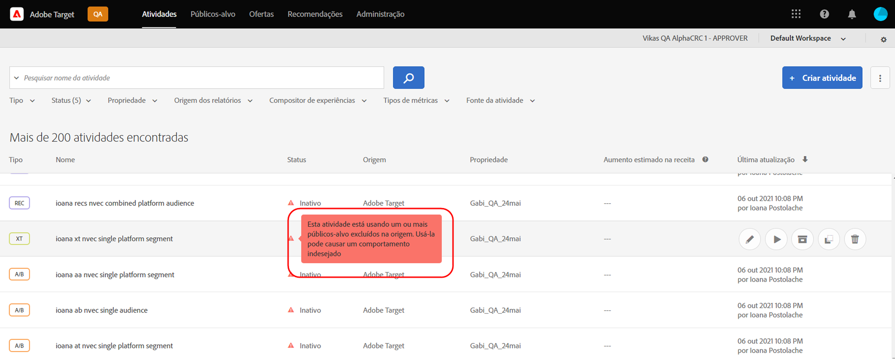
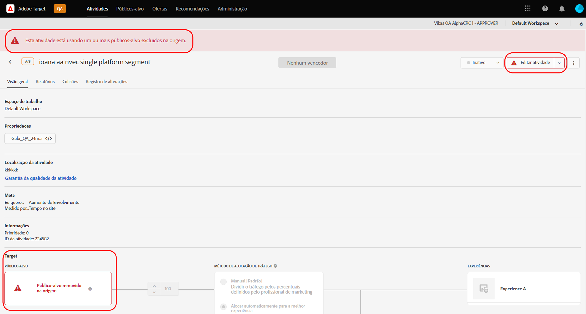

# Notas de versão do Target (atual)

Essas notas de versão fornecem informações sobre recursos, aprimoramentos e correções para cada versão do [!DNL Adobe Target Standard] e do [!DNL Target Premium] Além disso, as notas de versão para APIs do Target, SDKs, [!DNL Adobe Experience Platform Web SDK], at.js e outras alterações de plataforma também estão incluídas, quando aplicável.

>[!IMPORTANT]
>
>**Fim da vida útil da mbox.js**: a partir de 31 de março de 2021, o [!DNL Adobe Target] não oferecerá mais suporte à biblioteca de mbox.js. Após 31 de março de 2021, todas as chamadas feitas da mbox.js vão resultar em falha e afetar suas páginas com atividades do [!DNL Target] em execução ao veicular conteúdo padrão.
>
>Migre para a versão mais recente do novo [!DNL Adobe Experience Platform Web SDK] ou para a biblioteca at.js JavaScript para evitar possíveis problemas com seus sites. Para obter mais informações, consulte [Visão geral: implementar o Target para Web do lado do cliente](/help/c-implementing-target/c-implementing-target-for-client-side-web/implement-target-for-client-side-web.md).

(Os números de edição entre parênteses são para uso interno da [!DNL Adobe].)

## at.js versão 2.7.0 (28 de outubro de 2021)

Esta versão contém o seguinte aprimoramento:

* Suporte adicionado para [Componentes da Web](https://developer.mozilla.org/en-US/docs/Web/Web_Components). Essa versão da at.js é necessária para criar e testar experiências e ofertas personalizadas em elementos personalizados e em elementos dentro de elementos personalizados. Essa funcionalidade está incluída no [!DNL Target Standard/Premium] Versão 21.10.5.

## [!DNL Target Standard/Premium] 21.10.5 (28 de outubro de 2021)

Esta versão de manutenção contém as seguintes melhorias:

| Recurso | Detalhes |
| --- | --- |
| [!UICONTROL Visual Experience Composer] (VEC) | Suporte adicionado para [Componentes da Web](https://developer.mozilla.org/en-US/docs/Web/Web_Components). Experiências e ofertas personalizadas podem ser criadas e testadas em elementos personalizados e em elementos dentro de elementos personalizados. Para obter mais informações, consulte [Opções do Visual Experience Composer](/help/c-experiences/c-visual-experience-composer/viztarget-options.md#custom). |

## [!DNL Target Standard/Premium] 21.10.4 (21 de outubro de 2021)

Esta versão de manutenção contém as seguintes melhorias:

| Recurso | Detalhes |
| --- | --- |
| Recommendations baseado em carrinho | Uma nova família de algoritmos foi adicionada para fornecer recomendações com base no conteúdo do carrinho do visitante. Para obter mais informações, consulte &quot;Baseado em carrinho&quot; em [Criar critérios](/help/c-recommendations/c-algorithms/create-new-algorithm.md) e &quot;Páginas de finalização/exibições/finalização do carrinho&quot; e &quot;Excluir itens já no carrinho do visitante&quot; em [Planejar e implementar o Recommendations](/help/c-recommendations/plan-implement.md). |

## [!DNL Target Standard/Premium] 21.10.3 (19 de outubro de 2021)

Esta versão do inclui os seguintes aprimoramentos, correções e alterações:

* Correção de problemas que impedia os clientes de abrir o [!UICONTROL A4T] no painel [!DNL Analysis Workspace] clicando no botão [!UICONTROL Exibir no Analytics] botão em [!DNL Target] relatório de atividades. (TGT-42099, TGT-42100)
* Correção de um problema que causava o [!UICONTROL Editar design] botão para não ser exibido durante a edição [!UICONTROL Teste A/B] e [!UICONTROL Direcionamento de experiência] (XT) usando o [!UICONTROL Experience Composer baseado em formulário]. (TGT-41980)
* Correção de um problema que impedia o [!UICONTROL Compatível] da exibição da caixa de seleção na seleção de critérios ao criar um novo [!UICONTROL Recommendations] atividade . (TGT-42053)
* Correção de uma mensagem de erro incorreta que era exibida quando não era possível selecionar [!DNL Analytics] como fonte de relatórios (A4T) devido à falta de [!DNL Analytics] permissões. (TGT-41954)
* Implementamos várias correções de acessibilidade para melhorar a navegação pelo teclado na [!DNL Target] IU.

## [!DNL Target Standard/Premium] 21.10.2 (13 de outubro de 2021)

Os seguintes aprimoramentos foram adicionados ao usar [!DNL Target] [!UICONTROL Públicos-alvo] com o [!DNL Adobe Experience Platform Web SDK]:

* Ícones, props e mensagens de aviso adicionados em vários locais na [!DNL Target] IU para indicar que o público-alvo foi excluído na origem e não está mais disponível para uso em [!DNL Target] atividades.

   As ilustrações a seguir mostram alguns dos locais que os ícones, as fontes e as mensagens são exibidos:

   * [!UICONTROL Atividade] página de lista

      

   * Atividade [!UICONTROL Visão geral] páginas:

      

   * [!UICONTROL Experiências] etapa do fluxo de trabalho de criação da atividade:

      ![Público-alvo excluído na mensagem de origem em [!UICONTROL Experiências] página](assets/deleted-at-source-experiences.png)

   * [!UICONTROL Direcionamento] etapa do fluxo de trabalho de criação da atividade:

      ![Público-alvo excluído na mensagem de origem em [!UICONTROL Direcionamento] página](assets/deleted-at-source-targeting.png)

   * [!UICONTROL Metas e configurações] etapa do fluxo de trabalho de criação da atividade:

      ![Público-alvo excluído na mensagem de origem no [!UICONTROL Metas e configurações] página](assets/deleted-at-source-goals-settings.png)

   * Refinamentos do público-alvo ([!UICONTROL Substituir público-alvo] no [!UICONTROL Direcionamento] etapa do fluxo de trabalho de criação da atividade):

* Se você tentar usar o recurso Combinar públicos-alvo e um dos públicos-alvo foi excluído na origem, [!UICONTROL Salvar] está desativado.

## [!DNL Target Standard/Premium] 21.10.1 (6 de outubro de 2021)

Este lançamento inclui os seguintes novos recursos:

| Recurso | Detalhes |
| --- | --- |
| [!UICONTROL Atualização da interface do usuário de públicos-alvo] | Como parte do [!DNL Adobe Target] esforço contínuo da equipe para melhorar a experiência do usuário para [!DNL Target] usuários, esta versão atualiza o [!UICONTROL Públicos-alvo] e [!UICONTROL Scripts de perfil] nas [!DNL Target] IU. Essa atualização unifica e padroniza padrões de design que eram inconsistentes anteriormente, além de adicionar novas melhorias, como:<ul><li>A capacidade de selecionar e excluir vários públicos simultaneamente</li><li>Uma atualização [design do audience builder](/help/c-target/c-audiences/create-audience.md)</li><li>Suporte a regras de exclusão no [!UICONTROL Público] construtor de regras de biblioteca</li><li>Um novo filtro &quot;Fonte de público-alvo&quot;, para permitir uma descoberta de público-alvo mais rápida</li><li>Opções de filtro e pesquisa persistente da sessão</li></ul>Para obter mais informações, consulte [Públicos](/help/c-target/target.md). **OBSERVAÇÃO**: O novo [!UICONTROL Públicos-alvo] A interface do usuário está disponível somente para clientes selecionados. A atualização será gradualmente lançada para todos os clientes a partir de janeiro de 2022. |
| [!UICONTROL Scripts de perfil] Atualização da interface do usuário | O [!UICONTROL Scripts de perfil] A biblioteca também foi atualizada e inclui uma interface atualizada e várias atualizações de produtividade:<ul><li>A capacidade de selecionar e excluir vários scripts de perfil simultaneamente</li><li>Um novo editor de código para scripts de perfil</li><li>Realce da sintaxe e verificação de erros no editor de código</li><li>Parâmetros de tokens de preenchimento automático (mbox ou perfil) por meio de atalhos do teclado</li></ul>Para obter mais informações, consulte [Perfis do visitante](/help/c-target/c-visitor-profile/visitor-profile.md). **OBSERVAÇÃO**: O novo [!UICONTROL Scripts de perfil] A interface do usuário está disponível somente para clientes selecionados. A atualização será gradualmente lançada para todos os clientes a partir de janeiro de 2022. |
|  Criar e editar critérios do Recommendations | O [!UICONTROL Critérios da Recommendations] o fluxo de trabalho de criação e edição foi simplificado para simplificar a escolha do algoritmo de recomendações e das configurações corretas para atingir suas metas. Para obter mais informações, consulte [Criar critérios](/help/c-recommendations/c-algorithms/create-new-algorithm.md). |
|  Melhorias na janela de lookback do Recommendations e na taxa de atualização do algoritmo | Agora é possível executar os algoritmos &quot;Mais visualizados&quot; e &quot;Mais vendidos&quot; com uma janela de retrospectiva de seis horas para capturar o conteúdo das tendências mais recentes. Quando a janela de retrospectiva de seis horas é selecionada, os resultados das recomendações são atualizados a cada 3 a 6 horas ao longo do dia. Para obter mais informações, consulte [Fonte de dados](/help/c-recommendations/c-algorithms/create-new-algorithm.md#data-source) em *Criar critérios*. |

## Notas de versão adicionais e detalhes da versão

| Recurso | Detalhes |
|--- |--- |
| [Notas de versão: SDK da Web da Platform Experience do Adobe Target](https://experienceleague.adobe.com/docs/experience-platform/edge/release-notes.html?lang=pt-BR) | Detalhes sobre alterações em cada versão do SDK da Web da plataforma. |
| [Detalhes da versão da at.js](/help/c-implementing-target/c-implementing-target-for-client-side-web/target-atjs-versions.md) | Detalhes sobre alterações em cada versão da biblioteca at.js de JavaScript do [!DNL Adobe Target]. |

## Alterações na documentação, notas de versão anteriores e notas de versão da Experience Cloud

Além das notas para cada versão, os recursos a seguir oferecem informações adicionais:

| Recurso | Detalhes |
|--- |--- |
| Alterações de documentação | Veja informações detalhadas sobre atualizações neste manual que podem não estar incluídas nas notas de versão. Para obter mais informações, consulte [Alterações de documentação](/help/r-release-notes/doc-change.md#reference_366123CF00994BACBBF9BBDF2C4D840C). |
| Notas de versão para versões anteriores | Veja informações sobre os novos recursos e aprimoramentos das versões anteriores do Target Standard e do Target Premium. Para obter mais informações, consulte [Notas de versões anteriores](/help/r-release-notes/release-notes-for-previous-releases.md). |
| Notas de versão da Adobe Experience Cloud | Veja as notas de versão mais recentes para as soluções da Adobe Experience Cloud. Para obter mais informações, consulte as [Notas de versão da Experience Cloud](https://experienceleague.adobe.com/docs/release-notes/experience-cloud/current.html?lang=pt-BR). |

## Informações de pré-lançamento {#section_5D588F0415A2435B851A4D0113ACA3A0}

Os recursos a seguir permitem ver as novidades previstas para a próxima versão do Target.

| Recurso | Detalhes |
|--- |--- |
| Atualização de produtos prioritários da Adobe | Para receber notificações antecipadas sobre as melhorias futuras de produtos para o Target e outras soluções da Adobe Experience Cloud, inscreva-se para obter a Atualização prioritária de produtos da Adobe: [https://www.adobe.com/subscription/priority-product-update.html](https://www.adobe.com/subscription/priority-product-update.html) |
| Notas de versão futuras | Para obter informações sobre os lançamentos do Target do mês atual, incluindo informações de pré-lançamento, consulte a página [Notas de versão do Target - Pré-lançamento](/help/r-release-notes/target-release-notes.md). |
