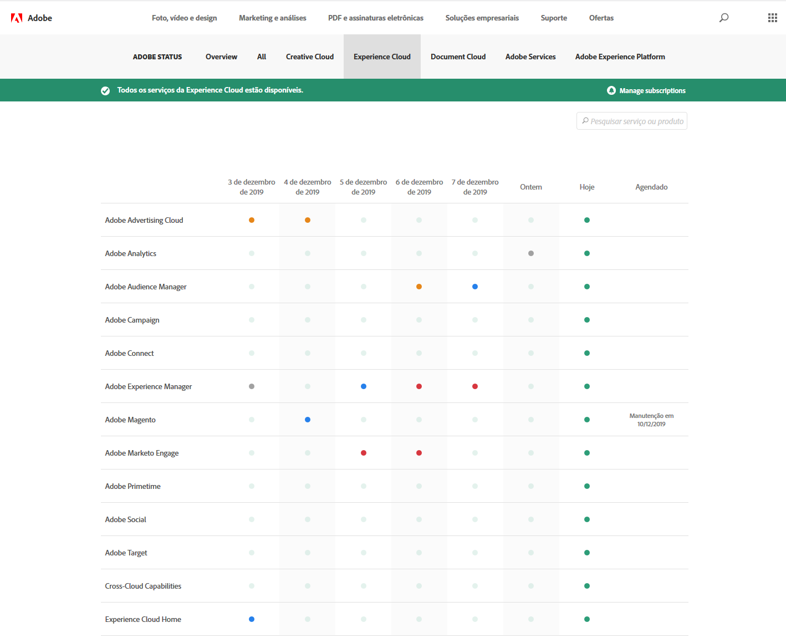

# Atualizações do status do sistema e notificações proativas

Use a página [!UICONTROL Status do sistema da Adobe] e as notificações proativas para manter-se informado sobre o status dos produtos da [!DNL Adobe] e das soluções da [!DNL Adobe Experience Cloud]. As notificações proativas alertam você sobre eventos de interrupção e manutenção.

## Atualizações do status do sistema

Use a página [!UICONTROL Status do sistema da Adobe] para visualizar o status atual do [!DNL Target] e outros produtos da [!DNL Adobe] e das soluções da [!DNL Adobe Experience Cloud]. Esta página ajuda a determinar se os problemas encontrados foram causados por atualizações do sistema ou pela manutenção de rotina.

Acesse a página [!UICONTROL Status do sistema] no seguinte URL:

[https://status.adobe.com](https://status.adobe.com)

Para ver o status das soluções da [!DNL Experience Cloud], incluindo o [!DNL Target], clique na guia [!UICONTROL Experience Cloud].

A parte superior da página contém informações sobre eventos de manutenção em andamento e inclui um link para se inscrever em atualizações de soluções individuais.

Na ilustração acima, [!DNL Adobe Analytics], [!DNL Adobe Target] e [!DNL Adobe Campaign] estavam em manutenção. Todos os outros produtos e soluções estavam funcionando normalmente. É sempre bom verificar essa página se tiver problemas ao usar o [!DNL Target].

Uma notificação no produto é sempre exibida durante o lançamento mensal do [!DNL Target], mas, às vezes, ocorrem pequenas atualizações e elas são listadas nessa página.

A parte inferior da página contém um calendário dos últimos sete dias com status para cada solução por dia. Passe o mouse sobre o indicador de status, para obter mais informações:

## Notificações proativas

As notificações proativas são alertas de email enviadas aos clientes registrados para os seguintes eventos que afetam os serviços incluídos no perfil do cliente, incluindo o [!DNL Target]:

* Alertas no nível da solução (não isola serviços específicos da solução)
* CSOs (Eventos de interrupção) de Gravidade 1 e Gravidade 2
* CMRs (Eventos de manutenção)

>[!NOTE]
>
>Você precisa se registrar para receber esses alertas. Entre em contato com o Gerente de sucesso do cliente (CSM) do [!DNL Adobe] ou o Executivo de conta (AE) do [!DNL Adobe] para dar início ao processo de registro.

As ilustrações a seguir são exemplos de alertas de email da notificação proativa:

