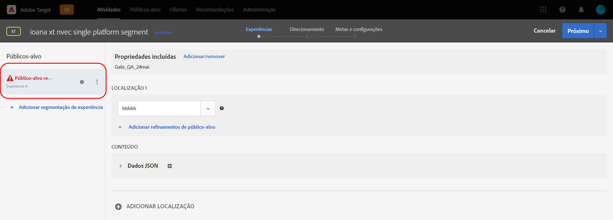
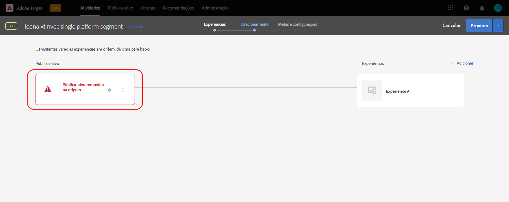

# Notas de versão do Target (pré-lançamento)

Este artigo contém informações de pré-lançamento. As datas de lançamento, os recursos e outras informações estão sujeitos à mudança sem aviso prévio.

**Última atualização em: 11 outubro de 2021**

Para ver informações sobre a versão atual, consulte [Notas de versão do Target](release-notes.md). As informações nessas páginas podem ser as mesmas, dependendo do momento dos lançamentos. Os números de edição entre parênteses são para uso interno da [!DNL Adobe].

>[!IMPORTANT]
>
>**Fim da vida útil da mbox.js**: a partir de 31 de março de 2021, o [!DNL Adobe Target] não oferecerá mais suporte à biblioteca de mbox.js. Após 31 de março de 2021, todas as chamadas feitas da mbox.js vão resultar em falha e afetar suas páginas com atividades do [!DNL Target] em execução ao veicular conteúdo padrão.
>
>Para evitar possíveis problemas com seus sites, migre para a versão mais recente do novo [!DNL Adobe Experience Platform Web SDK] ou para a biblioteca at.js de JavaScript. Para obter mais informações, consulte [Visão geral: implementar o Target para Web do lado do cliente](/help/c-implementing-target/c-implementing-target-for-client-side-web/implement-target-for-client-side-web.md).

## [!DNL Target Standard/Premium] 21.10.2 (13 de outubro de 2021)

Os seguintes aprimoramentos foram adicionados ao usar [!DNL Target] [!UICONTROL Públicos-alvo] com o [!DNL Adobe Experience Platform Web SDK]:

* Adicionados ícones de aviso, ofertas e mensagens em vários locais na interface do usuário [!DNL Target] para indicar que o público-alvo foi excluído na origem e não está mais disponível para uso em atividades [!DNL Target].

   As ilustrações a seguir mostram alguns dos locais que os ícones, as fontes e as mensagens são exibidos:

   *  Página da lista de atividades

      

   * Páginas de [!UICONTROL Visão geral] da atividade:

      

   *  Etapa de experiências do fluxo de trabalho de criação de atividades:

      

   *  Etapa de direcionamento do fluxo de trabalho de criação de atividades:

      

   * [!UICONTROL Etapa Metas e ] configurações do fluxo de trabalho de criação da atividade:

      ![Público-alvo excluído na mensagem de origem na página  [!UICONTROL Metas e ] configurações](assets/deleted-at-source-goals-settings.png)

   * Refinamentos do público-alvo ([!UICONTROL Substitua o público-alvo] na etapa [!UICONTROL Direcionamento] do fluxo de trabalho de criação de atividades):

* Se você tentar usar o recurso Combinar públicos-alvo e um dos públicos-alvo tiver sido excluído na origem, [!UICONTROL Salvar] estará desativado.

## Informações de pré-lançamento {#section_7B9D4AAFC6A74388B9D7DEF0658D8B63}

Para receber notificações antecipadas sobre as melhorias futuras de produtos para o Target e outras soluções da Adobe Experience Cloud, inscreva-se para obter a Atualização prioritária de produtos da Adobe:

[https://www.adobe.com/subscription/priority-product-update.html](https://www.adobe.com/subscription/priority-product-update.html)
